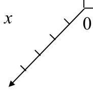
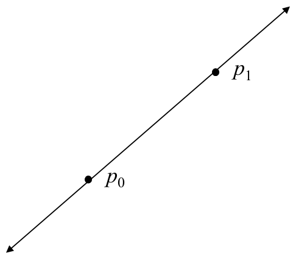
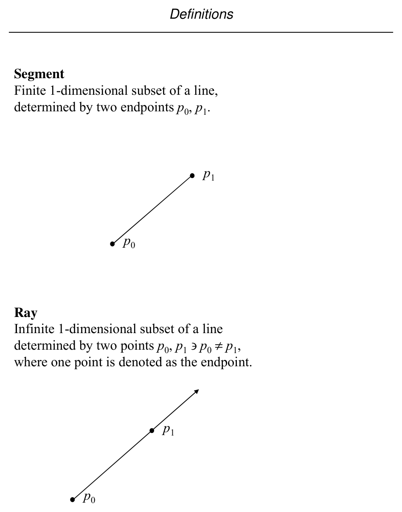
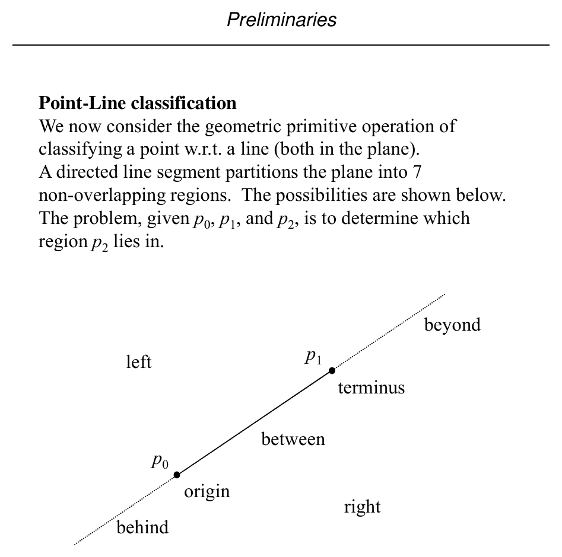
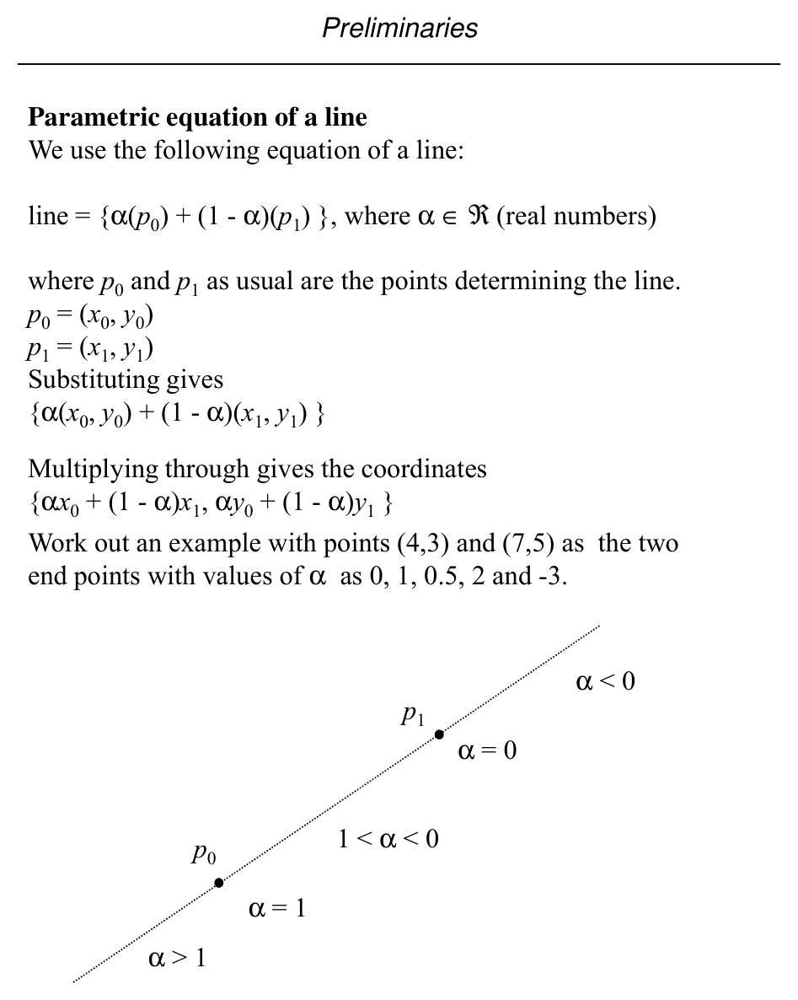
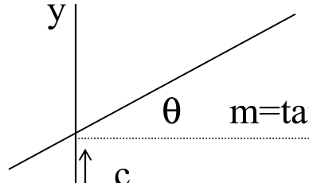
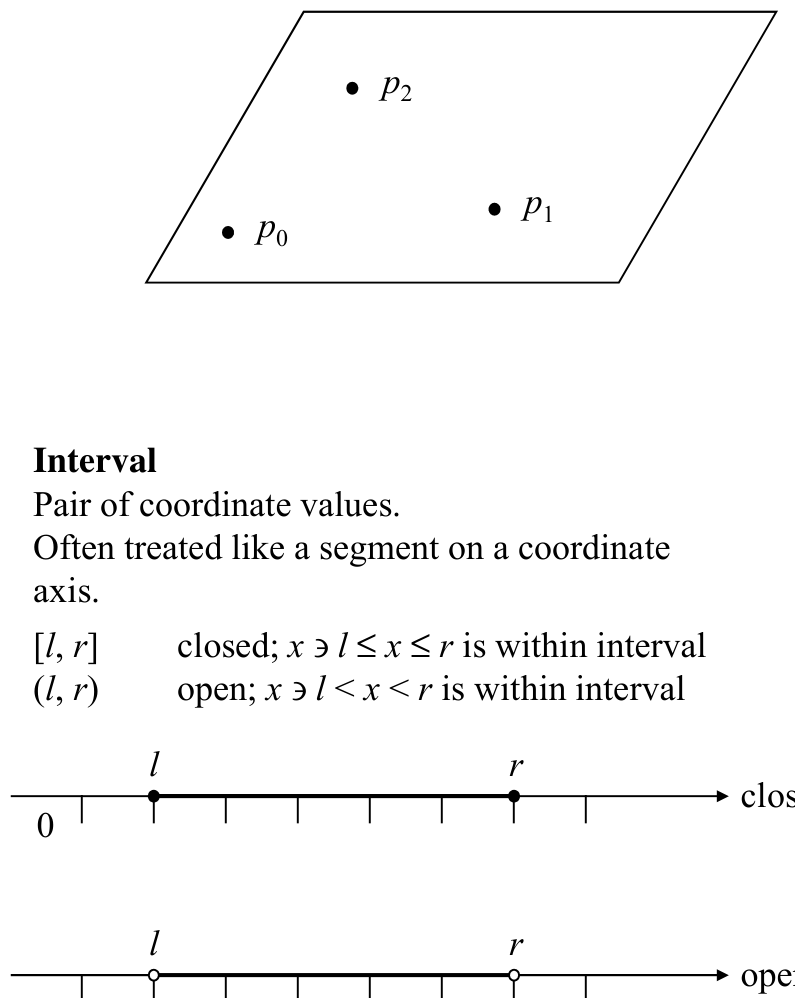
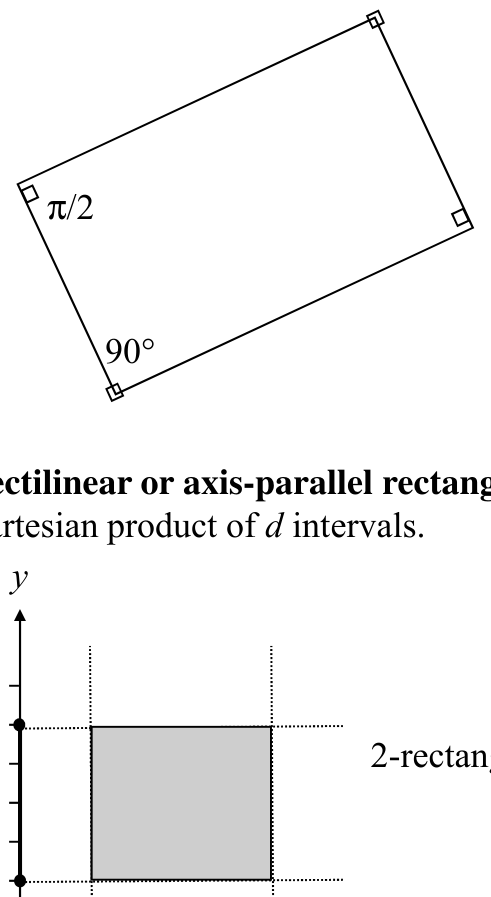

# Coordinate Systems and Basic Geometric Objects

**Slides covered:** 9–19  

**Topic folder:** 01 Foundations

## Fast take

- Work in **d-space** and be precise about what the object is: point, line, segment, ray, plane, interval, rectangle.
- Use the **parametric form** of a line because it also tells you where points are: on the segment, beyond an endpoint, or behind it.
- A segment is the same line equation with **0 ≤ α ≤ 1**, so it is a **convex combination** of the endpoints.
- **Rectilinear / axis-parallel** means aligned with the coordinate axes. **Hyper-** means the dimension is unspecified.

## Recording notes

**Recording references:** `CS 564 - 01.23 1.1.txt`, `CS 564 - 01.28 2.1.txt`

- The lecture treated this as vocabulary you must get right before algorithms start. If the object type is vague, everything later becomes a mess.
- The instructor repeatedly preferred the **parametric view** over slope-intercept form because it works cleanly for vertical lines and classification tasks.
- Be careful with naming: **rectangle** usually means 2D, **d-rectangle** fixes the dimension explicitly, and **hyper-rectangle** leaves it open.
- This topic is not “just definitions”. These objects become the inputs, query ranges, and primitive test operands in later algorithms.

## Motivation

This file introduces the language of computational geometry: coordinates, dimensions, points, lines, segments, rays, planes, and rectangles. The goal is to know exactly what the basic objects are before any algorithm starts doing clever things.

## Lecture Roadmap

- Know the problem definition.
- Know the main geometric idea.
- Know the key data structure or primitive test.
- Know the preprocessing / query / storage or total running time.
- Know one small example by hand.

## Detailed lecture notes

### Slide 9: Objects and coordinate systems

Objects considered in computational geometry include points, lines, line segments, polygons, polyhedra, hyper-rectangles, and related structures.

A **coordinate system** specifies positions in space. The **Cartesian** system uses \(d\) mutually perpendicular (orthogonal) axes for \(d\)-dimensional space (**\(d\)-space**).

- **Notation:** \(d\) is the number of dimensions of the space or of a geometric object.
- A prefix **\(d\)-** on an object name denotes its dimension, e.g. **\(d\)-rectangle** or **2-rectangle**.
- We most often use \(d = 2\) (the plane) as the default; sometimes \(d = 1\) or \(d > 2\).
- We use a **right-handed** coordinate system (see figure).

### Slide 10: Point, line

**Point** — An object with \(d\) dimensions and zero extent: a location in \(d\)-space, given as an ordered \(d\)-tuple of coordinates:

| Dimension | Coordinates |
|-----------|-------------|
| \(d = 1\) | \((x)\) or \(x\) |
| \(d = 2\) | \((x, y)\) |
| \(d = 3\) | \((x, y, z)\) |
| \(d \ge 4\) | \((x_1, x_2, \ldots, x_d)\) or \((x_0, x_1, \ldots, x_{d-1})\) |

**Line** — An infinite one-dimensional set of collinear points, determined by two distinct points \(p_0, p_1\) with \(p_0 \neq p_1\).

### Slide 11: Line segment, ray

**Line segment** — A finite one-dimensional subset of a line, determined by two endpoints \(p_0\) and \(p_1\).

**Ray** — An infinite one-dimensional subset of a line determined by two distinct points \(p_0 \neq p_1\), where one point is designated the **endpoint** (origin of the ray).

### Slide 12: Point–line classification (preview)

We classify a point with respect to a line (in the plane). A **directed** line segment partitions the plane into seven disjoint regions. Given \(p_0\), \(p_1\), and \(p_2\), the task is to determine which region contains \(p_2\) (e.g. left, right, between, origin, terminus, beyond, behind — see figure).

### Slide 13: Parametric form of a line

A line through points \(p_0\) and \(p_1\) can be written as

\[
\{\alpha p_0 + (1-\alpha) p_1 : \alpha \in \mathbb{R}\},
\]

where \(p_0 = (x_0, y_0)\) and \(p_1 = (x_1, y_1)\). Substituting gives

\[
\{\alpha(x_0, y_0) + (1-\alpha)(x_1, y_1)\}
= \{(\alpha x_0 + (1-\alpha)x_1,\; \alpha y_0 + (1-\alpha)y_1)\}.
\]

**Example:** For endpoints \((4,3)\) and \((7,5)\), try \(\alpha \in \{0, 1, 0.5, 2, -3\}\) to see interpolation and extension along the line.

### Slide 14: Line segment as restricted parameter

A **line segment** is the closed subset of the line between the two endpoints: same parametric form as the line, with **\(0 \le \alpha \le 1\)**. This is the **convex combination** of the two endpoints.

### Slide 15: Slope–intercept and implicit forms

Non-vertical lines are often written \(y = mx + c\), where \(m = \tan\theta\) is the slope and \(c\) is the \(y\)-intercept. Vertical lines \(x = k\) have “infinite slope” and are not captured by \(y = mx + c\) alone.

Using two points \((x_1,y_1)\) and \((x_2,y_2)\) on the line (with \(x_2 \neq x_1\) unless vertical):

\[
y = \frac{y_2 - y_1}{x_2 - x_1}\, x + \frac{y_1 x_2 - y_2 x_1}{x_2 - x_1},
\]

or equivalently the **implicit** form

\[
(x_2 - x_1)(y - y_1) = (y_2 - y_1)(x - x_1).
\]

If \(x_2 = x_1\) and \(y_2 \neq y_1\), this is the vertical line \(x = x_1\).

### Slide 16: Affine combinations

Coefficients in implicit line equations are not unique: scaling \((A,B,C)\) by \(k \neq 0\) gives the same line.

In \(d\) dimensions, given points \(p_1, p_2, \ldots, p_k\), the set

\[
p = \alpha_1 p_1 + \alpha_2 p_2 + \cdots + \alpha_k p_k,
\]

where the \(\alpha_i\) are real and **\(\sum_i \alpha_i = 1\)**, is an **affine combination** of those points.

- \(k = 2\): the line through two points.  
- \(k = 3\): a plane (in 3-space).  
- Larger \(k\): a **hyperplane** in the general case.

### Slide 17: Plane, interval

**Plane** — Infinite two-dimensional subset of space determined by three **non-collinear** points \(p_0, p_1, p_2\) (pairwise distinct and not on one line).

**Interval** — A pair of coordinate values on an axis, often like a 1D segment:

- **Closed** \([l,r]\): \(x\) lies in the interval iff \(l \le x \le r\).  
- **Open** \((l,r)\): iff \(l < x < r\).

### Slide 18: Rectangle

A **rectangle** is a quadrilateral with opposite sides parallel and only right angles (\(90^\circ\) or \(\pi/2\) radians).

**Axis-parallel (rectilinear) rectangle** — Cartesian product of \(d\) intervals (a **2-rectangle** or simply **rectangle** in the plane).

### Slide 19: Naming dimensions

- With **no** prefix **\(d\)-**, the object uses the usual dimension (e.g. **rectangle** means 2D; **cube** means 3D).
- Prefix **hyper-** means \(d\) is unspecified and may exceed the usual dimension (**hyper-rectangle** = \(d\)-rectangle).
- Phrase used in the slides: “\(d\)-dimensional rectilinear hyper-rectangle.”

## Recap

- **Objects:** In \(d\)-space, a **point** is a \(d\)-tuple; **lines**, **segments**, **rays**, and **planes** are built from points and parametric or implicit equations; **intervals** on an axis and **axis-parallel rectangles** (Cartesian products of intervals) are the usual “simple” regions.
- **Lines:** \(\alpha p_0 + (1-\alpha)p_1\) gives a line; restricting \(0 \le \alpha \le 1\) gives the **segment** (convex combination of endpoints). Vertical lines need the **implicit** form when slope–intercept breaks down.
- **Affine combinations** (\(\sum \alpha_i = 1\)) generalize lines (\(k=2\)), planes (\(k=3\)), and hyperplanes in higher \(d\).
- **Naming:** the prefix **\(d\)-** fixes dimension; **hyper-** means \(d\) is general (e.g. hyper-rectangle).
