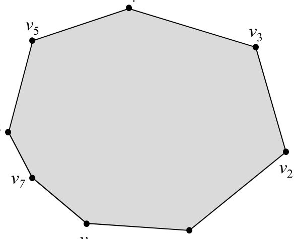
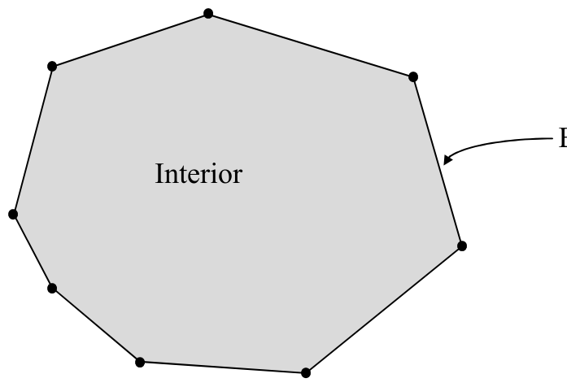
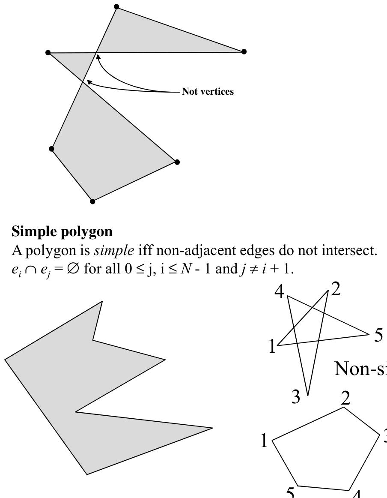
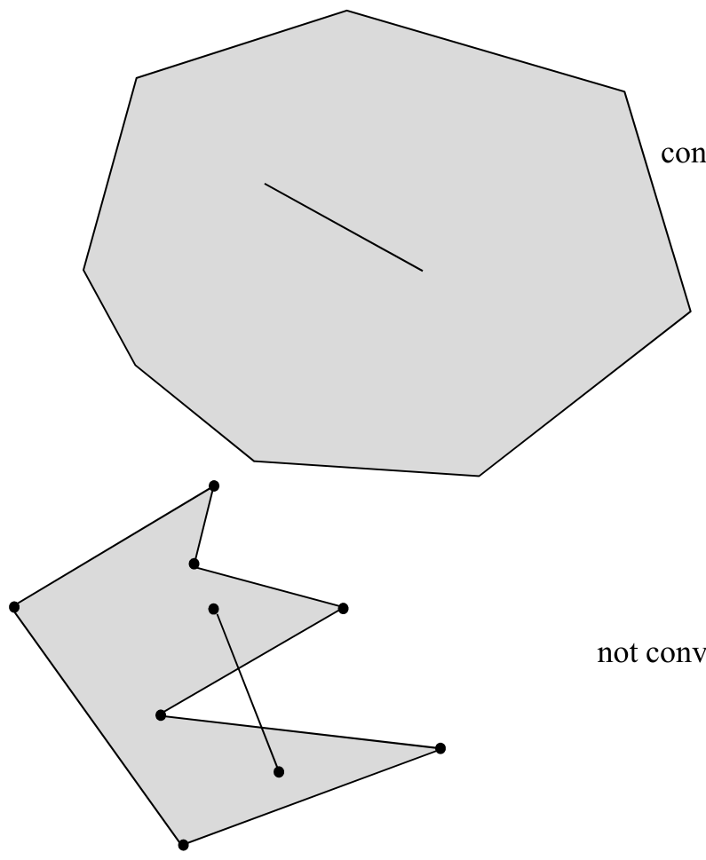
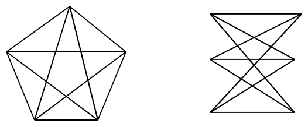
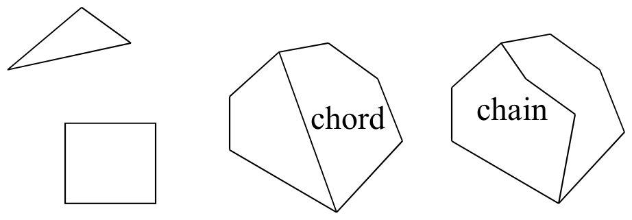
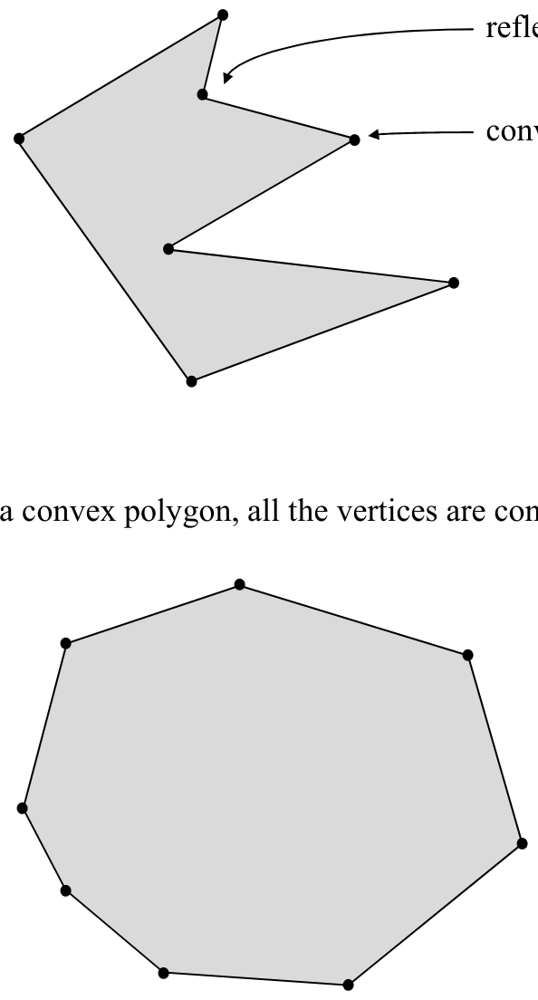

# Polygons, Convexity, Planar Graphs, and Polyhedra

**Slides covered:** 20-28  

**Topic folder:** 01 Foundations

## Motivation

This part defines polygons and their inside/outside, then connects geometry with graph structure. It also introduces convexity, planar graphs, Euler’s formula, and polyhedra.

## Lecture Roadmap

- Know the problem definition.
- Know the main geometric idea.
- Know the key data structure or primitive test.
- Know the preprocessing / query / storage or total running time.
- Know one small example by hand.

## Detailed lecture notes

### Slide 20: O’Rourke, pp. 1-2

- A polygon is the region of a plane bounded by a finite set of
- segments forming a simple closed curve.
- (Note that we are working in d = 2 by definition.)
- Let v0, v1, ..., vN-1 be N points in the plane; the points are
- called vertices.
- Let e0 = v0v1, e1 = v1v2, ..., eN-1 = vN-1v0 be N segments connecting the points; the segments are called edges.
- The edges bound a polygon iff the intersection of each pair of edges adjacent in the ordering is the single vertex shared
- between them:  ei ∩ei+1 = vi+1 for i = 0, N - 1 v0 v1 v2 v3 v4
- v5 v6 v7
- Vertices are numbered in counterclockwise sequence by convention.
- N = 8

### Slide 21: Interior and exterior

- Jordan curve theorem.  Every simple closed plane curve divides the plane into two parts.
- Exterior
- Interior
- Boundary
- Polygon = interior ∪boundary
- If we are interested in just the interior or just the boundary,
- they will be referred to as such.
- (Same as true for other similar objects, e.g., rectangle.)

### Slide 22: Not vertices

- Si l l
- Simple polygon
- A polygon is simple iff non-adjacent edges do not intersect.
- ei ∩ej = ∅for all 0 ≤j, i ≤N - 1 and j ≠i + 1.
- Non-simple
- Simple (planar version of above)

### Slide 23: in Graph Theory.

- Convex polygon
- A polygon is convex if and only if for any two points in the
- polygon (interior ∪ boundary), the segment connecting the points
- is entirely within the polygon.
- convex not convex

### Slide 24: Let p and q be two arbitrary points in a d-dimensional Euclidean space belonging

- to a set of points C. Then C is said to be convex if for all pairs (p, q) in C, the set
- of points
- [p + (1- α)q] ε C  for 0<= α <=1
- That is, if two points p and q belong to C, then the set of points on the line segments
- connecting p and q also belong to C.
- When d=2, the points belong to a convex polygon.

### Slide 25: A graph G(V,E) is planar if it can be embedded in a plane without crossings.

- A straight line planar embedding of a planar graph determines a partition of the plane called
- planar subdivisions or a map.
- Let  v= number of vertices, e= number of edges and f=number of faces.
- Theorem (Euler) :   v  - e  +  f  =  2
- Proof: A simple polygon has always v=e and f=2 (interior and exterior).

### Slide 26: e+1 and f  becomes f+1. So the equation remains valid. If a chain is used with t new vertices and

- necessarily with t+1 edges, we have v  becomes v+t,  e becomes  e+t+1 and f becomes f+1. So, the
- Euler’s formula still remains valid.
- chord chain
- It can also be shown that for any planar graph, e <=  3v -6. Using Euler’s formula, we then
- have f <= 2/3 e and f <= 2v-4, giving the upper bounds on f  in terms of e and v, respectively.
- Furthermore, if each vertex has degree >= 3 (e.g., polyhedron) then, 3v<=2e, which yields e <= 3f-6
- and v <= 2f-4. All these relations are linear.

### Slide 27: In 3-d Euclidean space, a polyhedron is defined to be a finite set of planar polygons such that every

- edge of the polygon is shared by exactly one other neighboring polygon and no subset of polygons
- has the same property (to avoid union of polygons).
- Edges and vertices have usual meaning. The polygons are called the facets  of the polyhedron.
- A polyhedron is simple if there is no pair of non-adjacent facets sharing a point. A simple
- polyhedron partitions the 3-d space into two disjoint domains - the interior and the exterior.
- A simple polyhedron is convex if its interior is convex.
- The surface of a polyhedron is isomorphic to a planar subdivision (on a sphere). Thus the numbers
- v, e and f of a simple polyhedron obey Euler’s formula.

### Slide 28: A polygon vertex is convex if its interior angle ≤ π (180°).

- It is reflex if its interior angle > π (180°).
- convex reflex
- In a convex polygon, all the vertices are convex.

## Recap

- Keep the formal problem statement precise.
- Focus on the geometric invariant used by the method.
- Remember the key complexity bound and when it applies.
