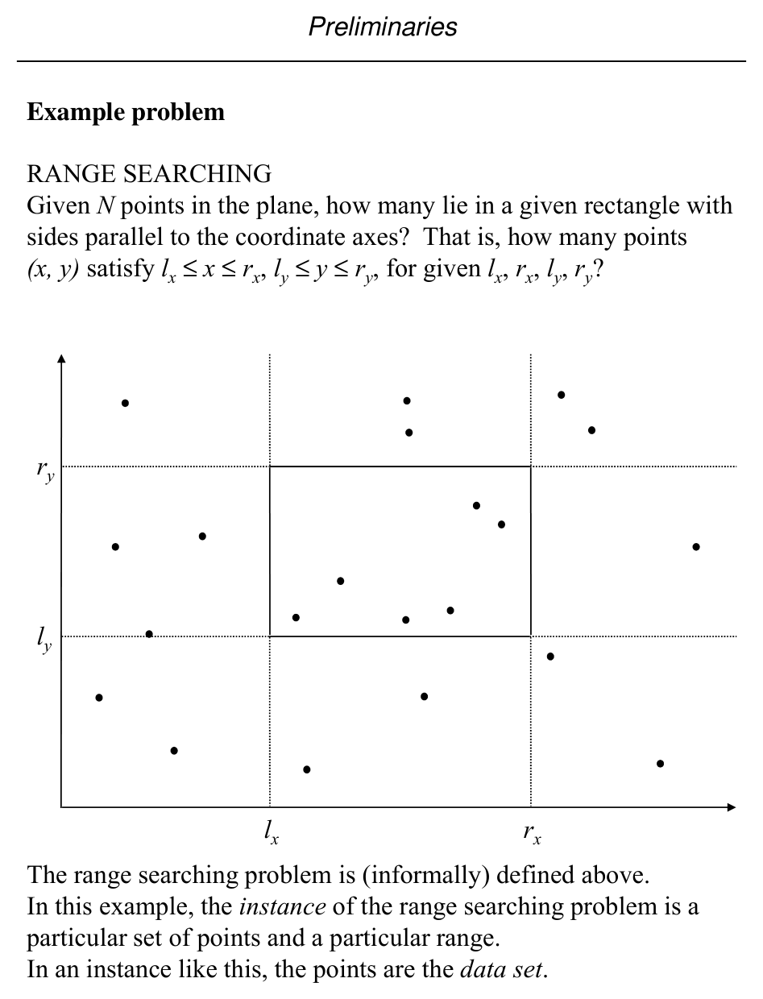
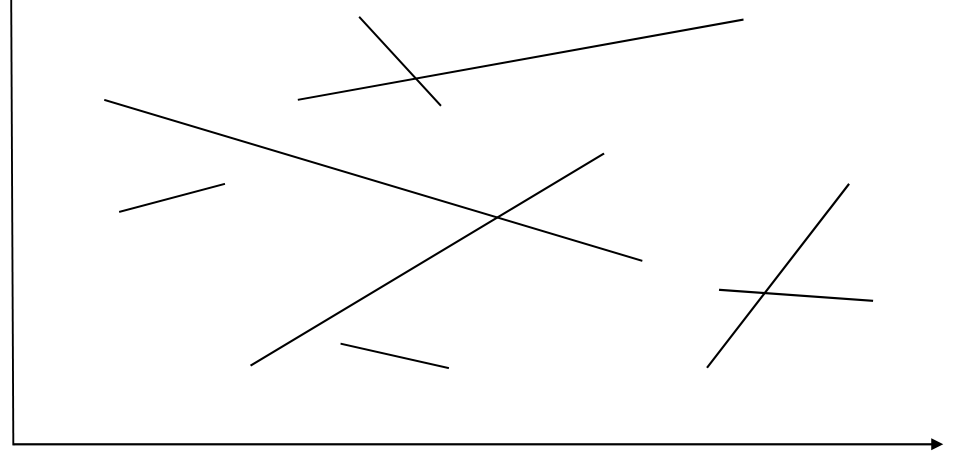
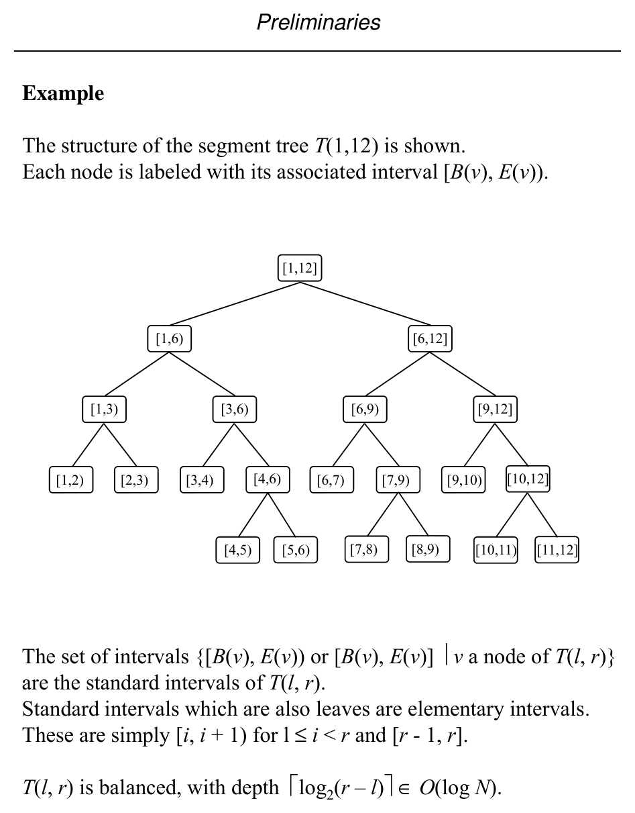
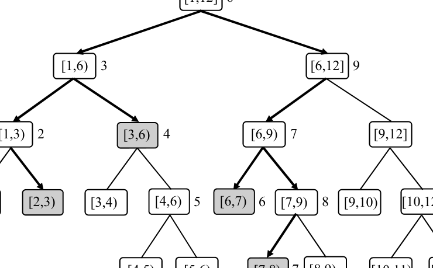
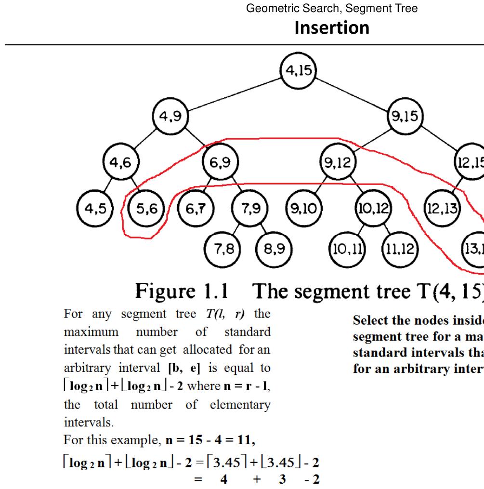
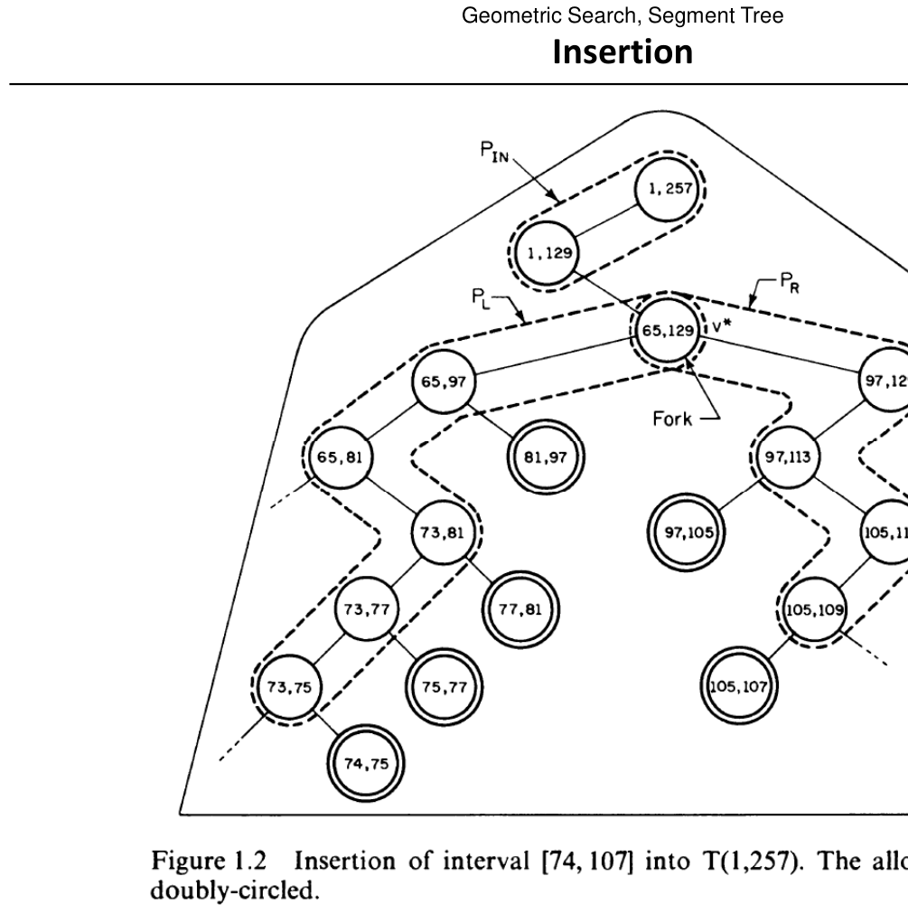

# Complexity Basics and Segment Trees

**Slides covered:** 29–44  

**Topic folder:** 01 Foundations

## Motivation

This file explains how geometric algorithms are measured, what counting versus reporting means, and why preprocessing matters. It also introduces the segment tree, a basic data structure used later.

## Lecture Roadmap

- Know the problem definition.
- Know the main geometric idea.
- Know the key data structure or primitive test.
- Know the preprocessing / query / storage or total running time.
- Know one small example by hand.

## Detailed lecture notes

### Slide 29: Range searching (informal)

**Problem:** Given \(N\) points in the plane, how many lie in an axis-aligned rectangle? That is, how many \((x,y)\) satisfy

\[
\ell_x \le x \le r_x,\qquad \ell_y \le y \le r_y
\]

for given \(\ell_x, r_x, \ell_y, r_y\)?

An **instance** consists of the point set and the query rectangle (the points are the **data set**).



### Slide 30: Model of computation

We want **efficient** algorithms; cost is a function of instance size \(N\).

We use an abstract **real RAM** (random-access machine), a slight variant of the model in Aho et al. (1974). **Unit-cost** primitives include:

1. Arithmetic: \(+, -, \times, /\)
2. Comparisons: \(<, \le, =, \neq, \ge, >\)
3. Memory access
4. Analytic functions: roots, trig, exp, log

Numbers are **reals** with infinite precision (idealized vs. actual hardware).

### Slide 31: Asymptotic notation

We measure **time** and **memory** as functions of input size \(N\).

| Notation | Meaning (intuitive) |
|----------|-------------------|
| **\(O(f(N))\)** (upper / worst-case bound) | \(g(N) \le C f(N)\) for large \(N\), some constant \(C > 0\) |
| **\(\Omega(f(N))\)** (lower bound) | \(g(N) \ge C f(N)\) for large \(N\) |
| **\(\Theta(f(N))\)** (tight) | \(C_1 f(N) \le g(N) \le C_2 f(N)\) for large \(N\) |

**Notes:**

- These denote **sets** of functions; one writes \(f(N) \in O(\log N)\) (the slides also use “\(=\)” informally).
- Dominant terms control growth, e.g. \(4N + 20\log N + 100 \in O(N)\).
- Most discussion emphasizes **worst-case** bounds.

### Slide 32–33: Segment intersection counting

**INSTANCE:** A set \(S = \{s_1, s_2, \ldots, s_N\}\) of line segments in the plane.  
**QUESTION:** Count how many **pairs** of distinct segments intersect.

**Naive algorithm (conceptual):**

```
count ← 0
for i = 1 to N
  for j = 1 to N
    if i ≠ j and s_i ∩ s_j ≠ ∅ then count ← count + 1
output count
```

- **Storage:** \(O(N)\) for \(S\)  
- **Time:** \(O(N^2)\) nested loops  
- Assumes a primitive **segment–segment intersection** test.



### Slide 34: Preprocessing, query, storage; modes

- **Preprocessing** — One-time cost to organize the data (often into a structure).
- **Query** — Cost to answer one query against that structure.
- **Storage** — Memory for static/dynamic structures.

**Single-shot:** one data set, one query — often best to scan in \(O(N)\) time, \(O(N)\) space, **no** preprocessing.

**Repetitive mode:** one data set, **many** queries — we may pay preprocessing to make each query faster than \(O(N)\).

### Slide 35: Counting vs. reporting

**Reporting** — List all objects satisfying the query.

**Range searching (formal instance):**

- **INSTANCE:** Point set \(S = \{p_1,\ldots,p_N\}\), \(p_i = (x_i,y_i)\), and axis-aligned rectangle \(R = [\ell_x, r_x] \times [\ell_y, r_y]\).
- **QUESTION (counting):** How many points of \(S\) lie in \(R\)?
- **QUESTION (reporting):** **Which** points lie in \(R\)?

### Slide 36: Output-sensitive complexity

**Interval enclosure example**

- **INSTANCE:** Points \(S = \{x_1,\ldots,x_N\}\) on the real line and query interval \(Q = [\ell, r]\).
- **QUESTION:** Which points satisfy \(\ell \le x_i \le r\)?

**Repetitive-mode approach:**

1. **Preprocessing:** Sort \(S\) into array \(A\) — **\(O(N \log N)\)**.  
2. **Query:** Binary search for lower bound \(\ge \ell\) and upper bound \(\le r\) — **\(O(\log N)\)** each.  
3. **Report** all points in the index range — **\(O(K)\)** if \(K\) points are reported.

So query time is **\(O(\log N + K)\)** when reporting matters; without listing output, counting can be **\(O(\log N)\)**.

### Slide 37: Other cost notions

- **Preprocessing cost** — Trade-offs between space, preprocessing time, and query time.
- **Amortized cost** — Average over mixes of cheap and expensive operations.
- **Normalization** — Map coordinates into \([1,N]\) by rank order. Usually **\(O(N \log N)\)** preprocessing sort and **\(O(\log N)\)** rank lookup per query when needed.

### Slide 38: Segment tree setup

Consider intervals on the real line whose endpoints come from a fixed set of \(N\) **abscissae**. The **segment tree** for scope \([\ell, r]\) is a fixed tree shape; intervals are stored in auxiliary structures at nodes.

Assume WLOG endpoints are **normalized** to \(\{1,\ldots,N\}\) and the tree is built for scope \([1,N]\).

**Node \(v\)** stores:

| Field | Meaning |
|-------|---------|
| \(B(v)\) | Start of \(v\)’s scope interval |
| \(E(v)\) | End of \(v\)’s scope interval |
| \(Lchild(v)\) | Left child = subtree over \([B(v), \lfloor(B(v)+E(v))/2\rfloor]\) |
| \(Rchild(v)\) | Right child (upper half-interval) |

Notation: \(T(\ell,r)\) = segment tree over scope \([\ell,r]\).

### Slide 39: Example \(T(1,12)\)

Each node is labeled with its associated half-open interval \([B(v), E(v))\) (see figure).



### Slide 40: Inserting an interval

Intervals with endpoints in \(\{\ell,\ell+1,\ldots,r\}\) can be maintained so insertion/deletion runs in **\(O(\log N)\)** per operation (per slide).

For \(r - \ell > 3\), an interval \([b,e]\) is **partitioned** into **standard** (canonical) node intervals; the number of pieces is **\(O(\log N)\)**.

**`InsertSegmentTree(b, e, v)`** (sketch):

1. If \([B(v),E(v))\) is fully covered by \([b,e]\), attach the interval to \(A(v)\) and return.  
2. Else, if \(b < \lfloor(B(v)+E(v))/2\rfloor\), recurse on \(Lchild(v)\).  
3. If \(\lfloor(B(v)+E(v))/2\rfloor < e\), recurse on \(Rchild(v)\).

### Slide 41: Structure after insertions

Illustration of \(T(1,12)\) with midpoint splits \(\lfloor(B(v)+E(v))/2\rfloor\) at internal nodes (see figure).



### Slide 42–43: Insertion figures





### Slide 44: Deleting an interval

**`DeleteSegmentTree(b, e, v)`** mirrors insertion: if \([B(v),E(v))\) is fully inside \([b,e]\), remove the interval from \(A(v)\); otherwise recurse to children as in insertion.

## Recap

- Keep the formal problem statement precise.
- Focus on the geometric invariant used by the method.
- Remember the key complexity bound and when it applies.
