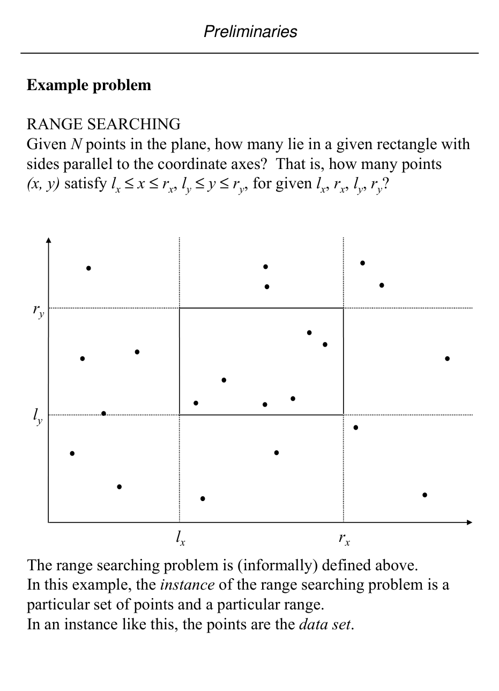
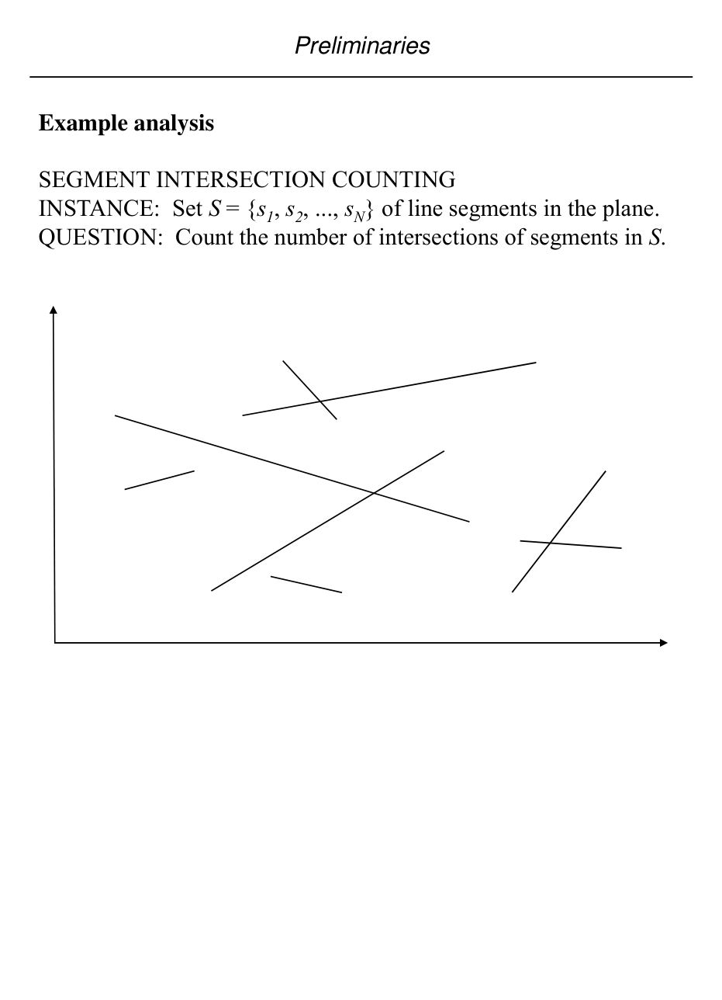

# Computational models and complexity language

## Scope
- **Slides:** pp. 29-37
- **Major topic folder:** geometric-objects-notation-and-asymptotic-preliminaries
- **Recording files touching this material:** CS 564 - 01.23 1.1.txt, CS 564 - 01.28 2.1.txt
- **Goal of this file:** You should be able to study this topic without reopening the slide deck.

## Big picture
This is the meta-language for the entire midterm. Nearly every proof or comparison later says preprocessing, query time, output size, or worst case. This file is where those words are defined precisely.

## What you must know cold
- Problem vs algorithm. Lower bounds belong to problems, not to your current favorite algorithm.
- Asymptotic notation as set-based growth classes, used to compare algorithms.
- Different cost components: preprocessing, storage, single query time, total reporting time.
- Difference between counting problems and reporting problems, and why output size matters.

## Core ideas and reasoning
- Geometric data structures often spend time up front to organize a static set, then answer many queries fast.
- For reporting problems the true running time is often something like O(f(n) + k), where k is the number of reported answers.
- Worst-case analysis is the default unless the slides or theorem explicitly say average / expected.

## Figures to actually look at
These are cropped from the main slide PDF. Do not skip them.

### Figure from slide p. 29


### Figure from slide p. 32


## Slide-by-slide digestion

### p. 29 - Example problem
- RANGE SEARCHING
- Given N points in the plane, how many lie in a given rectangle with
- sides parallel to the coordinate axes? That is, how many points
- (x, y) satisfy lx ≤x ≤rx, ly ≤y ≤ry, for given lx, rx, ly, ry?
- The range searching problem is (informally) defined above.
- In this example, the instance of the range searching problem is a
- particular set of points and a particular range.
- In an instance like this, the points are the data set.

### p. 30 - Algorithms and models of computation
- We are interested in efficient algorithms for geometric problems.
- Efficiency is evaluated in terms of computational cost,
- given as a function of the size of the instance of the problem.
- By convention, notation N denotes input instance size.
- To determine the computational cost of an algorithm,
- we must know what primitive operations are available and
- what they cost. This is a model of computation.
- Turing machine: too primitive
- C language on Unix workstation: too specific
- We will use a highly abstract model, the familiar random-access

### p. 31 - Order notation
- We are interested in the amount of time and memory used by
- algorithms, as a function of the input instance size N.
- “Worst case” or Upper bound
- O(f(N)) denotes the set of all functions g(N) such that there exist
- positive constants C and N0 with g(N) ≤Cf(N) for all N ≥ N0.
- “Best case” or Lower Bound
- Ω(f(N)) denotes the set of all functions g(N) such that there exist
- positive constants C and N0 with g(N) ≥Cf(N) for all N ≥ N0.
- “Optimal case” Or Optimal Bound
- θ(f(N)) denotes the set of all functions g(N) such that there exist

### p. 32 - Example analysis
- SEGMENT INTERSECTION COUNTING
- INSTANCE: Set S = {s1, s2, ..., sN} of line segments in the plane.
- QUESTION: Count the number of intersections of segments in S.

### p. 33 - Example analysis
- SEGMENT INTERSECTION COUNTING
- INSTANCE: Set S = {s1, s2, ..., sN} of line segments in the plane.
- QUESTION: Count the number of intersections of segments in S.

```text
procedure SegmentIntersectionCounting(S)
begin
  count ← 0
  for i ← 1 to N do
    for j ← 1 to N do
      if i ≠ j and segment s_i intersects s_j then
        count ← count + 1
  return count / 2   { unordered segment pairs; adjust if slides count ordered pairs }
end
```

### p. 34 - Algorithmic complexity measures
- Preprocessing. Time spent organizing the data set, usually into
- some data structure. Less important than query and storage.
- Query. Time spent producing the answer for a query relative to
- the data set.
- Storage. Memory required for static and dynamic data structures
- used by the query algorithm.
- Single shot vs. repetitive-mode
- Single shot. Given a single data set and a single query, produce an
- answer one time. Almost always best handled by scan of data
- set; no preprocessing, query O(N), storage O(N).

### p. 35 - Counting vs. reporting
- Counting. Determine the number of objects in the data set that
- satisfy the query.
- Reporting. Report (list, identify) the objects that satisfy the
- query.
- For example, consider the standard range search problem:
- RANGE SEARCHING.
- INSTANCE: Set S = {p1, p2, ..., pN}, pi = (xi, yi) of points in the
- plane, and rectangle R = [lx, rx] × [ly, ry] in the plane.
- Preliminaries
- [ x,

### p. 36 - Output sensitive or report-mode algorithms
- The time complexity of algorithms is often expressed as a
- function of input data set size, e.g. O(N log N). Reporting
- problems can have query time complexity that is output sensitive.
- Output-sensitive example
- INTERVAL ENCLOSURE
- INSTANCE: Set S = {x1, x2, ..., xN} of points on the
- number line (x-axis), and an interval Q = [l, r].
- QUESTION: Which points of S are within Q, i.e. l ≤xi ≤ r?
- Naive repetitive mode algorithm and analysis.
- Preliminaries

### p. 37 - Average Complexity: observed complexity in
- practice.
- Space or Storage Complexity.
- Pre-processing Cost: trade-off between space
- and time complexity with or without
- pre-processing.
- Amortized Cost: average over expensive and
- inexpensive operations.
- Normalization
- It will sometimes be useful to have available normalized
- values for coordinates. For a coordinate value x, its

## What you must be able to say or do in an exam
- Give the precise definitions.
- Distinguish similar notions cleanly.
- Use the right primitive test or formula on a concrete example.

## Complexity and performance facts
This section is itself complexity language: separate preprocessing, storage, and query complexity whenever you describe a data structure.

## Common mistakes and danger points
- Do not write “the lower bound of Graham scan is …”. Lower bounds are for convex hull as a problem.
- Do not forget output size when a query reports many objects.

## Exam-style drills and answer skeletons
### Definition drill
**Question.** Give the precise definitions and the most important consequences from computational models and complexity language.

**How to answer.** A strong answer distinguishes similar objects and uses the course terminology exactly.

## Recap
### What you must know cold
- Problem vs algorithm. Lower bounds belong to problems, not to your current favorite algorithm.
- Asymptotic notation as set-based growth classes, used to compare algorithms.
- Different cost components: preprocessing, storage, single query time, total reporting time.
- Difference between counting problems and reporting problems, and why output size matters.
### Core test / key idea
- Geometric data structures often spend time up front to organize a static set, then answer many queries fast.
- For reporting problems the true running time is often something like O(f(n) + k), where k is the number of reported answers.
- Worst-case analysis is the default unless the slides or theorem explicitly say average / expected.
### Complexity
- This section is itself complexity language: separate preprocessing, storage, and query complexity whenever you describe a data structure.
### Common mistakes / danger points
- Do not write “the lower bound of Graham scan is …”. Lower bounds are for convex hull as a problem.
- Do not forget output size when a query reports many objects.
## End-of-file summary
- Problem vs algorithm. Lower bounds belong to problems, not to your current favorite algorithm.
- Asymptotic notation as set-based growth classes, used to compare algorithms.
- Different cost components: preprocessing, storage, single query time, total reporting time.
- This section is itself complexity language: separate preprocessing, storage, and query complexity whenever you describe a data structure.
- Do not write “the lower bound of Graham scan is …”. Lower bounds are for convex hull as a problem.
- Do not forget output size when a query reports many objects.

## Everything related to this topic
- **Previous file in reading order:** [Polygonal geometry, convexity, planarity, and polyhedra](../01_Foundations/02_polygonal-geometry-planarity-and-polyhedra.md)
- **Next file in reading order:** [Segment trees as a warm-up search structure](../01_Foundations/04_segment-trees.md)
- **Source slide range:** pp. 29-37 of `comp_geometry_slides_new.pdf`
- **Related recordings:** CS 564 - 01.23 1.1.txt, CS 564 - 01.28 2.1.txt
- **Related homework-derived exam prompts included here:** none directly mapped; generic exam drills added instead
