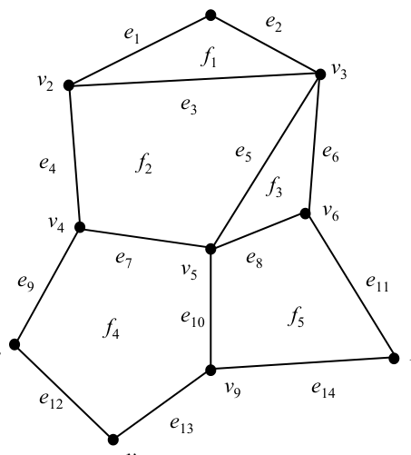
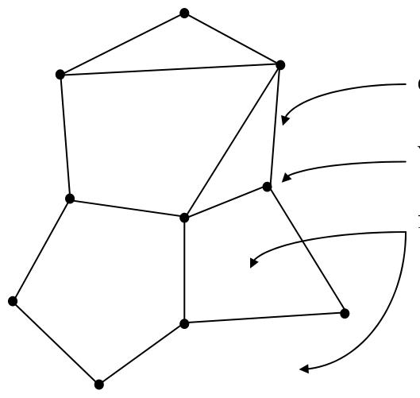
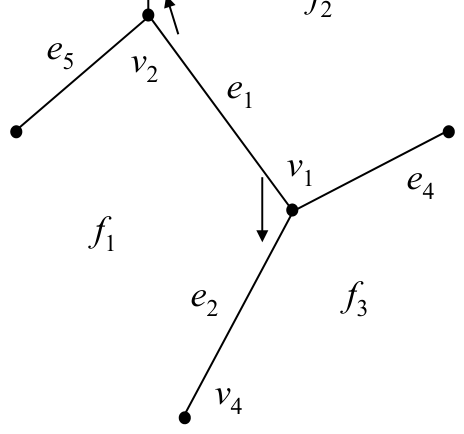
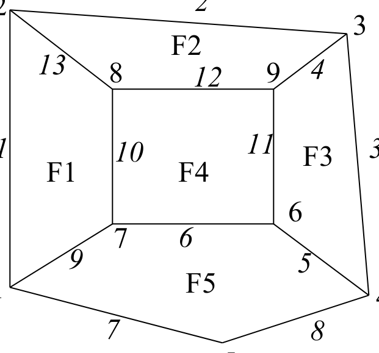
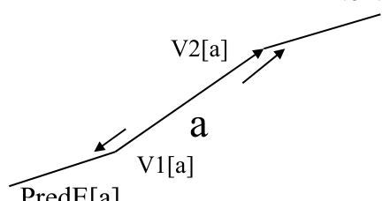

# Planar Straight Line Graphs and the DCEL

**Slides covered:** 45-51  

**Topic folder:** 01 Foundations

## Motivation

A PSLG is the standard way to represent planar subdivisions. The DCEL is the classic data structure used to store edges, faces, and adjacency so algorithms can move around the subdivision efficiently.

## Lecture Roadmap

- Know the problem definition.
- Know the main geometric idea.
- Know the key data structure or primitive test.
- Know the preprocessing / query / storage or total running time.
- Know one small example by hand.

## Detailed lecture notes

### Slide 45: e10 e11 e12 e13 e14 f1 f2 f3 f4 f5

### Slide 46: Planar straight line graph

- A planar straight line graph (PSLG) is a planar embedding of a planar graph G = (V, E) with:
- 1. each vertex v ∈V mapped to a distinct point in the plane,
- 2. and each edge e ∈E mapped to a segment between the between the points for the endpoint vertices of the edge
- such that no two segments intersect, except at their endpoints.
- edge (14) vertex (10) face (6)
- Observe that PSLG is defined by mapping a mathematical object
- (planar graph) to a geometric object (PSLG).
- That mapping introduces the notion of coordinates or location,
- which was not present in the graph (despite its planarity).
- We will see later that PSLGs will be useful objects.
- For now we focus on a data structure to represent a PSLG.

### Slide 47: The DCEL data structure represents a PSLG.

- It has one entry (“edge node” in text) for each edge in the PSLG.
- Each entry has 6 fields:
- V1 Origin of the edge
- V2 Terminus (destination) of the edge; implies an orientation
- F1
- Face to the left of edge, relative to V1V2 orientation
- F2
- Face to the right of edge, relative to V1V2 orientation
- P1
- Index of entry for first edge encountered after edge V1V2, when proceeding counterclockwise around V1
- P2
- Index of entry for first edge after edge V1V2, when proceeding counterclockwise around V2
- V1 V2
- F1
- F2
- P1
- P2 e1 v1 v2 f1 f2 e2 e3 e2 v4 v1 f1 f3
- ?

### Slide 48: F3

- F4
- F5
- F6
- Edge  V1 V2  LeftF RightF PredE NextE
- ------------------------------------------------1     2    F6      F1         7        13
- F6
- F2
- F6      F3
- 4         3     9    F3      F2
- F5
- F3
- 6          6    7    F5      F4
- 7          1    5    F5      F6
- 5    F6      F5
- 9          1    7    F1      F5
- 10        7    8    F1      F4
- 11        6    9    F4      F3
- 12        9    8    F4      F2

### Slide 49: If the PSLG has N vertices, M edges and  F faces then we know

- N - M + F = 2  by Euler’s formula. DCEL can be described by six arrays V1[1:M], V2[1:M], LeftF[1:M], Right[1:M],
- PredE[1:M] and NextE[1:M]. Since both the number of faces and edges are bounded by a linear function of  N, we need
- O(N) storage  for all these arrays.
- Define array HV[1:N]  with one entry for each vertex; entry HV[i] points to the first entry in the DCEL
- where vi is in V1 or V2 column. Thus for our example in the preceding slide HV=(1, 1, 2, 3, 7, 5, 6, 10, 11)
- Define array HF[1:F] with one entry for each face;
- HF[i] points to the first entry in the DCEL where Fi is in the LeftF or RightF column.
- For our example, HF=(1, 2, 3, 6, 5, 1).
- Both HV and HF can be filled in O(N) time each by scanning DCEL.
- DCEL operations
- Procedure EdgesIncident (“VERTEX” in the text) use a DCEL to report the edges incident to a vertex vj in a PSLG.
- The edges incident to vj are given as indexes to the DCEL entries
- for those edges in array A (for “Answer”).

### Slide 50: /* Get first DCEL entry for vj, a is index. */ a0 = a

- /* Save starting index. */
- A[1] = a i = 2
- /* i is index for A */ if  (V1[a] = j) then a =PredE[a]
- /* Go on to next incident edge. */ else a =NextE[a]
- /* Go on to next incident edge. */ endif while  (a ≠a0) do
- /* Back to starting edge? */
- A[i] = a if  (V1[a] = j) then a = PredE[a]
- /* Go on to next incident edge. */ else a = NextE[a] /* Go on to next incident edge. */
- endif i = i + 1 endwhile
- 21 end a
- NextE[a]
- PredE[a]
- V1[a]
- V2[a]

### Slide 51: Error in text, p. 16:  “... scan of arrays V1 and F1 ...” to produce HV and HF.

- Actually V1 and V2 (and F1 and F2) must be scanned.
- What if a vertex was V2 only?
- The algorithm would fail if only V1 was scanned.
- EdgesIncident requires time proportional to the number of incident edges reported.
- How does that relate to N, the number of vertices in the PSLG?
- We have these facts about planar graphs (and thus PSLGs):
- (1) v - e + f = 2
- Euler’s formula
- (2) e ≤3v - 6
- (3) f ≤2/3e
- (4) f ≤2v - 4 where v = number of vertices = N e = number of edges=M
- f = number of faces=F v ∈O(N) by definition
- ⇒e ∈ O(N) by (2)
- ⇒EdgesIncident requires time ∈ O(N) and
- ⇒DCEL requires storage ∈ O(N), one entry per edge.

## Recap

- Keep the formal problem statement precise.
- Focus on the geometric invariant used by the method.
- Remember the key complexity bound and when it applies.
