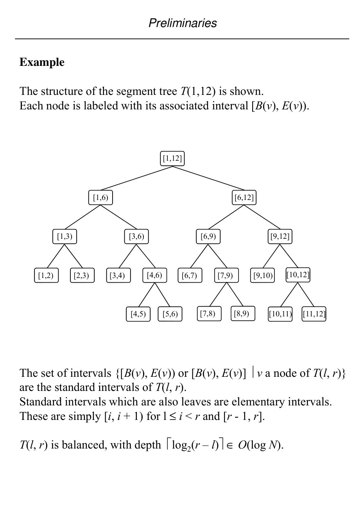
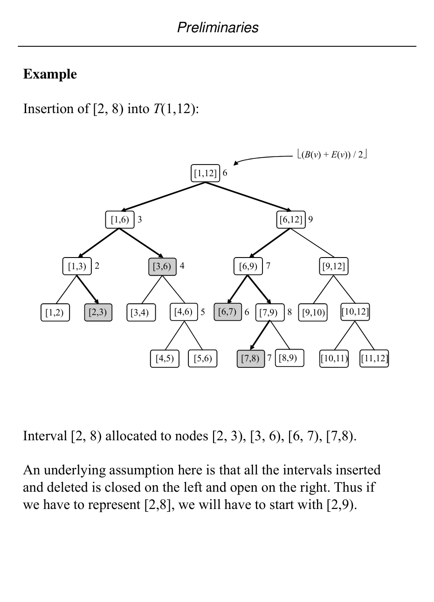

# Segment trees as a warm-up search structure

## Scope
- **Slides:** pp. 38-44
- **Major topic folder:** geometric-objects-notation-and-asymptotic-preliminaries
- **Recording files touching this material:** CS 564 - 01.23 1.1.txt, CS 564 - 01.28 2.1.txt
- **Goal of this file:** You should be able to study this topic without reopening the slide deck.

## Big picture
Segment trees appear early as a warm-up, but they quietly become a template for later structures like range trees. You need both the representation and the standard-interval decomposition idea.

## What you must know cold
- Rooted binary tree over an interval domain, with each node storing a standard interval.
- Insertion of an interval by decomposing it into O(log n) standard intervals.
- Deletion as the reverse maintenance operation.
- How this becomes a search structure rather than just a tree drawing.

## Core ideas and reasoning
- The key abstraction is that an arbitrary interval is represented by a small set of canonical node intervals.
- Insertion walks the tree and allocates the query interval to nodes whose scopes are fully covered and as large as possible.
- This decomposition is what later lets other structures answer queries by visiting only logarithmically many regions.

## Figures to actually look at
These are cropped from the main slide PDF. Do not skip them.

### Figure from slide p. 39

### Figure from slide p. 41

## Slide-by-slide digestion

### p. 38 - Segment Tree
- A segment tree is a rooted binary tree that stores data intervals on
- the real line whose extremes (endpoints) belong to a fixed set of
- N abscissae (x-values). It is the set of x-values from which the
- endpoints are chosen that is fixed, not the intervals themselves.
- The tree structure in which the intervals are stored is defined for
- a scope interval [l, r]. For a given [l, r] there is exactly one
- segment tree structure. The data intervals are stored within the
- fixed tree. We will assume WLOG that the data interval endpoints
- have been normalized to [1, N] and the tree has been built for
- scope interval [1, N].

### p. 39 - Example
- The structure of the segment tree T(1,12) is shown.
- Each node is labeled with its associated interval [B(v), E(v)).
- Preliminaries
- The set of intervals {[B(v), E(v)) or [B(v), E(v)] v a node of T(l, r)}
- are the standard intervals of T(l, r).
- Standard intervals which are also leaves are elementary intervals.
- These are simply [i, i + 1) for l ≤i < r and [r - 1, r].
- T(l, r) is balanced, with depth log2(r – l)∈O(log N).

### p. 40 - Insertion
- The segment tree structure supports insertions and deletions of
- intervals with endpoints ∈{l, l + 1, l + 2, ..., r}, in
- O(log N) time per operation.
- For r - l > 3, an arbitrary interval [b, e] inserted into T(l, r) will
- be partitioned into and “allocated” as a collection of standard
- intervals of T(l, r).
- There will be at most ( log2(r – 1)+ log2(r – 1)- 2) ∈ O(log N)
- standard intervals in the partition.
- Preliminaries
- To insert interval [b, e] into segment tree T:

### p. 41 - Example
- Insertion of [2, 8) into T(1,12):
- (B(v) + E(v)) / 2
- Preliminaries
- Interval [2, 8) allocated to nodes [2, 3), [3, 6), [6, 7), [7,8).
- An underlying assumption here is that all the intervals inserted
- and deleted is closed on the left and open on the right. Thus if
- we have to represent [2,8], we will have to start with [2,9).

### p. 42 - Insertion
- This slide is mainly visual. Use the figure crop in this file and make sure you can explain what the diagram is showing.

### p. 43 - Insertion
- This slide is mainly visual. Use the figure crop in this file and make sure you can explain what the diagram is showing.

### p. 44 - Deletion
- Deletion is symmetric with insertion.
- To delete interval [b, e] from segment tree T:
- DeleteSegmentTree(b, e, root(T))
- procedure DeleteSegmentTree(b, e, v)
- begin
- (b ≤B(v) and E(v) ≤e) then
- remove [b, e] from A(v)
- if (b < (B(v) + E(v)) / 2) then
- D l t S
- tT

## What you must be able to say or do in an exam
- State the input, output, preprocessing, and query/update model precisely.
- Explain the invariant or ordering that makes the method work.
- Trace the method by hand on a small example.
- Give the exact time and space bounds.
- Mention one edge case, degeneracy, or limitation.

## Complexity and performance facts
Typical allocation/search cost is O(log n) nodes per interval decomposition, with linear or near-linear space depending on what is stored per node.

## Common mistakes and danger points
- Students often confuse the query interval with a node interval. The tree stores standard intervals; your input interval is decomposed into them.
- Use the course convention for closed/half-open intervals consistently. Sloppy endpoints break proofs.

## Exam-style drills and answer skeletons
Existing drill reminders from the earlier pack:
- Prove the maximum number of standard intervals allocated to an interval in a segment tree, then give a worst-case example.
- Trace the allocation of a specific interval into a perfect segment tree and justify each visited node.
- Adapted from HW1-Q5: Show the maximum number of standard intervals allocated to a query interval in a segment tree and give a worst-case example for T(1,16).

### HW1-Q5 adapted
**Question.** Given a segment tree T(l,r), state the maximum number of standard intervals allocated to one interval [b,e], justify the formula, and give an example for T(1,16).

**How to answer.** Answer by tracing canonical decomposition from the two search paths to b and e. The bound comes from the number of complete sibling subtrees collected on the left and right search paths.

### Core exam drill
**Question.** State the problem solved by segment trees as a warm-up search structure, describe preprocessing/query/update steps if any, and give the time and space bounds.

**How to answer.** An excellent answer names the input, the output, the invariant or ordering exploited by the method, and the exact asymptotic costs.

### Hand-trace drill
**Question.** Trace segment trees as a warm-up search structure on a small example by hand and explain each comparison or structural change.

**How to answer.** On this course, being able to run the method on a picture matters more than writing vague slogans.

## Recap
### What you must know cold
- Rooted binary tree over an interval domain, with each node storing a standard interval.
- Insertion of an interval by decomposing it into O(log n) standard intervals.
- Deletion as the reverse maintenance operation.
- How this becomes a search structure rather than just a tree drawing.
### Core test / key idea
- The key abstraction is that an arbitrary interval is represented by a small set of canonical node intervals.
- Insertion walks the tree and allocates the query interval to nodes whose scopes are fully covered and as large as possible.
- This decomposition is what later lets other structures answer queries by visiting only logarithmically many regions.
### Complexity
- Typical allocation/search cost is O(log n) nodes per interval decomposition, with linear or near-linear space depending on what is stored per node.
### Common mistakes / danger points
- Students often confuse the query interval with a node interval. The tree stores standard intervals; your input interval is decomposed into them.
- Use the course convention for closed/half-open intervals consistently. Sloppy endpoints break proofs.
## End-of-file summary
- Rooted binary tree over an interval domain, with each node storing a standard interval.
- Insertion of an interval by decomposing it into O(log n) standard intervals.
- Deletion as the reverse maintenance operation.
- Typical allocation/search cost is O(log n) nodes per interval decomposition, with linear or near-linear space depending on what is stored per node.
- Students often confuse the query interval with a node interval. The tree stores standard intervals; your input interval is decomposed into them.
- Use the course convention for closed/half-open intervals consistently. Sloppy endpoints break proofs.

## Everything related to this topic
- **Previous file in reading order:** [Computational models and complexity language](../01_Foundations/03_models-and-complexity-language.md)
- **Next file in reading order:** [Planar straight-line graphs and face-edge structure](../01_Foundations/05_pslg-basics.md)
- **Source slide range:** pp. 38-44 of `comp_geometry_slides_new.pdf`
- **Related recordings:** CS 564 - 01.23 1.1.txt, CS 564 - 01.28 2.1.txt
- **Related homework-derived exam prompts included here:** HW1-Q5 adapted