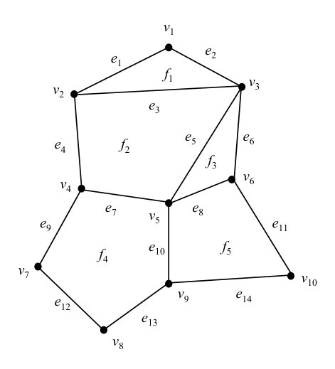
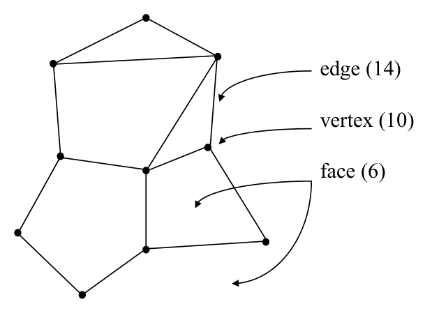

# Planar straight-line graphs and face-edge structure

## Scope
- **Slides:** pp. 45-46
- **Major topic folder:** pslgs-dcels-vectors-and-geometric-primitives
- **Recording files touching this material:** CS 564 - 01.23 1.2.txt, CS 564 - 01.30 3.1.txt
- **Goal of this file:** You should be able to study this topic without reopening the slide deck.

## Big picture
A PSLG is the bridge between graph theory and geometry. It is not enough to know the adjacency graph; the embedding in the plane matters because faces, incidence, and point location all depend on it.

## What you must know cold
- Formal definition of a planar straight-line graph: vertices as points, edges as straight segments, no crossings except shared endpoints.
- Vertices, edges, faces, and the idea that coordinates are part of the representation.
- Why PSLGs are the natural input model for planar search and subdivision problems.

## Core ideas and reasoning
- The same abstract planar graph can have different embeddings, but a PSLG fixes one geometric embedding.
- Faces are induced by the embedding. That is why later algorithms can ask “which face contains q?”.

## Figures to actually look at
These are cropped from the main slide PDF. Do not skip them.

### Figure from slide p. 45

### Figure from slide p. 46

## Slide-by-slide digestion

### p. 45 - Slide p. 45
- This slide is mainly visual. Use the figure crop in this file and make sure you can explain what the diagram is showing.

### p. 46 - Planar straight line graph
- A planar straight line graph (PSLG) is a planar embedding
- of a planar graph G = (V, E) with:
- 1. each vertex v ∈V mapped to a distinct point in the plane,
- 2. and each edge e ∈E mapped to a segment between the
- between the points for the endpoint vertices of the edge
- such that no two segments intersect, except at their endpoints.
- edge (14)
- vertex (10)
- face (6)
- Observe that PSLG is defined by mapping a mathematical object

## What you must be able to say or do in an exam
- Give the precise definitions.
- Distinguish similar notions cleanly.
- Use the right primitive test or formula on a concrete example.

## Complexity and performance facts
Representation issue more than algorithmic issue.

## Common mistakes and danger points
- Do not forget the no-crossing condition except at common endpoints.
- Do not treat a PSLG as just an undirected graph; geometric incidence is part of the object.

## Exam-style drills and answer skeletons
Existing drill reminders from the earlier pack:
- Use Euler’s formula and degree/face counting to derive inequalities for a PSLG.
- Explain why a triangulated PSLG satisfies e = 3v - 6 under the standard assumptions.
- Adapted from HW1-Q4: Using Euler’s formula, prove standard inequalities for a PSLG with minimum degree at least 3; also prove e = 3v - 6 for triangulated PSLGs.

### HW1-Q4 adapted
**Question.** Starting from Euler's formula, derive the standard inequalities for a PSLG with minimum degree at least 3, and explain why triangulated PSLGs satisfy e = 3v - 6.

**How to answer.** Use degree counting, face-edge counting, and Euler's formula together. Keep the assumptions straight: the minimum-degree assumption is used for some inequalities, but triangulated graphs can contain degree-2 vertices.

### Definition drill
**Question.** Give the precise definitions and the most important consequences from planar straight-line graphs and face-edge structure.

**How to answer.** A strong answer distinguishes similar objects and uses the course terminology exactly.

## Recap
### What you must know cold
- Formal definition of a planar straight-line graph: vertices as points, edges as straight segments, no crossings except shared endpoints.
- Vertices, edges, faces, and the idea that coordinates are part of the representation.
- Why PSLGs are the natural input model for planar search and subdivision problems.
### Core test / key idea
- The same abstract planar graph can have different embeddings, but a PSLG fixes one geometric embedding.
- Faces are induced by the embedding. That is why later algorithms can ask “which face contains q?”.
### Complexity
- Representation issue more than algorithmic issue.
### Common mistakes / danger points
- Do not forget the no-crossing condition except at common endpoints.
- Do not treat a PSLG as just an undirected graph; geometric incidence is part of the object.
## End-of-file summary
- Formal definition of a planar straight-line graph: vertices as points, edges as straight segments, no crossings except shared endpoints.
- Vertices, edges, faces, and the idea that coordinates are part of the representation.
- Why PSLGs are the natural input model for planar search and subdivision problems.
- Representation issue more than algorithmic issue.
- Do not forget the no-crossing condition except at common endpoints.
- Do not treat a PSLG as just an undirected graph; geometric incidence is part of the object.

## Everything related to this topic
- **Previous file in reading order:** [Segment trees as a warm-up search structure](../01_Foundations/04_segment-trees.md)
- **Next file in reading order:** [DCEL representation and auxiliary structures](../01_Foundations/06_dcel.md)
- **Source slide range:** pp. 45-46 of `comp_geometry_slides_new.pdf`
- **Related recordings:** CS 564 - 01.23 1.2.txt, CS 564 - 01.30 3.1.txt
- **Related homework-derived exam prompts included here:** HW1-Q4 adapted