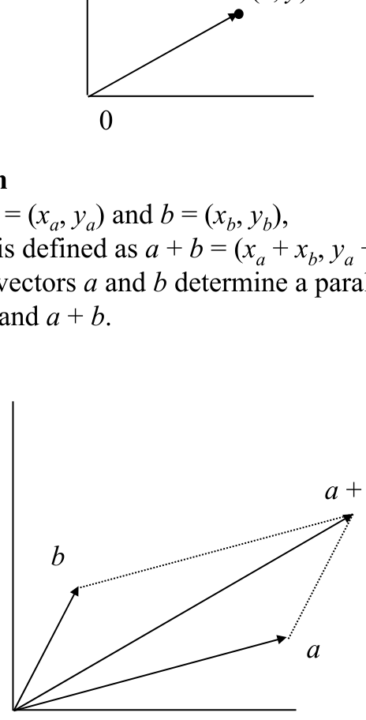
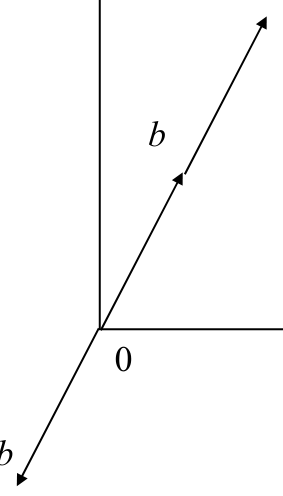
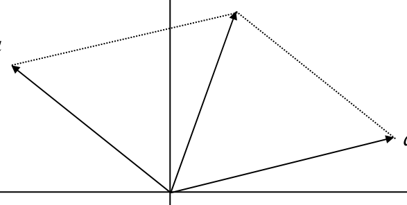
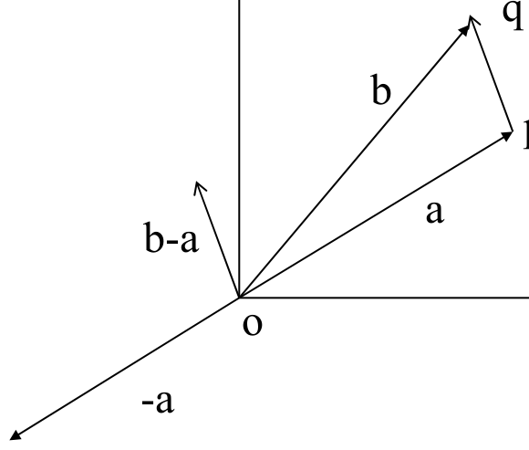
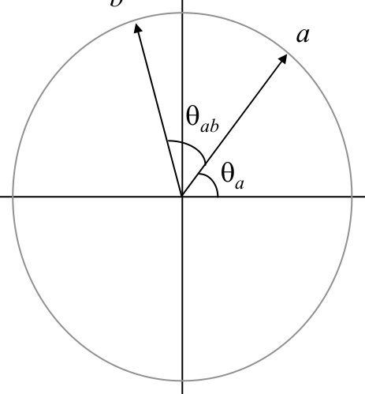
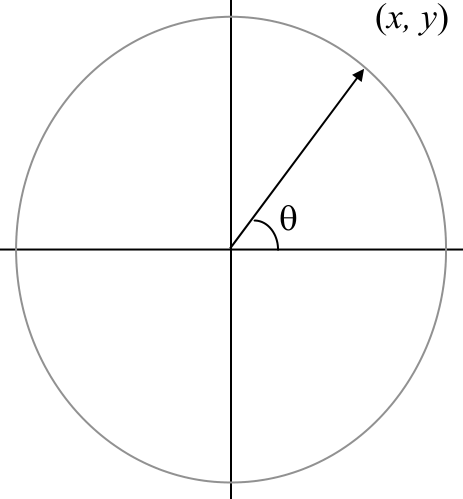

# Vector Algebra and Trigonometry

**Slides covered:** 52-57  

**Topic folder:** 01 Foundations

## Motivation

These slides build the algebra behind geometric tests. Vectors, scaling, subtraction, direction, sine, and cosine are the tools used later to tell where points and segments lie relative to each other.

## Lecture Roadmap

- Know the problem definition.
- Know the main geometric idea.
- Know the key data structure or primitive test.
- Know the preprocessing / query / storage or total running time.
- Know one small example by hand.

## Detailed lecture notes

### Slide 52: An ordered pair (x, y) can be a point in the plane, or a vector.

- (x, y)
- Vector addition
- Given vectors a = (xa, ya) and b = (xb, yb), vector addition is defined as a + b = (xa + xb, ya + yb).
- Geometrically, vectors a and b determine a parallelogram with
- vertices 0, a, b, and a + b.

### Slide 53: Multiplication of vector b by a scalar (a real number) t.

- Scalar multiplication is defined as tb = (txb, tyb).
- The vector length is scaled by t.
- If t < 0, the direction is reversed.

### Slide 54: Vector subtraction

- Given vectors a = (xa, ya) and b = (xb, yb), vector subtraction is defined as b - a = b + (-1)a,
- carried out as b - a = (xb - xa, yb - ya).
- Vector length
- Length of vector a = (xa, ya) is defined as |a| = sqrt(xa
- 2).

### Slide 55: -a b-a p q o

- Let a =op and b =oq. Then, b-a is a translation of the vector pq at the origin o. Thus, two line
- segments having same length and direction are translates of each other and can be
- identified with the same canonical line segment originating at the origin o.

### Slide 56: The direction of vector a is described by its polar angle θa,

- the angle the vector makes with the positive x axis.
- Measured in counterclockwise rotation, starting at the positive x axis.
- Values are in the range 0 ≤θa < 360.
- Given two vectors a and b, the angle between them θab is measured counterclockwise starting at vector a.

### Slide 57: Definition of sine and cosine based on unit circle.

- x = cos θ y = sin θ
- 0 < θ < 180
- ⇒y > 0
- ⇒sin θ > 0
- 180 < θ < 360 ⇒y < 0
- ⇒sin θ < 0
- (x, y) θ
- Unit circle x2 + y2 = 1

## Recap

- Keep the formal problem statement precise.
- Focus on the geometric invariant used by the method.
- Remember the key complexity bound and when it applies.
