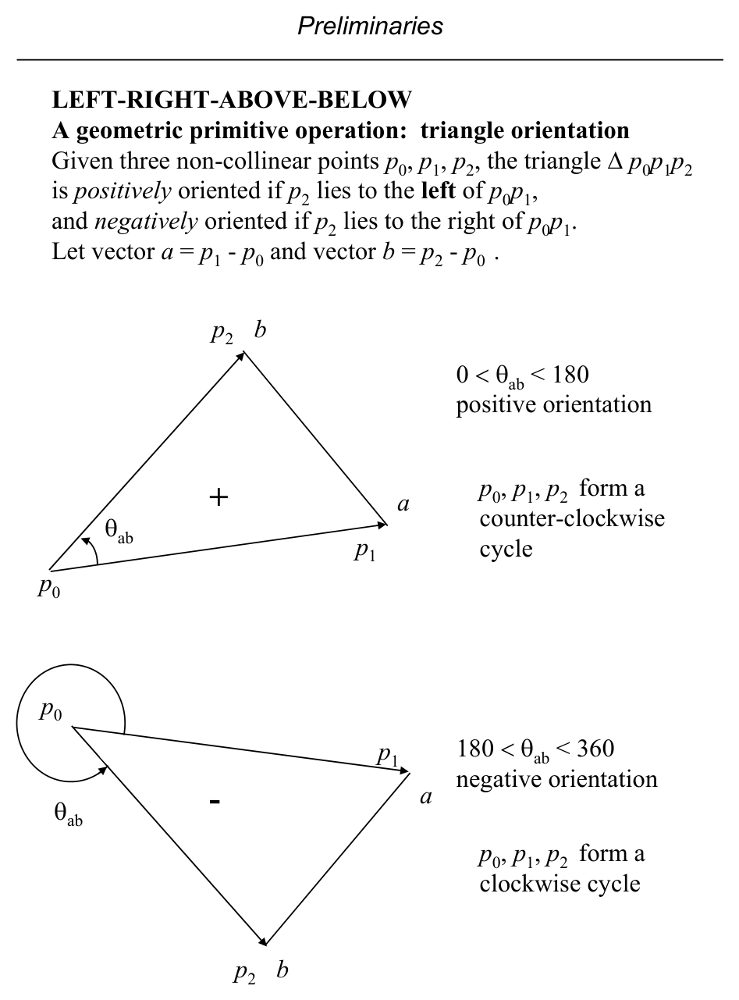
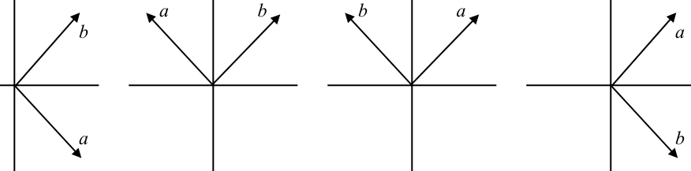
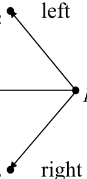
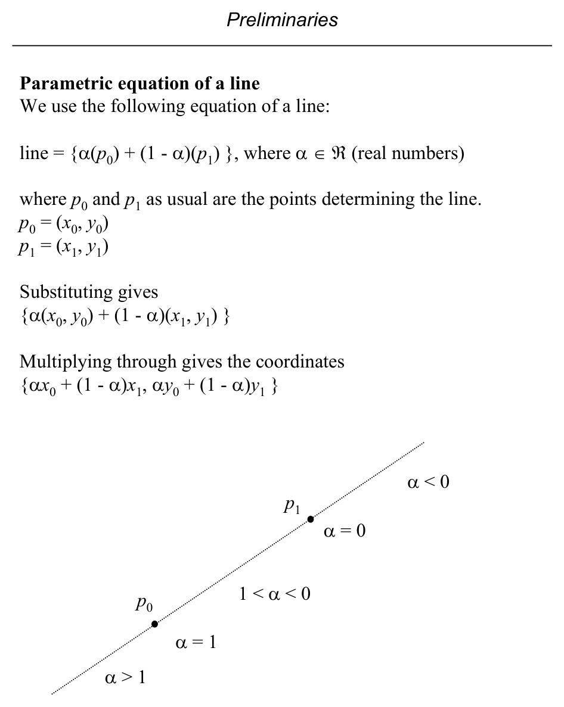
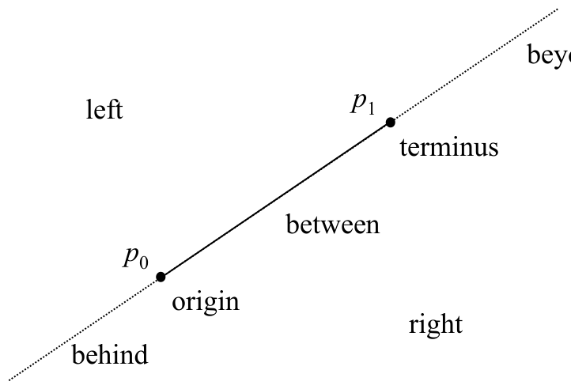

# Orientation, Determinants, Area, and Point-Line Classification

**Slides covered:** 58–65  

**Topic folder:** 01 Foundations

## Motivation

This is the heart of many geometry algorithms. The orientation test tells left versus right, determinants turn that into a formula, and the signed area view explains why the test works.

## Lecture Roadmap

- Know the problem definition.
- Know the main geometric idea.
- Know the key data structure or primitive test.
- Know the preprocessing / query / storage or total running time.
- Know one small example by hand.

## Detailed lecture notes

### Slide 58: Triangle orientation

Given non-collinear points \(p_0, p_1, p_2\), triangle \(\triangle p_0 p_1 p_2\) is **positively oriented** if \(p_2\) lies **to the left** of the directed line \(p_0 p_1\), and **negatively oriented** if \(p_2\) lies **to the right**.

Define \(\mathbf{a} = p_1 - p_0\) and \(\mathbf{b} = p_2 - p_0\). Let \(\theta_{\mathbf{a}\mathbf{b}}\) be the counterclockwise angle from \(\mathbf{a}\) to \(\mathbf{b}\).

- If \(0^\circ < \theta_{\mathbf{a}\mathbf{b}} < 180^\circ\): **positive** orientation (CCW cycle \(p_0,p_1,p_2\)).  
- If \(180^\circ < \theta_{\mathbf{a}\mathbf{b}} < 360^\circ\): **negative** orientation (CW cycle).

### Slide 59: Four configurations and avoiding trig

Vectors \(\mathbf{a},\mathbf{b}\) can sit in four relative configurations (slides 1–4). In cases 1 and 3, \(0^\circ < \theta_{\mathbf{a}\mathbf{b}} < 180^\circ\); in 2 and 4, \(180^\circ < \theta_{\mathbf{a}\mathbf{b}} < 360^\circ\). Cases 1 and 2 have the positive \(x\)-axis intersecting the wedge between \(\mathbf{a}\) and \(\mathbf{b}\); cases 3 and 4 do not.

Define \(Q = \theta_{\mathbf{b}} - \theta_{\mathbf{a}}\) (note \(Q \neq \theta_{\mathbf{a}\mathbf{b}}\) in general). The slide relates intervals of \(Q\) (e.g. \((-360^\circ,-180^\circ)\), \((-180^\circ,0)\), \((0^\circ,180^\circ)\), \((180^\circ,360^\circ)\)) to the sign of \(\sin Q\) and hence to the orientation of \(\triangle p_0 p_1 p_2\); equality holds only when \(\mathbf{a}\) and \(\mathbf{b}\) are collinear. **See the figure** for the four geometric cases and the full correspondence.

Using this path would require \(\theta_{\mathbf{a}}\) and \(\theta_{\mathbf{b}}\) — **expensive** trig. The next slide derives a **coordinate-only** test with the **same sign information**.

### Slide 60: Algebraic sign of \(\sin(\theta_{\mathbf{b}} - \theta_{\mathbf{a}})\)

By definition \(Q = \theta_{\mathbf{b}} - \theta_{\mathbf{a}}\), so

\[
\sin Q = \sin(\theta_{\mathbf{b}} - \theta_{\mathbf{a}})
  = \sin\theta_{\mathbf{b}}\cos\theta_{\mathbf{a}} - \cos\theta_{\mathbf{b}}\sin\theta_{\mathbf{a}}.
\]

With \(\mathbf{a} = (x_a,y_a)\), \(\mathbf{b} = (x_b,y_b)\) and unit-circle definitions \(\cos\theta_{\mathbf{a}} = x_a/\|\mathbf{a}\|\), \(\sin\theta_{\mathbf{a}} = y_a/\|\mathbf{a}\|\) (similarly for \(\mathbf{b}\)):

\[
\sin(\theta_{\mathbf{b}} - \theta_{\mathbf{a}})
  = \frac{1}{\|\mathbf{a}\|\,\|\mathbf{b}\|}\,(y_b x_a - x_b y_a).
\]

Since \(\|\mathbf{a}\|,\|\mathbf{b}\| > 0\),

\[
\operatorname{sign}\bigl(\sin(\theta_{\mathbf{b}} - \theta_{\mathbf{a}})\bigr)
  = \operatorname{sign}(y_b x_a - x_b y_a).
\]

With \(p_i = (x_i,y_i)\) and \(x_a = x_1-x_0\), \(y_a = y_1-y_0\), \(x_b = x_2-x_0\), \(y_b = y_2-y_0\),

\[
\operatorname{sign}(y_b x_a - x_b y_a)
  = \operatorname{sign}\bigl((y_2-y_0)(x_1-x_0) - (x_2-x_0)(y_1-y_0)\bigr).
\]

So **orientation of \(\triangle p_0 p_1 p_2\)** is determined in **\(O(1)\)** time from coordinates **without** inverse trig.

### Slide 61: Determinant form (2D orientation / turn test)

Define the **homogeneous** \(3\times 3\) determinant

\[
D =
\begin{vmatrix}
x_0 & y_0 & 1 \\
x_1 & y_1 & 1 \\
x_2 & y_2 & 1
\end{vmatrix}
= x_0 y_1 + x_2 y_0 + x_1 y_2 - x_2 y_1 - x_0 y_2 - x_1 y_0,
\]

matching the expression above up to sign conventions. In 2D this is the **scalar cross product** \((p_1-p_0) \times (p_2-p_0)\) (embedded in 3D with \(z=0\)).

**Left / right turn test**

- \(D > 0\): \(\triangle p_0 p_1 p_2\) is **counterclockwise** (\(p_2\) **left** of directed line \(p_0 p_1\)).  
- \(D < 0\): **clockwise** (\(p_2\) **right** of \(p_0 p_1\)).  
- \(D = 0\): **collinear** points.

### Slide 62: Signed area and 3D generalization

**\(D\)** equals **twice the signed area** of \(\triangle p_0 p_1 p_2\): positive for CCW order, negative for CW, zero for degenerate triangle.

**3D:** Points \(p_0,p_1,p_2\) define an oriented plane. Point \(p_3\) lies on the **positive** or **negative** side according to the sign of

\[
D =
\begin{vmatrix}
x_0 & y_0 & z_0 & 1 \\
x_1 & y_1 & z_1 & 1 \\
x_2 & y_2 & z_2 & 1 \\
x_3 & y_3 & z_3 & 1
\end{vmatrix},
\]

related to **signed volume** of the tetrahedron. The pattern extends to \(n\) dimensions.

*(Reading: O’Rourke, §§1.3–1.5, pp. 17–35.)*

### Slide 63: Line parametrization (review)

Line through \(p_0, p_1\):

\[
\{\alpha p_0 + (1-\alpha) p_1 : \alpha \in \mathbb{R}\},
\qquad p_i = (x_i, y_i),
\]

coordinates \((\alpha x_0 + (1-\alpha)x_1,\; \alpha y_0 + (1-\alpha)y_1)\). Values \(\alpha \in [0,1]\) give the **segment**; \(\alpha < 0\) or \(\alpha > 1\) give extensions beyond the endpoints (see figure).

### Slide 64: Point–line classification

Classify \(p_2\) with respect to directed segment \(p_0 p_1\). The line splits the plane into **seven** disjoint regions (origin, terminus, between, left, right, behind, beyond — see figure).

### Slide 65: Primitive operations (summary)

From the lectures:

1. Triangle orientation  
2. Left-turn test  
3. Point–line classification  

Other primitives (constant time for fixed dimension \(d\)) include point–plane tests, segment–segment intersection, segment–triangle intersection, and more.

## Recap

- Keep the formal problem statement precise.
- Focus on the geometric invariant used by the method.
- Remember the key complexity bound and when it applies.
