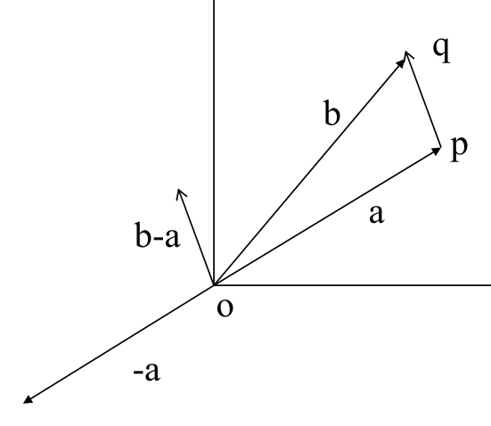
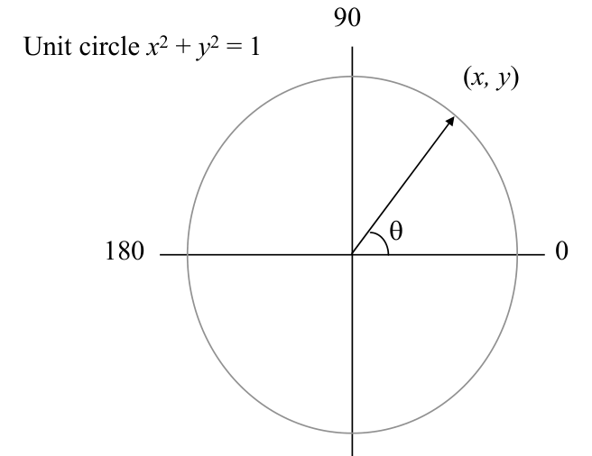

# Vector algebra and trigonometric groundwork

## Scope
- **Slides:** pp. 52-57
- **Major topic folder:** pslgs-dcels-vectors-and-geometric-primitives
- **Recording files touching this material:** CS 564 - 01.23 1.2.txt, CS 564 - 01.30 3.1.txt
- **Goal of this file:** You should be able to study this topic without reopening the slide deck.

## Big picture
This is the algebra underneath every primitive. The course does not care about vector notation because it looks pretty; it cares because almost every geometric predicate becomes one subtraction and one determinant.

## What you must know cold
- Vector addition, subtraction, scalar multiplication, and translation view.
- Direction as an angle/order concept, not just a picture.
- Basic trigonometric facts used to compare directions or reason about left/right.

## Core ideas and reasoning
- Given points p and q, the vector q - p is the displacement from p to q.
- Most primitives first translate so one point becomes the origin; then orientation and comparison become algebraic.
- Trig is supporting material, but determinant-based comparisons are preferred because they avoid expensive angle computation.

## Figures to actually look at
These are cropped from the main slide PDF. Do not skip them.

### Figure from slide p. 55

### Figure from slide p. 57

## Slide-by-slide digestion

### p. 52 - Vector algebra
- An ordered pair (x, y) can be a point in the plane, or a vector.
- Vector addition
- Given vectors a = (xa, ya) and b = (xb, yb),
- vector addition is defined as a + b = (xa + xb, ya + yb).
- Geometrically, vectors a and b determine a parallelogram with
- vertices 0, a, b, and a + b.
- a + b

### p. 53 - Scalar multiplication
- Multiplication of vector b by a scalar (a real number) t.
- Scalar multiplication is defined as tb = (txb, tyb).
- The vector length is scaled by t.
- If t < 0, the direction is reversed.
- 2b
- -b

### p. 54 - Vector subtraction
- Given vectors a = (xa, ya) and b = (xb, yb),
- vector subtraction is defined as b - a = b + (-1)a,
- carried out as b - a = (xb - xa, yb - ya).
- b - a
- Vector length
- Length of vector a = (xa, ya) is defined as |a| = sqrt(xa
- 2 + ya

### p. 55 - Vector Translation
- -a
- b-a
- Let a =op and b =oq. Then, b-a is a translation
- of the vector pq at the origin o. Thus, two line
- segments having same length and direction
- are translates of each other and can be
- identified with the same canonical line
- segment originating at the origin o.

### p. 56 - Vector direction
- The direction of vector a is described by its polar angle θa,
- the angle the vector makes with the positive x axis.
- Measured in counterclockwise rotation,
- starting at the positive x axis.
- Values are in the range 0 ≤θa < 360.
- θa
- Given two vectors a and b, the angle between them θab
- is measured counterclockwise starting at vector a.
- θab

### p. 57 - Trigonometry reminder
- Definition of sine and cosine based on unit circle.
- x = cos θ
- y = sin θ
- 0 < θ < 180
- ⇒y > 0
- ⇒sin θ > 0
- 180 < θ < 360 ⇒y < 0
- ⇒sin θ < 0
- Unit circle x2 + y2 = 1

## What you must be able to say or do in an exam
- Give the precise definitions.
- Distinguish similar notions cleanly.
- Use the right primitive test or formula on a concrete example.

## Complexity and performance facts
Primitive vector operations are constant time and are assumed cheap enough to use inside loops.

## Common mistakes and danger points
- Do not confuse a point with a vector until you have fixed the reference point.
- Avoid actual angle computation when a sign test or determinant is enough.

## Exam-style drills and answer skeletons
### Definition drill
**Question.** Give the precise definitions and the most important consequences from vector algebra and trigonometric groundwork.

**How to answer.** A strong answer distinguishes similar objects and uses the course terminology exactly.

## Recap
### What you must know cold
- Vector addition, subtraction, scalar multiplication, and translation view.
- Direction as an angle/order concept, not just a picture.
- Basic trigonometric facts used to compare directions or reason about left/right.
### Core test / key idea
- Given points p and q, the vector q - p is the displacement from p to q.
- Most primitives first translate so one point becomes the origin; then orientation and comparison become algebraic.
- Trig is supporting material, but determinant-based comparisons are preferred because they avoid expensive angle computation.
### Complexity
- Primitive vector operations are constant time and are assumed cheap enough to use inside loops.
### Common mistakes / danger points
- Do not confuse a point with a vector until you have fixed the reference point.
- Avoid actual angle computation when a sign test or determinant is enough.
## End-of-file summary
- Vector addition, subtraction, scalar multiplication, and translation view.
- Direction as an angle/order concept, not just a picture.
- Basic trigonometric facts used to compare directions or reason about left/right.
- Primitive vector operations are constant time and are assumed cheap enough to use inside loops.
- Do not confuse a point with a vector until you have fixed the reference point.
- Avoid actual angle computation when a sign test or determinant is enough.

## Everything related to this topic
- **Previous file in reading order:** [DCEL representation and auxiliary structures](../01_Foundations/06_dcel.md)
- **Next file in reading order:** [Orientation tests and signed-area interpretation](../01_Foundations/08_orientation-and-signed-area.md)
- **Source slide range:** pp. 52-57 of `comp_geometry_slides_new.pdf`
- **Related recordings:** CS 564 - 01.23 1.2.txt, CS 564 - 01.30 3.1.txt
- **Related homework-derived exam prompts included here:** none directly mapped; generic exam drills added instead
