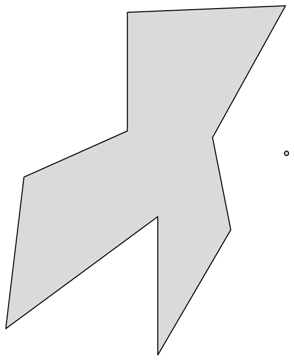
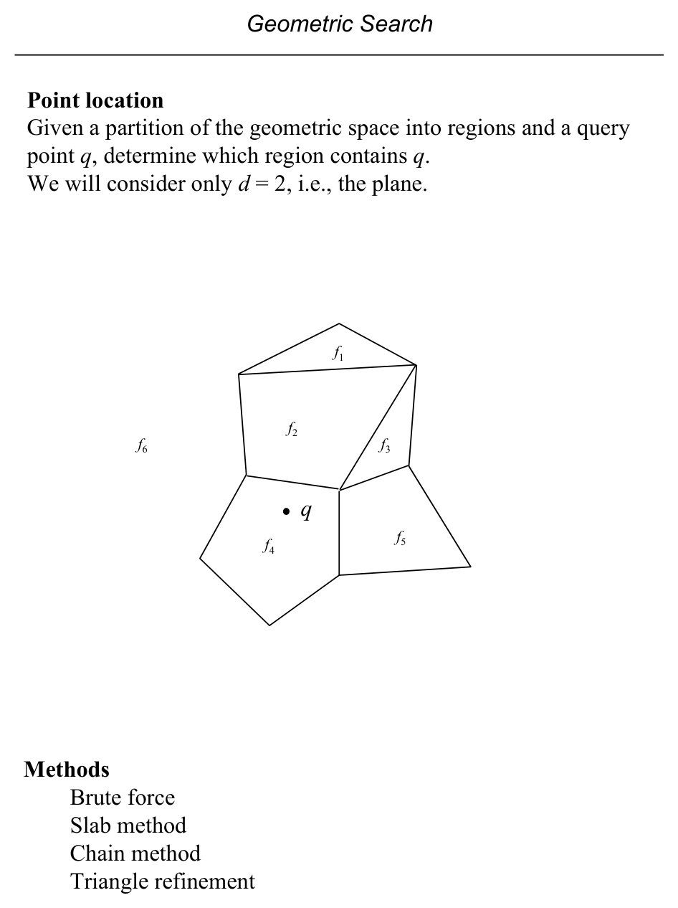
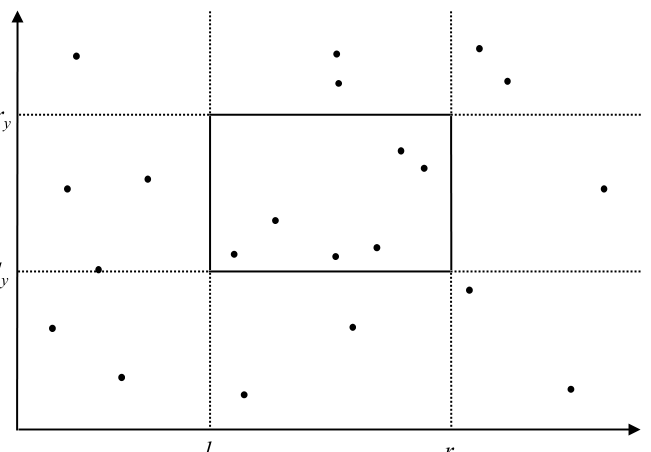
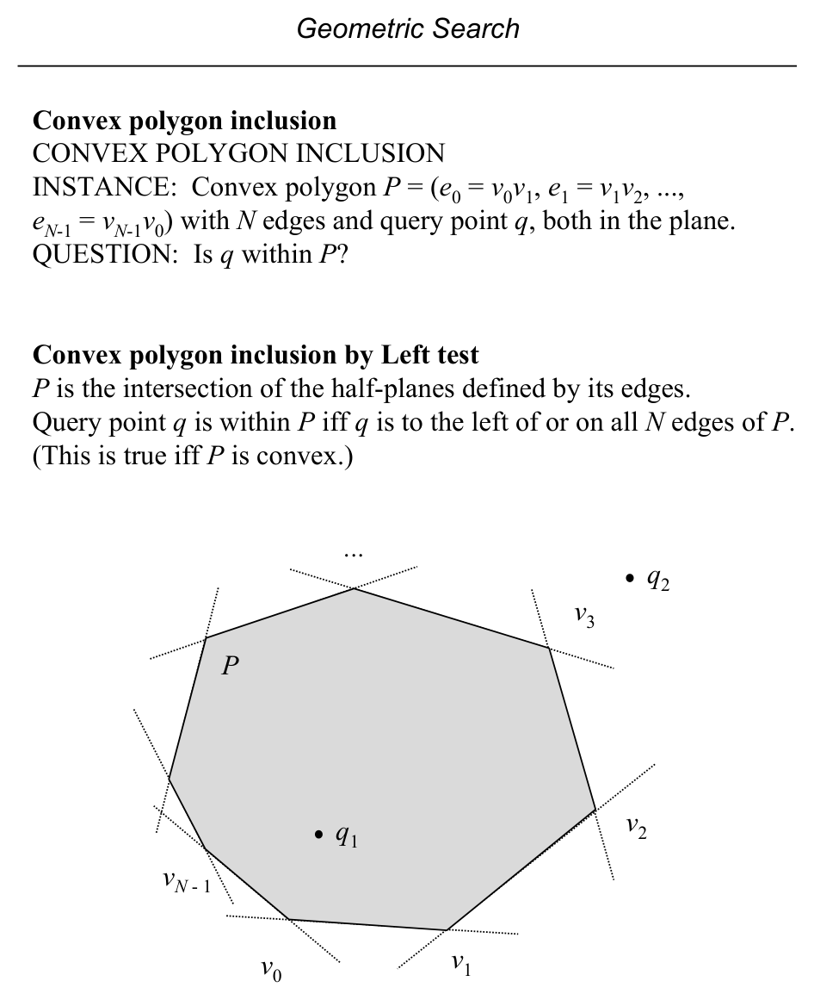
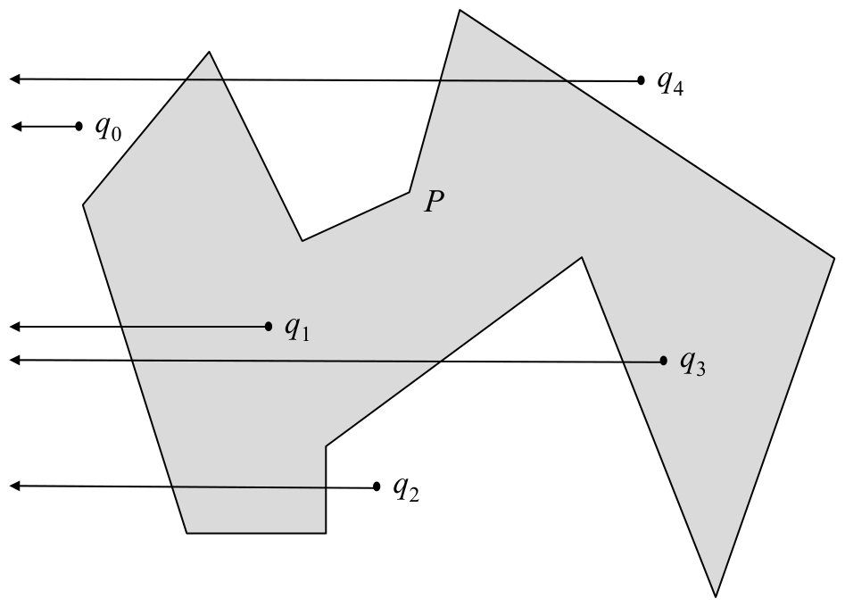
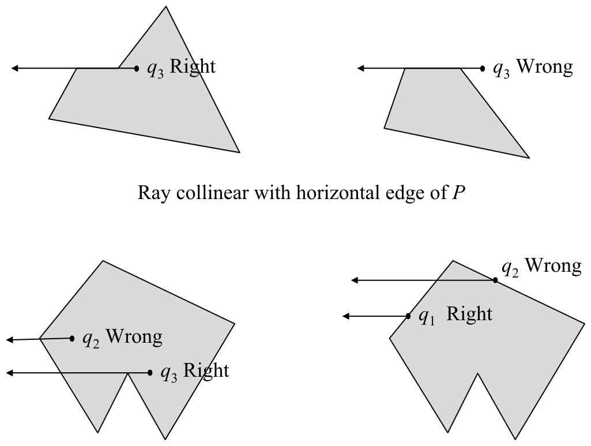
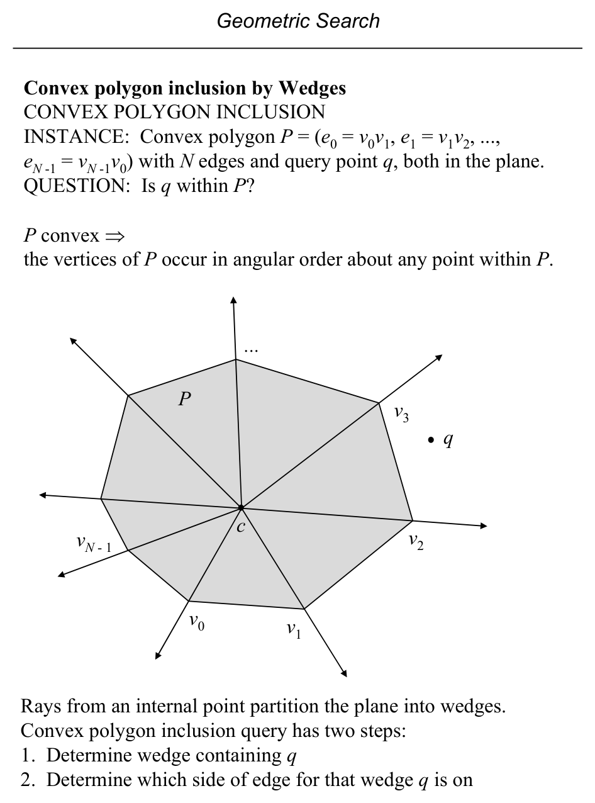
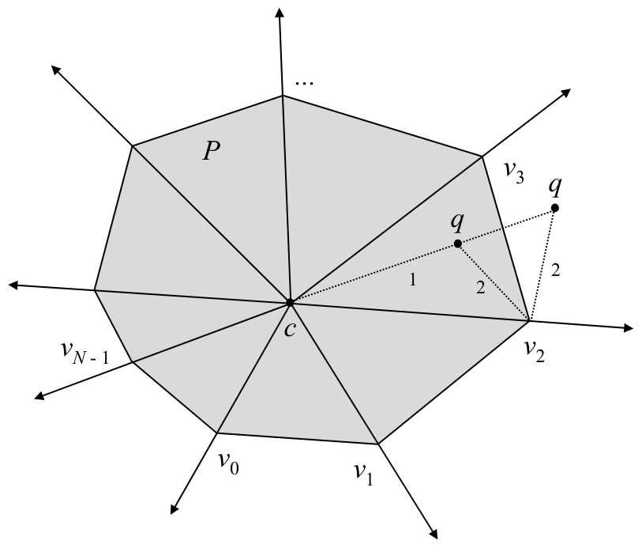
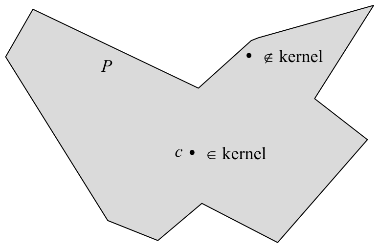
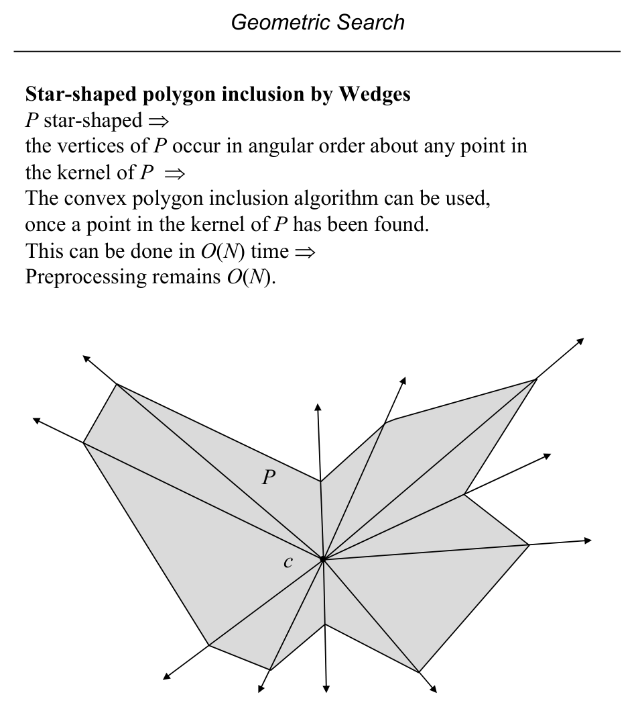

# Geometric Search Overview and Polygon Inclusion

**Slides covered:** 66–79  

**Topic folder:** 02 Geometric Search


## Fast take

- Geometric search asks which stored objects satisfy a geometric relation with a query object.
- For **convex** polygons, inclusion is a sequence of **left tests**.
- For **simple** polygons, the standard method is **ray intersection counting** with special-case care.
- For **convex** or **star-shaped** polygons in repetitive mode, the **wedge** method gives faster queries after preprocessing.

## Recording notes

**Recording references:** `CS 564 - 01.30 3.2.txt`, `CS 564 - 02.04 4.1.txt`

- The lecture emphasized choosing the method from the **polygon class first**. If the polygon is convex, use that fact instead of pretending it is arbitrary.
- Ray casting is conceptually simple but implementation is full of annoying boundary cases. Humans love “simple” methods that explode at vertices.
- The wedge method is worth it only when there are many queries. Otherwise the plain linear scan is usually the sane choice.
- For star-shaped polygons, the kernel point is the whole reason the wedge trick works.


## Motivation

Geometric search asks: after preprocessing a geometric data set, how can we answer queries quickly? The first examples are polygon inclusion problems for convex, simple, and star-shaped polygons.

## Lecture Roadmap

- Know the problem definition.
- Know the main geometric idea.
- Know the key data structure or primitive test.
- Know the preprocessing / query / storage or total running time.
- Know one small example by hand.

## Detailed lecture notes

### Slide 66: Geometric search pattern

**Form:** Given a set \(S\) of geometric objects and a query object \(q\), find the subset of \(S\) in a specified geometric relation to \(q\).

Variations: \(|S|\), types of objects vs. \(q\), answer size (0, 1, or many).

**This section covers:** (1) polygon inclusion, (2) point location, (3) range searching.

### Slide 67: Polygon inclusion

**Problem:** Given polygon \(P\) and point \(q\) in the plane, is \(q \in P\)?

Methods depend on \(P\): **left test** (convex), **intersection counting** (simple), **wedges** (convex / star-shaped).



### Slide 68: Point location

Given a **partition** of the plane into regions and query point \(q\), find the region containing \(q\) (here \(d=2\)).

Methods: brute force, **slab**, **chain**, **triangle refinement**.



### Slide 69: Range searching (preview)

**INSTANCE:** \(S = \{p_1,\ldots,p_N\}\), \(p_i=(x_i,y_i)\), axis-aligned rectangle \(R = [\ell_x,r_x] \times [\ell_y,r_y]\).  
**QUESTION:** Which points of \(S\) lie in \(R\)?

Methods mentioned: brute force, dominance, grid, quadtree, k-D tree, direct access, range tree.



### Slide 70: Convex polygon inclusion

**INSTANCE:** Convex \(P\) with edges \(e_i = v_i v_{i+1}\) (cyclic) and query \(q\).  
**QUESTION:** Is \(q \in P\)?

Convex \(P\) = intersection of **closed half-planes** of its edges (consistent CCW orientation). Then \(q \in P\) iff \(q\) is **on or left** of **every** directed edge.



### Slide 71: `ConvexInclusion` and analysis

**Version A — point–line classify each edge:**

```
for i = 0 .. N-1
  c ← PointLineClassify(v_i, v_{(i+1) mod N}, q)
  if c = RIGHT return FALSE
return TRUE
```

**Version B — `Left` test on backward edge** (equivalent variant on slide).

- **Time:** \(O(N)\); **space:** \(O(N)\).

### Slide 72: Simple polygon inclusion

**INSTANCE:** Simple polygon \(P\) and point \(q\).  
**QUESTION:** Is \(q \in P\)?

**Ray casting:** \(q \in P\) iff a ray from \(q\) (e.g. horizontally leftward) crosses \(\partial P\) an **odd** number of times.



### Slide 73: `SimpleInclusion` (sketch) and analysis

```
c ← 0
for each edge
  if edge ∩ ray from q then c ← (c + 1) mod 2
return (c = 1)
```

- **Time:** \(O(N)\); **space:** \(O(N)\).

### Slide 74: Degenerate ray cases

Handle carefully: ray **collinear** with a horizontal edge; ray through a **vertex**; \(q\) **on** an edge. Resolving these does not change asymptotic cost. See Preparata p. 42; O’Rourke pp. 233–236.



### Slide 75–76: Wedge method (convex)

Vertices of convex \(P\) are in **angular order** about any **interior** point \(c\).

**Preprocessing:** Pick \(c\) inside \(P\) (e.g. centroid of three vertices); store vertices in a structure supporting binary search.

**Query:**

1. **Binary search** on vertices to find wedge between \(v_i\) and \(v_{i+1}\) containing \(q\): \(q c v_i\) is a **right** turn and \(q c v_{i+1}\) is a **left** turn.  
2. Then \(q \in P\) iff \(v_i v_{i+1} q\) is a **left** turn (with correct orientation).





### Slide 77: Complexity and caveats

- **Preprocessing:** \(O(N)\).  
- **Query:** \(O(\log N)\).  
- Useful in **repetitive mode**, not single-shot (scan is already \(O(N)\)).

Slide notes possible **text error** (p. 43): boundary case when \(q\) lies on an edge (determinant / area \(=0\)).

### Slide 78: Star-shaped polygons

**Star-shaped:** \(\exists\, c \in P\) such that for all \(p \in P\), segment \(\overline{cp} \subseteq P\). The set of such \(c\) is the **kernel**. Convex polygons are star-shaped with kernel \(=P\).



### Slide 79: Inclusion for star-shaped

Vertices occur in angular order about any point in the **kernel**. Once a kernel point \(c\) is found in \(O(N)\), the **same wedge + binary search** method applies; preprocessing remains \(O(N)\).



## Recap

- **Convex:** \(q \in P\) iff \(q\) is **on or left** of every directed edge (halfplane intersection test) — **\(O(N)\)** per query.
- **Simple:** **ray casting** — odd number of crossings of a ray from \(q\) iff **inside**; handle degeneracies (vertex on ray, collinear edge, \(q\) on boundary).
- **Convex faster:** sort vertices angularly about an interior \(c\); **binary search** for wedge then one **orientation** — **\(O(\log N)\)** query after **\(O(N)\)** preprocess.
- **Star-shaped:** same wedge method from any \(c\) in the **kernel** (found in **\(O(N)\)**).
