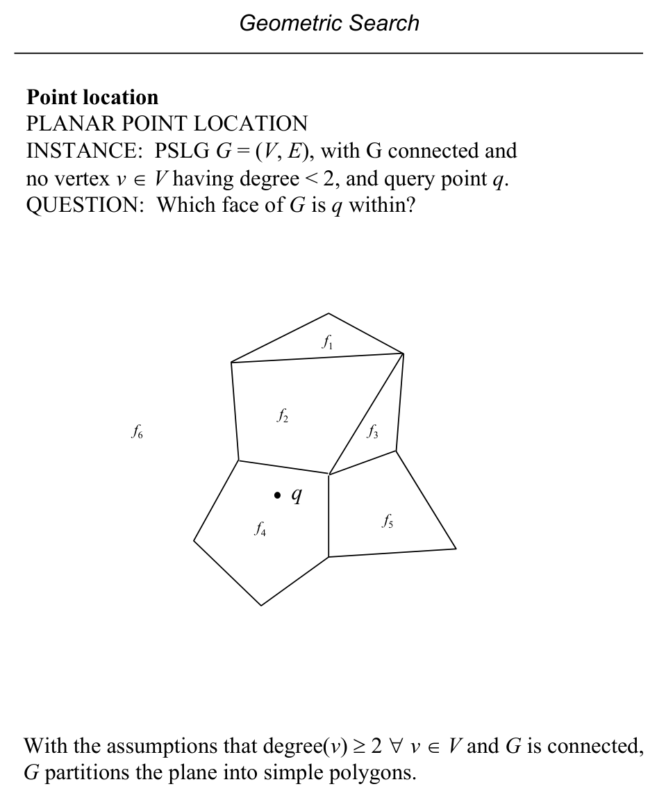
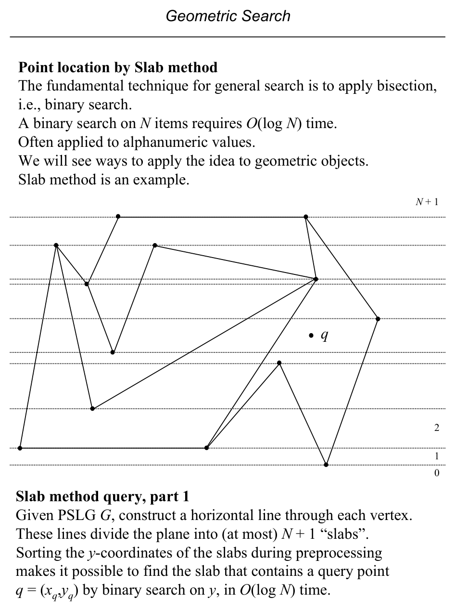
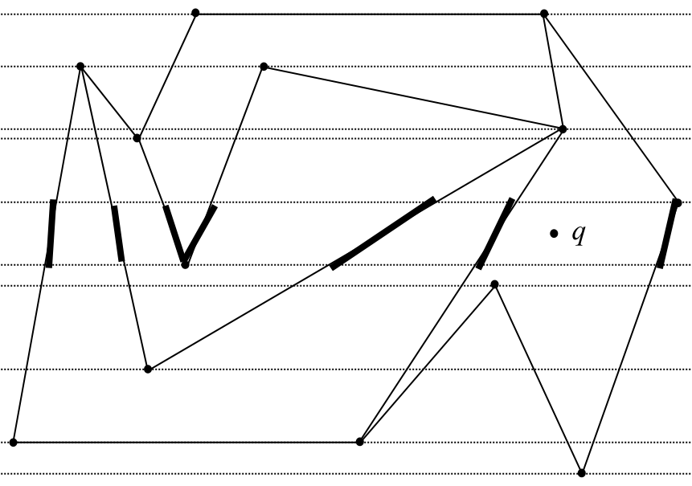
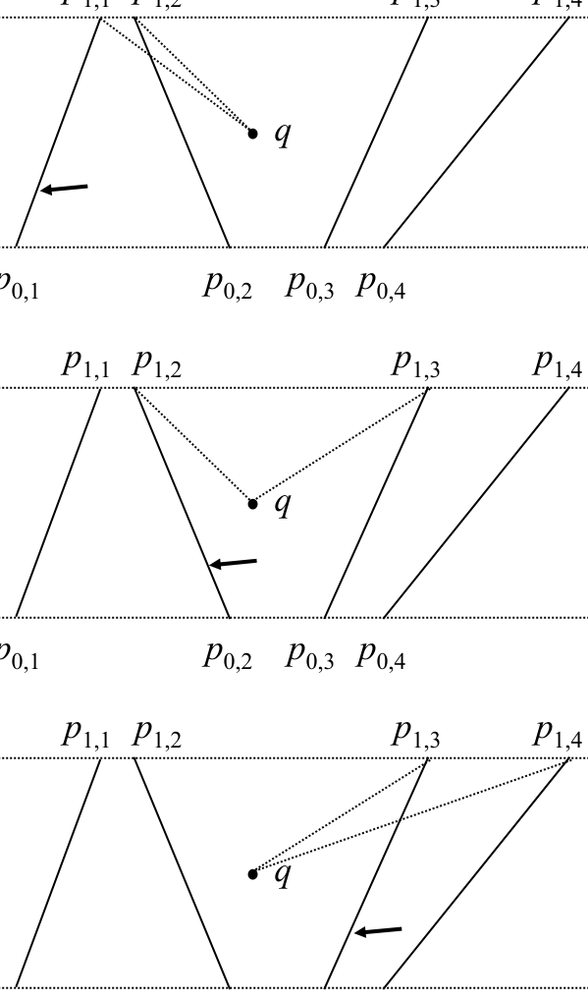
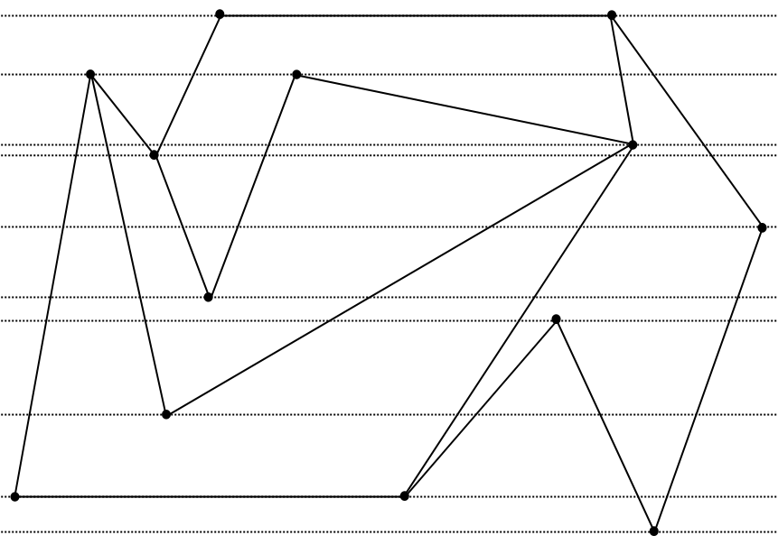

# Point Location: Brute Force, Slab Method, and Plane Sweep

**Slides covered:** 80–90  

**Topic folder:** 02 Geometric Search

## Motivation

Point location asks which face of a planar subdivision contains the query point. The slides start with slow direct methods, then move to slab decomposition and plane sweep based preprocessing.

## Lecture Roadmap

- Know the problem definition.
- Know the main geometric idea.
- Know the key data structure or primitive test.
- Know the preprocessing / query / storage or total running time.
- Know one small example by hand.

## Detailed lecture notes

### Slide 80: Planar point location

**INSTANCE:** Connected PSLG \(G=(V,E)\) with \(\deg(v) \ge 2\) for all \(v \in V\), and query point \(q\).  
**QUESTION:** Which **face** of \(G\) contains \(q\)?

Under these assumptions, \(G\) partitions the plane into simple polygonal faces.



### Slide 81: Face scan with DCEL

Represent \(G\) by a **DCEL** (\(O(N)\) preprocessing). For each face \(f\) (via `HF`), build polygon \(P_f\) from `FACE` traversal, test **simple polygon inclusion** for \(q\).

Naively one might guess \(O(N^2)\), but each edge lies in **two** faces only, so **total** work over all faces is \(O(N)\) edge traversals → **\(O(N)\)** per query, **\(O(N)\)** space.

### Slide 82: Slab method — slabs

**Binary search** on \(N\) sorted items costs \(O(\log N)\). **Slab method:** draw a **horizontal line** through **each** vertex; these divide the plane into at most **\(N+1\)** horizontal **slabs**. Preprocess slab boundaries; locate \(q=(x_q,y_q)\)’s slab by **binary search on \(y\)** in \(O(\log N)\).



### Slide 83: Slab method — segments inside a slab

Inside a slab, edges of \(G\) become disjoint **segments** (no crossings). They are **totally ordered** left-to-right. **Second** binary search finds the trapezoid (or strip) containing \(q\). If each region stores its face id, point location is answered.



### Slide 84: Comparisons for binary search

Compare \(q\) against segment pairs \((p_{0,j},p_{1,j})\) using **orientation** (left / on / right) to decide branch.



### Slide 85: Slab method complexity

- **Query:** \(O(\log N)\) (two binary searches).  
- **Preprocessing (naive):** \(O(N^2 \log N)\) — up to \(O(N)\) segments per slab, each sorted in \(O(N \log N)\).  
- **Space:** \(O(N^2)\) worst case for explicit slab structures.

### Slide 86: Plane sweep paradigm

Sweep a **vertical** (or horizontal) line across the plane; **process events** at discrete \(x\) (or \(y\)) where combinatorial structure changes. Used here to **build** slab structures faster than the naive \(O(N^2\log N)\).


### Slide 87: Sweep data structures

1. **Event-point schedule** — positions where the sweep stops (here: vertex \(y\)-order, **bottom-to-top** sweep).  
2. **Sweep-line status** — edges intersecting the sweep line, ordered along the line (here: **left-to-right**).

Status changes only at **vertices** of \(G\).

### Slide 88: Event processing

At vertex \(v\): delete edges ending at \(v\), insert edges starting at \(v\), read ordered intersection list to **define** the slab structure. Maintain status in a **balanced BST** with \(O(\log N)\) insert/delete.



### Slide 89: `SlabPreprocessing(G)` sketch

- `VERTEX[1:N]` — vertices sorted by increasing \(y\).  
- `B[i]` — edges incident from **below** at `VERTEX[i]`, CCW order.  
- `A[i]` — edges incident **above**, clockwise.  
- `L` — balanced tree = sweep-line status.

```
VERTEX ← sort vertices by y
L ← ∅
for i = 1 to N
  DELETE edges B[i] from L
  INSERT edges A[i] into L
  construct slab from current L
endfor
```

Arrays `A`, `B` built from DCEL in \(O(N)\).

### Slide 90: Improved preprocessing analysis

Still **\(O(N^2)\)** time to **materialize** all slab lists if each costs \(O(N)\). The sweep reduces the **sorting** bottleneck inside slabs vs. the older \(O(N^2\log N)\) approach; \(O(N\log N)\) work maintains `L` across events.

**Query** remains optimal **\(O(\log N)\)** for this structure; **\(O(N^2)\)** space/preprocessing remains a limitation for large \(N\).

## Recap

- Keep the formal problem statement precise.
- Focus on the geometric invariant used by the method.
- Remember the key complexity bound and when it applies.
