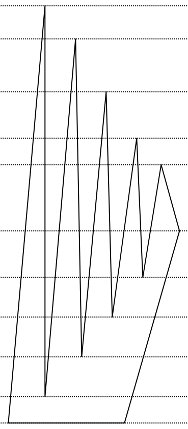

# Point Location: Brute Force, Slab Method, and Plane Sweep

**Slides covered:** 80-90  

**Topic folder:** 02 Geometric Search

## Motivation

Point location asks which face of a planar subdivision contains the query point. The slides start with slow direct methods, then move to slab decomposition and plane sweep based preprocessing.

## Lecture Roadmap

- Know the problem definition.
- Know the main geometric idea.
- Know the key data structure or primitive test.
- Know the preprocessing / query / storage or total running time.
- Know one small example by hand.

## Detailed lecture notes

### Slide 80: PLANAR POINT LOCATION

- INSTANCE:  PSLG G = (V, E), with G connected and no vertex v ∈V having degree < 2, and query point q.
- QUESTION:  Which face of G is q within?
- With the assumptions that degree(v) ≥2 ∀v ∈ V and G is connected,
- G partitions the plane into simple polygons.
- q f6 f1 f2 f3 f4 f5

### Slide 81: Consider a point location method using known techniques.

- We represent PSLG G with a DCEL
- (which requires O(N) preprocessing to construct, as seen).
- Query for each face f of G /* found via HF */ assemble a simple polygon P from edges of f
- retrieved using FACE operation  /* p. 17 */ test simple polygon inclusion for q within P
- endfor
- Analysis
- Seemingly:
- Time:  O(N2); O(N) faces and 2× O(N) operations each
- Space:  O(N); O(N) for DCEL and O(N) for P
- But each edge is in exactly 2 faces, so all executions of the loop
- have a total time of at most O(2N)  O(N), not O(N2).
- Time:  O(N)
- Space:  O(N)

### Slide 82: The fundamental technique for general search is to apply bisection,

- i.e., binary search.
- A binary search on N items requires O(log N) time.
- Often applied to alphanumeric values.
- We will see ways to apply the idea to geometric objects.
- Slab method is an example.
- Slab method query, part 1
- Given PSLG G, construct a horizontal line through each vertex.
- These lines divide the plane into (at most) N + 1 “slabs”.
- Sorting the y-coordinates of the slabs during preprocessing makes it possible to find the slab that contains a query point
- q = (xq,yq) by binary search on y, in O(log N) time.
- N + 1

### Slide 83: The intersection of a slab with G is a set of segments, from the edges of G.

- The segments define trapezoids, which may degenerate to triangles.
- G a PSLG ⇒edges intersect only at vertices.
- Each vertex defines a slab boundary ⇒
- No segments intersect within a slab.
- Segments in a slab can be totally ordered (e.g., left to right).
- Binary search can be used to find the trapezoid containing q.
- If face stored with each trapezoid during preprocessing, this gives the answer to the point location problem.
- N + 1

### Slide 84: Binary search requires a comparison operator that returns

- “less than”, “equal”, or “greater than” to direct the next step.
- p0,1 p0,2 p0,3 p0,4 p1,1 p1,2 p1,3 p1,4 q
- < p0,1p1,1q Right p0,2p1,2q Right p0,1 p0,2 p0,3 p0,4 p1,1 p1,2
- p1,3 p1,4 q
- = p0,2p1,2q Right p0,3p1,3q Left p0,1 p0,2 p0,3 p0,4 p1,1 p1,2
- p1,3 p1,4 q
- > p0,3p1,3q Left p0,4p1,4q Left

### Slide 85: Query time:  O(log N); 2× O(log N) binary search.

- At most N slabs, at most N segments per slab.
- Cannot be improved (optimum).
- Preprocessing time:  O(N2 log N); each of O(N) slabs can have as many as N segments, requiring an O(N log N) sort.
- This can be improved.
- Space:  O(N2); O(N) slabs, each with O(N) segments.
- Cannot be improved (for this algorithm).

### Slide 86: Plane sweep algorithmic technique

- Plane sweep is an algorithmic technique, or pattern, that is used frequently in computational geometry.
- The essential idea is that a geometric object, or collection of
- objects, in the plane is processed with an algorithm that is suggested by the idea of a vertical (or horizontal) line
- passing over the object(s).
- Processing occurs at discrete abscissa (or ordinates) as the line
- passes over key points in the object(s).
- Those points are called events.
- We will see how to apply this technique to perform preprocessing
- for the slab method more efficiently than O(N2 log N).
- This will also serve to introduce this important technique.

### Slide 87: Plane sweep algorithms often use two data structures:

- 1. Event-point schedule
- Sequence of positions to be assumed by the sweep-line.
- 2. Sweep-line status
- Description of the intersection of the sweep-line with the geometric object(s) being swept at the current event.
- Sweep line status
- For the slab method preprocessing, the sweep-line status is a
- left-to-right sequence of edges of G that intersect the sweep-line.
- Note that the set of edges intersected changes only at the vertices of G.
- Event-point schedule
- For the slab method, the event-point schedule is simply the vertices of G, arranged in ascending y-coordinate.
- (The sweep is bottom-to-top.)

### Slide 88: At each event, i.e., vertex v ∈V,

- 1. the edges terminating at v are deleted from the sweep-line status
- 2. the edges originating at v are added to the sweep-line status
- 3. the sweep-line status data structure is reported, and used to construct a slab.
- The sweep-line status can be maintained in a height balanced
- binary tree (e.g., a AVL tree) that provides INSERT and DELETE operations in O(log N).

### Slide 89: Data structures

- VERTEX
- Array storing vertices of G, ordered by increasing y-coordinates
- B[i]
- Set of edges incident on VERTEX[i] from below, ordered counterclockwise
- A[i]
- Set of edges incident on VERTEX[i] from above, ordered clockwise
- L
- Height balanced tree, sweep-line status.
- procedure SlabPreprocessing(G) begin
- VERTEX[1:2N] = sort the vertices of G by increasing y
- L = ∅ for i = 1 to N
- DELETE the edges in B[i] from L
- INSERT the edges in A[i] to L construct slab for edges in L endfor
- 10 end
- A and B can be built in O(N) time each from the DCEL for G.

### Slide 90: Preprocessing analysis

- Preprocessing time:  O(N2); O(N) slabs, each requiring O(N) time to construct a slab.
- There will be at most O(N) insertions and deletions to L, each requiring O(log N) time, so without the slab construction
- the time required is in O(N log N).
- Comments
- The slab method’s O(log N) query time is optimal.
- Preprocessing time reduced from O(N2 log N) to O(N2) through
- use of the plane-sweep technique.
- Still, O(N2) is unacceptable for some applications.

## Recap

- Keep the formal problem statement precise.
- Focus on the geometric invariant used by the method.
- Remember the key complexity bound and when it applies.
