# Point Location by the Chain Method

**Slides covered:** 91–117  

**Topic folder:** 02 Geometric Search

## Fast take

- Regularize the PSLG, build a **monotone complete** set of chains, then binary-search the chains and one chain segment.
- Monotonicity makes point-chain discrimination logarithmic instead of linear.
- Idealized bounds are **O(log^2 N)** query, **O(N log N)** preprocessing, **O(N)** space.
- The construction is the hard part, not the query idea.

## Recording notes

**Recording references:** `CS 564 - 02.06 5.1.txt`, `CS 564 - 02.06 5.2.txt`

- The lecture stressed that “monotone” means **no doubling back** with respect to the chosen axis. That is the property binary search feeds on.
- There are slide/textbook issues around regularization, and the instructor called them out directly. So do not memorize the textbook blindly.
- The method is elegant in theory, but the implementation details are much less friendly than the top-level story suggests.
- If you only remember one thing: the chain method pays a lot of preprocessing pain to turn geometric search into two nested binary searches.

## Motivation

The chain method regularizes a planar subdivision, decomposes it into monotone chains, and then uses binary search twice. It is a classic example of paying preprocessing cost to get fast queries.

## Lecture Roadmap

- Know the problem definition.
- Know the main geometric idea.
- Know the key data structure or primitive test.
- Know the preprocessing / query / storage or total running time.
- Know one small example by hand.

## Detailed lecture notes

### Slide 91: Pipeline

**Problem:** Point location in a PSLG \(G\) — which face contains \(q\)?

**Preprocessing:**

1. **Regularize** \(G\) → regular PSLG.  
2. Build a **monotone complete** chain set \(C\) for the regular graph.

**Query:**

1. Binary search **chains** to bracket \(q\).  
2. Binary search along one chain to identify the **face**.

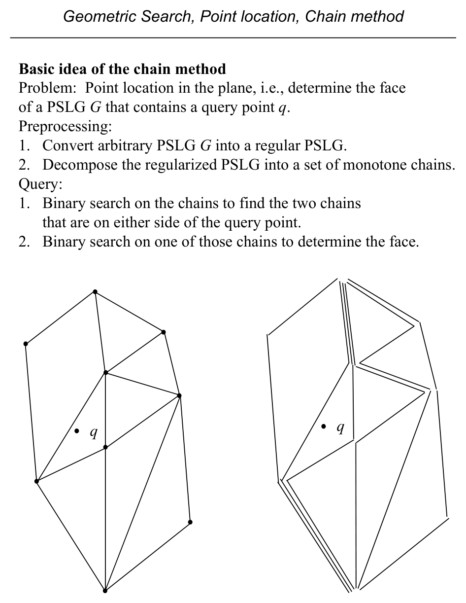

### Slide 92: Stages (reverse teaching order)

Slides cover: binary search on chains → construction of \(C\) → **regularization** of arbitrary PSLGs. See Preparata–Shamos text pp. 48–54.

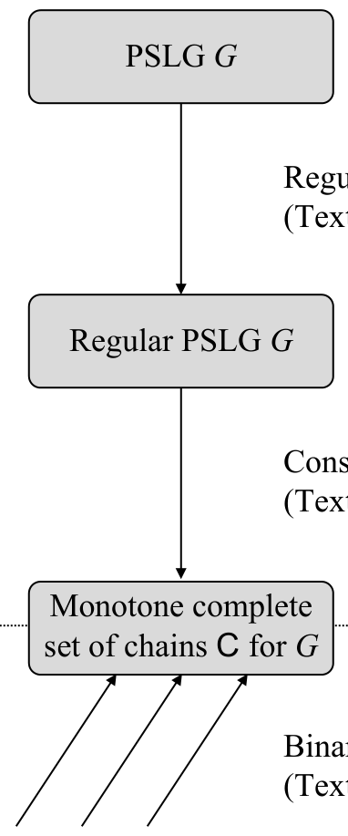

### Slide 93: Chains

A **chain** \(C=(v_1,\ldots,v_p)\) is a PSLG path with edges \((v_i,v_{i+1})\). (Notation: \((\ldots)\) sequence, \(\{\ldots\}\) set.)

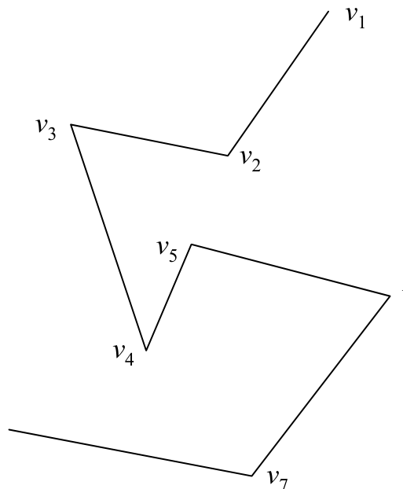

### Slide 94: Chains that split the plane

A chain whose endpoints lie on the unbounded face, extended by **parallel rays**, partitions the plane into two half-regions.

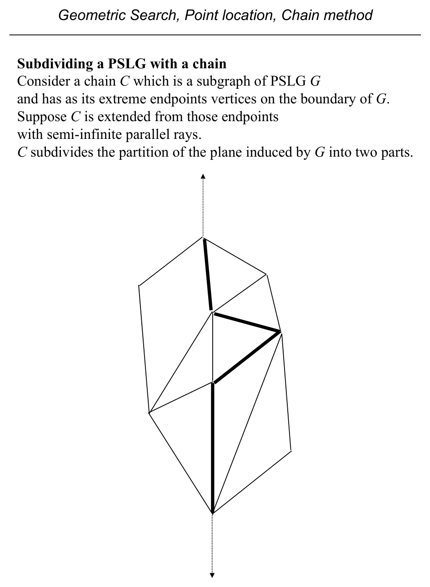

### Slide 95: Point–chain discrimination

To binary search on chains we need **which side** of chain \(C\) contains \(q\) — **point–chain discrimination**. For arbitrary chains this is as hard as general polygon inclusion (**\(O(N)\)**). We need **monotone** chains for **\(O(\log N)\)** discrimination.

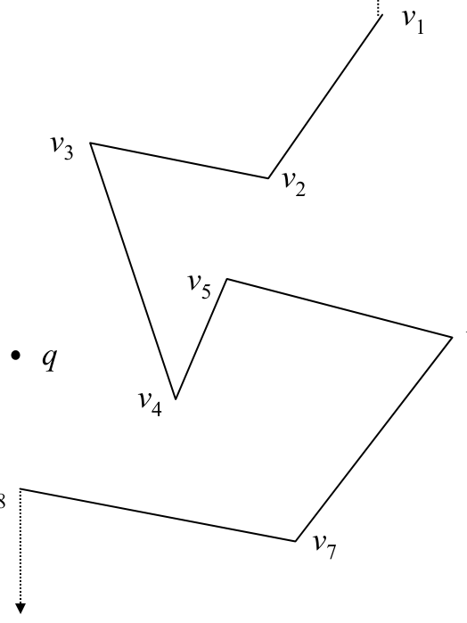

### Slide 96: Monotone chain

Chain \(C\) is **monotone** w.r.t. line \(L\) if every line **orthogonal** to \(L\) meets \(C\) in **at most one** point (no doubling back). **Text errata:** Def. 2.2 p. 49 should say “at most one” not “exactly one”; Fig. 2.11(b) uses \(p\) not \(z\).

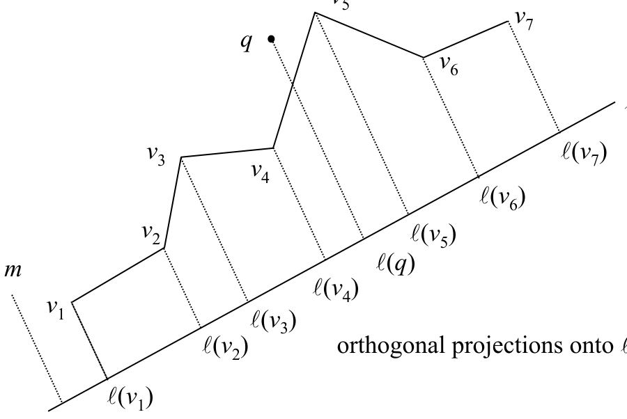

### Slide 97: Projections order

For monotone \(C\), projections \(\ell(v_1),\ldots,\ell(v_p)\) onto \(L\) appear in the **same order** as the vertices along \(C\).

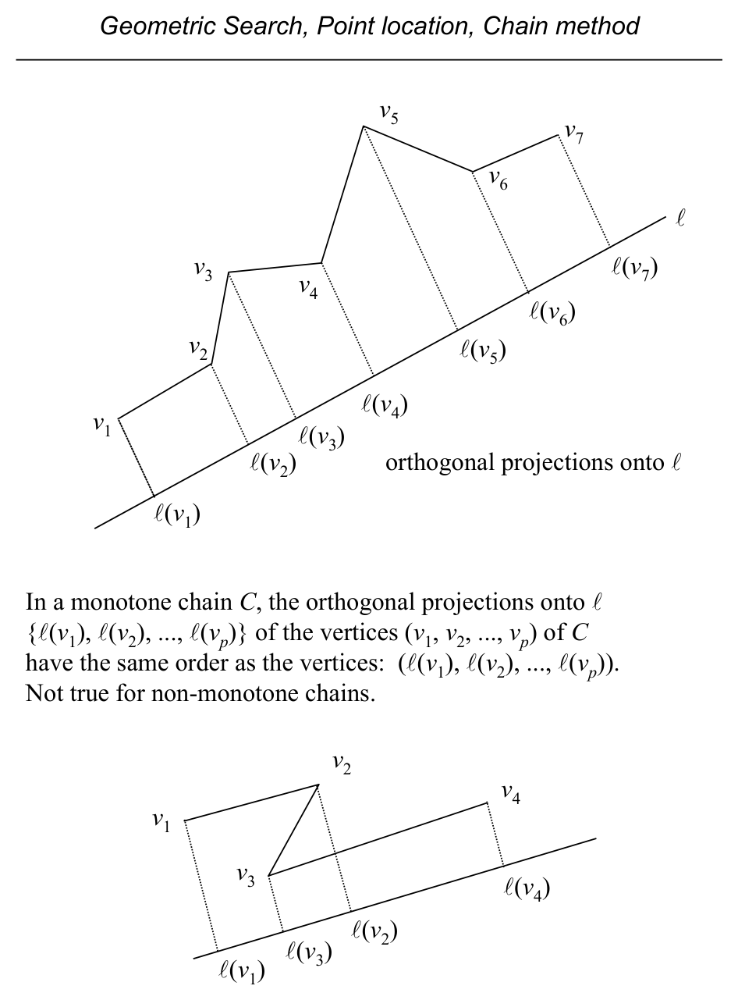

### Slide 98: Discriminating a monotone chain

**Preprocess:** store sorted projections of vertices onto \(L\).

**Query \(q\):**

1. Project \(q\) to \(\ell(q)\) — \(O(1)\).  
2. Binary search for segment \(v_i v_{i+1}\) containing the projection — \(O(\log p)\).  
3. \(q\) is **left** of \(C\) iff \(v_i v_{i+1} q\) is a **left** turn — \(O(1)\).

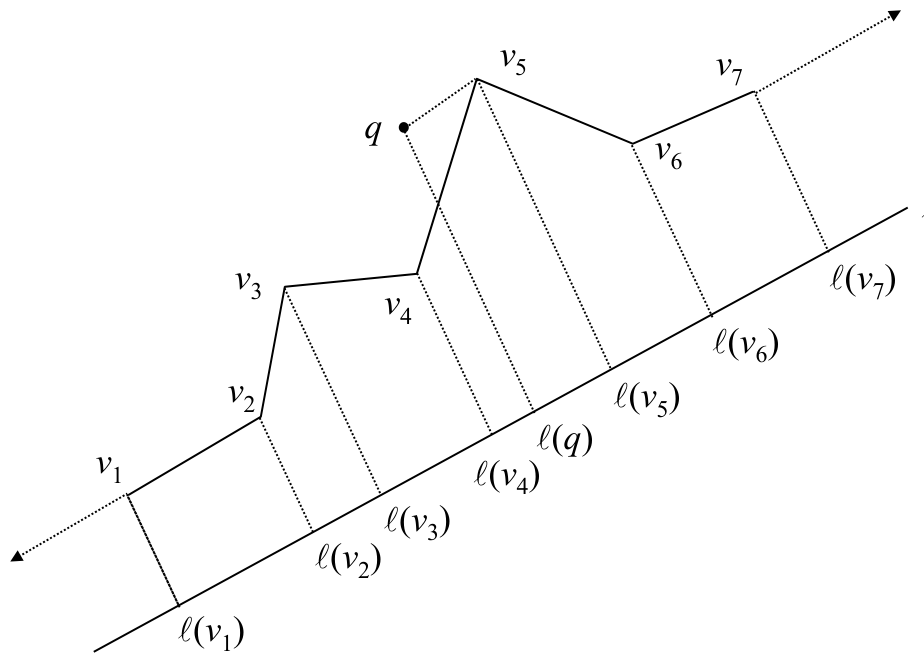

### Slides 99–100: Monotone complete chain set

A family \(\mathcal{C}=\{C_1,\ldots,C_r\}\) of chains, all monotone w.r.t. the **same** line \(L\), is **monotone complete** for \(G\) if:

1. \(\bigcup_i C_i\) **covers** every edge of \(G\) (edges may appear in several chains).  
2. For any \(C_i,C_j\), vertices of \(C_i\) **not** on \(C_j\) lie strictly on **one side** of \(C_j\).

Then chains are **totally ordered**; binary search with monotone discrimination costs **\(O(\log r \cdot \log p) = O(\log^2 N)\)** when \(r,p=O(N)\).

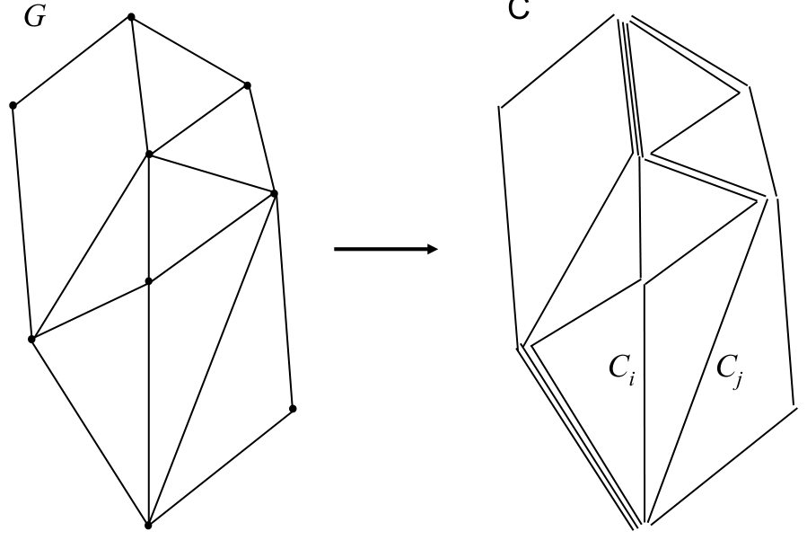

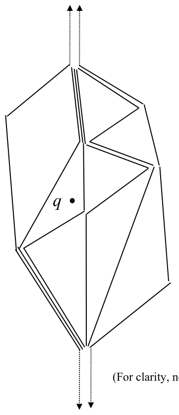

### Slides 101–105: Regular PSLG and weights

**Regular indexing:** vertices \(v_1,\ldots,v_N\) sorted primarily by **increasing \(y\)**, ties by **decreasing \(x\)**.

**Regular vertex:** for \(1<j<N\), there exist \(i<j<k\) with edges \(v_i v_j\) and \(v_j v_k\). **Regular PSLG:** every interior vertex in this ordering is regular (except extremes \(v_1,v_N\)).

**Directed edges:** \(i<j\) means edge **into** \(v_j\) from below is **incoming**; **outgoing** to higher index.

**\(y\)-monotone chains** from \(v_1\) to any \(v_j\) exist by induction using one incoming edge.

To obtain a monotone complete set: assign integer **weights** \(W(e)>0\) to edges so that at each internal vertex, **sum of weights on incoming edges = sum on outgoing edges**. Then replicate each edge in \(W(e)\) parallel chains (combinatorially). Conditions (1)–(2) for complete sets follow.

### Slide 106: `WeightBalancingInRegularPSLG`

Initialize \(W(e)=1\). **First pass** \(i=2..N-1\): ensure \(\text{WIN}(v_i) \le \text{WOUT}(v_i)\) by increasing weight on a chosen outgoing edge if needed. **Second pass** \(i=N-1..2\): symmetric fix using an incoming edge. Result: **flow conservation** at each interior vertex.

### Slide 107: Weight figures

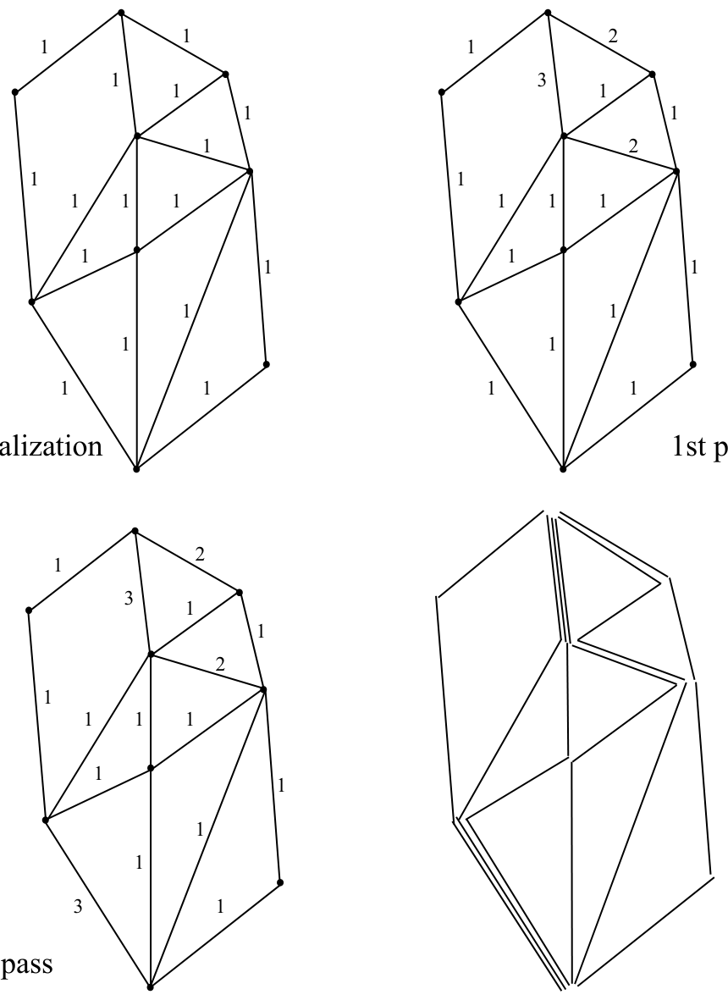

### Slides 108–109: Building chains; regularization overview

Weight pass is **\(O(N)\)** but only sets multiplicities; actual **chain extraction** can be done during the second pass (exercise). Next: turn arbitrary PSLGs into **regular** ones.

### Slides 110–112: Regularizing vertices

Non-regular vertex: missing required incoming or outgoing edge in the order. Add **diagonal** edges to restore regularity; may split faces (split faces share identity for point location).

Slide discusses potential **text bug** (p. 52–53): claimed segment \(vv^\*\) might cross edges in some configurations.

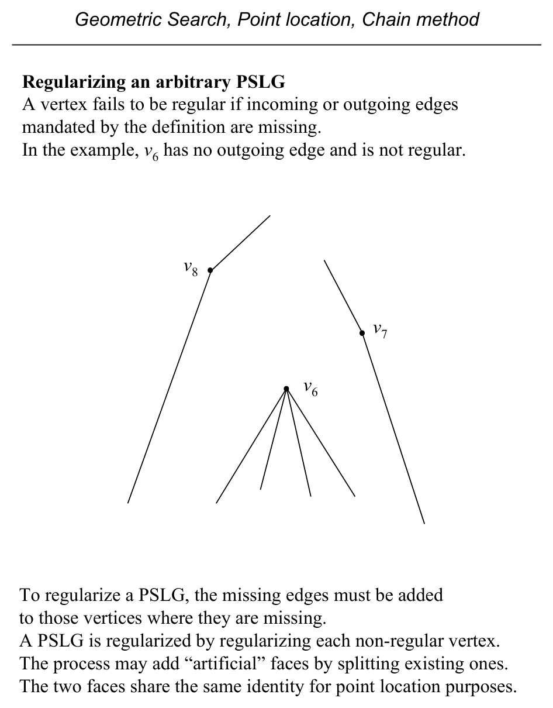

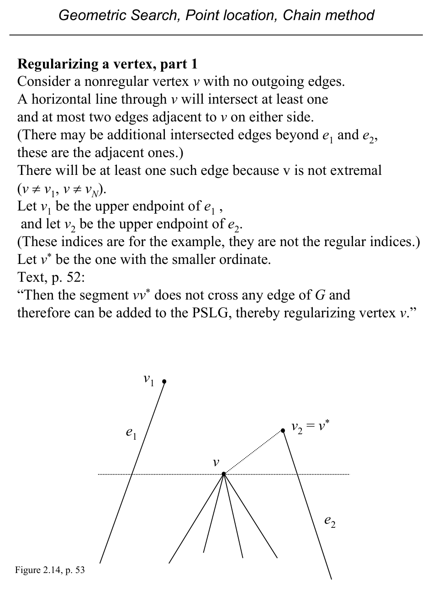

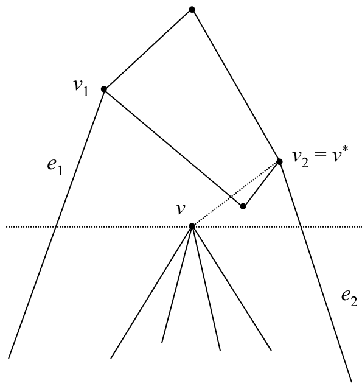

### Slides 113–115: Two sweeps for regularization

**Overview:** (1) **top-down** sweep fixes vertices lacking **outgoing** edges; (2) **bottom-up** fixes those lacking **incoming** edges.

Sweep-line status: ordered intersections with sweep line + lowest vertex per interval; balanced BST, \(O(\log N)\) updates per event. Slide **115** notes possible **\(O(N^2)\)** complication if intersection coordinates must be recomputed every event — text omits details. Citation fix: Lee–Preparata **(1977)** not (1978).

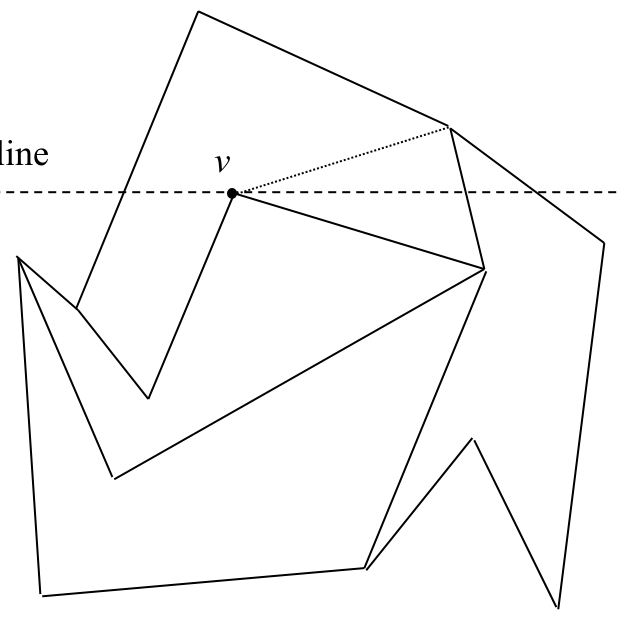

### Slide 116: Summary bounds

- **Query:** **\(O(\log^2 N)\)**.  
- **Preprocessing:** **\(O(N\log N)\)** — regularization sweeps; building \(C\) from regular graph **\(O(N)\)**.  
- **Space:** **\(O(N)\)** (text pp. 54–55).

### Slide 117: Toward \(O(\log N)\) query

Chain method achieves \(O(\log^2 N)\); triangle refinement (next lectures) improves query time.

## Recap

- **Monotone chains** w.r.t. a line allow **\(O(\log N)\)** point–chain discrimination via **projection + binary search + one turn test**.
- A **monotone complete** set of chains covering the PSLG supports **nested binary search** — **\(O(\log^2 N)\)** query.
- **Regularize** the PSLG (add edges so every interior vertex has incoming/outgoing in the \(y\)-order); **weight-balancing** on edges yields multiplicities, then **build chains**.
- **Preprocessing** **\(O(N \log N)\)** (sweeps + construction); **space** **\(O(N)\)**; slide notes subtle issues on sweep implementation and text errata.
