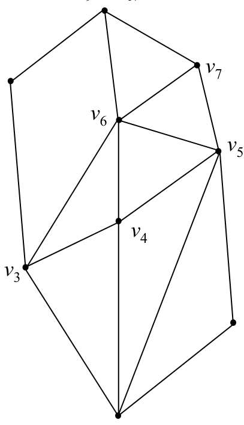
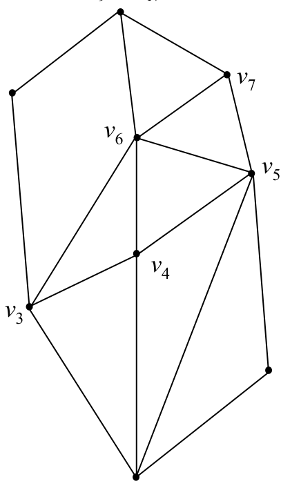
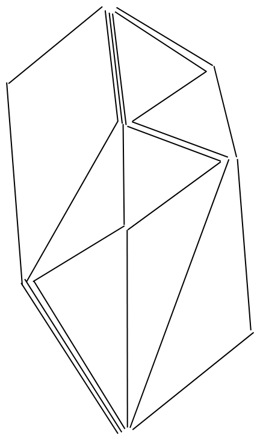
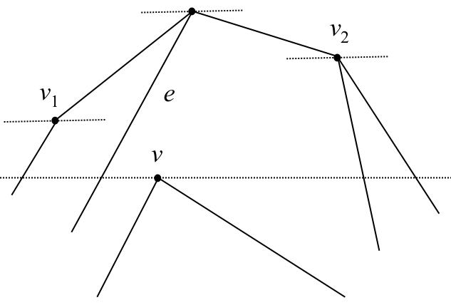

# Point Location by the Chain Method

**Slides covered:** 91-117  

**Topic folder:** 02 Geometric Search

## Motivation

The chain method regularizes a planar subdivision, decomposes it into monotone chains, and then uses binary search twice. It is a classic example of paying preprocessing cost to get fast queries.

## Lecture Roadmap

- Know the problem definition.
- Know the main geometric idea.
- Know the key data structure or primitive test.
- Know the preprocessing / query / storage or total running time.
- Know one small example by hand.

## Detailed lecture notes

### Slide 91: Problem:  Point location in the plane, i.e., determine the face

- of a PSLG G that contains a query point q.
- Preprocessing:
- 1. Convert arbitrary PSLG G into a regular PSLG.
- 2. Decompose the regularized PSLG into a set of monotone chains.
- Query:
- 1. Binary search on the chains to find the two chains that are on either side of the query point.
- 2. Binary search on one of those chains to determine the face.

### Slide 92: PSLG G

- Monotone complete set of chains C for G
- Regular PSLG G q2 q3 q1
- Regularize PSLG G
- (Text pp. 52-54)
- Construct C for regular G
- (Text pp. 50-52)
- Queries
- Preprocessing
- The chain method (and the text’s exposition) has several stages.
- We will cover them in reverse order.
- Binary search C
- (Text pp. 48-50)

### Slide 93: A chain C = (v1, v2, ..., vp) is a PSLG with vertex set {v1, v2, ..., vp}

- and edge set{(vi,vi+1): i = 1, 2, ..., p - 1}.
- Notational notes:
- 1. v for vertices; text uses u on pp. 48-49 and v pp. 50-55.
- 2. ( ... ) sequence, { ... } unordered set v1 v2 v3 v4 v5 v6
- v7 v8
- A chain is a planar embedding of a graph theoretic chain.
- Sometimes called polygonal line.

### Slide 94: Subdividing a PSLG with a chain

- Consider a chain C which is a subgraph of PSLG G and has as its extreme endpoints vertices on the boundary of G.
- Suppose C is extended from those endpoints with semi-infinite parallel rays.
- C subdivides the partition of the plane induced by G into two parts.

### Slide 95: Point-chain discrimination

- To use a binary search for point location based on chains, we must be able to determine which side of a chain C
- a query point q is on.
- That operation is point-chain discrimination.
- Point-chain discrimination against an arbitrary chain is equivalent in difficulty to general polygon inclusion,
- requiring O(N) time.
- We need to do better than O(N) for the binary search comparison.
- To do so we need a more restricted type of chain.
- v1 v2 v3 v4 v5 v6 v7 v8 q

### Slide 96: A chain C = (v1, v2, ..., vp) is monotone w.r.t. a line l if a line

- orthogonal to l intersects C in at most one point.
- There is no “doubling back” or “overlap” of C w.r.t. l.
- Note two small errors in the text:
- 1.
- p. 49, Definition 2.2:
- “... in exactly one point.” should be “... at most one point.”
- For example, line m is orthogonal to l, intersects C in zero points.
- Definition 2.2 is correct iff C has been extended with the previously
- mentioned semi-infinite rays, but the definition doesn’t say so.
- 2.
- p. 49, Figure 2.11(b)
- Text refers to “query point z”, figure has “p”.  (I use q.) l
- v7 v6 v4 v5 v3 v2 v1 l(v6) l(v7) l(v5) l(v4) l(v3) l(v2) l(v1)
- orthogonal projections onto l m q l(q)

### Slide 97: {l(v1), l(v2), ..., l(vp)} of the vertices (v1, v2, ..., vp) of C

- have the same order as the vertices:  (l(v1), l(v2), ..., l(vp)).
- Not true for non-monotone chains.
- l v7 v6 v4 v5 v3 v2 v1 l(v6) l(v7) l(v5) l(v4) l(v3) l(v2) l(v1)
- orthogonal projections onto l v1 v2 v3 v4 l(v1) l(v2) l(v3) l(v4)

### Slide 98: Point-chain discrimination with a monotone chain

- The point-chain discrimination operation can be performed more efficiently with a monotone chain.
- Assumptions:
- 1. Chain C has been extended with the semi-infinite rays.
- 2. The orthogonal projections (l(v1), l(v2), ..., l(vp)) of the vertices of C have been computed
- and stored in a searchable data structure (preprocessing).
- Operation:
- 1. Compute orthogonal projection l(q) of q on l.  O(1)
- 2. Binary search “on l” for i ∋l(vi) ≤l(q) ≤l(vi+1).  O(log N)
- 3. Point q is left of C iff vivi+1q is a Left turn.  O(1) l v7
- v6 v4 v5 v3 v2 v1 q l(v6) l(v7) l(v5) l(q) l(v4) l(v3) l(v2)
- l(v1)

### Slide 99: Point location query with monotone chains, part 1

- Given an O(log N) point-chain discrimination operation, how can it be used for a point location query?
- Suppose there is a set C = {C1, C2, ..., Cr} of chains that are monotone w.r.t. the same line l
- and with these two properties:
- (1)  The union of the members of C contains the PSLG G
- (a given edge of G may be in more than one chain in C).
- (2) For any two chains Ci and Cj of C , the vertices of Ci which are not members of Cj lie on the same side of Cj.
- Such a set C is a monotone complete set of chains of G.
- (We will see later how to construct such a set C for any PSLG G.)
- l
- Ci
- Cj
- G
- C

### Slide 100: Property 2 means that the chains of C are ordered.

- Therefore, C can be binary searched with the point-chain discrimination operation as the comparison operator.
- If there are r chains and the longest has p vertices, the search uses O(log r · log p) time.
- Because r and p ∈O(N), the search is in O((log N)2).
- The latter is often written O(log2 N), e.g., see text p. 56.
- (For clarity, not all rays shown.)

### Slide 101: PSLG G

- Monotone complete set of chains C for G
- Regular PSLG G q2 q3 q1
- Regularize PSLG G
- (Text pp. 52-54)
- Construct C for regular G
- (Text pp. 50-52)
- Queries
- Preprocessing
- We have seen how to use a monotone complete set of chains C for a PSLG G to perform a point location query on G.
- But how is C constructed from a regular PSLG G?
- (This is the second preprocessing stage.)
- Binary search C
- (Text pp. 48-50)

### Slide 102: Definition of regular PSLG

- Let G be a PSLG with vertex set (v1, v2, ..., vN), where the vertices are indexed ∋i < j iff
- either y(vi) < y(vj) or, if y(vi) = y(vj), then x(vi) > x(vj).
- A vertex vj is regular if there are integers 1 ≤i < j < k ≤N
- ∋vivj and vjvk are edges of G.
- PSLG G is regular iff every vertex vj for 1 < j < N of G is regular (i.e., except v1 and vN).
- v6 v7 v5 v8 v9 = v N v3 v4 v2 v1

### Slide 103: We may think of an edge vivj as directed from vi to vj if i < j.

- Thus, for a specific vertex vj, all edges vivj with i < j are
- “incoming” and all edges vjvk with j < k are “outgoing”.
- We can define for a vertex vj
- IN(vj) as the set of incoming edges to vj , ordered counterclockwise,
- OUT(vj) as the set of outgoing edges from vj, ordered clockwise.
- Due to the hypothesis of regularity, both of these sets are non-empty for non-extreme vertices.
- v6 v7 v5 v8 v9 = v N v3 v4 v2 v1
- IN(v6) = (v3, v4, v5)
- OUT(v6) = (v9, v7)

### Slide 104: For any vertex vj (j ≠ 1) in a regular PSLG, we can construct a

- y-monotone chain from v1 to vj.
- (y-monotone ≡ monotone w.r.t. the y axis)
- This can be proven by mathematical induction.
- Basis step. Let j = 2.  Edge v1v2 must exist in G by the definition
- of regularity, and completes the chain.
- Induction step. Assume ∃ a chain from v1 to vk, ∀ k < j.
- Because vj is regular, ∃ some i < j ∋ vivj is an edge of G.
- By the inductive hypothesis, ∃ a y-monotone chain from v1 to vi.
- Adding edge vivj to that chain gives the desired y-monotone chain from v1 to vj.
- This shows that monotone chains can be built for G, but we want a set of monotone chains C with specific properties.

### Slide 105: Those properties are:

- (1) The union of the members of C contains the PSLG G
- (a given edge of G may be in more than one chain in C).
- (2) For any two chains Ci and Cj of C , the vertices of Ci which are not members of Cj lie on the same side of Cj.
- Let W(e), the weight of edge e, be the number of chains to which edge e belongs.  Also let
- WIN(v) =
- ∑    W(e)
- Sum of weights of  “incoming” edges e ∈IN(v)
- WOUT(v) =
- ∑    W(e)
- Sum of weights of “outgoing” edges e ∈OUT(v)
- We want to set the edge weights W(e) ∀e in G so that
- (1) each edge has positive weight, i.e., W(e) > 0
- (2) for each vertex vj (1 < j < N), WIN(vj) = WOUT(vj)
- Condition (1) ensures that property (1) is met.
- (Because every edge will be in the union.)
- Condition (2) ensures that property (2) is met.
- (Because WIN(vj) chains pass through vj and can be chosen so that they do not cross.)

### Slide 106: Assigning edges weights ∋WIN(vj) = WOUT(vj) is an old problem.

- A two pass algorithm accomplishes it.
- All weights W(e) are initialized to 1.
- The first pass ensures that WIN(vj) ≤WOUT(vj) for 1 < j < N.
- The second pass ensures WIN(vj) ≥WOUT(vj), for 1 < j < N.
- Together these give the desired balancing.
- Let vIN(v) = |IN(v)| and vOUT(v) = |OUT(v)|.
- procedure WeightBalancingInRegularPSLG(G) begin for each edge e in G /* Initialization */
- W(e) = 1 endfor for i = 2 to N - 1  /* First pass */
- WIN(vi) = sum of weights of incoming edges of vi d1 = leftmost outgoing edge of vi
- if
- (WIN(vi) > vOUT(vi))
- W(d1) = WIN(vi) - vOUT(vi) + 1 endif endfor for i = N - 1 to 2  /* Second pass */
- WOUT(vi) = sum of weights of incoming edges of vi d2 = leftmost incoming edge of vi
- if
- (WOUT(vi) > vIN(vi))
- W(d2) = WOUT(vi) - vIN(vi) + W(d2) endif endfor
- 20 end

### Slide 107: The figures show the weights after each pass.

- Initialization
- 2nd pass
- 1st pass
- C

### Slide 108: The algorithm requires O(N) time.

- Observe that the algorithm assigns weights that tell how many
- chains each edge will be in, but it does not actually construct chains.
- How are the chains of C actually constructed from G using the edge weights assigned by the weight balancing algorithm?
- The chains can be built up during the second pass, as the pass proceeds from vertex to vertex.
- The details are left as an exercise.

### Slide 109: PSLG G

- Monotone complete set of chains C for G
- Regular PSLG G q2 q3 q1
- Regularize PSLG G
- (Text pp. 52-54)
- Construct C for regular G
- (Text pp. 50-52)
- Queries
- Preprocessing
- How is an arbitrary PSLG regularized?
- (This is the first preprocessing stage.)
- Binary search C
- (Text pp. 48-50)

### Slide 110: Regularizing an arbitrary PSLG

- A vertex fails to be regular if incoming or outgoing edges mandated by the definition are missing.
- In the example, v6 has no outgoing edge and is not regular.
- v7 v8 v6
- To regularize a PSLG, the missing edges must be added to those vertices where they are missing.
- A PSLG is regularized by regularizing each non-regular vertex.
- The process may add “artificial” faces by splitting existing ones.
- The two faces share the same identity for point location purposes.

### Slide 111: Consider a nonregular vertex v with no outgoing edges.

- A horizontal line through v will intersect at least one and at most two edges adjacent to v on either side.
- (There may be additional intersected edges beyond e1 and e2,
- these are the adjacent ones.)
- There will be at least one such edge because v is not extremal
- (v ≠v1, v ≠vN).
- Let v1 be the upper endpoint of e1 , and let v2 be the upper endpoint of e2.
- (These indices are for the example, they are not the regular indices.)
- Let v* be the one with the smaller ordinate.
- Text, p. 52:
- “Then the segment vv* does not cross any edge of G and therefore can be added to the PSLG, thereby regularizing vertex v.”
- v2 = v* v1 v e1 e2
- Figure 2.14, p. 53

### Slide 112: Text, p. 52:

- “Then the segment vv* does not cross any edge of G and therefore
- can be added to the PSLG, thereby regularizing vertex v.”
- Is that correct?  I don’t think so.  Consider the example.
- v2 = v* v1 v e1 e2
- Edges e1 and e2 are still the edges adjacent to the non-regular
- vertex v along the horizontal line, but edge vv* can not be added to G.

### Slide 113: We turn from the observation to the regularization process.

- In overview:
- Regularization requires two plane sweeps of the PSLG:
- 1. top-to-bottom, to regularize vertices with no outgoing edge
- 2. bottom-to-top, to regularize vertices with no incoming edge
- Consider the top-to-bottom sweep.
- The event-point schedule is the vertex sequence (vN, vN-1, ..., v1).
- The sweep-line status data structure maintains
- 1. the left-to-right order of the intersections of the sweep-line with
- the PSLG, which induce intervals along the sweep-line, and
- 2. a vertex of the PSLG which is the lowest vertex in each interval;
- it will be an endpoint of one of the (at most) two edges that
- delimit the interval.
- The sweep-line status data structure is a height-balanced tree that supports insertion and deletion operations in O(log N) time
- (such as an AVL tree.)

### Slide 114: For each event (each vertex v):

- 1. Find the interval in the sweep-line status that contains v.
- 2. Update the sweep-line status.
- 3. If v is not regular, add an edge from v to the vertex associated in the sweep-line status data structure with the
- interval found for v in step 1.
- Each sweep requires O(N log N) time; it may be necessary to sort
- the vertices into the event-point schedule requiring O(N log N) time,
- and during the sweep there will be O(N) insertions and deletions,
- each requiring O(log N) time.
- v sweep-line

### Slide 115: Does the process actually run in O(N log N) time?  I’m not sure.

- How do we know whether to connect v  to v1  or v2  ?
- By whether v is to right or to the left of the intersection of edge e
- and the sweep-line, which must be computed at the event for v.
- ⇒The intersection point with the sweep-line for all active edges
- (i.e., those in the sweep-line status data structure) must be computed
- at each event.
- ⇒O(N) processing per event.
- ⇒O(N2) total processing.
- v e v1 v2 sweep-line
- The text omits the details.
- More study needed, course project?
- Note error on p. 48:  “Lee and Preparata (1978)” should be “(1977)”.

### Slide 116: Query:  O(log2 N)

- Binary search O(log N) with each comparison taking O(log N)
- Preprocessing:  O(N log N)
- Regularizing G, O(N log N)
- Constructing C from regular G, O(N)
- Space:  O(N)
- See text pp. 54-55 for details of space analysis.

### Slide 117: PSLG G

- Monotone complete set of chains C for G
- Regular PSLG G q2 q3 q1
- Regularize PSLG G
- (Text pp. 52-54)
- Construct C for regular G
- (Text pp. 50-52)
- Queries
- Preprocessing
- We’ve seen all stages of the chain method.
- But can we do better than an O(log2 N) query?
- Binary search C
- (Text pp. 48-50)

## Recap

- Keep the formal problem statement precise.
- Focus on the geometric invariant used by the method.
- Remember the key complexity bound and when it applies.
