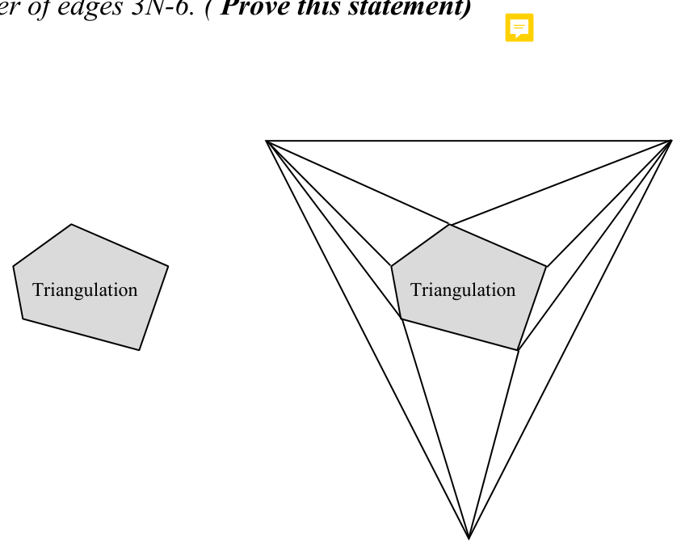

# Point Location by the Triangle Refinement Method

**Slides covered:** 118-134  

**Topic folder:** 02 Geometric Search

## Motivation

This method triangulates the subdivision and builds a directed acyclic search structure across a sequence of triangulations. Querying becomes a guided walk through that structure.

## Lecture Roadmap

- Know the problem definition.
- Know the main geometric idea.
- Know the key data structure or primitive test.
- Know the preprocessing / query / storage or total running time.
- Know one small example by hand.

## Detailed lecture notes

### Slide 118: PSLG G

- Directed acyclic search graph T
- Triangulated PSLG G q2 q3 q1
- Triangulate PSLG G
- (To be covered later)
- Construct sequence of triangulations and directed acyclic search graph T
- (PS pp. 56-58)
- Queries
- Preprocessing
- Search T
- (PS p. 58)

### Slide 119: Triangulation

- A planar subdivision (e.g., a PSLG) is a triangulation if all its bounded regions are triangles.
- Not a triangulation
- Triangulation
- A triangulation of a finite set of points S is a planar graph on S
- with the maximum number of edges.  There may be more than one triangulation for a given S, but they all have this property.
- The number of edges in a triangulation is at most 3N - 6, where N is the number of vertices. (Prove this statement by
- applying induction on N).

### Slide 120: We assume that the PSLG given in the point location problem is

- a triangulation; if not, it is transformed into one in O(N) time.
- We will study triangulation algorithms later.
- We further assume that the triangulation has a triangular boundary.
- If not, one can be added in O(1) time by adding three vertices
- and triangulating the “inbetween” region.
- This will produce a triangulation with the maximum number of edges 3N-6. ( Prove this statement)
- Triangulation

### Slide 121: Note that the text, published in 1985, says O(N log N) time is

- needed for the triangulation (p. 56).
- Chazelle published an O(N) triangulation algorithm in 1991; see O’Rourke pp. 64-65.
- Explaining Chazelle’s algorithm would be a (challenging) course project.
- Hereinafter, we assume:
- 1.  G is a triangulation
- 2.  G has a triangular boundary
- 3.  G has exactly 3N - 6 edges (∈O(N))
- Though this triangulated G is not the PSLG we started with, we will call it G, and say it has N vertices.

### Slide 122: PSLG G

- Directed acyclic search graph T
- Triangulated PSLG G q2 q3 q1
- Triangulate PSLG G
- (To be covered later)
- Construct a sequence of triangulations and directed acyclic search graph T
- (PS pp. 56-58)
- Queries
- Preprocessing
- Search T
- (PS  p. 58)

### Slide 123: triangulations S1, S2, ..., Sh(N), where S1 = G and Si is obtained from

- Si-1 as follows:
- (1) Remove a maximal independent set of nonboundary vertices of
- Si-1 and their incident edges. A set of vertices of a graph (in our
- case a planar graph) is said to be independent if no two pair of
- vertices are adjacent in the graph. A maximal set is one such that
- adding one more vertex will make at least one pair of vertices to
- become adjacent.  How this set is chosen will determine the performance of the algorithm.
- (2) Retriangulate the polygons arising from the removal of vertices and edges.
- Sh(N), the final triangulation in the sequence, has no internal vertices;
- it is just one triangle. In the example below, the numbers denote
- faces; the set of circled vertices denote independent set.
- S3
- S1
- S2
- S4

### Slide 124: The notation Rj denotes a triangle.

- A triangle Rj may appear in more than one triangulation in the sequence, but is said to belong to triangulation Si
- if Rj was created in step (2) while constructing Si.
- Search data structure
- We now build a search data structure T, an acyclic directed graph.
- The nodes of T represent triangles.
- When discussing T, we say “triangle Rj” or just “Rj” when “the node of T that represents Rj” is meant.
- In T, there is an arc from triangle Rk to triangle Rj if, when constructing triangulation Si from triangulation Si-1, we have
- 1. Rj is removed from Si-1 in step (1)
- 2. Rk is created in Si in step (2)
- 3. Rj ∩Rk ≠ ∅
- The triangles in S1 have no outgoing arcs (they are not created).
- All other triangles in T will have outgoing arcs. T is also called
- the triangulation intersection graph.

### Slide 125: S2

- S3
- S4
- S3
- S1
- S2
- S4

### Slide 126: PSLG G

- Directed acyclic search graph T
- Triangulated PSLG G q2 q3 q1
- Triangulate PSLG G
- (To be covered later)
- Construct sequence of triangulations and directed acyclic search graph T
- (PS pp. 56-58)
- Queries
- Preprocessing
- Search T
- (PS p. 58)

### Slide 127: The query process uses a primitive operation, triangle inclusion,

- which can be computed in O(1) with 3 Left tests.
- The query begins by determining if the query point q is within the enclosing triangle.
- If not, the unbounded face is the answer to the query.
- If it is, the current node is set to the root node of T.
- Then q is tested for inclusion in the triangle for each of the
- descendants of the current node; it will be in exactly one.
- The search advances along the arc to that node, which becomes the current node, and the process repeats.
- Eventually the bottom of T is reached
- (the nodes for Si, the original triangulation of G).
- The triangle corresponding to the node so reached is the answer
- to the point location problem. If the original PSLG were not
- triangulated, a set of triangles located in a given face of PSLG
- will represent that face.

### Slide 128: S2

- S3
- S4
- S3
- S1
- S2
- S4
- Query starts here

### Slide 129: Query process

- Define Γ(v) to be a list of all descendants of node v of T, and TRIANGLE(v) to the triangle represented by node v.
- procedure PointLocation(T,q) begin if
- (q  ∉TRIANGLE(root(T)))
- “q in unbounded face” else v = root(T) while (Γ(v) ≠ ∅) for each u ∈Γ(v)
- if
- (q ∈TRIANGLE(u)) v = u /* See comment below. */ endif endfor
- endwhile
- “q in face ” TRIANGLE(v) endif
- 16 end
- For this to work, it must be assumed that the assignment v = u at line 10 changes the list Γ(v)
- that will be checked in the next iteration of the for at line 8,
- and that the for goes to the front of the list when that happens.

### Slide 130: Query time

- The choice of the triangulation vertices to be removed in constructing Si from Si-1 determines the performance
- (query time and storage) of the method.
- Define Ni as the number of vertices in triangulation Si.
- Suppose it was possible to choose vertices to be removed such that these properties hold:
- (1) Ni = αiNi-1, with αi ≤α < 1 for i = 2, ..., h(N).
- αi < 1 ⇒Ni < Ni-1, i.e., each successive triangulation Si is smaller than Si-1.
- All are smaller than their predecessor by at least α.
- (2) Each triangle Rj ∈Si intersects at most H triangles in Si-1,
- and vice versa.
- H will be quantified later; it is the maximum fan out in T.
- Property (1) ⇒h(N) ≤⎡log1/α N⎤∈O(log N).
- For example, α = .5 ⇒⎡log1/α N⎤= ⎡log2 N⎤, i.e., binary search.
- h(N) is the number of triangulations in the sequence, i.e., the number of levels in T.
- Because the query processes at most constant H nodes at each of
- h(N) ∈O(log N) levels of T, the query time is ∈O(log N).
- Note error in text, p. 59, “= O(log N)” should be “∈O(log N)”.

### Slide 131: Properties (1) and (2)  imply  O(N) storage required for T.

- Here’s why:
- Storage for T includes storage for nodes and for pointers.
- How may nodes?  One per triangle in S1, S2, ..., Sh(N).
- How many triangles?
- Si contains Fi < 2Ni triangles, by Euler’s formula, p. 19, f ≤2v - 4.
- Total triangles for the sequence of triangulations is
- ≤ 2N1 + 2αN1 + 2α2N1 + ... + 2αi-1Ni + ... + 2αh(N)-1N1
- S1
- S2
- S3
- Si
- Sh(N)
- = 2N1(1 + α + α2 + ... + αi-1 + ... + αh(N)-1)
- < 2N/(1 - α)
- (N = N1)
- ∈O(N) storage for nodes.
- Each node has at most H pointers, so there is
- < 2HN/(1 - α) ∈O(N) storage required for pointers.

### Slide 132: Justifying the properties, part 1

- Having shown that properties (1) and (2) lead to a query time ∈O(log N) and storage ∈O(N),
- the question remains:
- how can the vertices to be removed when constructing the sequence
- of triangulations be selected to satisfy the properties?
- The selection criteria to be used is:
- “Remove a set of nonadjacent vertices of degree less than K.”
- Integer K will be given a value momentarily.
- The order of selection at each stage is not important.  Procedure:
- (1) Arbitrarily select one vertex with degree less than K to remove.
- (2) Mark its neighbors as non-removable.
- (3) Continue until no unmarked vertices remain.
- The criteria produces the desired properties.  For property (2):
- Removal of a vertex of degree < K
- ⇒The resulting polygon has less than K edges.
- ⇒Each of the replaced (removed) triangles intersects at most
- K - 2 ≡H new triangles.  H is max fan out in T.
- K = 6
- Removed vertex of degree 5

### Slide 133: To show property (1) we use properties of planar graphs.

- Euler’s formula for a triangulation with a 3 edge boundary is
- e = 3v - 6 where e is number of edges and v is number of vertices (v = N)
- Assume there exist internal vertices in the triangulation, i.e., N > 3.
- ⇒Each boundary vertex has degree ≥3.
- There are 3N - 6 edges and each edge contributes 2 to the sum
- of vertex degrees for the triangulation.
- ⇒Sum of vertex degrees=2*e < 6N.
- ⇒∃at least N/2 vertices of degree < 12.
- Let K = 12.
- Let si be the number of vertices selected at stage Si (text uses v).
- Each selected vertex may eliminate at most K - 1 = 11 adjacent
- vertices, and the three boundary vertices are non-selectable.
- ⇒si ≥⎣1/12(Ni/2 - 3)⎦
- At least 1/24 are taken away.
- ⇒α ≈1 - 1/24 < .959 < 1, satisfying property (1).

### Slide 134: Query time:  O(log N)

- Storage:  O(N)
- Preprocessing:  O(N log N) or O(N)?
- The steps in preprocessing consists of triangulation of the
- PSLG (takes O(NlogN) time [or O(N) time if one used
- Chazelle’s algorithm), finding maximal independent set
- (O(N) work), retriangulation (takes O(N) time since each new face created has less than 12 sides and retriangulation of
- the new polygon takes O(1) time and we repeat this for at most the size of the independent set < N. The creation of the
- intersection graph also takes O(N) time since each “new” triangle created can intersect with at most 11 old triangles.
- The computation of the intersection of two triangles involves
- computing the intersection of 6 half planes. Such a task, in general, takes O(nlogn) time with n half planes; but
- here n is fixed viz. n=6. Thus, except for the triangulation step
- which could take O(nlogn), all preprocessing takes O(N) time.
- This algorithm is optimum and  but is not very practical.

## Recap

- Keep the formal problem statement precise.
- Focus on the geometric invariant used by the method.
- Remember the key complexity bound and when it applies.
