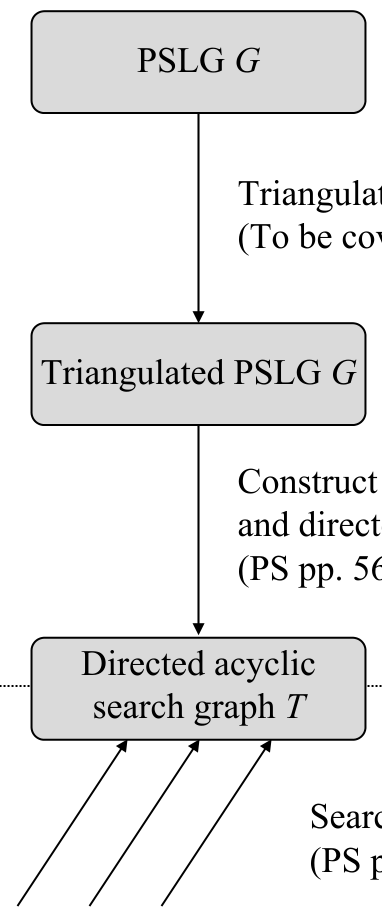
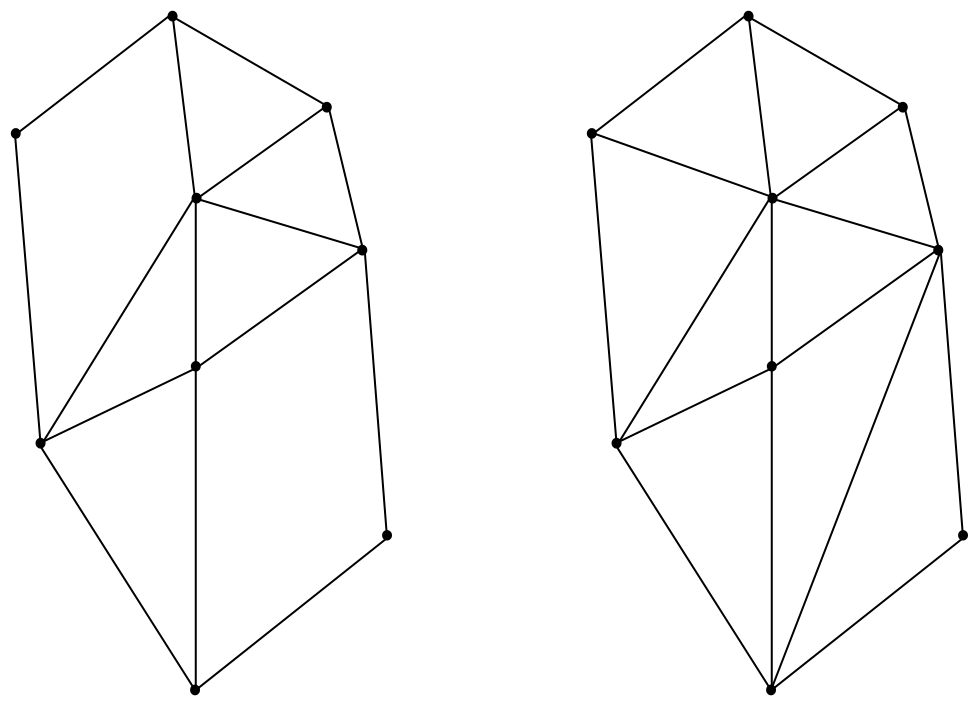
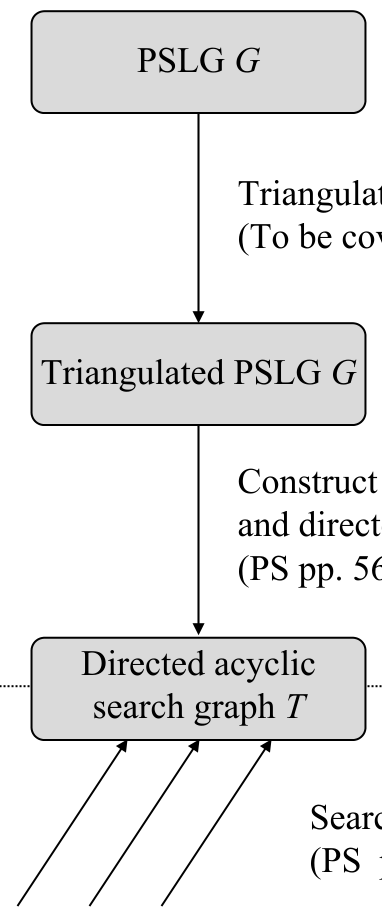
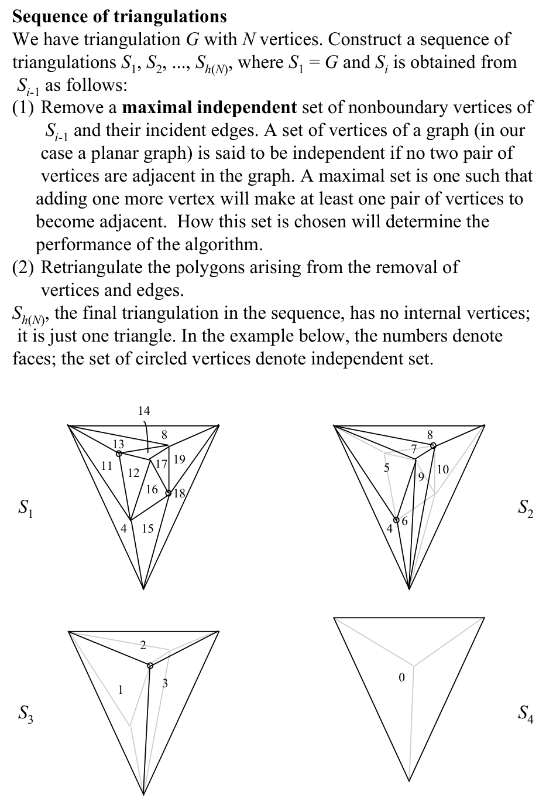
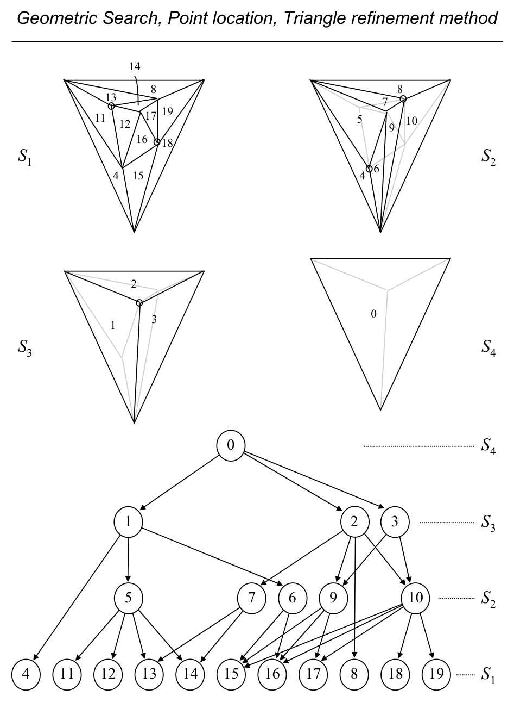
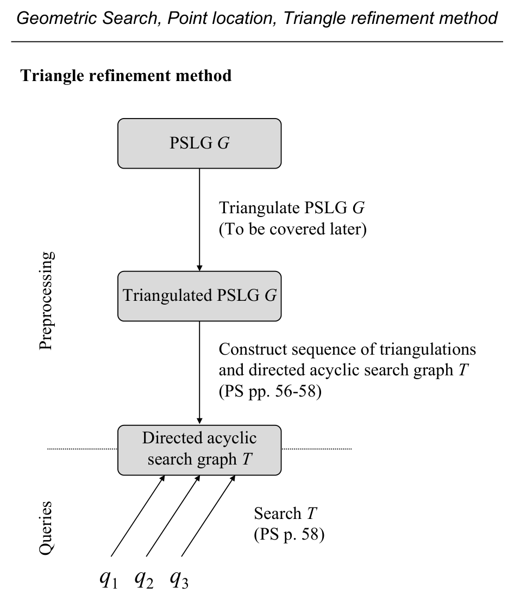
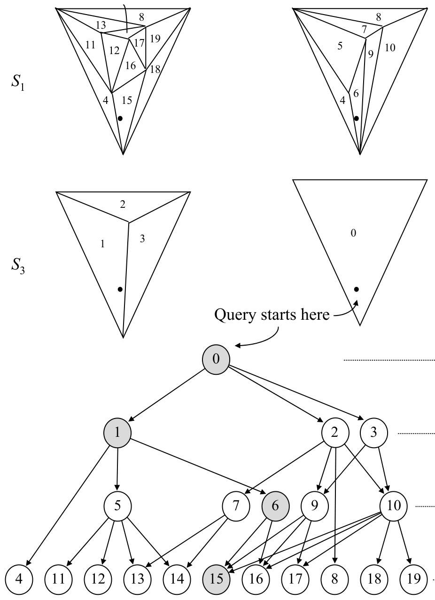
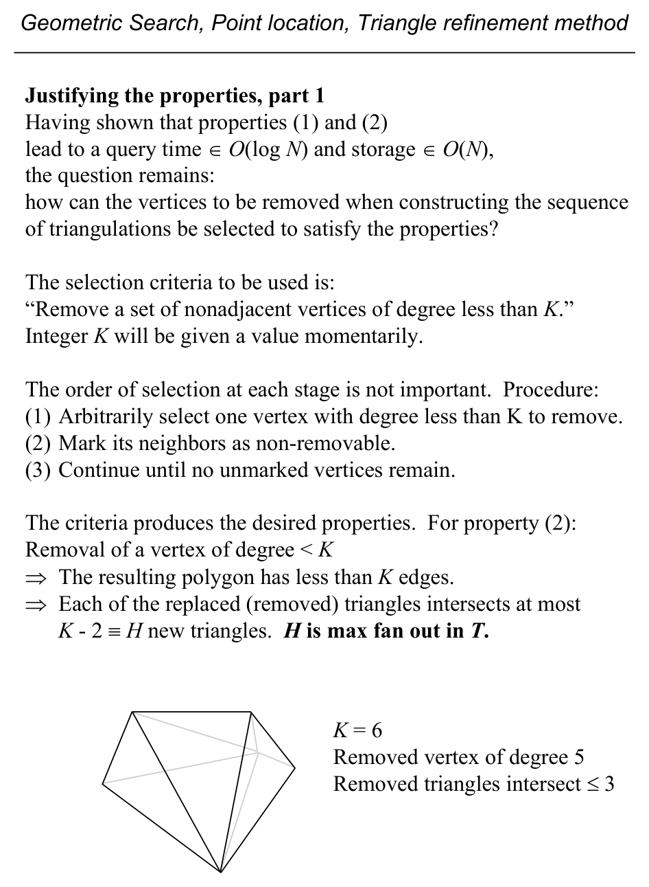

# Point Location by the Triangle Refinement Method

**Slides covered:** 118–134  

**Topic folder:** 02 Geometric Search

## Motivation

This method triangulates the subdivision and builds a directed acyclic search structure across a sequence of triangulations. Querying becomes a guided walk through that structure.

## Lecture Roadmap

- Know the problem definition.
- Know the main geometric idea.
- Know the key data structure or primitive test.
- Know the preprocessing / query / storage or total running time.
- Know one small example by hand.

## Detailed lecture notes

### Slide 118: Pipeline

**Preprocess:** PSLG \(G\) → **triangulated** PSLG → sequence of coarser triangulations + **DAG** \(T\).  
**Query:** walk \(T\) using **triangle inclusion** tests.



### Slide 119: Triangulation

A subdivision is a **triangulation** if every **bounded** face is a triangle. For a **point set** \(S\), a triangulation is a maximal planar straight-line graph on \(S\) (not unique). Edge count **\(\le 3N-6\)** for \(N\ge 3\) vertices (prove by induction / Euler).



### Slide 120: Assumptions

Assume input PSLG is triangulated (else triangulate first — algorithms covered later). Assume **triangular outer face** (add three far vertices in \(O(1)\) if needed) so the graph has **\(3N-6\)** edges at maximum.

### Slide 121: Triangulation complexity note

1985 text says \(O(N\log N)\) triangulation; Chazelle (1991) gives **\(O(N)\)** (O’Rourke pp. 64–65). Below, triangulation cost is the bottleneck unless linear-time triangulation is used.

### Slide 122: Repeat pipeline figure



### Slide 123: Sequence \(S_1,\ldots,S_{h(N)}\)

\(S_1 = G\). Obtain \(S_i\) from \(S_{i-1}\) by:

1. Remove a **maximal independent set** of **non-boundary** vertices (no two adjacent) together with incident edges.  
2. **Retriangulate** the resulting polygons.

Final \(S_{h(N)}\) is a single triangle. Numbers in figures label faces; circled vertices show an independent set removed at a step.



### Slide 124: Search DAG \(T\)

Triangle \(R_j\) **belongs** to \(S_i\) if created in step (2) while forming \(S_i\). **Nodes** of \(T\) = triangles. **Arc** \(R_k \to R_j\) when: \(R_j\) removed in step (1) moving from \(S_{i-1}\) to \(S_i\); \(R_k\) **created** in step (2) of that step; and \(R_j \cap R_k \neq \emptyset\). Triangles of \(S_1\) have **no outgoing** arcs. This **triangulation intersection graph** is a **DAG** with root = outer triangle.

### Slide 125: Example DAG layers



### Slide 126: Pipeline figure again



### Slide 127: Query

**Triangle test:** \(q \in \triangle\) in \(O(1)\) with three **orientation** tests.

If \(q\) is outside the **enclosing** triangle, answer = **unbounded** face. Else start at **root** of \(T\). Among **children** triangles overlapping the parent, exactly one contains \(q\); descend. At **leaves** (triangles of original \(S_1\)), the triangle identifies a face (if the original PSLG was refined, **several** triangles may map to one face).

### Slide 128: Query start figure



### Slide 129: `PointLocation(T,q)` (sketch)

Let \(\Gamma(v)\) = child triangles of node \(v\), \(\text{TRIANGLE}(v)\) its geometry.

```
if q ∉ TRIANGLE(root) → unbounded face
else v ← root
while Γ(v) ≠ ∅
  for u ∈ Γ(v)
    if q ∈ TRIANGLE(u) then v ← u; break (restart inner loop from new Γ(v))
```

Implementation must refresh \(\Gamma(v)\) after advancing (slide comment on iteration order).

### Slide 130: Performance parameters

Let \(N_i\) = vertices in \(S_i\). If:

1. **\(N_i \le \alpha N_{i-1}\)** for constant \(\alpha<1\), then **\(h(N) = O(\log N)\)** levels (e.g. \(\alpha=\tfrac12\) → \(\lceil\log_2 N\rceil\)).  
2. Each triangle of \(S_i\) intersects at most **\(H\)** triangles of \(S_{i-1}\) (and vice versa) — **bounded fan-out** in \(T\).

Then query time **\(O(H \log N) = O(\log N)\)**. *(Text p. 59: use \(\in O(\log N)\) not “\(= O(\log N)\)” for upper-bound class membership.)*

### Slide 131: Storage \(O(N)\)

Face count in \(S_i\) is \(< 2N_i\) (Euler: \(f \le 2v-4\)). Total triangles over all levels:

\[
\sum_i 2 N_i \le 2N(1+\alpha+\alpha^2+\cdots) < \frac{2N}{1-\alpha} = O(N).
\]

Each node stores \(\le H\) pointers → **\(O(N)\)** total pointer storage.

### Slide 132: Choosing removed vertices

Remove **nonadjacent** vertices of **degree \(< K\)**. Then each removed triangle region is replaced by a polygon with **\(<K\)** sides, so each old triangle meets **\(\le K-2 \equiv H\)** new triangles. Take **\(K=6\)** in the figure.



### Slide 133: Existential bound (planar triangulation)

For a triangulation with triangular boundary and \(N>3\): \(e=3N-6\), sum of degrees \(=2e<6N\), so **at least \(N/2\)** vertices have degree **\(<12\)**. Set **\(K=12\)**. A maximal independent set among low-degree vertices removes a fraction \(\gtrsim 1/24\) of vertices per stage, giving **\(\alpha < 1\)** in property (1).

### Slide 134: Final bounds

- **Query:** **\(O(\log N)\)**.  
- **Storage:** **\(O(N)\)**.  
- **Preprocessing:** **\(O(N\log N)\)** dominated by initial triangulation (or **\(O(N)\)** with Chazelle); independent-set selection, retriangulation of constant-size polygons, and DAG wiring are **\(O(N)\)** per slide (triangle–triangle intersection is \(O(1)\) for six half-planes).

Method is **asymptotically optimal** but can be **heavy in practice**.

## Recap

- Keep the formal problem statement precise.
- Focus on the geometric invariant used by the method.
- Remember the key complexity bound and when it applies.
