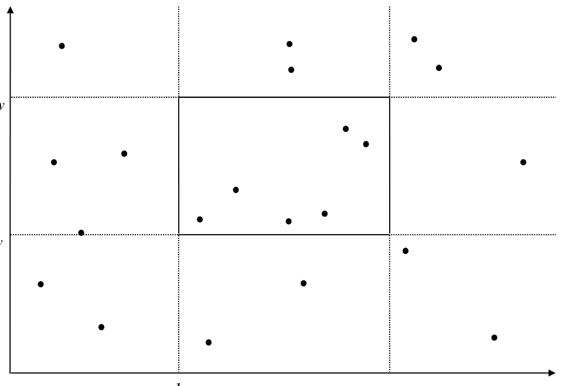
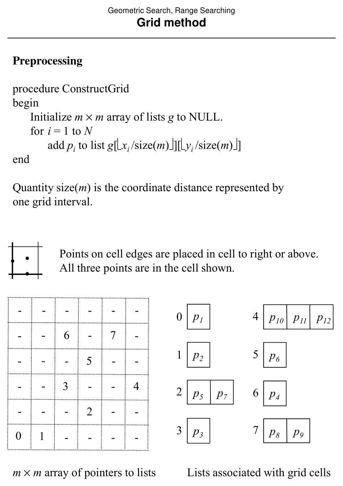

# Range Searching Overview and the Grid Method

**Slides covered:** 135–141  

**Topic folder:** 02 Geometric Search

## Motivation

Range searching asks which points lie inside a query rectangle. The grid method is the first space decomposition idea: divide space into cells, preprocess counts or lists, then answer queries from those cells.

## Lecture Roadmap

- Know the problem definition.
- Know the main geometric idea.
- Know the key data structure or primitive test.
- Know the preprocessing / query / storage or total running time.
- Know one small example by hand.

## Detailed lecture notes

### Slide 135: Example

How many (or which) of \(N\) points lie in rectangle \([\ell_x,r_x] \times [\ell_y,r_y]\)? Example answer on slide: 6.



### Slide 136: General \(d\)-dimensional range search

**Data:** \(N\) objects, each a \(d\)-tuple \((x_1,\ldots,x_d)\).  
**Query:** Orthogonal range \(\prod_{i=1}^d [\ell_i, r_i]\) — **count** or **report** all tuples with \(\ell_i \le x_i \le r_i\).

View tuples as points in \(\mathbb{R}^d\); the query range is an **axis-aligned box**.

### Slide 137: Planar reporting assumptions (default)

Unless noted:

1. \(d=2\), points and query in the plane.  
2. Often assume **first quadrant** (or bounded domain after scaling).  
3. **Repetitive mode** — one static \(S\), many queries.  
4. **Static** \(S\) after preprocessing.  
5. **Reporting** — list points in range.

**Formal:** \(p_i=(x_i,y_i)\), \(R=[\ell_x,r_x]\times[\ell_y,r_y]\); report all \(p_i \in R\).

### Slide 138: Uniform grid

Partition the plane into an **\(m \times m\)** grid of cells; each cell holds a list of points of \(S\) falling in that cell.

### Slide 139: `ConstructGrid`

Let \(\text{size}(m)\) be the side length of one cell in coordinate units.

```
initialize m×m array g of empty lists
for i = 1 to N
  add p_i to g[⌊x_i / size(m)⌋][⌊y_i / size(m)⌋]
```

Boundary rule: points on cell edges go to the cell **right** or **above** (slide convention).



### Slide 140: `QueryGrid`

Enumerate all grid cells intersecting \(R\); for each point in those cells’ lists, test \(\ell_x \le x_k \le r_x\) and \(\ell_y \le y_k \le r_y\) and **report** if true.

### Slide 141: Analysis

- **Preprocessing:** \(O(m^2 + N)\).  
- **Query:** \(O(m^2 + N)\) worst case (visit many cells / points).  
- **Storage:** \(O(m^2 + N)\).

**Comments:** Not \(O(m^2 N)\) because each point is stored once. Not output-sensitive \(O(m^2 + K)\) unless only reported points are examined. Choice of \(m\) trades empty cells vs. overloaded cells; \(m=1\) degenerates to linear scan. Worst-case theory is weak, but **uniform** point sets can yield ~\(O(K)\) average behavior (Laszlo, p. 231).

## Recap

- **Orthogonal range reporting:** list all points in an axis-aligned box; default assumptions: static 2D point set, **repetitive** queries, **reporting** output.
- **Uniform grid:** bucket points into an **\(m\times m\)** array of lists; query enumerates **grid cells** overlapping the rectangle then **filters** coordinates.
- **Costs:** preprocessing **\(O(m^2+N)\)**; query **\(O(m^2+N)\)** worst case; tuning \(m\) trades empty cells vs. overloaded cells; uniform data can behave much better in practice.
