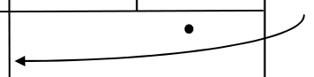
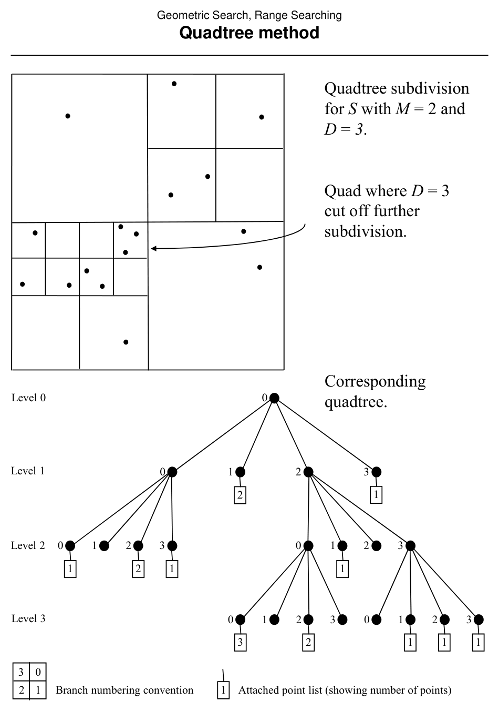
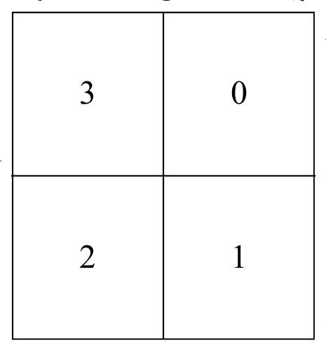

# Range Searching by the Quadtree Method

**Slides covered:** 142–151  

**Topic folder:** 02 Geometric Search

## Motivation

Quadtrees recursively split the plane into four equal parts. They adapt space decomposition through recursion and are useful when point distribution is uneven.

## Lecture Roadmap

- Know the problem definition.
- Know the main geometric idea.
- Know the key data structure or primitive test.
- Know the preprocessing / query / storage or total running time.
- Know one small example by hand.

## Detailed lecture notes

### Slide 142: Quadtree subdivision

**Quadtree:** recursive partition of a region into **four equal quadrants**. Each region = a **node**; non-leaf nodes have **4 children** (NW, NE, SW, SE per your indexing). **Stop** subdividing a quad when:

1. it contains **\(\le M\)** points of \(S\) (**cell occupancy** target), or  
2. depth reaches **\(D\)** (**maximum depth**).

**Leaves** store point lists for their quad.

### Slides 143–144: Example

Illustration with \(M=2\), \(D=3\): subdivision and tree with branch numbering and level labels.





### Slide 145: Bottom-up construction idea

Domain **square** \([L_x,R_x] \times [L_y,R_y]\) containing all of \(S\). Build a regular **\(m \times m\)** grid of minimal cells with \(m = 2^D + 1\) (slide notation), attach point lists, then **combine** quadtrees from children: if all four children together have \(\le M\) points **or** depth limit hit, **merge** to one leaf; else keep four children.

**Parameters:** \(M\) (occupancy), \(D\) (depth), \(m\) (fine grid size).

### Slides 146–147: Level illustrations

Figures showing tree levels (see slide PDF).

### Slide 148: Node fields and `ConstructQuadtree`

Per node \(q\):

| Field | Meaning |
|-------|---------|
| `q.points` | Points in this quad (leaf); `NULL` if internal |
| `q.child[0..3]` | Subtrees or `NULL` |
| `q.size` | Point count in subtree |
| `q.quad` | \([\ell_x,r_x]\times[\ell_y,r_y]\) bounds |

Recursive construction partitions grid index ranges \([i_{min},i_{max}] \times [j_{min},j_{max}]\) and splits quad geometry accordingly (see slide for child bounding boxes).

### Slide 149: Child geometry



### Slide 150: `QueryQuadtree`

```
procedure QueryQuadtree(q, R)
  if q.quad ∩ R ≠ ∅ then
    if q is leaf then
      for each point p in q.points
        if p ∈ R then report p
    else
      for i = 0 to 3
        QueryQuadtree(q.child[i], R)
```

### Slide 151: Analysis

- **Preprocessing:** \(O(m^2 + N)\) with \(m = 2^D + 1\) (grid build + tree combine). `ConstructQuadtree` itself is \(O(m^2)\) on list pointers.  
- **Query (worst):** \(O(2^D + N)\) — at most \(O(2^D)\) nodes visited (slide cites refined argument vs. \(4^D\); see Laszlo pp. 239–242); up to \(O(N)\) point tests.  
- **Storage:** \(O(m^2 + N)\).

Average query time can be much better depending on distribution.

## Recap

- Keep the formal problem statement precise.
- Focus on the geometric invariant used by the method.
- Remember the key complexity bound and when it applies.
