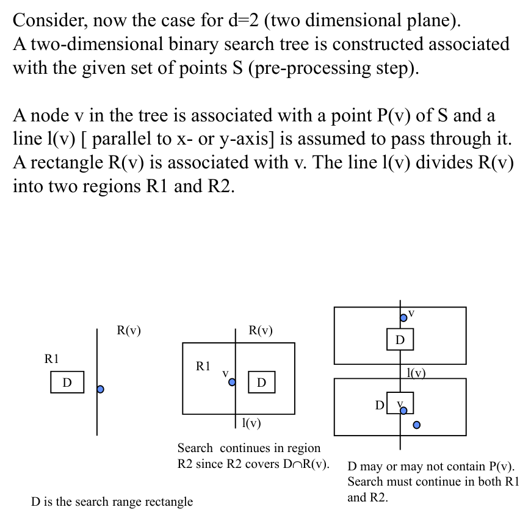
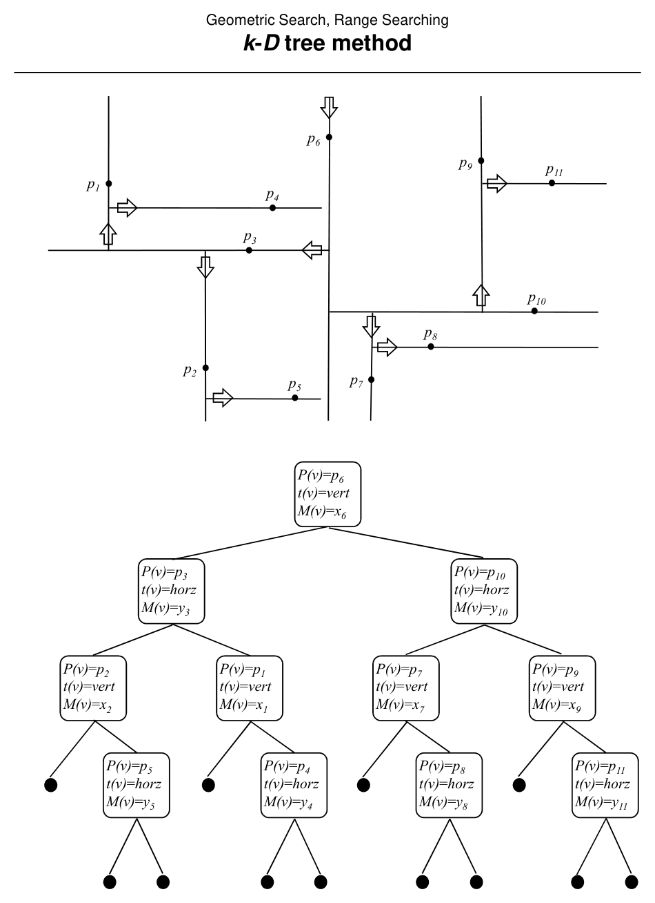
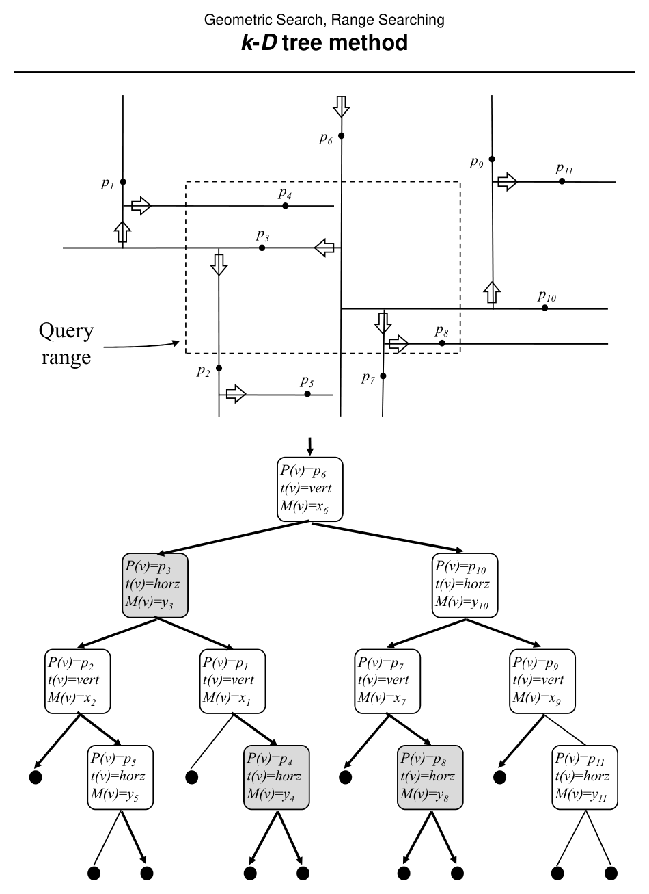

# Range Searching by the k-D Tree Method

**Slides covered:** 152–160  

**Topic folder:** 02 Geometric Search

## Fast take

- A k-D tree alternates the split dimension as it recursively partitions the point set.
- Each node represents both a stored point and a split of the search region.
- The point of the structure is pruning: discard whole subtrees outside the query range.
- In 2D, it is usually easier to use and explain than heavier range structures.

## Recording notes

**Recording references:** `CS 564 - 02.13 7.2.txt`

- The lecture presented the k-D tree as a practical middle ground: more adaptive than a grid, lighter than a range tree.
- What matters is not traversing the tree, but **why a subtree can be skipped entirely**.
- Keep the split-dimension alternation consistent. If you lose the region semantics, the query logic becomes nonsense fast.
- This is one of those structures that feels obvious only after someone else already did the hard design work.

## Motivation

The k-D tree splits by the data, not by a fixed grid. In 2D it alternates x-splits and y-splits, giving a binary search tree for multidimensional point searching.

## Lecture Roadmap

- Know the problem definition.
- Know the main geometric idea.
- Know the key data structure or primitive test.
- Know the preprocessing / query / storage or total running time.
- Know one small example by hand.

## Detailed lecture notes

### Slide 152: Data-driven splits

Grids and quadtrees partition **space** independently of data density; worst cases can be poor. A **k-D tree** splits by **axis-aligned lines through points**, ideally **balancing** counts on each side for binary search.

Later material aligns with de Berg et al., Ch. 5 (orthogonal range searching), pp. 93–117.

### Slide 153: Search regions

Node \(v\) stores point \(P(v)\) and splitting line \(\ell(v)\) (horizontal or vertical). Region \(R(v)\) is the rectangle associated with \(v\); \(\ell(v)\) splits \(R(v)\) into \(R_1,R_2\). Query range \(D\) may meet one or both children — recurse into any child whose region intersects \(D\).

### Slide 154: Example tree

Slide lists nodes with \(P(v)\), split type `t(v) ∈ {vert, horz}`, and coordinate \(M(v)\).

### Slide 155: Node data

| Field | Role |
|-------|------|
| \(P(v)\) | Stored point on the split line |
| \(t(v)\) | `vert` or `horz` |
| \(M(v)\) | \(x\)- or \(y\)-coordinate of split |
| \(R(v), S(v)\) | Implied region / subset (often not stored explicitly) |

Build via `CreatekDNode(S, vert)`.

### Slide 156: `CreatekDNode`

If \(S=\emptyset\), return `NULL`. Else:

- If split type **vertical:** choose \(p_i \in S\) with **median** \(x\) among \(S\); \(M(v)=x_i\); \(S_L=\{p_j: x_j < x_i\}\), \(S_R=\{p_j: x_j \ge x_i\}\) (excluding \(p_i\) from children per slide); next split **horizontal**.  
- If **horizontal:** median **\(y\)**; partition similarly; next split **vertical**.

Set \(P(v)=p_i\), recurse on \(S_L,S_R\).

### Slide 157: Presort optimization

Presort points by \(x\) and by \(y\) in **\(O(N\log N)\)**; at each node, split lists in **\(O(n)\)** for current size \(n\). Recurrence **\(T(n) \le 2T(n/2) + O(n)\)** → **\(O(N\log N)\)** build.

### Slide 158: Same example figure

### Slide 159: `SearchkDTree`

At node \(v\), let \([\ell,r]\) be the query’s \(x\)-interval if `t(v)=vert`, else \(y\)-interval.

- If \(\ell \le M(v) \le r\) and \(P(v) \in R\), **report** \(P(v)\).  
- If \(\ell < M(v)\), recurse **left** child.  
- If \(M(v) < r\), recurse **right** child.

### Slide 160: Analysis

**Preprocessing:** \(\Theta(d\,N\log N)\) for \(d\) dimensions (median splits + recursion).  
**Query:** \(O(d\,N^{1-1/d} + K)\); for \(d=2\), **\(O(\sqrt{N} + K)\)** (see Preparata pp. 77–79, Laszlo p. 248).  
**Storage:** \(O(dN)\).

## Recap

- **k-D tree:** binary splits by **median coordinate** alternating **vertical/horizontal** (in 2D), balancing point counts — **data-adaptive** unlike fixed grids.
- **Build:** **\(O(N\log N)\)** via median splits (often aided by presorting); each node stores split line and **\(O(1)\)** discriminator data.
- **Query:** recurse into both children when the query interval **straddles** the split; **\(O(d\,N^{1-1/d}+K)\)** in \(d\) dimensions — **\(O(\sqrt{N}+K)\)** for \(d=2\).
- **Space** **\(O(dN)\)**.
