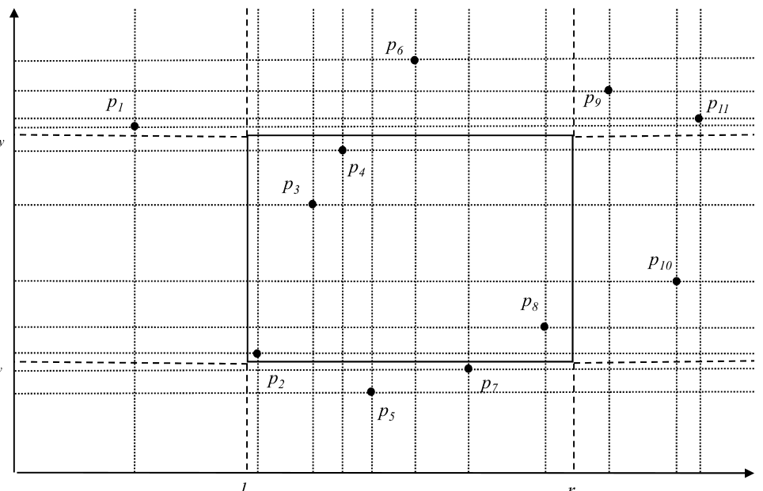
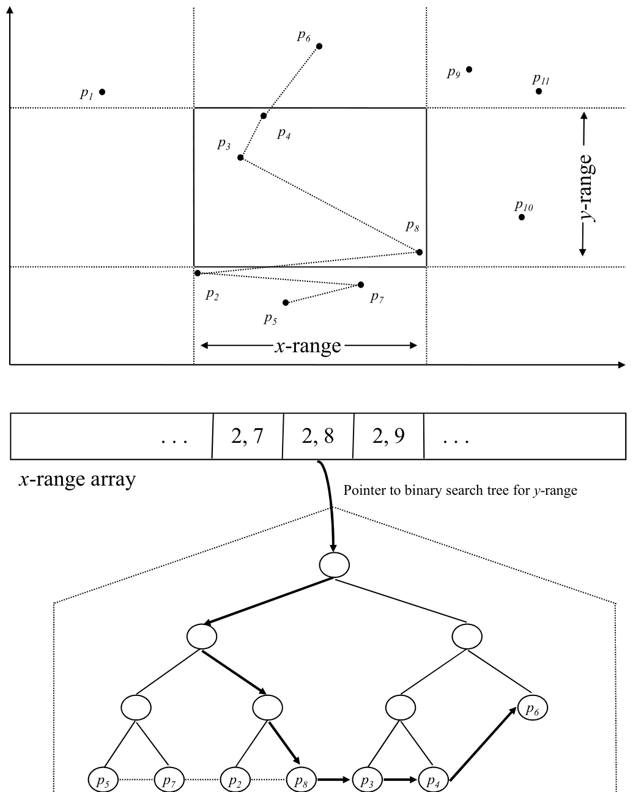
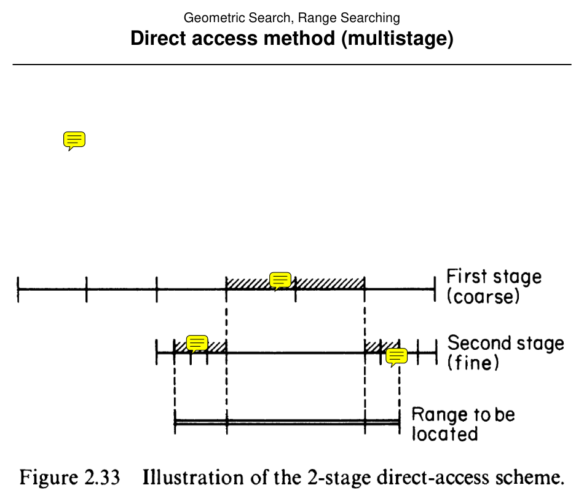
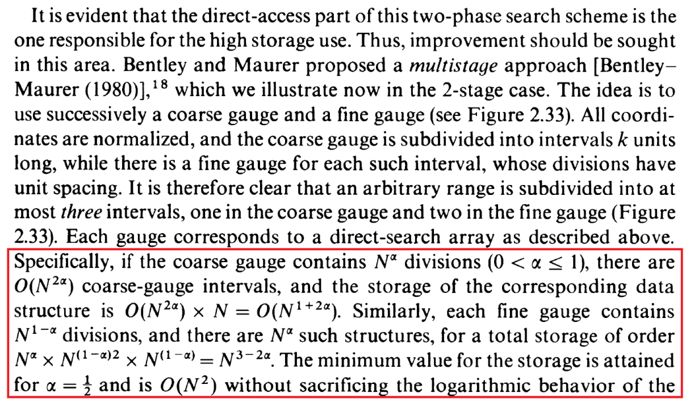

# Range Searching by Direct Access Methods

**Slides covered:** 161–173  

**Topic folder:** 02 Geometric Search

## Fast take

- Direct-access methods trade memory for very fast counting queries.
- They rely on normalized / discrete coordinates and precomputed cumulative information.
- They are excellent when the coordinate universe is manageable.
- They are terrible when the coordinate universe is huge and memory is not imaginary.

## Recording notes

**Recording references:** `CS 564 - 02.18 8.1.txt`

- The lecture framed this as the “spend memory, save query time” family of methods.
- Normalization is not an afterthought here. Without a bounded index universe, direct access is not really direct at all.
- This approach shines for **counting**. Reporting actual points is a different beast.
- Useful when the data domain is small enough, otherwise you just build a monument to wasted space.

## Motivation

Direct access methods trade a lot of preprocessing and storage for very fast queries. The single-stage version is simple but expensive in space; the multistage version reduces that space.

## Lecture Roadmap

- Know the problem definition.
- Know the main geometric idea.
- Know the key data structure or primitive test.
- Know the preprocessing / query / storage or total running time.
- Know one small example by hand.

## Detailed lecture notes

### Slide 161: Equivalence classes of ranges

Extreme points \((\ell_x,\ell_y)\) and \((r_x,r_y)\) of rectangle \(R\) each fall in one of \((N+1)^2\) **cells** induced by coordinate lines through the \(N\) points. Moving corners within the same pair of cells does not change the answer set. Hence **\(O(N^4)\)** distinct orthogonal ranges (up to combinatorial equivalence).

### Slide 162: Full direct access table

**Preprocess:** compute and store the answer for each of **\(O(N^4)\)** cell pairs.

**Query:** map \((\ell_x,\ell_y)\) and \((r_x,r_y)\) to cells (\(O(\log N)\) with binary search on sorted coordinates), **lookup** precomputed answer.

- **Preprocessing:** \(O(N^5)\) — \(O(N^4)\) entries, \(O(N)\) work each.  
- **Query:** \(O(\log N + K)\).  
- **Storage:** \(O(N^5)\).

Interesting idea but **impractical** storage.

### Slide 163: Normalization

Map point \(x\)-coordinates to ranks in \(\{1,\ldots,N\}\) by sorting. Map range \([\ell_x,r_x]\) to normalized indices in \(\{1,\ldots,N+1\}\) (e.g. \(\ell_x\) between \(x_{i-1}\) and \(x_i\) → index \(i\)). Usually **\(O(N\log N)\)** preprocess sort and **\(O(\log N)\)** rank lookup per query.

### Slides 164–167: Single-stage direct access

Combine **direct indexing** on normalized **\(x\)-range** \((i,j)\) with a **threaded BST** on **\(y\)** for the subset of points whose normalized \(x\) lies in \([i,j]\).

**Query:**

1. Normalize \([\ell_x,r_x]\) → \((i,j)\), \(1 \le i \le j \le N+1\) — \(O(\log N)\).  
2. Index table \((i,j)\) → tree pointer — \(O(1)\).  
3. BST search for \(y \ge \ell_y\) — \(O(\log N)\).  
4. Thread-walk until past \(r_y\) — \(O(K)\).

- **Preprocessing:** \(O(N^3\log N)\) — \(O(N^2)\) trees, \(O(N\log N)\) each.  
- **Query:** \(O(\log N + K)\).  
- **Storage:** \(O(N^3)\).

### Slides 168–172: Multistage (coarse + fine gauges)

Instead of **all** \(x\)-intervals, use a **coarse** partition plus **fine** refinements. A query range is covered by **\(O(1)\)** coarse/fine interval products; each maps to its own threaded \(y\)-tree.

**Query:** normalize — \(O(\log N)\); decompose range — \(O(1)\); for each piece: pointer + BST + thread walk — \(O(\log N + K_i)\).

**Example (slide):** \(N=100\), \(\alpha=\tfrac12\): coarse gauge \(\sqrt{N}=10\) divisions → \(O(N^2)\) storage for coarse trees; fine structures similar total → **\(O(N^2)\)** space, **\(O(\log N + K)\)** query (constant-factor overhead vs. single-stage).

### Slide 173: Multistage analysis summary

- **Preprocessing:** \(O(N^2\log N)\).  
- **Query:** \(O(\log N + K)\).  
- **Storage:** \(O(N^2)\).

**Gauge parameters:** coarse has \(N^\alpha\) divisions per axis; fine has \(N^{1-\alpha}\); interval counts and points-per-tree scale as in the slide’s table so total storage stays \(O(N^2)\).

## Recap

- **Equivalence classes:** only **\(O(N^4)\)** distinct orthogonal ranges matter for combinatorial answers; full table preprocessing is **\(O(N^5)\)** time and **\(O(N^5)\)** space — impractical.
- **Single-stage:** direct index on normalized **\(x\)-interval** \((i,j)\) → **threaded BST on \(y\)** for points whose \(x\)-rank lies in \([i,j]\); **query** **\(O(\log N + K)\)**, **storage** **\(O(N^3)\)**, preprocess **\(O(N^3\log N)\)**.
- **Multistage:** **coarse + fine** gauges cover any query range with **\(O(1)\)** pieces per side; cuts storage to **\(O(N^2)\)** while keeping **\(O(\log N + K)\)**-style queries (constant-factor overhead vs. single-stage).
