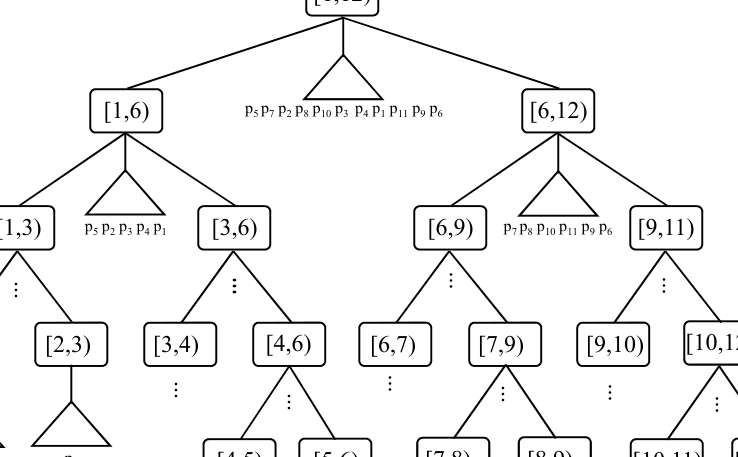
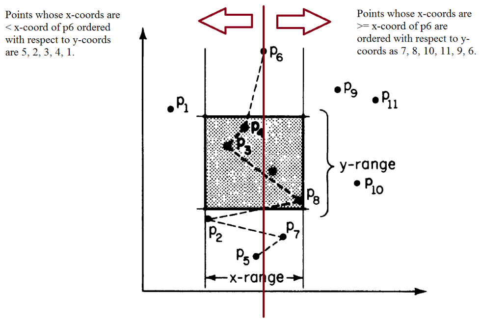

# Range Searching by the Range Tree Method

**Slides covered:** 174-180  

**Topic folder:** 02 Geometric Search

## Motivation

A range tree combines segment-tree style decomposition with ordered secondary structures. It is one of the standard clean solutions for orthogonal range searching.

## Lecture Roadmap

- Know the problem definition.
- Know the main geometric idea.
- Know the key data structure or primitive test.
- Know the preprocessing / query / storage or total running time.
- Know one small example by hand.

## Detailed lecture notes

### Slide 174: Definition

- A range tree is a segment tree where the allocation list A(v) for each
- node has been replaced with a standard threaded binary tree.  Stored
- (“allocated”) in the allocation tree for each node are the points
- of S with x-coordinates within the scope interval associated with
- that node.  The trees are organized in ascending y-coordinate order.
- Note that in a range tree the scope intervals are all semi-closed.
- The allocation tree for node for [i, j) does not contain pj.
- For that reason the range tree for S = {p1, p2, ..., pN} is
- T(1, N + 1).
- Only a few of the binary trees are shown; there is one for each node.
- [1,12)
- [1,6)
- [6,12)
- [3,6)
- [1,3)
- [6,9)
- [9,11)
- [1,2)

### Slide 175: Query

- Informally, traverse the segment tree as if inserting the x-range;
- at each allocation node, search the allocation tree of the node
- for points in the y-range.
- More formally, to perform range query R = [lx, rx] × [ly, ry]
- in range tree T:
- SearchRangeTree(lx, rx + 1, ly, ry, root(T)) procedure SearchRangeTree(lx, rx , ly, ry, v)
- begin if
- (lx ≤B(v) and E(v) ≤rx) then h d ’ ll ti t f i t i [l
- ] search node’s allocation tree for points in [ly, ry] else if (lx < (B(v) + E(v)) / 2) then
- SearchRangeTree(lx, rx , ly, ry, Lchild(v)) endif if ((B(v) + E(v)) / 2< rx) then
- SearchRangeTree(lx, rx , ly, ry, Rchild(v)) endif endif end
- Note that “rx + 1” in the initial call allows for the semi-closed
- intervals in the main tree.

### Slide 176: Analysis

- Preprocessing:  O(N log N)
- Query:  O((log N)2 + K); O(log N) allocation nodes in the segment tree structure for the query x-range,
- with an O(log N) binary tree search for each.
- Storage:  O(N log N); see Preparata, p. 86.
- Comments
- The query time can be improved to O(log N + K).
- Observe that once the query y-range starting point  in S has been
- found (via a binary search at one node) there is no need to find it
- i
- I b id d t ll b t f th d bi t again.  In a bridged range tree, all but one of the node binary trees
- are replaced with lists in y-order (the root retains a binary tree).
- Pointers connect the entries in the lists in such a way that only
- one binary search is needed.  Thereafter, the list at each allocation
- node is simply scanned (in O(K)) from the y starting point given
- by the pointer.

### Slide 177: Range tree method

### Slide 178: Range tree method

### Slide 179: Range tree method

### Slide 180: Summary of this topic

- Problem/Algorithm
- Preprocessing
- Query
- Storage
- Polygon inclusion
- Left test (convex)
- O(N)
- Intersection counting (simple)
- O(N)
- Wedges (convex and star shaped)
- O(N)
- O(log N)
- O(N)
- Point location
- Brute force
- O(N)
- Slab method
- O(N2)

## Recap

- Keep the formal problem statement precise.
- Focus on the geometric invariant used by the method.
- Remember the key complexity bound and when it applies.
