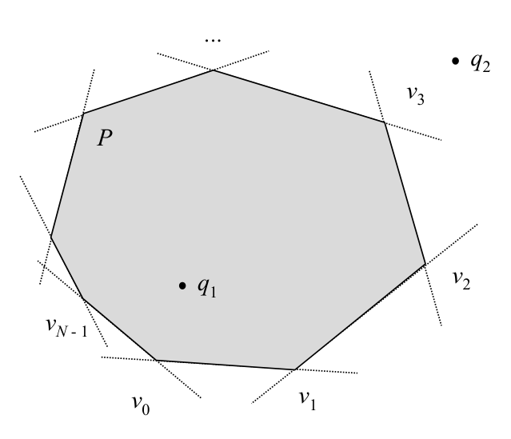

# Convex polygon inclusion by left test

## Scope
- **Slides:** pp. 70-71
- **Major topic folder:** geometric-search
- **Recording files touching this material:** CS 564 - 01.30 3.2.txt
- **Goal of this file:** You should be able to study this topic without reopening the slide deck.

## Big picture
This is the cleanest inside test in the course: a convex polygon is just an intersection of half-planes. One primitive repeated N times and you are done.

## What you must know cold
- Inside iff the query point is on the left side of every directed edge of a consistently oriented convex polygon.
- Why convexity is essential for this characterization.
- Boundary policy: on an edge usually counts as inside unless the question says strict interior.

## Core ideas and reasoning
- Assume the polygon boundary is ordered counterclockwise. For each edge v_i v_{i+1}, compute orient(v_i, v_{i+1}, q).
- If any value is negative, q is outside. If all are nonnegative, q is inside or on the boundary.
- This works because a convex polygon is exactly the intersection of the interior half-planes of its edges.

## Figures to actually look at
These are cropped from the main slide PDF. Do not skip them.

### Figure from slide p. 70


## Slide-by-slide digestion

### p. 70 - Convex polygon inclusion
- CONVEX POLYGON INCLUSION
- INSTANCE: Convex polygon P = (e0 = v0v1, e1 = v1v2, ...,
- eN-1 = vN-1v0) with N edges and query point q, both in the plane.
- QUESTION: Is q within P?
- Convex polygon inclusion by Left test
- P is the intersection of the half-planes defined by its edges.
- Query point q is within P iff q is to the left of or on all N edges of P.
- (This is true iff P is convex.)

### p. 71 - Convex polygon inclusion by Left test
```text
procedure ConvexInclusion(P,q)
begin
for
i = 0 to N /* Check each edge */
c = PointLineClassify(vi,v(i+1) mod N,q)
c = RIGHT
return FALSE
endfor
return TRUE
Left(v(i+1) mod N,vi,q) /* Backwards edge */
```

## What you must be able to say or do in an exam
- State the input, output, preprocessing, and query/update model precisely.
- Explain the invariant or ordering that makes the method work.
- Trace the method by hand on a small example.
- Give the exact time and space bounds.
- Mention one edge case, degeneracy, or limitation.

## Complexity and performance facts
O(N) query time, O(1) extra space, no preprocessing beyond having the vertex order.

## Common mistakes and danger points
- This fails for general non-convex polygons.
- If the polygon is clockwise, the sign convention reverses.

## Exam-style drills and answer skeletons
### Core exam drill
**Question.** State the problem solved by convex polygon inclusion by left test, describe preprocessing/query/update steps if any, and give the time and space bounds.

**How to answer.** An excellent answer names the input, the output, the invariant or ordering exploited by the method, and the exact asymptotic costs.

### Hand-trace drill
**Question.** Trace convex polygon inclusion by left test on a small example by hand and explain each comparison or structural change.

**How to answer.** On this course, being able to run the method on a picture matters more than writing vague slogans.

## Recap
### What you must know cold
- Inside iff the query point is on the left side of every directed edge of a consistently oriented convex polygon.
- Why convexity is essential for this characterization.
- Boundary policy: on an edge usually counts as inside unless the question says strict interior.
### Core test / key idea
- Assume the polygon boundary is ordered counterclockwise. For each edge v_i v_{i+1}, compute orient(v_i, v_{i+1}, q).
- If any value is negative, q is outside. If all are nonnegative, q is inside or on the boundary.
- This works because a convex polygon is exactly the intersection of the interior half-planes of its edges.
### Complexity
- O(N) query time, O(1) extra space, no preprocessing beyond having the vertex order.
### Common mistakes / danger points
- This fails for general non-convex polygons.
- If the polygon is clockwise, the sign convention reverses.
## End-of-file summary
- Inside iff the query point is on the left side of every directed edge of a consistently oriented convex polygon.
- Why convexity is essential for this characterization.
- Boundary policy: on an edge usually counts as inside unless the question says strict interior.
- O(N) query time, O(1) extra space, no preprocessing beyond having the vertex order.
- This fails for general non-convex polygons.
- If the polygon is clockwise, the sign convention reverses.

## Everything related to this topic
- **Previous file in reading order:** [Search problem taxonomy and inclusion basics](../02_Geometric_Search/10_search-taxonomy.md)
- **Next file in reading order:** [Simple polygon inclusion by intersection counting](../02_Geometric_Search/12_simple-polygon-inclusion-ray-shooting.md)
- **Source slide range:** pp. 70-71 of `comp_geometry_slides_new.pdf`
- **Related recordings:** CS 564 - 01.30 3.2.txt
- **Related homework-derived exam prompts included here:** none directly mapped; generic exam drills added instead
