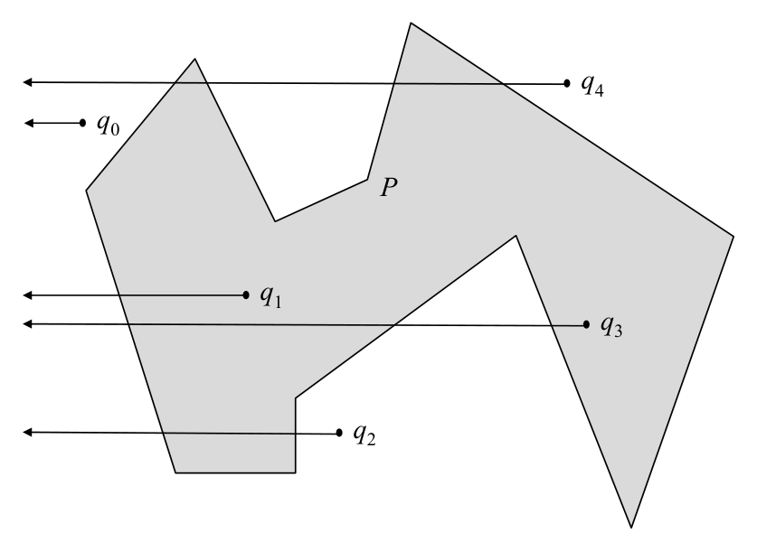
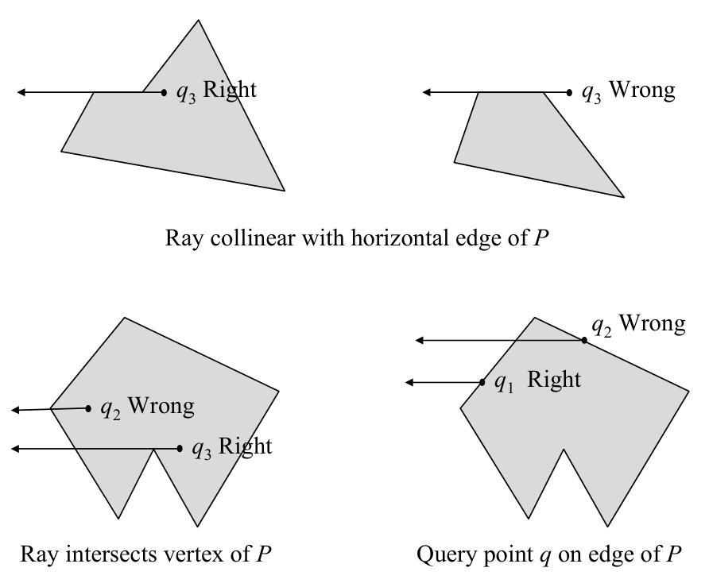

# Simple polygon inclusion by intersection counting

## Scope
- **Slides:** pp. 72-74
- **Major topic folder:** geometric-search
- **Recording files touching this material:** CS 564 - 01.30 3.2.txt
- **Goal of this file:** You should be able to study this topic without reopening the slide deck.

## Big picture
For non-convex simple polygons, the half-plane shortcut is gone, so the course uses parity via a ray. This is the version where endpoint degeneracies become the whole game.

## What you must know cold
- Shoot a ray from the query point and count intersections with the boundary.
- Odd count means inside, even count means outside for a simple polygon.
- Need a consistent endpoint rule to avoid double counting.

## Core ideas and reasoning
- A common implementation uses a horizontal ray to the right.
- Count an edge only if the ray crosses it according to a half-open endpoint convention, for example one endpoint strictly below and the other at or above the ray.
- If the query lies on the boundary, handle that first with a segment-membership check.

## Figures to actually look at
These are cropped from the main slide PDF. Do not skip them.

### Figure from slide p. 72

### Figure from slide p. 74

## Slide-by-slide digestion

### p. 72 - Simple polygon inclusion
- SIMPLE POLYGON INCLUSION
- INSTANCE: Simple polygon P = (e0 = v0v1, e1 = v1v2, ...,
- eN -1 = vN -1v0) with N edges and query point q, both in the plane.
- QUESTION: Is q within P?
- Simple polygon inclusion by Intersection counting
- Query point q is within P iff a ray originating at q intersects
- the boundary of P an odd number of times.

### p. 73 - Simple polygon inclusion by Intersection counting
- procedure SimpleInclusion(P,q) /* Incomplete version */
- begin
- c = 0
- for
- i = 0 to N /* Check each edge */
- edge vi,v(i+1) mod N ∩ray -∞,q
- c = (c + 1) mod 2
- endfor
- c = 1
- return TRUE

### p. 74 - Simple polygon inclusion by Intersection counting
- Special cases, not explicitly handled by given procedure:
- 1. Ray collinear with horizontal edge of P
- 2. Ray intersects vertex of P
- 3. Query point q on edge of P
- Resolving these special cases does not change complexity.
- See Preparata, p. 42 or O’Rourke, p. 233-236 for details.
- q2 Wrong
- q3 Right
- Ray intersects vertex of P
- q1 Right

## What you must be able to say or do in an exam
- State the input, output, preprocessing, and query/update model precisely.
- Explain the invariant or ordering that makes the method work.
- Trace the method by hand on a small example.
- Give the exact time and space bounds.
- Mention one edge case, degeneracy, or limitation.

## Complexity and performance facts
O(N) time, O(1) extra space.

## Common mistakes and danger points
- Vertex hits can double count if you use a sloppy rule.
- You must decide boundary behavior separately from odd-even logic.
- Ray-degeneracy checklist: be consistent about (1) a ray passing through a polygon vertex, (2) a ray collinear with an edge, and (3) the query point lying on the boundary; otherwise parity can be wrong.

## Professor emphasis from recordings
These points are distilled from the related recordings and focus on what the professor slowed down for, warned about, or connected to homework/exam reasoning.

- The lecture spends time on degeneracies for ray shooting: rays can hit a vertex or line up with an edge, so you need a consistent counting convention instead of hand-waving.
- The real idea is parity, not the particular ray direction. Count crossings consistently, then odd means inside and even means outside.

## Exam-style drills and answer skeletons
Existing drill reminders from the earlier pack:
- Design a robust ray-shooting test that correctly handles rays passing through polygon vertices.
- Explain why parity works only for simple polygons.

### Core exam drill
**Question.** State the problem solved by simple polygon inclusion by intersection counting, describe preprocessing/query/update steps if any, and give the time and space bounds.

**How to answer.** An excellent answer names the input, the output, the invariant or ordering exploited by the method, and the exact asymptotic costs.

### Hand-trace drill
**Question.** Trace simple polygon inclusion by intersection counting on a small example by hand and explain each comparison or structural change.

**How to answer.** On this course, being able to run the method on a picture matters more than writing vague slogans.

## Recap
### What you must know cold
- Shoot a ray from the query point and count intersections with the boundary.
- Odd count means inside, even count means outside for a simple polygon.
- Need a consistent endpoint rule to avoid double counting.
### Core test / key idea
- A common implementation uses a horizontal ray to the right.
- Count an edge only if the ray crosses it according to a half-open endpoint convention, for example one endpoint strictly below and the other at or above the ray.
- If the query lies on the boundary, handle that first with a segment-membership check.
### Complexity
- O(N) time, O(1) extra space.
### Common mistakes / danger points
- Vertex hits can double count if you use a sloppy rule.
- You must decide boundary behavior separately from odd-even logic.
- Ray-degeneracy checklist: be consistent about (1) a ray passing through a polygon vertex, (2) a ray collinear with an edge, and (3) the query point lying on the boundary; otherwise parity can be wrong.
### Professor emphasis (from recordings)
- The lecture spends time on degeneracies for ray shooting: rays can hit a vertex or line up with an edge, so you need a consistent counting convention instead of hand-waving.
- The real idea is parity, not the particular ray direction. Count crossings consistently, then odd means inside and even means outside.
## End-of-file summary
- Shoot a ray from the query point and count intersections with the boundary.
- Odd count means inside, even count means outside for a simple polygon.
- Need a consistent endpoint rule to avoid double counting.
- O(N) time, O(1) extra space.
- Vertex hits can double count if you use a sloppy rule.
- You must decide boundary behavior separately from odd-even logic.

## Everything related to this topic
- **Previous file in reading order:** [Convex polygon inclusion by left test](../02_Geometric_Search/11_convex-inclusion-left-test.md)
- **Next file in reading order:** [Convex polygon inclusion by wedges](../02_Geometric_Search/13_convex-inclusion-by-wedges.md)
- **Source slide range:** pp. 72-74 of `comp_geometry_slides_new.pdf`
- **Related recordings:** CS 564 - 01.30 3.2.txt
- **Related homework-derived exam prompts included here:** none directly mapped; generic exam drills added instead