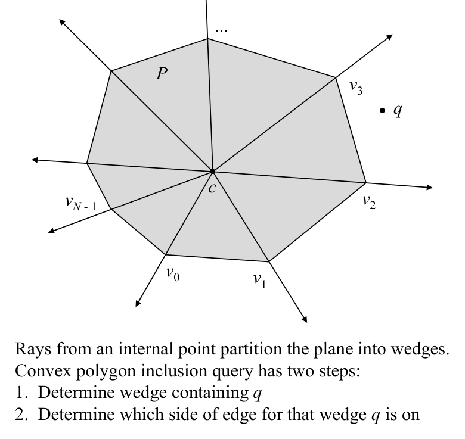
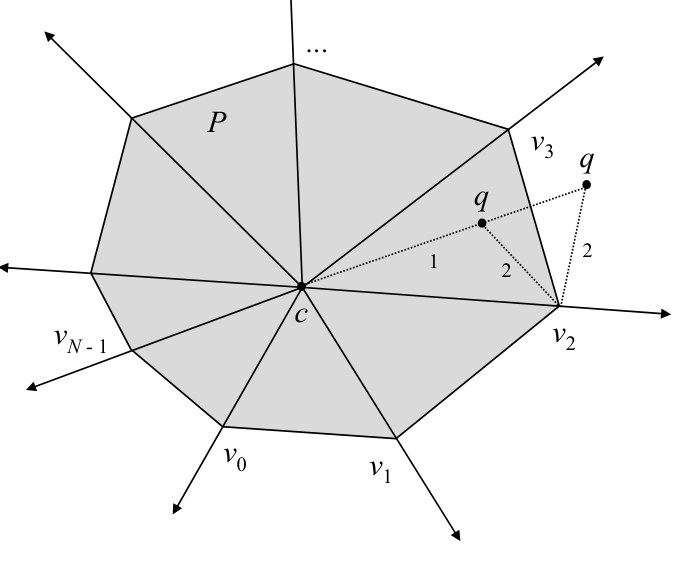

# Convex polygon inclusion by wedges

## Scope
- **Slides:** pp. 75-77
- **Major topic folder:** geometric-search
- **Recording files touching this material:** CS 564 - 01.30 3.2.txt
- **Goal of this file:** You should be able to study this topic without reopening the slide deck.

## Big picture
This is the accelerated convex-polygon inclusion method. The idea is to preprocess angular order around an interior point and reduce the query to a wedge search plus one local test.

## What you must know cold
- Choose an interior reference point and partition the polygon into wedges/triangles.
- Use binary search in angular order to find the wedge containing the query direction.
- Finish with a local orientation test in the found wedge.

## Core ideas and reasoning
- The polygon is decomposed into fan triangles relative to an interior point or anchor.
- The query point determines a direction from the anchor; binary search locates the wedge in O(log N).
- Then test whether q lies inside the corresponding triangle/wedge.

## Figures to actually look at
These are cropped from the main slide PDF. Do not skip them.

### Figure from slide p. 75

### Figure from slide p. 76

## Slide-by-slide digestion

### p. 75 - Convex polygon inclusion by Wedges
- CONVEX POLYGON INCLUSION
- INSTANCE: Convex polygon P = (e0 = v0v1, e1 = v1v2, ...,
- eN -1 = vN -1v0) with N edges and query point q, both in the plane.
- QUESTION: Is q within P?
- P convex ⇒
- the vertices of P occur in angular order about any point within P.
- Rays from an internal point partition the plane into wedges.
- Convex polygon inclusion query has two steps:
- 1. Determine wedge containing q
- 2. Determine which side of edge for that wedge q is on

### p. 76 - Preprocessing
- 1. Find a point c internal to P (centroid of any three vertices).
- 2. Arrange the vertices into a data structure suitable for
- binary search (e.g., an array).
- Query
- Given query point q,
- 1. Find wedge containing q by binary search on the vertices.
- Point q lies within the wedge for vertices vi and vi+1 iff
- qcpi is a Right turn and qcpi+1 is a Left turn.
- 2. Once pi and pi+1 have been found,
- q is internal iff pi+1piq is a Left turn.

### p. 77 - Analysis
- Preprocessing time: O(N); to load vertices into data structure.
- Query time: O(log N); binary search with O(1) time
- per comparison.
- Space: O(N); for N edges.
- Comments
- Note that O(N) preprocessing enables O(log N) query.
- Since O(N) query exists, this method is useful for repetitive mode
- queries, not for single shot queries.
- Notation different in notes and text.
- This algorithm in text appears to be in error.

## What you must be able to say or do in an exam
- State the input, output, preprocessing, and query/update model precisely.
- Explain the invariant or ordering that makes the method work.
- Trace the method by hand on a small example.
- Give the exact time and space bounds.
- Mention one edge case, degeneracy, or limitation.

## Complexity and performance facts
Typical preprocessing O(N), query O(log N), storage O(N).

## Common mistakes and danger points
- You need a consistent angular order and a point known to be interior.
- Binary search is on wedges, not on x- or y-coordinates.
- Boundary case matters: when the query point lies exactly on an edge (orientation/determinant = 0), handle it according to the problem's inside/boundary policy; do not skip the determinant-zero branch.

## Exam-style drills and answer skeletons
### Core exam drill
**Question.** State the problem solved by convex polygon inclusion by wedges, describe preprocessing/query/update steps if any, and give the time and space bounds.

**How to answer.** An excellent answer names the input, the output, the invariant or ordering exploited by the method, and the exact asymptotic costs.

### Hand-trace drill
**Question.** Trace convex polygon inclusion by wedges on a small example by hand and explain each comparison or structural change.

**How to answer.** On this course, being able to run the method on a picture matters more than writing vague slogans.

## Recap
### What you must know cold
- Choose an interior reference point and partition the polygon into wedges/triangles.
- Use binary search in angular order to find the wedge containing the query direction.
- Finish with a local orientation test in the found wedge.
### Core test / key idea
- The polygon is decomposed into fan triangles relative to an interior point or anchor.
- The query point determines a direction from the anchor; binary search locates the wedge in O(log N).
- Then test whether q lies inside the corresponding triangle/wedge.
### Complexity
- Typical preprocessing O(N), query O(log N), storage O(N).
### Common mistakes / danger points
- You need a consistent angular order and a point known to be interior.
- Binary search is on wedges, not on x- or y-coordinates.
- Boundary case matters: when the query point lies exactly on an edge (orientation/determinant = 0), handle it according to the problem's inside/boundary policy; do not skip the determinant-zero branch.
## End-of-file summary
- Choose an interior reference point and partition the polygon into wedges/triangles.
- Use binary search in angular order to find the wedge containing the query direction.
- Finish with a local orientation test in the found wedge.
- Typical preprocessing O(N), query O(log N), storage O(N).
- You need a consistent angular order and a point known to be interior.
- Binary search is on wedges, not on x- or y-coordinates.

## Everything related to this topic
- **Previous file in reading order:** [Simple polygon inclusion by intersection counting](../02_Geometric_Search/12_simple-polygon-inclusion-ray-shooting.md)
- **Next file in reading order:** [Star-shaped polygon inclusion by wedges](../02_Geometric_Search/14_star-shaped-inclusion-by-wedges.md)
- **Source slide range:** pp. 75-77 of `comp_geometry_slides_new.pdf`
- **Related recordings:** CS 564 - 01.30 3.2.txt
- **Related homework-derived exam prompts included here:** none directly mapped; generic exam drills added instead