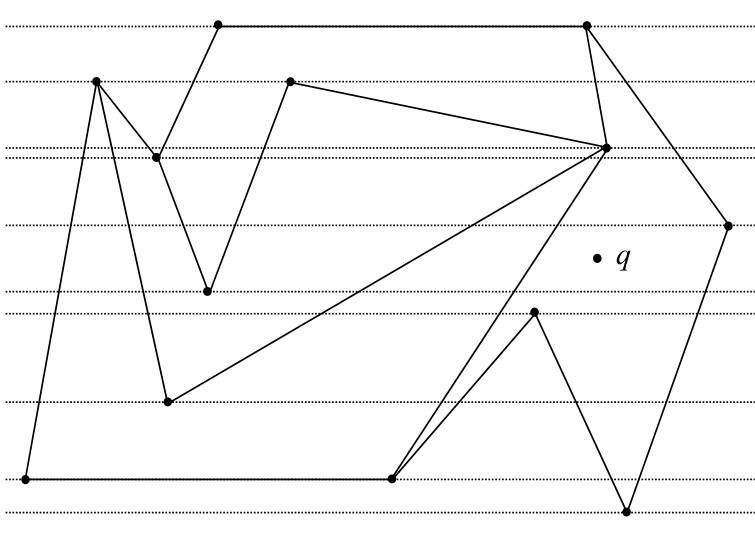
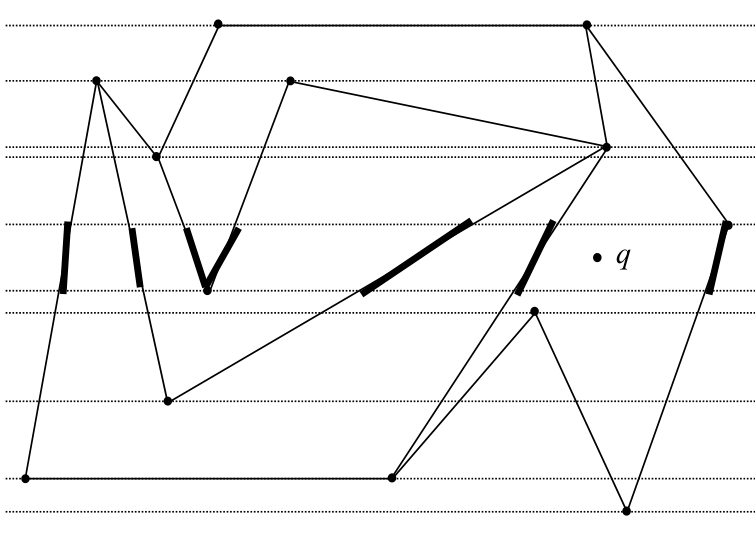

# Point location by slab decomposition

## Scope
- **Slides:** pp. 80-85
- **Major topic folder:** geometric-search
- **Recording files touching this material:** CS 564 - 02.04 4.1.txt
- **Goal of this file:** You should be able to study this topic without reopening the slide deck.

## Big picture
The slab method is one of the first genuine geometric-search data structures. It shows how binary search enters geometry by cutting the plane into horizontal bands.

## What you must know cold
- Construct horizontal lines through all vertices to form slabs.
- Binary search on slab y-order to find the slab containing q.
- Within the slab, use the left-to-right edge order to identify the containing face.

## Core ideas and reasoning
- After preprocessing, every slab has a fixed combinatorial order of intersecting edges.
- Query step 1: binary search over y-coordinates of slab boundaries.
- Query step 2: locate q among the ordered edges inside that slab.

## Figures to actually look at
These are cropped from the main slide PDF. Do not skip them.

### Figure from slide p. 82


### Figure from slide p. 83


## Slide-by-slide digestion

### p. 80 - Point location
- PLANAR POINT LOCATION
- INSTANCE: PSLG G = (V, E), with G connected and
- no vertex v ∈V having degree < 2, and query point q.
- QUESTION: Which face of G is q within?
- With the assumptions that degree(v) ≥2 ∀v ∈ V and G is connected,
- G partitions the plane into simple polygons.

### p. 81 - Point location by brute force
- Consider a point location method using known techniques.
- We represent PSLG G with a DCEL
- (which requires O(N) preprocessing to construct, as seen).
- Query

```text
for each face f of G /* found via HF */
assemble a simple polygon P from edges of f
retrieved using FACE operation /* p. 17 */
test simple polygon inclusion for q within P
endfor
```

- Analysis

### p. 82 - Point location by Slab method
- The fundamental technique for general search is to apply bisection,
- i.e., binary search.
- A binary search on N items requires O(log N) time.
- Often applied to alphanumeric values.
- We will see ways to apply the idea to geometric objects.
- Slab method is an example.
- Slab method query, part 1
- Given PSLG G, construct a horizontal line through each vertex.
- These lines divide the plane into (at most) N + 1 “slabs”.
- Sorting the y-coordinates of the slabs during preprocessing

### p. 83 - Slab method query, part 2
- The intersection of a slab with G is a set of segments,
- from the edges of G.
- The segments define trapezoids, which may degenerate to triangles.
- G a PSLG ⇒edges intersect only at vertices.
- Each vertex defines a slab boundary ⇒
- No segments intersect within a slab.
- Segments in a slab can be totally ordered (e.g., left to right).
- Binary search can be used to find the trapezoid containing q.
- If face stored with each trapezoid during preprocessing,
- this gives the answer to the point location problem.

### p. 84 - Comparison operation during binary search
- This slide illustrates how the query point is compared against ordered slab segments during binary search.
- The comparison is implemented with orientation/left-right tests against the candidate segment.
- In an exam trace, be ready to say whether the query lies to the left or right of the segment and which side the search should continue on.

### p. 85 - Analysis
- Query time: O(log N); 2× O(log N) binary search.
- At most N slabs, at most N segments per slab.
- Cannot be improved (optimum).
- Preprocessing time: O(N2 log N); each of O(N) slabs can
- have as many as N segments, requiring an O(N log N) sort.
- This can be improved.
- Space: O(N2); O(N) slabs, each with O(N) segments.
- Cannot be improved (for this algorithm).

## What you must be able to say or do in an exam
- State the input, output, preprocessing, and query/update model precisely.
- Explain the invariant or ordering that makes the method work.
- Trace the method by hand on a small example.
- Give the exact time and space bounds.
- Mention one edge case, degeneracy, or limitation.

## Complexity and performance facts
Binary search finds the slab in O(log N); storage/preprocessing may be high because each slab stores edge order information.

## Common mistakes and danger points
- The expensive part is building/storing edge orders for slabs.
- Within a slab, you compare q against edges, not against face labels directly.

## Professor emphasis from recordings
These points are distilled from the related recordings and focus on what the professor slowed down for, warned about, or connected to homework/exam reasoning.

- This method is presented as one of the first clean examples of binary search being transferred into geometry.
- He explicitly notes the geometric degeneracy that slab regions can become triangles; the left-to-right order still exists, so the query logic still works.
- A big warning from lecture is the preprocessing blow-up: many slabs may each contain many segments, so the simple slab method is fast at query time but expensive to build.

## Exam-style drills and answer skeletons
Existing drill reminders from the earlier pack:
- Given a PSLG and a query point, describe a naive face-location method using a horizontal ray and identify the incident face of the first crossed edge.
- Adapted from HW2-Q1: Given a DCEL of a PSLG and a query point P, find the face containing P in O(N) using a naive method.

### HW2-Q1 adapted
**Question.** For a PSLG and query point P, explain the naive O(N) point-location method, then explain how the slab method improves the query step.

**How to answer.** Contrast brute-force ray shooting with slab preprocessing. The key gain is binary search on slabs plus ordered edge search inside one slab.

### Core exam drill
**Question.** State the problem solved by point location by slab decomposition, describe preprocessing/query/update steps if any, and give the time and space bounds.

**How to answer.** An excellent answer names the input, the output, the invariant or ordering exploited by the method, and the exact asymptotic costs.

### Hand-trace drill
**Question.** Trace point location by slab decomposition on a small example by hand and explain each comparison or structural change.

**How to answer.** On this course, being able to run the method on a picture matters more than writing vague slogans.

## Recap
### What you must know cold
- Construct horizontal lines through all vertices to form slabs.
- Binary search on slab y-order to find the slab containing q.
- Within the slab, use the left-to-right edge order to identify the containing face.
### Core test / key idea
- After preprocessing, every slab has a fixed combinatorial order of intersecting edges.
- Query step 1: binary search over y-coordinates of slab boundaries.
- Query step 2: locate q among the ordered edges inside that slab.
### Complexity
- Binary search finds the slab in O(log N); storage/preprocessing may be high because each slab stores edge order information.
### Common mistakes / danger points
- The expensive part is building/storing edge orders for slabs.
- Within a slab, you compare q against edges, not against face labels directly.
### Professor emphasis (from recordings)
- This method is presented as one of the first clean examples of binary search being transferred into geometry.
- He explicitly notes the geometric degeneracy that slab regions can become triangles; the left-to-right order still exists, so the query logic still works.
- A big warning from lecture is the preprocessing blow-up: many slabs may each contain many segments, so the simple slab method is fast at query time but expensive to build.
## End-of-file summary
- Construct horizontal lines through all vertices to form slabs.
- Binary search on slab y-order to find the slab containing q.
- Within the slab, use the left-to-right edge order to identify the containing face.
- Binary search finds the slab in O(log N); storage/preprocessing may be high because each slab stores edge order information.
- The expensive part is building/storing edge orders for slabs.
- Within a slab, you compare q against edges, not against face labels directly.

## Everything related to this topic
- **Previous file in reading order:** [Star-shaped polygon inclusion by wedges](../02_Geometric_Search/14_star-shaped-inclusion-by-wedges.md)
- **Next file in reading order:** [Plane sweep as a recurring paradigm](../02_Geometric_Search/16_plane-sweep-paradigm.md)
- **Source slide range:** pp. 80-85 of `comp_geometry_slides_new.pdf`
- **Related recordings:** CS 564 - 02.04 4.1.txt
- **Related homework-derived exam prompts included here:** HW2-Q1 adapted
