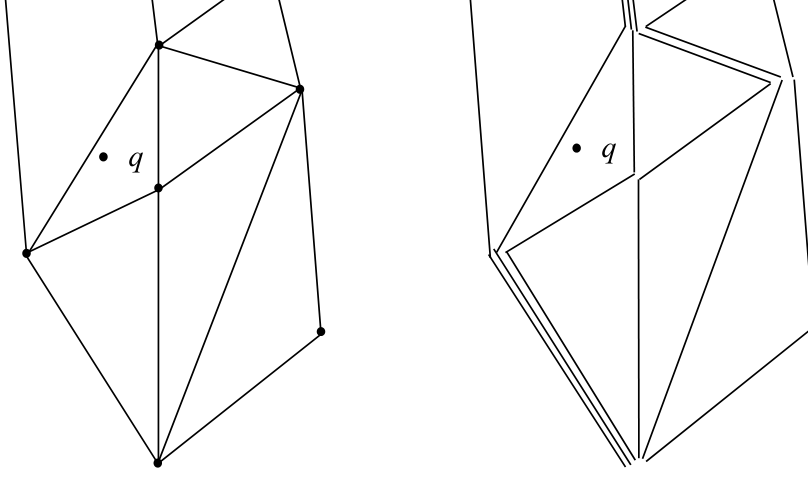
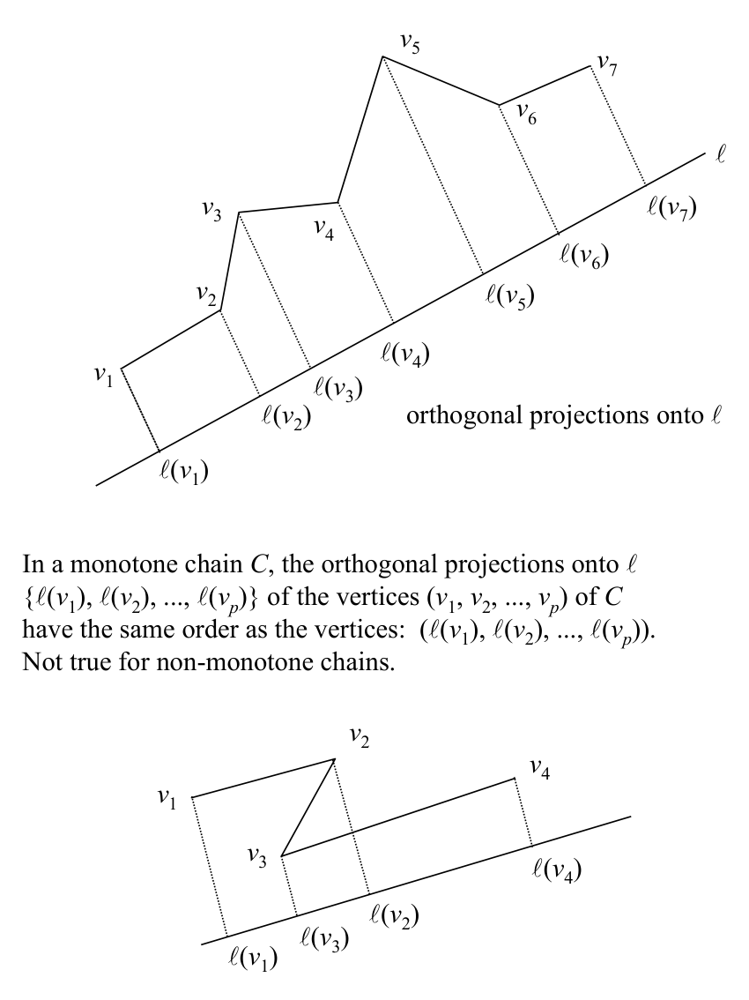

# Chain method: basics, definitions, and query idea

## Scope
- **Slides:** pp. 91-101
- **Major topic folder:** geometric-search
- **Recording files touching this material:** CS 564 - 02.06 5.1.txt
- **Goal of this file:** You should be able to study this topic without reopening the slide deck.

## Big picture
The chain method is a point-location structure for PSLGs. Conceptually it regularizes the subdivision, builds a monotone complete set of chains, then uses binary search twice.

## What you must know cold
- Regular PSLG idea and monotone chains.
- How chains partition the subdivision into searchable regions.
- Two-stage query: binary search among chains, then binary search within a chain.

## Core ideas and reasoning
- A chain is monotone with respect to the chosen axis, so its vertices appear in order by projection.
- Two neighboring chains bound a region; locating the query between chains narrows the candidate face.
- The method is geometric binary search over ordered chains.

## Figures to actually look at
These are cropped from the main slide PDF. Do not skip them.

### Figure from slide p. 91

### Figure from slide p. 97

## Slide-by-slide digestion

### p. 91 - Basic idea of the chain method
- Problem: Point location in the plane, i.e., determine the face
- of a PSLG G that contains a query point q.
- Preprocessing:
- 1. Convert arbitrary PSLG G into a regular PSLG.
- 2. Decompose the regularized PSLG into a set of monotone chains.
- Query:
- 1. Binary search on the chains to find the two chains
- that are on either side of the query point.
- 2. Binary search on one of those chains to determine the face.

### p. 92 - Chain method overview, “overture”
- PSLG G
- Monotone complete
- set of chains C for G
- Regular PSLG G
- Regularize PSLG G
- (Text pp. 52-54)
- Construct C for regular G
- (Text pp. 50-52)
- Queries
- Preprocessing

### p. 93 - Definition of a chain
- A chain C = (v1, v2, ..., vp) is a PSLG with vertex set {v1, v2, ..., vp}
- and edge set{(vi,vi+1): i = 1, 2, ..., p - 1}.
- Notational notes:
- 1. v for vertices; text uses u on pp. 48-49 and v pp. 50-55.
- 2. ( ... ) sequence, { ... } unordered set
- A chain is a planar embedding of a graph theoretic chain.
- Sometimes called polygonal line.

### p. 94 - Subdividing a PSLG with a chain
- Consider a chain C which is a subgraph of PSLG G
- and has as its extreme endpoints vertices on the boundary of G.
- Suppose C is extended from those endpoints
- with semi-infinite parallel rays.
- C subdivides the partition of the plane induced by G into two parts.

### p. 95 - Point-chain discrimination
- To use a binary search for point location based on chains,
- we must be able to determine which side of a chain C
- a query point q is on.
- That operation is point-chain discrimination.
- Point-chain discrimination against an arbitrary chain
- is equivalent in difficulty to general polygon inclusion,
- requiring O(N) time.
- We need to do better than O(N) for the binary search comparison.
- To do so we need a more restricted type of chain.

### p. 96 - Monotone chains
- A chain C = (v1, v2, ..., vp) is monotone w.r.t. a line l if a line
- orthogonal to l intersects C in at most one point.
- There is no “doubling back” or “overlap” of C w.r.t. l.
- Note two small errors in the text:
- p. 49, Definition 2.2:
- “... in exactly one point.” should be “... at most one point.”
- For example, line m is orthogonal to l, intersects C in zero points.
- Definition 2.2 is correct iff C has been extended with the previously
- mentioned semi-infinite rays, but the definition doesn’t say so.
- p. 49, Figure 2.11(b)

### p. 97 - In a monotone chain C, the orthogonal projections onto l
- {l(v1), l(v2), ..., l(vp)} of the vertices (v1, v2, ..., vp) of C
- have the same order as the vertices: (l(v1), l(v2), ..., l(vp)).
- Not true for non-monotone chains.
- orthogonal projections onto l

### p. 98 - Point-chain discrimination with a monotone chain
- The point-chain discrimination operation can be performed
- more efficiently with a monotone chain.
- Assumptions:
- 1. Chain C has been extended with the semi-infinite rays.
- 2. The orthogonal projections (l(v1), l(v2), ..., l(vp))
- of the vertices of C have been computed
- and stored in a searchable data structure (preprocessing).
- Operation:
- 1. Compute orthogonal projection l(q) of q on l. O(1)
- 2. Binary search “on l” for i ∋l(vi) ≤l(q) ≤l(vi+1). O(log N)

### p. 99 - Point location query with monotone chains, part 1
- Given an O(log N) point-chain discrimination operation,
- how can it be used for a point location query?
- Suppose there is a set C = {C1, C2, ..., Cr} of chains
- that are monotone w.r.t. the same line l
- and with these two properties:
- (1) The union of the members of C contains the PSLG G
- (a given edge of G may be in more than one chain in C).
- (2) For any two chains Ci and Cj of C , the vertices of Ci
- which are not members of Cj lie on the same side of Cj.
- Such a set C is a monotone complete set of chains of G.

### p. 100 - Point location query with monotone chains, part 2
- Property 2 means that the chains of C are ordered.
- Therefore, C can be binary searched with the
- point-chain discrimination operation as the comparison operator.
- If there are r chains and the longest has p vertices,
- the search uses O(log r · log p) time.
- Because r and p ∈O(N), the search is in O((log N)2).
- The latter is often written O(log2 N), e.g., see text p. 56.
- (For clarity, not all rays shown.)

### p. 101 - Chain method overview, “reprise 1”
- PSLG G
- Monotone complete
- set of chains C for G
- Regular PSLG G
- Regularize PSLG G
- (Text pp. 52-54)
- Construct C for regular G
- (Text pp. 50-52)
- Queries
- Preprocessing

## What you must be able to say or do in an exam
- State the input, output, preprocessing, and query/update model precisely.
- Explain the invariant or ordering that makes the method work.
- Trace the method by hand on a small example.
- Give the exact time and space bounds.
- Mention one edge case, degeneracy, or limitation.

## Complexity and performance facts
Fast query time after significant preprocessing to regularize the PSLG and construct the chains.

## Common mistakes and danger points
- The query logic only makes sense after regularization and complete chain construction.
- Know exactly what “monotone” means relative to the chosen axis.

## Professor emphasis from recordings
These points are distilled from the related recordings and focus on what the professor slowed down for, warned about, or connected to homework/exam reasoning.

- The point of the chain method in the lectures is to beat the naive slab idea by organizing the subdivision into monotone chains rather than storing every slab independently.
- He repeatedly ties the query procedure to locating the two neighboring chains around the query point, then identifying the face trapped between them.

## Exam-style drills and answer skeletons
### Core exam drill
**Question.** State the problem solved by chain method: basics, definitions, and query idea, describe preprocessing/query/update steps if any, and give the time and space bounds.

**How to answer.** An excellent answer names the input, the output, the invariant or ordering exploited by the method, and the exact asymptotic costs.

### Hand-trace drill
**Question.** Trace chain method: basics, definitions, and query idea on a small example by hand and explain each comparison or structural change.

**How to answer.** On this course, being able to run the method on a picture matters more than writing vague slogans.

## Recap
### What you must know cold
- Regular PSLG idea and monotone chains.
- How chains partition the subdivision into searchable regions.
- Two-stage query: binary search among chains, then binary search within a chain.
### Core test / key idea
- A chain is monotone with respect to the chosen axis, so its vertices appear in order by projection.
- Two neighboring chains bound a region; locating the query between chains narrows the candidate face.
- The method is geometric binary search over ordered chains.
### Complexity
- Fast query time after significant preprocessing to regularize the PSLG and construct the chains.
### Common mistakes / danger points
- The query logic only makes sense after regularization and complete chain construction.
- Know exactly what “monotone” means relative to the chosen axis.
### Professor emphasis (from recordings)
- The point of the chain method in the lectures is to beat the naive slab idea by organizing the subdivision into monotone chains rather than storing every slab independently.
- He repeatedly ties the query procedure to locating the two neighboring chains around the query point, then identifying the face trapped between them.
## End-of-file summary
- Regular PSLG idea and monotone chains.
- How chains partition the subdivision into searchable regions.
- Two-stage query: binary search among chains, then binary search within a chain.
- Fast query time after significant preprocessing to regularize the PSLG and construct the chains.
- The query logic only makes sense after regularization and complete chain construction.
- Know exactly what “monotone” means relative to the chosen axis.

## Everything related to this topic
- **Previous file in reading order:** [Plane sweep as a recurring paradigm](../02_Geometric_Search/16_plane-sweep-paradigm.md)
- **Next file in reading order:** [Chain method: regular PSLGs and constructing the chain family](../02_Geometric_Search/18_chain-method-constructing-chains.md)
- **Source slide range:** pp. 91-101 of `comp_geometry_slides_new.pdf`
- **Related recordings:** CS 564 - 02.06 5.1.txt
- **Related homework-derived exam prompts included here:** none directly mapped; generic exam drills added instead
