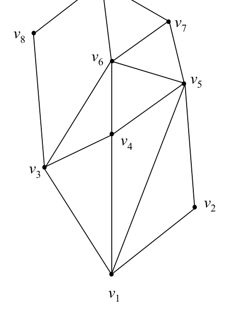
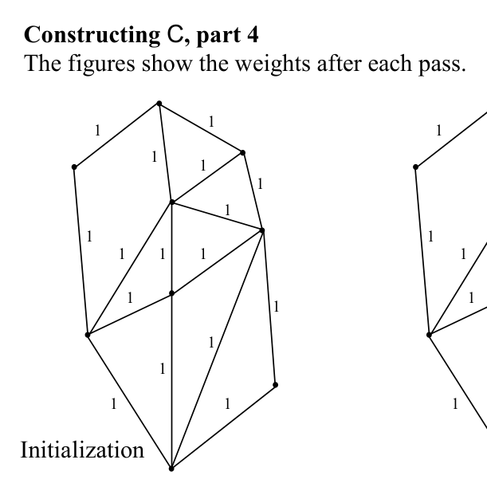

# Chain method: regular PSLGs and constructing the chain family

## Scope
- **Slides:** pp. 102-109
- **Major topic folder:** geometric-search
- **Recording files touching this material:** CS 564 - 02.06 5.1.txt
- **Goal of this file:** You should be able to study this topic without reopening the slide deck.

## Big picture
This is the construction phase students often hand-wave. Do not. The chain method is only as good as the monotone complete set it builds.

## What you must know cold
- What a regular PSLG is.
- Edge orientation by vertex order.
- Graph-weight balancing idea behind constructing a monotone complete chain family.

## Core ideas and reasoning
- Edges are directed from lower to higher ordered vertex.
- Weights are assigned so that for each non-extreme vertex, total incoming and outgoing weight balance.
- The second pass peels off chains according to these weights until a monotone complete set is produced.

## Figures to actually look at
These are cropped from the main slide PDF. Do not skip them.

### Figure from slide p. 102


### Figure from slide p. 107


## Slide-by-slide digestion

### p. 102 - Definition of regular PSLG
- Let G be a PSLG with vertex set (v1, v2, ..., vN),
- where the vertices are indexed ∋i < j iff
- either y(vi) < y(vj) or, if y(vi) = y(vj), then x(vi) > x(vj).
- A vertex vj is regular if there are integers 1 ≤i < j < k ≤N
- ∋vivj and vjvk are edges of G.
- PSLG G is regular iff every vertex vj for 1 < j < N of G
- is regular (i.e., except v1 and vN).
- v9 = v N

### p. 103 - Edge orientation in a regular PSLG
- We may think of an edge vivj as directed from vi to vj if i < j.
- Thus, for a specific vertex vj, all edges vivj with i < j are
- “incoming” and all edges vjvk with j < k are “outgoing”.
- We can define for a vertex vj
- IN(vj) as the set of incoming edges to vj , ordered counterclockwise,
- OUT(vj) as the set of outgoing edges from vj, ordered clockwise.
- Due to the hypothesis of regularity, both of these sets are
- non-empty for non-extreme vertices.
- v9 = v N
- IN(v6) = (v3, v4, v5)

### p. 104 - Constructing C, part 1
- For any vertex vj (j ≠ 1) in a regular PSLG, we can construct a
- y-monotone chain from v1 to vj.
- (y-monotone ≡ monotone w.r.t. the y axis)
- This can be proven by mathematical induction.
- Basis step. Let j = 2. Edge v1v2 must exist in G by the definition
- of regularity, and completes the chain.
- Induction step. Assume ∃ a chain from v1 to vk, ∀ k < j.
- Because vj is regular, ∃ some i < j ∋ vivj is an edge of G.
- By the inductive hypothesis, ∃ a y-monotone chain from v1 to vi.
- Adding edge vivj to that chain gives the desired y-monotone

### p. 105 - Constructing C, part 2
- Those properties are:
- (1) The union of the members of C contains the PSLG G
- (a given edge of G may be in more than one chain in C).
- (2) For any two chains Ci and Cj of C , the vertices of Ci
- which are not members of Cj lie on the same side of Cj.
- Let W(e), the weight of edge e, be the number of chains
- to which edge e belongs. Also let
- WIN(v) =
- ∑ W(e)
- Sum of weights of “incoming” edges

### p. 106 - Constructing C, part 3
- Assigning edges weights ∋WIN(vj) = WOUT(vj) is an old problem.
- A two pass algorithm accomplishes it.
- All weights W(e) are initialized to 1.
- The first pass ensures that WIN(vj) ≤WOUT(vj) for 1 < j < N.
- The second pass ensures WIN(vj) ≥WOUT(vj), for 1 < j < N.
- Together these give the desired balancing.
- Let vIN(v) = |IN(v)| and vOUT(v) = |OUT(v)|.

```text
procedure WeightBalancingInRegularPSLG(G)
begin
  for each edge e in G do
    w(e) ← initial weight  { slide: how many chains will use e }
  repeat
    for each interior vertex v of the regular PSLG do
      rebalance weights on the edges incident to v per the slide’s local rules
  until weights stable after an O(N) sweep  { assigns chain multiplicities; does not emit chains }
end
```

### p. 107 - Constructing C, part 4
- The figures show the weights after each pass.
- Initialization
- 2nd pass
- 1st pass

### p. 108 - Constructing C, part 5
- The algorithm requires O(N) time.
- Observe that the algorithm assigns weights that tell how many
- chains each edge will be in, but it does not actually construct chains.
- How are the chains of C actually constructed from G using
- the edge weights assigned by the weight balancing algorithm?
- The chains can be built up during the second pass,
- as the pass proceeds from vertex to vertex.
- The details are left as an exercise.

### p. 109 - Chain method overview, “reprise 2”
- PSLG G
- Monotone complete
- set of chains C for G
- Regular PSLG G
- Regularize PSLG G
- (Text pp. 52-54)
- Construct C for regular G
- (Text pp. 50-52)
- Queries
- Preprocessing

## What you must be able to say or do in an exam
- State the input, output, preprocessing, and query/update model precisely.
- Explain the invariant or ordering that makes the method work.
- Trace the method by hand on a small example.
- Give the exact time and space bounds.
- Mention one edge case, degeneracy, or limitation.

## Complexity and performance facts
Polynomial preprocessing with the goal of supporting logarithmic-style queries later.

## Common mistakes and danger points
- Do not confuse balancing weights with already having the chains. The modified second pass is what actually constructs them.
- Chain completeness matters: the structure must cover the searchable regions without gaps.

## Professor emphasis from recordings
These points are distilled from the related recordings and focus on what the professor slowed down for, warned about, or connected to homework/exam reasoning.

- He stresses that clockwise/counterclockwise ordering of incident edges matters when constructing chains; if you lose that order, the chain extraction logic breaks.
- The lecture also mentions that the textbook/slides have a few small mistakes here, so you should trust the geometric invariant, not blindly memorize a corrupted line of pseudo-code.
- This is one of the places most naturally connected to homework, because the balancing information must be turned into an actual monotone complete set of chains.

## Exam-style drills and answer skeletons
Existing drill reminders from the earlier pack:
- Modify the graph-weight balancing procedure so the second pass constructs the monotone complete set of chains, not just weights.
- Adapted from HW2-Q4: Modify graph-weight balancing so the second pass constructs a monotone complete set of chains.

### HW2-Q4 adapted
**Question.** Modify the graph weight balancing method so that the second pass constructs a monotone complete set of chains.

**How to answer.** The balancing pass computes how many chains must traverse each edge; the modified second pass should explicitly extract those chains while preserving monotonicity and coverage.

### Core exam drill
**Question.** State the problem solved by chain method: regular pslgs and constructing the chain family, describe preprocessing/query/update steps if any, and give the time and space bounds.

**How to answer.** An excellent answer names the input, the output, the invariant or ordering exploited by the method, and the exact asymptotic costs.

### Hand-trace drill
**Question.** Trace chain method: regular pslgs and constructing the chain family on a small example by hand and explain each comparison or structural change.

**How to answer.** On this course, being able to run the method on a picture matters more than writing vague slogans.

## Recap
### What you must know cold
- What a regular PSLG is.
- Edge orientation by vertex order.
- Graph-weight balancing idea behind constructing a monotone complete chain family.
### Core test / key idea
- Edges are directed from lower to higher ordered vertex.
- Weights are assigned so that for each non-extreme vertex, total incoming and outgoing weight balance.
- The second pass peels off chains according to these weights until a monotone complete set is produced.
### Complexity
- Polynomial preprocessing with the goal of supporting logarithmic-style queries later.
### Common mistakes / danger points
- Do not confuse balancing weights with already having the chains. The modified second pass is what actually constructs them.
- Chain completeness matters: the structure must cover the searchable regions without gaps.
### Professor emphasis (from recordings)
- He stresses that clockwise/counterclockwise ordering of incident edges matters when constructing chains; if you lose that order, the chain extraction logic breaks.
- The lecture also mentions that the textbook/slides have a few small mistakes here, so you should trust the geometric invariant, not blindly memorize a corrupted line of pseudo-code.
- This is one of the places most naturally connected to homework, because the balancing information must be turned into an actual monotone complete set of chains.
## End-of-file summary
- What a regular PSLG is.
- Edge orientation by vertex order.
- Graph-weight balancing idea behind constructing a monotone complete chain family.
- Polynomial preprocessing with the goal of supporting logarithmic-style queries later.
- Do not confuse balancing weights with already having the chains. The modified second pass is what actually constructs them.
- Chain completeness matters: the structure must cover the searchable regions without gaps.

## Everything related to this topic
- **Previous file in reading order:** [Chain method: basics, definitions, and query idea](../02_Geometric_Search/17_chain-method-basics-and-query.md)
- **Next file in reading order:** [Chain method: regularization of arbitrary PSLGs](../02_Geometric_Search/19_chain-method-regularization.md)
- **Source slide range:** pp. 102-109 of `comp_geometry_slides_new.pdf`
- **Related recordings:** CS 564 - 02.06 5.1.txt
- **Related homework-derived exam prompts included here:** HW2-Q4 adapted
