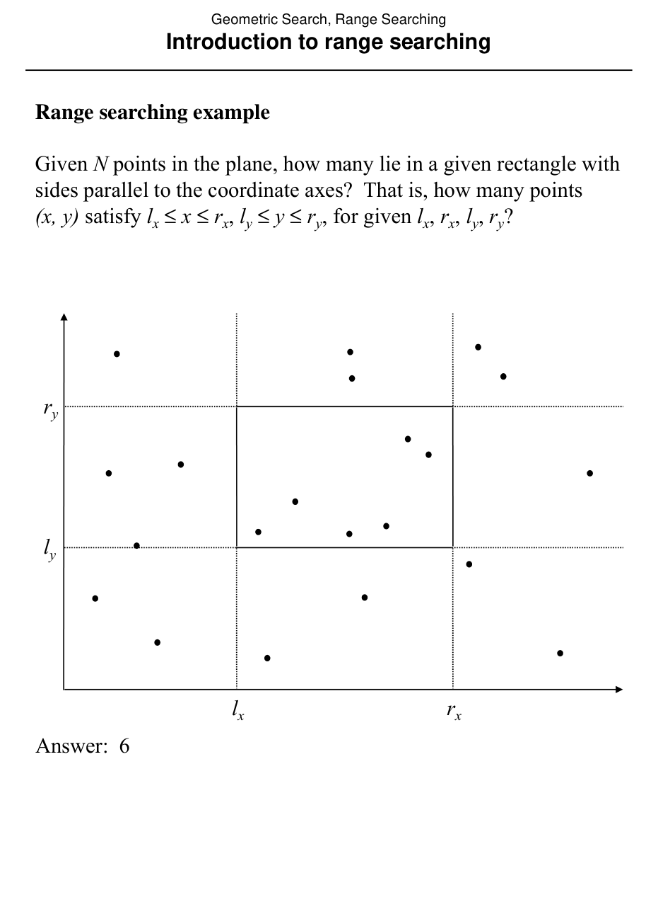
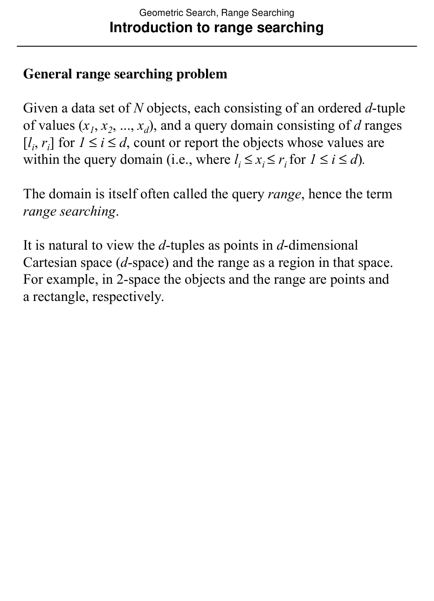

# Range searching: problem statement and design space

## Scope
- **Slides:** pp. 135-137
- **Major topic folder:** geometric-search
- **Recording files touching this material:** CS 564 - 02.11 6.1.txt
- **Goal of this file:** You should be able to study this topic without reopening the slide deck.

## Big picture
This is the design-space intro for orthogonal range searching. After this point the course starts comparing data structures by the usual three costs: preprocessing, storage, query time.

## What you must know cold
- Input: static point set S.
- Query: axis-parallel rectangle or orthogonal range.
- Output modes: report all points or count them.

## Core ideas and reasoning
- The same problem admits multiple structures depending on assumptions about data distribution and how much space you can afford.
- You should be able to compare structures, not just memorize isolated formulas.

## Figures to actually look at
These are cropped from the main slide PDF. Do not skip them.

### Figure from slide p. 135

### Figure from slide p. 136

## Slide-by-slide digestion

### p. 135 - Introduction to range searching
- Range searching example
- Given N points in the plane, how many lie in a given rectangle with
- sides parallel to the coordinate axes? That is, how many points
- (x, y) satisfy lx ≤x ≤rx, ly ≤y ≤ry, for given lx, rx, ly, ry?
- Answer: 6

### p. 136 - Introduction to range searching
- General range searching problem
- Given a data set of N objects, each consisting of an ordered d-tuple
- of values (x1, x2, ..., xd), and a query domain consisting of d ranges
- [li, ri] for 1 ≤i ≤d, count or report the objects whose values are
- within the query domain (i.e., where li ≤xi ≤ri for 1 ≤i ≤d).
- The domain is itself often called the query range, hence the term
- range searching.
- It is natural to view the d-tuples as points in d-dimensional
- Cartesian space (d-space) and the range as a region in that space.
- For example, in 2-space the objects and the range are points and

### p. 137 - Standard range searching problem
- INSTANCE: Set S = {p1, p2, ..., pN} of N points in the plane,
- pi = (xi, yi) for 1 ≤i ≤N, and rectangular range R = [lx, rx] × [ly, ry],
- also in the plane.
- QUESTION: Report the points of S located within R,
- i.e. points pi ∈S where lx ≤xi ≤rx and ly ≤yi ≤ry.
- Range searching assumptions
- Unless otherwise noted, we will assume the following for all
- range searching problems and algorithms.
- 1. Two dimensional, all points and range within plane.
- 2 All

## What you must be able to say or do in an exam
- Give the precise definitions.
- Distinguish similar notions cleanly.
- Use the right primitive test or formula on a concrete example.

## Complexity and performance facts
Always state preprocessing, storage, and query/reporting time separately.

## Common mistakes and danger points
- The range is [lx, rx] x [ly, ry], not “the two corners” unless the notation is explicitly converted.
- Orthogonal range notation pitfall: the query range is the Cartesian product `[lx, rx] x [ly, ry]`; do not reinterpret the endpoints as two arbitrary corners unless you explicitly convert the notation.

## Exam-style drills and answer skeletons
### Definition drill
**Question.** Give the precise definitions and the most important consequences from range searching: problem statement and design space.

**How to answer.** A strong answer distinguishes similar objects and uses the course terminology exactly.

## Recap
### What you must know cold
- Input: static point set S.
- Query: axis-parallel rectangle or orthogonal range.
- Output modes: report all points or count them.
### Core test / key idea
- The same problem admits multiple structures depending on assumptions about data distribution and how much space you can afford.
- You should be able to compare structures, not just memorize isolated formulas.
### Complexity
- Always state preprocessing, storage, and query/reporting time separately.
### Common mistakes / danger points
- The range is [lx, rx] x [ly, ry], not “the two corners” unless the notation is explicitly converted.
- Orthogonal range notation pitfall: the query range is the Cartesian product `[lx, rx] x [ly, ry]`; do not reinterpret the endpoints as two arbitrary corners unless you explicitly convert the notation.
## End-of-file summary
- Input: static point set S.
- Query: axis-parallel rectangle or orthogonal range.
- Output modes: report all points or count them.
- Always state preprocessing, storage, and query/reporting time separately.
- The range is [lx, rx] x [ly, ry], not “the two corners” unless the notation is explicitly converted.
- Orthogonal range notation pitfall: the query range is the Cartesian product `[lx, rx] x [ly, ry]`; do not reinterpret the endpoints as two arbitrary corners unless you explicitly convert the notation.

## Everything related to this topic
- **Previous file in reading order:** [Triangle refinement: hierarchy, query, storage, and analysis](../02_Geometric_Search/22_triangle-refinement-query-and-analysis.md)
- **Next file in reading order:** [Grid method](../02_Geometric_Search/24_grid-method.md)
- **Source slide range:** pp. 135-137 of `comp_geometry_slides_new.pdf`
- **Related recordings:** CS 564 - 02.11 6.1.txt
- **Related homework-derived exam prompts included here:** none directly mapped; generic exam drills added instead
