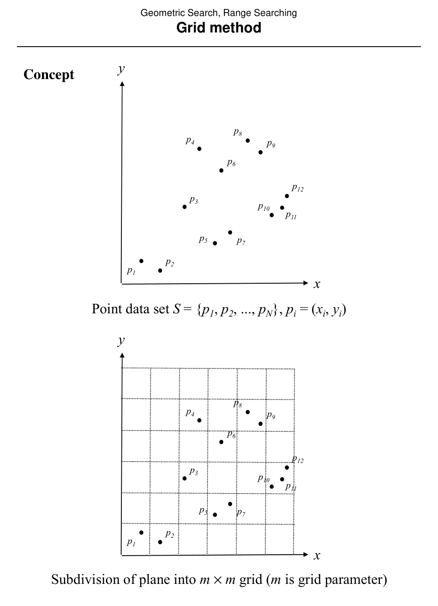
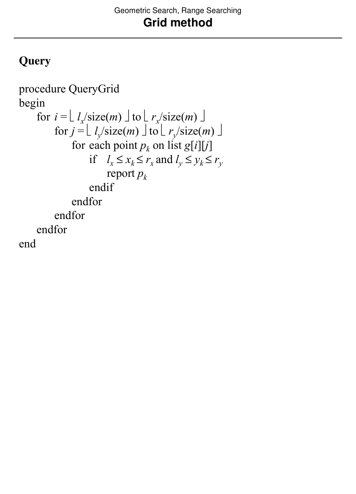

# Grid method

## Scope
- **Slides:** pp. 138-141
- **Major topic folder:** geometric-search
- **Recording files touching this material:** CS 564 - 02.13 7.1.txt
- **Goal of this file:** You should be able to study this topic without reopening the slide deck.

## Big picture
The grid method is the simplest spatial subdivision approach. It is fast when the data is well behaved and can be awful in the worst case, which is the recurring moral of the early range-search structures.

## What you must know cold
- Partition the plane into an m x m regular grid.
- Store points by cell.
- A query range is decomposed into fully covered interior cells plus a boundary strip.

## Core ideas and reasoning
- For interior cells, report or count all stored points directly.
- For boundary cells, examine points individually because the cell may only partially overlap the query.

## Figures to actually look at
These are cropped from the main slide PDF. Do not skip them.

### Figure from slide p. 138


### Figure from slide p. 140


## Slide-by-slide digestion

### p. 138 - Grid method
- Concept
- Point data set S = {p1, p2, ..., pN}, pi = (xi, yi)
- Subdivision of plane into m × m grid (m is grid parameter)

### p. 139 - Grid method
- Preprocessing

```text
procedure ConstructGrid
begin
Initialize m × m array of lists g to NULL.
for i = 1 to N
add pi to list g[xi /size(m)][yi /size(m)]
Quantity size(m) is the coordinate distance represented by
one grid interval.
m × m array of pointers to lists
Lists associated with grid cells
```

### p. 140 - Grid method
- Query

```text
procedure QueryGrid
begin
for i = lx/size(m) to rx/size(m) 
for j = ly/size(m) to ry/size(m) 
for each point pk on list g[i][j]
lx ≤xk ≤rx and ly ≤yk ≤ry
report pk
endfor
```

### p. 141 - Grid method
- Analysis
- Preprocessing: O(m2 + N).
- Query: O(m2 + N).
- Storage: O(m2 + N).
- Analysis comments
- Query not O(m2N) because each point only checked once.
- Not O(m2 + K) because some points are checked that are not
- reported. O(m2 + K) is better than O(m2 + N) and the former
- is allowed only when only points to be reported are checked.
- Al

## What you must be able to say or do in an exam
- State the input, output, preprocessing, and query/update model precisely.
- Explain the invariant or ordering that makes the method work.
- Trace the method by hand on a small example.
- Give the exact time and space bounds.
- Mention one edge case, degeneracy, or limitation.

## Complexity and performance facts
Good average behavior under uniform assumptions; worst-case query can degrade because many points may fall in a small number of cells.

## Common mistakes and danger points
- Grid parameter choice matters.
- Worst-case behavior is poor when data is clustered.

## Professor emphasis from recordings
These points are distilled from the related recordings and focus on what the professor slowed down for, warned about, or connected to homework/exam reasoning.

- For the grid method the lecture frames average-case behavior as the attraction, but not as a worst-case guarantee. Bad point distributions can still hurt.

## Exam-style drills and answer skeletons
### Core exam drill
**Question.** State the problem solved by grid method, describe preprocessing/query/update steps if any, and give the time and space bounds.

**How to answer.** An excellent answer names the input, the output, the invariant or ordering exploited by the method, and the exact asymptotic costs.

### Hand-trace drill
**Question.** Trace grid method on a small example by hand and explain each comparison or structural change.

**How to answer.** On this course, being able to run the method on a picture matters more than writing vague slogans.

## Recap
### What you must know cold
- Partition the plane into an m x m regular grid.
- Store points by cell.
- A query range is decomposed into fully covered interior cells plus a boundary strip.
### Core test / key idea
- For interior cells, report or count all stored points directly.
- For boundary cells, examine points individually because the cell may only partially overlap the query.
### Complexity
- Good average behavior under uniform assumptions; worst-case query can degrade because many points may fall in a small number of cells.
### Common mistakes / danger points
- Grid parameter choice matters.
- Worst-case behavior is poor when data is clustered.
### Professor emphasis (from recordings)
- For the grid method the lecture frames average-case behavior as the attraction, but not as a worst-case guarantee. Bad point distributions can still hurt.
## End-of-file summary
- Partition the plane into an m x m regular grid.
- Store points by cell.
- A query range is decomposed into fully covered interior cells plus a boundary strip.
- Good average behavior under uniform assumptions; worst-case query can degrade because many points may fall in a small number of cells.
- Grid parameter choice matters.
- Worst-case behavior is poor when data is clustered.

## Everything related to this topic
- **Previous file in reading order:** [Range searching: problem statement and design space](../02_Geometric_Search/23_range-searching-intro.md)
- **Next file in reading order:** [Quadtree method](../02_Geometric_Search/25_quadtree-method.md)
- **Source slide range:** pp. 138-141 of `comp_geometry_slides_new.pdf`
- **Related recordings:** CS 564 - 02.13 7.1.txt
- **Related homework-derived exam prompts included here:** none directly mapped; generic exam drills added instead
