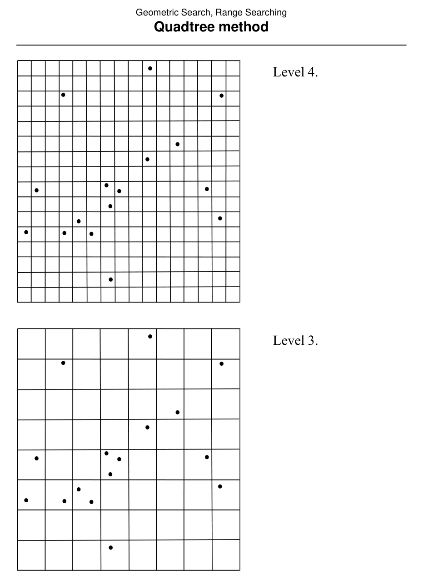
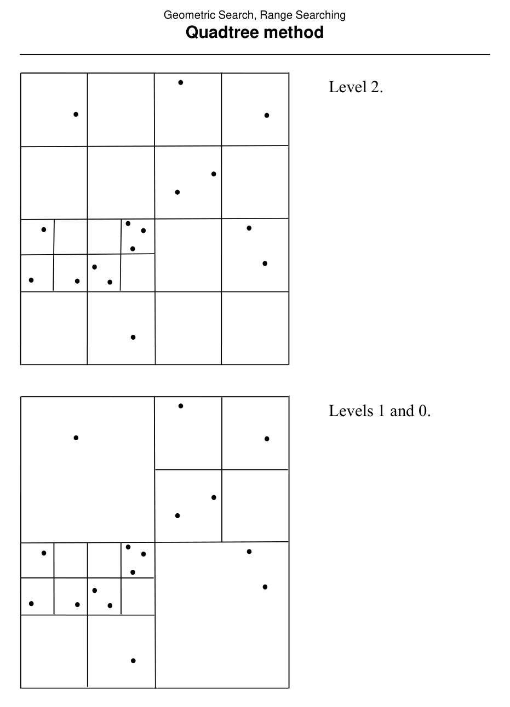

# Quadtree method

## Scope
- **Slides:** pp. 142-151
- **Major topic folder:** geometric-search
- **Recording files touching this material:** CS 564 - 02.13 7.1.txt
- **Goal of this file:** You should be able to study this topic without reopening the slide deck.

## Big picture
Quadtrees adapt the grid idea recursively. Instead of fixing one uniform resolution everywhere, they subdivide only where needed, up to the chosen cutoff rule.

## What you must know cold
- Recursive subdivision into four quadrants.
- Leaf stopping criterion such as occupancy threshold or maximum depth.
- Query visits only nodes whose regions intersect the search range.

## Core ideas and reasoning
- A quadtree is still space subdivision, not data-balanced subdivision.
- This makes it more adaptive than a fixed grid, but still vulnerable to bad worst-case distributions.

## Figures to actually look at
These are cropped from the main slide PDF. Do not skip them.

### Figure from slide p. 146


### Figure from slide p. 147


## Slide-by-slide digestion

### p. 142 - Quadtree method
- Definitions
- A quadtree subdivision is a recursive subdivision of the plane into
- four equal sized quadrants. A quad is a quadrant or subquadrant
- at any level of the subdivision, including the plane itself.
- Each quad is represented by a node in a four-way branching tree
- called a quadtree. (The root represents the plane.) Each node of
- a quadtree has either 0 or 4 children, depending on whether the
- corresponding quad is subdivided. Each non-root node represents
- one subquadrant of its parent’s quad.
- Subdivision of a quad recurses until:

### p. 143 - Quadtree method
- Point data set S.
- Quadtree subdivision
- for S with M = 2 and
- D = 3.
- Quad where D = 3
- cut off further
- subdivision.

### p. 144 - Quadtree method
- Quadtree subdivision
- for S with M = 2 and
- D = 3.
- Quad where D = 3
- cut off further
- subdivision.
- Corresponding
- quadtree.
- Branch numbering convention
- Attached point list (showing number of points)

### p. 145 - Quadtree method
- Construction
- A quadtree is built over a square subset of the plane, or domain,
- defined to include all points of S; domain = [Lx, Rx] × [Ly, Ry].
- Domain subdivided into a regular m × m grid of square cells,
- each containing a list of points of S located in that cell; m = 2D + 1.
- Conceptually, the overall quadtree is built bottom-up from the grid.
- Associate with each cell a one-node quadtree, at level D + 1.
- To construct a quadtree with root at level λ, the four quadtrees at
- level λ + 1 that represent its subquadrants are “combined”.
- To “combine” quadtrees q0, q1, q2, q3 at level λ + 1:

### p. 146 - Quadtree method
- Level 4.
- Level 3.

### p. 147 - Quadtree method
- Level 2.
- Levels 1 and 0.

### p. 148 - Quadtree method
- Preprocessing
- Quadtree node q
- q.points
- List of points of S within quad for this node; NULL if not leaf.
- q.child[4] Pointers to subtrees, NULL if leaf.
- Number of points within quads represented by the subtree rooted at this node.
- q.quad
- Boundaries of the quad represented by this node; format [lx, rx] × [ly, ry].
- Q = ConstructQuadtree(G, M, D, 0, 0, m-1, 0, m-1, domain)

```text
procedure ConstructQuadtree(G, M, D, level, imin, imax, jmin, jmax, quad)
```

### p. 149 - Quadtree method
- jmid + 1
- jmax
- (l + r ) / 2
- (lx + rx) / 2
- Geometry of recursive calls in CreateQuadtree
- jmid
- jmin
- İmid+1
- imax
- (ly + ry) / 2

### p. 150 - Quadtree method
- Query
- QueryQuadtree(root(Q),R)

```text
/* Q is quadtree, R = [lx, rx] × [ly, ry] is range. */
procedure QueryQuadtree(q, R)
begin
(q.quad ∩R) then /* Query range overlaps node’s quad. */
(q.child[0] = NULL) then /*Node q is a leaf. */
for each point pi on q.points /* Scan the point list. */
(pi within R) then
report pi
```

### p. 151 - Quadtree method
- Analysis
- Preprocessing: O(m2 + N); recall that m = 2D + 1.
- Query: O(2D + N).
- Storage: O(m2 + N).
- Analysis comments
- Note that ConstructQuadtree is O(m2), not O(m2 + N), because
- point lists rather than points are handled (appending 4 lists can be
- done in constant time). However, constructing the grid G, input to
- ConstructQuadtree, is O(m2 + N).
- Th

## What you must be able to say or do in an exam
- State the input, output, preprocessing, and query/update model precisely.
- Explain the invariant or ordering that makes the method work.
- Trace the method by hand on a small example.
- Give the exact time and space bounds.
- Mention one edge case, degeneracy, or limitation.

## Complexity and performance facts
Often better in practice than a flat grid, but worst-case bounds remain distribution-sensitive.

## Common mistakes and danger points
- Leaves need not be at the same depth.
- Boundary overlap handling matters when deciding whether to recurse, report a whole subtree, or inspect stored points.

## Exam-style drills and answer skeletons
### Core exam drill
**Question.** State the problem solved by quadtree method, describe preprocessing/query/update steps if any, and give the time and space bounds.

**How to answer.** An excellent answer names the input, the output, the invariant or ordering exploited by the method, and the exact asymptotic costs.

### Hand-trace drill
**Question.** Trace quadtree method on a small example by hand and explain each comparison or structural change.

**How to answer.** On this course, being able to run the method on a picture matters more than writing vague slogans.

## Recap
### What you must know cold
- Recursive subdivision into four quadrants.
- Leaf stopping criterion such as occupancy threshold or maximum depth.
- Query visits only nodes whose regions intersect the search range.
### Core test / key idea
- A quadtree is still space subdivision, not data-balanced subdivision.
- This makes it more adaptive than a fixed grid, but still vulnerable to bad worst-case distributions.
### Complexity
- Often better in practice than a flat grid, but worst-case bounds remain distribution-sensitive.
### Common mistakes / danger points
- Leaves need not be at the same depth.
- Boundary overlap handling matters when deciding whether to recurse, report a whole subtree, or inspect stored points.
## End-of-file summary
- Recursive subdivision into four quadrants.
- Leaf stopping criterion such as occupancy threshold or maximum depth.
- Query visits only nodes whose regions intersect the search range.
- Often better in practice than a flat grid, but worst-case bounds remain distribution-sensitive.
- Leaves need not be at the same depth.
- Boundary overlap handling matters when deciding whether to recurse, report a whole subtree, or inspect stored points.

## Everything related to this topic
- **Previous file in reading order:** [Grid method](../02_Geometric_Search/24_grid-method.md)
- **Next file in reading order:** [k-d tree method](../02_Geometric_Search/26_kd-tree-method.md)
- **Source slide range:** pp. 142-151 of `comp_geometry_slides_new.pdf`
- **Related recordings:** CS 564 - 02.13 7.1.txt
- **Related homework-derived exam prompts included here:** none directly mapped; generic exam drills added instead
