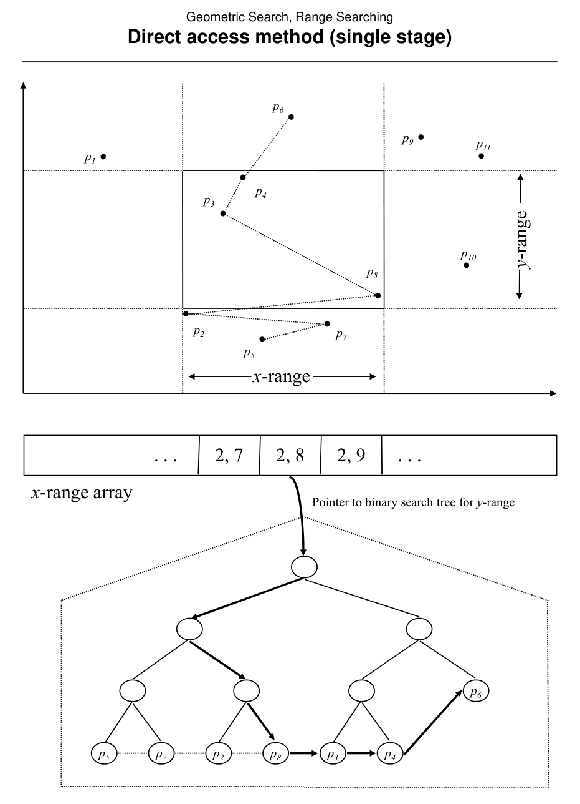
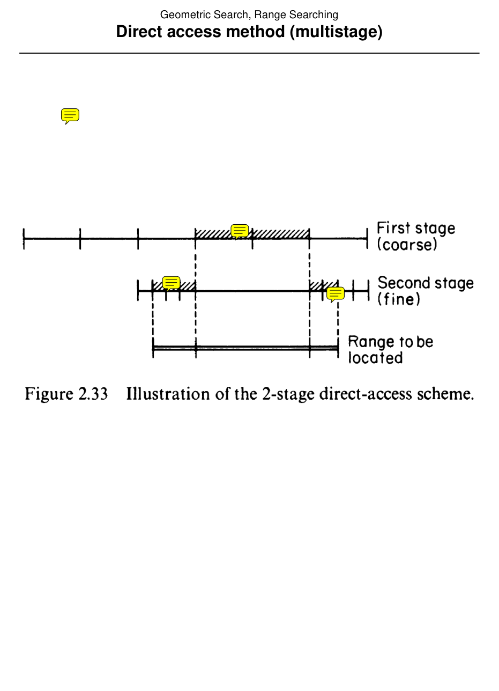

# Direct access methods

## Scope
- **Slides:** pp. 161-173
- **Major topic folder:** geometric-search
- **Recording files touching this material:** CS 564 - 02.13 7.2.txt, CS 564 - 02.18 8.1.txt
- **Goal of this file:** You should be able to study this topic without reopening the slide deck.

## Big picture
These methods are the space-hungry extreme of the design space: precompute answers so aggressively that queries become very fast. This is conceptually important even if it looks absurdly expensive.

## What you must know cold
- Brute force baseline.
- Normalization of coordinates / ranks.
- Single-stage and multi-stage direct access as precomputation strategies.

## Core ideas and reasoning
- The extreme idea is to precompute answers for every possible normalized query range.
- Single-stage direct access spends a huge amount of storage for very small query time.
- Multi-stage direct access reduces storage by factoring the query into stages.

## Figures to actually look at
These are cropped from the main slide PDF. Do not skip them.

### Figure from slide p. 165

### Figure from slide p. 171

## Slide-by-slide digestion

### p. 161 - Direct access method (brute force)
- Concept
- Points of S partition plane into (N + 1)2 cells.
- Given range R = [lx, rx] × [ly, ry], points (lx, ly) and (rx, ry) each lie in
- a particular cell. Moving one of those points within a cell does not
- change the answer (the subset of S within R). Thus a pair of cells
- forms an equivalence class of ranges.
- ⇒The number of distinct ranges is bounded above by
- N + 1 2 ∈O(N4).

### p. 162 - Direct access method (brute force)
- Preprocessing
- Compute and save answer for each of O(N4) different pairs of cells.
- Query
- 1. Given R = [lx, rx] × [ly, ry], map points (lx, ly) and (rx, ry) to cells.
- 2. Access and report answer stored for the pair of cells.
- Analysis
- Preprocessing: O(N5); O(N4) cells, O(N) linear processing for each.
- Query: O(log N + K); O(log N) to find cells for range corners
- Query: O(log N + K); O(log N) to find cells for range corners.
- Storage: O(N5); O(N4) cells, O(N) elements for each cell.

### p. 163 - Normalization
- Normalization of coordinates
- It will be useful to have available normalized coordinates for both
- ranges and points. For points ∈ S, normalized x coordinate is
- in [1, N], assigned in order of increasing x coordinate.
- For range R = [lx, rx] × [ly, ry], normalized range is obtained by
- mapping range extents to normalized coordinates for points. Range
- normalized x coordinates are in [1, N + 1]. For example,
- if xi-1 ≤lx ≤ xi, lx normalized is i.
- points ∈ S
- normalized coordinates

### p. 164 - Direct access method (single stage)
- Concept
- One-dimensional binary search is optimal in storage θ(N) and
- time O(log N + K). Combine direct access on one coordinate (x)
- with one-dimensional binary search on the other (y).
- Combination is single stage direct access.
- Given range R = [lx, rx] × [ly, ry], normalize [lx, rx] to (i, j);
- normalized range will have 1 ≤i ≤j ≤N + 1.
- Use x-range (i, j) to access entry in direct access array.
- Each array entry points to a binary search tree which holds points
- of S with normalized coordinates in [i, j], stored in ascending

### p. 165 - Direct access method (single stage)
- x-range
- y-range
- x-range array
- Pointer to binary search tree for y-range

### p. 166 - Direct access method (single stage)
- This slide is mainly visual. Use the figure crop in this file and make sure you can explain what the diagram is showing.

### p. 167 - Direct access method (single stage)
- Preprocessing
- For each pair of normalized x coordinates (i, j), build a threaded
- binary tree storing the subset of S with normalized x coordinates
- in the interval [i, j] in ascending y coordinate order.
- Query
- 1. Normalize x-range of R = [lx, rx] × [ly, ry]. O(log N)
- 2. Access x-range array to get tree pointer. O(1)
- 3. Search tree for y ≥ ly. O(log N)
- 4. Report points within y-range by following threads in tree
- until y ≥ ry. O(K)

### p. 168 - Direct access method (multistage)
- Concept
- We would like to improve the O(N3) storage of single stage direct
- access method. Instead of precomputing answers for all possible
- x-ranges, do so for a smaller set of fixed x-ranges. For a query
- x-range, find a set of the fixed ranges that cover it, and combine
- their precomputed answers.
- N + 1
- division
- gauge
- Point set S x-ranges

### p. 169 - Direct access method (multistage)
- Data structure
- Multiple direct access arrays, one for each gauge
- ⇒1 array for coarse level, multiple at fine level.
- Each array contains an entry for each possible interval in that gauge.
- As in the single stage version, each entry is a pointer to a threaded
- binary tree containing the points of S located within the x-range of
- the interval, stored in ascending y order.
- Preprocessing
- For each level (coarse and fine)
- for each gauge at the level

### p. 170 - Direct access method (multistage)
- Query (Explanation)
- • Find the beginning and end of the query x-range. This will
- correspond to three intervals: one in the coarse gauge and
- two in the fine gauges (O log (N)).
- • There is a direct access array for the coarse division, whose
- elements are pointing to the threaded binary trees for each
- possible coarse x-range.
- • After we identify the query x-range with two normalization
- (binary searches), go to the direct access array for the
- coarse subdivision and follow the array element to access

### p. 171 - Direct access method (multistage)
- This slide is mainly visual. Use the figure crop in this file and make sure you can explain what the diagram is showing.

### p. 172 - Direct access method (multistage)
- Example (storage and query cost):
- N = 100,  = 0.5, coarse gauge contains N 0.5 =10 divisions. N
- (100) possible coarse-gauge intervals. N (100) binary trees
- each with N (100) points. The total storage cost is 100 x 100 =
- 10,000 (O(N 2)).
- Each fine gauge contains N 1-0.5 = N 0.5 = 10 divisions. There are
- N 0.5 = 10 such structures. Each fine division contains 10 points
- and the storage cost of the binary search trees of a single
- structure in the fine division is N 0.5 x 2 =100. For a total storage
- of N 0.5 x N 0.5 x 2 x N 0.5 = 10,000 points. Total storage cost for

### p. 173 - Direct access method (multistage)
- Analysis
- Preprocessing: O(N2 log N); O(N) trees, O(N log N) each.
- Query: O(log N + K); see comments.
- Storage: O(N2); see below.
- Storage analyis details
- Coarse
- Gauges per level
- Nα
- Divisions per gauge
- N1−α

## What you must be able to say or do in an exam
- State the input, output, preprocessing, and query/update model precisely.
- Explain the invariant or ordering that makes the method work.
- Trace the method by hand on a small example.
- Give the exact time and space bounds.
- Mention one edge case, degeneracy, or limitation.

## Complexity and performance facts
Query time is excellent; storage is the real issue and is the entire reason later structures exist.

## Common mistakes and danger points
- Do not praise a direct-access method without also admitting its brutal storage cost.
- Normalization is essential; otherwise the number of possible raw coordinates is meaningless.

## Professor emphasis from recordings
These points are distilled from the related recordings and focus on what the professor slowed down for, warned about, or connected to homework/exam reasoning.

- The direct-access methods are taught as a precomputation-for-speed tradeoff: brilliant when query volume is huge, ridiculous when storage is the bottleneck.
- He points out just how brutal the storage explosion can become, which is exactly the sort of comparison the exam likes.

## Exam-style drills and answer skeletons
Existing drill reminders from the earlier pack:
- Design a structure for a laminar family of non-crossing rectangles that answers containment-count queries faster than scanning all rectangles.
- Adapted from HW2-Q3: Store a laminar set of rectangles so that a query point reports how many rectangles contain it, and support insertion of a new rectangle.

### HW2-Q3 adapted
**Question.** Design a structure for non-intersecting rectangles so that a query point P returns how many rectangles contain P, and describe insertion of a new rectangle.

**How to answer.** Exploit the non-intersection assumption to reduce overlap complexity. The intended answer should preprocess boundaries so a query does much less than checking all rectangles.

### Core exam drill
**Question.** State the problem solved by direct access methods, describe preprocessing/query/update steps if any, and give the time and space bounds.

**How to answer.** An excellent answer names the input, the output, the invariant or ordering exploited by the method, and the exact asymptotic costs.

### Hand-trace drill
**Question.** Trace direct access methods on a small example by hand and explain each comparison or structural change.

**How to answer.** On this course, being able to run the method on a picture matters more than writing vague slogans.

## Recap
### What you must know cold
- Brute force baseline.
- Normalization of coordinates / ranks.
- Single-stage and multi-stage direct access as precomputation strategies.
### Core test / key idea
- The extreme idea is to precompute answers for every possible normalized query range.
- Single-stage direct access spends a huge amount of storage for very small query time.
- Multi-stage direct access reduces storage by factoring the query into stages.
### Complexity
- Query time is excellent; storage is the real issue and is the entire reason later structures exist.
### Common mistakes / danger points
- Do not praise a direct-access method without also admitting its brutal storage cost.
- Normalization is essential; otherwise the number of possible raw coordinates is meaningless.
### Professor emphasis (from recordings)
- The direct-access methods are taught as a precomputation-for-speed tradeoff: brilliant when query volume is huge, ridiculous when storage is the bottleneck.
- He points out just how brutal the storage explosion can become, which is exactly the sort of comparison the exam likes.
## End-of-file summary
- Brute force baseline.
- Normalization of coordinates / ranks.
- Single-stage and multi-stage direct access as precomputation strategies.
- Query time is excellent; storage is the real issue and is the entire reason later structures exist.
- Do not praise a direct-access method without also admitting its brutal storage cost.
- Normalization is essential; otherwise the number of possible raw coordinates is meaningless.

## Everything related to this topic
- **Previous file in reading order:** [k-d tree method](../02_Geometric_Search/26_kd-tree-method.md)
- **Next file in reading order:** [Range trees](../02_Geometric_Search/28_range-trees.md)
- **Source slide range:** pp. 161-173 of `comp_geometry_slides_new.pdf`
- **Related recordings:** CS 564 - 02.13 7.2.txt, CS 564 - 02.18 8.1.txt
- **Related homework-derived exam prompts included here:** HW2-Q3 adapted
