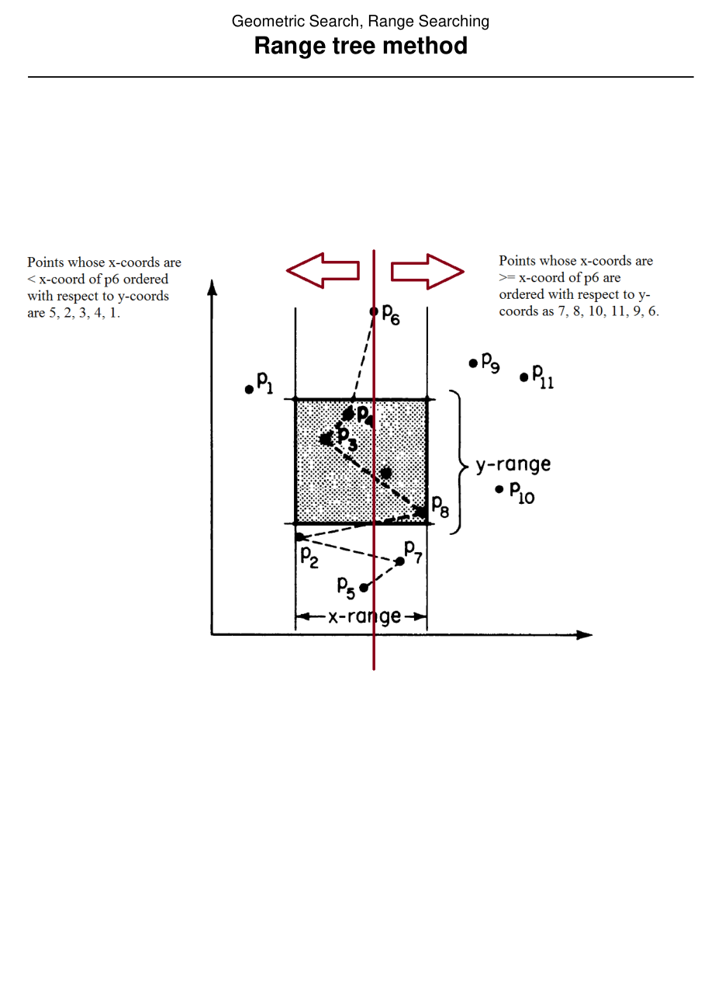
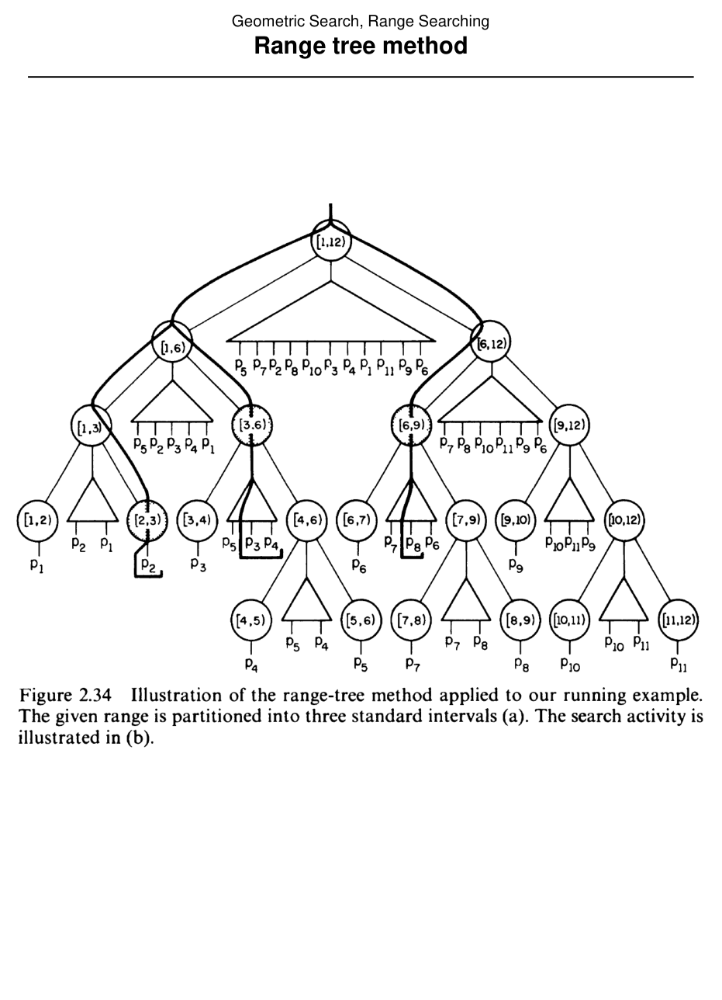

# Range trees

## Scope
- **Slides:** pp. 174-179
- **Major topic folder:** geometric-search
- **Recording files touching this material:** CS 564 - 02.18 8.1.txt
- **Goal of this file:** You should be able to study this topic without reopening the slide deck.

## Big picture
Range trees are the most exam-worthy structure in the range-search block because they explicitly reuse segment-tree ideas and then add a second search structure inside each node. Tree of trees, because apparently one tree was not enough.

## What you must know cold
- Primary structure by x-intervals, secondary ordered structure by y-values at each node.
- Range-tree query decomposes the x-range into canonical nodes and then searches y inside each associated structure.
- Semi-open interval convention and why it matters.

## Core ideas and reasoning
- Think of a range tree as a segment tree whose allocation lists have been replaced by searchable ordered trees.
- The x-range decomposition produces O(log N) canonical nodes.
- At each canonical node, query the y-ordered associated structure to report or count exactly the points whose x-values are already known to be valid.

## Figures to actually look at
These are cropped from the main slide PDF. Do not skip them.

### Figure from slide p. 177


### Figure from slide p. 178


## Slide-by-slide digestion

### p. 174 - Range tree method
- Definition
- A range tree is a segment tree where the allocation list A(v) for each
- node has been replaced with a standard threaded binary tree. Stored
- (“allocated”) in the allocation tree for each node are the points
- of S with x-coordinates within the scope interval associated with
- that node. The trees are organized in ascending y-coordinate order.
- Note that in a range tree the scope intervals are all semi-closed.
- The allocation tree for node for [i, j) does not contain pj.
- For that reason the range tree for S = {p1, p2, ..., pN} is
- T(1, N + 1).

### p. 175 - Range tree method
- Query
- Informally, traverse the segment tree as if inserting the x-range;
- at each allocation node, search the allocation tree of the node
- for points in the y-range.
- More formally, to perform range query R = [lx, rx] × [ly, ry]
- in range tree T:
- SearchRangeTree(lx, rx + 1, ly, ry, root(T))

```text
procedure SearchRangeTree(lx, rx , ly, ry, v)
begin
(lx ≤B(v) and E(v) ≤rx) then
```

### p. 176 - Range tree method
- Analysis
- Preprocessing: O(N log N)
- Query: O((log N)2 + K); O(log N) allocation nodes in the
- segment tree structure for the query x-range,
- with an O(log N) binary tree search for each.
- Storage: O(N log N); see Preparata, p. 86.
- Comments
- The query time can be improved to O(log N + K).
- Observe that once the query y-range starting point in S has been
- found (via a binary search at one node) there is no need to find it

### p. 177 - Range tree method
- This slide is mainly visual. Use the figure crop in this file and make sure you can explain what the diagram is showing.

### p. 178 - Range tree method
- This slide is mainly visual. Use the figure crop in this file and make sure you can explain what the diagram is showing.

### p. 179 - Range tree method
- This slide is mainly visual. Use the figure crop in this file and make sure you can explain what the diagram is showing.

## What you must be able to say or do in an exam
- State the input, output, preprocessing, and query/update model precisely.
- Explain the invariant or ordering that makes the method work.
- Trace the method by hand on a small example.
- Give the exact time and space bounds.
- Mention one edge case, degeneracy, or limitation.

## Complexity and performance facts
Typical course version: near-linear or O(N log N) storage, logarithmic decomposition cost, plus per-node secondary search and output term.

## Common mistakes and danger points
- Do not forget that the associated structures are ordered by y, while the primary decomposition is by x.
- Use the exact interval convention from the slides. Endpoint sloppiness leaks points.

## Professor emphasis from recordings
These points are distilled from the related recordings and focus on what the professor slowed down for, warned about, or connected to homework/exam reasoning.

- The lecture links range trees back to one-dimensional search structures. The right mental model is layered searching: first narrow the x-range, then search corresponding y-structures.
- This is also the natural place to think about the homework question on closest neighbors in a one-dimensional range tree, because the whole point is understanding what information each node can cache.

## Exam-style drills and answer skeletons
Existing drill reminders from the earlier pack:
- Given a point on the line stored in a perfect range tree, explain why only predecessor and successor matter for the nearest neighbor.
- Describe an augmentation that stores enough local information to answer the closest-neighbor query in O(1) after maintenance.
- Adapted from HW2-Q2: For points on one axis stored in a range tree, find the closest neighbor in O(log N), then augment the structure to answer in O(1).

### HW2-Q2 adapted
**Question.** A set of points on one axis is stored in a perfect binary range tree. Given a pointer to a node, find the closest neighbor in O(log N), then explain how to augment the tree so the answer becomes O(1).

**How to answer.** Without augmentation, move through ancestor/sibling structure and compare the nearest predecessor/successor candidates. With augmentation, store closest-neighbor information per node and maintain it under updates.

### Core exam drill
**Question.** State the problem solved by range trees, describe preprocessing/query/update steps if any, and give the time and space bounds.

**How to answer.** An excellent answer names the input, the output, the invariant or ordering exploited by the method, and the exact asymptotic costs.

### Hand-trace drill
**Question.** Trace range trees on a small example by hand and explain each comparison or structural change.

**How to answer.** On this course, being able to run the method on a picture matters more than writing vague slogans.

## Recap
### What you must know cold
- Primary structure by x-intervals, secondary ordered structure by y-values at each node.
- Range-tree query decomposes the x-range into canonical nodes and then searches y inside each associated structure.
- Semi-open interval convention and why it matters.
### Core test / key idea
- Think of a range tree as a segment tree whose allocation lists have been replaced by searchable ordered trees.
- The x-range decomposition produces O(log N) canonical nodes.
- At each canonical node, query the y-ordered associated structure to report or count exactly the points whose x-values are already known to be valid.
### Complexity
- Typical course version: near-linear or O(N log N) storage, logarithmic decomposition cost, plus per-node secondary search and output term.
### Common mistakes / danger points
- Do not forget that the associated structures are ordered by y, while the primary decomposition is by x.
- Use the exact interval convention from the slides. Endpoint sloppiness leaks points.
### Professor emphasis (from recordings)
- The lecture links range trees back to one-dimensional search structures. The right mental model is layered searching: first narrow the x-range, then search corresponding y-structures.
- This is also the natural place to think about the homework question on closest neighbors in a one-dimensional range tree, because the whole point is understanding what information each node can cache.
## End-of-file summary
- Primary structure by x-intervals, secondary ordered structure by y-values at each node.
- Range-tree query decomposes the x-range into canonical nodes and then searches y inside each associated structure.
- Semi-open interval convention and why it matters.
- Typical course version: near-linear or O(N log N) storage, logarithmic decomposition cost, plus per-node secondary search and output term.
- Do not forget that the associated structures are ordered by y, while the primary decomposition is by x.
- Use the exact interval convention from the slides. Endpoint sloppiness leaks points.

## Everything related to this topic
- **Previous file in reading order:** [Direct access methods](../02_Geometric_Search/27_direct-access-methods.md)
- **Next file in reading order:** [Range searching summary](../02_Geometric_Search/29_range-searching-summary.md)
- **Source slide range:** pp. 174-179 of `comp_geometry_slides_new.pdf`
- **Related recordings:** CS 564 - 02.18 8.1.txt
- **Related homework-derived exam prompts included here:** HW2-Q2 adapted
