# Convex Hull Overview, Definitions, and Lower Bounds

**Slides covered:** 181–201  

**Topic folder:** 03 Convex Hulls

## Motivation

The convex hull is one of the central objects in computational geometry. These slides explain what it is, give many equivalent definitions, and show how lower bounds are argued using problem transformations.

## Lecture Roadmap

- Know the problem definition.
- Know the main geometric idea.
- Know the key data structure or primitive test.
- Know the preprocessing / query / storage or total running time.
- Know one small example by hand.

## Detailed lecture notes

### Slide 181: Topic overview and references

Reading map (see slide): Preparata Ch. 3; O’Rourke Ch. 3; Berg et al. Ch. 1 & 11 (later text). Subtopics include preliminaries, problem definitions (convex hull vs. extreme points), lower bounds, hull by extreme points, Graham’s scan, and related material.

### Slide 182: Why convex hulls matter

- Used to build other structures; applications include motion planning and shape analysis.  
- Classic success story: \(O(n\log n)\) algorithms vs. naive \(O(n^3)\) approaches.  
- Closely tied to **sorting** for both lower and upper bounds.

### Slide 183: Intuitive definition

Given a finite set \(S = \{p_1,\ldots,p_N\}\) in the plane, the **convex hull** \(H(S)\) is the **smallest convex polygon** containing all points of \(S\). **Rubber-band** intuition: nails at the points, stretch a band around them.

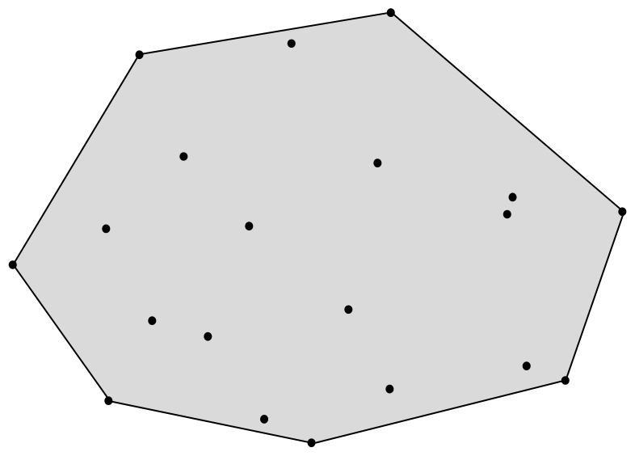

### Slide 184: Convex polygon (recall)

A polygon is **convex** iff for any two points in (interior \(\cup\) boundary), the segment joining them stays in the polygon.

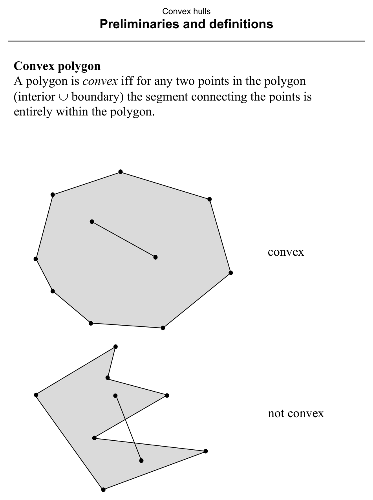

### Slide 185: Convex vs. reflex vertices

A vertex is **convex** if interior angle \(\le \pi\); **reflex** if \(> \pi\). Every vertex of a convex polygon is convex; a reflex vertex implies the polygon is **not** convex.

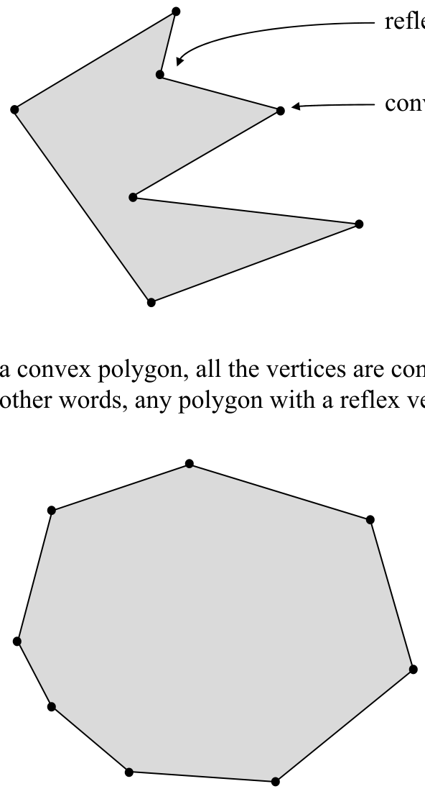

### Slide 186: Line parametrization (review)

Line through \(p_0, p_1\):

\[
\{\alpha p_0 + (1-\alpha)p_1 : \alpha \in \mathbb{R}\}.
\]

For \(0 \le \alpha \le 1\) we get the **segment** between \(p_0\) and \(p_1\).

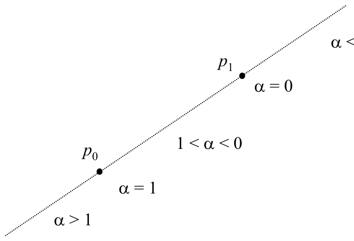

### Slide 187: Convex combination

A **convex combination** of points \(p_1,\ldots,p_k\) is

\[
\sum_{i=1}^k \alpha_i p_i
\quad\text{with}\quad
\alpha_i \ge 0,\;\; \sum_{i=1}^k \alpha_i = 1.
\]

- \(k=2\): segment between endpoints (not the whole **line** — why?).  
- \(k=3\): filled triangle.  
- \(k=4\) in 3D: tetrahedron.  
These objects are convex. A convex set contains all convex combinations of its points.

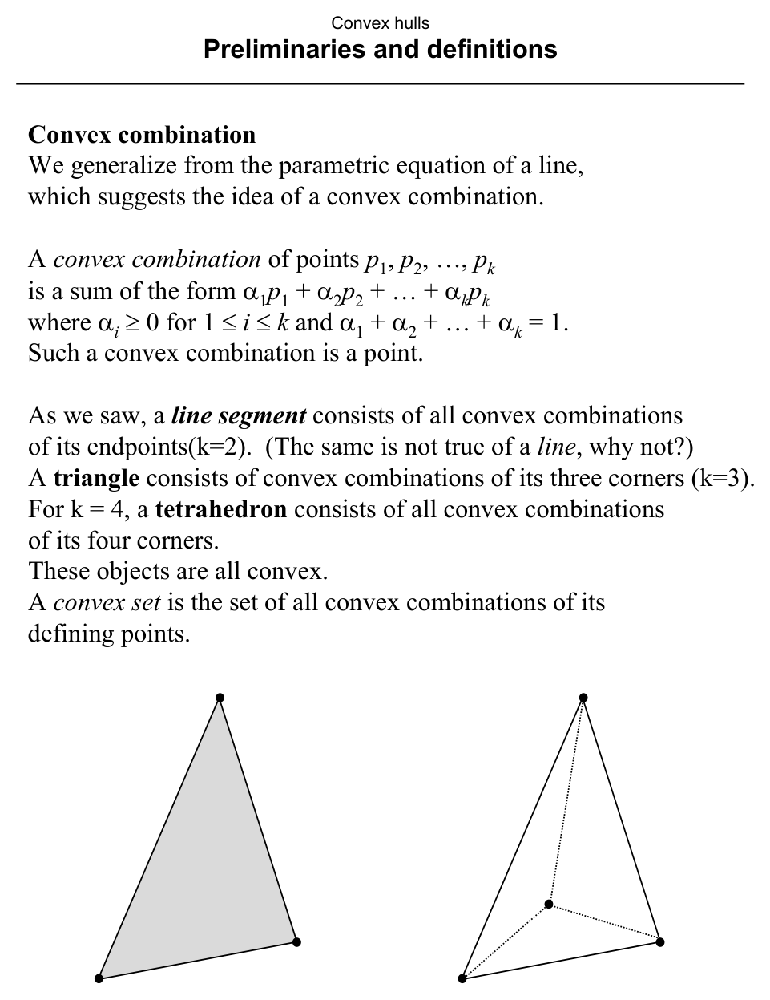

### Slide 188: Definition 4 — all convex combinations

\(H(S)\) = set of **all** convex combinations of points in \(S\). Intuitively, no “dents” (no reflex vertices on the boundary).

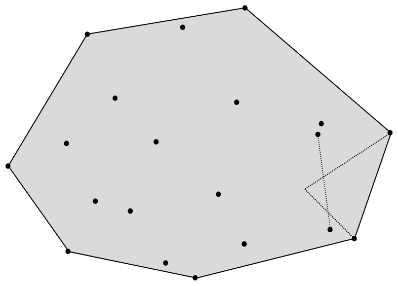

### Slide 189: Definition 5 — Carathéodory-style

\(H(S)\) in \(d\) dimensions = all convex combinations of **at most \(d+1\)** points of \(S\). For \(d=2\), every point in the hull lies in some triangle spanned by three points of \(S\).

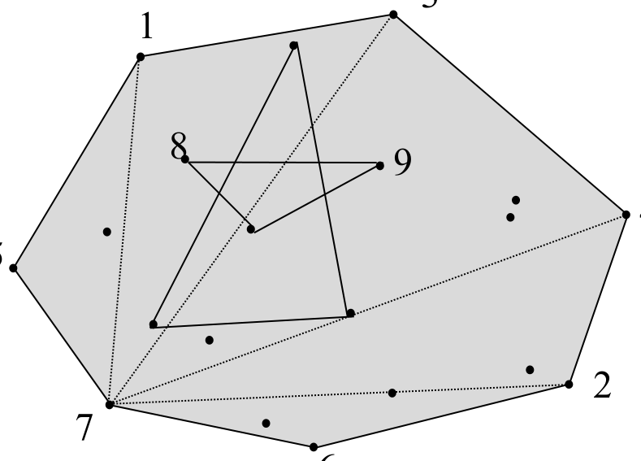

### Slide 190: Definition 6 — intersection of convex supersets

\(H(S)\) = intersection of **all convex sets** containing \(S\).

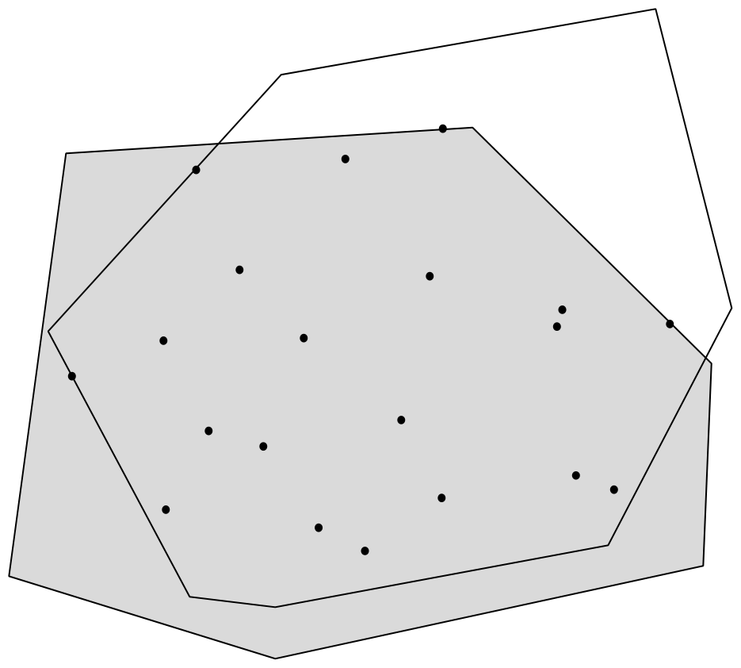

### Slide 191: Definition 7 — halfspaces

\(H(S)\) = intersection of all **closed halfspaces** (halfplanes when \(d=2\)) that contain \(S\).

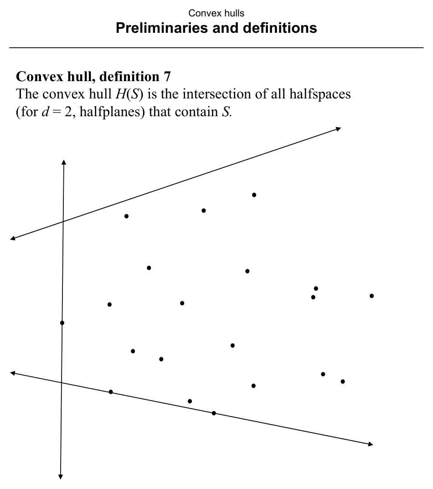

### Slide 192: Definition 8 — smallest enclosing polygon

\(H(S)\) is the **smallest** convex polygon \(P\) containing \(S\): there is no other convex polygon \(P'\) with \(P \supset P' \supseteq S\) (proper containment).

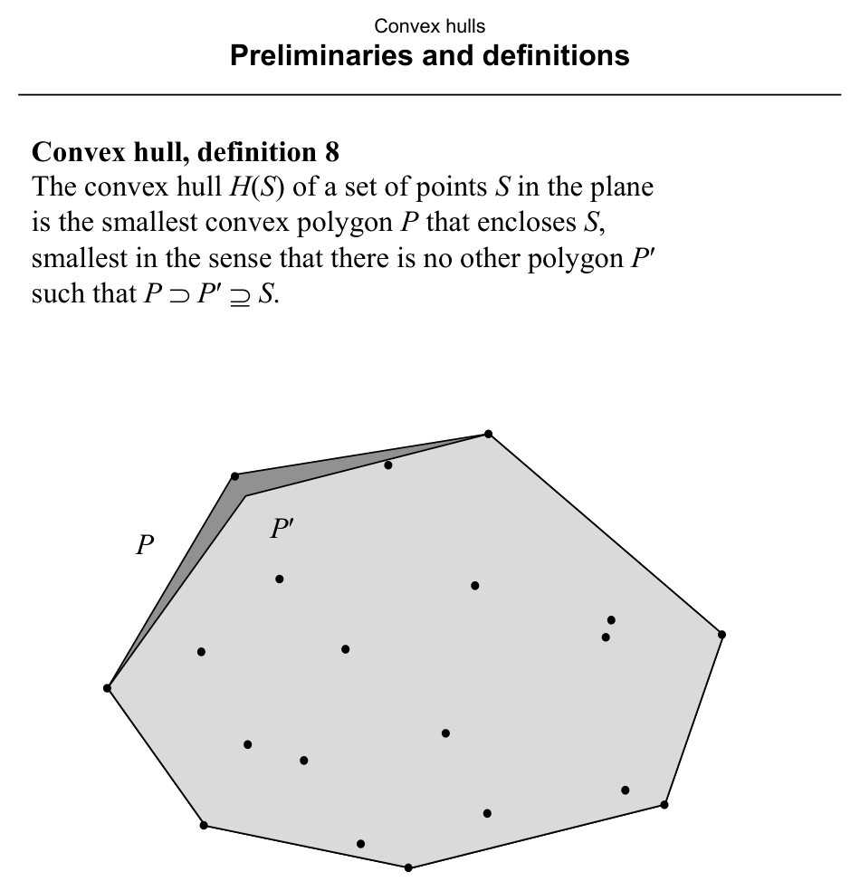

### Slide 193: Definitions 9–10 and extreme points

- **Definition 9:** \(H(S)\) is the enclosing convex polygon of **minimum area**.  
- **Definition 10:** … of **minimum perimeter**.

**Extreme points \(E\):** \(p \in S\) is **extreme** for convex set \(S\) if it is **not** strictly between two other points of \(S\) on a segment (equivalently, standard extreme-point definitions for polytopes). In the slide’s example, vertices \(1,\ldots,7\) are extreme; interior/near-boundary points like \(8,9\) are not.

The **ordered** hull boundary (e.g. \((1,3,4,2,6,7,5)\)) is a **different** output than merely listing extreme points — two distinct computational problems.

### Slide 194: Definition 11 — union of triangles

\(H(S)\) = union of all triangles with vertices in \(S\) (restatement of the \(d+1\) point idea in the plane). Many such triangles are omitted in the figure.

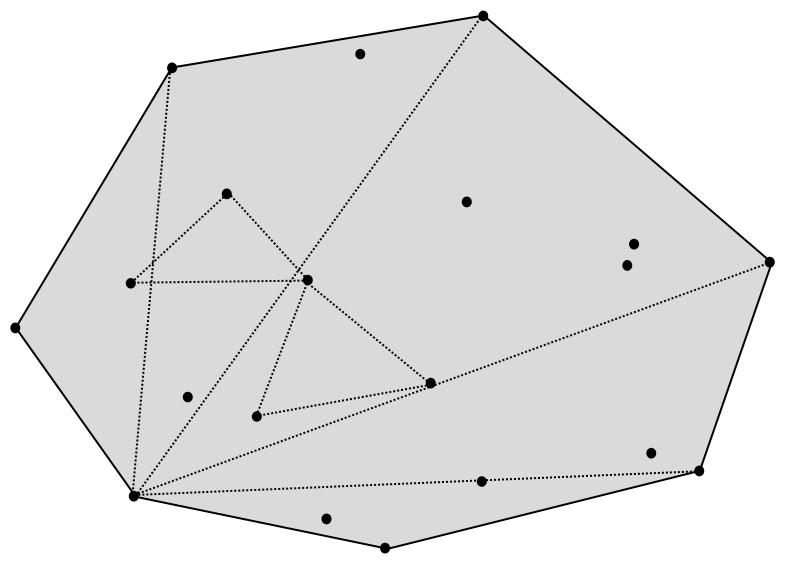

### Slide 195: Formal problem statements

**CONVEX HULL**

- **INSTANCE:** \(S = \{p_1,\ldots,p_N\} \subset \mathbb{R}^d\).  
- **QUESTION:** Construct \(H(S)\): **vertices in cyclic order** along the boundary (for \(d=2\), a convex polygon).

**EXTREME POINTS**

- **INSTANCE:** Same \(S\).  
- **QUESTION:** Which points of \(S\) are vertices of \(H(S)\)? (**Order** not required.)

Assume \(d=2\) unless stated. Both problems have \(\Theta(N\log N)\) complexity in the plane — extreme points are **not** asymptotically easier than full hull construction.

### Slide 196: Problem transformations

To prove **lower bounds** on a **problem** (all algorithms), one tool is **reduction**: problem \(A\) **\(\tau(N)\)-transforms** to \(B\) if any instance of \(A\) can be solved by (1) converting to an instance of \(B\) in \(O(\tau(N))\), (2) solving \(B\), (3) converting the answer back in \(O(\tau(N))\) total for steps 1+3. Write \(A \propto_{\tau(N)} B\). Transformability need not be symmetric; mutual reductions yield **equivalence**.

### Slide 197: Consequences of reductions

If instance size order is preserved:

1. **Lower bound:** If \(A\) needs \(\Omega(T(N))\) time and \(A \propto_{\tau(N)} B\), then \(B\) needs \(\Omega(T(N) - O(\tau(N)))\).  
2. **Upper bound:** If \(B\) is solvable in \(O(T(N))\) and \(A \propto_{\tau(N)} B\), then \(A\) is solvable in \(O(T(N) + \tau(N))\).

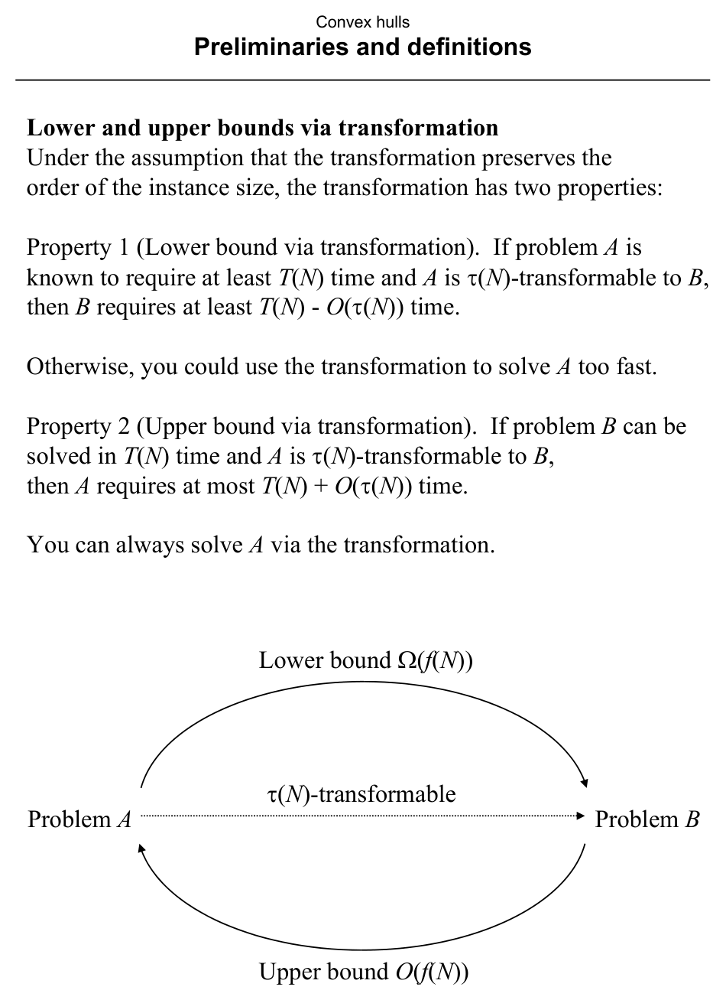

### Slide 198: SORTING as a benchmark

Reduction arguments need a problem with a **known** lower bound — e.g. **SORTING** requires \(\Omega(N\log N)\) comparisons in the usual model.

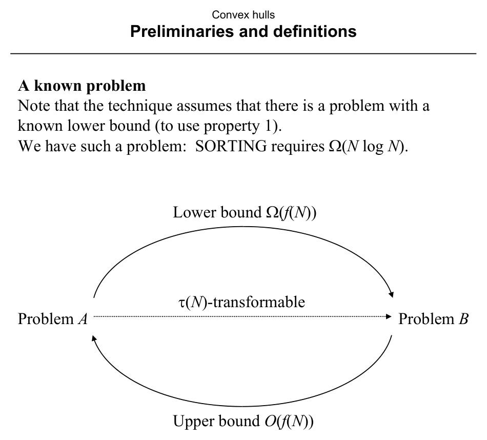

### Slide 199: SORTING \(\propto_{O(N)}\) CONVEX HULL

**Theorem:** SORTING is **linear-time** reducible to CONVEX HULL: SORTING \(\propto_{O(N)}\) CONVEX HULL. Hence CONVEX HULL needs \(\Omega(N\log N)\) time.

**Proof idea:** Given numbers \(\{x_1,\ldots,x_N\}\), map \(x_i \mapsto (x_i, x_i^2)\) in **\(O(N)\)**. All lifted points lie on the parabola \(y = x^2\).

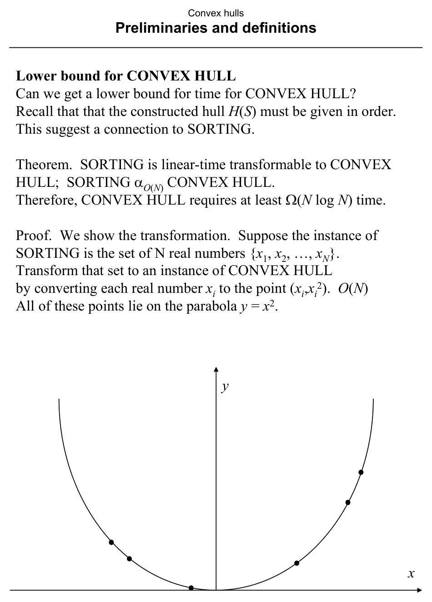

### Slide 200: Extracting the sorted order

The convex hull of the lifted points, listed in boundary order, yields points sorted by **abscissa**; scanning in \(O(N)\) recovers the sorted \(x_i\). So sorting would be too easy if hull were faster than \(N\log N\).

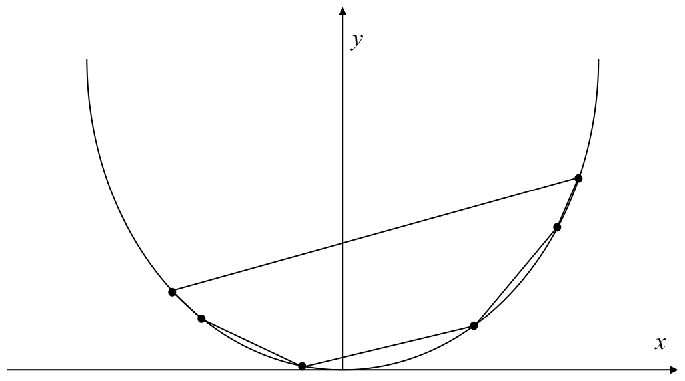

### Slide 201: Conclusion

The \(O(N)\) reduction cost is dominated by the \(\Omega(N\log N)\) bound. Thus CONVEX HULL requires **at least** \(\Omega(N\log N)\) time; an \(O(N\log N)\) hull algorithm is **asymptotically optimal** in this sense.

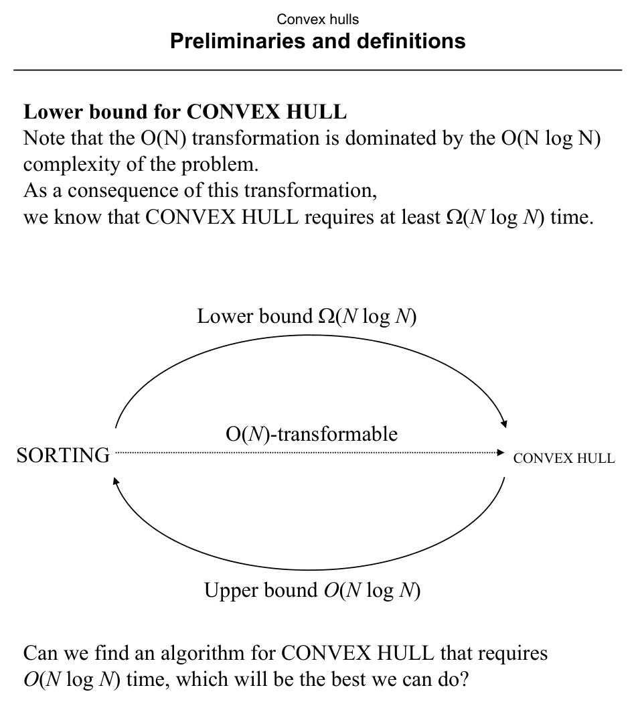

## Recap

- The **convex hull** \(H(S)\) can be defined equivalently as: smallest enclosing convex polygon, intersection of halfplanes or convex supersets, all **convex combinations** of points in \(S\), or (in the plane) union of triangles spanned by points of \(S\).
- **Extreme points** are exactly the vertices of \(H(S)\); listing them **unordered** is a different output than the **cyclic vertex sequence** of \(\partial H(S)\).
- **Problem reduction:** if problem \(A\) \(\tau(N)\)-transforms to \(B\), lower bounds transfer (minus \(\tau\)) and upper bounds compose (plus \(\tau\)).
- **SORTING** \(\to\) **CONVEX HULL** by lifting \(x_i \mapsto (x_i, x_i^2)\) in **\(O(N)\)** proves any hull algorithm that outputs vertices in **\(x\)-order** needs **\(\Omega(N \log N)\)** time (hence optimal algorithms match **\(\Theta(N \log N)\)** in the usual models).
