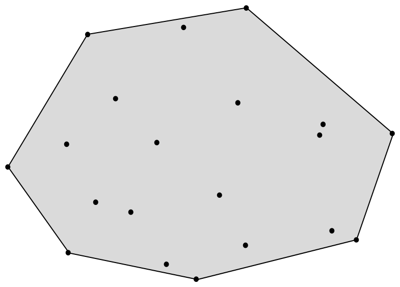
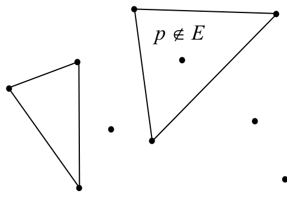
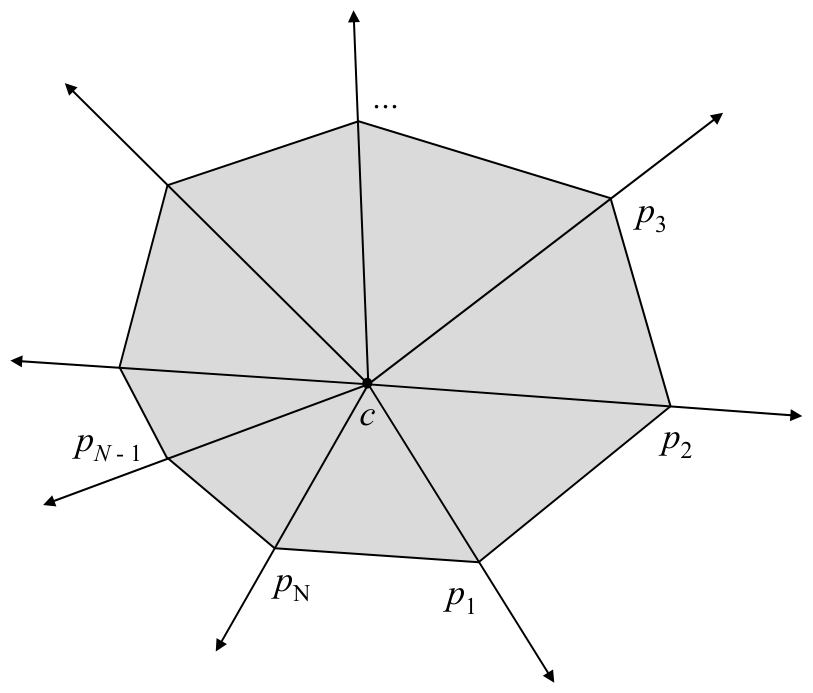

# Extreme Points Algorithm

**Slides covered:** 202-205  

**Topic folder:** 03 Convex Hulls

## Motivation

The extreme points algorithm is the straightforward idea: a point is a hull vertex if it is not inside any triangle formed by the others. It is conceptually simple and computationally painful, which sounds exactly like the kind of algorithm humans invent first.

## Lecture Roadmap

- Know the problem definition.
- Know the main geometric idea.
- Know the key data structure or primitive test.
- Know the preprocessing / query / storage or total running time.
- Know one small example by hand.

## Detailed lecture notes

### Slide 202: Extreme points

- A point p of a convex set S is an extreme point if no two points
- a, b ∈S exist such that p lies on the open segment ab.
- Extreme points and the convex hull
- The set E of extreme points of S (E ⊆S) is the smallest subset of S
- such that H(E) = H(S).
- E is the set of vertices of H(S).
- This suggests an algorithm for CONVEX HULL:
- 1.  Find the extreme points E of S.
- 2.  Order the points E so that they form a convex polygon.

### Slide 203: Determining if a point is an extreme point

- If we could determine whether a given point p ∈S was an extreme point in S, then we could find E by testing each point in S.
- Theorem.  A point p fails to be an extreme point of a plane convex
- set S iff it lies in some triangle whose vertices are in S but is not itself one of the vertices of the triangle.
- p ∈E p ∉E

### Slide 204: Determining if a point is an extreme point

- There are O(N3) triangles determined by the N points of S.
- Point enclosure in a triangle can be performed in O(1) time.
- To determine if p is an extreme point, test it for inclusion in each of the O(N3) triangles.
- If all fail, p ∈E.
- Doing so for each point p ∈S requires O(N4) time.
- (Determining extreme edges has O(N3 ) algorithm…see
- O’Rourke p.67) p ∈E p ∉E

### Slide 205: Ordering the vertices of the hull

- E has been found (in O(N4)) time.
- We already know that the vertices of a convex polygon occur in sorted order around any interior point.
- Find a point c interior to H(S) by computing the centroid of S.  O(N)
- For each point p ∈E, compute the polar angle from c to p.  O(N)
- Sort the points of E on polar angle.  O(N log N)
- Overall time complexity for this algorithm:  O(N4).
- pN p3 p1 p2 pN - 1
- ...
- c

## Recap

- Keep the formal problem statement precise.
- Focus on the geometric invariant used by the method.
- Remember the key complexity bound and when it applies.
