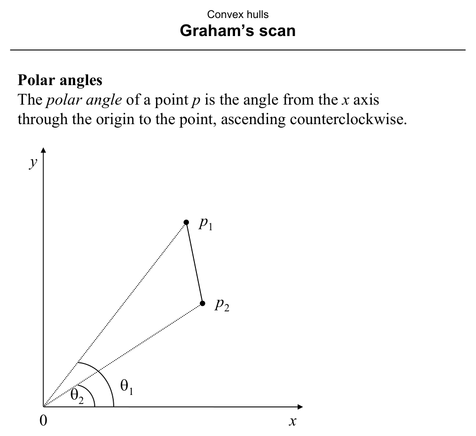
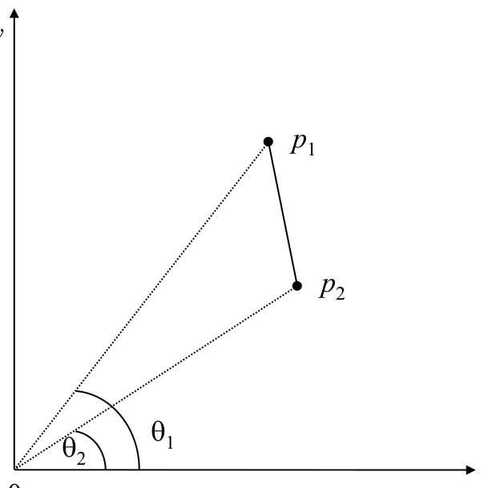
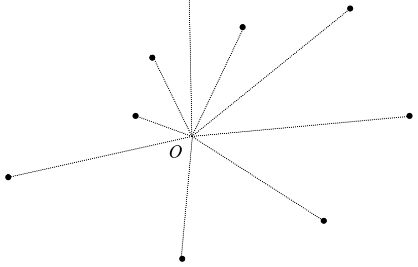
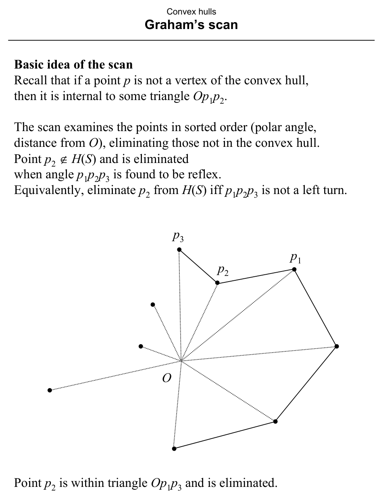
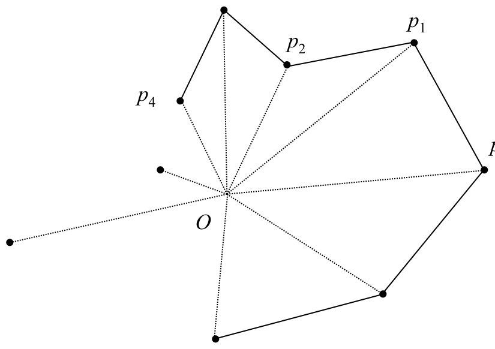
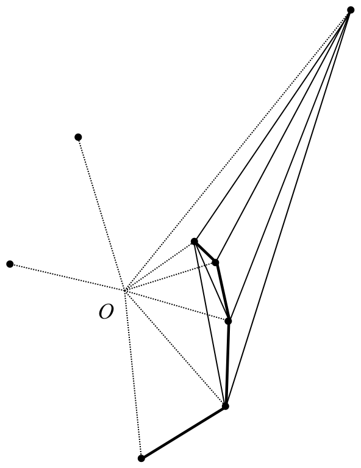
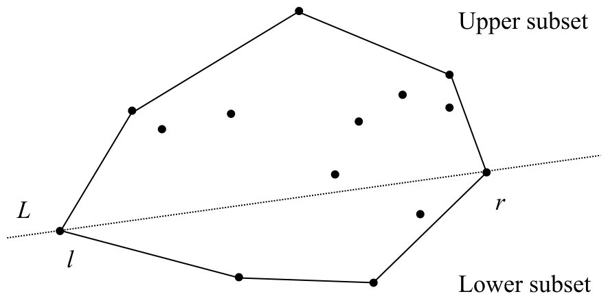
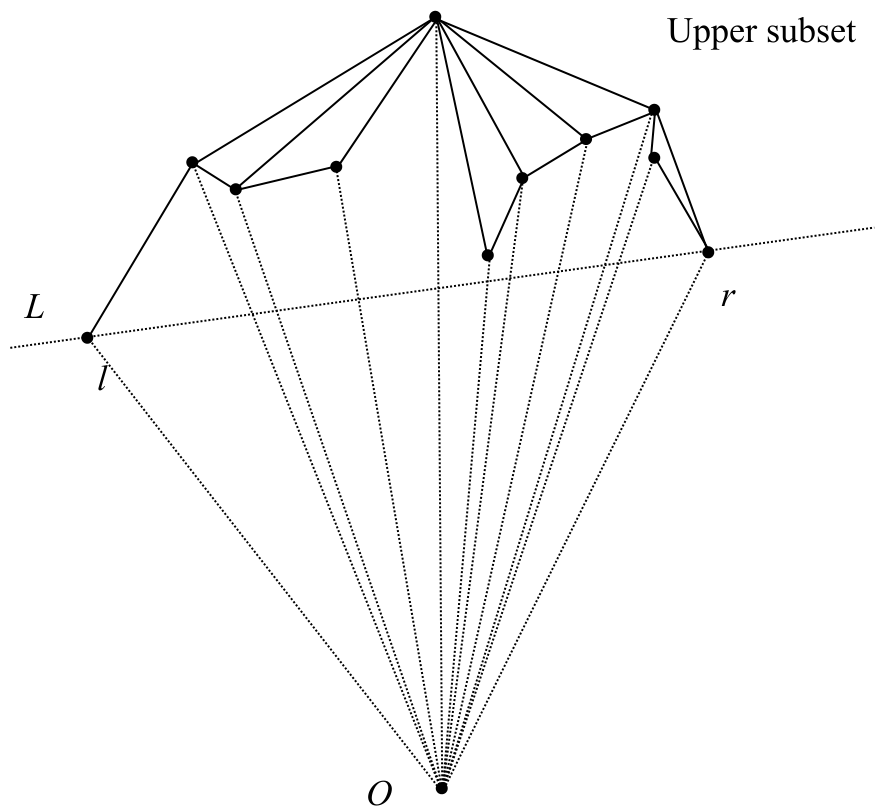
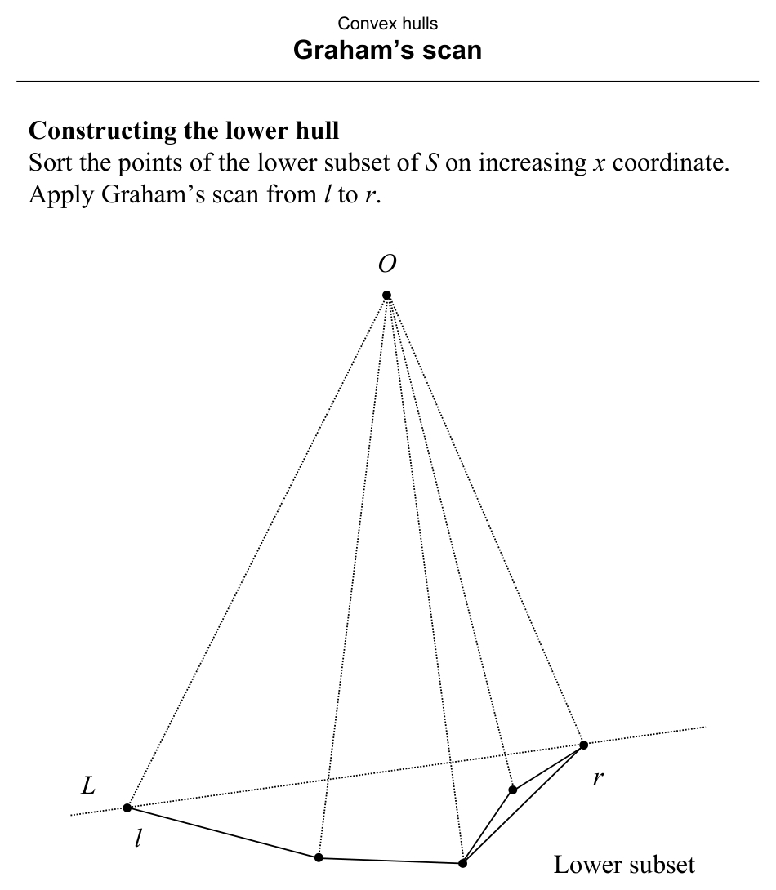

# Graham’s Scan

**Slides covered:** 206–219  

**Topic folder:** 03 Convex Hulls

## Motivation

Graham’s scan sorts points around a reference point and then removes right turns while scanning. It is one of the classic optimal planar convex hull algorithms.

## Lecture Roadmap

- Know the problem definition.
- Know the main geometric idea.
- Know the key data structure or primitive test.
- Know the preprocessing / query / storage or total running time.
- Know one small example by hand.

## Detailed lecture notes

### Slide 206: Concept

A point **inside** a triangle determined by three points of \(S\) cannot be a vertex of \(H(S)\). A naive approach tests **many** triangles per point.

**Graham’s scan** (1972) answers “is \(p\) inside some triangle of \(S\)?” more efficiently. **Idea:** if \(p\) is not a hull vertex, then \(p\) lies in some triangle \(O p_1 p_2\) with \(O\) interior and \(p_1,p_2\) hull vertices — the algorithm discovers this during a scan.

The algorithm has **preparation** and **scan** phases; it is a **single-shot** method (one hull for a given \(S\)).

### Slide 207: Centroid and lexicographic sort

The **centroid** of points \(p_1,\ldots,p_N\) is their arithmetic mean \(\frac{1}{N}\sum_i p_i\) (coordinate-wise).

**Lexicographic sort** — Sort objects by a primary key; ties broken by secondary key, then tertiary, etc. (e.g. English words: “farther / faster / fastest / father”).

### Slide 208: Polar angles

The **polar angle** of point \(p\) is the angle from the \(x\)-axis through the origin to \(p\), measured counterclockwise.



### Slide 209: Comparing polar angles without trig

For two points \(p_1, p_2\), point \(p_2\) has **smaller** polar angle than \(p_1\) iff triangle \(0\, p_2\, p_1\) has **positive** signed area:

\[
\text{Area}(\triangle 0 p_2 p_1)
= \frac{1}{2}\bigl(x_0 y_1 + x_2 y_0 + x_1 y_2 - x_2 y_1 - x_0 y_2 - x_1 y_0\bigr)
\]

(with origin as \(p_0=(0,0)\) in the usual embedding) — equivalently a **left-turn** test. So polar order is compared using **orientation**, not \(\arctan\).



### Slide 210: Preparation

1. Find \(O\) **strictly inside** \(H(S)\) (e.g. centroid of \(S\)) — **\(O(N)\)**.  
2. Translate so \(O\) is the origin — **\(O(N)\)**.  
3. Sort the \(N\) points **lexicographically** by (polar angle, then distance from \(O\)) — **\(O(N \log N)\)**.  
4. Build a **doubly-linked circular list** of sorted points — **\(O(N)\)**.



### Slide 211: Scan idea

Points are examined in sorted order. A point \(p_2\) **not** on \(H(S)\) lies inside some triangle \(O p_1 p_3\) and is removed when the turn \(\angle p_1 p_2 p_3\) is **reflex** — equivalently, eliminate \(p_2\) iff \(p_1 p_2 p_3\) is **not** a left turn. Collinear middle points are eliminated as non-extreme.



### Slide 212: Informal scan

Start at **START** = rightmost point of **minimum** \(y\) (a hull vertex). Repeatedly examine consecutive triples \(p_1,p_2,p_3\):

- If **right turn**, delete \(p_2\) and **backtrack** to test \(p_0,p_1,p_3\).  
- If **left turn**, advance.  
- **Collinear:** eliminate \(p_2\).

Scan ends when it wraps to **START** again. **START** is never deleted; backtracking does not go past START’s predecessor.



### Slide 213: Backtracking

Multiple backtracks in a row may delete a chain of points. Backtracking always terminates at START. No point is deleted more than once.



### Slide 214: Algorithm (Preparata, p. 108)

1. Find interior point \(O\).  
2. With \(O\) as origin, sort \(S\) lexicographically by (polar angle, distance from \(O\)). Build a circular doubly-linked list with pointers `NEXT`, `PRED`, and pointer `START`.

**Scan:**

```
v ← START
w ← PRED[v]          /* point just before START */
f ← false            /* true once we've wrapped */
while NEXT[v] ≠ START or f = false do
  if NEXT[v] = w then f ← true endif
  if Left(v, NEXT[v], NEXT[NEXT[v]]) then
    v ← NEXT[v]      /* advance */
  else
    delete NEXT[v]   /* O(1) list delete */
    v ← PRED[v]      /* backtrack */
  endif
endwhile
```

Here `Left(·,·,·)` is the left-turn (orientation) primitive.

### Slide 215: Analysis

- **Time:** **\(O(N \log N)\)** — dominated by sorting; the scan is **\(O(N)\)** (each step advances or backtracks; at most \(O(N)\) advances and \(O(N)\) backtracks).  
- **Space:** **\(O(N)\)** for the list.

### Slide 216: Upper and lower hulls

Split \(S\) by the line through points \(\ell\) and \(r\) with **min** and **max** \(x\)-coordinate. The line partitions remaining points into **upper** and **lower** subsets (each includes \(\ell,r\)). Each subset forms an \(x\)-**monotone** chain; concatenating lower and upper chains yields \(H(S)\).



### Slide 217: Upper hull

Sort the **upper** subset by **decreasing** \(x\). Apply Graham scan from \(r\) to \(\ell\). This matches the general method with reference “at \((0,-\infty)\)” so decreasing \(x\) corresponds to increasing polar angle.

*(Text p. 109 erratum: says “increasing” but should be decreasing.)*



### Slide 218: Lower hull

Sort the **lower** subset by **increasing** \(x\). Graham scan from \(\ell\) to \(r\).



### Slide 219: Summary

- **\(O(N \log N)\)** is worst-case optimal for the planar hull in the algebraic decision-tree model tied to sorting.  
- Further algorithms are still useful for: expected-case behavior, **\(d>2\)**, **dynamic** settings, **parallel** structure, and additional insights.

## Recap

- **Preparation:** interior point \(O\) (often centroid), sort by **(polar angle, distance)** from \(O\), doubly-linked cyclic list; **polar order** compared via **orientation**, not trig.
- **Scan:** walk the sorted cycle; on a **non-left** turn at \(p_1,p_2,p_3\), delete \(p_2\) and **backtrack**; only **\(O(N)\)** advances/backtracks total after **\(O(N \log N)\)** sort.
- **Overall:** **\(O(N \log N)\)** time, **\(O(N)\)** space; **upper/lower hull** variant splits by min/max \(x\) and sorts along monotone chains.
- **Why more algorithms later:** expected case, **\(d>2\)**, dynamic updates, and parallel structure differ from this static planar scan.
