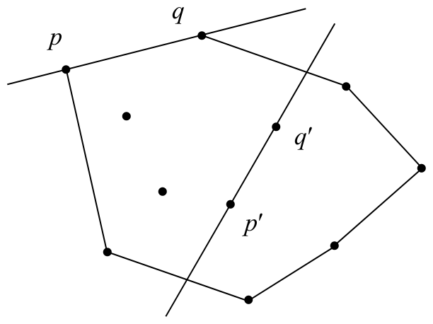
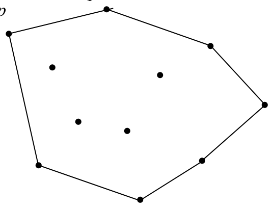
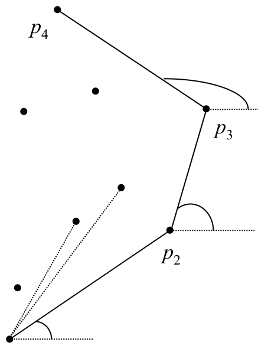
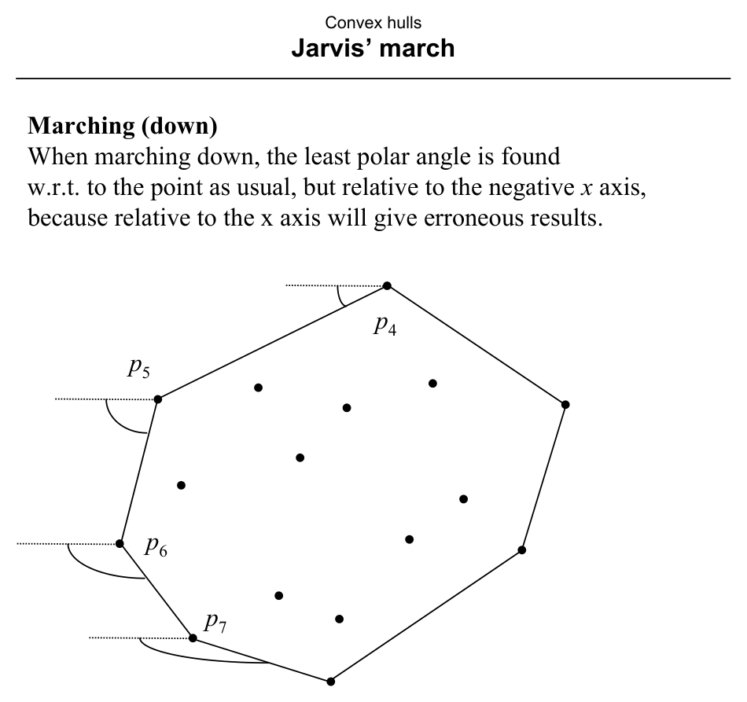

# Jarvis’ March

**Slides covered:** 220–224  

**Topic folder:** 03 Convex Hulls

## Fast take

- Jarvis march wraps the hull one edge at a time by selecting the next extreme point.
- Its running time is **O(Nh)**, where **h** is the number of hull vertices.
- So it is **output-sensitive** and can beat sort-based methods when **h** is small.
- The method finds hull edges directly instead of sorting all points first.

## Recording notes

**Recording references:** `CS 564 - 02.27 11.1.txt`

- The lecture sold Jarvis march mainly on output sensitivity: if the hull is tiny, this method can be quite appealing.
- The gift-wrapping picture is not just a cute name. It is the correct geometric intuition for the edge-by-edge construction.
- Compared with Graham scan, Jarvis march spends work only on the hull it actually reveals.
- It is still static and can be slow when many points lie on the hull.

## Motivation

Jarvis’ march, also called gift wrapping in 2D, walks from one hull vertex to the next by always choosing the most counterclockwise candidate. It is output-sensitive because its time depends on the number of hull vertices.

## Lecture Roadmap

- Know the problem definition.
- Know the main geometric idea.
- Know the key data structure or primitive test.
- Know the preprocessing / query / storage or total running time.
- Know one small example by hand.

## Detailed lecture notes

### Slide 220: Edges vs. Graham’s vertex view

Graham’s scan identifies **vertices** (with possible backtracking). Jarvis’ march finds **edges** of \(H(S)\).

**Theorem:** Segment \(\overline{pq}\) between two points of \(S\) is a **hull edge** iff **all** other points of \(S\) lie in the **closed halfplane** bounded by the line through \(p\) and \(q\) on one side of that line (collinearity allowed on the line).

### Slide 221: Naive \(O(N^3)\) edge finding

There are \(O(N^2)\) candidate lines from point pairs. For each, test the other \(N-2\) points with **point–line classification** — \(O(N)\) per line → **\(O(N^3)\)** to list all hull edges, then **\(O(N)\)** to order them around the hull.

**Improvement:** Once a hull edge \(pq\) is known, the next edge must **start** at \(q\). Reusing this cuts the worst-case work to **\(O(N^2)\)** (slide).

### Slide 222: Marching “up” the hull

Let \(p_1\) be the **rightmost lowest** point (minimum \(y\), then maximum \(x\)); \(p_1 \in H(S)\).

The next hull vertex \(p_2\) is the point of \(S\) with **smallest polar angle** \(\ge 0\) measured from the **positive \(x\)-axis** at \(p_1\). Similarly, \(p_3\) minimizes polar angle at \(p_2\), etc.

Each new vertex costs **\(O(N)\)** by scanning all of \(S\) (compare angles via **orientation** / cross products — no trig). This builds the hull from \(p_1\) “upward” along the boundary.

*(Slide notes a figure error in Preparata Fig. 3.9, p. 111.)*

### Slide 223: Marching “down”

On the other chain, measure polar angles relative to the **negative \(x\)-axis** (not the positive one) so comparisons stay consistent.

### Slide 224: Analysis

- **Worst-case time:** \(O(N^2)\) — at most \(N\) hull vertices, each step \(O(N)\).  
- **Storage:** \(O(N)\).

Let \(h = |H(S) \cap S|\) be the number of hull vertices. Actual work is **\(O(hN)\)** left/right tests. When \(h \ll N\), **\(O(hN)\)** beats Graham’s **\(O(N\log N)\)** when e.g. \(h < \log N\). If \(h = O(1)\), time is **linear** in \(N\).

**Intuition:** repeatedly “wrapping” with turning angles; generalizes to **gift wrapping** in \(d > 2\).

## Recap

- Segment \(\overline{pq}\) is a **hull edge** iff all other points lie in one closed halfplane bounded by line \(pq\).
- **Naive:** \(O(N^3)\) edge tests; **marching** reuses the last vertex to avoid re-scanning all pairs → **\(O(N^2)\)** worst case.
- **Jarvis walk:** from the **rightmost lowest** point, repeatedly pick the next hull vertex by **minimum polar angle** at the current vertex (use **orientation** on the other chain); time **\(O(hN)\)** for \(h\) hull vertices.
- When **\(h \ll N\)**, **\(O(hN)\)** can beat **\(O(N \log N)\)** (e.g. \(h < \log N\)); this is the planar **gift-wrapping** idea before higher dimensions.
