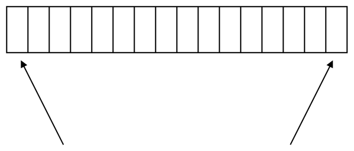
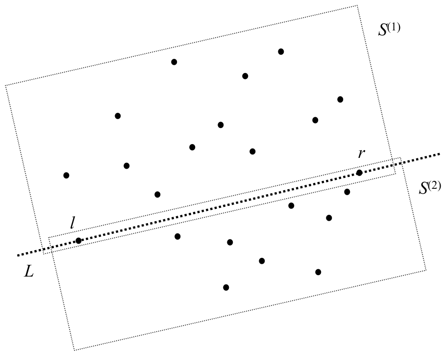
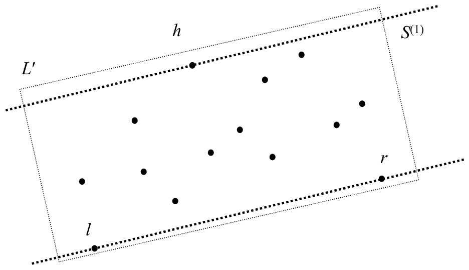
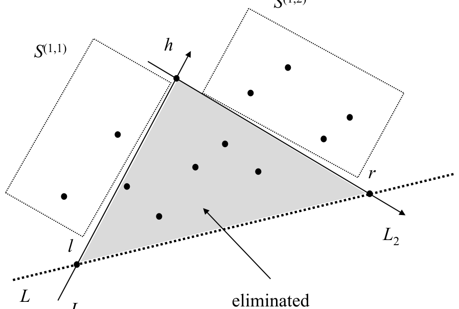
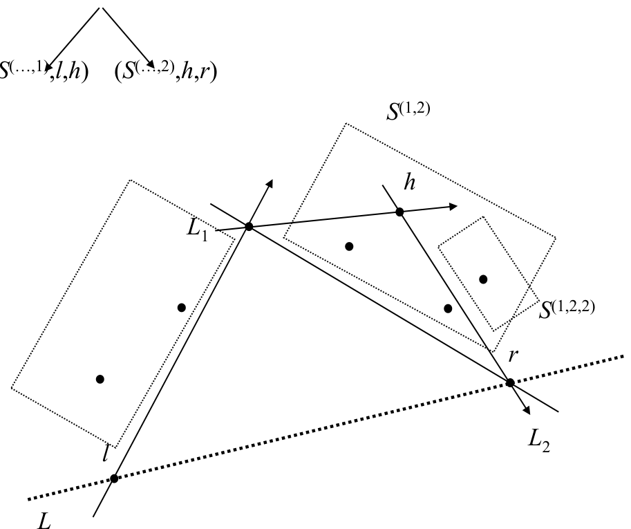
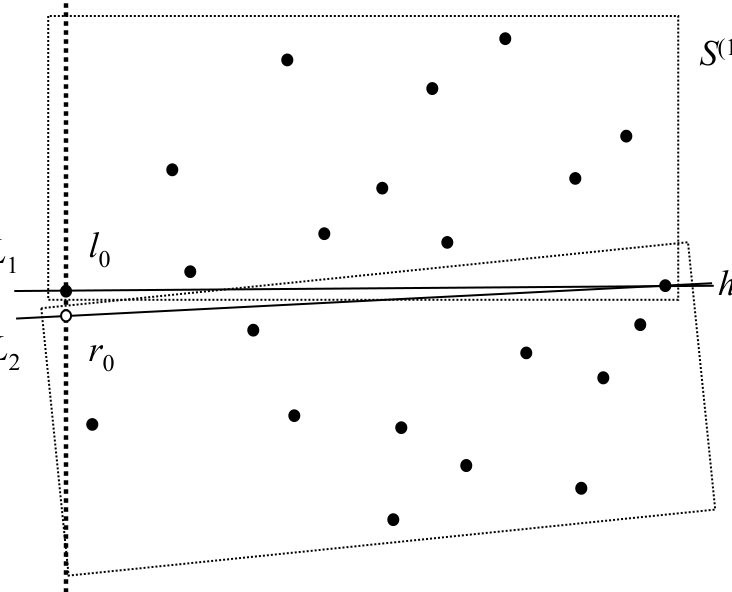

# Quickhull

**Slides covered:** 225-234  

**Topic folder:** 03 Convex Hulls

## Motivation

Quickhull copies the divide-and-prune spirit of Quicksort. It splits the point set by a line through extreme points and recurses on the outside subsets.

## Lecture Roadmap

- Know the problem definition.
- Know the main geometric idea.
- Know the key data structure or primitive test.
- Know the preprocessing / query / storage or total running time.
- Know one small example by hand.

## Detailed lecture notes

### Slide 225: Quicksort

- The Quickhull algorithm is based on the Quicksort algorithm.
- Recall how quicksort operates:  at each level of recursion, an array of numbers to be sorted is partitioned into two subarrays,
- such that each term of the first (left) subarray is not larger
- than each term of the second (right) subarray.
- LEFT
- RIGHT
- Two pointers to the array cells (LEFT and RIGHT) initially point to the opposite extreme ends of the array. We
- select a pivot element (first, last or median of first, last and
- middle elements). LEFT and RIGHT move towards each other, one cell at a time. At any given time, one pointer is moving and
- one is not. If the numbers pointed to by LEFT and RIGHT violate the desired sort order, they are swapped, then the moving
- pointer is halted and the halted pointer becomes the moving pointer. When the two pointers cross each other, we exchange
- the pivot with the element at the RIGHT pointer, the array is
- split at that cell and the process recurses on the subarrays.
- Quicksort runs in expected O(N log N) time, if the subarrays are well balanced,
- but can require as much as O(N2) time in the worst case.

### Slide 226: Quickhull overview

- Quickhull operates in a similar manner.
- It recursively partitions the point set S, so as to find the convex hull for each subset.
- The hull at each level of the recursion is formed by concatenating the hulls found at the next level down.
- S

### Slide 227: Initial partition

- The initial partition of S is determined by a line L through the points l, r ∈S with the smallest and largest abscissa.
- S(1) ⊆S is the subset of S on or above L.
- S(2) ⊆S is the subset of S on or below L.
- Note that {S(1), S(2)} is not a partition of S, as S(1) ∩S(2) ⊇{l,r}.  This is not a difficulty.
- The idea now is to construct hulls H(S(1)) and H(S(2)), then concatenate them to get H(S).
- The process is the same for S(1) and S(2), we consider S(1).
- l r
- L
- S(1)
- S(2)

### Slide 228: Finding the “apex”

- Find the point h ∈S(1) such that
- (1) triangle hlr has the maximum area of all triangles {plr : p ∈S(1)},
- and if there are > 1 triangles with maximum area,
- (2) the one where angle hlr is maximum.
- This condition ensures that h ∈H(S).  Why?
- Construct a line parallel to line L through h, call it L′.
- There will be no points of S(1) (or S) above L′, by condition (1).
- There may be other points on L′, but h will be the leftmost,
- by condition (2), hence it is not a convex combination of any two points of S.
- ⇒h ∈H(S).
- “Apex” h can be found in O(N) time by checking each point of S(1).
- l r
- L
- S(1)
- L′ h

### Slide 229: Partitioning the point set

- Construct two directed lines, L1 from l to h, and L2 from h to r.
- Each point of S(1) is classified relative to L1 and L2
- (e.g., point-line classification).
- No point can be to the left of both L1 and L2.
- Points to the right of both are not in H(S), as they are within triangle hlr,
- and are eliminated from further consideration.
- Points left of L1 are S(1,1).
- Points left of L2 are S(1,2).
- l r
- L eliminated
- L1
- L2
- S(1,1)
- S(1,2) h

### Slide 230: Recursion

- The process recurses on S(1,1) and are S(1,2).
- (set, left endpoint, right endpoint)
- (S(…),l,r)
- (S(…,1),l,h)    (S(…,2),h,r)
- The recursion continues until S(…) has 0 points, i.e., all internal points have been eliminated,
- which implies that segment lr is an edge of H(S).
- L l r
- L1
- L2
- S(1,2,2) h
- S(1,2)

### Slide 231: Geometric primitives

- The geometric primitives used by this algorithm are:
- 1. Point-line classification
- 2. Area of a triangle
- Both of these require O(1) time.

### Slide 232: Initial partition, revisited

- The preceding explanation, while intuitive and thus useful, introduces an anomaly:  l, r are in both S(1) and S(2).
- This is a problem because l, r will end up in both hulls.
- To the avoid this, base the initial partition on l0 = (x0, y0),
- the point of S with smallest abscissa, and r0 = (x0, y0 - ε), where ε is an arbitrarily small constant.
- S
- L2
- L
- L1 h l0 r0
- S(1)
- S(2)

### Slide 233: General function

- S is assumed to have at least 2 elements
- (the recursion ends otherwise).
- FURTHEST(S, l, r) is a function, not given here, that finds the apex point h as previously defined.
- The operator || denotes list concatenation.
- Procedure QUICKHULL returns an ordered list of points.
- procedure QUICKHULL(S, l, r) begin if
- S = {l, r} then return (l, r)  /* lr is an edge of H(S) */ else
- h = FURTHEST(S, l, r)
- S(1) = p ∈S ∋p is on or left of line lh
- S(2) = p ∈S ∋p is on or left of line hr return QUICKHULL(S(1), l, h) ||
- (QUICKHULL(S(2), h, r) - h) end
- 11 end
- Initial call begin l0 = (x0, y0)  /* point of S with smallest abscissa */
- r0 = (x0, y0 - ε) result = QUICKHULL(S, l0, r0) - r0
- /* The point r0 is eliminated from the final list*/ end

### Slide 234: Analysis

- Worst case time:  O(N2)
- Expected time:  O(N log N)
- Storage:  O(N2)
- At each level of the recursion, partitioning S into S(1) and S(2)
- requires O(N) time.  If S(1) and S(2) were guaranteed to have
- a size equal to a fixed portion of S, and this held at each level,
- the worst case time would be O(N log N).
- However, those criteria do not apply;
- S(1) and S(2) may have size in O(N) (they are not balanced).
- Hence the worst case time is O(N2),
- O(N) at each of O(N) levels of recursion.
- The same applies to storage.

## Recap

- Keep the formal problem statement precise.
- Focus on the geometric invariant used by the method.
- Remember the key complexity bound and when it applies.
