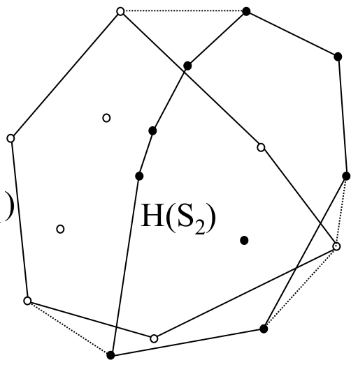
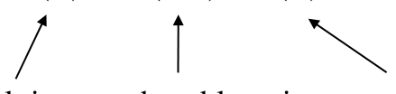
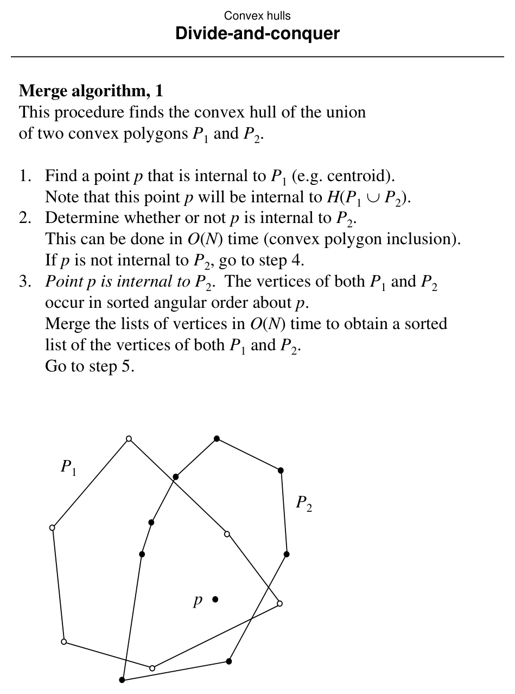
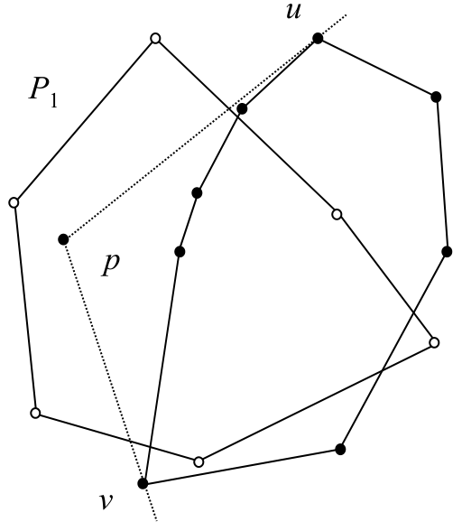
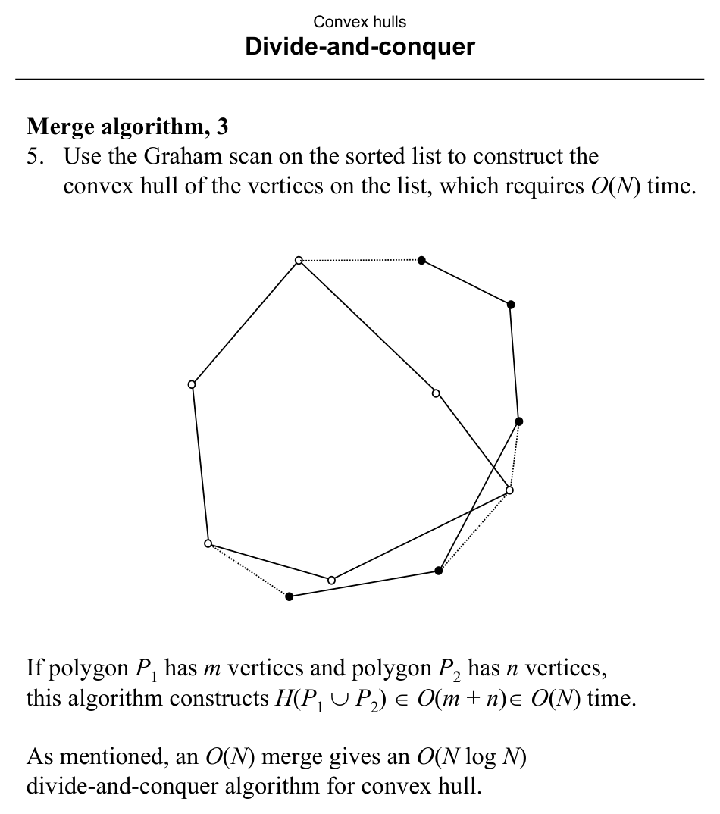
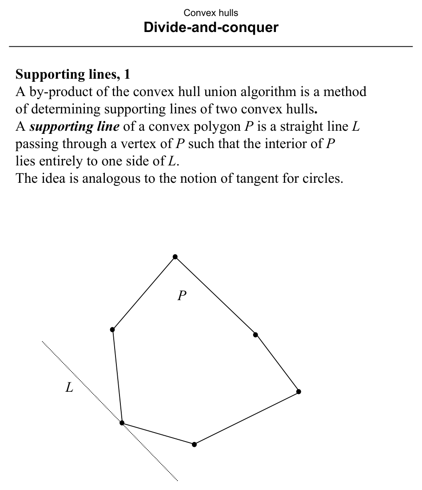
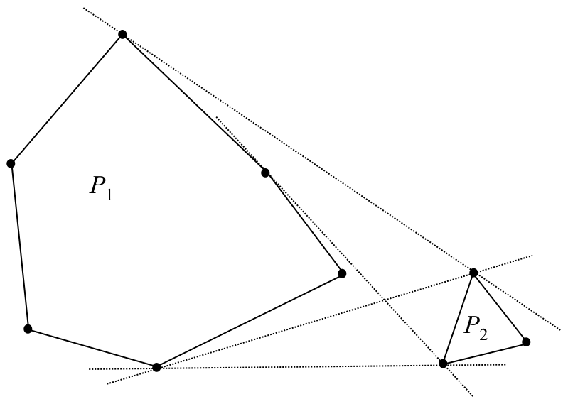
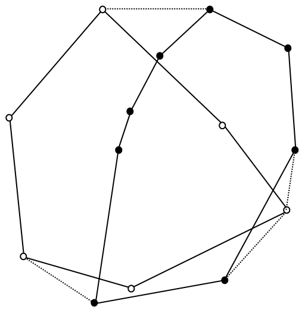

# Divide-and-Conquer Convex Hull

**Slides covered:** 235–244  

**Topic folder:** 03 Convex Hulls

## Motivation

This algorithm splits the points into left and right subsets, builds hulls recursively, and then merges the two hulls using upper and lower tangents.

## Lecture Roadmap

- Know the problem definition.
- Know the main geometric idea.
- Know the key data structure or primitive test.
- Know the preprocessing / query / storage or total running time.
- Know one small example by hand.

## Detailed lecture notes

### Slide 235: Design goal vs. Quickhull

**Quickhull** recurses by pruning subsets but does not guarantee **balanced** subproblem sizes → poor worst-case time.

Goals for divide-and-conquer:

- **Pros:** natural **parallelism**; merge by **concatenation**-style composition.  
- **Con:** unbalanced splits hurt worst-case performance.

We want a split into two subsets of **approximately equal size**.

### Slide 236: Reducing union to hulls of hulls

Partition \(S\) into \(S_1, S_2\) of roughly \(N/2\) points each. If we know \(H(S_1)\) and \(H(S_2)\), how hard is \(H(S_1 \cup S_2) = H(S)\)?

Key identity:

\[
H(S_1 \cup S_2) = H\bigl(H(S_1) \cup H(S_2)\bigr).
\]

The hull of a union equals the hull of the union of the two **subhulls** — \(H(S_1)\) and \(H(S_2)\) are **convex polygons** with cyclically ordered vertices.

### Slide 237: Merge subproblem

**HULL OF UNION OF CONVEX POLYGONS**

- **INSTANCE:** Convex polygons \(P_1, P_2\).  
- **QUESTION:** Find \(H(P_1 \cup P_2)\).

This **merge** step, in **\(O(N)\)** time, yields overall **\(O(N \log N)\)** with balanced recursion.

### Slide 238: Divide-and-conquer skeleton

1. If \(|S| \le k_0\) (small constant), build \(H(S)\) directly (e.g. \(k_0=3\) → triangle in \(O(1)\)).  
2. Else partition \(S\) into \(S_1,S_2\) of nearly equal size.  
3. Recursively compute \(H(S_1), H(S_2)\).  
4. Merge to \(H(S)\).

Let \(U(N)\) = time to merge two convex \(n\)-gons each with \(O(N)\) vertices, and \(T(N)\) = time for \(N\) points:

\[
T(N) \le 2\,T(N/2) + U(N).
\]

If \(U(N) \in O(N)\), then **\(T(N) \in O(N \log N)\)**. So we need an **\(O(N)\)** merge (convex polygon union / hull of union).

### Slide 239: Merge — case \(p \in P_2\)

**Input:** Convex polygons \(P_1, P_2\).

1. Pick \(p\) **inside** \(P_1\) (e.g. centroid). Then \(p \in H(P_1 \cup P_2)\).  
2. Test whether \(p \in P_2\) (**convex inclusion**) in **\(O(N)\)**.  
3. If **yes:** vertices of \(P_1\) and \(P_2\) appear in sorted **angular order** about \(p\). **Merge** the two vertex lists in **\(O(N)\)** like merging sorted arrays → sorted list of all vertices around \(p\). Go to step 5 (Graham scan on that list — slide 241).  
4. If **no:** go to slide 240.

### Slide 240: Merge — wedge when \(p \notin P_2\)

Relative to \(p\), polygon \(P_2\) lies in a wedge of apex angle \(\le \pi\). Vertices \(u,v\) delimiting the wedge are found in **\(O(N)\)** by one pass around \(P_2\). The two chains from \(u\) to \(v\) are monotone in polar angle about \(p\); discard the chain **bulging away** from \(p\) (its vertices are interior to \(H(P_1 \cup P_2)\)). The other chain of \(P_2\) plus all of \(P_1\) give two lists, total **\(O(N)\)** vertices, still sorted angularly about \(p\); merge in **\(O(N)\)**.

### Slide 241: Finish merge with Graham scan

5. Run **Graham’s scan** on the merged cyclic order in **\(O(N)\)** to produce \(H(P_1 \cup P_2)\).

If \(P_1\) has \(m\) vertices and \(P_2\) has \(n\) vertices, merge time is \(O(m+n) = O(N)\), hence overall hull time \(O(N \log N)\).

### Slide 242: Supporting lines

A **supporting line** of convex polygon \(P\) passes through a vertex and has **all of \(P\)** on one closed side (2D analog of a tangent to a circle).

### Slide 243: Common supporting lines of two polygons

Two disjoint-inclusion convex polygons \(P_1,P_2\) (neither contains the other) admit **common supporting lines** (tangents touching both). There are **at least 2** and **at most** \(2\min(m,n)\) (slide).

### Slide 244: Finding common supports from \(H(P_1 \cup P_2)\)

After constructing \(H(P_1 \cup P_2)\), scan its vertex cycle: each **consecutive** pair where one vertex comes from \(P_1\) and the other from \(P_2\) determines a **common supporting line**.

## Recap

- **Identity:** \(H(S_1 \cup S_2) = H(H(S_1) \cup H(S_2))\) — merge only needs the two **convex polygon** hulls.
- **Recurrence:** \(T(N) \le 2T(N/2) + U(N)\); an **\(O(N)\)** merge \(U(N)\) yields **\(O(N \log N)\)** total.
- **Merge:** interior point \(p\); either merge **angular orders** about \(p\) when \(p\) lies in both polygons, or split one polygon by a **wedge** and merge chains, then **Graham scan** in **\(O(N)\)**.
- **Supporting lines** of two disjoint convex polygons appear as edges of \(H(P_1 \cup P_2)\) and can be read off the merged hull boundary.
