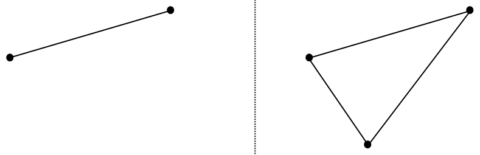
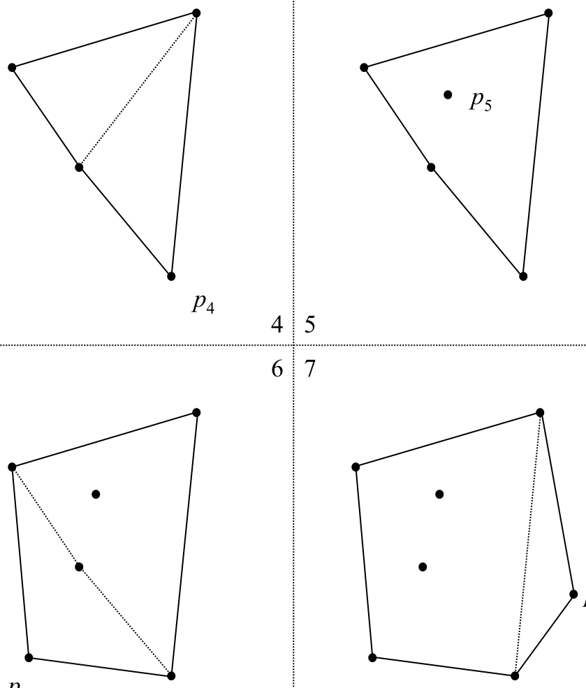
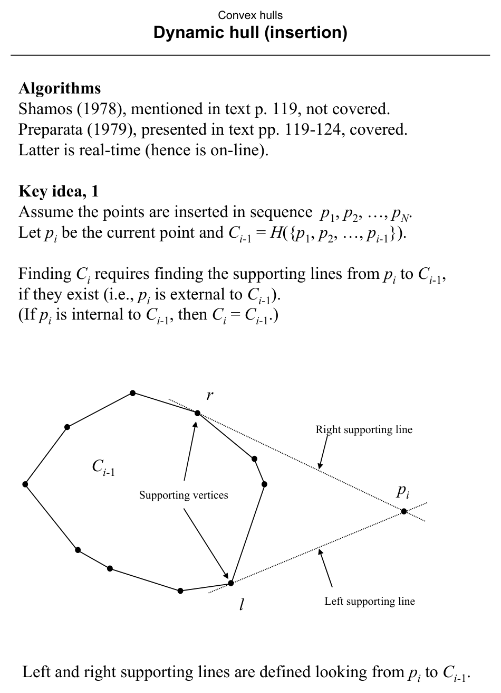
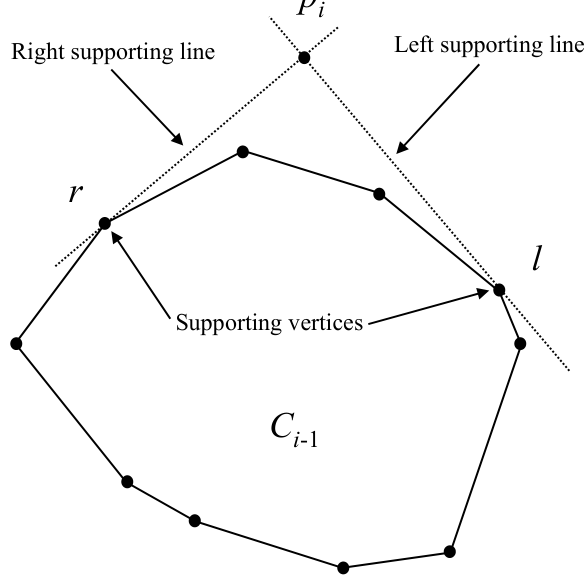
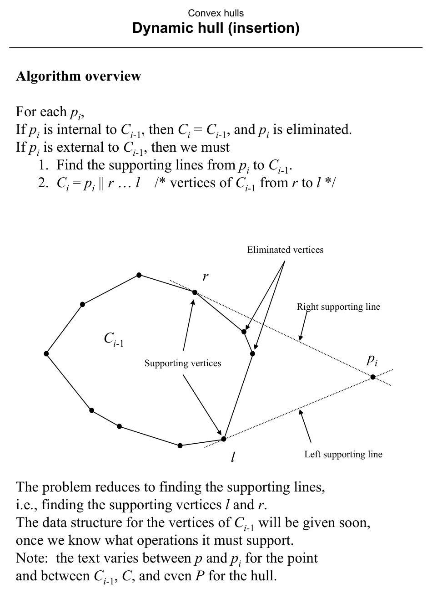
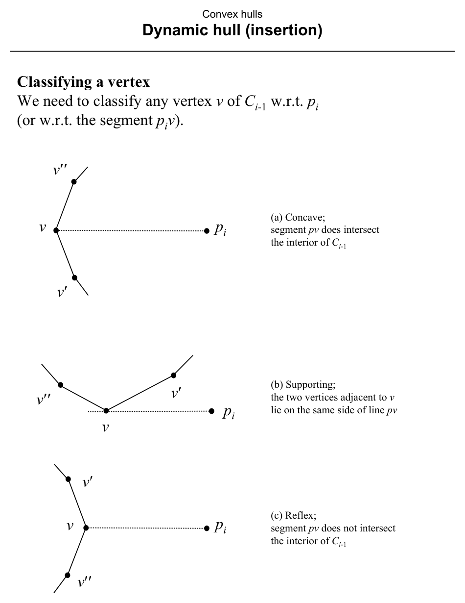
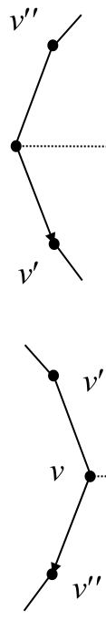
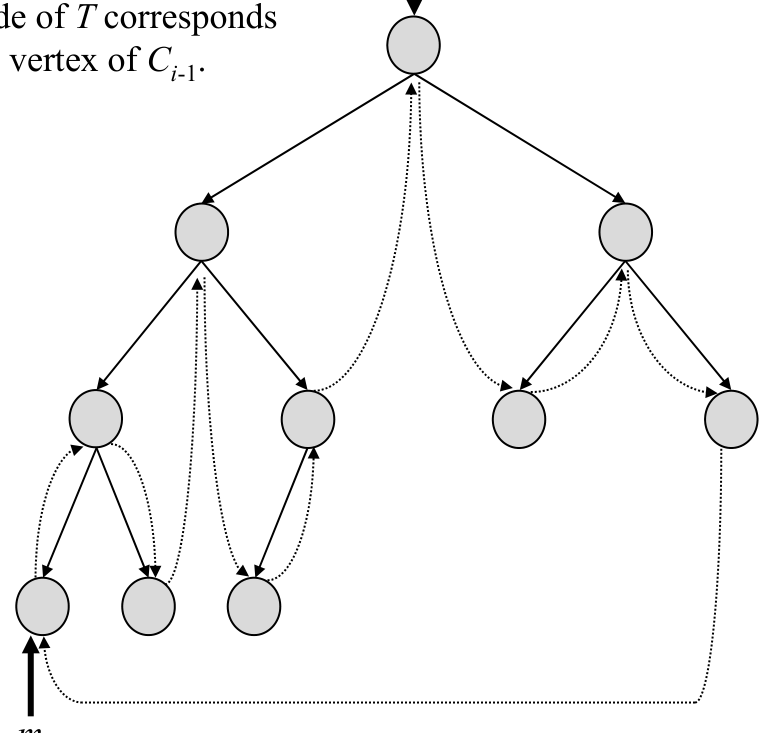
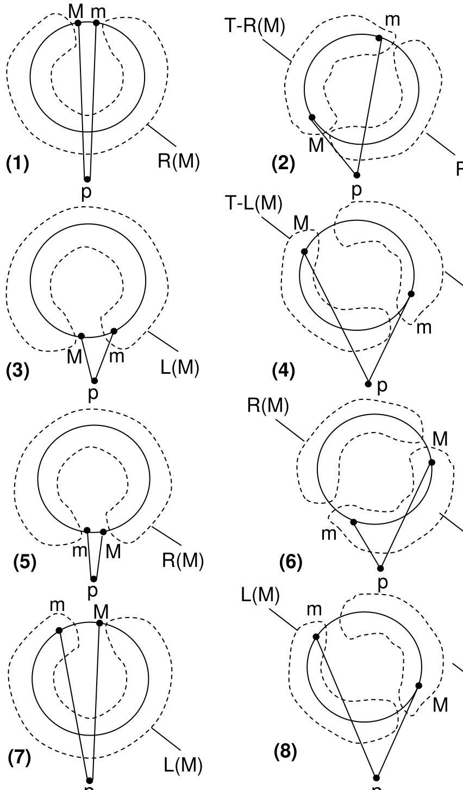
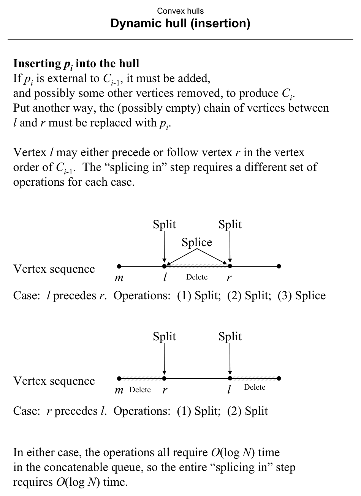

# Dynamic Hull Maintenance Under Insertion

**Slides covered:** 245–263  

**Topic folder:** 03 Convex Hulls

## Motivation

Here the hull is maintained as points arrive one by one. The key task is to find the two supporting vertices from the new point and update the stored hull efficiently.

## Lecture Roadmap

- Know the problem definition.
- Know the main geometric idea.
- Know the key data structure or primitive test.
- Know the preprocessing / query / storage or total running time.
- Know one small example by hand.

## Detailed lecture notes

### Slides 245–246: Dynamic hull under insertion

Maintain \(H(S)\) as points are added to \(S\).





### Slide 247: Terminology

| Term | Meaning |
|------|---------|
| **Static** | The object set is fixed between operations (e.g. between queries). |
| **Dynamic** | Insertions/deletions may occur; \(S\) lives in an updatable structure. |
| **On-line** | No lookahead — each operation must be handled as inputs arrive. |
| **Off-line** | All data available together (static or batched dynamic). |
| **Real-time** | Updates must finish within a fixed inter-arrival budget (often \(O(\log N)\)). |

### Slide 248: Problem statements

**ON-LINE CONVEX HULL**  
**INSTANCE:** Sequence \(p_1,\ldots,p_N\) in the plane.  
**QUESTION:** After processing \(p_i\), maintain \(H(\{p_1,\ldots,p_i\})\).

**REAL-TIME CONVEX HULL** — Same, but with **constant** delay between arrivals.

**DYNAMIC CONVEX HULL (maintenance)** — Start from empty \(S\); process a sequence of **insertions and deletions** (only inserted points may be deleted). Maintain \(H(S)\) throughout.

Slides 245–263 focus on **insertion-only** on-line/real-time; general dynamic hull is mentioned for later.

### Slide 249: Preparata (1979) — key idea 1

Process insertions \(p_1,\ldots,p_N\). Let \(C_{i-1} = H(\{p_1,\ldots,p_{i-1}\})\) and \(p_i\) be the new point.

- If \(p_i\) is **inside** \(C_{i-1}\), then \(C_i = C_{i-1}\).  
- If \(p_i\) is **outside**, update requires **supporting lines** from \(p_i\) to \(C_{i-1}\): **left** and **right** supporting vertices \(\ell, r\) (as viewed **from** \(p_i\) **toward** \(C_{i-1}\)).



### Slide 250: Supporting lines (example)

Same supporting-line picture for another configuration.



### Slide 251: Algorithm outline

If \(p_i\) is external:

1. Find supporting vertices \(\ell\) and \(r\) on \(C_{i-1}\).  
2. New hull boundary: \(p_i\) plus the chain of vertices of \(C_{i-1}\) **from \(r\) to \(\ell\)** (cyclic order), replacing the chain that becomes interior.

(Text alternates notation \(p/p_i\), \(C_{i-1}/C/P\).)



### Slide 252: Classify a vertex \(v\) w.r.t. \(p_i\)

Relative to segment \(\overline{p_i v}\) and polygon \(C_{i-1}\):

- **Concave (w.r.t. search):** \(\overline{p_i v}\) meets the **interior** of \(C_{i-1}\).  
- **Supporting:** neighbors of \(v\) on the hull lie on the **same side** of line \(p_i v\).  
- **Reflex (w.r.t. search):** \(\overline{p_i v}\) does **not** meet the interior (advance the other way).



### Slide 253: Walking to a supporting vertex

To find **left** supporting vertex starting from \(v\): classify \(v\); if supporting, done; if concave, step to \(v'\); if reflex, step to \(v''\). **Binary search** on the balanced tree refines this to \(O(\log N)\) instead of linear walk.



### Slide 254: Required DS operations

Structure for vertices of \(C_{i-1}\) must support:

1. **SEARCH** — locate supporting edges/vertices from \(p_i\).  
2. **SPLIT** — cut a cyclic vertex list.  
3. **CONCATENATE / SPLICE** — join lists.  
4. **INSERT** — place \(p_i\).

A **concatenable queue** (height-balanced search tree with threading) implements these in **\(O(\log N)\)** per operation (see Aho 1974, Reingold 1977). **Thread** links help access subtree minima in \(O(1)\) per recursive step.

### Slide 255: Search tree \(T\) for \(C_{i-1}\)

Vertices of \(C_{i-1}\) in **counterclockwise** order appear as an in-order chain in balanced tree \(T\); first and last are **adjacent** on the hull cycle. Root stores vertex \(M\); leftmost leaf stores \(m\). Angle \(\alpha = \angle m\,p_i\,M\) may be convex (\(\le\pi\)) or reflex (\(>\pi\)).



### Slides 256–257: Case analysis

Classifications of \(m\), \(M\) (concave / supporting / reflex) and whether \(\alpha\) is convex or reflex give **18** combinatorial patterns, collapsing to **8** distinct actions. **Figure 3.16** (text p. 122) illustrates them; \(L(M)\) and \(R(M)\) denote vertex sequences in the left and right subtrees of the root.

### Slide 258: Figure for cases



### Slide 259: `LEFTSEARCH` (cases 2,4,6,8)

When \(\ell\) and \(r\) lie in **different** subtrees of the current root, recurse analogously in each subtree. Sketch:

```
procedure LEFTSEARCH(T)
  c ← ROOT(T)
  if line p_i c is supporting then return c
  else if c is reflex then T ← LTREE(c)
  else T ← RTREE(c)   /* c concave */
  endif
  return LEFTSEARCH(T)
endif
```

**`RIGHTSEARCH`** is symmetric.

### Slide 260: Cases 1,3,5,7

Here \(\ell,r\) may be absent (\(p_i\) internal) or both lie in the **same** subtree (circled in Fig. 3.16). Recurse into that subtree until a case 2/4/6/8 node separates \(\ell\) and \(r\).

### Slide 261: Cost of search

One root-to-leaf path locates the split point; then two downward paths find \(\ell\) and \(r\). Tree height **\(O(\log N)\)**, **\(O(1)\)** work per node → **\(O(\log N)\)** per insertion search.

### Slide 262: Splicing \(p_i\) in

Replace the hull chain between \(\ell\) and \(r\) by \(p_i\) using **split** / **splice** / **delete** on the concatenable queue. Whether \(\ell\) precedes \(r\) or the reverse determines the exact sequence (one case: split + split; other: split + split + splice). Each operation **\(O(\log N)\)**.



### Slide 263: Analysis

Per insertion:

1. **\(O(\log N)\)** — find \(\ell, r\).  
2. **\(O(\log N)\)** — splice in \(p_i\).

**Total for \(N\) insertions:** **\(O(N \log N)\)**. **Storage:** **\(O(N)\)** for \(T\).

## Recap

- **On-line / real-time hull:** after each insertion, maintain \(H(\{p_1,\ldots,p_i\})\); insertion-only dynamic hull generalizes to deletions later.
- **External point:** find **left and right supporting vertices** from \(p_i\) to the previous hull; **splice** out the chain between them and insert \(p_i\).
- **Data structure:** **concatenable queue** (balanced tree + threading) supports search, split, splice in **\(O(\log N)\)**; **case analysis** on \((m,M,\alpha)\) guides binary search for supports.
- **Total:** **\(O(N \log N)\)** for \(N\) insertions, **\(O(N)\)** storage.
