# Gift Wrapping in Higher Dimensions

**Slides covered:** 264-289  

**Topic folder:** 03 Convex Hulls

## Motivation

For d > 2, the convex hull is no longer just a cycle of vertices. The algorithm wraps facets instead of edges, so the ideas from 2D survive but the bookkeeping becomes much nastier.

## Lecture Roadmap

- Know the problem definition.
- Know the main geometric idea.
- Know the key data structure or primitive test.
- Know the preprocessing / query / storage or total running time.
- Know one small example by hand.

## Detailed lecture notes

### Slide 264: Problem definition

- CONVEX HULL, D > 2
- INSTANCE.  Set S = { p1, p2, … pN} of points in d-space (Ed).
- QUESTION.  Construct the convex hull H(S) of S.
- The coordinates of the points pi ∈S will be referred to as pi = (x1, x2, …, xd).
- For d = 2, the constructed hull was given (represented) as a sequence of hull vertices.
- How is the hull represented for d > 2?
- To answer that, and describe the algorithm, more definitions are needed.

### Slide 265: Polyhedron

- In E3 a polyhedron is defined by a finite set of planar polygons
- such that every edge of a polygon is shared by exactly one other polygon and no subset of the polygons has the property.
- Polyhedra is plural for polyhedron.
- The polygons that share an edge are adjacent.
- The vertices and edges of the polygons are the vertices and edges of the polyhedron.
- The polygons are the facets of the polyhedron.
- A polyhedron is simple if there is no pair of nonadjacent facets sharing a point.
- A simple polyhedron partitions 3-space into two domains, the interior (bounded) and the exterior (unbounded).
- The term polyhedron often means boundary ∪interior.
- A simple polyhedron is convex if its interior is a convex set.
- A polyhedron is the 3-dimensional equivalent of a polygon.

### Slide 266: Polytope

- A half-space is the portion of Ed lying on one side of a hyperplane.
- A polyhedral set in Ed is the intersection of a finite set of
- closed half-spaces.
- Note that a polyhedral set is convex, since a half-space is convex,
- and the intersection of convex sets is convex.
- Plane polygons (d = 2) and space polyhedra (d = 3) are
- 2- and 3-dimensional instances of bounded polyhedral sets.
- A bounded d-dimensional polyhedral set is a polytope.
- Note that polytopes are convex by definition.
- The terms “convex d-polytope”, “d-polytope”, and “polytope” are all equivalent.
- Theorem.  The convex hull of a finite set of points in Ed is a
- convex d-polytope.  Conversely, a polytope is the convex hull
- of a finite set of points.
- For d = 3, the convex hull is a convex polyhedron.
- For arbitrary d, the convex hull is a d-polytope.

### Slide 267: Affine set

- Given k distinct points p1, p2, …, pk in Ed, the set of points
- p = α1p1 +  α2p2 + . . . +  αkpk
- (αj ∈ℜ, α1 + α2 + . . . + αk = 1) is the affine set generated by  p1, p2, …, pk,
- and p is an affine combination of  p1, p2, …, pk.
- We have seen this before.
- If k = 2, this is the parametric equation of a line, i.e., a line is an affine set.
- For k = 3, the affine set is a plane.
- In general, an affine set for given k is a “flat” object of k - 1 dimensions.
- Given a subset L of Ed, the affine hull aff(L) is the smallest affine set containing L.
- If L is 2 points or a segment, aff(L) is a line.
- If L is 3 points or a planar polygon, aff(L) is a plane.
- A set of k points is affinely independent if no subset of them
- can generate the same affine set.
- The text sometimes refers to affine sets as hyperplanes.

### Slide 268: Faces of a polytope

- A d-polytope is described by its boundary, which consists of faces.  For a d-polytope,
- there are faces in all dimensions 1 … d.
- Some have special names.
- For a d-polytope:
- Dimension
- Face
- Name of face d d-face d-polytope d - 1
- (d-1)-face facet d - 2
- (d-2)-face subfacet
- 1-face edge
- 0-face vertex
- For a 3-polytope (polyhedron):
- Dimension
- Face
- Name of face d = 3
- 3-face
- 3-polytope, polyhedron d - 1 = 2
- 2-face facet, planar polygon d - 2 = 1

### Slide 269: Simplex

- A d-polytope P is a d-simplex (or just simplex) iff it is the convex hull of (d + 1) affinely independent points.
- Any subset of the d vertices of the convex hull is itself a simplex and is a face (in some dimension) of P.
- d d-simplex vertex edge triangle tetrahedron
- 2-simplex convex hull of 2 + 1 points not a 2-simplex convex hull of > 2 + 1 points

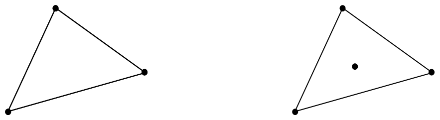

### Slide 270: Simplicial

- A d-polytope is simplicial if each of its facets is a (d-1)-simplex.
- For example, for d = 3:
- The convex hull of a set of points in 3-space (the convex hull
- is a 3-polytope) is simplicial iff every facet is a 2-simplex
- (a triangular convex hull of exactly 3 points).
- For example, the first case below.
- If any facet of the hull has > 3 co-planar points, the hull is not simplicial.
- For example, the second and third cases below.
- 2-simplex convex hull of 2 + 1 points not a 2-simplex convex hull of > 2 + 1 points
- not a 2-simplex convex hull of > 2 + 1 points

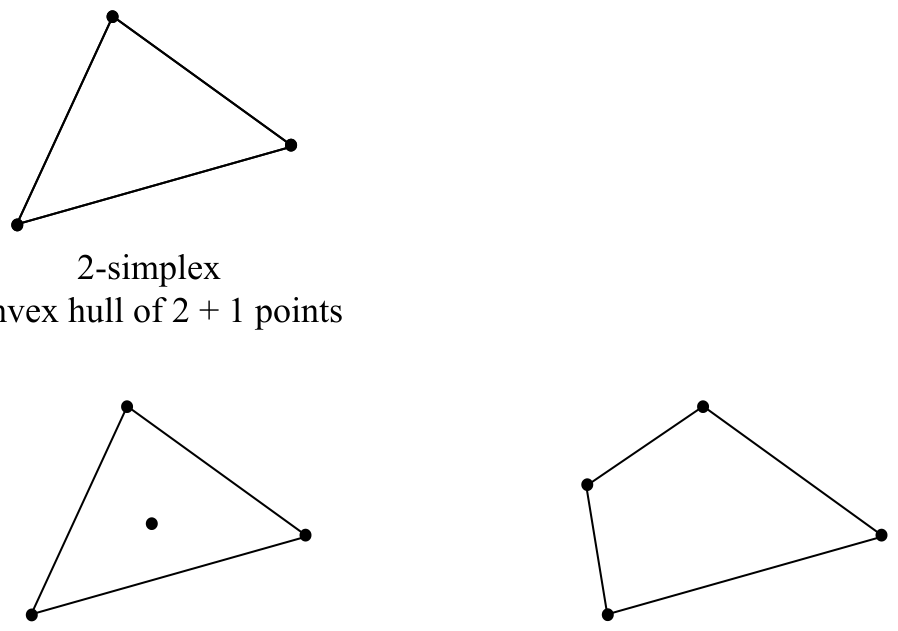

### Slide 271: Beneath

- A point p is beneath a facet F of a polytope P if the point p
- lies in the open half-space determined by hyperplane aff(F) and containing P.
- In other words, aff(F) is a supporting hyperplane of P, and p and P are in the same half-space bounded by aff(F).
- Point p is beyond facet F if p lies in the open half-space determined by aff(F) and not containing P.
- The figure shows these relationships for d = 2.
- Note error in text, 2nd paragraph of 3.4, “the P” should be “p”.
- F aff(F)
- P p2 is beneath F p1 is beyond F

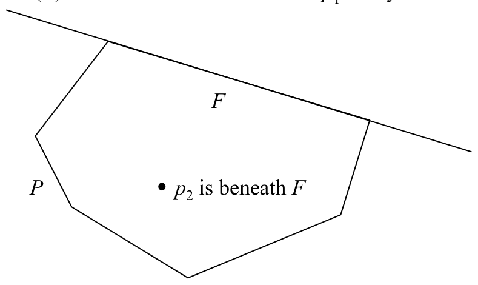

### Slide 272: Gift wrapping

- Proposed by Chand and Kapur (1970).
- Analyzed by Bhattacharya (1982).
- Specialized for d = 2 by Jarvis (1973), Jarvis’ march.
- Key idea:  Given one facet (a (d-1)-face) of the convex hull,
- find a neighboring facet of the hull by “wrapping” a (d-1)-dimensional affine set around the point set.
- Continue from each facet to its neighbors until all facets are found.
- For example, in d = 3, imagine wrapping a sheet of 2-dimensional
- wrapping paper around a 3-dimensional gift box.
- In d = 2 (Jarvis’ march), a 1-dimensional line is wrapped around
- a 2-dimensional point set.
- My presentation will often appeal to d = 3 for expository purposes,
- but the method is applicable for any d ≥2.

### Slide 273: Simplicial assumption

- As presented (here and in the text), the algorithm assumes that
- the resulting polytope (the convex hull) is simplicial.
- Recall that in a simplicial d-polytope, each facet is a (d-1)-simplex,
- and is determined by exactly d vertices.
- There will be no points in S coplanar with the d vertices that
- determine each facet of the convex hull.
- Theorem.  In a simplicial d-polytope, a subfacet is shared by exactly
- two facets, and two facets F1 and F2 share a subfacet e iff e is determined by a common subset, with d - 1 vertices,
- of the sets determining F1 and F2.  F1 and F2 are said to be
- adjacent on e.
- Restating the theorem for d = 3:
- In a simplicial 3-polytope, an edge is shared by exactly two triangular facets, and two facets F1 and F2 share an edge e
- iff e is determined by a common subset, with 2 vertices, of the 3 vertices determining F1 and F2.  F1 and F2 are said to be
- adjacent on e.
- The theorem is the basis of the algorithm.
- Given an already constructed facet F1 of the convex hull, a subfacet e of F1 is used to construct the adjacent facet F2
- that shares e with F1.

### Slide 274: Finding an adjacent facet, in general

- Let S = { p1, p2, … pN} be a finite set of points in d-space (Ed).
- Assume a facet F1 of H(S) is known, with all its subfacets.
- The mechanism to advance from F to an adjacent facet F′, which shares subfacet e with F,
- is to select from among all the points of S not vertices of F
- the point p′ such that all other points of S are beneath the hyperplane aff(e ∪p′).
- In other words, from among all the hyperplanes determined by e
- and a point p′ ∈S but not in F, the one which forms the “largest angle” with aff(F).
- For example, for d = 2:
- e
- F
- F′

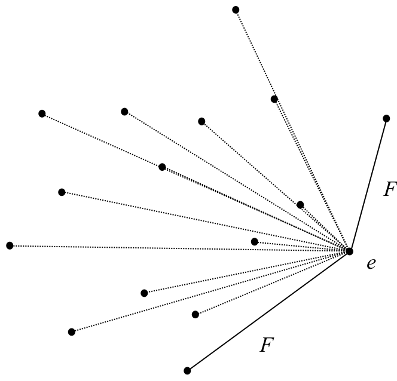

### Slide 275: Finding an adjacent facet, for d = 3

- Facet F is known.  Consider the set of planes determined by edge e
- and the points of S and select the one which forms the largest
- angle < π (convex angle) with aff(F).
- Points p1, p2, p3 determine F, which determines aff(F).
- Compare the planes determined by e and p4, p5, p6, and p7.
- p6 aff(F)
- F p1 p2 p3 p5 p4 p7 e

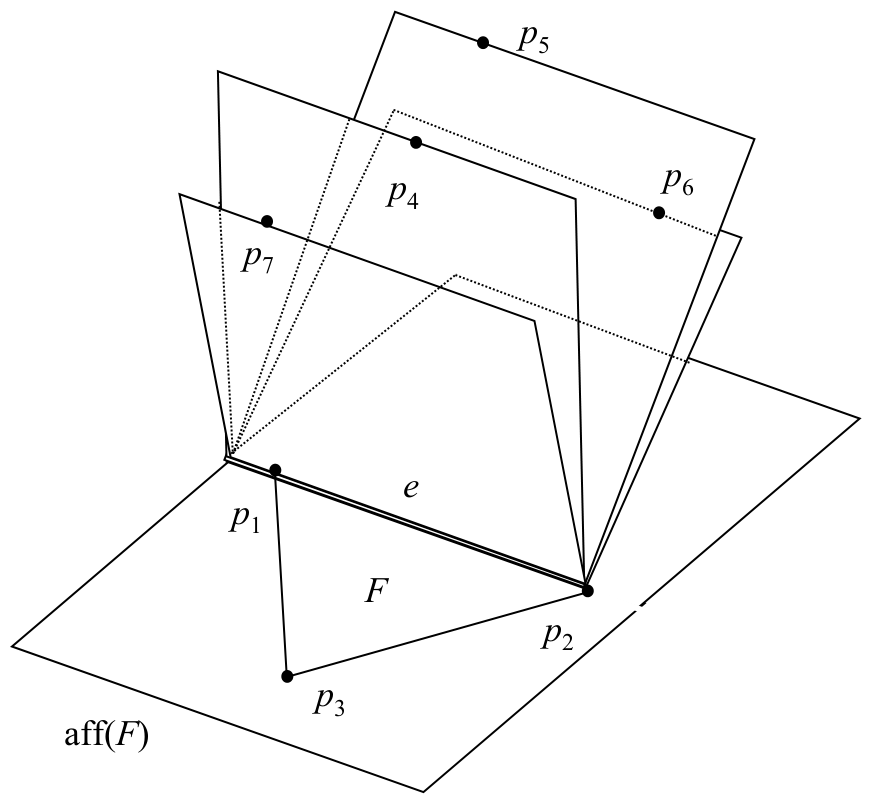

### Slide 276: Finding the largest angle

- The angle comparison is carried out by comparing cotangents for each point pk ∈S not part of F.
- The details are in the next slide.
- The time required for one advance is O(d3 + Nd).
- O(d3) to compute a vector needed for the angle comparisons, done once per advance (gift wrapping step).
- O(Nd) computing and comparing cotangents for O(N) points.
- p6 aff(F)
- F p1 p2 p3 p5 p4 p7 e

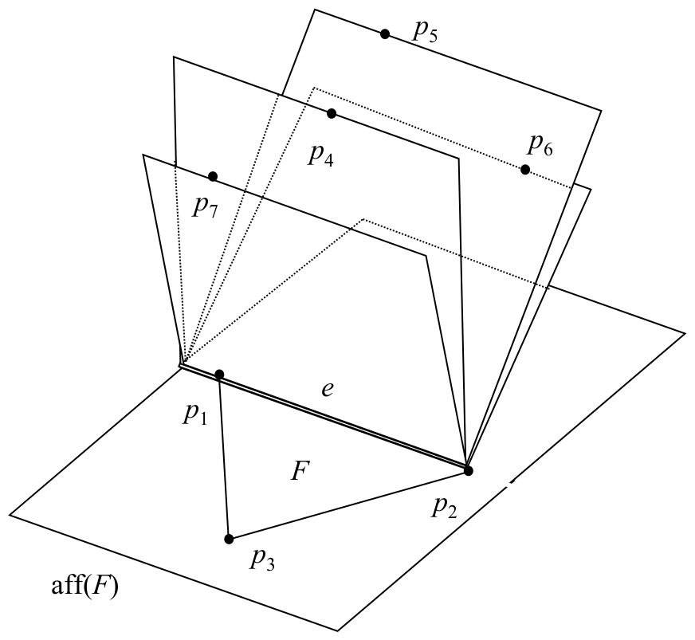

### Slide 277: Finding the largest angle

- The angle comparison is carried out by comparing cotangents for each point pk ∈S not part of F.
- Let n be the unit normal to F (in the beneath half space of aff(F),
- and let a be a unit vector normal to both edge e and vector n
- (so that a is oriented like n x p2p1.  Also let vk denote the vector p2pk.
- The cotangent of the angle formed by the half-plane containing F
- with the half-plane containing e and pk is given by the ratio
- -|Up2 | / |UV|, where |Up2 |= vk . aT and |UV| = vk . nT. Thus
- for each pk not in F, we compute the quantity ρk = -vk . aT/ vk . nT
- and take the pi that maximizes ρk.
- aff(F)
- F p2 p3 p1 pk e n vk
- V
- U a

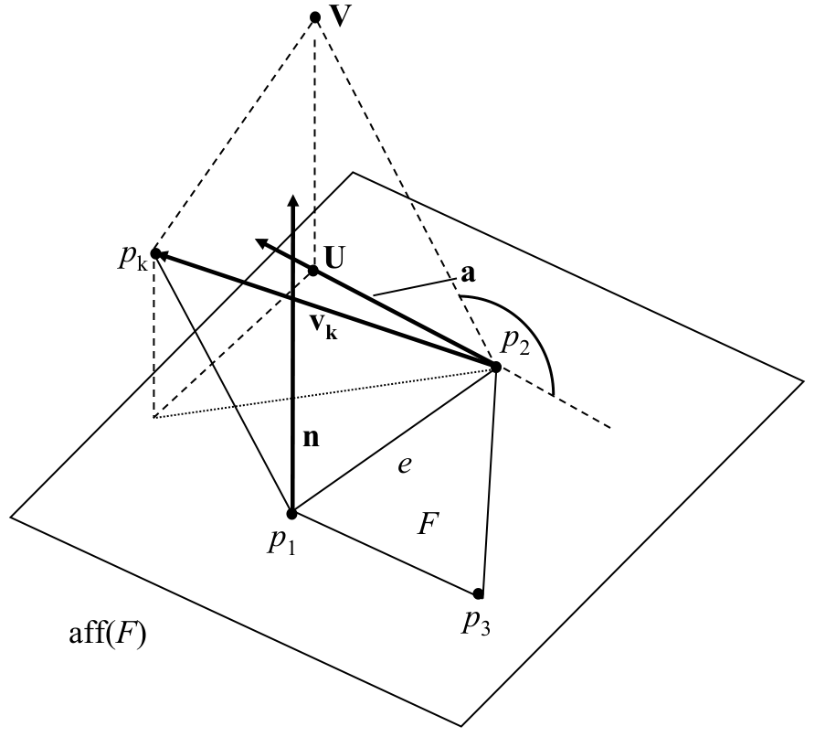

### Slide 278: Overview of the algorithm

- The algorithm starts from an initial facet.
- For each subfacet of it, construct the adjacent facets.
- Move to one of the new facets and continue until all facets have been constructed.
- A pool of subfacets which are candidates for being used is kept.
- A subfacet e, shared by facets F and F′, is a candidate to be used
- iff F or F′ but not both have been constructed.

### Slide 279: Algorithm

- Queue Q stores facets.  File ℑstores the “pool” of subfacets.
- procedure GiftWrapping(S) begin
- Q = ∅
- ℑ= ∅
- F = find an initial convex hull facet insert into ℑall subfacets of F
- insert(F,Q)  /* insert F into Q */ while (Q ≠∅) do
- F = first(Q) /* remove first element from Q, put into F */
- T = subfacets of F for each e ∈T ∩ℑ/* e is a gift wrapping candidate */
- F′ = facet sharing e with F /* Gift wrapping advance */ insert into ℑall subfacets of F′ not yet present
- delete from ℑall subfacets already present in F′ insert(F′,Q)
- endfor output F /* output a facet of H(S) */ endwhile end
- Still to be seen:
- 2. find an initial convex hull facet
- 7. generate the subfacets of facet F
- 8. check if subfacet e is a candidate

### Slide 280: Supporting lines and planes

- Recall that a supporting line of a convex polygon intersects the
- polygon at a vertex such that the entire polygon is to one side of
- the line.
- A supporting plane (or hyperplane) has a similar relationship
- with a polytope.
- polygon, d = 2 supporting line, d = 1
- E3 intersection is vertex intersection is edge intersection is facet
- E2

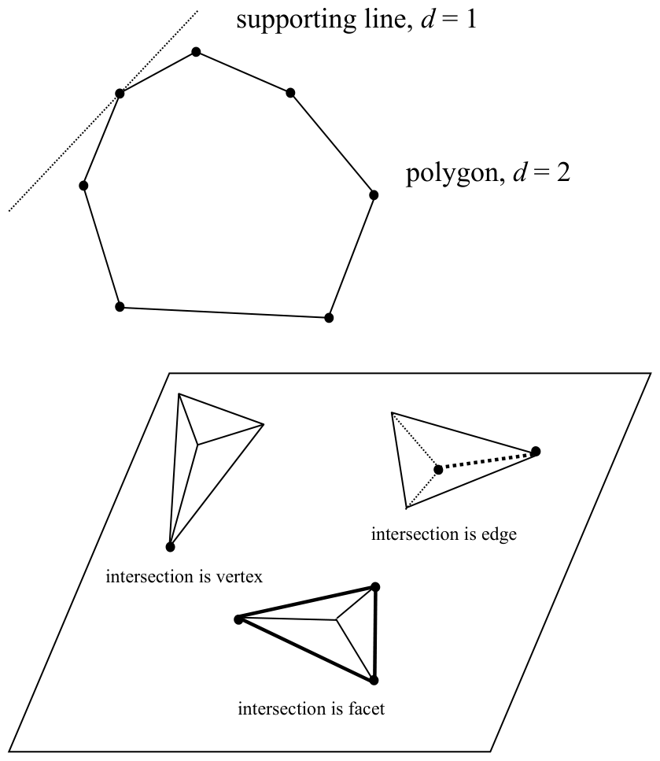

### Slide 281: Step 2.  “Find an initial convex hull facet.”, 1

- The idea is to obtain a hyperplane containing a facet of the
- convex hull polytope H(S) by successive approximations.
- This is done by constructing a sequence of d (d is dimension Ed)
- supporting hyperplanes π1, π2, …, πd, such that πi shares one more vertex with the convex hull than πi-1
- for 1 ≤i ≤d (we define π0 as sharing 0 vertices with H(S)).
- In other words, πi for 1 ≤i ≤d shares i vertices with H(S).
- A supporting hyperplane intersects the polytope such that the entire polytope is to one side of the hyperplane.
- Note that if the intersection is facet F, then the supporting hyperplane is aff(F).
- The supporting hyperplanes are (d-1)-dimensional.

### Slide 282: Step 2.  “Find an initial convex hull facet.”, 2

- For d = 3 (E3) the successive hyperplanes intersect the convex hull as follows:
- supporting
- # vertices intersection hyperplane of H(S) on πi object π0
- ∅ π1
- 0-face, vertex π2
- 1-face, edge, subfacet π3
- 2-face, polygon, facet
- In essence, the technique is an adaptation of the gift wrapping
- mechanism, where at the jth of the d iterations the hyperplane πj
- contains a (j-1)-face of the convex hull H(S).

### Slide 283: Step 2.  “Find an initial convex hull facet.”, 3

- Thus we begin by determining a point of least x1-coordinate
- (call it p1′); p1′ is certainly a vertex (a 0-face) of the convex hull.
- Hyperplane π1 is chosen orthogonal to vector (1, 0, …, 0) and passing by (containing) p1′.
- In other words, π1 passes through p1′ and is parallel to the x2x3…xd hyperplane.
- For example, for d = 3:
- This “initializes” the process of finding the initial supporting hyperplane.
- Once the initial hyperplane π1 has been found, each successive hyperplane πj 2 ≤j ≤d is found
- from the hyperplane before it πj-1.
- x1 = x x2 = y x3 = z p1′ p3′ p2′ π1

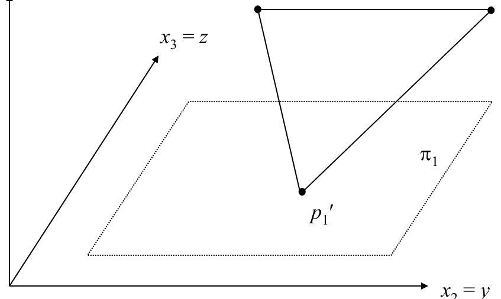

### Slide 284: Step 2.  “Find an initial convex hull facet.”, 4

- At the jth iteration, 2 ≤j ≤d, the hyperplane πj-1 has normal vector nj-1 and contains vertices p1′, p2′, …, pj-1′.
- We need to find  pj′ to define πj.
- Through vector calculations pj′ can be found such that πj (defined by p1′, p2′, …, pj′) has the largest angle
- with πj-1 (defined by p1′, p2′, …, pj-1′).
- Each iteration requires O(Nd) + O(d2) time.
- There are d iterations, so finding the initial supporting hyperplane πd required by step 2 of the overall algorithm
- requires O(Nd2) + O(d3) ∈O(Nd2) time.
- x1 = x x2 = y x3 = z p1′ p3′ p2′ π1 π2 π3

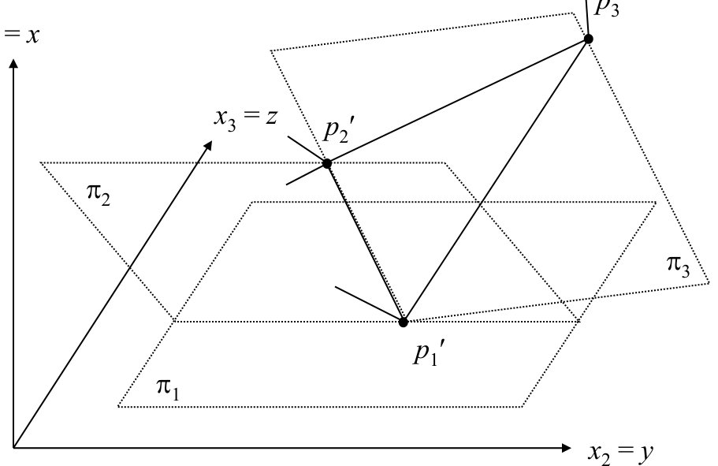

### Slide 285: Step 7.  “Generate the subfacets of facet F.”

- Because we have assumed that the convex hull polytope H(S) is simplicial, each facet of H(S) is determined by exactly d vertices,
- and each subset of those vertices of size d-1 determines a subfacet.
- The subfacets of a facet can be generated in a straightforward
- fashion by considering each of the d vertices in turn and reading
- off the remaining d-1 vertices.
- This requires O(d2) time.
- Each facet will be described by a d-component vector of the indices of its vertices,
- while a subfacet will be described by an analogous
- (d-1)-component vector.
- That implies that the vertices are kept in an array.

### Slide 286: Step 8.  “Check if a subfacet e is a candidate.”, 1

- A subfacet is a candidate iff it is contained in just one facet
- generated by the algorithm.
- Why just one?
- Recall that in a simplicial polytope, a subfacet is shared by exactly
- two facets.  If a subfacet is generated twice, then both of its adjacent facets have been found,
- and the subfacet is of no further use.
- e
- F1
- F2

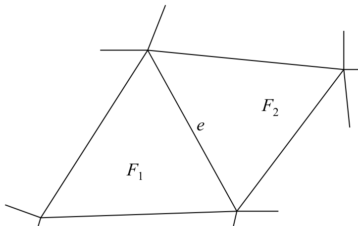

### Slide 287: Step 8.  “Check if a subfacet e is a candidate.”, 2

- Recall that ℑis a file of subfacets.
- Given a newly generated subfacet e, searching ℑfor e will determine if e is a candidate.
- If e ∈ℑ, delete e.
- If e ∉ℑ, add it.  (This is step 10 in the algorithm).
- A subfacet is represented by a (d-1)-component vector of vertex indices.
- Store ℑas a height-balanced binary tree, ordered lexicographically on the vertex indices.
- Accessing this structure to test subfacet e for membership (step 8)
- or to insert or delete subfacet e (step 10) requires O((d-1) log M) time,
- where (d-1) is the number of indices to compare and M is the maximum number of subfacets in ℑ.

### Slide 288: Analysis, 1

- We analyze the algorithm in steps.
- Let ϕd-1 be the actual number of facets of the polytope H(S).
- Let ϕd-2 be the actual number of subfacets of the polytope H(S).
- Initialization (steps 1-4) requires O(Nd2) time.
- Steps 6, 11, 12 process each facet once each, adding it to the queue, removing it, and outputting it;
- they require O(d) × ϕd-1.
- number of facets components of the vector representing the facet
- The overall complexity of step 7, generation of subfacets, is O(d-1) × 2ϕd-2, as each subfacet has d-1 components
- and is generated twice.
- The test in step 8 as well as the file update in step 10 require O((d-1) log ϕd-2) per subfacet,
- number of subfacets components of the vector representing the subfacet
- so the overall time required is O((d-1) log ϕd-2) × ϕd-2.
- The overall time required for step 9 (gift wrapping) is
- O(d3 + Nd) × ϕd-1.
- number of gift wrapping advances time required for each

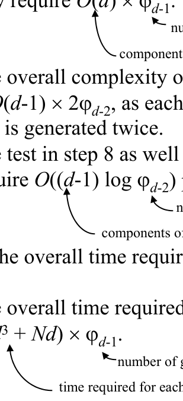

### Slide 289: Analysis, 2

- It can be shown that both ϕd-1, ϕd-2 ∈O(N⎣d/2⎦).
- Using this the previous analysis simplifies to:
- Convex hull construction time in d dimensions on N points
- T(d,N) using the Gift wrapping algorithm, requires O(N⎣d/2⎦+1) + O(N⎣d/2⎦log N).
- Note that even though d is a constant, it remains in the final order expression where it is an exponent
- of the input size N.

## Recap

- Keep the formal problem statement precise.
- Focus on the geometric invariant used by the method.
- Remember the key complexity bound and when it applies.
