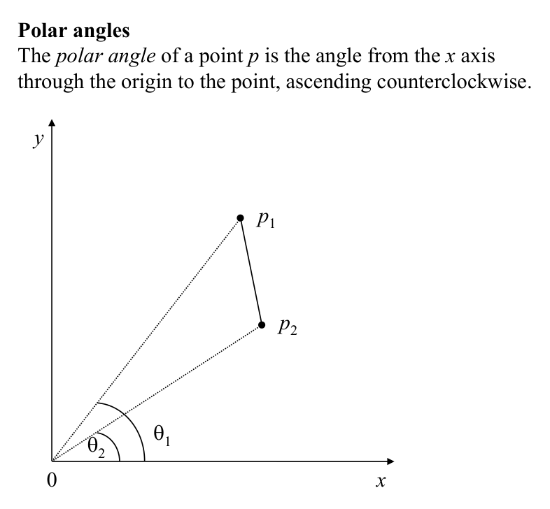
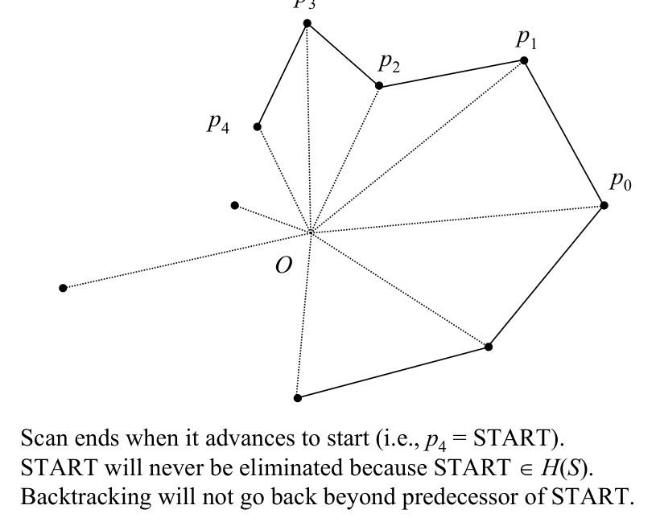

# Graham’s scan: concept and preparation

## Scope
- **Slides:** pp. 206-214
- **Major topic folder:** convex-hulls
- **Recording files touching this material:** CS 564 - 02.25 10.1.txt
- **Goal of this file:** You should be able to study this topic without reopening the slide deck.

## Big picture
This is the central convex-hull algorithm for the midterm. Learn the invariant, not just the pseudo-code. The invariant is what saves you when the exam wording mutates slightly, as it always does out of spite.

## What you must know cold
- Choose an anchor/internal point or sort points by polar angle around an anchor, depending on the slide variant.
- Process points in order while maintaining a stack/deque of candidate hull vertices.
- Whenever the last turn is not a left turn, pop until convexity is restored.

## Core ideas and reasoning
- After angular sorting, the scan walks boundary candidates in order.
- The stack invariant is that the current stack is always the convex hull of the processed prefix.
- A right turn or collinear bad case means the middle point cannot remain a hull vertex, so it is removed.

## Figures to actually look at
These are cropped from the main slide PDF. Do not skip them.

### Figure from slide p. 208

### Figure from slide p. 212

## Slide-by-slide digestion

### p. 206 - Graham’s scan
- Concept
- A point within a triangle of S cannot be a vertex of the convex hull.
- Previous algorithm determined if a point p was within a triangle of S
- by trying (as many as) all of the triangles for each point p.
- Can we find out if p is within a triangle of S more efficiently?
- Graham’s scan does so. This algorithm is from one of the first
- papers specifically concerned with finding an efficient geometric
- algorithm (1972).
- The essential idea: if a point p is not a vertex of the convex hull,
- then it is internal to some triangle Op1p2,

### p. 207 - Graham’s scan
- Centroid
- The centroid of a finite set of points p1, p2, …, pN is their
- arithmetic mean (p1 + p2 + … + pN) / N.
- (Computed for each coordinate separately.)
- Lexicographic sort
- Sorting on multiple keys associated with objects to be sorted.
- Compare objects to be sorted on first key; and sort accordingly.
- If first keys are equal, sort on second key.
- If second keys are equal, …
- farther

### p. 208 - Polar angles
- This slide is mainly visual: it fixes the meaning of polar angle as the counterclockwise angle from the x-axis.
- You must understand the ordering picture because the next slides show how to compare these angles without calling trigonometric functions.

### p. 209 - Graham’s scan
- θ1
- θ2
- Comparing polar angles
- Given two points p1 and p2 in the plane, which has the greater
- polar angle? p2 forms a strictly small polar angle with the x axis
- than p1 iff triangle 0p2p1 has a positive signed area.
- Area(triangle 0p2p1) = (x0 y1 + x2 y0 + x1 y2 - x2 y1 - x0 y2 - x1 y0) / 2
- (See earlier slides on left-turn/right turn classification.)
- Equivalently, ... iff 0p2p1 is a left turn.
- Note that this means polar angles can be compared without

### p. 210 - Graham’s scan
- Preparation
- The preparation for Graham’s scan is as follows:
- 1. Find a point O internal to H(S) (the centroid of S). O(N)
- 2. Transform the coordinates of the points in S so that
- O is the origin. O(N)
- 2. Sort the N points of S lexicographically on
- (1) polar angle and (2) distance from O. O(N log N)
- 3. Arrange the sorted points in a doubly-linked circular list. O(N)

### p. 211 - Graham’s scan
- Basic idea of the scan
- Recall that if a point p is not a vertex of the convex hull,
- then it is internal to some triangle Op1p2.
- The scan examines the points in sorted order (polar angle,
- distance from O), eliminating those not in the convex hull.
- Point p2 ∉H(S) and is eliminated
- when angle p1p2p3 is found to be reflex.
- Equivalently, eliminate p2 from H(S) iff p1p2p3 is not a left turn.
- Point p2 is within triangle Op1p3 and is eliminated.

### p. 212 - Graham’s scan
- Scan algorithm (informal)
- The scan begins at the rightmost smallest ordinate
- (minimum y coordinate) point; call it START.
- START is certainly a hull vertex (minimum y coordinate).
- Repeatedly examine consecutive triples of points p1p2p3.
- If p1p2p3 is a right turn, eliminate p2 from H(S) and
- backtrack to p0p1p3.
- If p1p2p3 is a left turn, advance to p2p3p4.
- What about p1p2p3 collinear? Eliminate, p2 ∉H(S).
- Scan ends when it advances to start (i.e., p4 = START).

### p. 213 - Graham’s scan
- Advancing and backtracking
- Backtracking may occur more than once in succession,
- eliminating a sequence of points.
- Backtracking sure to stop at START.
- No point can be eliminated more than once.

### p. 214 - Graham’s scan
- Algorithm
- (See Preparata, p. 108.)
- 1. Find an internal point O.
- 2. Using O as the coordinate origin, sort the N points of S
- lexicographically by polar angle and distance from O.
- Arrange the points into a doubly-linked circular list,
- with pointers NEXT and PRED for each entry,
- and with pointer START pointing to the starting point.
- 3. Scan:
- begin

## What you must be able to say or do in an exam
- State the input, output, preprocessing, and query/update model precisely.
- Explain the invariant or ordering that makes the method work.
- Trace the method by hand on a small example.
- Give the exact time and space bounds.
- Mention one edge case, degeneracy, or limitation.

## Complexity and performance facts
Sorting O(N log N) dominates; the scan itself is linear because each point is pushed once and popped at most once.

## Common mistakes and danger points
- Be clear about what you do with collinear points. Different tie rules give different boundary outputs.
- The orientation test must use the points in the correct order.

## Professor emphasis from recordings
These points are distilled from the related recordings and focus on what the professor slowed down for, warned about, or connected to homework/exam reasoning.

- The lecture motivation is that the old extreme-point thinking is too expensive, so Graham's scan exists to preserve the Ω(N log N) lower-bound target instead of wasting O(N^4) work.
- The elimination rule is the heart of the method: once the last triple is not a left turn, the middle point cannot stay on the hull.
- Collinear handling is not cosmetic. The tie-breaking rule changes which boundary points survive, so you must state the policy clearly.

## Exam-style drills and answer skeletons
Existing drill reminders from the earlier pack:
- Trace Graham scan on a concrete point set and show each push/pop with the orientation values.
- State and prove the stack invariant used by Graham scan.
- Adapted from HW2-Q5: Given vertices of a non-convex simple polygon in clockwise order, find its convex hull in O(N).

### HW2-Q5 drill
**Question.** Explain why Graham's scan normally needs sorting, and why a simple polygon given in boundary order is a special case that can be solved faster.

**How to answer.** Sorting is needed to order points radially, but an already-ordered boundary gives structure that can replace the sort.

### Core exam drill
**Question.** State the problem solved by graham’s scan: concept and preparation, describe preprocessing/query/update steps if any, and give the time and space bounds.

**How to answer.** An excellent answer names the input, the output, the invariant or ordering exploited by the method, and the exact asymptotic costs.

### Hand-trace drill
**Question.** Trace graham’s scan: concept and preparation on a small example by hand and explain each comparison or structural change.

**How to answer.** On this course, being able to run the method on a picture matters more than writing vague slogans.

## Recap
### What you must know cold
- Choose an anchor/internal point or sort points by polar angle around an anchor, depending on the slide variant.
- Process points in order while maintaining a stack/deque of candidate hull vertices.
- Whenever the last turn is not a left turn, pop until convexity is restored.
### Core test / key idea
- After angular sorting, the scan walks boundary candidates in order.
- The stack invariant is that the current stack is always the convex hull of the processed prefix.
- A right turn or collinear bad case means the middle point cannot remain a hull vertex, so it is removed.
### Complexity
- Sorting O(N log N) dominates; the scan itself is linear because each point is pushed once and popped at most once.
### Common mistakes / danger points
- Be clear about what you do with collinear points. Different tie rules give different boundary outputs.
- The orientation test must use the points in the correct order.
### Professor emphasis (from recordings)
- The lecture motivation is that the old extreme-point thinking is too expensive, so Graham's scan exists to preserve the Ω(N log N) lower-bound target instead of wasting O(N^4) work.
- The elimination rule is the heart of the method: once the last triple is not a left turn, the middle point cannot stay on the hull.
- Collinear handling is not cosmetic. The tie-breaking rule changes which boundary points survive, so you must state the policy clearly.
## End-of-file summary
- Choose an anchor/internal point or sort points by polar angle around an anchor, depending on the slide variant.
- Process points in order while maintaining a stack/deque of candidate hull vertices.
- Whenever the last turn is not a left turn, pop until convexity is restored.
- Sorting O(N log N) dominates; the scan itself is linear because each point is pushed once and popped at most once.
- Be clear about what you do with collinear points. Different tie rules give different boundary outputs.
- The orientation test must use the points in the correct order.

## Everything related to this topic
- **Previous file in reading order:** [Extreme points algorithm](../03_Convex_Hulls/35_extreme-points-algorithm.md)
- **Next file in reading order:** [Graham’s scan: analysis, upper-lower hull view, and summary](../03_Convex_Hulls/37_graham-scan-analysis.md)
- **Source slide range:** pp. 206-214 of `comp_geometry_slides_new.pdf`
- **Related recordings:** CS 564 - 02.25 10.1.txt
- **Related homework-derived exam prompts included here:** HW2-Q5 drill