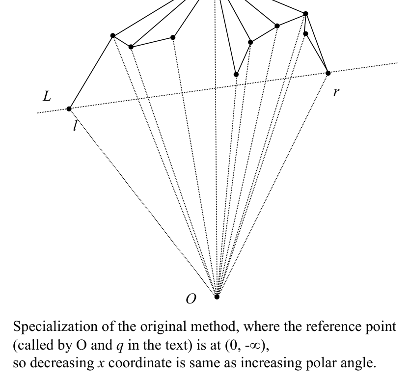
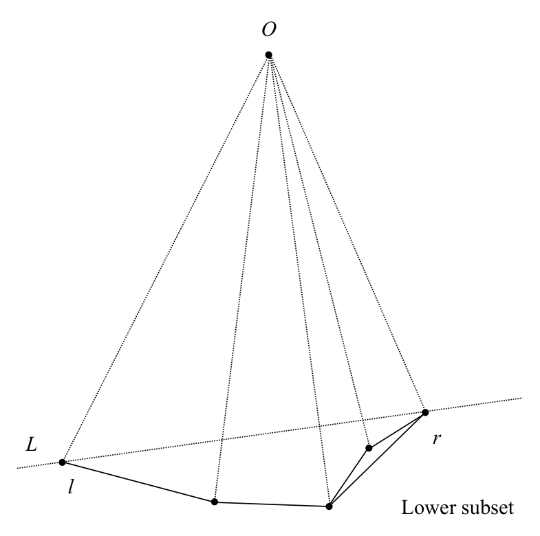

# Graham’s scan: analysis, upper-lower hull view, and summary

## Scope
- **Slides:** pp. 215-219
- **Major topic folder:** convex-hulls
- **Recording files touching this material:** CS 564 - 02.25 10.1.txt
- **Goal of this file:** You should be able to study this topic without reopening the slide deck.

## Big picture
This follow-up page is where you turn the stack behavior into a proof and connect Graham scan to upper/lower hull thinking.

## What you must know cold
- Why the scan phase is O(N) after sorting.
- Upper hull / lower hull decomposition viewpoint.
- Why the overall algorithm is optimal in 2D.

## Core ideas and reasoning
- Every point enters the stack once and leaves at most once, so the scan is linear.
- Another view is to construct upper and lower hulls separately in x-order; this foreshadows monotone-chain variants.

## Figures to actually look at
These are cropped from the main slide PDF. Do not skip them.

### Figure from slide p. 217

### Figure from slide p. 218

## Slide-by-slide digestion

### p. 215 - Graham’s scan
- Analysis
- Time: O(N log N); see comments.
- Storage: O(N) for circular linked list of points.
- Comments
- Preparation:
- Dominated by O(N log N) time required for sort.
- Scan:
- Left test requires O(1) time.
- After each test, either advance or backtrack.
- The scan will advance at most O(N) times,

### p. 216 - Graham’s scan
- Lower and upper hulls
- We introduce the notions of upper and lower hulls,
- which will be useful later, here in the context of Graham’s scan.
- Rather than comparing polar angles, x-coordinate values will be
- compared.
- Given set S of N points in the plane, find the points with minimum
- and maximum x coordinates (abscissa).
- Call those points l and r, and construct the line L through l and r.
- L partitions the remaining points S into two subsets, upper and lower,
- each of which include l and r.

### p. 217 - Graham’s scan
- Constructing the upper hull
- Sort the points of the upper subset of S on decreasing x coordinate.
- (Note error, text p. 109 says “increasing”.)
- Apply Graham’s scan from r to l.
- Specialization of the original method, where the reference point
- (called by O and q in the text) is at (0, -∞),
- so decreasing x coordinate is same as increasing polar angle.
- Upper subset

### p. 218 - Graham’s scan
- Constructing the lower hull
- Sort the points of the lower subset of S on increasing x coordinate.
- Apply Graham’s scan from l to r.
- Lower subset

### p. 219 - Graham’s scan
- Summary
- We have achieved best possible time for problem, O(N log N).
- But we will continue to examine additional algorithms. Why?
- 1. The algorithm is optimal in the worst case,
- but we have not analyzed its expected case performance.
- 2. It does not generalize to d > 2.
- (Note that our lower bound proof also only applies to d = 2.)
- 3. The algorithm is static, in that all points must be given
- before the hull is constructed.
- 4. For a parallel environment, a recursive algorithm

## What you must be able to say or do in an exam
- State the claim precisely before giving the argument.
- Identify the known lower bound / recurrence / invariant you are using.
- Keep the direction of the argument correct.
- End with the exact asymptotic conclusion.

## Complexity and performance facts
O(N log N) time, O(N) space; optimal because of the Ω(N log N) lower bound.

## Common mistakes and danger points
- Do not say “because there is a loop inside a loop it is quadratic.” The amortized push/pop argument is the proof.

## Professor emphasis from recordings
These points are distilled from the related recordings and focus on what the professor slowed down for, warned about, or connected to homework/exam reasoning.

- He highlights the amortized logic behind the scan: backtracking can happen many times in a row, but each point is deleted at most once.
- That is the reason the scan phase stays linear after sorting.

## Exam-style drills and answer skeletons
Existing drill reminders from the earlier pack:
- Adapted from HW2-Q5: Given vertices of a non-convex simple polygon in clockwise order, find its convex hull in O(N).

### Proof drill
**Question.** Explain the main argument in graham’s scan: analysis, upper-lower hull view, and summary in a logically correct order.

**How to answer.** Do not jump from intuition to conclusion. State the reduction/invariant/recurrence first, then derive the claimed bound.

## Recap
### What you must know cold
- Why the scan phase is O(N) after sorting.
- Upper hull / lower hull decomposition viewpoint.
- Why the overall algorithm is optimal in 2D.
### Core test / key idea
- Every point enters the stack once and leaves at most once, so the scan is linear.
- Another view is to construct upper and lower hulls separately in x-order; this foreshadows monotone-chain variants.
### Complexity
- O(N log N) time, O(N) space; optimal because of the Ω(N log N) lower bound.
### Common mistakes / danger points
- Do not say “because there is a loop inside a loop it is quadratic.” The amortized push/pop argument is the proof.
### Professor emphasis (from recordings)
- He highlights the amortized logic behind the scan: backtracking can happen many times in a row, but each point is deleted at most once.
- That is the reason the scan phase stays linear after sorting.
## End-of-file summary
- Why the scan phase is O(N) after sorting.
- Upper hull / lower hull decomposition viewpoint.
- Why the overall algorithm is optimal in 2D.
- O(N log N) time, O(N) space; optimal because of the Ω(N log N) lower bound.
- Do not say “because there is a loop inside a loop it is quadratic.” The amortized push/pop argument is the proof.
- He highlights the amortized logic behind the scan: backtracking can happen many times in a row, but each point is deleted at most once.

## Everything related to this topic
- **Previous file in reading order:** [Graham’s scan: concept and preparation](../03_Convex_Hulls/36_graham-scan-algorithm.md)
- **Next file in reading order:** [Jarvis march (gift wrapping) in 2D](../03_Convex_Hulls/38_jarvis-march.md)
- **Source slide range:** pp. 215-219 of `comp_geometry_slides_new.pdf`
- **Related recordings:** CS 564 - 02.25 10.1.txt
- **Related homework-derived exam prompts included here:** none directly mapped; generic exam drills added instead
