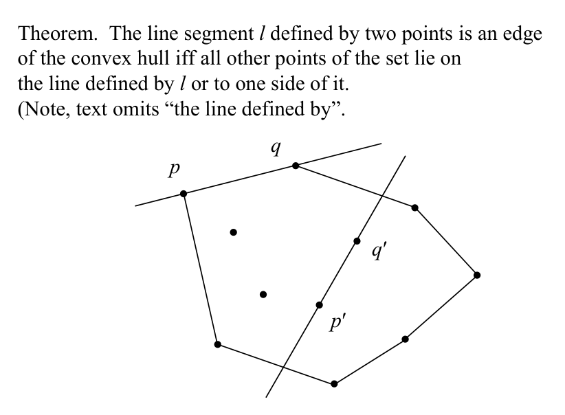
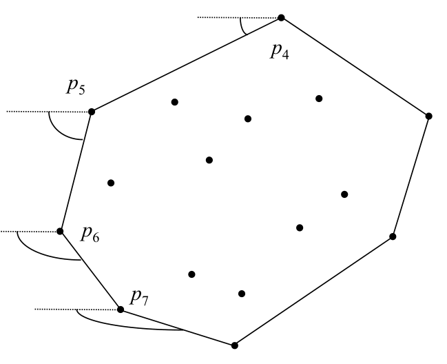

# Jarvis march (gift wrapping) in 2D

## Scope
- **Slides:** pp. 220-224
- **Major topic folder:** convex-hulls
- **Recording files touching this material:** CS 564 - 02.25 10.1.txt, CS 564 - 02.27 11.1.txt
- **Goal of this file:** You should be able to study this topic without reopening the slide deck.

## Big picture
Jarvis march wraps the hull edge by edge instead of filtering vertices. It is conceptually simple and output-sensitive.

## What you must know cold
- Start from an extreme point.
- At each step, choose the point that makes all other points lie to one side of the candidate edge.
- Repeat until returning to the start.

## Core ideas and reasoning
- Given current hull vertex p, search all points for the next point q such that every other point lies to the same side of pq.
- This is edge finding rather than vertex filtering.

## Figures to actually look at
These are cropped from the main slide PDF. Do not skip them.

### Figure from slide p. 220

### Figure from slide p. 223

## Slide-by-slide digestion

### p. 220 - Jarvis’ march
- Concept
- Graham’s scan found the vertices of H(S).
- Given a point p ∈ S, the algorithm would determine
- whether p ∈ H(S), with some possible backtracking.
- Conceptually, Jarvis’ march instead finds the edges of H(S).
- Given two points p and q, it is possible to determine
- if segment pq is an edge of H(S).
- Theorem. The line segment l defined by two points is an edge
- of the convex hull iff all other points of the set lie on
- the line defined by l or to one side of it.

### p. 221 - Jarvis’ march
- Naïve approach
- There are O(N2) lines determined by all pairs of points.
- For each of those lines, it is possible to test all the remaining
- N - 2 points (Point-line classification) and determine
- if the line meets the criteria of the theorem as an edge of H(S).
- This simple process requires O(N3) time to find the edges of H(S).
- The edges must then be arranged in order in O(N) time.
- Improving on the naïve approach
- To improve on this, observe that once it is established that
- some segment pq is a edge of H(S),

### p. 222 - Jarvis’ march
- Marching (up)
- Assume that the rightmost smallest ordinate point p1 has been found.
- Point p1 is certainly ∈H(S).
- We wish to find the next vertex on H(S), call it p2.
- Point p2 is the point ∈S with the smallest polar angle ≤0 w.r.t. p1.
- Likewise, the next point p3 has the smallest polar angle ≤0 w.r.t. p2.
- Each successive vertex of H(S) can be found in linear time O(N)
- by checking each p ∈S to find the point with the least polar angle.
- In this manner, H(S) can be constructed from the lowest point
- to the highest point (p1 to p4 in the example).

### p. 223 - Jarvis’ march
- Marching (down)
- When marching down, the least polar angle is found
- w.r.t. to the point as usual, but relative to the negative x axis,
- because relative to the x axis will give erroneous results.

### p. 224 - Jarvis’ march
- Analysis
- Time: O(N2); O(N) points in hull, N comparisons at each
- to find least polar angle.
- Storage: O(N); for the points.
- However, only the vertices of the hull H(S) are actually processed
- (that is, if there are actually h points on the hull, hN left/right
- comparisons are necessary)
- to find the next vertex.
- Let h be |H(S)|; of course h ∈O(N), but often h << N.
- Expected time for Jarvis’ march algorithm is O(hN),

## What you must be able to say or do in an exam
- State the input, output, preprocessing, and query/update model precisely.
- Explain the invariant or ordering that makes the method work.
- Trace the method by hand on a small example.
- Give the exact time and space bounds.
- Mention one edge case, degeneracy, or limitation.

## Complexity and performance facts
O(Nh) where h is the number of hull vertices; good when h is small, worst case O(N^2).

## Common mistakes and danger points
- Do not accidentally test against the segment only; the one-side condition is relative to the full supporting line.

## Exam-style drills and answer skeletons
Existing drill reminders from the earlier pack:
- Adapted from HW2-Q5: Given vertices of a non-convex simple polygon in clockwise order, find its convex hull in O(N).

### Core exam drill
**Question.** State the problem solved by jarvis march (gift wrapping) in 2d, describe preprocessing/query/update steps if any, and give the time and space bounds.

**How to answer.** An excellent answer names the input, the output, the invariant or ordering exploited by the method, and the exact asymptotic costs.

### Hand-trace drill
**Question.** Trace jarvis march (gift wrapping) in 2d on a small example by hand and explain each comparison or structural change.

**How to answer.** On this course, being able to run the method on a picture matters more than writing vague slogans.

## Recap
### What you must know cold
- Start from an extreme point.
- At each step, choose the point that makes all other points lie to one side of the candidate edge.
- Repeat until returning to the start.
### Core test / key idea
- Given current hull vertex p, search all points for the next point q such that every other point lies to the same side of pq.
- This is edge finding rather than vertex filtering.
### Complexity
- O(Nh) where h is the number of hull vertices; good when h is small, worst case O(N^2).
### Common mistakes / danger points
- Do not accidentally test against the segment only; the one-side condition is relative to the full supporting line.
## End-of-file summary
- Start from an extreme point.
- At each step, choose the point that makes all other points lie to one side of the candidate edge.
- Repeat until returning to the start.
- O(Nh) where h is the number of hull vertices; good when h is small, worst case O(N^2).
- Do not accidentally test against the segment only; the one-side condition is relative to the full supporting line.

## Everything related to this topic
- **Previous file in reading order:** [Graham’s scan: analysis, upper-lower hull view, and summary](../03_Convex_Hulls/37_graham-scan-analysis.md)
- **Next file in reading order:** [Quickhull](../03_Convex_Hulls/39_quickhull.md)
- **Source slide range:** pp. 220-224 of `comp_geometry_slides_new.pdf`
- **Related recordings:** CS 564 - 02.25 10.1.txt, CS 564 - 02.27 11.1.txt
- **Related homework-derived exam prompts included here:** none directly mapped; generic exam drills added instead