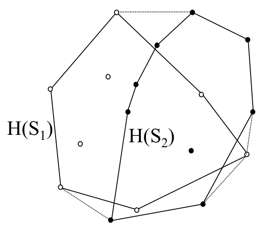
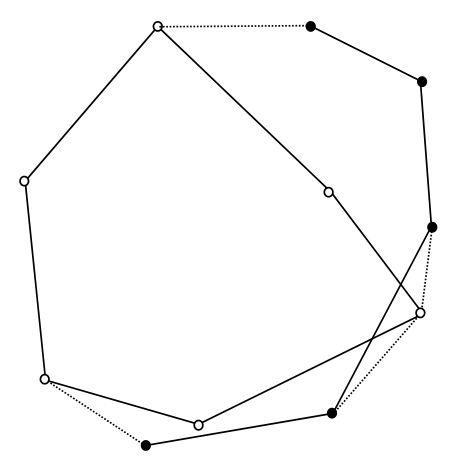

# Divide-and-conquer convex hulls and hull union

## Scope
- **Slides:** pp. 235-241
- **Major topic folder:** convex-hulls
- **Recording files touching this material:** CS 564 - 02.27 11.1.txt
- **Goal of this file:** You should be able to study this topic without reopening the slide deck.

## Big picture
This is the clean divide-and-conquer hull algorithm the course wants you to contrast with Quickhull. The subproblems are balanced, and the merge is a hull-union computation.

## What you must know cold
- Split points into two roughly equal subsets, usually by x-order.
- Recursively compute each hull.
- Merge the two convex hulls by finding common tangents / supporting lines.

## Core ideas and reasoning
- The identity is H(S1 ∪ S2) = H(H(S1) ∪ H(S2)).
- Once each subproblem returns a convex polygon, merging is a geometric tangent-finding problem rather than a point-set problem.

## Figures to actually look at
These are cropped from the main slide PDF. Do not skip them.

### Figure from slide p. 237


### Figure from slide p. 241


## Slide-by-slide digestion

### p. 235 - Divide-and-conquer
- Divide-and-conquer design goal
- QUICKHULL recursively subdivides point set S,
- and assembles the convex hull H(S) by “merging”
- the subproblem results.
- Advantages:
- 1. Subdivision allows parallelization
- 2. Merge process is very simple (concatenation)
- Disadvantage:
- 1. Inability to control or guarantee subproblem size
- results in suboptimum worst case time performance.

### p. 236 - Divide-and-conquer
- Union of convex hulls, 1
- Suppose we have S and want to compute H(S).
- Further suppose S has been partitioned into S1 and S2,
- each containing half the points of S.
- If H(S1) and H(S2) are found separately (recursively),
- how much additional work is required to compute H(S1 ∪S2),
- i.e., H(S)?
- In other words, is it easier to find H(S) = H(S1 ∪S2)
- given H(S1) and H(S2) than to find H(S) directly?
- To do so, we use the relation:

### p. 237 - Divide-and-conquer
- Union of convex hulls, 2
- The relation is: H(S1 ∪S2) = H(H(S1) ∪H(S2))
- Computing the convex hull of the union of convex hulls is
- made simpler because H(S1) and H(S2) are convex polygons
- and thus have an ordering on their vertices.
- HULL OF UNION OF CONVEX POLYGONS
- INSTANCE: Convex polygons P1 and P2.
- QUESTION: Find the convex hull of their union.
- This problem is the merge step of a divide-and-conquer
- algorithm for convex hull construction.

### p. 238 - Divide-and-conquer
- Overview of divide-and-conquer algorithm
- 1. If |S|  k0 (k0 is a small integer), construct the convex hull
- directly by some method and stop, else go to step 2.
- (For example, for k0 = 3 the hull is a triangle, O(1).)
- 2. Partition the set S arbitrarily into two subsets S1 and S2
- of approximately equal sizes.
- 3. Recursively find the convex hulls H(S1) and H(S2).
- 4. Merge the two hulls together to form H(S).
- Let U(N) denote the time needed to find the hull of the union of
- two convex polygons (convex hulls), each with N/2 vertices.

### p. 239 - Divide-and-conquer
- Merge algorithm, 1 (steps 1–3 below).

```text
procedure MERGE_CONVEX_HULLS(P1, P2)
  { P1, P2 convex polygons; compute H(P1 ∪ P2) in O(m + n) }
begin
  1. Find a point p internal to P1 (e.g. centroid). Then p lies inside H(P1 ∪ P2).
  2. Test whether p is internal to P2 — O(N) convex inclusion.
     If p is not internal to P2, go to step 4.
  3. { p inside P2 } Vertices of P1 and P2 appear in sorted angular order about p.
     Merge these orders; continue at step 5 with that vertex list.

  4. { p not inside P2 } Relative to p, P2 lies in a wedge of apex angle ≤ π,
     bounded by vertices u, v of P2 (found in O(N) by one pass around P2).
     Partition P2 into two angle-monotone chains; discard the chain concave toward p
     (its vertices lie inside H(P1 ∪ P2)).

  5. Run Graham’s scan on the resulting vertex list in angular order about p
     to build H(P1 ∪ P2) in O(m + n) = O(N) time.
end
```

### p. 240 - Divide-and-conquer
- Merge algorithm, 2: corresponds to **step 4** above (wedge from **p**, vertices **u** and **v**, discard the concave-toward-**p** chain).

### p. 241 - Divide-and-conquer
- Merge algorithm, 3: **step 5** — Graham scan on the merged list yields **H(P1 ∪ P2)** in **O(m + n)**; with an **O(N)** merge, divide-and-conquer convex hull is **O(N log N)** overall.

## What you must be able to say or do in an exam
- State the input, output, preprocessing, and query/update model precisely.
- Explain the invariant or ordering that makes the method work.
- Trace the method by hand on a small example.
- Give the exact time and space bounds.
- Mention one edge case, degeneracy, or limitation.

## Complexity and performance facts
Balanced divide and conquer gives O(N log N) overall when the merge is linear.

## Common mistakes and danger points
- Do not merge raw point sets; merge the two hulls.
- The merge step must preserve cyclic order around the output hull.

## Exam-style drills and answer skeletons
Existing drill reminders from the earlier pack:
- Adapted from HW2-Q5: Given vertices of a non-convex simple polygon in clockwise order, find its convex hull in O(N).

### Core exam drill
**Question.** State the problem solved by divide-and-conquer convex hulls and hull union, describe preprocessing/query/update steps if any, and give the time and space bounds.

**How to answer.** An excellent answer names the input, the output, the invariant or ordering exploited by the method, and the exact asymptotic costs.

### Hand-trace drill
**Question.** Trace divide-and-conquer convex hulls and hull union on a small example by hand and explain each comparison or structural change.

**How to answer.** On this course, being able to run the method on a picture matters more than writing vague slogans.

## Recap
### What you must know cold
- Split points into two roughly equal subsets, usually by x-order.
- Recursively compute each hull.
- Merge the two convex hulls by finding common tangents / supporting lines.
### Core test / key idea
- The identity is H(S1 ∪ S2) = H(H(S1) ∪ H(S2)).
- Once each subproblem returns a convex polygon, merging is a geometric tangent-finding problem rather than a point-set problem.
### Complexity
- Balanced divide and conquer gives O(N log N) overall when the merge is linear.
### Common mistakes / danger points
- Do not merge raw point sets; merge the two hulls.
- The merge step must preserve cyclic order around the output hull.
## End-of-file summary
- Split points into two roughly equal subsets, usually by x-order.
- Recursively compute each hull.
- Merge the two convex hulls by finding common tangents / supporting lines.
- Balanced divide and conquer gives O(N log N) overall when the merge is linear.
- Do not merge raw point sets; merge the two hulls.
- The merge step must preserve cyclic order around the output hull.

## Everything related to this topic
- **Previous file in reading order:** [Quickhull](../03_Convex_Hulls/39_quickhull.md)
- **Next file in reading order:** [Supporting lines from hull union](../03_Convex_Hulls/41_supporting-lines.md)
- **Source slide range:** pp. 235-241 of `comp_geometry_slides_new.pdf`
- **Related recordings:** CS 564 - 02.27 11.1.txt
- **Related homework-derived exam prompts included here:** none directly mapped; generic exam drills added instead
