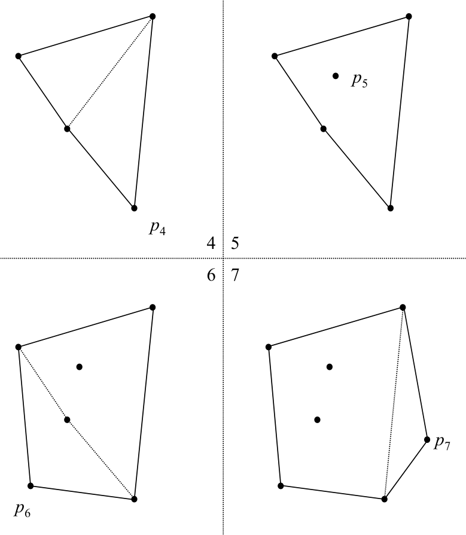
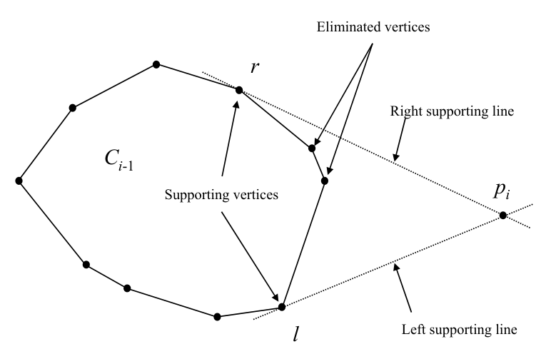

# Dynamic/on-line convex hull insertion: problem setting and core idea

## Scope
- **Slides:** pp. 245-253
- **Major topic folder:** convex-hulls
- **Recording files touching this material:** CS 564 - 02.27 11.2.txt, CS 564 - 03.04 12.1.txt
- **Goal of this file:** You should be able to study this topic without reopening the slide deck.

## Big picture
Now the hull is no longer static. The question becomes: if a new point arrives, how much of the current hull survives? The answer is “all of it except the visible chain between two support vertices.”

## What you must know cold
- Static vs dynamic / online hull problem.
- Case distinction: inserted point inside current hull vs outside it.
- Support lines from the new point to the current hull.

## Core ideas and reasoning
- If the new point lies inside the hull, nothing changes.
- If it lies outside, exactly the chain of hull vertices visible from the new point is replaced by the new point together with two support edges.

## Figures to actually look at
These are cropped from the main slide PDF. Do not skip them.

### Figure from slide p. 246


### Figure from slide p. 251


## Slide-by-slide digestion

### p. 245 - Dynamic hull (insertion)
- Hull maintenance during insertion, 1
- Maintain H(S) as points are added to S.

### p. 246 - Dynamic hull (insertion)
- Hull maintenance during insertion, 2
- Maintain H(S) as points are added to S.

### p. 247 - Dynamic hull (insertion)
- Definitions
- Preparata
- static
- Set of object remains fixed between operations
- (e.g., between queries in repetitive mode).
- dynamic
- Set of objects can change between operations.
- Insertions and deletions allowed in general,
- but sometimes constrained.
- Implies S must be in some updatable data structure.

### p. 248 - Dynamic hull (insertion)
- Problem definitions
- ON-LINE CONVEX HULL
- INSTANCE: Sequence of N points in the plane p1, p2, …, pN.
- QUESTION: Find their convex hull in such a way that after
- pi is processed we have H({p1, p2, …, pi}).
- REAL-TIME CONVEX HULL
- QUESTION: Find their convex hull on-line assuming constant
- interarrival delay.
- The algorithm must maintain some representation of the hull and
- update it as points are inserted. Can this be done and still achieve

### p. 249 - Dynamic hull (insertion)
- Algorithms
- Shamos (1978), mentioned in text p. 119, not covered.
- Preparata (1979), presented in text pp. 119-124, covered.
- Latter is real-time (hence is on-line).
- Key idea, 1
- Assume the points are inserted in sequence p1, p2, …, pN.
- Let pi be the current point and Ci-1 = H({p1, p2, …, pi-1}).
- Finding Ci requires finding the supporting lines from pi to Ci-1,
- if they exist (i.e., pi is external to Ci-1).
- (If pi is internal to Ci-1, then Ci = Ci-1.)

### p. 250 - Dynamic hull (insertion)
- Key idea, 2
- Finding Ci requires finding the supporting lines from pi to Ci-1,
- if they exist (i.e., pi is external to Ci-1).
- (If pi is internal to Ci-1, then Ci = Ci-1.)
- Another example:
- Ci-1
- Left supporting line
- Right supporting line
- Supporting vertices

### p. 251 - Dynamic hull (insertion)
- Algorithm overview
- For each pi,
- If pi is internal to Ci-1, then Ci = Ci-1, and pi is eliminated.
- If pi is external to Ci-1, then we must
- 1. Find the supporting lines from pi to Ci-1.
- 2. Ci = pi || r … l

```text
/* vertices of Ci-1 from r to l */
The problem reduces to finding the supporting lines,
i.e., finding the supporting vertices l and r.
The data structure for the vertices of Ci-1 will be given soon,
```

### p. 252 - Dynamic hull (insertion)
- Classifying a vertex
- We need to classify any vertex v of Ci-1 w.r.t. pi
- (or w.r.t. the segment piv).
- v′
- v′′
- (b) Supporting;
- the two vertices adjacent to v
- lie on the same side of line pv
- (c) Reflex;
- segment pv does not intersect

### p. 253 - Dynamic hull (insertion)
- Searching for a supporting vertex
- Suppose we have pi and v a vertex of Ci-1.
- Assume we seek l, the left supporting vertex.
- 1. Classify v w.r.t. to pi.
- 2. If v is supporting, l = v, return.
- 3. If v is concave, v = v′, repeat.
- 4. If v is reflex, v = v′′, repeat.
- This is advancing along Ci-1, searching for l.
- Eventually the supporting vertex l will be found.
- Finding r is analogous.

## What you must be able to say or do in an exam
- State the input, output, preprocessing, and query/update model precisely.
- Explain the invariant or ordering that makes the method work.
- Trace the method by hand on a small example.
- Give the exact time and space bounds.
- Mention one edge case, degeneracy, or limitation.

## Complexity and performance facts
Core geometric task is locating left/right support vertices quickly.

## Common mistakes and danger points
- Do not recompute the full hull from scratch unless the question explicitly allows the naive method.

## Professor emphasis from recordings
These points are distilled from the related recordings and focus on what the professor slowed down for, warned about, or connected to homework/exam reasoning.

- For on-line hull insertion, the lecture separates the easy case from the real work: if the new point is inside the current hull, nothing changes.
- When the point is outside, the whole problem becomes finding the two supporting lines/tangents that bracket the visible chain.
- He also notes that a careful case analysis is required, because support/reflex combinations determine the update.

## Exam-style drills and answer skeletons
Existing drill reminders from the earlier pack:
- Adapted from HW2-Q6: Design an O(n + X/d) algorithm for a d-approximate convex hull, where X is x-span of the point set.

### Dynamic hull insertion drill
**Question.** A new point arrives. Explain how to decide whether it changes the hull and what supporting-line information must be found before updating the vertex sequence.

**How to answer.** If the point is inside the current hull, ignore it. Otherwise locate left and right tangents, delete the obscured chain, and splice the new point in.

### Core exam drill
**Question.** State the problem solved by dynamic/on-line convex hull insertion: problem setting and core idea, describe preprocessing/query/update steps if any, and give the time and space bounds.

**How to answer.** An excellent answer names the input, the output, the invariant or ordering exploited by the method, and the exact asymptotic costs.

### Hand-trace drill
**Question.** Trace dynamic/on-line convex hull insertion: problem setting and core idea on a small example by hand and explain each comparison or structural change.

**How to answer.** On this course, being able to run the method on a picture matters more than writing vague slogans.

## Recap
### What you must know cold
- Static vs dynamic / online hull problem.
- Case distinction: inserted point inside current hull vs outside it.
- Support lines from the new point to the current hull.
### Core test / key idea
- If the new point lies inside the hull, nothing changes.
- If it lies outside, exactly the chain of hull vertices visible from the new point is replaced by the new point together with two support edges.
### Complexity
- Core geometric task is locating left/right support vertices quickly.
### Common mistakes / danger points
- Do not recompute the full hull from scratch unless the question explicitly allows the naive method.
### Professor emphasis (from recordings)
- For on-line hull insertion, the lecture separates the easy case from the real work: if the new point is inside the current hull, nothing changes.
- When the point is outside, the whole problem becomes finding the two supporting lines/tangents that bracket the visible chain.
- He also notes that a careful case analysis is required, because support/reflex combinations determine the update.
## End-of-file summary
- Static vs dynamic / online hull problem.
- Case distinction: inserted point inside current hull vs outside it.
- Support lines from the new point to the current hull.
- Core geometric task is locating left/right support vertices quickly.
- Do not recompute the full hull from scratch unless the question explicitly allows the naive method.
- For on-line hull insertion, the lecture separates the easy case from the real work: if the new point is inside the current hull, nothing changes.

## Everything related to this topic
- **Previous file in reading order:** [Supporting lines from hull union](../03_Convex_Hulls/41_supporting-lines.md)
- **Next file in reading order:** [Dynamic/on-line convex hull insertion: data structure, search, update, and analysis](../03_Convex_Hulls/43_dynamic-hull-data-structure.md)
- **Source slide range:** pp. 245-253 of `comp_geometry_slides_new.pdf`
- **Related recordings:** CS 564 - 02.27 11.2.txt, CS 564 - 03.04 12.1.txt
- **Related homework-derived exam prompts included here:** Dynamic hull insertion drill
