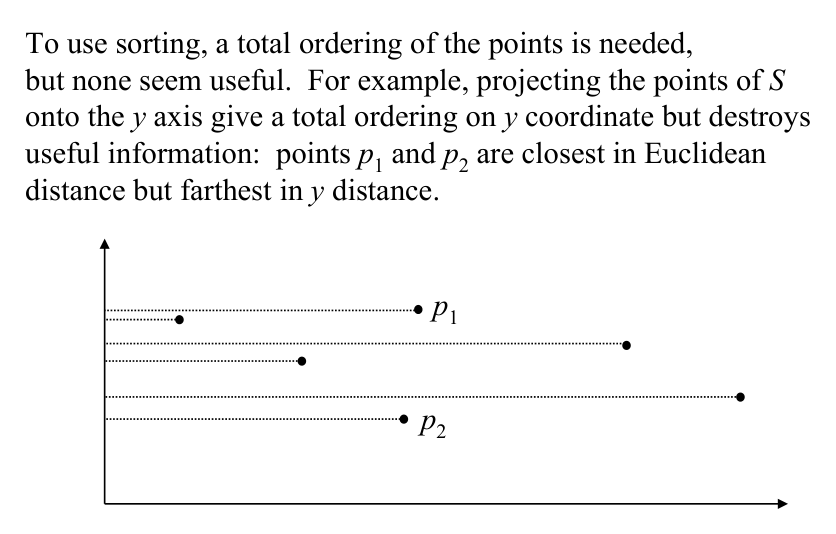

# Closest pair: problem setup and 1D version

## Scope
- **Slides:** pp. 308-313
- **Major topic folder:** proximity
- **Recording files touching this material:** CS 564 - 03.13 15.2.txt, CS 564 - 03.25 16.1.txt, Mar 13, 2.34 PM​.txt
- **Goal of this file:** You should be able to study this topic without reopening the slide deck.

## Big picture
This file sets up the closest-pair algorithm by solving the easy 1D case first and then using divide and conquer as the template for 2D.

## What you must know cold
- Closest pair problem statement.
- 1D closest pair after sorting: adjacent points only need to be checked.
- How divide and conquer splits the 2D set by median x-coordinate.

## Core ideas and reasoning
- In 1D, once points are sorted, the closest pair must be adjacent in sorted order.
- This suggests that order structure can drastically reduce comparisons.
- In 2D, divide into left and right halves, solve recursively, then handle cross-border pairs in the merge step.

## Figures to actually look at
These are cropped from the main slide PDF. Do not skip them.

### Figure from slide p. 308


## Slide-by-slide digestion

### p. 308 - CLOSEST PAIR
- INSTANCE: Set S = {p1, p2, ..., pN} of N points in the plane.
- QUESTION: Determine the two points of S whose mutual
- distance is smallest.
- We’ve seen a proof that CLOSEST PAIR has a lower bound for
- time ∈Ω(N log N).
- We seek an algorithm with upper bound ∈O(N log N).
- If found, these together imply that CLOSEST PAIR ∈θ(N log N).
- Two algorithm paradigms come to mind for O(N log N):
- 1. Sorting
- 2. Divide-and-conquer

### p. 309 - Using the divide-and-conquer paradigm,
- time in O(N log N) can be achieved by:
- 1. Dividing the problem into two equal-sized subproblems
- 2. Solving those subproblems recursively
- 3. Merging the subproblem solutions into an overall solution
- in linear O(N) time.
- Unfortunately, it is not immediately obvious how
- to perform the merge in linear time.
- Suppose the problem has been solved for subproblem sets S1 and S2,
- where S1 ∪S2 = S, S1 ∩S2 = ∅, |S1| ≈|S2| ≈N/2;
- giving a closest pair of points for S1 and another for S2.

### p. 310 - We consider a divide-and-conquer algorithm for CLOSEST PAIR
- in 1 dimension (d = 1).
- Partition S, a set of points on a line, into two sets S1 and S2
- at some point m such that for every point p ∈S1 and q ∈S2, p < q.
- Solving CLOSEST PAIR recursively on S1 and S2
- separately produces {p1, p2}, the closest pair in S1,
- and {q1, q2}, the closest pair in S2.
- Let δ be the smallest distance found so far:
- δ = min(|p2 - p1|, |q2 - q1|)
- The closest pair in S is either {p1, p2} or {q1, q2}
- or some {p3, q3} with p3 ∈S1 and q3 ∈S2.

### p. 311 - Divide-and-conquer for d = 1, 2
- To check for such a point {p3, q3}, is it necessary to test
- every possible pair of points in S1 and S2?
- Note that if {p3, q3} is to be closer than δ (i.e., |q3 - p3| < δ),
- then both p3 and q3 must be within δ of m.
- How many points of S1 can lie within δ of m,
- i.e., within the interval (m - δ, m]?
- Because δ is the distance between the closest pair in either S1 or S2,
- a semi-closed interval of length δ can contain at most 1 point.
- For the same reason, there can be at most 1 point of S2
- within δ of m, i.e., in the interval [m, m + δ).

### p. 312 - procedure CPAIR1(S)
- Input: X[1:N], N points of S in one dimension.
- Output: δ, the distance between the two closest points.

```text
procedure CPAIR1(S)
  { X[1:N]: points of S sorted along the line; |S| = N }
begin
  if |S| = 1 then
    return δ ← ∞
  if |S| = 2 then
    return δ ← |X[2] - X[1]|
  Construct(S1, S2)   { split at median m: S1 = {p : p ≤ m}, S2 = {p : p > m} }
  δ1 ← CPAIR1(S1)
  δ2 ← CPAIR1(S2)
  δ ← min(δ1, δ2)
  { Combine: only points within δ of split m can improve δ; in 1D at most one per side }
  return δ
end
```

### p. 313 - Generalizing to d = 2
- Partition two dimensional set S into subsets S1 and S2
- such that every point of S1 lies to the left of every point of S2.
- To do so, cut S by vertical line l at the median x coordinate of S.
- Solve the problem recursively on S1 and S2.
- Let {p1, p2} be the closest pair in S1 and {q1, q2} in S2.
- δ1 = distance(p1,p2) and δ2 = distance(q1,q2)
- are the minimum separations in S1 and S2 respectively.
- δ = min(δ1, δ2)
- Proximity
- Closest pair, divide-and-conquer

## What you must be able to say or do in an exam
- State the input, output, preprocessing, and query/update model precisely.
- Explain the invariant or ordering that makes the method work.
- Trace the method by hand on a small example.
- Give the exact time and space bounds.
- Mention one edge case, degeneracy, or limitation.

## Complexity and performance facts
1D: O(N log N) by sorting then linear scan, or O(N) after presorted input.

## Common mistakes and danger points
- Do not assume sorting by one coordinate alone solves the 2D problem. The merge step is the real content.

## Professor emphasis from recordings
These points are distilled from the related recordings and focus on what the professor slowed down for, warned about, or connected to homework/exam reasoning.

- The 1D closest-pair version is used in lecture as the warm-up that makes the divide-and-conquer recurrence feel obvious before the 2D merge complication appears.

## Exam-style drills and answer skeletons
Existing drill reminders from the earlier pack:
- For points on a line, prove why only predecessor and successor can be closest candidates.
- Describe how an ordered structure can answer nearest-neighbor-on-a-line queries.
- Adapted from HW2-Q2: For points on one axis stored in a range tree, find the closest neighbor in O(log N), then augment the structure to answer in O(1).

### Closest-pair setup drill
**Question.** State the divide-and-conquer recurrence for closest pair and explain the easy 1D version completely.

**How to answer.** In 1D the closest pair is adjacent after sorting; in higher dimensions the merge is the hard part.

### Core exam drill
**Question.** State the problem solved by closest pair: problem setup and 1d version, describe preprocessing/query/update steps if any, and give the time and space bounds.

**How to answer.** An excellent answer names the input, the output, the invariant or ordering exploited by the method, and the exact asymptotic costs.

### Hand-trace drill
**Question.** Trace closest pair: problem setup and 1d version on a small example by hand and explain each comparison or structural change.

**How to answer.** On this course, being able to run the method on a picture matters more than writing vague slogans.

## Recap
### What you must know cold
- Closest pair problem statement.
- 1D closest pair after sorting: adjacent points only need to be checked.
- How divide and conquer splits the 2D set by median x-coordinate.
### Core test / key idea
- In 1D, once points are sorted, the closest pair must be adjacent in sorted order.
- This suggests that order structure can drastically reduce comparisons.
- In 2D, divide into left and right halves, solve recursively, then handle cross-border pairs in the merge step.
### Complexity
- 1D: O(N log N) by sorting then linear scan, or O(N) after presorted input.
### Common mistakes / danger points
- Do not assume sorting by one coordinate alone solves the 2D problem. The merge step is the real content.
### Professor emphasis (from recordings)
- The 1D closest-pair version is used in lecture as the warm-up that makes the divide-and-conquer recurrence feel obvious before the 2D merge complication appears.
## End-of-file summary
- Closest pair problem statement.
- 1D closest pair after sorting: adjacent points only need to be checked.
- How divide and conquer splits the 2D set by median x-coordinate.
- 1D: O(N log N) by sorting then linear scan, or O(N) after presorted input.
- Do not assume sorting by one coordinate alone solves the 2D problem. The merge step is the real content.
- The 1D closest-pair version is used in lecture as the warm-up that makes the divide-and-conquer recurrence feel obvious before the 2D merge complication appears.

## Everything related to this topic
- **Previous file in reading order:** [Proximity lower bounds and transformations](../04_Proximity/48_proximity-lower-bounds.md)
- **Next file in reading order:** [Closest pair: 2D merge step](../04_Proximity/50_closest-pair-2d-merge.md)
- **Source slide range:** pp. 308-313 of `comp_geometry_slides_new.pdf`
- **Related recordings:** CS 564 - 03.13 15.2.txt, CS 564 - 03.25 16.1.txt, Mar 13, 2.34 PM​.txt
- **Related homework-derived exam prompts included here:** Closest-pair setup drill
