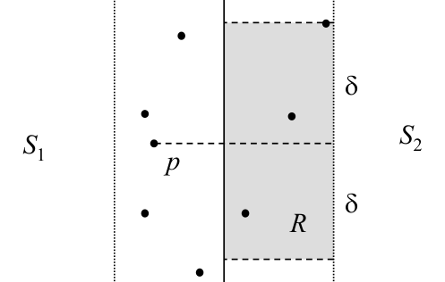
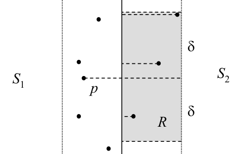

# Closest pair: 2D merge step

## Scope
- **Slides:** pp. 314-319
- **Major topic folder:** proximity
- **Recording files touching this material:** CS 564 - 03.13 15.2.txt, CS 564 - 03.25 16.1.txt, Mar 13, 2.34 PM​.txt
- **Goal of this file:** You should be able to study this topic without reopening the slide deck.

## Big picture
This is the heart of the closest-pair algorithm. The recursive halves are easy. The strip argument is where the theorem lives.

## What you must know cold
- After recursive calls return δ, only points within distance δ of the dividing line can form a cross pair.
- Sort or maintain strip points by y-coordinate.
- Each strip point needs to be compared with only a constant number of following points.

## Core ideas and reasoning
- Let δ = min(δ_L, δ_R). Any cross pair closer than δ must lie in the vertical strip of width 2δ around the divide.
- Within that strip, geometric packing shows each point needs comparison with only a bounded number of later points in y-order.
- That bounded-neighbor fact turns the merge from quadratic into linear.

## Figures to actually look at
These are cropped from the main slide PDF. Do not skip them.

### Figure from slide p. 315


### Figure from slide p. 317


## Slide-by-slide digestion

### p. 314 - Where is the closest pair?
- To perform the merge, it must be determined if there is a pair
- of points {p, q} such that p ∈ S1 and q ∈ S2 and distance(p, q) < δ.
- If such a pair exists, then p and q must both be within δ of l.
- Let P1 and P2 be vertical strips (regions) of the plane of width δ
- on either side of l.
- If {p, q} exists, p must be within P1 and q within P2.
- For d = 1, there was at most one candidate point for p and one for q.
- For d = 2, every point in S1 and S2 may be a candidate,
- as long as each is within δ of l.
- This seems to imply that O(N/2) ⋅ O(N/2) ∈ O(N2)

### p. 315 - Closing in on the closest pair
- But is it really necessary for some p ∈S1 and within P1,
- to determine the distance to every point q ∈S2 and within P2?
- No. We really only need to do so for those points
- that are within δ of p.
- Thus we can bound the portion of P2 to consider by that distance.
- The points to consider for a point p must lie within
- the δ × 2δ rectangle R.
- Proximity
- Closest pair, divide-and-conquer

### p. 316 - Distance computations required
- How many points can there be in rectangle R?
- Recall that no two points in P2 are closer than δ.
- Because rectangle R has size δ × 2δ,
- there can be at most 6 points within it;
- any more and they would be closer than δ, a contradiction.
- This means that for each of the O(N/2) points p ∈S1 within P1,
- only 6 points must be checked, not O(N/2) for each,
- so 6 ⋅O(N/2) = O(3N) ∈O(N) distance comparisons are needed
- in the merge step, not O(N2).
- ⇒An O(N log N) algorithm for CLOSEST PAIR is possible.

### p. 317 - Proximity
- Closest pair, divide-and-conquer
- Which points much be checked?
- Though an O(N log N) algorithm is possible, we do not have it yet.
- Though we know that for a point p, only 6 points within P2
- must be checked, we do not yet know which six.
- Project p and all the points of S2 within P2 onto l.
- Only the points within δ of p in that projection (y coordinate)
- need be considered; as seen, there will be ≤ 6.
- By sorting the points of S in order on y coordinate,
- the nearest neighbor candidates for a point p can be found

### p. 318 - Algorithm from Preparata, p. 198:
- 1. Partition S into two subsets, S1 and S2,
- about the vertical median line l.
- 2. Find the closest pair separations δ1 and δ2 recursively.
- 3. δ = min(δ1, δ2)
- 4. Let P1 be the set of points of S1 that are within δ of the
- dividing line l and let P2 be the corresponding subset of S2.
- Project P1 and P2 onto l and sort by y coordinate.
- Let P1
- * and P2
- * be the two sorted sequences, respectively.

### p. 319 - Merge process algorithm
- Preparata p. 199 says: “… when executing Step 4, extract the
- points from the list in sorted order in only O(N) time.”
- One way to assemble P1
- *, for example, follows.
- Let Y be the presorted points of S, i.e., an array of size N
- storing the points of S in order by ascending y coordinate;
- each entry has three fields: x, y, and active.
- Let P1
- * be an array of size N with two fields: index and y.

```text
1 for i = 1 to N /* Initialize P1
```

## What you must be able to say or do in an exam
- State the input, output, preprocessing, and query/update model precisely.
- Explain the invariant or ordering that makes the method work.
- Trace the method by hand on a small example.
- Give the exact time and space bounds.
- Mention one edge case, degeneracy, or limitation.

## Complexity and performance facts
Merge O(N) after maintaining the needed coordinate order; full recurrence gives O(N log N).

## Common mistakes and danger points
- Do not compare every strip point with every other strip point.
- The constant-neighbor argument depends on the recursive δ guarantee inside each half.

## Professor emphasis from recordings
These points are distilled from the related recordings and focus on what the professor slowed down for, warned about, or connected to homework/exam reasoning.

- The whole lecture pressure point is the merge step: without a linear merge, divide-and-conquer gives you an ugly algorithm instead of an optimal one.
- He emphasizes the packing argument in the strip. You are not allowed to just say 'check a few points'; you need the geometric reason that only a constant number matter.
- The sorted-by-y view is not an implementation detail. It is what lets the merge remain linear.
- Closest-pair merge pitfall: when extracting the 'active' points for the merge, mark only points in the strip (within the `delta` neighborhood of the dividing line), not every point from one recursive half.

## Exam-style drills and answer skeletons
Existing drill reminders from the earlier pack:
- State and justify the strip lemma used in the closest-pair merge step.
- Trace the merge step on a small point set and show which comparisons are actually made.
- Adapted from HW2-Q2: For points on one axis stored in a range tree, find the closest neighbor in O(log N), then augment the structure to answer in O(1).

### Closest-pair merge drill
**Question.** In the 2D closest-pair algorithm, explain why only a constant number of candidates per point need to be checked in the strip.

**How to answer.** Use the δ-by-2δ strip geometry and the packing argument. The proof is not optional on an exam.

### Core exam drill
**Question.** State the problem solved by closest pair: 2d merge step, describe preprocessing/query/update steps if any, and give the time and space bounds.

**How to answer.** An excellent answer names the input, the output, the invariant or ordering exploited by the method, and the exact asymptotic costs.

### Hand-trace drill
**Question.** Trace closest pair: 2d merge step on a small example by hand and explain each comparison or structural change.

**How to answer.** On this course, being able to run the method on a picture matters more than writing vague slogans.

## Recap
### What you must know cold
- After recursive calls return δ, only points within distance δ of the dividing line can form a cross pair.
- Sort or maintain strip points by y-coordinate.
- Each strip point needs to be compared with only a constant number of following points.
### Core test / key idea
- Let δ = min(δ_L, δ_R). Any cross pair closer than δ must lie in the vertical strip of width 2δ around the divide.
- Within that strip, geometric packing shows each point needs comparison with only a bounded number of later points in y-order.
- That bounded-neighbor fact turns the merge from quadratic into linear.
### Complexity
- Merge O(N) after maintaining the needed coordinate order; full recurrence gives O(N log N).
### Common mistakes / danger points
- Do not compare every strip point with every other strip point.
- The constant-neighbor argument depends on the recursive δ guarantee inside each half.
### Professor emphasis (from recordings)
- The whole lecture pressure point is the merge step: without a linear merge, divide-and-conquer gives you an ugly algorithm instead of an optimal one.
- He emphasizes the packing argument in the strip. You are not allowed to just say 'check a few points'; you need the geometric reason that only a constant number matter.
- The sorted-by-y view is not an implementation detail. It is what lets the merge remain linear.
- Closest-pair merge pitfall: when extracting the 'active' points for the merge, mark only points in the strip (within the `delta` neighborhood of the dividing line), not every point from one recursive half.
## End-of-file summary
- After recursive calls return δ, only points within distance δ of the dividing line can form a cross pair.
- Sort or maintain strip points by y-coordinate.
- Each strip point needs to be compared with only a constant number of following points.
- Merge O(N) after maintaining the needed coordinate order; full recurrence gives O(N log N).
- Do not compare every strip point with every other strip point.
- The constant-neighbor argument depends on the recursive δ guarantee inside each half.

## Everything related to this topic
- **Previous file in reading order:** [Closest pair: problem setup and 1D version](../04_Proximity/49_closest-pair-setup-1d.md)
- **Next file in reading order:** [Closest pair: analysis and higher dimensions](../04_Proximity/51_closest-pair-analysis.md)
- **Source slide range:** pp. 314-319 of `comp_geometry_slides_new.pdf`
- **Related recordings:** CS 564 - 03.13 15.2.txt, CS 564 - 03.25 16.1.txt, Mar 13, 2.34 PM​.txt
- **Related homework-derived exam prompts included here:** Closest-pair merge drill
