# Computational Geometry midterm pack - complete markdown version

This pack is meant to stand on its own. The markdown files now include slide digestion, embedded figure crops from the main PDF, professor emphasis pulled from recordings when the transcript made one clear, and homework-style exam prompts placed in the relevant topic files.

## Scope
- Main source: `comp_geometry_slides_new.pdf`
- Included pages: **9-321** only
- Supporting sources folded in: lecture recording transcripts and the assigned homeworks

How to study
- Read files in numeric order.
- In each file, do not just skim the summary. Study the slide-by-slide notes, then the `What you must be able to say/do in an exam` section, then the exam drills at the end.
- For algorithm files, memorize: problem statement, data structure, algorithm steps, invariant/correctness idea, and time/space bounds.
- For proof/lower-bound files, memorize the exact direction of the reduction or counting argument. Humans love reversing reductions and then acting surprised on exam day.

Reading order
1. [Coordinate systems and basic geometric entities](01_Foundations/01_coordinate-systems-and-basic-entities.md) - pp. 9-18
2. [Polygonal geometry, convexity, planarity, and polyhedra](01_Foundations/02_polygonal-geometry-planarity-and-polyhedra.md) - pp. 19-28
3. [Computational models and complexity language](01_Foundations/03_models-and-complexity-language.md) - pp. 29-37
4. [Segment trees as a warm-up search structure](01_Foundations/04_segment-trees.md) - pp. 38-44
5. [Planar straight-line graphs and face-edge structure](01_Foundations/05_pslg-basics.md) - pp. 45-46
6. [DCEL representation and auxiliary structures](01_Foundations/06_dcel.md) - pp. 47-51
7. [Vector algebra and trigonometric groundwork](01_Foundations/07_vectors-and-trig-groundwork.md) - pp. 52-57
8. [Orientation tests and signed-area interpretation](01_Foundations/08_orientation-and-signed-area.md) - pp. 58-62
9. [Primitive formulas and summary](01_Foundations/09_primitive-formulas-summary.md) - pp. 63-65
10. [Search problem taxonomy and inclusion basics](02_Geometric_Search/10_search-taxonomy.md) - pp. 66-69
11. [Convex polygon inclusion by left test](02_Geometric_Search/11_convex-inclusion-left-test.md) - pp. 70-71
12. [Simple polygon inclusion by intersection counting](02_Geometric_Search/12_simple-polygon-inclusion-ray-shooting.md) - pp. 72-74
13. [Convex polygon inclusion by wedges](02_Geometric_Search/13_convex-inclusion-by-wedges.md) - pp. 75-77
14. [Star-shaped polygon inclusion by wedges](02_Geometric_Search/14_star-shaped-inclusion-by-wedges.md) - pp. 78-79
15. [Point location by slab decomposition](02_Geometric_Search/15_point-location-slab-method.md) - pp. 80-85
16. [Plane sweep as a recurring paradigm](02_Geometric_Search/16_plane-sweep-paradigm.md) - pp. 86-90
17. [Chain method: basics, definitions, and query idea](02_Geometric_Search/17_chain-method-basics-and-query.md) - pp. 91-101
18. [Chain method: regular PSLGs and constructing the chain family](02_Geometric_Search/18_chain-method-constructing-chains.md) - pp. 102-109
19. [Chain method: regularization of arbitrary PSLGs](02_Geometric_Search/19_chain-method-regularization.md) - pp. 110-115
20. [Chain method: analysis and wrap-up](02_Geometric_Search/20_chain-method-analysis.md) - pp. 116-117
21. [Triangle refinement: setup and triangulation](02_Geometric_Search/21_triangle-refinement-setup.md) - pp. 118-122
22. [Triangle refinement: hierarchy, query, storage, and analysis](02_Geometric_Search/22_triangle-refinement-query-and-analysis.md) - pp. 123-134
23. [Range searching: problem statement and design space](02_Geometric_Search/23_range-searching-intro.md) - pp. 135-137
24. [Grid method](02_Geometric_Search/24_grid-method.md) - pp. 138-141
25. [Quadtree method](02_Geometric_Search/25_quadtree-method.md) - pp. 142-151
26. [k-d tree method](02_Geometric_Search/26_kd-tree-method.md) - pp. 152-160
27. [Direct access methods](02_Geometric_Search/27_direct-access-methods.md) - pp. 161-173
28. [Range trees](02_Geometric_Search/28_range-trees.md) - pp. 174-179
29. [Range searching summary](02_Geometric_Search/29_range-searching-summary.md) - pp. 180-180
30. [Convex hull motivation and why the topic matters](03_Convex_Hulls/30_convex-hull-motivation.md) - pp. 181-182
31. [Convex hull intuition and preliminaries](03_Convex_Hulls/31_convex-hull-intuition.md) - pp. 183-185
32. [Convex combinations and dimension-sensitive definitions](03_Convex_Hulls/32_convex-combinations-and-dimension.md) - pp. 186-189
33. [Equivalent formulations and problem statement](03_Convex_Hulls/33_convex-hull-equivalent-formulations.md) - pp. 190-195
34. [Lower bound for convex hull via reduction from sorting](03_Convex_Hulls/34_convex-hull-lower-bound.md) - pp. 196-201
35. [Extreme points algorithm](03_Convex_Hulls/35_extreme-points-algorithm.md) - pp. 202-205
36. [Graham’s scan: concept and preparation](03_Convex_Hulls/36_graham-scan-algorithm.md) - pp. 206-214
37. [Graham’s scan: analysis, upper-lower hull view, and summary](03_Convex_Hulls/37_graham-scan-analysis.md) - pp. 215-219
38. [Jarvis march (gift wrapping) in 2D](03_Convex_Hulls/38_jarvis-march.md) - pp. 220-224
39. [Quickhull](03_Convex_Hulls/39_quickhull.md) - pp. 225-234
40. [Divide-and-conquer convex hulls and hull union](03_Convex_Hulls/40_divide-and-conquer-hull.md) - pp. 235-241
41. [Supporting lines from hull union](03_Convex_Hulls/41_supporting-lines.md) - pp. 242-244
42. [Dynamic/on-line convex hull insertion: problem setting and core idea](03_Convex_Hulls/42_dynamic-hull-core-idea.md) - pp. 245-253
43. [Dynamic/on-line convex hull insertion: data structure, search, update, and analysis](03_Convex_Hulls/43_dynamic-hull-data-structure.md) - pp. 254-263
44. [Gift wrapping in higher dimensions: background and setup](03_Convex_Hulls/44_higher-dimensional-hull-background.md) - pp. 264-271
45. [Gift wrapping in higher dimensions: algorithm and adjacent facets](03_Convex_Hulls/45_higher-dimensional-hull-algorithm.md) - pp. 272-279
46. [Gift wrapping in higher dimensions: supporting hyperplanes, initialization, candidates, and analysis](03_Convex_Hulls/46_higher-dimensional-hull-init-analysis.md) - pp. 280-289
47. [Proximity problem family: survey and relations](04_Proximity/47_proximity-problem-survey.md) - pp. 290-299
48. [Proximity lower bounds and transformations](04_Proximity/48_proximity-lower-bounds.md) - pp. 300-307
49. [Closest pair: problem setup and 1D version](04_Proximity/49_closest-pair-setup-1d.md) - pp. 308-313
50. [Closest pair: 2D merge step](04_Proximity/50_closest-pair-2d-merge.md) - pp. 314-319
51. [Closest pair: analysis and higher dimensions](04_Proximity/51_closest-pair-analysis.md) - pp. 320-321

## Folder map
- `convex-hulls/`
- `geometric-objects-notation-and-asymptotic-preliminaries/`
- `geometric-search/`
- `proximity/`
- `pslgs-dcels-vectors-and-geometric-primitives/`
- `images/` for figure crops used inside the notes

---

# Coordinate systems and basic geometric entities

## Scope
- **Slides:** pp. 9-18
- **Major topic folder:** geometric-objects-notation-and-asymptotic-preliminaries
- **Recording files touching this material:** CS 564 - 01.23 1.1.txt, CS 564 - 01.28 2.1.txt
- **Goal of this file:** You should be able to study this topic without reopening the slide deck.

Big picture
This file is the foundation layer. The slides fix the language used everywhere else: what a point is, what a segment is, how a line is represented, and how dimension is written. If this part is shaky, later algorithms look magical when they are really just repeated uses of clean representations.

## What you must know cold
- Cartesian coordinates in d dimensions, and why d is part of the object model, not decoration.
- Difference between a line, a line segment, and a point as geometric objects.
- Parametric line equation and the meaning of restricting the parameter to [0,1] for a segment.
- Plane and axis-parallel / rectilinear rectangles as standard objects used in search problems.

Core ideas and reasoning
- A point in d-space is an ordered d-tuple. This is the data representation that lets algorithms compare, sort, and test geometry.
- A line through p0 and p1 is represented parametrically as $p(\alpha)=p_0+\alpha(p_1-p_0)$. The segment is the same expression with 0 ≤ α ≤ 1.
- The parametric view is more useful than slope-intercept form in geometry algorithms because vertical lines do not need a special case.
- Later primitive tests such as point-line classification and segment intersection reduce to this representation.

Figures to actually look at
These are cropped from the main slide PDF. Do not skip them.

### Figure from slide p. 17
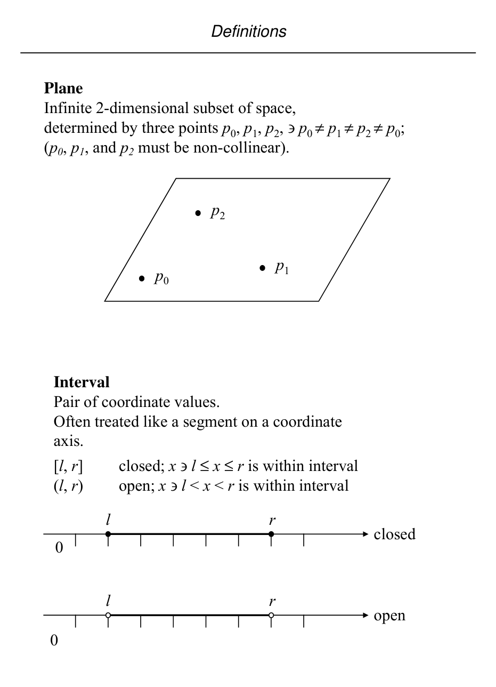

### Figure from slide p. 18


## Slide-by-slide digestion

### p. 9 - Definitions
- Coordinate systems and dimensions
- The objects considered in Computational Geometry are points,
- lines, line segments, polygons, polyhedron, hyper-rectangles,
- etc.
- A coordinate system provides a means to specify positions
- or points in space.
- The Cartesian coordinate system labels a d-dimensional space
- with d mutually perpendicular (orthogonal) coordinate axes,
- one per dimension.
- d-dimensional space (d-space)

p. 10 - Definitions
- Point
- Object with d dimensions and 0 extent.
- Location in d-space.
- Given as an ordered sequence of d coordinates.
- d = 1
- (x) or x
- d = 2
- d = 3
- (x, y, z)
- d ≥4

p. 11 - Definitions
- Segment
- Finite 1-dimensional subset of a line,
- determined by two endpoints p0, p1.
- Ray
- Infinite 1-dimensional subset of a line
- determined by two points p0, p1 ∋p0 ≠p1,
- where one point is denoted as the endpoint.

p. 12 - Point-Line classification
- We now consider the geometric primitive operation of
- classifying a point w.r.t. a line (both in the plane).
- A directed line segment partitions the plane into 7
- non-overlapping regions. The possibilities are shown below.
- The problem, given p0, p1, and p2, is to determine which
- region p2 lies in.
- beyond
- left
- terminus
- origin

p. 13 - Parametric equation of a line
- We use the following equation of a line:
- line = {α(p0) + (1 - α)(p1) }, where α ∈ ℜ(real numbers)
- where p0 and p1 as usual are the points determining the line.
- p0 = (x0, y0)
- p1 = (x1, y1)
- Substituting gives
- {α(x0, y0) + (1 - α)(x1, y1) }
- Multiplying through gives the coordinates
- {αx0 + (1 - α)x1, αy0 + (1 - α)y1 }
- W k

p. 14 - Line Segment
- A line segment is a closed subset of a line
- contained between two points which are
- called the end points. The subset is closed in
- the sense that it includes the end points.
- The equation of the line segment is the same
- as the parametric equation of a line with the
- restriction that α has the value $0 \le \alpha \le 1$.
- This is also called the convex combination
- of the two end points.

p. 15 - Explicit Form of Line Equation
- y= mx +c
- m=slope=tanθ, where θ is the angle
- made by the line with positive x-axis
- c=intercept of the line with the y-axis.
- Vertical line with x=k cannot be represented
- since these lines have infinite slopes.
- Expressed in terms of the coordinates of two
- points on the line (x1,y1) and (x2,y2), we can
- write
- y=[(y2-y1)/(x2-x1)] x + (y1x2 -y2x1)/(x2-x1)

p. 16 - can be specified as
- Ax + By + C = 0
- where A, B and C are constants. A
- vertical line is simply a line with B=0.
- Note the coefficients are not unique; for
- a given constant k, kA, kB and kC will
- give the same line.
- In general, in a d-dimension, given a set
- of k points p1, p2, .., pk, the set of points
- p= α1 p1+ α2 p2+….+ ακ pk
- such that the α−coefficients are real and

p. 17 - Definitions
- Plane
- Infinite 2-dimensional subset of space,
- determined by three points p0, p1, p2, ∋ p0 ≠ p1 ≠ p2 ≠ p0;
- (p0, p1, and p2 must be non-collinear).
- Interval
- Pair of coordinate values.
- Often treated like a segment on a coordinate
- axis.
- [l, r]
- closed; x ∋l ≤x ≤r is within interval

p. 18 - Definitions
- Rectilinear or axis-parallel rectangle
- Rectangle
- Quadrilateral with opposite sides parallel and only right angles.
- π/2
- We will use degrees or
- radians, as convenient.
- Rectilinear or axis parallel rectangle
- Cartesian product of d intervals.
- 2-rectangle or simply rectangle

What you must be able to say or do in an exam
- Give the precise definitions.
- Distinguish similar notions cleanly.
- Use the right primitive test or formula on a concrete example.

Complexity and performance facts
No main algorithm here. What matters is having constant-time primitive operations and a representation that avoids unnecessary case splits.

## Common mistakes and danger points
- Do not mix up affine combination (any real α) with convex combination (restricted coefficients).
- Do not assume every line has a slope; vertical-line special cases are exactly why parametric form is preferred.

Exam-style drills and answer skeletons
### Definition drill
**Question.** Give the precise definitions and the most important consequences from coordinate systems and basic geometric entities.

**How to answer.** A strong answer distinguishes similar objects and uses the course terminology exactly.

## Recap
### What you must know cold
- Cartesian coordinates in d dimensions, and why d is part of the object model, not decoration.
- Difference between a line, a line segment, and a point as geometric objects.
- Parametric line equation and the meaning of restricting the parameter to [0,1] for a segment.
- Plane and axis-parallel / rectilinear rectangles as standard objects used in search problems.
Core test / key idea
- A point in d-space is an ordered d-tuple. This is the data representation that lets algorithms compare, sort, and test geometry.
- A line through p0 and p1 is represented parametrically as $p(\alpha)=p_0+\alpha(p_1-p_0)$. The segment is the same expression with 0 ≤ α ≤ 1.
- The parametric view is more useful than slope-intercept form in geometry algorithms because vertical lines do not need a special case.
- Later primitive tests such as point-line classification and segment intersection reduce to this representation.
Complexity
- No main algorithm here. What matters is having constant-time primitive operations and a representation that avoids unnecessary case splits.
Common mistakes / danger points
- Do not mix up affine combination (any real α) with convex combination (restricted coefficients).
- Do not assume every line has a slope; vertical-line special cases are exactly why parametric form is preferred.
End-of-file summary
- Cartesian coordinates in d dimensions, and why d is part of the object model, not decoration.
- Difference between a line, a line segment, and a point as geometric objects.
- Parametric line equation and the meaning of restricting the parameter to [0,1] for a segment.
- No main algorithm here. What matters is having constant-time primitive operations and a representation that avoids unnecessary case splits.
- Do not mix up affine combination (any real α) with convex combination (restricted coefficients).
- Do not assume every line has a slope; vertical-line special cases are exactly why parametric form is preferred.

Everything related to this topic
- **Next file in reading order:** [Polygonal geometry, convexity, planarity, and polyhedra](01_Foundations/02_polygonal-geometry-planarity-and-polyhedra.md)
- **Source slide range:** pp. 9-18 of `comp_geometry_slides_new.pdf`
- **Related recordings:** CS 564 - 01.23 1.1.txt, CS 564 - 01.28 2.1.txt
- **Related homework-derived exam prompts included here:** none directly mapped; generic exam drills added instead


---

# Polygonal geometry, convexity, planarity, and polyhedra

## Scope
- **Slides:** pp. 19-28
- **Major topic folder:** geometric-objects-notation-and-asymptotic-preliminaries
- **Recording files touching this material:** CS 564 - 01.23 1.1.txt, CS 564 - 01.28 2.1.txt
- **Goal of this file:** You should be able to study this topic without reopening the slide deck.

Big picture
This section tells you what kinds of geometric structures the course is willing to call legal. A surprising amount of later correctness depends on these definitions being exact.

## What you must know cold
- Simple polygon vs non-simple polygon, and why only a simple closed curve gives a clean inside/outside notion.
- Convex polygon definition in two equivalent forms: every internal segment stays inside, or every interior angle is less than π.
- Planar graph, planar embedding, faces, and the intuition behind Euler-style counting.
- Polyhedron and the analogue of simplicity / convexity in 3D.

Core ideas and reasoning
- A polygon is not just the ordered list of vertices; it is the region bounded by the edges when the edges form a simple closed curve.
- Convexity is a structural property, not a visual vibe. The segment test and the interior-angle test are the important equivalent formulations.
- A planar embedding subdivides the plane into faces. This is what later point-location and DCEL algorithms are built on.
- In 3D, the analogous objects are polyhedra and their faces, edges, and vertices.

Figures to actually look at
These are cropped from the main slide PDF. Do not skip them.

### Figure from slide p. 22


### Figure from slide p. 28
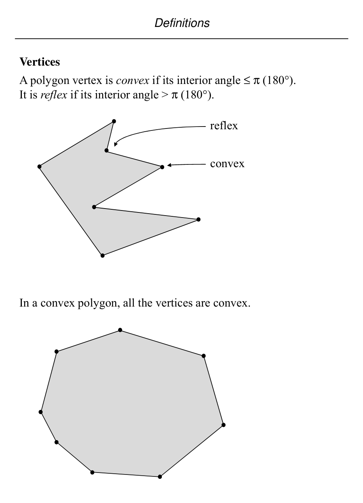

## Slide-by-slide digestion

### p. 19 - Definitions
- Dimensional prefixes on geometric object names
- No prefix “d-” means usual or expected number of dimensions
- for the object.
- rectangle = 2-rectangle
- cube = 3-cube
- Prefix “hyper-” means d is unspecified and it may be more than
- the usual number of dimensions for that object.
- hyper-rectangle = d-rectangle, d unspecified
- “d-dimensional rectilinear hyper-rectangle”

p. 20 - Definitions
- Polygons
- O’Rourke, pp. 1-2
- A polygon is the region of a plane bounded by a finite set of
- segments forming a simple closed curve.
- (Note that we are working in d = 2 by definition.)
- Let v0, v1, ..., vN-1 be N points in the plane; the points are
- called vertices.
- Let e0 = v0v1, e1 = v1v2, ..., eN-1 = vN-1v0 be N segments
- connecting the points; the segments are called edges.
- The edges bound a polygon iff the intersection of each pair

p. 21 - Definitions
- Interior and exterior
- Jordan curve theorem. Every simple closed plane curve
- divides the plane into two parts.
- Exterior
- Interior
- Boundary
- Polygon = interior ∪boundary
- If we are interested in just the interior or just the boundary,
- they will be referred to as such.
- (Same as true for other similar objects, e.g., rectangle.)

p. 22 - Definitions
- Polygon
- Not vertices
- Simple polygon
- A polygon is simple iff non-adjacent edges do not intersect.
- ei ∩ej = ∅for all 0 ≤j, i ≤N - 1 and j ≠i + 1.
- Non-simple
- Simple (planar
- version of above)

p. 23 - Definitions
- In computational geometry, the relative geometric positions
- matter, the edges do not correspond to abstract relations, as
- in Graph Theory.
- Convex polygon
- A polygon is convex if and only if for any two points in the
- polygon (interior ∪ boundary), the segment connecting the points
- is entirely within the polygon.
- convex
- not convex

p. 24 - Convex Set
- Let p and q be two arbitrary points in a
- d-dimensional Euclidean space belonging
- to a set of points C. Then C is said to be
- convex if for all pairs (p, q) in C, the set
- of points
- [p + (1- α)q] ε C for $0 \le \alpha \le 1$
- That is, if two points p and q belong to C,
- then the set of points on the line segments
- connecting p and q also belong to C.
- When d=2, the points belong to a convex

p. 25 - Planar Graph
- A graph G(V,E) is planar if it can be embedded
- in a plane without crossings.
- A straight line planar embedding of a planar
- graph determines a partition of the plane called
- planar subdivisions or a map.
- Let v= number of vertices, e= number of
- edges and f=number of faces.
- Theorem (Euler) : v - e + f = 2
- Proof: A simple polygon has always v=e and
- f=2 (interior and exterior).

p. 26 - creates one extra face. v remains same, e becomes
- e+1 and f becomes f+1. So the equation remains
- valid. If a chain is used with t new vertices and
- necessarily with t+1 edges, we have v becomes
- v+t, e becomes e+t+1 and f becomes f+1. So, the
- Euler’s formula still remains valid.
- chord
- chain
- It can also be shown that for any planar graph,
- e <= 3v -6. Using Euler’s formula, we then
- have f <= 2/3 e and f <= 2v-4, giving the upper

p. 27 - Polyhedron
- In 3-d Euclidean space, a polyhedron is defined
- to be a finite set of planar polygons such that every
- edge of the polygon is shared by exactly one other
- neighboring polygon and no subset of polygons
- has the same property (to avoid union of polygons).
- Edges and vertices have usual meaning. The
- polygons are called the facets of the polyhedron.
- A polyhedron is simple if there is no pair of
- non-adjacent facets sharing a point. A simple
- polyhedron partitions the 3-d space into two

p. 28 - Definitions
- Vertices
- A polygon vertex is convex if its interior angle ≤ π (180°).
- It is reflex if its interior angle > π (180°).
- convex
- In a convex polygon, all the vertices are convex.

What you must be able to say or do in an exam
- Give the precise definitions.
- Distinguish similar notions cleanly.
- Use the right primitive test or formula on a concrete example.

Complexity and performance facts
No main complexity result, but this section sets up the combinatorial objects that later algorithms store and search.

## Common mistakes and danger points
- A self-intersecting polygon does not have a clean single interior in the sense used by these algorithms.
- Do not use “planar graph” and “specific straight-line embedding” as synonyms. The embedding matters.

Exam-style drills and answer skeletons
### Definition drill
**Question.** Give the precise definitions and the most important consequences from polygonal geometry, convexity, planarity, and polyhedra.

**How to answer.** A strong answer distinguishes similar objects and uses the course terminology exactly.

## Recap
### What you must know cold
- Simple polygon vs non-simple polygon, and why only a simple closed curve gives a clean inside/outside notion.
- Convex polygon definition in two equivalent forms: every internal segment stays inside, or every interior angle is less than π.
- Planar graph, planar embedding, faces, and the intuition behind Euler-style counting.
- Polyhedron and the analogue of simplicity / convexity in 3D.
Core test / key idea
- A polygon is not just the ordered list of vertices; it is the region bounded by the edges when the edges form a simple closed curve.
- Convexity is a structural property, not a visual vibe. The segment test and the interior-angle test are the important equivalent formulations.
- A planar embedding subdivides the plane into faces. This is what later point-location and DCEL algorithms are built on.
- In 3D, the analogous objects are polyhedra and their faces, edges, and vertices.
Complexity
- No main complexity result, but this section sets up the combinatorial objects that later algorithms store and search.
Common mistakes / danger points
- A self-intersecting polygon does not have a clean single interior in the sense used by these algorithms.
- Do not use “planar graph” and “specific straight-line embedding” as synonyms. The embedding matters.
End-of-file summary
- Simple polygon vs non-simple polygon, and why only a simple closed curve gives a clean inside/outside notion.
- Convex polygon definition in two equivalent forms: every internal segment stays inside, or every interior angle is less than π.
- Planar graph, planar embedding, faces, and the intuition behind Euler-style counting.
- No main complexity result, but this section sets up the combinatorial objects that later algorithms store and search.
- A self-intersecting polygon does not have a clean single interior in the sense used by these algorithms.
- Do not use “planar graph” and “specific straight-line embedding” as synonyms. The embedding matters.

Everything related to this topic
- **Previous file in reading order:** [Coordinate systems and basic geometric entities](01_Foundations/01_coordinate-systems-and-basic-entities.md)
- **Next file in reading order:** [Computational models and complexity language](01_Foundations/03_models-and-complexity-language.md)
- **Source slide range:** pp. 19-28 of `comp_geometry_slides_new.pdf`
- **Related recordings:** CS 564 - 01.23 1.1.txt, CS 564 - 01.28 2.1.txt
- **Related homework-derived exam prompts included here:** none directly mapped; generic exam drills added instead


---

# Computational models and complexity language

## Scope
- **Slides:** pp. 29-37
- **Major topic folder:** geometric-objects-notation-and-asymptotic-preliminaries
- **Recording files touching this material:** CS 564 - 01.23 1.1.txt, CS 564 - 01.28 2.1.txt
- **Goal of this file:** You should be able to study this topic without reopening the slide deck.

Big picture
This is the meta-language for the entire midterm. Nearly every proof or comparison later says preprocessing, query time, output size, or worst case. This file is where those words are defined precisely.

## What you must know cold
- Problem vs algorithm. Lower bounds belong to problems, not to your current favorite algorithm.
- Asymptotic notation as set-based growth classes, used to compare algorithms.
- Different cost components: preprocessing, storage, single query time, total reporting time.
- Difference between counting problems and reporting problems, and why output size matters.

Core ideas and reasoning
- Geometric data structures often spend time up front to organize a static set, then answer many queries fast.
- For reporting problems the true running time is often something like O(f(n) + k), where k is the number of reported answers.
- Worst-case analysis is the default unless the slides or theorem explicitly say average / expected.

Figures to actually look at
These are cropped from the main slide PDF. Do not skip them.

### Figure from slide p. 29


### Figure from slide p. 32


## Slide-by-slide digestion

### p. 29 - Example problem
- RANGE SEARCHING
- Given N points in the plane, how many lie in a given rectangle with
- sides parallel to the coordinate axes? That is, how many points
- (x, y) satisfy lx ≤x ≤rx, ly ≤y ≤ry, for given lx, rx, ly, ry?
- The range searching problem is (informally) defined above.
- In this example, the instance of the range searching problem is a
- particular set of points and a particular range.
- In an instance like this, the points are the data set.

p. 30 - Algorithms and models of computation
- We are interested in efficient algorithms for geometric problems.
- Efficiency is evaluated in terms of computational cost,
- given as a function of the size of the instance of the problem.
- By convention, notation N denotes input instance size.
- To determine the computational cost of an algorithm,
- we must know what primitive operations are available and
- what they cost. This is a model of computation.
- Turing machine: too primitive
- C language on Unix workstation: too specific
- We will use a highly abstract model, the familiar random-access

p. 31 - Order notation
- We are interested in the amount of time and memory used by
- algorithms, as a function of the input instance size N.
- “Worst case” or Upper bound
- O(f(N)) denotes the set of all functions g(N) such that there exist
- positive constants C and N0 with g(N) ≤Cf(N) for all N ≥ N0.
- “Best case” or Lower Bound
- Ω(f(N)) denotes the set of all functions g(N) such that there exist
- positive constants C and N0 with g(N) ≥Cf(N) for all N ≥ N0.
- “Optimal case” Or Optimal Bound
- θ(f(N)) denotes the set of all functions g(N) such that there exist

p. 32 - Example analysis
- SEGMENT INTERSECTION COUNTING
- INSTANCE: Set S = {s1, s2, ..., sN} of line segments in the plane.
- QUESTION: Count the number of intersections of segments in S.

p. 33 - Example analysis
- SEGMENT INTERSECTION COUNTING
- INSTANCE: Set S = {s1, s2, ..., sN} of line segments in the plane.
- QUESTION: Count the number of intersections of segments in S.

```text
procedure SegmentIntersectionCounting(S)
begin
count = 0
for i = 1 to N
for j = 1 to N
if i ≠j and si ∩sj ≠∅
count = count + 1
```

### p. 34 - Algorithmic complexity measures
- Preprocessing. Time spent organizing the data set, usually into
- some data structure. Less important than query and storage.
- Query. Time spent producing the answer for a query relative to
- the data set.
- Storage. Memory required for static and dynamic data structures
- used by the query algorithm.
- Single shot vs. repetitive-mode
- Single shot. Given a single data set and a single query, produce an
- answer one time. Almost always best handled by scan of data
- set; no preprocessing, query O(N), storage O(N).

p. 35 - Counting vs. reporting
- Counting. Determine the number of objects in the data set that
- satisfy the query.
- Reporting. Report (list, identify) the objects that satisfy the
- query.
- For example, consider the standard range search problem:
- RANGE SEARCHING.
- INSTANCE: Set S = {p1, p2, ..., pN}, pi = (xi, yi) of points in the
- plane, and rectangle R = [lx, rx] × [ly, ry] in the plane.
- Preliminaries
- [ x,

p. 36 - Output sensitive or report-mode algorithms
- The time complexity of algorithms is often expressed as a
- function of input data set size, e.g. O(N log N). Reporting
- problems can have query time complexity that is output sensitive.
- Output-sensitive example
- INTERVAL ENCLOSURE
- INSTANCE: Set S = {x1, x2, ..., xN} of points on the
- number line (x-axis), and an interval Q = [l, r].
- QUESTION: Which points of S are within Q, i.e. l ≤xi ≤ r?
- Naive repetitive mode algorithm and analysis.
- Preliminaries

p. 37 - Average Complexity: observed complexity in
- practice.
- Space or Storage Complexity.
- Pre-processing Cost: trade-off between space
- and time complexity with or without
- pre-processing.
- Amortized Cost: average over expensive and
- inexpensive operations.
- Normalization
- It will sometimes be useful to have available normalized
- values for coordinates. For a coordinate value x, its

What you must be able to say or do in an exam
- Give the precise definitions.
- Distinguish similar notions cleanly.
- Use the right primitive test or formula on a concrete example.

Complexity and performance facts
This section is itself complexity language: separate preprocessing, storage, and query complexity whenever you describe a data structure.

## Common mistakes and danger points
- Do not write “the lower bound of Graham scan is …”. Lower bounds are for convex hull as a problem.
- Do not forget output size when a query reports many objects.

Exam-style drills and answer skeletons
### Definition drill
**Question.** Give the precise definitions and the most important consequences from computational models and complexity language.

**How to answer.** A strong answer distinguishes similar objects and uses the course terminology exactly.

## Recap
### What you must know cold
- Problem vs algorithm. Lower bounds belong to problems, not to your current favorite algorithm.
- Asymptotic notation as set-based growth classes, used to compare algorithms.
- Different cost components: preprocessing, storage, single query time, total reporting time.
- Difference between counting problems and reporting problems, and why output size matters.
Core test / key idea
- Geometric data structures often spend time up front to organize a static set, then answer many queries fast.
- For reporting problems the true running time is often something like O(f(n) + k), where k is the number of reported answers.
- Worst-case analysis is the default unless the slides or theorem explicitly say average / expected.
Complexity
- This section is itself complexity language: separate preprocessing, storage, and query complexity whenever you describe a data structure.
Common mistakes / danger points
- Do not write “the lower bound of Graham scan is …”. Lower bounds are for convex hull as a problem.
- Do not forget output size when a query reports many objects.
End-of-file summary
- Problem vs algorithm. Lower bounds belong to problems, not to your current favorite algorithm.
- Asymptotic notation as set-based growth classes, used to compare algorithms.
- Different cost components: preprocessing, storage, single query time, total reporting time.
- This section is itself complexity language: separate preprocessing, storage, and query complexity whenever you describe a data structure.
- Do not write “the lower bound of Graham scan is …”. Lower bounds are for convex hull as a problem.
- Do not forget output size when a query reports many objects.

Everything related to this topic
- **Previous file in reading order:** [Polygonal geometry, convexity, planarity, and polyhedra](01_Foundations/02_polygonal-geometry-planarity-and-polyhedra.md)
- **Next file in reading order:** [Segment trees as a warm-up search structure](01_Foundations/04_segment-trees.md)
- **Source slide range:** pp. 29-37 of `comp_geometry_slides_new.pdf`
- **Related recordings:** CS 564 - 01.23 1.1.txt, CS 564 - 01.28 2.1.txt
- **Related homework-derived exam prompts included here:** none directly mapped; generic exam drills added instead


---

# Segment trees as a warm-up search structure

## Scope
- **Slides:** pp. 38-44
- **Major topic folder:** geometric-objects-notation-and-asymptotic-preliminaries
- **Recording files touching this material:** CS 564 - 01.23 1.1.txt, CS 564 - 01.28 2.1.txt
- **Goal of this file:** You should be able to study this topic without reopening the slide deck.

Big picture
Segment trees appear early as a warm-up, but they quietly become a template for later structures like range trees. You need both the representation and the standard-interval decomposition idea.

## What you must know cold
- Rooted binary tree over an interval domain, with each node storing a standard interval.
- Insertion of an interval by decomposing it into O(log n) standard intervals.
- Deletion as the reverse maintenance operation.
- How this becomes a search structure rather than just a tree drawing.

Core ideas and reasoning
- The key abstraction is that an arbitrary interval is represented by a small set of canonical node intervals.
- Insertion walks the tree and allocates the query interval to nodes whose scopes are fully covered and as large as possible.
- This decomposition is what later lets other structures answer queries by visiting only logarithmically many regions.

Figures to actually look at
These are cropped from the main slide PDF. Do not skip them.

### Figure from slide p. 39


### Figure from slide p. 41


## Slide-by-slide digestion

### p. 38 - Segment Tree
- A segment tree is a rooted binary tree that stores data intervals on
- the real line whose extremes (endpoints) belong to a fixed set of
- N abscissae (x-values). It is the set of x-values from which the
- endpoints are chosen that is fixed, not the intervals themselves.
- The tree structure in which the intervals are stored is defined for
- a scope interval [l, r]. For a given [l, r] there is exactly one
- segment tree structure. The data intervals are stored within the
- fixed tree. We will assume WLOG that the data interval endpoints
- have been normalized to [1, N] and the tree has been built for
- scope interval [1, N].

p. 39 - Example
- The structure of the segment tree T(1,12) is shown.
- Each node is labeled with its associated interval [B(v), E(v)).
- Preliminaries
- The set of intervals {[B(v), E(v)) or [B(v), E(v)] v a node of T(l, r)}
- are the standard intervals of T(l, r).
- Standard intervals which are also leaves are elementary intervals.
- These are simply [i, i + 1) for l ≤i < r and [r - 1, r].
- T(l, r) is balanced, with depth log2(r – l)∈O(log N).

p. 40 - Insertion
- The segment tree structure supports insertions and deletions of
- intervals with endpoints ∈{l, l + 1, l + 2, ..., r}, in
- O(log N) time per operation.
- For r - l > 3, an arbitrary interval [b, e] inserted into T(l, r) will
- be partitioned into and “allocated” as a collection of standard
- intervals of T(l, r).
- There will be at most ( log2(r – 1)+ log2(r – 1)- 2) ∈ O(log N)
- standard intervals in the partition.
- Preliminaries
- To insert interval [b, e] into segment tree T:

p. 41 - Example
- Insertion of [2, 8) into T(1,12):
- (B(v) + E(v)) / 2
- Preliminaries
- Interval [2, 8) allocated to nodes [2, 3), [3, 6), [6, 7), [7,8).
- An underlying assumption here is that all the intervals inserted
- and deleted is closed on the left and open on the right. Thus if
- we have to represent [2,8], we will have to start with [2,9).

p. 42 - Insertion
- This slide is mainly visual. Use the figure crop in this file and make sure you can explain what the diagram is showing.

p. 43 - Insertion
- This slide is mainly visual. Use the figure crop in this file and make sure you can explain what the diagram is showing.

p. 44 - Deletion
- Deletion is symmetric with insertion.
- To delete interval [b, e] from segment tree T:
- DeleteSegmentTree(b, e, root(T))

```text
procedure DeleteSegmentTree(b, e, v)
begin
(b ≤B(v) and E(v) ≤e) then
remove [b, e] from A(v)
if (b < (B(v) + E(v)) / 2) then
D l t S
tT
```

## What you must be able to say or do in an exam
- State the input, output, preprocessing, and query/update model precisely.
- Explain the invariant or ordering that makes the method work.
- Trace the method by hand on a small example.
- Give the exact time and space bounds.
- Mention one edge case, degeneracy, or limitation.

Complexity and performance facts
Typical allocation/search cost is O(log n) nodes per interval decomposition, with linear or near-linear space depending on what is stored per node.

## Common mistakes and danger points
- Students often confuse the query interval with a node interval. The tree stores standard intervals; your input interval is decomposed into them.
- Use the course convention for closed/half-open intervals consistently. Sloppy endpoints break proofs.

Exam-style drills and answer skeletons
Existing drill reminders from the earlier pack:
- Prove the maximum number of standard intervals allocated to an interval in a segment tree, then give a worst-case example.
- Trace the allocation of a specific interval into a perfect segment tree and justify each visited node.
- Adapted from HW1-Q5: Show the maximum number of standard intervals allocated to a query interval in a segment tree and give a worst-case example for T(1,16).

HW1-Q5 adapted
**Question.** Given a segment tree T(l,r), state the maximum number of standard intervals allocated to one interval [b,e], justify the formula, and give an example for T(1,16).

**How to answer.** Answer by tracing canonical decomposition from the two search paths to b and e. The bound comes from the number of complete sibling subtrees collected on the left and right search paths.

### Core exam drill
**Question.** State the problem solved by segment trees as a warm-up search structure, describe preprocessing/query/update steps if any, and give the time and space bounds.

**How to answer.** An excellent answer names the input, the output, the invariant or ordering exploited by the method, and the exact asymptotic costs.

### Hand-trace drill
**Question.** Trace segment trees as a warm-up search structure on a small example by hand and explain each comparison or structural change.

**How to answer.** On this course, being able to run the method on a picture matters more than writing vague slogans.

## Recap
### What you must know cold
- Rooted binary tree over an interval domain, with each node storing a standard interval.
- Insertion of an interval by decomposing it into O(log n) standard intervals.
- Deletion as the reverse maintenance operation.
- How this becomes a search structure rather than just a tree drawing.
Core test / key idea
- The key abstraction is that an arbitrary interval is represented by a small set of canonical node intervals.
- Insertion walks the tree and allocates the query interval to nodes whose scopes are fully covered and as large as possible.
- This decomposition is what later lets other structures answer queries by visiting only logarithmically many regions.
Complexity
- Typical allocation/search cost is O(log n) nodes per interval decomposition, with linear or near-linear space depending on what is stored per node.
Common mistakes / danger points
- Students often confuse the query interval with a node interval. The tree stores standard intervals; your input interval is decomposed into them.
- Use the course convention for closed/half-open intervals consistently. Sloppy endpoints break proofs.
End-of-file summary
- Rooted binary tree over an interval domain, with each node storing a standard interval.
- Insertion of an interval by decomposing it into O(log n) standard intervals.
- Deletion as the reverse maintenance operation.
- Typical allocation/search cost is O(log n) nodes per interval decomposition, with linear or near-linear space depending on what is stored per node.
- Students often confuse the query interval with a node interval. The tree stores standard intervals; your input interval is decomposed into them.
- Use the course convention for closed/half-open intervals consistently. Sloppy endpoints break proofs.

Everything related to this topic
- **Previous file in reading order:** [Computational models and complexity language](01_Foundations/03_models-and-complexity-language.md)
- **Next file in reading order:** [Planar straight-line graphs and face-edge structure](01_Foundations/05_pslg-basics.md)
- **Source slide range:** pp. 38-44 of `comp_geometry_slides_new.pdf`
- **Related recordings:** CS 564 - 01.23 1.1.txt, CS 564 - 01.28 2.1.txt
- **Related homework-derived exam prompts included here:** HW1-Q5 adapted


---

# Planar straight-line graphs and face-edge structure

## Scope
- **Slides:** pp. 45-46
- **Major topic folder:** pslgs-dcels-vectors-and-geometric-primitives
- **Recording files touching this material:** CS 564 - 01.23 1.2.txt, CS 564 - 01.30 3.1.txt
- **Goal of this file:** You should be able to study this topic without reopening the slide deck.

Big picture
A PSLG is the bridge between graph theory and geometry. It is not enough to know the adjacency graph; the embedding in the plane matters because faces, incidence, and point location all depend on it.

## What you must know cold
- Formal definition of a planar straight-line graph: vertices as points, edges as straight segments, no crossings except shared endpoints.
- Vertices, edges, faces, and the idea that coordinates are part of the representation.
- Why PSLGs are the natural input model for planar search and subdivision problems.

Core ideas and reasoning
- The same abstract planar graph can have different embeddings, but a PSLG fixes one geometric embedding.
- Faces are induced by the embedding. That is why later algorithms can ask “which face contains q?”.

Figures to actually look at
These are cropped from the main slide PDF. Do not skip them.

### Figure from slide p. 45


### Figure from slide p. 46


## Slide-by-slide digestion

### p. 45 - Slide p. 45
- This slide is mainly visual. Use the figure crop in this file and make sure you can explain what the diagram is showing.

p. 46 - Planar straight line graph
- A planar straight line graph (PSLG) is a planar embedding
- of a planar graph G = (V, E) with:
- 1. each vertex v ∈V mapped to a distinct point in the plane,
- 2. and each edge e ∈E mapped to a segment between the
- between the points for the endpoint vertices of the edge
- such that no two segments intersect, except at their endpoints.
- edge (14)
- vertex (10)
- face (6)
- Observe that PSLG is defined by mapping a mathematical object

What you must be able to say or do in an exam
- Give the precise definitions.
- Distinguish similar notions cleanly.
- Use the right primitive test or formula on a concrete example.

Complexity and performance facts
Representation issue more than algorithmic issue.

## Common mistakes and danger points
- Do not forget the no-crossing condition except at common endpoints.
- Do not treat a PSLG as just an undirected graph; geometric incidence is part of the object.

Exam-style drills and answer skeletons
Existing drill reminders from the earlier pack:
- Use Euler’s formula and degree/face counting to derive inequalities for a PSLG.
- Explain why a triangulated PSLG satisfies e = 3v - 6 under the standard assumptions.
- Adapted from HW1-Q4: Using Euler’s formula, prove standard inequalities for a PSLG with minimum degree at least 3; also prove e = 3v - 6 for triangulated PSLGs.

HW1-Q4 adapted
**Question.** Starting from Euler's formula, derive the standard inequalities for a PSLG with minimum degree at least 3, and explain why triangulated PSLGs satisfy e = 3v - 6.

**How to answer.** Use degree counting, face-edge counting, and Euler's formula together. Keep the assumptions straight: the minimum-degree assumption is used for some inequalities, but triangulated graphs can contain degree-2 vertices.

### Definition drill
**Question.** Give the precise definitions and the most important consequences from planar straight-line graphs and face-edge structure.

**How to answer.** A strong answer distinguishes similar objects and uses the course terminology exactly.

## Recap
### What you must know cold
- Formal definition of a planar straight-line graph: vertices as points, edges as straight segments, no crossings except shared endpoints.
- Vertices, edges, faces, and the idea that coordinates are part of the representation.
- Why PSLGs are the natural input model for planar search and subdivision problems.
Core test / key idea
- The same abstract planar graph can have different embeddings, but a PSLG fixes one geometric embedding.
- Faces are induced by the embedding. That is why later algorithms can ask “which face contains q?”.
Complexity
- Representation issue more than algorithmic issue.
Common mistakes / danger points
- Do not forget the no-crossing condition except at common endpoints.
- Do not treat a PSLG as just an undirected graph; geometric incidence is part of the object.
End-of-file summary
- Formal definition of a planar straight-line graph: vertices as points, edges as straight segments, no crossings except shared endpoints.
- Vertices, edges, faces, and the idea that coordinates are part of the representation.
- Why PSLGs are the natural input model for planar search and subdivision problems.
- Representation issue more than algorithmic issue.
- Do not forget the no-crossing condition except at common endpoints.
- Do not treat a PSLG as just an undirected graph; geometric incidence is part of the object.

Everything related to this topic
- **Previous file in reading order:** [Segment trees as a warm-up search structure](01_Foundations/04_segment-trees.md)
- **Next file in reading order:** [DCEL representation and auxiliary structures](01_Foundations/06_dcel.md)
- **Source slide range:** pp. 45-46 of `comp_geometry_slides_new.pdf`
- **Related recordings:** CS 564 - 01.23 1.2.txt, CS 564 - 01.30 3.1.txt
- **Related homework-derived exam prompts included here:** HW1-Q4 adapted


---

# DCEL representation and auxiliary structures

## Scope
- **Slides:** pp. 47-51
- **Major topic folder:** pslgs-dcels-vectors-and-geometric-primitives
- **Recording files touching this material:** CS 564 - 01.23 1.2.txt, CS 564 - 01.30 3.1.txt
- **Goal of this file:** You should be able to study this topic without reopening the slide deck.

Big picture
The DCEL is the workhorse representation for planar subdivisions. If the professor asks you to actually manipulate a subdivision, this is the structure you are expected to think in.

## What you must know cold
- Each edge record stores origin, destination, left face, right face, and predecessor/successor-style incidence links.
- How to recover vertex-incidence and face-boundary information from the records.
- How auxiliary arrays for vertices/faces support traversal.
- Why DCEL is a representation for embeddings, not just connectivity.

Core ideas and reasoning
- The orientation of an edge record matters because left-face and right-face fields depend on it.
- Traversing around a face or around a vertex is done by following linked incidence pointers, not by rescanning all edges.
- Many exam/homework questions on DCEL reduce to building the correct dual or incidence traversal.

Figures to actually look at
These are cropped from the main slide PDF. Do not skip them.

### Figure from slide p. 47


### Figure from slide p. 49


## Slide-by-slide digestion

### p. 47 - Doubly connected edge list (DCEL)
- The DCEL data structure represents a PSLG.
- It has one entry (“edge node” in text) for each edge in the PSLG.
- Each entry has 6 fields:
- V1 Origin of the edge
- V2 Terminus (destination) of the edge; implies an orientation
- Face to the left of edge, relative to V1V2 orientation
- Face to the right of edge, relative to V1V2 orientation
- Index of entry for first edge encountered after edge V1V2,
- when proceeding counterclockwise around V1
- Index of entry for first edge after edge V1V2,

p. 48 - Concrete DCEL table example
- This slide is the worked table for one planar subdivision encoded as a DCEL.
- Read each row as one directed edge together with its origin, destination, left face, right face, predecessor edge, and successor edge.
- The point of the page is not memorizing the numbers. The point is being able to decode one row correctly.

p. 49 - Supplementary data structures
- If the PSLG has N vertices, M edges and F faces then we know
- N - M + F = 2 by Euler’s formula. DCEL can be described
- by six arrays V1[1:M], V2[1:M], LeftF[1:M], Right[1:M],
- PredE[1:M] and NextE[1:M]. Since both the number of faces
- and edges are bounded by a linear function of N, we need
- O(N) storage for all these arrays.
- Define array HV[1:N] with one entry for each vertex;
- entry HV[i] points to the first entry in the DCEL
- where vi is in V1 or V2 column. Thus for our example in the
- preceding slide HV=(1, 1, 2, 3, 7, 5, 6, 10, 11)

p. 50 - procedure EdgesIncident(j) /* VERTEX in text */
```text
begin
a = HV[j]
/* Get first DCEL entry for vj, a is index. */
a0 = a
/* Save starting index. */
A[1] = a
i = 2
/* i is index for A */
if (V1[a] = j) then
a =PredE[a]
```

### p. 51 - DCEL notes
- Error in text, p. 16: “... scan of arrays V1 and F1 ...”
- to produce HV and HF.
- Actually V1 and V2 (and F1 and F2) must be scanned.
- What if a vertex was V2 only?
- The algorithm would fail if only V1 was scanned.
- EdgesIncident requires time proportional to the number of
- incident edges reported.
- How does that relate to N, the number of vertices in the PSLG?
- We have these facts about planar graphs (and thus PSLGs):
- (1) v - e + f = 2

What you must be able to say or do in an exam
- State the input, output, preprocessing, and query/update model precisely.
- Explain the invariant or ordering that makes the method work.
- Trace the method by hand on a small example.
- Give the exact time and space bounds.
- Mention one edge case, degeneracy, or limitation.

Complexity and performance facts
Local incidence operations are constant time once the structure is built; naive global tasks may still be O(E) or O(N).

## Common mistakes and danger points
- Left/right face is relative to the edge orientation. Get the orientation wrong and every face answer flips.
- Do not forget the outer face. Homework questions often include it.

Professor emphasis from recordings
These points are distilled from the related recordings and focus on what the professor slowed down for, warned about, or connected to homework/exam reasoning.

- The lecture treats DCEL as the representation you are supposed to think in for planar subdivisions: many later questions reduce to walking the correct pointer cycle instead of rescanning the whole graph.
- A practical warning tied to this material is that orientation matters. Left face and right face are relative to the directed edge, so reversing the edge flips the interpretation.
- He also links the representation to homework-style graph facts: once the subdivision is represented correctly, Euler-based bounds and face-adjacency questions become manageable.
- When constructing DCEL helper information (e.g., first incident edge for a vertex/face), check both endpoint/face columns; do not look only at one side.

Exam-style drills and answer skeletons
Existing drill reminders from the earlier pack:
- Build the dual graph of faces from a DCEL and test whether it is bipartite to decide 2-colorability of faces.
- Given a face F, delete exactly the edges whose two incident faces lie in {F} union Neighbors(F) to expand F by union with adjacent faces.
- Given a query point P, scan edges with a horizontal ray and return the first crossed edge to identify the containing face.
- Adapted from HW1-Q2: Given a DCEL of a PSLG, decide whether all faces can be colored with two colors so adjacent faces have different colors.
- Adapted from HW1-Q3: Given a DCEL of a PSLG and a face F, expand F to absorb all neighbor faces by deleting the right edges.
- Adapted from HW2-Q1: Given a DCEL of a PSLG and a query point P, find the face containing P in O(N) using a naive method.

HW1-Q2 adapted
**Question.** Given a DCEL of a PSLG, decide whether all faces can be colored with two colors so that adjacent faces get different colors.

**How to answer.** Build the dual graph of faces by traversing twin half-edges, then run BFS/DFS two-coloring. A conflict means the face-adjacency graph is not bipartite.

### HW1-Q3 adapted
**Question.** Given a DCEL and a face F, modify the graph so that F is expanded to cover all neighboring faces.

**How to answer.** Traverse all half-edges on the boundary of F, find incident neighboring faces across twin edges, and delete shared boundary edges between F and those neighbors.

### HW2-Q1 adapted
**Question.** Given a DCEL and a query point P not on any edge or vertex, describe an O(N) algorithm to return the containing face.

**How to answer.** Shoot a ray from P, test all edges, keep the first crossing, and return the face on the appropriate side of that half-edge. Be explicit about degeneracy handling at vertices.

### Core exam drill
**Question.** State the problem solved by dcel representation and auxiliary structures, describe preprocessing/query/update steps if any, and give the time and space bounds.

**How to answer.** An excellent answer names the input, the output, the invariant or ordering exploited by the method, and the exact asymptotic costs.

### Hand-trace drill
**Question.** Trace dcel representation and auxiliary structures on a small example by hand and explain each comparison or structural change.

**How to answer.** On this course, being able to run the method on a picture matters more than writing vague slogans.

## Recap
### What you must know cold
- Each edge record stores origin, destination, left face, right face, and predecessor/successor-style incidence links.
- How to recover vertex-incidence and face-boundary information from the records.
- How auxiliary arrays for vertices/faces support traversal.
- Why DCEL is a representation for embeddings, not just connectivity.
Core test / key idea
- The orientation of an edge record matters because left-face and right-face fields depend on it.
- Traversing around a face or around a vertex is done by following linked incidence pointers, not by rescanning all edges.
- Many exam/homework questions on DCEL reduce to building the correct dual or incidence traversal.
Complexity
- Local incidence operations are constant time once the structure is built; naive global tasks may still be O(E) or O(N).
Common mistakes / danger points
- Left/right face is relative to the edge orientation. Get the orientation wrong and every face answer flips.
- Do not forget the outer face. Homework questions often include it.
Professor emphasis (from recordings)
- The lecture treats DCEL as the representation you are supposed to think in for planar subdivisions: many later questions reduce to walking the correct pointer cycle instead of rescanning the whole graph.
- A practical warning tied to this material is that orientation matters. Left face and right face are relative to the directed edge, so reversing the edge flips the interpretation.
- He also links the representation to homework-style graph facts: once the subdivision is represented correctly, Euler-based bounds and face-adjacency questions become manageable.
- When constructing DCEL helper information (e.g., first incident edge for a vertex/face), check both endpoint/face columns; do not look only at one side.
End-of-file summary
- Each edge record stores origin, destination, left face, right face, and predecessor/successor-style incidence links.
- How to recover vertex-incidence and face-boundary information from the records.
- How auxiliary arrays for vertices/faces support traversal.
- Local incidence operations are constant time once the structure is built; naive global tasks may still be O(E) or O(N).
- Left/right face is relative to the edge orientation. Get the orientation wrong and every face answer flips.
- Do not forget the outer face. Homework questions often include it.

Everything related to this topic
- **Previous file in reading order:** [Planar straight-line graphs and face-edge structure](01_Foundations/05_pslg-basics.md)
- **Next file in reading order:** [Vector algebra and trigonometric groundwork](01_Foundations/07_vectors-and-trig-groundwork.md)
- **Source slide range:** pp. 47-51 of `comp_geometry_slides_new.pdf`
- **Related recordings:** CS 564 - 01.23 1.2.txt, CS 564 - 01.30 3.1.txt
- **Related homework-derived exam prompts included here:** HW1-Q2 adapted, HW1-Q3 adapted, HW2-Q1 adapted


---

# Vector algebra and trigonometric groundwork

## Scope
- **Slides:** pp. 52-57
- **Major topic folder:** pslgs-dcels-vectors-and-geometric-primitives
- **Recording files touching this material:** CS 564 - 01.23 1.2.txt, CS 564 - 01.30 3.1.txt
- **Goal of this file:** You should be able to study this topic without reopening the slide deck.

Big picture
This is the algebra underneath every primitive. The course does not care about vector notation because it looks pretty; it cares because almost every geometric predicate becomes one subtraction and one determinant.

## What you must know cold
- Vector addition, subtraction, scalar multiplication, and translation view.
- Direction as an angle/order concept, not just a picture.
- Basic trigonometric facts used to compare directions or reason about left/right.

Core ideas and reasoning
- Given points p and q, the vector q - p is the displacement from p to q.
- Most primitives first translate so one point becomes the origin; then orientation and comparison become algebraic.
- Trig is supporting material, but determinant-based comparisons are preferred because they avoid expensive angle computation.

Figures to actually look at
These are cropped from the main slide PDF. Do not skip them.

### Figure from slide p. 55


### Figure from slide p. 57


## Slide-by-slide digestion

### p. 52 - Vector algebra
- An ordered pair (x, y) can be a point in the plane, or a vector.
- Vector addition
- Given vectors a = (xa, ya) and b = (xb, yb),
- vector addition is defined as a + b = (xa + xb, ya + yb).
- Geometrically, vectors a and b determine a parallelogram with
- vertices 0, a, b, and a + b.
- a + b

p. 53 - Scalar multiplication
- Multiplication of vector b by a scalar (a real number) t.
- Scalar multiplication is defined as tb = (txb, tyb).
- The vector length is scaled by t.
- If t < 0, the direction is reversed.
- 2b
- -b

p. 54 - Vector subtraction
- Given vectors a = (xa, ya) and b = (xb, yb),
- vector subtraction is defined as b - a = b + (-1)a,
- carried out as b - a = (xb - xa, yb - ya).
- b - a
- Vector length
- Length of vector a = (xa, ya) is defined as |a| = sqrt(xa
- 2 + ya

p. 55 - Vector Translation
- -a
- b-a
- Let a =op and b =oq. Then, b-a is a translation
- of the vector pq at the origin o. Thus, two line
- segments having same length and direction
- are translates of each other and can be
- identified with the same canonical line
- segment originating at the origin o.

p. 56 - Vector direction
- The direction of vector a is described by its polar angle θa,
- the angle the vector makes with the positive x axis.
- Measured in counterclockwise rotation,
- starting at the positive x axis.
- Values are in the range 0 ≤θa < 360.
- θa
- Given two vectors a and b, the angle between them θab
- is measured counterclockwise starting at vector a.
- θab

p. 57 - Trigonometry reminder
- Definition of sine and cosine based on unit circle.
- x = cos θ
- y = sin θ
- 0 < θ < 180
- ⇒y > 0
- ⇒sin θ > 0
- 180 < θ < 360 ⇒y < 0
- ⇒sin θ < 0
- Unit circle x2 + y2 = 1

What you must be able to say or do in an exam
- Give the precise definitions.
- Distinguish similar notions cleanly.
- Use the right primitive test or formula on a concrete example.

Complexity and performance facts
Primitive vector operations are constant time and are assumed cheap enough to use inside loops.

## Common mistakes and danger points
- Do not confuse a point with a vector until you have fixed the reference point.
- Avoid actual angle computation when a sign test or determinant is enough.

Exam-style drills and answer skeletons
### Definition drill
**Question.** Give the precise definitions and the most important consequences from vector algebra and trigonometric groundwork.

**How to answer.** A strong answer distinguishes similar objects and uses the course terminology exactly.

## Recap
### What you must know cold
- Vector addition, subtraction, scalar multiplication, and translation view.
- Direction as an angle/order concept, not just a picture.
- Basic trigonometric facts used to compare directions or reason about left/right.
Core test / key idea
- Given points p and q, the vector q - p is the displacement from p to q.
- Most primitives first translate so one point becomes the origin; then orientation and comparison become algebraic.
- Trig is supporting material, but determinant-based comparisons are preferred because they avoid expensive angle computation.
Complexity
- Primitive vector operations are constant time and are assumed cheap enough to use inside loops.
Common mistakes / danger points
- Do not confuse a point with a vector until you have fixed the reference point.
- Avoid actual angle computation when a sign test or determinant is enough.
End-of-file summary
- Vector addition, subtraction, scalar multiplication, and translation view.
- Direction as an angle/order concept, not just a picture.
- Basic trigonometric facts used to compare directions or reason about left/right.
- Primitive vector operations are constant time and are assumed cheap enough to use inside loops.
- Do not confuse a point with a vector until you have fixed the reference point.
- Avoid actual angle computation when a sign test or determinant is enough.

Everything related to this topic
- **Previous file in reading order:** [DCEL representation and auxiliary structures](01_Foundations/06_dcel.md)
- **Next file in reading order:** [Orientation tests and signed-area interpretation](01_Foundations/08_orientation-and-signed-area.md)
- **Source slide range:** pp. 52-57 of `comp_geometry_slides_new.pdf`
- **Related recordings:** CS 564 - 01.23 1.2.txt, CS 564 - 01.30 3.1.txt
- **Related homework-derived exam prompts included here:** none directly mapped; generic exam drills added instead


---

# Orientation tests and signed-area interpretation

## Scope
- **Slides:** pp. 58-62
- **Major topic folder:** pslgs-dcels-vectors-and-geometric-primitives
- **Recording files touching this material:** CS 564 - 01.23 1.2.txt, CS 564 - 01.30 3.1.txt
- **Goal of this file:** You should be able to study this topic without reopening the slide deck.

Big picture
This is one of the most important files in the whole pack. Orientation is the primitive behind convex hulls, polygon inclusion, sweep-line ordering, and half-plane tests. Break this and the course collapses in an impressively efficient way.

## What you must know cold
- Orientation determinant for three points a, b, c.
- Positive sign means c is to the left of directed edge ab; negative means right; zero means collinear.
- Determinant equals twice the signed area of triangle abc.
- Cycle interpretation: counterclockwise vs clockwise.

Core ideas and reasoning
- Translate so a is at the origin. Then orient(a,b,c) = (b_x-a_x)(c_y-a_y) - (b_y-a_y)(c_x-a_x).
- The sign tells relative turning direction without computing any angle.
- Signed area explains why the same formula appears in both combinatorial and geometric arguments.

Figures to actually look at
These are cropped from the main slide PDF. Do not skip them.

### Figure from slide p. 58
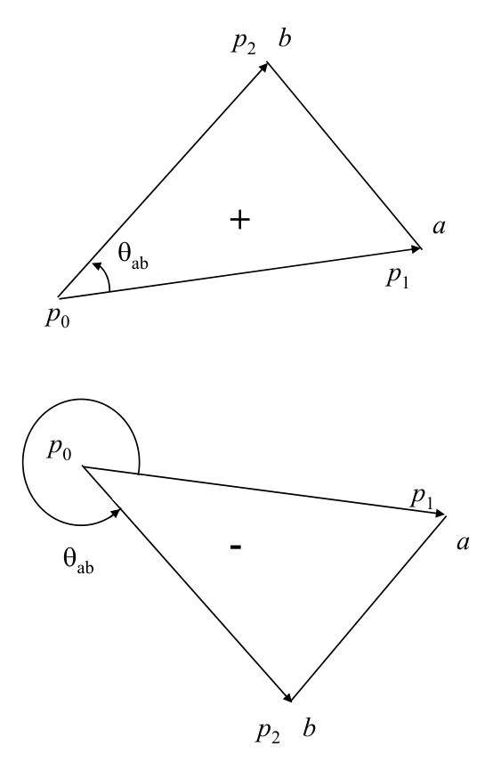

### Figure from slide p. 59
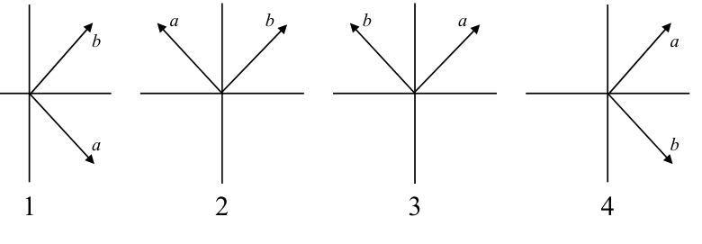

## Slide-by-slide digestion

### p. 58 - LEFT-RIGHT-ABOVE-BELOW
- A geometric primitive operation: triangle orientation
- Given three non-collinear points p0, p1, p2, the triangle Δ p0p1p2
- is positively oriented if p2 lies to the left of p0p1,
- and negatively oriented if p2 lies to the right of p0p1.
- Let vector a = p1 - p0 and vector b = p2 - p0 .
- θab
- 0 < θab < 180
- positive orientation
- 180 < θab < 360
- negative orientation

p. 59 - translations of the line segments at the origin.
- Vectors a and b can be in one of four possible configurations:
- In cases 1 and 3, 0 < θab < 180.
- In cases 2 and 4, 180 < θab < 360.
- In cases 1 and 2, the positive x axis pierces θab.
- In cases 3 and 4, it does not.
- We introduce the value Q = θb - θa (note that Q ≠θab).
- Case
- Range of Q = θb - θa
- Orientation of Δ p0p1p2
- -360 < Q < -180

p. 60 - Observe from the table that sin(Q) has the same sign as the
- orientation of Δ p0p1p2.
- sin(Q) = sin(θb - θa)
- by definition of Q
- = sin θb cos θa - cos θb sin θa
- by trig. identity
- We know that
- cos θa = xa / |a| sin θa = ya / |a|
- cos θb = xb / |b| sin θb = yb / |b|
- by definition of sine and cosine. Then, by substitution
- sin(θb - θa) = (yb / |b|)(xa / |a|) - (xb / |b|)(ya / |a|)

p. 61 - Another way of reaching the same expression is with the
- determinant of the coordinates of the points:
- | x0 y0 1 |
- D =
- | x1 y1 1 |
- | x2 y2 1 |
- Evaluating this determinant gives the expression
- x0 y1 + x2 y0 + x1 y2 - x2 y1 - x0 y2 - x1 y0
- which is the expansion of the final expression previously derived.
- Observe that the determinant is equivalent to the cross product
- (in 2 dimensions).

p. 62 - Area Interpretation
- The value of the determinant D is twice
- the signed area of the triangle Δ p0p1p2 . The
- signed area is positive if p0p1p2 form a counter clockwise
- sequence, it is negative if this sequence is clockwise. If the
- area is zero, then D is 0.
- Generalization
- The three points p0 p1 and p2 form a plane in
- 3-d with a positive normal. A fourth point p3 is on the
- upside if p3 falls on the positive side of the plane and
- on the downside if p3 falls on the negative side of the plane.

What you must be able to say or do in an exam
- Give the precise definitions.
- Distinguish similar notions cleanly.
- Use the right primitive test or formula on a concrete example.

Complexity and performance facts
Constant-time primitive. Entire algorithms are built by repeating this test.

## Common mistakes and danger points
- Direction matters. orient(a,b,c) = -orient(b,a,c).
- Zero means collinear; if an algorithm assumes general position, say so explicitly.
- Boundary handling is where many exam solutions die.

Exam-style drills and answer skeletons
Existing drill reminders from the earlier pack:
- Use the orientation test to compare angular order of points around a query point without trigonometric functions.
- Explain how left/right tests implement half-plane membership in convex-polygon inclusion.
- Adapted from HW1-Q1: Given a circular linked list of points and a point P outside the list, decide whether the points are in counterclockwise order around P.

HW1-Q1 adapted
**Question.** Given a circular linked list of points around P, test whether the list is in counterclockwise order around P without using trigonometric angles.

**How to answer.** Use a half-plane test plus the orientation determinant as an angle comparator. Pure determinant sign on consecutive pairs is not enough because the cyclic order can wrap past π.

### Definition drill
**Question.** Give the precise definitions and the most important consequences from orientation tests and signed-area interpretation.

**How to answer.** A strong answer distinguishes similar objects and uses the course terminology exactly.

## Recap
### What you must know cold
- Orientation determinant for three points a, b, c.
- Positive sign means c is to the left of directed edge ab; negative means right; zero means collinear.
- Determinant equals twice the signed area of triangle abc.
- Cycle interpretation: counterclockwise vs clockwise.
Core test / key idea
- Translate so a is at the origin. Then orient(a,b,c) = (b_x-a_x)(c_y-a_y) - (b_y-a_y)(c_x-a_x).
- The sign tells relative turning direction without computing any angle.
- Signed area explains why the same formula appears in both combinatorial and geometric arguments.
Complexity
- Constant-time primitive. Entire algorithms are built by repeating this test.
Common mistakes / danger points
- Direction matters. orient(a,b,c) = -orient(b,a,c).
- Zero means collinear; if an algorithm assumes general position, say so explicitly.
- Boundary handling is where many exam solutions die.
End-of-file summary
- Orientation determinant for three points a, b, c.
- Positive sign means c is to the left of directed edge ab; negative means right; zero means collinear.
- Determinant equals twice the signed area of triangle abc.
- Constant-time primitive. Entire algorithms are built by repeating this test.
- Direction matters. orient(a,b,c) = -orient(b,a,c).
- Zero means collinear; if an algorithm assumes general position, say so explicitly.

Everything related to this topic
- **Previous file in reading order:** [Vector algebra and trigonometric groundwork](01_Foundations/07_vectors-and-trig-groundwork.md)
- **Next file in reading order:** [Primitive formulas and summary](01_Foundations/09_primitive-formulas-summary.md)
- **Source slide range:** pp. 58-62 of `comp_geometry_slides_new.pdf`
- **Related recordings:** CS 564 - 01.23 1.2.txt, CS 564 - 01.30 3.1.txt
- **Related homework-derived exam prompts included here:** HW1-Q1 adapted


---

# Primitive formulas and summary

## Scope
- **Slides:** pp. 63-65
- **Major topic folder:** pslgs-dcels-vectors-and-geometric-primitives
- **Recording files touching this material:** CS 564 - 01.23 1.2.txt, CS 564 - 01.30 3.2.txt
- **Goal of this file:** You should be able to study this topic without reopening the slide deck.

Big picture
This range compresses the earlier primitives into a small toolkit. Treat it as your local formula sheet for the rest of the midterm.

## What you must know cold
- Parametric line equation and segment restriction.
- Point-line classification in terms of left, right, behind, beyond, between, origin, destination if your notes use that extended vocabulary.
- How these formulas combine in intersection and inclusion tests.

Core ideas and reasoning
- Given a directed segment ab and point q, first use orientation to classify left/right/collinear.
- If collinear, parameter values or dot-product style comparisons decide whether q is behind a, beyond b, or on the segment.
- Most later algorithms are just structured uses of these formulas.

Figures to actually look at
These are cropped from the main slide PDF. Do not skip them.

### Figure from slide p. 63
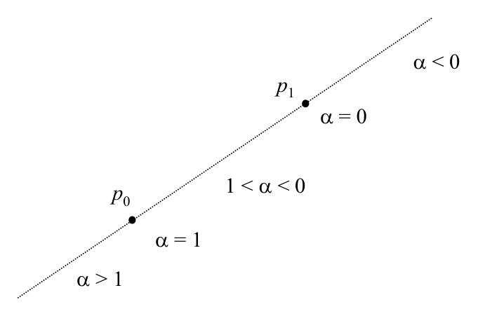

### Figure from slide p. 64
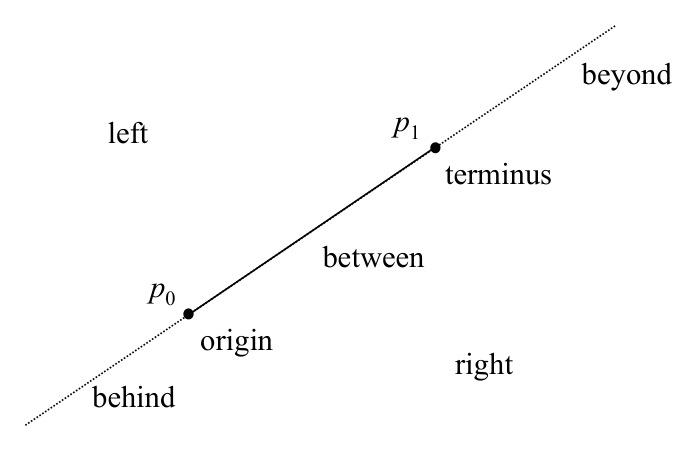

## Slide-by-slide digestion

### p. 63 - Parametric equation of a line
- We use the following equation of a line:
- line = {α(p0) + (1 - α)(p1) }, where α ∈ ℜ(real numbers)
- where p0 and p1 as usual are the points determining the line.
- p0 = (x0, y0)
- p1 = (x1, y1)
- Substituting gives
- {α(x0, y0) + (1 - α)(x1, y1) }
- Multiplying through gives the coordinates
- {αx0 + (1 - α)x1, αy0 + (1 - α)y1 }
- α > 1

p. 64 - Point-Line classification
- We now consider the geometric primitive operation of
- classifying a point w.r.t. a line (both in the plane).
- A directed line segment partitions the plane into 7
- non-overlapping regions. The possibilities are shown below.
- The problem, given p0, p1, and p2, is to determine which
- region p2 lies in.
- terminus
- origin
- beyond
- right

p. 65 - Summary of geometric primitives
- We have seen the following primitives:
- 1. Triangle orientation
- 2. Left test
- 3. Point-line classification
- Others I have implemented:
- 1. Point-on-plane test
- 2. Segment-segment intersection
- 3. Segment-triangle intersection
- All require constant time (if d is fixed).
- There are many others. If in doubt, ask.

What you must be able to say or do in an exam
- Give the precise definitions.
- Distinguish similar notions cleanly.
- Use the right primitive test or formula on a concrete example.

Complexity and performance facts
Constant-time primitives.

## Common mistakes and danger points
- Do not stop at collinear. Many algorithms need the follow-up between/behind/beyond logic.
- Maintain a consistent directed-edge convention.

Exam-style drills and answer skeletons
Existing drill reminders from the earlier pack:
- Adapted from HW1-Q1: Given a circular linked list of points and a point P outside the list, decide whether the points are in counterclockwise order around P.

Definition drill
**Question.** Give the precise definitions and the most important consequences from primitive formulas and summary.

**How to answer.** A strong answer distinguishes similar objects and uses the course terminology exactly.

## Recap
### What you must know cold
- Parametric line equation and segment restriction.
- Point-line classification in terms of left, right, behind, beyond, between, origin, destination if your notes use that extended vocabulary.
- How these formulas combine in intersection and inclusion tests.
Core test / key idea
- Given a directed segment ab and point q, first use orientation to classify left/right/collinear.
- If collinear, parameter values or dot-product style comparisons decide whether q is behind a, beyond b, or on the segment.
- Most later algorithms are just structured uses of these formulas.
Complexity
- Constant-time primitives.
Common mistakes / danger points
- Do not stop at collinear. Many algorithms need the follow-up between/behind/beyond logic.
- Maintain a consistent directed-edge convention.
End-of-file summary
- Parametric line equation and segment restriction.
- Point-line classification in terms of left, right, behind, beyond, between, origin, destination if your notes use that extended vocabulary.
- How these formulas combine in intersection and inclusion tests.
- Constant-time primitives.
- Do not stop at collinear. Many algorithms need the follow-up between/behind/beyond logic.
- Maintain a consistent directed-edge convention.

Everything related to this topic
- **Previous file in reading order:** [Orientation tests and signed-area interpretation](01_Foundations/08_orientation-and-signed-area.md)
- **Next file in reading order:** [Search problem taxonomy and inclusion basics](02_Geometric_Search/10_search-taxonomy.md)
- **Source slide range:** pp. 63-65 of `comp_geometry_slides_new.pdf`
- **Related recordings:** CS 564 - 01.23 1.2.txt, CS 564 - 01.30 3.2.txt
- **Related homework-derived exam prompts included here:** none directly mapped; generic exam drills added instead


---

# Search problem taxonomy and inclusion basics

## Scope
- **Slides:** pp. 66-69
- **Major topic folder:** geometric-search
- **Recording files touching this material:** CS 564 - 01.30 3.2.txt
- **Goal of this file:** You should be able to study this topic without reopening the slide deck.

Big picture
This is the map of geometric search. The midterm then spends many pages filling in specific algorithmic answers to these generic search questions.

## What you must know cold
- Difference between inclusion, point location, and range searching.
- Static data set plus many queries viewpoint.
- Why preprocessing is worth paying for in search problems.

Core ideas and reasoning
- Polygon inclusion asks whether one query point lies inside a given polygon.
- Point location asks which face of a planar subdivision contains the query point.
- Range searching asks which points of a set lie inside a query range, often an axis-parallel rectangle.

Figures to actually look at
These are cropped from the main slide PDF. Do not skip them.

### Figure from slide p. 67
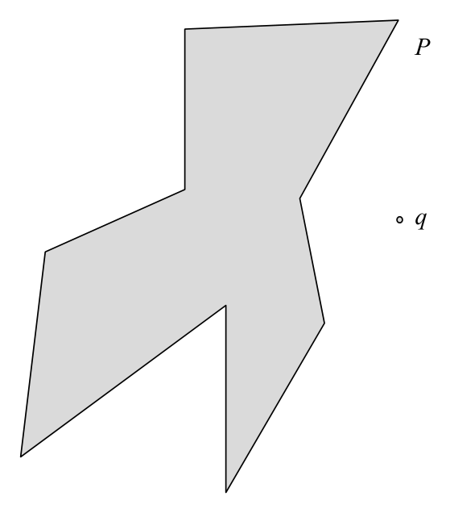

### Figure from slide p. 69
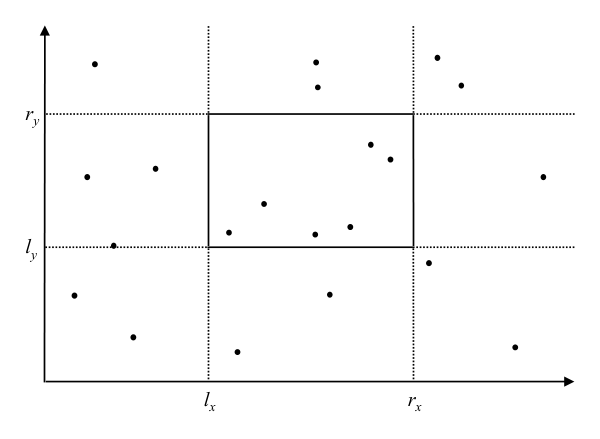

## Slide-by-slide digestion

### p. 66 - Definitions of geometric search
- In general terms a geometric query or search problem has
- this form:
- Given a set S of geometric objects and a distinct geometric object q
- which is the query object, the objective is to determine the subset
- of the objects in set S that are in some specified geometric
- relationship with the query object.
- Many variations are possible, depending on the specific problem.
- 1. S may have 1 or more elements.
- 2. The elements of S may be of the same type as q, or not.
- 3. The answer set may be constrained to have exactly one element,

p. 67 - Polygon inclusion
- Given polygon P and query point q, both in the plane, is q within P?
- P may be of different types (simple, convex, or star-shaped),
- which will affect the method.
- Methods
- Left test (convex)
- Intersection counting (Simple)
- Wedges (Convex and star-shaped)

p. 68 - Point location
- Given a partition of the geometric space into regions and a query
- point q, determine which region contains q.
- We will consider only d = 2, i.e., the plane.
- Methods
- Brute force
- Slab method
- Chain method
- Triangle refinement

p. 69 - Range searching
- RANGE SEARCHING
- INSTANCE: Set S = {p1, p2, ..., pN}, pi = (xi, yi) of points in the
- plane, and rectangle R = [lx, rx] × [ly, ry] in the plane.
- QUESTION: Which points of S are within R?
- Methods
- Brute force
- Dominance
- Grid
- Quadtree
- k-D tree

What you must be able to say or do in an exam
- Give the precise definitions.
- Distinguish similar notions cleanly.
- Use the right primitive test or formula on a concrete example.

Complexity and performance facts
Always report preprocessing, storage, and query time separately.

## Common mistakes and danger points
- Do not mix a single-shot problem with a repeated-query data-structure problem.
- For range searching, remember the query region is x-range cross y-range.

Exam-style drills and answer skeletons
### Definition drill
**Question.** Give the precise definitions and the most important consequences from search problem taxonomy and inclusion basics.

**How to answer.** A strong answer distinguishes similar objects and uses the course terminology exactly.

## Recap
### What you must know cold
- Difference between inclusion, point location, and range searching.
- Static data set plus many queries viewpoint.
- Why preprocessing is worth paying for in search problems.
Core test / key idea
- Polygon inclusion asks whether one query point lies inside a given polygon.
- Point location asks which face of a planar subdivision contains the query point.
- Range searching asks which points of a set lie inside a query range, often an axis-parallel rectangle.
Complexity
- Always report preprocessing, storage, and query time separately.
Common mistakes / danger points
- Do not mix a single-shot problem with a repeated-query data-structure problem.
- For range searching, remember the query region is x-range cross y-range.
End-of-file summary
- Difference between inclusion, point location, and range searching.
- Static data set plus many queries viewpoint.
- Why preprocessing is worth paying for in search problems.
- Always report preprocessing, storage, and query time separately.
- Do not mix a single-shot problem with a repeated-query data-structure problem.
- For range searching, remember the query region is x-range cross y-range.

Everything related to this topic
- **Previous file in reading order:** [Primitive formulas and summary](01_Foundations/09_primitive-formulas-summary.md)
- **Next file in reading order:** [Convex polygon inclusion by left test](02_Geometric_Search/11_convex-inclusion-left-test.md)
- **Source slide range:** pp. 66-69 of `comp_geometry_slides_new.pdf`
- **Related recordings:** CS 564 - 01.30 3.2.txt
- **Related homework-derived exam prompts included here:** none directly mapped; generic exam drills added instead


---

# Convex polygon inclusion by left test

## Scope
- **Slides:** pp. 70-71
- **Major topic folder:** geometric-search
- **Recording files touching this material:** CS 564 - 01.30 3.2.txt
- **Goal of this file:** You should be able to study this topic without reopening the slide deck.

Big picture
This is the cleanest inside test in the course: a convex polygon is just an intersection of half-planes. One primitive repeated N times and you are done.

## What you must know cold
- Inside iff the query point is on the left side of every directed edge of a consistently oriented convex polygon.
- Why convexity is essential for this characterization.
- Boundary policy: on an edge usually counts as inside unless the question says strict interior.

Core ideas and reasoning
- Assume the polygon boundary is ordered counterclockwise. For each edge v_i v_{i+1}, compute orient(v_i, v_{i+1}, q).
- If any value is negative, q is outside. If all are nonnegative, q is inside or on the boundary.
- This works because a convex polygon is exactly the intersection of the interior half-planes of its edges.

Figures to actually look at
These are cropped from the main slide PDF. Do not skip them.

### Figure from slide p. 70


## Slide-by-slide digestion

### p. 70 - Convex polygon inclusion
- CONVEX POLYGON INCLUSION
- INSTANCE: Convex polygon P = (e0 = v0v1, e1 = v1v2, ...,
- eN-1 = vN-1v0) with N edges and query point q, both in the plane.
- QUESTION: Is q within P?
- Convex polygon inclusion by Left test
- P is the intersection of the half-planes defined by its edges.
- Query point q is within P iff q is to the left of or on all N edges of P.
- (This is true iff P is convex.)

p. 71 - Convex polygon inclusion by Left test
```text
procedure ConvexInclusion(P,q)
begin
for
i = 0 to N /* Check each edge */
c = PointLineClassify(vi,v(i+1) mod N,q)
c = RIGHT
return FALSE
endfor
return TRUE
Left(v(i+1) mod N,vi,q) /* Backwards edge */
```

## What you must be able to say or do in an exam
- State the input, output, preprocessing, and query/update model precisely.
- Explain the invariant or ordering that makes the method work.
- Trace the method by hand on a small example.
- Give the exact time and space bounds.
- Mention one edge case, degeneracy, or limitation.

Complexity and performance facts
O(N) query time, O(1) extra space, no preprocessing beyond having the vertex order.

## Common mistakes and danger points
- This fails for general non-convex polygons.
- If the polygon is clockwise, the sign convention reverses.

Exam-style drills and answer skeletons
### Core exam drill
**Question.** State the problem solved by convex polygon inclusion by left test, describe preprocessing/query/update steps if any, and give the time and space bounds.

**How to answer.** An excellent answer names the input, the output, the invariant or ordering exploited by the method, and the exact asymptotic costs.

### Hand-trace drill
**Question.** Trace convex polygon inclusion by left test on a small example by hand and explain each comparison or structural change.

**How to answer.** On this course, being able to run the method on a picture matters more than writing vague slogans.

## Recap
### What you must know cold
- Inside iff the query point is on the left side of every directed edge of a consistently oriented convex polygon.
- Why convexity is essential for this characterization.
- Boundary policy: on an edge usually counts as inside unless the question says strict interior.
Core test / key idea
- Assume the polygon boundary is ordered counterclockwise. For each edge v_i v_{i+1}, compute orient(v_i, v_{i+1}, q).
- If any value is negative, q is outside. If all are nonnegative, q is inside or on the boundary.
- This works because a convex polygon is exactly the intersection of the interior half-planes of its edges.
Complexity
- O(N) query time, O(1) extra space, no preprocessing beyond having the vertex order.
Common mistakes / danger points
- This fails for general non-convex polygons.
- If the polygon is clockwise, the sign convention reverses.
End-of-file summary
- Inside iff the query point is on the left side of every directed edge of a consistently oriented convex polygon.
- Why convexity is essential for this characterization.
- Boundary policy: on an edge usually counts as inside unless the question says strict interior.
- O(N) query time, O(1) extra space, no preprocessing beyond having the vertex order.
- This fails for general non-convex polygons.
- If the polygon is clockwise, the sign convention reverses.

Everything related to this topic
- **Previous file in reading order:** [Search problem taxonomy and inclusion basics](02_Geometric_Search/10_search-taxonomy.md)
- **Next file in reading order:** [Simple polygon inclusion by intersection counting](02_Geometric_Search/12_simple-polygon-inclusion-ray-shooting.md)
- **Source slide range:** pp. 70-71 of `comp_geometry_slides_new.pdf`
- **Related recordings:** CS 564 - 01.30 3.2.txt
- **Related homework-derived exam prompts included here:** none directly mapped; generic exam drills added instead


---

# Simple polygon inclusion by intersection counting

## Scope
- **Slides:** pp. 72-74
- **Major topic folder:** geometric-search
- **Recording files touching this material:** CS 564 - 01.30 3.2.txt
- **Goal of this file:** You should be able to study this topic without reopening the slide deck.

Big picture
For non-convex simple polygons, the half-plane shortcut is gone, so the course uses parity via a ray. This is the version where endpoint degeneracies become the whole game.

## What you must know cold
- Shoot a ray from the query point and count intersections with the boundary.
- Odd count means inside, even count means outside for a simple polygon.
- Need a consistent endpoint rule to avoid double counting.

Core ideas and reasoning
- A common implementation uses a horizontal ray to the right.
- Count an edge only if the ray crosses it according to a half-open endpoint convention, for example one endpoint strictly below and the other at or above the ray.
- If the query lies on the boundary, handle that first with a segment-membership check.

Figures to actually look at
These are cropped from the main slide PDF. Do not skip them.

### Figure from slide p. 72


### Figure from slide p. 74


## Slide-by-slide digestion

### p. 72 - Simple polygon inclusion
- SIMPLE POLYGON INCLUSION
- INSTANCE: Simple polygon P = (e0 = v0v1, e1 = v1v2, ...,
- eN -1 = vN -1v0) with N edges and query point q, both in the plane.
- QUESTION: Is q within P?
- Simple polygon inclusion by Intersection counting
- Query point q is within P iff a ray originating at q intersects
- the boundary of P an odd number of times.

p. 73 - Simple polygon inclusion by Intersection counting
```text
procedure SimpleInclusion(P,q) /* Incomplete version */
begin
c = 0
for
i = 0 to N /* Check each edge */
edge vi,v(i+1) mod N ∩ray -∞,q
c = (c + 1) mod 2
endfor
c = 1
return TRUE
```

### p. 74 - Simple polygon inclusion by Intersection counting
- Special cases, not explicitly handled by given procedure:
- 1. Ray collinear with horizontal edge of P
- 2. Ray intersects vertex of P
- 3. Query point q on edge of P
- Resolving these special cases does not change complexity.
- See Preparata, p. 42 or O’Rourke, p. 233-236 for details.
- q2 Wrong
- q3 Right
- Ray intersects vertex of P
- q1 Right

What you must be able to say or do in an exam
- State the input, output, preprocessing, and query/update model precisely.
- Explain the invariant or ordering that makes the method work.
- Trace the method by hand on a small example.
- Give the exact time and space bounds.
- Mention one edge case, degeneracy, or limitation.

Complexity and performance facts
O(N) time, O(1) extra space.

## Common mistakes and danger points
- Vertex hits can double count if you use a sloppy rule.
- You must decide boundary behavior separately from odd-even logic.
- Ray-degeneracy checklist: be consistent about (1) a ray passing through a polygon vertex, (2) a ray collinear with an edge, and (3) the query point lying on the boundary; otherwise parity can be wrong.

Professor emphasis from recordings
These points are distilled from the related recordings and focus on what the professor slowed down for, warned about, or connected to homework/exam reasoning.

- The lecture spends time on degeneracies for ray shooting: rays can hit a vertex or line up with an edge, so you need a consistent counting convention instead of hand-waving.
- The real idea is parity, not the particular ray direction. Count crossings consistently, then odd means inside and even means outside.

Exam-style drills and answer skeletons
Existing drill reminders from the earlier pack:
- Design a robust ray-shooting test that correctly handles rays passing through polygon vertices.
- Explain why parity works only for simple polygons.

Core exam drill
**Question.** State the problem solved by simple polygon inclusion by intersection counting, describe preprocessing/query/update steps if any, and give the time and space bounds.

**How to answer.** An excellent answer names the input, the output, the invariant or ordering exploited by the method, and the exact asymptotic costs.

### Hand-trace drill
**Question.** Trace simple polygon inclusion by intersection counting on a small example by hand and explain each comparison or structural change.

**How to answer.** On this course, being able to run the method on a picture matters more than writing vague slogans.

## Recap
### What you must know cold
- Shoot a ray from the query point and count intersections with the boundary.
- Odd count means inside, even count means outside for a simple polygon.
- Need a consistent endpoint rule to avoid double counting.
Core test / key idea
- A common implementation uses a horizontal ray to the right.
- Count an edge only if the ray crosses it according to a half-open endpoint convention, for example one endpoint strictly below and the other at or above the ray.
- If the query lies on the boundary, handle that first with a segment-membership check.
Complexity
- O(N) time, O(1) extra space.
Common mistakes / danger points
- Vertex hits can double count if you use a sloppy rule.
- You must decide boundary behavior separately from odd-even logic.
- Ray-degeneracy checklist: be consistent about (1) a ray passing through a polygon vertex, (2) a ray collinear with an edge, and (3) the query point lying on the boundary; otherwise parity can be wrong.
Professor emphasis (from recordings)
- The lecture spends time on degeneracies for ray shooting: rays can hit a vertex or line up with an edge, so you need a consistent counting convention instead of hand-waving.
- The real idea is parity, not the particular ray direction. Count crossings consistently, then odd means inside and even means outside.
End-of-file summary
- Shoot a ray from the query point and count intersections with the boundary.
- Odd count means inside, even count means outside for a simple polygon.
- Need a consistent endpoint rule to avoid double counting.
- O(N) time, O(1) extra space.
- Vertex hits can double count if you use a sloppy rule.
- You must decide boundary behavior separately from odd-even logic.

Everything related to this topic
- **Previous file in reading order:** [Convex polygon inclusion by left test](02_Geometric_Search/11_convex-inclusion-left-test.md)
- **Next file in reading order:** [Convex polygon inclusion by wedges](02_Geometric_Search/13_convex-inclusion-by-wedges.md)
- **Source slide range:** pp. 72-74 of `comp_geometry_slides_new.pdf`
- **Related recordings:** CS 564 - 01.30 3.2.txt
- **Related homework-derived exam prompts included here:** none directly mapped; generic exam drills added instead


---

# Convex polygon inclusion by wedges

## Scope
- **Slides:** pp. 75-77
- **Major topic folder:** geometric-search
- **Recording files touching this material:** CS 564 - 01.30 3.2.txt
- **Goal of this file:** You should be able to study this topic without reopening the slide deck.

Big picture
This is the accelerated convex-polygon inclusion method. The idea is to preprocess angular order around an interior point and reduce the query to a wedge search plus one local test.

## What you must know cold
- Choose an interior reference point and partition the polygon into wedges/triangles.
- Use binary search in angular order to find the wedge containing the query direction.
- Finish with a local orientation test in the found wedge.

Core ideas and reasoning
- The polygon is decomposed into fan triangles relative to an interior point or anchor.
- The query point determines a direction from the anchor; binary search locates the wedge in O(log N).
- Then test whether q lies inside the corresponding triangle/wedge.

Figures to actually look at
These are cropped from the main slide PDF. Do not skip them.

### Figure from slide p. 75


### Figure from slide p. 76


## Slide-by-slide digestion

### p. 75 - Convex polygon inclusion by Wedges
- CONVEX POLYGON INCLUSION
- INSTANCE: Convex polygon P = (e0 = v0v1, e1 = v1v2, ...,
- eN -1 = vN -1v0) with N edges and query point q, both in the plane.
- QUESTION: Is q within P?
- P convex ⇒
- the vertices of P occur in angular order about any point within P.
- Rays from an internal point partition the plane into wedges.
- Convex polygon inclusion query has two steps:
- 1. Determine wedge containing q
- 2. Determine which side of edge for that wedge q is on

p. 76 - Preprocessing
- 1. Find a point c internal to P (centroid of any three vertices).
- 2. Arrange the vertices into a data structure suitable for
- binary search (e.g., an array).
- Query
- Given query point q,
- 1. Find wedge containing q by binary search on the vertices.
- Point q lies within the wedge for vertices vi and vi+1 iff
- qcpi is a Right turn and qcpi+1 is a Left turn.
- 2. Once pi and pi+1 have been found,
- q is internal iff pi+1piq is a Left turn.

p. 77 - Analysis
- Preprocessing time: O(N); to load vertices into data structure.
- Query time: O(log N); binary search with O(1) time
- per comparison.
- Space: O(N); for N edges.
- Comments
- Note that O(N) preprocessing enables O(log N) query.
- Since O(N) query exists, this method is useful for repetitive mode
- queries, not for single shot queries.
- Notation different in notes and text.
- This algorithm in text appears to be in error.

What you must be able to say or do in an exam
- State the input, output, preprocessing, and query/update model precisely.
- Explain the invariant or ordering that makes the method work.
- Trace the method by hand on a small example.
- Give the exact time and space bounds.
- Mention one edge case, degeneracy, or limitation.

Complexity and performance facts
Typical preprocessing O(N), query O(log N), storage O(N).

## Common mistakes and danger points
- You need a consistent angular order and a point known to be interior.
- Binary search is on wedges, not on x- or y-coordinates.
- Boundary case matters: when the query point lies exactly on an edge (orientation/determinant = 0), handle it according to the problem's inside/boundary policy; do not skip the determinant-zero branch.

Exam-style drills and answer skeletons
### Core exam drill
**Question.** State the problem solved by convex polygon inclusion by wedges, describe preprocessing/query/update steps if any, and give the time and space bounds.

**How to answer.** An excellent answer names the input, the output, the invariant or ordering exploited by the method, and the exact asymptotic costs.

### Hand-trace drill
**Question.** Trace convex polygon inclusion by wedges on a small example by hand and explain each comparison or structural change.

**How to answer.** On this course, being able to run the method on a picture matters more than writing vague slogans.

## Recap
### What you must know cold
- Choose an interior reference point and partition the polygon into wedges/triangles.
- Use binary search in angular order to find the wedge containing the query direction.
- Finish with a local orientation test in the found wedge.
Core test / key idea
- The polygon is decomposed into fan triangles relative to an interior point or anchor.
- The query point determines a direction from the anchor; binary search locates the wedge in O(log N).
- Then test whether q lies inside the corresponding triangle/wedge.
Complexity
- Typical preprocessing O(N), query O(log N), storage O(N).
Common mistakes / danger points
- You need a consistent angular order and a point known to be interior.
- Binary search is on wedges, not on x- or y-coordinates.
- Boundary case matters: when the query point lies exactly on an edge (orientation/determinant = 0), handle it according to the problem's inside/boundary policy; do not skip the determinant-zero branch.
End-of-file summary
- Choose an interior reference point and partition the polygon into wedges/triangles.
- Use binary search in angular order to find the wedge containing the query direction.
- Finish with a local orientation test in the found wedge.
- Typical preprocessing O(N), query O(log N), storage O(N).
- You need a consistent angular order and a point known to be interior.
- Binary search is on wedges, not on x- or y-coordinates.

Everything related to this topic
- **Previous file in reading order:** [Simple polygon inclusion by intersection counting](02_Geometric_Search/12_simple-polygon-inclusion-ray-shooting.md)
- **Next file in reading order:** [Star-shaped polygon inclusion by wedges](02_Geometric_Search/14_star-shaped-inclusion-by-wedges.md)
- **Source slide range:** pp. 75-77 of `comp_geometry_slides_new.pdf`
- **Related recordings:** CS 564 - 01.30 3.2.txt
- **Related homework-derived exam prompts included here:** none directly mapped; generic exam drills added instead


---

# Star-shaped polygon inclusion by wedges

## Scope
- **Slides:** pp. 78-79
- **Major topic folder:** geometric-search
- **Recording files touching this material:** CS 564 - 01.30 3.2.txt
- **Goal of this file:** You should be able to study this topic without reopening the slide deck.

Big picture
This extends the wedge idea from convex polygons to star-shaped polygons. The cost is that you now rely on a kernel point rather than arbitrary interior structure.

## What you must know cold
- Definition of a star-shaped polygon and its kernel.
- Why a kernel point sees the entire boundary.
- How wedge partitioning around a kernel point supports inclusion testing.

Core ideas and reasoning
- Pick a point in the kernel. Every boundary point is visible from it.
- Order vertices around that point, find the wedge containing the query direction, then test locally.
- The method is an extension of the convex fan idea but requires star-shaped visibility.

Figures to actually look at
These are cropped from the main slide PDF. Do not skip them.

### Figure from slide p. 78
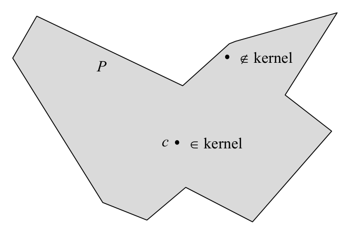

### Figure from slide p. 79
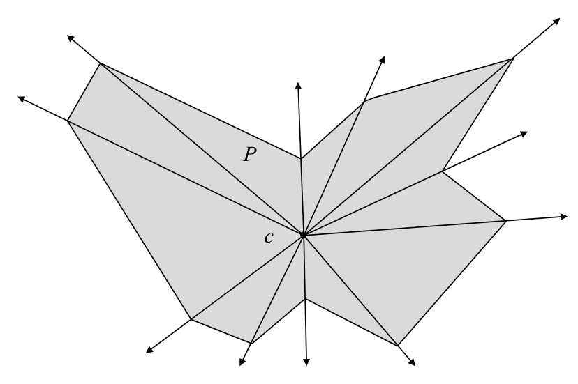

## Slide-by-slide digestion

### p. 78 - Star-shaped polygon inclusion by Wedges
- STAR-SHAPED POLYGON INCLUSION
- INSTANCE: Star-shaped polygon P = (e0 = v0v1, e1 = v1v2, ...,
- eN-1 = vN-1v0) with N edges and query point q, both in the plane.
- QUESTION: Is q within P?
- A simple polygon P is star-shaped if ∃ a point c within
- P ∋ for all points p within P the segment cp lies within P. The
- locus of those points is the kernel of P.
- (Note that convex polygons are star-shaped, and that for a
- convex polygon the entire polygon is the kernel.)
- ∈kernel

p. 79 - Star-shaped polygon inclusion by Wedges
- P star-shaped ⇒
- the vertices of P occur in angular order about any point in
- the kernel of P ⇒
- The convex polygon inclusion algorithm can be used,
- once a point in the kernel of P has been found.
- This can be done in O(N) time ⇒
- Preprocessing remains O(N).

What you must be able to say or do in an exam
- State the input, output, preprocessing, and query/update model precisely.
- Explain the invariant or ordering that makes the method work.
- Trace the method by hand on a small example.
- Give the exact time and space bounds.
- Mention one edge case, degeneracy, or limitation.

Complexity and performance facts
After suitable preprocessing, queries can be handled similarly to wedge-based convex inclusion.

## Common mistakes and danger points
- An arbitrary interior point is not enough; it must lie in the kernel.
- Do not claim this works for every simple polygon.
- Boundary case matters: when the query point lies exactly on an edge (orientation/determinant = 0), handle it according to the problem's inside/boundary policy; do not skip the determinant-zero branch.

Exam-style drills and answer skeletons
### Core exam drill
**Question.** State the problem solved by star-shaped polygon inclusion by wedges, describe preprocessing/query/update steps if any, and give the time and space bounds.

**How to answer.** An excellent answer names the input, the output, the invariant or ordering exploited by the method, and the exact asymptotic costs.

### Hand-trace drill
**Question.** Trace star-shaped polygon inclusion by wedges on a small example by hand and explain each comparison or structural change.

**How to answer.** On this course, being able to run the method on a picture matters more than writing vague slogans.

## Recap
### What you must know cold
- Definition of a star-shaped polygon and its kernel.
- Why a kernel point sees the entire boundary.
- How wedge partitioning around a kernel point supports inclusion testing.
Core test / key idea
- Pick a point in the kernel. Every boundary point is visible from it.
- Order vertices around that point, find the wedge containing the query direction, then test locally.
- The method is an extension of the convex fan idea but requires star-shaped visibility.
Complexity
- After suitable preprocessing, queries can be handled similarly to wedge-based convex inclusion.
Common mistakes / danger points
- An arbitrary interior point is not enough; it must lie in the kernel.
- Do not claim this works for every simple polygon.
- Boundary case matters: when the query point lies exactly on an edge (orientation/determinant = 0), handle it according to the problem's inside/boundary policy; do not skip the determinant-zero branch.
End-of-file summary
- Definition of a star-shaped polygon and its kernel.
- Why a kernel point sees the entire boundary.
- How wedge partitioning around a kernel point supports inclusion testing.
- After suitable preprocessing, queries can be handled similarly to wedge-based convex inclusion.
- An arbitrary interior point is not enough; it must lie in the kernel.
- Do not claim this works for every simple polygon.

Everything related to this topic
- **Previous file in reading order:** [Convex polygon inclusion by wedges](02_Geometric_Search/13_convex-inclusion-by-wedges.md)
- **Next file in reading order:** [Point location by slab decomposition](02_Geometric_Search/15_point-location-slab-method.md)
- **Source slide range:** pp. 78-79 of `comp_geometry_slides_new.pdf`
- **Related recordings:** CS 564 - 01.30 3.2.txt
- **Related homework-derived exam prompts included here:** none directly mapped; generic exam drills added instead


---

# Point location by slab decomposition

## Scope
- **Slides:** pp. 80-85
- **Major topic folder:** geometric-search
- **Recording files touching this material:** CS 564 - 02.04 4.1.txt
- **Goal of this file:** You should be able to study this topic without reopening the slide deck.

Big picture
The slab method is one of the first genuine geometric-search data structures. It shows how binary search enters geometry by cutting the plane into horizontal bands.

## What you must know cold
- Construct horizontal lines through all vertices to form slabs.
- Binary search on slab y-order to find the slab containing q.
- Within the slab, use the left-to-right edge order to identify the containing face.

Core ideas and reasoning
- After preprocessing, every slab has a fixed combinatorial order of intersecting edges.
- Query step 1: binary search over y-coordinates of slab boundaries.
- Query step 2: locate q among the ordered edges inside that slab.

Figures to actually look at
These are cropped from the main slide PDF. Do not skip them.

### Figure from slide p. 82


### Figure from slide p. 83


## Slide-by-slide digestion

### p. 80 - Point location
- PLANAR POINT LOCATION
- INSTANCE: PSLG G = (V, E), with G connected and
- no vertex v ∈V having degree < 2, and query point q.
- QUESTION: Which face of G is q within?
- With the assumptions that degree(v) ≥2 ∀v ∈ V and G is connected,
- G partitions the plane into simple polygons.

p. 81 - Point location by brute force
- Consider a point location method using known techniques.
- We represent PSLG G with a DCEL
- (which requires O(N) preprocessing to construct, as seen).
- Query

```text
for each face f of G /* found via HF */
assemble a simple polygon P from edges of f
retrieved using FACE operation /* p. 17 */
test simple polygon inclusion for q within P
endfor
```

- Analysis

p. 82 - Point location by Slab method
- The fundamental technique for general search is to apply bisection,
- i.e., binary search.
- A binary search on N items requires O(log N) time.
- Often applied to alphanumeric values.
- We will see ways to apply the idea to geometric objects.
- Slab method is an example.
- Slab method query, part 1
- Given PSLG G, construct a horizontal line through each vertex.
- These lines divide the plane into (at most) N + 1 “slabs”.
- Sorting the y-coordinates of the slabs during preprocessing

p. 83 - Slab method query, part 2
- The intersection of a slab with G is a set of segments,
- from the edges of G.
- The segments define trapezoids, which may degenerate to triangles.
- G a PSLG ⇒edges intersect only at vertices.
- Each vertex defines a slab boundary ⇒
- No segments intersect within a slab.
- Segments in a slab can be totally ordered (e.g., left to right).
- Binary search can be used to find the trapezoid containing q.
- If face stored with each trapezoid during preprocessing,
- this gives the answer to the point location problem.

p. 84 - Comparison operation during binary search
- This slide illustrates how the query point is compared against ordered slab segments during binary search.
- The comparison is implemented with orientation/left-right tests against the candidate segment.
- In an exam trace, be ready to say whether the query lies to the left or right of the segment and which side the search should continue on.

p. 85 - Analysis
- Query time: O(log N); 2× O(log N) binary search.
- At most N slabs, at most N segments per slab.
- Cannot be improved (optimum).
- Preprocessing time: O(N2 log N); each of O(N) slabs can
- have as many as N segments, requiring an O(N log N) sort.
- This can be improved.
- Space: O(N2); O(N) slabs, each with O(N) segments.
- Cannot be improved (for this algorithm).

What you must be able to say or do in an exam
- State the input, output, preprocessing, and query/update model precisely.
- Explain the invariant or ordering that makes the method work.
- Trace the method by hand on a small example.
- Give the exact time and space bounds.
- Mention one edge case, degeneracy, or limitation.

Complexity and performance facts
Binary search finds the slab in O(log N); storage/preprocessing may be high because each slab stores edge order information.

## Common mistakes and danger points
- The expensive part is building/storing edge orders for slabs.
- Within a slab, you compare q against edges, not against face labels directly.

Professor emphasis from recordings
These points are distilled from the related recordings and focus on what the professor slowed down for, warned about, or connected to homework/exam reasoning.

- This method is presented as one of the first clean examples of binary search being transferred into geometry.
- He explicitly notes the geometric degeneracy that slab regions can become triangles; the left-to-right order still exists, so the query logic still works.
- A big warning from lecture is the preprocessing blow-up: many slabs may each contain many segments, so the simple slab method is fast at query time but expensive to build.

Exam-style drills and answer skeletons
Existing drill reminders from the earlier pack:
- Given a PSLG and a query point, describe a naive face-location method using a horizontal ray and identify the incident face of the first crossed edge.
- Adapted from HW2-Q1: Given a DCEL of a PSLG and a query point P, find the face containing P in O(N) using a naive method.

HW2-Q1 adapted
**Question.** For a PSLG and query point P, explain the naive O(N) point-location method, then explain how the slab method improves the query step.

**How to answer.** Contrast brute-force ray shooting with slab preprocessing. The key gain is binary search on slabs plus ordered edge search inside one slab.

### Core exam drill
**Question.** State the problem solved by point location by slab decomposition, describe preprocessing/query/update steps if any, and give the time and space bounds.

**How to answer.** An excellent answer names the input, the output, the invariant or ordering exploited by the method, and the exact asymptotic costs.

### Hand-trace drill
**Question.** Trace point location by slab decomposition on a small example by hand and explain each comparison or structural change.

**How to answer.** On this course, being able to run the method on a picture matters more than writing vague slogans.

## Recap
### What you must know cold
- Construct horizontal lines through all vertices to form slabs.
- Binary search on slab y-order to find the slab containing q.
- Within the slab, use the left-to-right edge order to identify the containing face.
Core test / key idea
- After preprocessing, every slab has a fixed combinatorial order of intersecting edges.
- Query step 1: binary search over y-coordinates of slab boundaries.
- Query step 2: locate q among the ordered edges inside that slab.
Complexity
- Binary search finds the slab in O(log N); storage/preprocessing may be high because each slab stores edge order information.
Common mistakes / danger points
- The expensive part is building/storing edge orders for slabs.
- Within a slab, you compare q against edges, not against face labels directly.
Professor emphasis (from recordings)
- This method is presented as one of the first clean examples of binary search being transferred into geometry.
- He explicitly notes the geometric degeneracy that slab regions can become triangles; the left-to-right order still exists, so the query logic still works.
- A big warning from lecture is the preprocessing blow-up: many slabs may each contain many segments, so the simple slab method is fast at query time but expensive to build.
End-of-file summary
- Construct horizontal lines through all vertices to form slabs.
- Binary search on slab y-order to find the slab containing q.
- Within the slab, use the left-to-right edge order to identify the containing face.
- Binary search finds the slab in O(log N); storage/preprocessing may be high because each slab stores edge order information.
- The expensive part is building/storing edge orders for slabs.
- Within a slab, you compare q against edges, not against face labels directly.

Everything related to this topic
- **Previous file in reading order:** [Star-shaped polygon inclusion by wedges](02_Geometric_Search/14_star-shaped-inclusion-by-wedges.md)
- **Next file in reading order:** [Plane sweep as a recurring paradigm](02_Geometric_Search/16_plane-sweep-paradigm.md)
- **Source slide range:** pp. 80-85 of `comp_geometry_slides_new.pdf`
- **Related recordings:** CS 564 - 02.04 4.1.txt
- **Related homework-derived exam prompts included here:** HW2-Q1 adapted


---

# Plane sweep as a recurring paradigm

## Scope
- **Slides:** pp. 86-90
- **Major topic folder:** geometric-search
- **Recording files touching this material:** CS 564 - 02.04 4.1.txt
- **Goal of this file:** You should be able to study this topic without reopening the slide deck.

Big picture
Plane sweep is not one algorithm. It is a habit of mind: move an imaginary line, process events in order, and maintain exactly the active structure you need.

## What you must know cold
- Sweep line or sweep plane idea.
- Event queue and status structure.
- Why geometry often becomes easier when you impose a global order.

Core ideas and reasoning
- Sort critical events such as vertex coordinates, segment endpoints, or intersections.
- Maintain a balanced structure for currently active objects intersecting the sweep line.
- Update only when the combinatorial situation changes.

Figures to actually look at
These are cropped from the main slide PDF. Do not skip them.

### Figure from slide p. 86
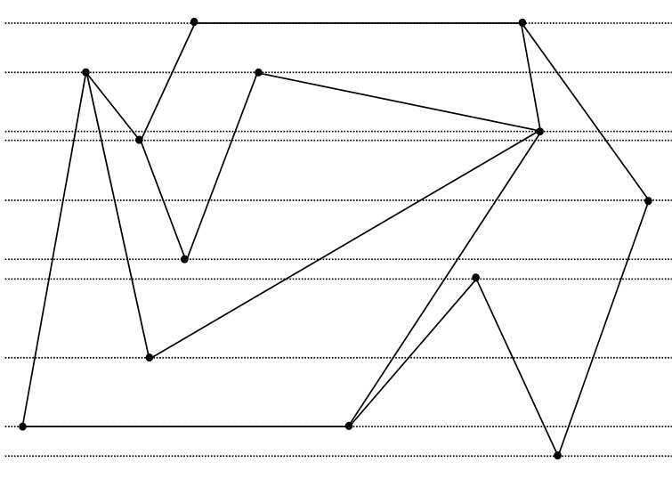

### Figure from slide p. 88


## Slide-by-slide digestion

### p. 86 - Plane sweep algorithmic technique
- Plane sweep is an algorithmic technique, or pattern,
- that is used frequently in computational geometry.
- The essential idea is that a geometric object, or collection of
- objects, in the plane is processed with an algorithm that
- is suggested by the idea of a vertical (or horizontal) line
- passing over the object(s).
- Processing occurs at discrete abscissa (or ordinates) as the line
- passes over key points in the object(s).
- Those points are called events.
- We will see how to apply this technique to perform preprocessing

p. 87 - Plane sweep data structures
- Plane sweep algorithms often use two data structures:
- 1. Event-point schedule
- Sequence of positions to be assumed by the sweep-line.
- 2. Sweep-line status
- Description of the intersection of the sweep-line with
- the geometric object(s) being swept at the current event.
- Sweep line status
- For the slab method preprocessing, the sweep-line status is a
- left-to-right sequence of edges of G that intersect the
- sweep-line.

p. 88 - Event processing
- At each event, i.e., vertex v ∈V,
- 1. the edges terminating at v are deleted from the sweep-line status
- 2. the edges originating at v are added to the sweep-line status
- 3. the sweep-line status data structure is reported,
- and used to construct a slab.
- The sweep-line status can be maintained in a height balanced
- binary tree (e.g., a AVL tree) that provides INSERT
- and DELETE operations in O(log N).

p. 89 - Preprocessing algorithm
- Data structures
- VERTEX
- Array storing vertices of G,
- ordered by increasing y-coordinates
- B[i]
- Set of edges incident on VERTEX[i] from below,
- ordered counterclockwise
- A[i]
- Set of edges incident on VERTEX[i] from above,
- ordered clockwise

p. 90 - Preprocessing analysis
- Preprocessing time: O(N2); O(N) slabs, each requiring O(N)
- time to construct a slab.
- There will be at most O(N) insertions and deletions to L,
- each requiring O(log N) time, so without the slab construction
- the time required is in O(N log N).
- Comments
- The slab method’s O(log N) query time is optimal.
- Preprocessing time reduced from O(N2 log N) to O(N2) through
- use of the plane-sweep technique.
- Still, O(N2) is unacceptable for some applications.

What you must be able to say or do in an exam
- State the input, output, preprocessing, and query/update model precisely.
- Explain the invariant or ordering that makes the method work.
- Trace the method by hand on a small example.
- Give the exact time and space bounds.
- Mention one edge case, degeneracy, or limitation.

Complexity and performance facts
Usually O((number of events) log N) plus output size, depending on the problem.

## Common mistakes and danger points
- Do not store everything in the status, only active objects.
- Correct event ordering and tie handling are part of the algorithm, not implementation trivia.

Exam-style drills and answer skeletons
### Definition drill
**Question.** Give the precise definitions and the most important consequences from plane sweep as a recurring paradigm.

**How to answer.** A strong answer distinguishes similar objects and uses the course terminology exactly.

## Recap
### What you must know cold
- Sweep line or sweep plane idea.
- Event queue and status structure.
- Why geometry often becomes easier when you impose a global order.
Core test / key idea
- Sort critical events such as vertex coordinates, segment endpoints, or intersections.
- Maintain a balanced structure for currently active objects intersecting the sweep line.
- Update only when the combinatorial situation changes.
Complexity
- Usually O((number of events) log N) plus output size, depending on the problem.
Common mistakes / danger points
- Do not store everything in the status, only active objects.
- Correct event ordering and tie handling are part of the algorithm, not implementation trivia.
End-of-file summary
- Sweep line or sweep plane idea.
- Event queue and status structure.
- Why geometry often becomes easier when you impose a global order.
- Usually O((number of events) log N) plus output size, depending on the problem.
- Do not store everything in the status, only active objects.
- Correct event ordering and tie handling are part of the algorithm, not implementation trivia.

Everything related to this topic
- **Previous file in reading order:** [Point location by slab decomposition](02_Geometric_Search/15_point-location-slab-method.md)
- **Next file in reading order:** [Chain method: basics, definitions, and query idea](02_Geometric_Search/17_chain-method-basics-and-query.md)
- **Source slide range:** pp. 86-90 of `comp_geometry_slides_new.pdf`
- **Related recordings:** CS 564 - 02.04 4.1.txt
- **Related homework-derived exam prompts included here:** none directly mapped; generic exam drills added instead


---

# Chain method: basics, definitions, and query idea

## Scope
- **Slides:** pp. 91-101
- **Major topic folder:** geometric-search
- **Recording files touching this material:** CS 564 - 02.06 5.1.txt
- **Goal of this file:** You should be able to study this topic without reopening the slide deck.

Big picture
The chain method is a point-location structure for PSLGs. Conceptually it regularizes the subdivision, builds a monotone complete set of chains, then uses binary search twice.

## What you must know cold
- Regular PSLG idea and monotone chains.
- How chains partition the subdivision into searchable regions.
- Two-stage query: binary search among chains, then binary search within a chain.

Core ideas and reasoning
- A chain is monotone with respect to the chosen axis, so its vertices appear in order by projection.
- Two neighboring chains bound a region; locating the query between chains narrows the candidate face.
- The method is geometric binary search over ordered chains.

Figures to actually look at
These are cropped from the main slide PDF. Do not skip them.

### Figure from slide p. 91


### Figure from slide p. 97


## Slide-by-slide digestion

### p. 91 - Basic idea of the chain method
- Problem: Point location in the plane, i.e., determine the face
- of a PSLG G that contains a query point q.
- Preprocessing:
- 1. Convert arbitrary PSLG G into a regular PSLG.
- 2. Decompose the regularized PSLG into a set of monotone chains.
- Query:
- 1. Binary search on the chains to find the two chains
- that are on either side of the query point.
- 2. Binary search on one of those chains to determine the face.

p. 92 - Chain method overview, “overture”
- PSLG G
- Monotone complete
- set of chains C for G
- Regular PSLG G
- Regularize PSLG G
- (Text pp. 52-54)
- Construct C for regular G
- (Text pp. 50-52)
- Queries
- Preprocessing

p. 93 - Definition of a chain
- A chain C = (v1, v2, ..., vp) is a PSLG with vertex set {v1, v2, ..., vp}
- and edge set{(vi,vi+1): i = 1, 2, ..., p - 1}.
- Notational notes:
- 1. v for vertices; text uses u on pp. 48-49 and v pp. 50-55.
- 2. ( ... ) sequence, { ... } unordered set
- A chain is a planar embedding of a graph theoretic chain.
- Sometimes called polygonal line.

p. 94 - Subdividing a PSLG with a chain
- Consider a chain C which is a subgraph of PSLG G
- and has as its extreme endpoints vertices on the boundary of G.
- Suppose C is extended from those endpoints
- with semi-infinite parallel rays.
- C subdivides the partition of the plane induced by G into two parts.

p. 95 - Point-chain discrimination
- To use a binary search for point location based on chains,
- we must be able to determine which side of a chain C
- a query point q is on.
- That operation is point-chain discrimination.
- Point-chain discrimination against an arbitrary chain
- is equivalent in difficulty to general polygon inclusion,
- requiring O(N) time.
- We need to do better than O(N) for the binary search comparison.
- To do so we need a more restricted type of chain.

p. 96 - Monotone chains
- A chain C = (v1, v2, ..., vp) is monotone w.r.t. a line l if a line
- orthogonal to l intersects C in at most one point.
- There is no “doubling back” or “overlap” of C w.r.t. l.
- Note two small errors in the text:
- p. 49, Definition 2.2:
- “... in exactly one point.” should be “... at most one point.”
- For example, line m is orthogonal to l, intersects C in zero points.
- Definition 2.2 is correct iff C has been extended with the previously
- mentioned semi-infinite rays, but the definition doesn’t say so.
- p. 49, Figure 2.11(b)

p. 97 - In a monotone chain C, the orthogonal projections onto l
- {l(v1), l(v2), ..., l(vp)} of the vertices (v1, v2, ..., vp) of C
- have the same order as the vertices: (l(v1), l(v2), ..., l(vp)).
- Not true for non-monotone chains.
- orthogonal projections onto l

p. 98 - Point-chain discrimination with a monotone chain
- The point-chain discrimination operation can be performed
- more efficiently with a monotone chain.
- Assumptions:
- 1. Chain C has been extended with the semi-infinite rays.
- 2. The orthogonal projections (l(v1), l(v2), ..., l(vp))
- of the vertices of C have been computed
- and stored in a searchable data structure (preprocessing).
- Operation:
- 1. Compute orthogonal projection l(q) of q on l. O(1)
- 2. Binary search “on l” for i ∋l(vi) ≤l(q) ≤l(vi+1). O(log N)

p. 99 - Point location query with monotone chains, part 1
- Given an O(log N) point-chain discrimination operation,
- how can it be used for a point location query?
- Suppose there is a set C = {C1, C2, ..., Cr} of chains
- that are monotone w.r.t. the same line l
- and with these two properties:
- (1) The union of the members of C contains the PSLG G
- (a given edge of G may be in more than one chain in C).
- (2) For any two chains Ci and Cj of C , the vertices of Ci
- which are not members of Cj lie on the same side of Cj.
- Such a set C is a monotone complete set of chains of G.

p. 100 - Point location query with monotone chains, part 2
- Property 2 means that the chains of C are ordered.
- Therefore, C can be binary searched with the
- point-chain discrimination operation as the comparison operator.
- If there are r chains and the longest has p vertices,
- the search uses O(log r · log p) time.
- Because r and p ∈O(N), the search is in O((log N)2).
- The latter is often written O(log2 N), e.g., see text p. 56.
- (For clarity, not all rays shown.)

p. 101 - Chain method overview, “reprise 1”
- PSLG G
- Monotone complete
- set of chains C for G
- Regular PSLG G
- Regularize PSLG G
- (Text pp. 52-54)
- Construct C for regular G
- (Text pp. 50-52)
- Queries
- Preprocessing

What you must be able to say or do in an exam
- State the input, output, preprocessing, and query/update model precisely.
- Explain the invariant or ordering that makes the method work.
- Trace the method by hand on a small example.
- Give the exact time and space bounds.
- Mention one edge case, degeneracy, or limitation.

Complexity and performance facts
Fast query time after significant preprocessing to regularize the PSLG and construct the chains.

## Common mistakes and danger points
- The query logic only makes sense after regularization and complete chain construction.
- Know exactly what “monotone” means relative to the chosen axis.

Professor emphasis from recordings
These points are distilled from the related recordings and focus on what the professor slowed down for, warned about, or connected to homework/exam reasoning.

- The point of the chain method in the lectures is to beat the naive slab idea by organizing the subdivision into monotone chains rather than storing every slab independently.
- He repeatedly ties the query procedure to locating the two neighboring chains around the query point, then identifying the face trapped between them.

Exam-style drills and answer skeletons
### Core exam drill
**Question.** State the problem solved by chain method: basics, definitions, and query idea, describe preprocessing/query/update steps if any, and give the time and space bounds.

**How to answer.** An excellent answer names the input, the output, the invariant or ordering exploited by the method, and the exact asymptotic costs.

### Hand-trace drill
**Question.** Trace chain method: basics, definitions, and query idea on a small example by hand and explain each comparison or structural change.

**How to answer.** On this course, being able to run the method on a picture matters more than writing vague slogans.

## Recap
### What you must know cold
- Regular PSLG idea and monotone chains.
- How chains partition the subdivision into searchable regions.
- Two-stage query: binary search among chains, then binary search within a chain.
Core test / key idea
- A chain is monotone with respect to the chosen axis, so its vertices appear in order by projection.
- Two neighboring chains bound a region; locating the query between chains narrows the candidate face.
- The method is geometric binary search over ordered chains.
Complexity
- Fast query time after significant preprocessing to regularize the PSLG and construct the chains.
Common mistakes / danger points
- The query logic only makes sense after regularization and complete chain construction.
- Know exactly what “monotone” means relative to the chosen axis.
Professor emphasis (from recordings)
- The point of the chain method in the lectures is to beat the naive slab idea by organizing the subdivision into monotone chains rather than storing every slab independently.
- He repeatedly ties the query procedure to locating the two neighboring chains around the query point, then identifying the face trapped between them.
End-of-file summary
- Regular PSLG idea and monotone chains.
- How chains partition the subdivision into searchable regions.
- Two-stage query: binary search among chains, then binary search within a chain.
- Fast query time after significant preprocessing to regularize the PSLG and construct the chains.
- The query logic only makes sense after regularization and complete chain construction.
- Know exactly what “monotone” means relative to the chosen axis.

Everything related to this topic
- **Previous file in reading order:** [Plane sweep as a recurring paradigm](02_Geometric_Search/16_plane-sweep-paradigm.md)
- **Next file in reading order:** [Chain method: regular PSLGs and constructing the chain family](02_Geometric_Search/18_chain-method-constructing-chains.md)
- **Source slide range:** pp. 91-101 of `comp_geometry_slides_new.pdf`
- **Related recordings:** CS 564 - 02.06 5.1.txt
- **Related homework-derived exam prompts included here:** none directly mapped; generic exam drills added instead


---

# Chain method: regular PSLGs and constructing the chain family

## Scope
- **Slides:** pp. 102-109
- **Major topic folder:** geometric-search
- **Recording files touching this material:** CS 564 - 02.06 5.1.txt
- **Goal of this file:** You should be able to study this topic without reopening the slide deck.

Big picture
This is the construction phase students often hand-wave. Do not. The chain method is only as good as the monotone complete set it builds.

## What you must know cold
- What a regular PSLG is.
- Edge orientation by vertex order.
- Graph-weight balancing idea behind constructing a monotone complete chain family.

Core ideas and reasoning
- Edges are directed from lower to higher ordered vertex.
- Weights are assigned so that for each non-extreme vertex, total incoming and outgoing weight balance.
- The second pass peels off chains according to these weights until a monotone complete set is produced.

Figures to actually look at
These are cropped from the main slide PDF. Do not skip them.

### Figure from slide p. 102


### Figure from slide p. 107


## Slide-by-slide digestion

### p. 102 - Definition of regular PSLG
- Let G be a PSLG with vertex set (v1, v2, ..., vN),
- where the vertices are indexed ∋i < j iff
- either y(vi) < y(vj) or, if y(vi) = y(vj), then x(vi) > x(vj).
- A vertex vj is regular if there are integers 1 ≤i < j < k ≤N
- ∋vivj and vjvk are edges of G.
- PSLG G is regular iff every vertex vj for 1 < j < N of G
- is regular (i.e., except v1 and vN).
- v9 = v N

p. 103 - Edge orientation in a regular PSLG
- We may think of an edge vivj as directed from vi to vj if i < j.
- Thus, for a specific vertex vj, all edges vivj with i < j are
- “incoming” and all edges vjvk with j < k are “outgoing”.
- We can define for a vertex vj
- IN(vj) as the set of incoming edges to vj , ordered counterclockwise,
- OUT(vj) as the set of outgoing edges from vj, ordered clockwise.
- Due to the hypothesis of regularity, both of these sets are
- non-empty for non-extreme vertices.
- v9 = v N
- IN(v6) = (v3, v4, v5)

p. 104 - Constructing C, part 1
- For any vertex vj (j ≠ 1) in a regular PSLG, we can construct a
- y-monotone chain from v1 to vj.
- (y-monotone ≡ monotone w.r.t. the y axis)
- This can be proven by mathematical induction.
- Basis step. Let j = 2. Edge v1v2 must exist in G by the definition
- of regularity, and completes the chain.
- Induction step. Assume ∃ a chain from v1 to vk, ∀ k < j.
- Because vj is regular, ∃ some i < j ∋ vivj is an edge of G.
- By the inductive hypothesis, ∃ a y-monotone chain from v1 to vi.
- Adding edge vivj to that chain gives the desired y-monotone

p. 105 - Constructing C, part 2
- Those properties are:
- (1) The union of the members of C contains the PSLG G
- (a given edge of G may be in more than one chain in C).
- (2) For any two chains Ci and Cj of C , the vertices of Ci
- which are not members of Cj lie on the same side of Cj.
- Let W(e), the weight of edge e, be the number of chains
- to which edge e belongs. Also let
- WIN(v) =
- ∑ W(e)
- Sum of weights of “incoming” edges

p. 106 - Constructing C, part 3
- Assigning edges weights ∋WIN(vj) = WOUT(vj) is an old problem.
- A two pass algorithm accomplishes it.
- All weights W(e) are initialized to 1.
- The first pass ensures that WIN(vj) ≤WOUT(vj) for 1 < j < N.
- The second pass ensures WIN(vj) ≥WOUT(vj), for 1 < j < N.
- Together these give the desired balancing.
- Let vIN(v) = |IN(v)| and vOUT(v) = |OUT(v)|.

```text
procedure WeightBalancingInRegularPSLG(G)
begin
for each edge e in G /* Initialization */
```

### p. 107 - Constructing C, part 4
- The figures show the weights after each pass.
- Initialization
- 2nd pass
- 1st pass

p. 108 - Constructing C, part 5
- The algorithm requires O(N) time.
- Observe that the algorithm assigns weights that tell how many
- chains each edge will be in, but it does not actually construct chains.
- How are the chains of C actually constructed from G using
- the edge weights assigned by the weight balancing algorithm?
- The chains can be built up during the second pass,
- as the pass proceeds from vertex to vertex.
- The details are left as an exercise.

p. 109 - Chain method overview, “reprise 2”
- PSLG G
- Monotone complete
- set of chains C for G
- Regular PSLG G
- Regularize PSLG G
- (Text pp. 52-54)
- Construct C for regular G
- (Text pp. 50-52)
- Queries
- Preprocessing

What you must be able to say or do in an exam
- State the input, output, preprocessing, and query/update model precisely.
- Explain the invariant or ordering that makes the method work.
- Trace the method by hand on a small example.
- Give the exact time and space bounds.
- Mention one edge case, degeneracy, or limitation.

Complexity and performance facts
Polynomial preprocessing with the goal of supporting logarithmic-style queries later.

## Common mistakes and danger points
- Do not confuse balancing weights with already having the chains. The modified second pass is what actually constructs them.
- Chain completeness matters: the structure must cover the searchable regions without gaps.

Professor emphasis from recordings
These points are distilled from the related recordings and focus on what the professor slowed down for, warned about, or connected to homework/exam reasoning.

- He stresses that clockwise/counterclockwise ordering of incident edges matters when constructing chains; if you lose that order, the chain extraction logic breaks.
- The lecture also mentions that the textbook/slides have a few small mistakes here, so you should trust the geometric invariant, not blindly memorize a corrupted line of pseudo-code.
- This is one of the places most naturally connected to homework, because the balancing information must be turned into an actual monotone complete set of chains.

Exam-style drills and answer skeletons
Existing drill reminders from the earlier pack:
- Modify the graph-weight balancing procedure so the second pass constructs the monotone complete set of chains, not just weights.
- Adapted from HW2-Q4: Modify graph-weight balancing so the second pass constructs a monotone complete set of chains.

HW2-Q4 adapted
**Question.** Modify the graph weight balancing method so that the second pass constructs a monotone complete set of chains.

**How to answer.** The balancing pass computes how many chains must traverse each edge; the modified second pass should explicitly extract those chains while preserving monotonicity and coverage.

### Core exam drill
**Question.** State the problem solved by chain method: regular pslgs and constructing the chain family, describe preprocessing/query/update steps if any, and give the time and space bounds.

**How to answer.** An excellent answer names the input, the output, the invariant or ordering exploited by the method, and the exact asymptotic costs.

### Hand-trace drill
**Question.** Trace chain method: regular pslgs and constructing the chain family on a small example by hand and explain each comparison or structural change.

**How to answer.** On this course, being able to run the method on a picture matters more than writing vague slogans.

## Recap
### What you must know cold
- What a regular PSLG is.
- Edge orientation by vertex order.
- Graph-weight balancing idea behind constructing a monotone complete chain family.
Core test / key idea
- Edges are directed from lower to higher ordered vertex.
- Weights are assigned so that for each non-extreme vertex, total incoming and outgoing weight balance.
- The second pass peels off chains according to these weights until a monotone complete set is produced.
Complexity
- Polynomial preprocessing with the goal of supporting logarithmic-style queries later.
Common mistakes / danger points
- Do not confuse balancing weights with already having the chains. The modified second pass is what actually constructs them.
- Chain completeness matters: the structure must cover the searchable regions without gaps.
Professor emphasis (from recordings)
- He stresses that clockwise/counterclockwise ordering of incident edges matters when constructing chains; if you lose that order, the chain extraction logic breaks.
- The lecture also mentions that the textbook/slides have a few small mistakes here, so you should trust the geometric invariant, not blindly memorize a corrupted line of pseudo-code.
- This is one of the places most naturally connected to homework, because the balancing information must be turned into an actual monotone complete set of chains.
End-of-file summary
- What a regular PSLG is.
- Edge orientation by vertex order.
- Graph-weight balancing idea behind constructing a monotone complete chain family.
- Polynomial preprocessing with the goal of supporting logarithmic-style queries later.
- Do not confuse balancing weights with already having the chains. The modified second pass is what actually constructs them.
- Chain completeness matters: the structure must cover the searchable regions without gaps.

Everything related to this topic
- **Previous file in reading order:** [Chain method: basics, definitions, and query idea](02_Geometric_Search/17_chain-method-basics-and-query.md)
- **Next file in reading order:** [Chain method: regularization of arbitrary PSLGs](02_Geometric_Search/19_chain-method-regularization.md)
- **Source slide range:** pp. 102-109 of `comp_geometry_slides_new.pdf`
- **Related recordings:** CS 564 - 02.06 5.1.txt
- **Related homework-derived exam prompts included here:** HW2-Q4 adapted


---

# Chain method: regularization of arbitrary PSLGs

## Scope
- **Slides:** pp. 110-115
- **Major topic folder:** geometric-search
- **Recording files touching this material:** CS 564 - 02.06 5.2.txt
- **Goal of this file:** You should be able to study this topic without reopening the slide deck.

Big picture
Regularization is the unpleasant but necessary surgery step. Arbitrary PSLGs do not automatically satisfy the assumptions the chain method wants, so the structure is repaired first.

## What you must know cold
- Why arbitrary PSLGs may violate regularity assumptions.
- How adding structure or splitting edges/vertices restores regularity.
- Why this preprocessing does not change the point-location answer.

Core ideas and reasoning
- The regularization pass removes problematic local configurations that would break monotone-chain decomposition.
- The goal is to preserve the subdivision semantics while making the combinatorics suitable for binary search.

Figures to actually look at
These are cropped from the main slide PDF. Do not skip them.

### Figure from slide p. 112


### Figure from slide p. 114


## Slide-by-slide digestion

### p. 110 - Regularizing an arbitrary PSLG
- A vertex fails to be regular if incoming or outgoing edges
- mandated by the definition are missing.
- In the example, v6 has no outgoing edge and is not regular.
- To regularize a PSLG, the missing edges must be added
- to those vertices where they are missing.
- A PSLG is regularized by regularizing each non-regular vertex.
- The process may add “artificial” faces by splitting existing ones.
- The two faces share the same identity for point location purposes.

p. 111 - Regularizing a vertex, part 1
- Consider a nonregular vertex v with no outgoing edges.
- A horizontal line through v will intersect at least one
- and at most two edges adjacent to v on either side.
- (There may be additional intersected edges beyond e1 and e2,
- these are the adjacent ones.)
- There will be at least one such edge because v is not extremal
- (v ≠v1, v ≠vN).
- Let v1 be the upper endpoint of e1 ,
- and let v2 be the upper endpoint of e2.
- (These indices are for the example, they are not the regular indices.)

p. 112 - Regularizing a vertex, part 2
- Text, p. 52:
- “Then the segment vv* does not cross any edge of G and therefore
- can be added to the PSLG, thereby regularizing vertex v.”
- Is that correct? I don’t think so. Consider the example.
- v2 = v*
- Edges e1 and e2 are still the edges adjacent to the non-regular
- vertex v along the horizontal line, but edge vv* can not
- be added to G.

p. 113 - Regularizing a vertex, part 3
- We turn from the observation to the regularization process.
- In overview:
- Regularization requires two plane sweeps of the PSLG:
- 1. top-to-bottom, to regularize vertices with no outgoing edge
- 2. bottom-to-top, to regularize vertices with no incoming edge
- Consider the top-to-bottom sweep.
- The event-point schedule is the vertex sequence (vN, vN-1, ..., v1).
- The sweep-line status data structure maintains
- 1. the left-to-right order of the intersections of the sweep-line with
- the PSLG, which induce intervals along the sweep-line, and

p. 114 - Regularizing a vertex, part 4
- For each event (each vertex v):
- 1. Find the interval in the sweep-line status that contains v.
- 2. Update the sweep-line status.
- 3. If v is not regular, add an edge from v to the vertex
- associated in the sweep-line status data structure with the
- interval found for v in step 1.
- Each sweep requires O(N log N) time; it may be necessary to sort
- the vertices into the event-point schedule requiring O(N log N) time,
- and during the sweep there will be O(N) insertions and deletions,
- each requiring O(log N) time.

p. 115 - Regularizing a vertex, part 5
- Does the process actually run in O(N log N) time? I’m not sure.
- How do we know whether to connect v to v1 or v2 ?
- By whether v is to right or to the left of the intersection of edge e
- and the sweep-line, which must be computed at the event for v.
- ⇒The intersection point with the sweep-line for all active edges
- (i.e., those in the sweep-line status data structure) must be computed
- at each event.
- ⇒O(N) processing per event.
- ⇒O(N2) total processing.
- sweep-line

What you must be able to say or do in an exam
- State the input, output, preprocessing, and query/update model precisely.
- Explain the invariant or ordering that makes the method work.
- Trace the method by hand on a small example.
- Give the exact time and space bounds.
- Mention one edge case, degeneracy, or limitation.

Complexity and performance facts
This preprocessing can dominate implementation complexity; the query benefit comes afterward.

## Common mistakes and danger points
- Textbook/slides may gloss over details. If a configuration breaks regularity, you must say how it is fixed.
- Regularization should preserve face containment answers.

Professor emphasis from recordings
These points are distilled from the related recordings and focus on what the professor slowed down for, warned about, or connected to homework/exam reasoning.

- Regularization is treated as the repair step that forces an arbitrary PSLG into the conditions required by the chain method.
- The key thing to remember is not the cosmetic picture change, but why regularity is needed so each horizontal slice behaves predictably.

Exam-style drills and answer skeletons
Existing drill reminders from the earlier pack:
- Adapted from HW2-Q4: Modify graph-weight balancing so the second pass constructs a monotone complete set of chains.

Core exam drill
**Question.** State the problem solved by chain method: regularization of arbitrary pslgs, describe preprocessing/query/update steps if any, and give the time and space bounds.

**How to answer.** An excellent answer names the input, the output, the invariant or ordering exploited by the method, and the exact asymptotic costs.

### Hand-trace drill
**Question.** Trace chain method: regularization of arbitrary pslgs on a small example by hand and explain each comparison or structural change.

**How to answer.** On this course, being able to run the method on a picture matters more than writing vague slogans.

## Recap
### What you must know cold
- Why arbitrary PSLGs may violate regularity assumptions.
- How adding structure or splitting edges/vertices restores regularity.
- Why this preprocessing does not change the point-location answer.
Core test / key idea
- The regularization pass removes problematic local configurations that would break monotone-chain decomposition.
- The goal is to preserve the subdivision semantics while making the combinatorics suitable for binary search.
Complexity
- This preprocessing can dominate implementation complexity; the query benefit comes afterward.
Common mistakes / danger points
- Textbook/slides may gloss over details. If a configuration breaks regularity, you must say how it is fixed.
- Regularization should preserve face containment answers.
Professor emphasis (from recordings)
- Regularization is treated as the repair step that forces an arbitrary PSLG into the conditions required by the chain method.
- The key thing to remember is not the cosmetic picture change, but why regularity is needed so each horizontal slice behaves predictably.
End-of-file summary
- Why arbitrary PSLGs may violate regularity assumptions.
- How adding structure or splitting edges/vertices restores regularity.
- Why this preprocessing does not change the point-location answer.
- This preprocessing can dominate implementation complexity; the query benefit comes afterward.
- Textbook/slides may gloss over details. If a configuration breaks regularity, you must say how it is fixed.
- Regularization should preserve face containment answers.

Everything related to this topic
- **Previous file in reading order:** [Chain method: regular PSLGs and constructing the chain family](02_Geometric_Search/18_chain-method-constructing-chains.md)
- **Next file in reading order:** [Chain method: analysis and wrap-up](02_Geometric_Search/20_chain-method-analysis.md)
- **Source slide range:** pp. 110-115 of `comp_geometry_slides_new.pdf`
- **Related recordings:** CS 564 - 02.06 5.2.txt
- **Related homework-derived exam prompts included here:** none directly mapped; generic exam drills added instead


---

# Chain method: analysis and wrap-up

## Scope
- **Slides:** pp. 116-117
- **Major topic folder:** geometric-search
- **Recording files touching this material:** CS 564 - 02.06 5.2.txt
- **Goal of this file:** You should be able to study this topic without reopening the slide deck.

Big picture
This short range is where you convert the construction story into formal performance claims. The method is only exam-safe when you can say what preprocessing buys you and at what cost.

## What you must know cold
- What data is stored after preprocessing.
- How many binary-search steps happen during a query.
- Trade-off relative to simpler point-location methods like slabs.

Core ideas and reasoning
- Query time comes from binary search over an ordered family of chains plus local search on a chain.
- Preprocessing and storage are more involved than brute force, but the pay-off is sublinear query time.

Figures to actually look at
These are cropped from the main slide PDF. Do not skip them.

### Figure from slide p. 117
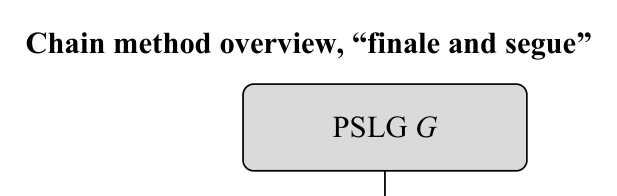

## Slide-by-slide digestion

### p. 116 - Chain method analysis
- Query: O(log2 N)
- Binary search O(log N) with each comparison taking O(log N)
- Preprocessing: O(N log N)
- Regularizing G, O(N log N)
- Constructing C from regular G, O(N)
- Space: O(N)
- See text pp. 54-55 for details of space analysis.

p. 117 - Chain method overview, “finale and segue”
- PSLG G
- Monotone complete
- set of chains C for G
- Regular PSLG G
- Regularize PSLG G
- (Text pp. 52-54)
- Construct C for regular G
- (Text pp. 50-52)
- Queries
- Preprocessing

What you must be able to say or do in an exam
- State the claim precisely before giving the argument.
- Identify the known lower bound / recurrence / invariant you are using.
- Keep the direction of the argument correct.
- End with the exact asymptotic conclusion.

Complexity and performance facts
State the course version of preprocessing, storage, and query bounds exactly as given in the slides.

## Common mistakes and danger points
- Do not describe the query bound without also describing what was precomputed to achieve it.

Exam-style drills and answer skeletons
Existing drill reminders from the earlier pack:
- Adapted from HW2-Q4: Modify graph-weight balancing so the second pass constructs a monotone complete set of chains.

Proof drill
**Question.** Explain the main argument in chain method: analysis and wrap-up in a logically correct order.

**How to answer.** Do not jump from intuition to conclusion. State the reduction/invariant/recurrence first, then derive the claimed bound.

## Recap
### What you must know cold
- What data is stored after preprocessing.
- How many binary-search steps happen during a query.
- Trade-off relative to simpler point-location methods like slabs.
Core test / key idea
- Query time comes from binary search over an ordered family of chains plus local search on a chain.
- Preprocessing and storage are more involved than brute force, but the pay-off is sublinear query time.
Complexity
- State the course version of preprocessing, storage, and query bounds exactly as given in the slides.
Common mistakes / danger points
- Do not describe the query bound without also describing what was precomputed to achieve it.
End-of-file summary
- What data is stored after preprocessing.
- How many binary-search steps happen during a query.
- Trade-off relative to simpler point-location methods like slabs.
- State the course version of preprocessing, storage, and query bounds exactly as given in the slides.
- Do not describe the query bound without also describing what was precomputed to achieve it.

Everything related to this topic
- **Previous file in reading order:** [Chain method: regularization of arbitrary PSLGs](02_Geometric_Search/19_chain-method-regularization.md)
- **Next file in reading order:** [Triangle refinement: setup and triangulation](02_Geometric_Search/21_triangle-refinement-setup.md)
- **Source slide range:** pp. 116-117 of `comp_geometry_slides_new.pdf`
- **Related recordings:** CS 564 - 02.06 5.2.txt
- **Related homework-derived exam prompts included here:** none directly mapped; generic exam drills added instead


---

# Triangle refinement: setup and triangulation

## Scope
- **Slides:** pp. 118-122
- **Major topic folder:** geometric-search
- **Recording files touching this material:** CS 564 - 02.11 6.1.txt
- **Goal of this file:** You should be able to study this topic without reopening the slide deck.

Big picture
Triangle refinement is the second major point-location framework. Instead of chains, it builds a hierarchy of triangulations plus a search DAG.

## What you must know cold
- Triangulate the PSLG.
- Build a sequence of coarser/finer triangulations.
- Interpret the links between levels as a directed acyclic search graph.

Core ideas and reasoning
- A triangle at one level points to the few triangles that refine it at the next level.
- The hierarchy turns point location into a descent through progressively smaller containing triangles.

Figures to actually look at
These are cropped from the main slide PDF. Do not skip them.

### Figure from slide p. 119


### Figure from slide p. 120


## Slide-by-slide digestion

### p. 118 - Triangle refinement method
- PSLG G
- Directed acyclic
- search graph T
- Triangulated PSLG G
- Triangulate PSLG G
- (To be covered later)
- Construct sequence of triangulations
- and directed acyclic search graph T
- (PS pp. 56-58)
- Queries

p. 119 - Triangulation
- A planar subdivision (e.g., a PSLG) is a triangulation
- if all its bounded regions are triangles.
- Not a triangulation
- Triangulation
- A triangulation of a finite set of points S is a planar graph on S
- with the maximum number of edges. There may be more than
- one triangulation for a given S, but they all have this property.
- The number of edges in a triangulation is at most 3N - 6,
- where N is the number of vertices. (Prove this statement by
- applying induction on N).

p. 120 - Triangulating G, part 1
- We assume that the PSLG given in the point location problem is
- a triangulation; if not, it is transformed into one in O(N) time.
- We will study triangulation algorithms later.
- We further assume that the triangulation has a triangular boundary.
- If not, one can be added in O(1) time by adding three vertices
- and triangulating the “inbetween” region.
- This will produce a triangulation with the maximum
- number of edges 3N-6. ( Prove this statement)
- Triangulation

p. 121 - Triangulating G, part 2
- Note that the text, published in 1985, says O(N log N) time is
- needed for the triangulation (p. 56).
- Chazelle published an O(N) triangulation algorithm in 1991;
- see O’Rourke pp. 64-65.
- Explaining Chazelle’s algorithm would be a (challenging)
- course project.
- Hereinafter, we assume:
- 1. G is a triangulation
- 2. G has a triangular boundary
- 3. G has exactly 3N - 6 edges (∈O(N))

p. 122 - Triangle refinement method
- PSLG G
- Directed acyclic
- search graph T
- Triangulated PSLG G
- Triangulate PSLG G
- (To be covered later)
- Construct a sequence of triangulations
- and directed acyclic search graph T
- (PS pp. 56-58)
- Queries

What you must be able to say or do in an exam
- State the input, output, preprocessing, and query/update model precisely.
- Explain the invariant or ordering that makes the method work.
- Trace the method by hand on a small example.
- Give the exact time and space bounds.
- Mention one edge case, degeneracy, or limitation.

Complexity and performance facts
Preprocessing constructs the triangulations and DAG; query follows one path down the DAG.

## Common mistakes and danger points
- The hierarchy is over triangulations, not arbitrary faces.
- You need the containment/refinement relationship to justify the search path.

Exam-style drills and answer skeletons
### Core exam drill
**Question.** State the problem solved by triangle refinement: setup and triangulation, describe preprocessing/query/update steps if any, and give the time and space bounds.

**How to answer.** An excellent answer names the input, the output, the invariant or ordering exploited by the method, and the exact asymptotic costs.

### Hand-trace drill
**Question.** Trace triangle refinement: setup and triangulation on a small example by hand and explain each comparison or structural change.

**How to answer.** On this course, being able to run the method on a picture matters more than writing vague slogans.

## Recap
### What you must know cold
- Triangulate the PSLG.
- Build a sequence of coarser/finer triangulations.
- Interpret the links between levels as a directed acyclic search graph.
Core test / key idea
- A triangle at one level points to the few triangles that refine it at the next level.
- The hierarchy turns point location into a descent through progressively smaller containing triangles.
Complexity
- Preprocessing constructs the triangulations and DAG; query follows one path down the DAG.
Common mistakes / danger points
- The hierarchy is over triangulations, not arbitrary faces.
- You need the containment/refinement relationship to justify the search path.
End-of-file summary
- Triangulate the PSLG.
- Build a sequence of coarser/finer triangulations.
- Interpret the links between levels as a directed acyclic search graph.
- Preprocessing constructs the triangulations and DAG; query follows one path down the DAG.
- The hierarchy is over triangulations, not arbitrary faces.
- You need the containment/refinement relationship to justify the search path.

Everything related to this topic
- **Previous file in reading order:** [Chain method: analysis and wrap-up](02_Geometric_Search/20_chain-method-analysis.md)
- **Next file in reading order:** [Triangle refinement: hierarchy, query, storage, and analysis](02_Geometric_Search/22_triangle-refinement-query-and-analysis.md)
- **Source slide range:** pp. 118-122 of `comp_geometry_slides_new.pdf`
- **Related recordings:** CS 564 - 02.11 6.1.txt
- **Related homework-derived exam prompts included here:** none directly mapped; generic exam drills added instead


---

# Triangle refinement: hierarchy, query, storage, and analysis

## Scope
- **Slides:** pp. 123-134
- **Major topic folder:** geometric-search
- **Recording files touching this material:** CS 564 - 02.11 6.1.txt
- **Goal of this file:** You should be able to study this topic without reopening the slide deck.

Big picture
This is the operative part of triangle refinement: how you descend the DAG, what you store, and why the path length stays logarithmic or near-logarithmic in the course analysis.

## What you must know cold
- How to test which child triangle contains the query point.
- Why each level narrows the search region.
- Storage and search-graph size issues.

Core ideas and reasoning
- Start from a top-level triangle covering the subdivision.
- At each level, perform point-in-triangle tests on the few candidate children and move to the unique containing child.
- Stop at a leaf triangle and recover the face in the original PSLG.

Figures to actually look at
These are cropped from the main slide PDF. Do not skip them.

### Figure from slide p. 125
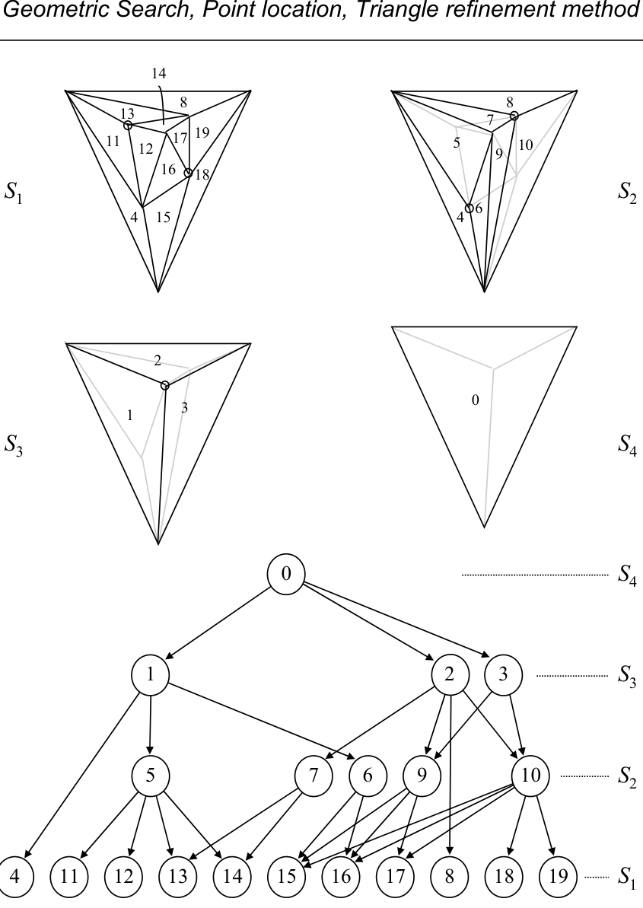

### Figure from slide p. 128
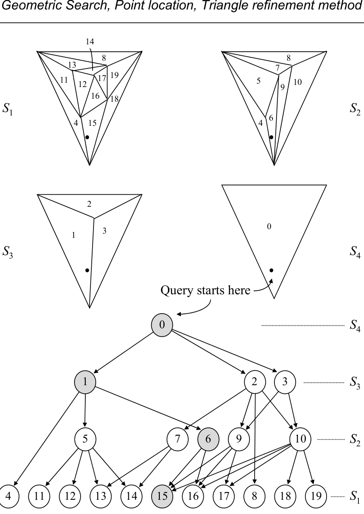

## Slide-by-slide digestion

### p. 123 - Sequence of triangulations
- We have triangulation G with N vertices. Construct a sequence of
- triangulations S1, S2, ..., Sh(N), where S1 = G and Si is obtained from
- Si-1 as follows:
- (1) Remove a maximal independent set of nonboundary vertices of
- Si-1 and their incident edges. A set of vertices of a graph (in our
- case a planar graph) is said to be independent if no two pair of
- vertices are adjacent in the graph. A maximal set is one such that
- adding one more vertex will make at least one pair of vertices to
- become adjacent. How this set is chosen will determine the
- performance of the algorithm.

p. 124 - Notation
- The notation Rj denotes a triangle.
- A triangle Rj may appear in more than one triangulation in
- the sequence, but is said to belong to triangulation Si
- if Rj was created in step (2) while constructing Si.
- Search data structure
- We now build a search data structure T, an acyclic directed graph.
- The nodes of T represent triangles.
- When discussing T, we say “triangle Rj” or just “Rj”
- when “the node of T that represents Rj” is meant.
- In T, there is an arc from triangle Rk to triangle Rj if,

p. 125 - Geometric Search, Point location, Triangle refinement method
- This slide is mainly visual. Use the figure crop in this file and make sure you can explain what the diagram is showing.

p. 126 - Triangle refinement method
- PSLG G
- Directed acyclic
- search graph T
- Triangulated PSLG G
- Triangulate PSLG G
- (To be covered later)
- Construct sequence of triangulations
- and directed acyclic search graph T
- (PS pp. 56-58)
- Queries

p. 127 - Query process, informal
- The query process uses a primitive operation, triangle inclusion,
- which can be computed in O(1) with 3 Left tests.
- The query begins by determining if the query point q is
- within the enclosing triangle.
- If not, the unbounded face is the answer to the query.
- If it is, the current node is set to the root node of T.
- Then q is tested for inclusion in the triangle for each of the
- descendants of the current node; it will be in exactly one.
- The search advances along the arc to that node,
- which becomes the current node, and the process repeats.

p. 128 - Query starts here
- This slide is mainly visual. Use the figure crop in this file and make sure you can explain what the diagram is showing.

p. 129 - Query process
- Define Γ(v) to be a list of all descendants of node v of T,
- and TRIANGLE(v) to the triangle represented by node v.

```text
procedure PointLocation(T,q)
begin
(q ∉TRIANGLE(root(T)))
“q in unbounded face”
v = root(T)
while (Γ(v) ≠ ∅)
for each u ∈Γ(v)
(q ∈TRIANGLE(u))
```

### p. 130 - Query time
- The choice of the triangulation vertices to be removed
- in constructing Si from Si-1 determines the performance
- (query time and storage) of the method.
- Define Ni as the number of vertices in triangulation Si.
- Suppose it was possible to choose vertices to be removed
- such that these properties hold:
- (1) Ni = αiNi-1, with αi ≤α < 1 for i = 2, ..., h(N).
- αi < 1 ⇒Ni < Ni-1,
- i.e., each successive triangulation Si is smaller than Si-1.
- All are smaller than their predecessor by at least α.

p. 131 - Storage
- Properties (1) and (2) imply O(N) storage required for T.
- Here’s why:
- Storage for T includes storage for nodes and for pointers.
- How may nodes? One per triangle in S1, S2, ..., Sh(N).
- How many triangles?
- Si contains Fi < 2Ni triangles,
- by Euler’s formula, p. 19, f ≤2v - 4.
- Total triangles for the sequence of triangulations is
- ≤ 2N1 + 2αN1 + 2α2N1 + ... + 2αi-1Ni + ... + 2αh(N)-1N1
- Sh(N)

p. 132 - Justifying the properties, part 1
- Having shown that properties (1) and (2)
- lead to a query time ∈O(log N) and storage ∈O(N),
- the question remains:
- how can the vertices to be removed when constructing the sequence
- of triangulations be selected to satisfy the properties?
- The selection criteria to be used is:
- “Remove a set of nonadjacent vertices of degree less than K.”
- Integer K will be given a value momentarily.
- The order of selection at each stage is not important. Procedure:
- (1) Arbitrarily select one vertex with degree less than K to remove.

p. 133 - Justifying the properties, part 2
- To show property (1) we use properties of planar graphs.
- Euler’s formula for a triangulation with a 3 edge boundary is
- e = 3v - 6
- where e is number of edges and v is number of vertices (v = N)
- Assume there exist internal vertices in the triangulation, i.e., N > 3.
- ⇒Each boundary vertex has degree ≥3.
- There are 3N - 6 edges and each edge contributes 2 to the sum
- of vertex degrees for the triangulation.
- ⇒Sum of vertex degrees=2*e < 6N.
- ⇒∃at least N/2 vertices of degree < 12.

p. 134 - Analysis
- Query time: O(log N)
- Storage: O(N)
- Preprocessing: O(N log N) or O(N)?
- The steps in preprocessing consists of triangulation of the
- PSLG (takes O(NlogN) time [or O(N) time if one used
- Chazelle’s algorithm), finding maximal independent set
- (O(N) work), retriangulation (takes O(N) time since each
- new face created has less than 12 sides and retriangulation of
- the new polygon takes O(1) time and we repeat this for at
- most the size of the independent set < N. The creation of the

What you must be able to say or do in an exam
- State the input, output, preprocessing, and query/update model precisely.
- Explain the invariant or ordering that makes the method work.
- Trace the method by hand on a small example.
- Give the exact time and space bounds.
- Mention one edge case, degeneracy, or limitation.

Complexity and performance facts
The course presentation emphasizes search depth and search-graph size; use the slide statements, not vague guesses.

## Common mistakes and danger points
- “Move to the child containing q” is the conceptual step. In implementation the child set must be explicitly stored and searched.
- Remember the relationship between triangulation leaves and original subdivision faces.
- Textual Big-O phrasing: statements should be read as asymptotic membership (e.g., belongs to `O(log N)`), not mathematical equality; do not turn bounds into false exact equalities.

Exam-style drills and answer skeletons
### Core exam drill
**Question.** State the problem solved by triangle refinement: hierarchy, query, storage, and analysis, describe preprocessing/query/update steps if any, and give the time and space bounds.

**How to answer.** An excellent answer names the input, the output, the invariant or ordering exploited by the method, and the exact asymptotic costs.

### Hand-trace drill
**Question.** Trace triangle refinement: hierarchy, query, storage, and analysis on a small example by hand and explain each comparison or structural change.

**How to answer.** On this course, being able to run the method on a picture matters more than writing vague slogans.

## Recap
### What you must know cold
- How to test which child triangle contains the query point.
- Why each level narrows the search region.
- Storage and search-graph size issues.
Core test / key idea
- Start from a top-level triangle covering the subdivision.
- At each level, perform point-in-triangle tests on the few candidate children and move to the unique containing child.
- Stop at a leaf triangle and recover the face in the original PSLG.
Complexity
- The course presentation emphasizes search depth and search-graph size; use the slide statements, not vague guesses.
Common mistakes / danger points
- “Move to the child containing q” is the conceptual step. In implementation the child set must be explicitly stored and searched.
- Remember the relationship between triangulation leaves and original subdivision faces.
- Textual Big-O phrasing: statements should be read as asymptotic membership (e.g., belongs to `O(log N)`), not mathematical equality; do not turn bounds into false exact equalities.
End-of-file summary
- How to test which child triangle contains the query point.
- Why each level narrows the search region.
- Storage and search-graph size issues.
- The course presentation emphasizes search depth and search-graph size; use the slide statements, not vague guesses.
- “Move to the child containing q” is the conceptual step. In implementation the child set must be explicitly stored and searched.
- Remember the relationship between triangulation leaves and original subdivision faces.

Everything related to this topic
- **Previous file in reading order:** [Triangle refinement: setup and triangulation](02_Geometric_Search/21_triangle-refinement-setup.md)
- **Next file in reading order:** [Range searching: problem statement and design space](02_Geometric_Search/23_range-searching-intro.md)
- **Source slide range:** pp. 123-134 of `comp_geometry_slides_new.pdf`
- **Related recordings:** CS 564 - 02.11 6.1.txt
- **Related homework-derived exam prompts included here:** none directly mapped; generic exam drills added instead


---

# Range searching: problem statement and design space

## Scope
- **Slides:** pp. 135-137
- **Major topic folder:** geometric-search
- **Recording files touching this material:** CS 564 - 02.11 6.1.txt
- **Goal of this file:** You should be able to study this topic without reopening the slide deck.

Big picture
This is the design-space intro for orthogonal range searching. After this point the course starts comparing data structures by the usual three costs: preprocessing, storage, query time.

## What you must know cold
- Input: static point set S.
- Query: axis-parallel rectangle or orthogonal range.
- Output modes: report all points or count them.

Core ideas and reasoning
- The same problem admits multiple structures depending on assumptions about data distribution and how much space you can afford.
- You should be able to compare structures, not just memorize isolated formulas.

Figures to actually look at
These are cropped from the main slide PDF. Do not skip them.

### Figure from slide p. 135


### Figure from slide p. 136


## Slide-by-slide digestion

### p. 135 - Introduction to range searching
- Range searching example
- Given N points in the plane, how many lie in a given rectangle with
- sides parallel to the coordinate axes? That is, how many points
- (x, y) satisfy lx ≤x ≤rx, ly ≤y ≤ry, for given lx, rx, ly, ry?
- Answer: 6

p. 136 - Introduction to range searching
- General range searching problem
- Given a data set of N objects, each consisting of an ordered d-tuple
- of values (x1, x2, ..., xd), and a query domain consisting of d ranges
- [li, ri] for 1 ≤i ≤d, count or report the objects whose values are
- within the query domain (i.e., where li ≤xi ≤ri for 1 ≤i ≤d).
- The domain is itself often called the query range, hence the term
- range searching.
- It is natural to view the d-tuples as points in d-dimensional
- Cartesian space (d-space) and the range as a region in that space.
- For example, in 2-space the objects and the range are points and

p. 137 - Standard range searching problem
- INSTANCE: Set S = {p1, p2, ..., pN} of N points in the plane,
- pi = (xi, yi) for 1 ≤i ≤N, and rectangular range R = [lx, rx] × [ly, ry],
- also in the plane.
- QUESTION: Report the points of S located within R,
- i.e. points pi ∈S where lx ≤xi ≤rx and ly ≤yi ≤ry.
- Range searching assumptions
- Unless otherwise noted, we will assume the following for all
- range searching problems and algorithms.
- 1. Two dimensional, all points and range within plane.
- 2 All

What you must be able to say or do in an exam
- Give the precise definitions.
- Distinguish similar notions cleanly.
- Use the right primitive test or formula on a concrete example.

Complexity and performance facts
Always state preprocessing, storage, and query/reporting time separately.

## Common mistakes and danger points
- The range is [lx, rx] x [ly, ry], not “the two corners” unless the notation is explicitly converted.
- Orthogonal range notation pitfall: the query range is the Cartesian product `[lx, rx] x [ly, ry]`; do not reinterpret the endpoints as two arbitrary corners unless you explicitly convert the notation.

Exam-style drills and answer skeletons
### Definition drill
**Question.** Give the precise definitions and the most important consequences from range searching: problem statement and design space.

**How to answer.** A strong answer distinguishes similar objects and uses the course terminology exactly.

## Recap
### What you must know cold
- Input: static point set S.
- Query: axis-parallel rectangle or orthogonal range.
- Output modes: report all points or count them.
Core test / key idea
- The same problem admits multiple structures depending on assumptions about data distribution and how much space you can afford.
- You should be able to compare structures, not just memorize isolated formulas.
Complexity
- Always state preprocessing, storage, and query/reporting time separately.
Common mistakes / danger points
- The range is [lx, rx] x [ly, ry], not “the two corners” unless the notation is explicitly converted.
- Orthogonal range notation pitfall: the query range is the Cartesian product `[lx, rx] x [ly, ry]`; do not reinterpret the endpoints as two arbitrary corners unless you explicitly convert the notation.
End-of-file summary
- Input: static point set S.
- Query: axis-parallel rectangle or orthogonal range.
- Output modes: report all points or count them.
- Always state preprocessing, storage, and query/reporting time separately.
- The range is [lx, rx] x [ly, ry], not “the two corners” unless the notation is explicitly converted.
- Orthogonal range notation pitfall: the query range is the Cartesian product `[lx, rx] x [ly, ry]`; do not reinterpret the endpoints as two arbitrary corners unless you explicitly convert the notation.

Everything related to this topic
- **Previous file in reading order:** [Triangle refinement: hierarchy, query, storage, and analysis](02_Geometric_Search/22_triangle-refinement-query-and-analysis.md)
- **Next file in reading order:** [Grid method](02_Geometric_Search/24_grid-method.md)
- **Source slide range:** pp. 135-137 of `comp_geometry_slides_new.pdf`
- **Related recordings:** CS 564 - 02.11 6.1.txt
- **Related homework-derived exam prompts included here:** none directly mapped; generic exam drills added instead


---

# Grid method

## Scope
- **Slides:** pp. 138-141
- **Major topic folder:** geometric-search
- **Recording files touching this material:** CS 564 - 02.13 7.1.txt
- **Goal of this file:** You should be able to study this topic without reopening the slide deck.

Big picture
The grid method is the simplest spatial subdivision approach. It is fast when the data is well behaved and can be awful in the worst case, which is the recurring moral of the early range-search structures.

## What you must know cold
- Partition the plane into an m x m regular grid.
- Store points by cell.
- A query range is decomposed into fully covered interior cells plus a boundary strip.

Core ideas and reasoning
- For interior cells, report or count all stored points directly.
- For boundary cells, examine points individually because the cell may only partially overlap the query.

Figures to actually look at
These are cropped from the main slide PDF. Do not skip them.

### Figure from slide p. 138


### Figure from slide p. 140


## Slide-by-slide digestion

### p. 138 - Grid method
- Concept
- Point data set S = {p1, p2, ..., pN}, pi = (xi, yi)
- Subdivision of plane into m × m grid (m is grid parameter)

p. 139 - Grid method
- Preprocessing

```text
procedure ConstructGrid
begin
Initialize m × m array of lists g to NULL.
for i = 1 to N
add pi to list g[xi /size(m)][yi /size(m)]
Quantity size(m) is the coordinate distance represented by
one grid interval.
m × m array of pointers to lists
Lists associated with grid cells
```

### p. 140 - Grid method
- Query

```text
procedure QueryGrid
begin
for i = lx/size(m) to rx/size(m) 
for j = ly/size(m) to ry/size(m) 
for each point pk on list g[i][j]
lx ≤xk ≤rx and ly ≤yk ≤ry
report pk
endfor
```

### p. 141 - Grid method
- Analysis
- Preprocessing: O(m2 + N).
- Query: O(m2 + N).
- Storage: O(m2 + N).
- Analysis comments
- Query not O(m2N) because each point only checked once.
- Not O(m2 + K) because some points are checked that are not
- reported. O(m2 + K) is better than O(m2 + N) and the former
- is allowed only when only points to be reported are checked.
- Al

What you must be able to say or do in an exam
- State the input, output, preprocessing, and query/update model precisely.
- Explain the invariant or ordering that makes the method work.
- Trace the method by hand on a small example.
- Give the exact time and space bounds.
- Mention one edge case, degeneracy, or limitation.

Complexity and performance facts
Good average behavior under uniform assumptions; worst-case query can degrade because many points may fall in a small number of cells.

## Common mistakes and danger points
- Grid parameter choice matters.
- Worst-case behavior is poor when data is clustered.

Professor emphasis from recordings
These points are distilled from the related recordings and focus on what the professor slowed down for, warned about, or connected to homework/exam reasoning.

- For the grid method the lecture frames average-case behavior as the attraction, but not as a worst-case guarantee. Bad point distributions can still hurt.

Exam-style drills and answer skeletons
### Core exam drill
**Question.** State the problem solved by grid method, describe preprocessing/query/update steps if any, and give the time and space bounds.

**How to answer.** An excellent answer names the input, the output, the invariant or ordering exploited by the method, and the exact asymptotic costs.

### Hand-trace drill
**Question.** Trace grid method on a small example by hand and explain each comparison or structural change.

**How to answer.** On this course, being able to run the method on a picture matters more than writing vague slogans.

## Recap
### What you must know cold
- Partition the plane into an m x m regular grid.
- Store points by cell.
- A query range is decomposed into fully covered interior cells plus a boundary strip.
Core test / key idea
- For interior cells, report or count all stored points directly.
- For boundary cells, examine points individually because the cell may only partially overlap the query.
Complexity
- Good average behavior under uniform assumptions; worst-case query can degrade because many points may fall in a small number of cells.
Common mistakes / danger points
- Grid parameter choice matters.
- Worst-case behavior is poor when data is clustered.
Professor emphasis (from recordings)
- For the grid method the lecture frames average-case behavior as the attraction, but not as a worst-case guarantee. Bad point distributions can still hurt.
End-of-file summary
- Partition the plane into an m x m regular grid.
- Store points by cell.
- A query range is decomposed into fully covered interior cells plus a boundary strip.
- Good average behavior under uniform assumptions; worst-case query can degrade because many points may fall in a small number of cells.
- Grid parameter choice matters.
- Worst-case behavior is poor when data is clustered.

Everything related to this topic
- **Previous file in reading order:** [Range searching: problem statement and design space](02_Geometric_Search/23_range-searching-intro.md)
- **Next file in reading order:** [Quadtree method](02_Geometric_Search/25_quadtree-method.md)
- **Source slide range:** pp. 138-141 of `comp_geometry_slides_new.pdf`
- **Related recordings:** CS 564 - 02.13 7.1.txt
- **Related homework-derived exam prompts included here:** none directly mapped; generic exam drills added instead


---

# Quadtree method

## Scope
- **Slides:** pp. 142-151
- **Major topic folder:** geometric-search
- **Recording files touching this material:** CS 564 - 02.13 7.1.txt
- **Goal of this file:** You should be able to study this topic without reopening the slide deck.

Big picture
Quadtrees adapt the grid idea recursively. Instead of fixing one uniform resolution everywhere, they subdivide only where needed, up to the chosen cutoff rule.

## What you must know cold
- Recursive subdivision into four quadrants.
- Leaf stopping criterion such as occupancy threshold or maximum depth.
- Query visits only nodes whose regions intersect the search range.

Core ideas and reasoning
- A quadtree is still space subdivision, not data-balanced subdivision.
- This makes it more adaptive than a fixed grid, but still vulnerable to bad worst-case distributions.

Figures to actually look at
These are cropped from the main slide PDF. Do not skip them.

### Figure from slide p. 146


### Figure from slide p. 147


## Slide-by-slide digestion

### p. 142 - Quadtree method
- Definitions
- A quadtree subdivision is a recursive subdivision of the plane into
- four equal sized quadrants. A quad is a quadrant or subquadrant
- at any level of the subdivision, including the plane itself.
- Each quad is represented by a node in a four-way branching tree
- called a quadtree. (The root represents the plane.) Each node of
- a quadtree has either 0 or 4 children, depending on whether the
- corresponding quad is subdivided. Each non-root node represents
- one subquadrant of its parent’s quad.
- Subdivision of a quad recurses until:

p. 143 - Quadtree method
- Point data set S.
- Quadtree subdivision
- for S with M = 2 and
- D = 3.
- Quad where D = 3
- cut off further
- subdivision.

p. 144 - Quadtree method
- Quadtree subdivision
- for S with M = 2 and
- D = 3.
- Quad where D = 3
- cut off further
- subdivision.
- Corresponding
- quadtree.
- Branch numbering convention
- Attached point list (showing number of points)

p. 145 - Quadtree method
- Construction
- A quadtree is built over a square subset of the plane, or domain,
- defined to include all points of S; domain = [Lx, Rx] × [Ly, Ry].
- Domain subdivided into a regular m × m grid of square cells,
- each containing a list of points of S located in that cell; m = 2D + 1.
- Conceptually, the overall quadtree is built bottom-up from the grid.
- Associate with each cell a one-node quadtree, at level D + 1.
- To construct a quadtree with root at level λ, the four quadtrees at
- level λ + 1 that represent its subquadrants are “combined”.
- To “combine” quadtrees q0, q1, q2, q3 at level λ + 1:

p. 146 - Quadtree method
- Level 4.
- Level 3.

p. 147 - Quadtree method
- Level 2.
- Levels 1 and 0.

p. 148 - Quadtree method
- Preprocessing
- Quadtree node q
- q.points
- List of points of S within quad for this node; NULL if not leaf.
- q.child[4] Pointers to subtrees, NULL if leaf.
- Number of points within quads represented by the subtree rooted at this node.
- q.quad
- Boundaries of the quad represented by this node; format [lx, rx] × [ly, ry].
- Q = ConstructQuadtree(G, M, D, 0, 0, m-1, 0, m-1, domain)

```text
procedure ConstructQuadtree(G, M, D, level, imin, imax, jmin, jmax, quad)
```

### p. 149 - Quadtree method
- jmid + 1
- jmax
- (l + r ) / 2
- (lx + rx) / 2
- Geometry of recursive calls in CreateQuadtree
- jmid
- jmin
- İmid+1
- imax
- (ly + ry) / 2

p. 150 - Quadtree method
- Query
- QueryQuadtree(root(Q),R)

```text
/* Q is quadtree, R = [lx, rx] × [ly, ry] is range. */
procedure QueryQuadtree(q, R)
begin
(q.quad ∩R) then /* Query range overlaps node’s quad. */
(q.child[0] = NULL) then /*Node q is a leaf. */
for each point pi on q.points /* Scan the point list. */
(pi within R) then
report pi
```

### p. 151 - Quadtree method
- Analysis
- Preprocessing: O(m2 + N); recall that m = 2D + 1.
- Query: O(2D + N).
- Storage: O(m2 + N).
- Analysis comments
- Note that ConstructQuadtree is O(m2), not O(m2 + N), because
- point lists rather than points are handled (appending 4 lists can be
- done in constant time). However, constructing the grid G, input to
- ConstructQuadtree, is O(m2 + N).
- Th

What you must be able to say or do in an exam
- State the input, output, preprocessing, and query/update model precisely.
- Explain the invariant or ordering that makes the method work.
- Trace the method by hand on a small example.
- Give the exact time and space bounds.
- Mention one edge case, degeneracy, or limitation.

Complexity and performance facts
Often better in practice than a flat grid, but worst-case bounds remain distribution-sensitive.

## Common mistakes and danger points
- Leaves need not be at the same depth.
- Boundary overlap handling matters when deciding whether to recurse, report a whole subtree, or inspect stored points.

Exam-style drills and answer skeletons
### Core exam drill
**Question.** State the problem solved by quadtree method, describe preprocessing/query/update steps if any, and give the time and space bounds.

**How to answer.** An excellent answer names the input, the output, the invariant or ordering exploited by the method, and the exact asymptotic costs.

### Hand-trace drill
**Question.** Trace quadtree method on a small example by hand and explain each comparison or structural change.

**How to answer.** On this course, being able to run the method on a picture matters more than writing vague slogans.

## Recap
### What you must know cold
- Recursive subdivision into four quadrants.
- Leaf stopping criterion such as occupancy threshold or maximum depth.
- Query visits only nodes whose regions intersect the search range.
Core test / key idea
- A quadtree is still space subdivision, not data-balanced subdivision.
- This makes it more adaptive than a fixed grid, but still vulnerable to bad worst-case distributions.
Complexity
- Often better in practice than a flat grid, but worst-case bounds remain distribution-sensitive.
Common mistakes / danger points
- Leaves need not be at the same depth.
- Boundary overlap handling matters when deciding whether to recurse, report a whole subtree, or inspect stored points.
End-of-file summary
- Recursive subdivision into four quadrants.
- Leaf stopping criterion such as occupancy threshold or maximum depth.
- Query visits only nodes whose regions intersect the search range.
- Often better in practice than a flat grid, but worst-case bounds remain distribution-sensitive.
- Leaves need not be at the same depth.
- Boundary overlap handling matters when deciding whether to recurse, report a whole subtree, or inspect stored points.

Everything related to this topic
- **Previous file in reading order:** [Grid method](02_Geometric_Search/24_grid-method.md)
- **Next file in reading order:** [k-d tree method](02_Geometric_Search/26_kd-tree-method.md)
- **Source slide range:** pp. 142-151 of `comp_geometry_slides_new.pdf`
- **Related recordings:** CS 564 - 02.13 7.1.txt
- **Related homework-derived exam prompts included here:** none directly mapped; generic exam drills added instead


---

# k-d tree method

## Scope
- **Slides:** pp. 152-160
- **Major topic folder:** geometric-search
- **Recording files touching this material:** CS 564 - 02.13 7.2.txt
- **Goal of this file:** You should be able to study this topic without reopening the slide deck.

Big picture
The k-d tree is the first range-search structure in this block that subdivides based on the data rather than the ambient space. That is why its worst-case story is better.

## What you must know cold
- Alternate vertical and horizontal splits.
- Choose splitting points/medians so subproblems are roughly balanced.
- Query recursively visits only subtrees whose regions intersect the search range.

Core ideas and reasoning
- Each node stores a point and induces an axis-aligned region for its subtree.
- Balance comes from splitting by median coordinate, not by a fixed background grid.
- This is why the structure supports logarithmic-style search behavior in the balanced case.

Figures to actually look at
These are cropped from the main slide PDF. Do not skip them.

### Figure from slide p. 154
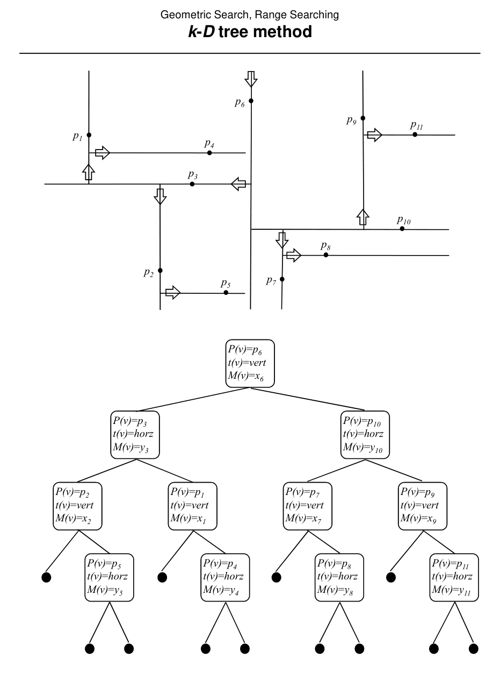

### Figure from slide p. 158
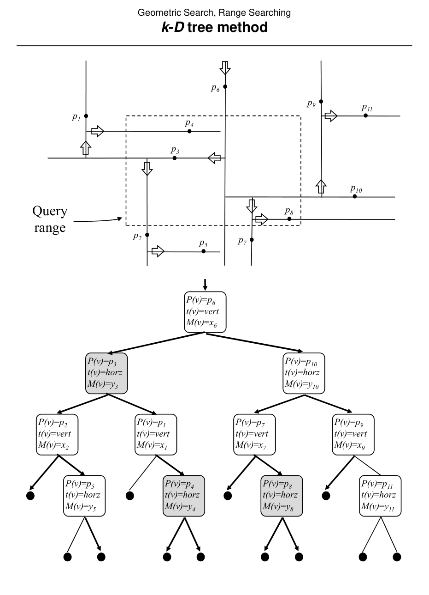

## Slide-by-slide digestion

### p. 152 - k-D tree method
- Concept
- Grid and Quadtree methods subdivide plane based on space, not
- data set, leading to poor worst case performance. Following
- methods subdivide plane based on points in data set.
- A k-dimensional binary tree (k-D tree) recursively subdivides the
- plane into half-planes, in alternating orthogonal directions, at lines
- determined by the points of S. Each subdivision results in
- approximately equal numbers of points on either side of the
- bisecting line, allowing bisecting (binary) search.
- Th

p. 153 - A two-dimensional binary search tree is constructed associated
- with the given set of points S (pre-processing step).
- A node v in the tree is associated with a point P(v) of S and a
- line l(v) [ parallel to x- or y-axis] is assumed to pass through it.
- A rectangle R(v) is associated with v. The line l(v) divides R(v)
- into two regions R1 and R2.
- Search continues in region
- R2 since R2 covers D∩R(v).
- D may or may not contain P(v).
- Search must continue in both R1
- and R2.

p. 154 - k-D tree method
- P(v)=p6
- t(v)=vert
- M(v)=x6
- P(v)=p10
- t(v)=horz
- M(v)=y10
- P(v)=p3
- M(v)=y3
- P(v)=p2
- M(v)=x2

p. 155 - k-D tree method
- Preprocessing
- Data associated with each node v of k-D tree:
- Explicit
- P(v) Point through which plane is bisected.
- t(v)
- Direction of bisection, t(v) ∈{horz, vert}.
- M(v) x (or y) value of bisecting line.
- Implicit
- R(v) Rectangle (half-plane) on P(v)’s side of
- the bisecting line associated with Parent(v).

p. 156 - k-D tree method
- Preprocessing

```text
procedure CreatekDNode(S,t) /* S is set of points, t is direction. */
begin
S = ∅then
return NULL /* Leaf nodes are NULL pointers. */
Allocate new node v
t = vert then
Find pi ∈S ∋xi is median for all x ∈S
M(v) = xi /* x coordinate of bisecting line */
SL = {pj ∈S - {pi} xj < xi}
```

### p. 157 - Analysis
- The preprocessing time is O(nlogn) for d=2. The argument goes
- as follows:
- 1. Using O(nlogn) time sort the points along x- and y-axis.
- For our example, this will produce two lists:
- L1= (1,2,3,4,5,6,7,8,9,10,11)
- L2= (5,7,2,8,10,3,4,1,11,9,6)
- 2. Pick the median element point 6 to be the root vertex v. This takes
- O(1) time.
- 3.Search L2 with x-coordinate value of point 6..say xm,from left to right.
- If the x-coordinate of the element is less than xm then put the element

p. 158 - k-D tree method
- Query
- range
- P(v)=p6
- t(v)=vert
- M(v)=x6
- P(v)=p10
- t(v)=horz
- M(v)=y10
- P(v)=p3
- M(v)=y3

p. 159 - k-D tree method
- Query
- SearchkDTree(root(T),R)

```text
/* T is k-D tree. */
/* R = [lx, rx] × [ly, ry] is search range. */
procedure SearchkDTree(v,R) /* v is a tree node, R is range. */
begin
(v ≠NULL) then
(t(v) = vert) then
[l, r] = [lx, rx]
[l, r] = [ly, ry]
```

### p. 160 - k-D tree method
- Analysis
- Very complex; algorithm appeared in 1975, analysis not
- until 1977. See Preparata pp. 77-79 or Laszlo p. 248 for details.
- Preprocessing: θ(dN log N); d is number of dimensions.
- Both presort (for median finding) and recurrence for algorithm
- recursion are O(N log N).
- Query: O(dN1-1/d + K); e.g. for d = 2, O(√N + K).
- Storage: O(dN).

What you must be able to say or do in an exam
- State the input, output, preprocessing, and query/update model precisely.
- Explain the invariant or ordering that makes the method work.
- Trace the method by hand on a small example.
- Give the exact time and space bounds.
- Mention one edge case, degeneracy, or limitation.

Complexity and performance facts
Balanced construction supports efficient range searching with query time depending on visited nodes plus reported points.

## Common mistakes and danger points
- The split direction alternates by level. The recordings mention a common coding/slide confusion exactly here.
- Do not describe it as a quadtree with two children. The construction principle is different.

Exam-style drills and answer skeletons
### Core exam drill
**Question.** State the problem solved by k-d tree method, describe preprocessing/query/update steps if any, and give the time and space bounds.

**How to answer.** An excellent answer names the input, the output, the invariant or ordering exploited by the method, and the exact asymptotic costs.

### Hand-trace drill
**Question.** Trace k-d tree method on a small example by hand and explain each comparison or structural change.

**How to answer.** On this course, being able to run the method on a picture matters more than writing vague slogans.

## Recap
### What you must know cold
- Alternate vertical and horizontal splits.
- Choose splitting points/medians so subproblems are roughly balanced.
- Query recursively visits only subtrees whose regions intersect the search range.
Core test / key idea
- Each node stores a point and induces an axis-aligned region for its subtree.
- Balance comes from splitting by median coordinate, not by a fixed background grid.
- This is why the structure supports logarithmic-style search behavior in the balanced case.
Complexity
- Balanced construction supports efficient range searching with query time depending on visited nodes plus reported points.
Common mistakes / danger points
- The split direction alternates by level. The recordings mention a common coding/slide confusion exactly here.
- Do not describe it as a quadtree with two children. The construction principle is different.
End-of-file summary
- Alternate vertical and horizontal splits.
- Choose splitting points/medians so subproblems are roughly balanced.
- Query recursively visits only subtrees whose regions intersect the search range.
- Balanced construction supports efficient range searching with query time depending on visited nodes plus reported points.
- The split direction alternates by level. The recordings mention a common coding/slide confusion exactly here.
- Do not describe it as a quadtree with two children. The construction principle is different.

Everything related to this topic
- **Previous file in reading order:** [Quadtree method](02_Geometric_Search/25_quadtree-method.md)
- **Next file in reading order:** [Direct access methods](02_Geometric_Search/27_direct-access-methods.md)
- **Source slide range:** pp. 152-160 of `comp_geometry_slides_new.pdf`
- **Related recordings:** CS 564 - 02.13 7.2.txt
- **Related homework-derived exam prompts included here:** none directly mapped; generic exam drills added instead


---

# Direct access methods

## Scope
- **Slides:** pp. 161-173
- **Major topic folder:** geometric-search
- **Recording files touching this material:** CS 564 - 02.13 7.2.txt, CS 564 - 02.18 8.1.txt
- **Goal of this file:** You should be able to study this topic without reopening the slide deck.

Big picture
These methods are the space-hungry extreme of the design space: precompute answers so aggressively that queries become very fast. This is conceptually important even if it looks absurdly expensive.

## What you must know cold
- Brute force baseline.
- Normalization of coordinates / ranks.
- Single-stage and multi-stage direct access as precomputation strategies.

Core ideas and reasoning
- The extreme idea is to precompute answers for every possible normalized query range.
- Single-stage direct access spends a huge amount of storage for very small query time.
- Multi-stage direct access reduces storage by factoring the query into stages.

Figures to actually look at
These are cropped from the main slide PDF. Do not skip them.

### Figure from slide p. 165


### Figure from slide p. 171


## Slide-by-slide digestion

### p. 161 - Direct access method (brute force)
- Concept
- Points of S partition plane into (N + 1)2 cells.
- Given range R = [lx, rx] × [ly, ry], points (lx, ly) and (rx, ry) each lie in
- a particular cell. Moving one of those points within a cell does not
- change the answer (the subset of S within R). Thus a pair of cells
- forms an equivalence class of ranges.
- ⇒The number of distinct ranges is bounded above by
- N + 1 2 ∈O(N4).

p. 162 - Direct access method (brute force)
- Preprocessing
- Compute and save answer for each of O(N4) different pairs of cells.
- Query
- 1. Given R = [lx, rx] × [ly, ry], map points (lx, ly) and (rx, ry) to cells.
- 2. Access and report answer stored for the pair of cells.
- Analysis
- Preprocessing: O(N5); O(N4) cells, O(N) linear processing for each.
- Query: O(log N + K); O(log N) to find cells for range corners
- Query: O(log N + K); O(log N) to find cells for range corners.
- Storage: O(N5); O(N4) cells, O(N) elements for each cell.

p. 163 - Normalization
- Normalization of coordinates
- It will be useful to have available normalized coordinates for both
- ranges and points. For points ∈ S, normalized x coordinate is
- in [1, N], assigned in order of increasing x coordinate.
- For range R = [lx, rx] × [ly, ry], normalized range is obtained by
- mapping range extents to normalized coordinates for points. Range
- normalized x coordinates are in [1, N + 1]. For example,
- if xi-1 ≤lx ≤ xi, lx normalized is i.
- points ∈ S
- normalized coordinates

p. 164 - Direct access method (single stage)
- Concept
- One-dimensional binary search is optimal in storage θ(N) and
- time O(log N + K). Combine direct access on one coordinate (x)
- with one-dimensional binary search on the other (y).
- Combination is single stage direct access.
- Given range R = [lx, rx] × [ly, ry], normalize [lx, rx] to (i, j);
- normalized range will have 1 ≤i ≤j ≤N + 1.
- Use x-range (i, j) to access entry in direct access array.
- Each array entry points to a binary search tree which holds points
- of S with normalized coordinates in [i, j], stored in ascending

p. 165 - Direct access method (single stage)
- x-range
- y-range
- x-range array
- Pointer to binary search tree for y-range

p. 166 - Direct access method (single stage)
- This slide is mainly visual. Use the figure crop in this file and make sure you can explain what the diagram is showing.

p. 167 - Direct access method (single stage)
- Preprocessing
- For each pair of normalized x coordinates (i, j), build a threaded
- binary tree storing the subset of S with normalized x coordinates
- in the interval [i, j] in ascending y coordinate order.
- Query
- 1. Normalize x-range of R = [lx, rx] × [ly, ry]. O(log N)
- 2. Access x-range array to get tree pointer. O(1)
- 3. Search tree for y ≥ ly. O(log N)
- 4. Report points within y-range by following threads in tree
- until y ≥ ry. O(K)

p. 168 - Direct access method (multistage)
- Concept
- We would like to improve the O(N3) storage of single stage direct
- access method. Instead of precomputing answers for all possible
- x-ranges, do so for a smaller set of fixed x-ranges. For a query
- x-range, find a set of the fixed ranges that cover it, and combine
- their precomputed answers.
- N + 1
- division
- gauge
- Point set S x-ranges

p. 169 - Direct access method (multistage)
- Data structure
- Multiple direct access arrays, one for each gauge
- ⇒1 array for coarse level, multiple at fine level.
- Each array contains an entry for each possible interval in that gauge.
- As in the single stage version, each entry is a pointer to a threaded
- binary tree containing the points of S located within the x-range of
- the interval, stored in ascending y order.
- Preprocessing
- For each level (coarse and fine)
- for each gauge at the level

p. 170 - Direct access method (multistage)
- Query (Explanation)
- • Find the beginning and end of the query x-range. This will
- correspond to three intervals: one in the coarse gauge and
- two in the fine gauges (O log (N)).
- • There is a direct access array for the coarse division, whose
- elements are pointing to the threaded binary trees for each
- possible coarse x-range.
- • After we identify the query x-range with two normalization
- (binary searches), go to the direct access array for the
- coarse subdivision and follow the array element to access

p. 171 - Direct access method (multistage)
- This slide is mainly visual. Use the figure crop in this file and make sure you can explain what the diagram is showing.

p. 172 - Direct access method (multistage)
- Example (storage and query cost):
- N = 100, α = 0.5, coarse gauge contains N 0.5 =10 divisions. N
- (100) possible coarse-gauge intervals. N (100) binary trees
- each with N (100) points. The total storage cost is 100 x 100 =
- 10,000 (O(N 2)).
- Each fine gauge contains N 1-0.5 = N 0.5 = 10 divisions. There are
- N 0.5 = 10 such structures. Each fine division contains 10 points
- and the storage cost of the binary search trees of a single
- structure in the fine division is N 0.5 x 2 =100. For a total storage
- of N 0.5 x N 0.5 x 2 x N 0.5 = 10,000 points. Total storage cost for

p. 173 - Direct access method (multistage)
- Analysis
- Preprocessing: O(N2 log N); O(N) trees, O(N log N) each.
- Query: O(log N + K); see comments.
- Storage: O(N2); see below.
- Storage analyis details
- Coarse
- Gauges per level
- Nα
- Divisions per gauge
- N1−α

What you must be able to say or do in an exam
- State the input, output, preprocessing, and query/update model precisely.
- Explain the invariant or ordering that makes the method work.
- Trace the method by hand on a small example.
- Give the exact time and space bounds.
- Mention one edge case, degeneracy, or limitation.

Complexity and performance facts
Query time is excellent; storage is the real issue and is the entire reason later structures exist.

## Common mistakes and danger points
- Do not praise a direct-access method without also admitting its brutal storage cost.
- Normalization is essential; otherwise the number of possible raw coordinates is meaningless.

Professor emphasis from recordings
These points are distilled from the related recordings and focus on what the professor slowed down for, warned about, or connected to homework/exam reasoning.

- The direct-access methods are taught as a precomputation-for-speed tradeoff: brilliant when query volume is huge, ridiculous when storage is the bottleneck.
- He points out just how brutal the storage explosion can become, which is exactly the sort of comparison the exam likes.

Exam-style drills and answer skeletons
Existing drill reminders from the earlier pack:
- Design a structure for a laminar family of non-crossing rectangles that answers containment-count queries faster than scanning all rectangles.
- Adapted from HW2-Q3: Store a laminar set of rectangles so that a query point reports how many rectangles contain it, and support insertion of a new rectangle.

HW2-Q3 adapted
**Question.** Design a structure for non-intersecting rectangles so that a query point P returns how many rectangles contain P, and describe insertion of a new rectangle.

**How to answer.** Exploit the non-intersection assumption to reduce overlap complexity. The intended answer should preprocess boundaries so a query does much less than checking all rectangles.

### Core exam drill
**Question.** State the problem solved by direct access methods, describe preprocessing/query/update steps if any, and give the time and space bounds.

**How to answer.** An excellent answer names the input, the output, the invariant or ordering exploited by the method, and the exact asymptotic costs.

### Hand-trace drill
**Question.** Trace direct access methods on a small example by hand and explain each comparison or structural change.

**How to answer.** On this course, being able to run the method on a picture matters more than writing vague slogans.

## Recap
### What you must know cold
- Brute force baseline.
- Normalization of coordinates / ranks.
- Single-stage and multi-stage direct access as precomputation strategies.
Core test / key idea
- The extreme idea is to precompute answers for every possible normalized query range.
- Single-stage direct access spends a huge amount of storage for very small query time.
- Multi-stage direct access reduces storage by factoring the query into stages.
Complexity
- Query time is excellent; storage is the real issue and is the entire reason later structures exist.
Common mistakes / danger points
- Do not praise a direct-access method without also admitting its brutal storage cost.
- Normalization is essential; otherwise the number of possible raw coordinates is meaningless.
Professor emphasis (from recordings)
- The direct-access methods are taught as a precomputation-for-speed tradeoff: brilliant when query volume is huge, ridiculous when storage is the bottleneck.
- He points out just how brutal the storage explosion can become, which is exactly the sort of comparison the exam likes.
End-of-file summary
- Brute force baseline.
- Normalization of coordinates / ranks.
- Single-stage and multi-stage direct access as precomputation strategies.
- Query time is excellent; storage is the real issue and is the entire reason later structures exist.
- Do not praise a direct-access method without also admitting its brutal storage cost.
- Normalization is essential; otherwise the number of possible raw coordinates is meaningless.

Everything related to this topic
- **Previous file in reading order:** [k-d tree method](02_Geometric_Search/26_kd-tree-method.md)
- **Next file in reading order:** [Range trees](02_Geometric_Search/28_range-trees.md)
- **Source slide range:** pp. 161-173 of `comp_geometry_slides_new.pdf`
- **Related recordings:** CS 564 - 02.13 7.2.txt, CS 564 - 02.18 8.1.txt
- **Related homework-derived exam prompts included here:** HW2-Q3 adapted


---

# Range trees

## Scope
- **Slides:** pp. 174-179
- **Major topic folder:** geometric-search
- **Recording files touching this material:** CS 564 - 02.18 8.1.txt
- **Goal of this file:** You should be able to study this topic without reopening the slide deck.

Big picture
Range trees are the most exam-worthy structure in the range-search block because they explicitly reuse segment-tree ideas and then add a second search structure inside each node. Tree of trees, because apparently one tree was not enough.

## What you must know cold
- Primary structure by x-intervals, secondary ordered structure by y-values at each node.
- Range-tree query decomposes the x-range into canonical nodes and then searches y inside each associated structure.
- Semi-open interval convention and why it matters.

Core ideas and reasoning
- Think of a range tree as a segment tree whose allocation lists have been replaced by searchable ordered trees.
- The x-range decomposition produces O(log N) canonical nodes.
- At each canonical node, query the y-ordered associated structure to report or count exactly the points whose x-values are already known to be valid.

Figures to actually look at
These are cropped from the main slide PDF. Do not skip them.

### Figure from slide p. 177


### Figure from slide p. 178


## Slide-by-slide digestion

### p. 174 - Range tree method
- Definition
- A range tree is a segment tree where the allocation list A(v) for each
- node has been replaced with a standard threaded binary tree. Stored
- (“allocated”) in the allocation tree for each node are the points
- of S with x-coordinates within the scope interval associated with
- that node. The trees are organized in ascending y-coordinate order.
- Note that in a range tree the scope intervals are all semi-closed.
- The allocation tree for node for [i, j) does not contain pj.
- For that reason the range tree for S = {p1, p2, ..., pN} is
- T(1, N + 1).

p. 175 - Range tree method
- Query
- Informally, traverse the segment tree as if inserting the x-range;
- at each allocation node, search the allocation tree of the node
- for points in the y-range.
- More formally, to perform range query R = [lx, rx] × [ly, ry]
- in range tree T:
- SearchRangeTree(lx, rx + 1, ly, ry, root(T))

```text
procedure SearchRangeTree(lx, rx , ly, ry, v)
begin
(lx ≤B(v) and E(v) ≤rx) then
```

### p. 176 - Range tree method
- Analysis
- Preprocessing: O(N log N)
- Query: O((log N)2 + K); O(log N) allocation nodes in the
- segment tree structure for the query x-range,
- with an O(log N) binary tree search for each.
- Storage: O(N log N); see Preparata, p. 86.
- Comments
- The query time can be improved to O(log N + K).
- Observe that once the query y-range starting point in S has been
- found (via a binary search at one node) there is no need to find it

p. 177 - Range tree method
- This slide is mainly visual. Use the figure crop in this file and make sure you can explain what the diagram is showing.

p. 178 - Range tree method
- This slide is mainly visual. Use the figure crop in this file and make sure you can explain what the diagram is showing.

p. 179 - Range tree method
- This slide is mainly visual. Use the figure crop in this file and make sure you can explain what the diagram is showing.

What you must be able to say or do in an exam
- State the input, output, preprocessing, and query/update model precisely.
- Explain the invariant or ordering that makes the method work.
- Trace the method by hand on a small example.
- Give the exact time and space bounds.
- Mention one edge case, degeneracy, or limitation.

Complexity and performance facts
Typical course version: near-linear or O(N log N) storage, logarithmic decomposition cost, plus per-node secondary search and output term.

## Common mistakes and danger points
- Do not forget that the associated structures are ordered by y, while the primary decomposition is by x.
- Use the exact interval convention from the slides. Endpoint sloppiness leaks points.

Professor emphasis from recordings
These points are distilled from the related recordings and focus on what the professor slowed down for, warned about, or connected to homework/exam reasoning.

- The lecture links range trees back to one-dimensional search structures. The right mental model is layered searching: first narrow the x-range, then search corresponding y-structures.
- This is also the natural place to think about the homework question on closest neighbors in a one-dimensional range tree, because the whole point is understanding what information each node can cache.

Exam-style drills and answer skeletons
Existing drill reminders from the earlier pack:
- Given a point on the line stored in a perfect range tree, explain why only predecessor and successor matter for the nearest neighbor.
- Describe an augmentation that stores enough local information to answer the closest-neighbor query in O(1) after maintenance.
- Adapted from HW2-Q2: For points on one axis stored in a range tree, find the closest neighbor in O(log N), then augment the structure to answer in O(1).

HW2-Q2 adapted
**Question.** A set of points on one axis is stored in a perfect binary range tree. Given a pointer to a node, find the closest neighbor in O(log N), then explain how to augment the tree so the answer becomes O(1).

**How to answer.** Without augmentation, move through ancestor/sibling structure and compare the nearest predecessor/successor candidates. With augmentation, store closest-neighbor information per node and maintain it under updates.

### Core exam drill
**Question.** State the problem solved by range trees, describe preprocessing/query/update steps if any, and give the time and space bounds.

**How to answer.** An excellent answer names the input, the output, the invariant or ordering exploited by the method, and the exact asymptotic costs.

### Hand-trace drill
**Question.** Trace range trees on a small example by hand and explain each comparison or structural change.

**How to answer.** On this course, being able to run the method on a picture matters more than writing vague slogans.

## Recap
### What you must know cold
- Primary structure by x-intervals, secondary ordered structure by y-values at each node.
- Range-tree query decomposes the x-range into canonical nodes and then searches y inside each associated structure.
- Semi-open interval convention and why it matters.
Core test / key idea
- Think of a range tree as a segment tree whose allocation lists have been replaced by searchable ordered trees.
- The x-range decomposition produces O(log N) canonical nodes.
- At each canonical node, query the y-ordered associated structure to report or count exactly the points whose x-values are already known to be valid.
Complexity
- Typical course version: near-linear or O(N log N) storage, logarithmic decomposition cost, plus per-node secondary search and output term.
Common mistakes / danger points
- Do not forget that the associated structures are ordered by y, while the primary decomposition is by x.
- Use the exact interval convention from the slides. Endpoint sloppiness leaks points.
Professor emphasis (from recordings)
- The lecture links range trees back to one-dimensional search structures. The right mental model is layered searching: first narrow the x-range, then search corresponding y-structures.
- This is also the natural place to think about the homework question on closest neighbors in a one-dimensional range tree, because the whole point is understanding what information each node can cache.
End-of-file summary
- Primary structure by x-intervals, secondary ordered structure by y-values at each node.
- Range-tree query decomposes the x-range into canonical nodes and then searches y inside each associated structure.
- Semi-open interval convention and why it matters.
- Typical course version: near-linear or O(N log N) storage, logarithmic decomposition cost, plus per-node secondary search and output term.
- Do not forget that the associated structures are ordered by y, while the primary decomposition is by x.
- Use the exact interval convention from the slides. Endpoint sloppiness leaks points.

Everything related to this topic
- **Previous file in reading order:** [Direct access methods](02_Geometric_Search/27_direct-access-methods.md)
- **Next file in reading order:** [Range searching summary](02_Geometric_Search/29_range-searching-summary.md)
- **Source slide range:** pp. 174-179 of `comp_geometry_slides_new.pdf`
- **Related recordings:** CS 564 - 02.18 8.1.txt
- **Related homework-derived exam prompts included here:** HW2-Q2 adapted


---

# Range searching summary

## Scope
- **Slides:** pp. 180-180
- **Major topic folder:** geometric-search
- **Recording files touching this material:** None identified
- **Goal of this file:** You should be able to study this topic without reopening the slide deck.

Big picture
This page is the comparison table. Study it as a comparative diagnosis, not as isolated numbers.

## What you must know cold
- Which methods subdivide space vs subdivide the data.
- Trade-offs among preprocessing, storage, and query time.
- When average-case assumptions rescue a method that is weak in the worst case.

Core ideas and reasoning
- The whole point of the block is comparison.
- If asked to recommend a structure, justify it using the problem constraints rather than reciting a complexity line.

Slide-by-slide digestion

### p. 180 - Summary
- Summary of this topic
- Problem/Algorithm
- Preprocessing
- Query
- Storage
- Polygon inclusion
- Left test (convex)
- O(N)
- Intersection counting (simple)
- Wedges (convex and star shaped)

What you must be able to say or do in an exam
- Give the precise definitions.
- Distinguish similar notions cleanly.
- Use the right primitive test or formula on a concrete example.

Complexity and performance facts
Know the summary table from the slides.

## Common mistakes and danger points
- Do not mix average-case comments with worst-case guarantees.

Exam-style drills and answer skeletons
### Definition drill
**Question.** Give the precise definitions and the most important consequences from range searching summary.

**How to answer.** A strong answer distinguishes similar objects and uses the course terminology exactly.

## Recap
### What you must know cold
- Which methods subdivide space vs subdivide the data.
- Trade-offs among preprocessing, storage, and query time.
- When average-case assumptions rescue a method that is weak in the worst case.
Core test / key idea
- The whole point of the block is comparison.
- If asked to recommend a structure, justify it using the problem constraints rather than reciting a complexity line.
Complexity
- Know the summary table from the slides.
Common mistakes / danger points
- Do not mix average-case comments with worst-case guarantees.
End-of-file summary
- Which methods subdivide space vs subdivide the data.
- Trade-offs among preprocessing, storage, and query time.
- When average-case assumptions rescue a method that is weak in the worst case.
- Know the summary table from the slides.
- Do not mix average-case comments with worst-case guarantees.

Everything related to this topic
- **Previous file in reading order:** [Range trees](02_Geometric_Search/28_range-trees.md)
- **Next file in reading order:** [Convex hull motivation and why the topic matters](03_Convex_Hulls/30_convex-hull-motivation.md)
- **Source slide range:** pp. 180-180 of `comp_geometry_slides_new.pdf`
- **Related recordings:** None identified
- **Related homework-derived exam prompts included here:** none directly mapped; generic exam drills added instead


---

# Convex hull motivation and why the topic matters

## Scope
- **Slides:** pp. 181-182
- **Major topic folder:** convex-hulls
- **Recording files touching this material:** CS 564 - 02.20 9.1.txt
- **Goal of this file:** You should be able to study this topic without reopening the slide deck.

Big picture
This is the entry point to the convex-hull block. The hull is both a geometric object and a recurring subroutine for other problems.

## What you must know cold
- What the convex hull represents geometrically.
- Why it is a canonical summary of a point set.
- Why many other geometric problems reduce to or use the hull.

Core ideas and reasoning
- The hull is the smallest convex polygon containing the set in 2D.
- It captures the extreme boundary structure of the set.

Slide-by-slide digestion

### p. 181 - Topic overview
- Chapter 3 in Preparata, Chapter 3 in O’Rourke.
- Chapter 1 and 11 in Berg et.al. (This book was not
- out when these slides were prepared.)
- Seq Src Subtopic
- Preparata O’Rourke
- O+P Preliminaries and definitions
- Problem definition, convex hull
- Problem definition, extreme points 99
- Lower bound, convex hull
- Lower bound, extreme points

p. 182 - Convex Hull
- - most ubiquitous structure in
- computational geometry
- -useful to construct other structures
- -many applications: robot motion
- planning, shape analysis etc.
- - a beautiful object, one of the early
- success stories in computational
- geometry that sparked interest
- among Computer Scientists by
- the invention of O(nlogn) algorithm

What you must be able to say or do in an exam
- Give the precise definitions.
- Distinguish similar notions cleanly.
- Use the right primitive test or formula on a concrete example.

Complexity and performance facts
Sets up the rest of the block where optimal O(N log N) algorithms appear.

## Common mistakes and danger points
- The hull is determined by extreme points; interior points are irrelevant to the boundary.

Exam-style drills and answer skeletons
### HW2-Q6 adapted
**Question.** Design an O(n + X/d) algorithm for a d-approximate convex hull when the x-span is X.

**How to answer.** Bucket x-coordinates into strips of width about d, keep only extreme representatives per strip, and build the hull on that reduced set.

### Definition drill
**Question.** Give the precise definitions and the most important consequences from convex hull motivation and why the topic matters.

**How to answer.** A strong answer distinguishes similar objects and uses the course terminology exactly.

## Recap
### What you must know cold
- What the convex hull represents geometrically.
- Why it is a canonical summary of a point set.
- Why many other geometric problems reduce to or use the hull.
Core test / key idea
- The hull is the smallest convex polygon containing the set in 2D.
- It captures the extreme boundary structure of the set.
Complexity
- Sets up the rest of the block where optimal O(N log N) algorithms appear.
Common mistakes / danger points
- The hull is determined by extreme points; interior points are irrelevant to the boundary.
End-of-file summary
- What the convex hull represents geometrically.
- Why it is a canonical summary of a point set.
- Why many other geometric problems reduce to or use the hull.
- Sets up the rest of the block where optimal O(N log N) algorithms appear.
- The hull is determined by extreme points; interior points are irrelevant to the boundary.

Everything related to this topic
- **Previous file in reading order:** [Range searching summary](02_Geometric_Search/29_range-searching-summary.md)
- **Next file in reading order:** [Convex hull intuition and preliminaries](03_Convex_Hulls/31_convex-hull-intuition.md)
- **Source slide range:** pp. 181-182 of `comp_geometry_slides_new.pdf`
- **Related recordings:** CS 564 - 02.20 9.1.txt
- **Related homework-derived exam prompts included here:** HW2-Q6 adapted


---

# Convex hull intuition and preliminaries

## Scope
- **Slides:** pp. 183-185
- **Major topic folder:** convex-hulls
- **Recording files touching this material:** CS 564 - 02.20 9.1.txt
- **Goal of this file:** You should be able to study this topic without reopening the slide deck.

Big picture
These slides fix the geometric meaning of convex hull before the algorithms start. If you cannot state what the hull is in three different ways, later proofs feel like spellcasting.

## What you must know cold
- Rubber-band intuition.
- Convex vs reflex vertices.
- The hull as the smallest convex polygon containing the set.

Core ideas and reasoning
- Interior points do not appear as hull vertices.
- Reflex behavior belongs to non-convex polygons; the hull itself is convex.

Figures to actually look at
These are cropped from the main slide PDF. Do not skip them.

### Figure from slide p. 184
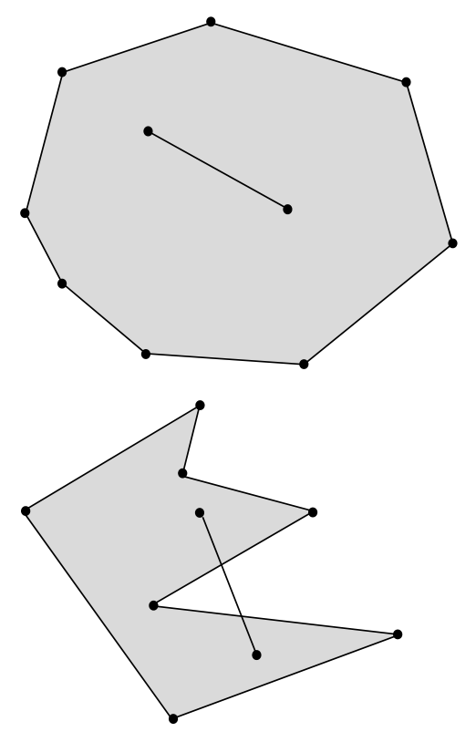

### Figure from slide p. 185
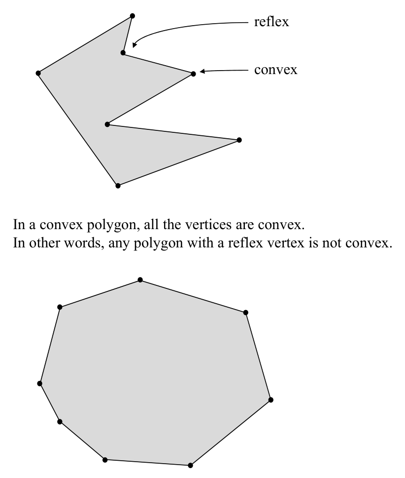

## Slide-by-slide digestion

### p. 183 - Preliminaries and definitions
- Intuitive definition
- Given a set S = {p1, p2, …, pN} of points in the plane,
- the convex hull H(S) is the smallest convex polygon in the plane
- that contains all of the points of S.
- Imagine nails pounded halfway into the plane at the points of S.
- The convex hull corresponds to a rubber band stretch around them.

p. 184 - Preliminaries and definitions
- Convex polygon
- A polygon is convex iff for any two points in the polygon
- (interior ∪boundary) the segment connecting the points is
- entirely within the polygon.
- convex
- not convex

p. 185 - Preliminaries and definitions
- Vertices
- A polygon vertex is convex if its interior angle ≤ π (180°).
- It is reflex if its interior angle > π (180°).
- convex
- In a convex polygon, all the vertices are convex.
- In other words, any polygon with a reflex vertex is not convex.

What you must be able to say or do in an exam
- Give the precise definitions.
- Distinguish similar notions cleanly.
- Use the right primitive test or formula on a concrete example.

Complexity and performance facts
Definition stage.

## Common mistakes and danger points
- Do not confuse the hull of the input point set with a polygon formed by connecting points in arbitrary order.

Exam-style drills and answer skeletons
### HW2-Q5 adapted
**Question.** Given the vertices of a non-convex simple polygon in clockwise order, explain how to obtain its convex hull in linear time.

**How to answer.** Use the boundary order to avoid a global sort. The answer should maintain a hull-like stack while scanning the polygonal chain.

### Definition drill
**Question.** Give the precise definitions and the most important consequences from convex hull intuition and preliminaries.

**How to answer.** A strong answer distinguishes similar objects and uses the course terminology exactly.

## Recap
### What you must know cold
- Rubber-band intuition.
- Convex vs reflex vertices.
- The hull as the smallest convex polygon containing the set.
Core test / key idea
- Interior points do not appear as hull vertices.
- Reflex behavior belongs to non-convex polygons; the hull itself is convex.
Complexity
- Definition stage.
Common mistakes / danger points
- Do not confuse the hull of the input point set with a polygon formed by connecting points in arbitrary order.
End-of-file summary
- Rubber-band intuition.
- Convex vs reflex vertices.
- The hull as the smallest convex polygon containing the set.
- Definition stage.
- Do not confuse the hull of the input point set with a polygon formed by connecting points in arbitrary order.

Everything related to this topic
- **Previous file in reading order:** [Convex hull motivation and why the topic matters](03_Convex_Hulls/30_convex-hull-motivation.md)
- **Next file in reading order:** [Convex combinations and dimension-sensitive definitions](03_Convex_Hulls/32_convex-combinations-and-dimension.md)
- **Source slide range:** pp. 183-185 of `comp_geometry_slides_new.pdf`
- **Related recordings:** CS 564 - 02.20 9.1.txt
- **Related homework-derived exam prompts included here:** HW2-Q5 adapted


---

# Convex combinations and dimension-sensitive definitions

## Scope
- **Slides:** pp. 186-189
- **Major topic folder:** convex-hulls
- **Recording files touching this material:** CS 564 - 02.20 9.1.txt
- **Goal of this file:** You should be able to study this topic without reopening the slide deck.

Big picture
This is the algebraic definition of convex hull, and it is one of the cleanest pieces of theory in the block.

## What you must know cold
- Convex combination: coefficients are nonnegative and sum to 1.
- Hull as the set of all convex combinations of input points.
- Dimension-sensitive idea that only up to d+1 points are needed in d-space.

Core ideas and reasoning
- Affine combinations give the full affine span; convex combinations restrict you to the convex region.
- In the plane, every hull point can be represented using at most 3 input points.

Figures to actually look at
These are cropped from the main slide PDF. Do not skip them.

### Figure from slide p. 188
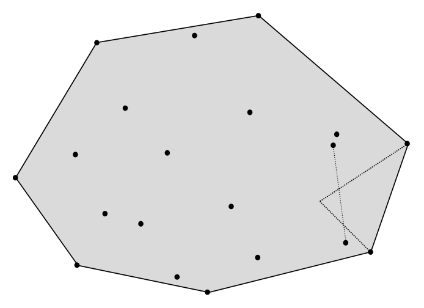

### Figure from slide p. 189
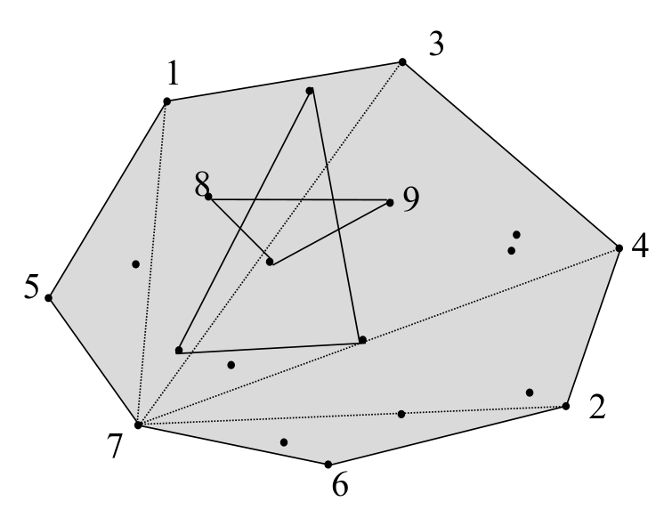

## Slide-by-slide digestion

### p. 186 - Preliminaries and definitions
- Parametric equation of a line
- Recall the following equation of a line:
- {α(p0) + (1 - α)(p1) }, where α ∈ ℜ(real numbers)
- where p0 and p1 are the points determining the line.
- p0 = (x0, y0)
- p1 = (x1, y1)
- Substituting gives
- {α(x0, y0) + (1 - α)(x1, y1) }
- Multiplying through gives the coordinates of points
- {αx0 + (1 - α)x1, αy0 + (1 - α)y1 }

p. 187 - Preliminaries and definitions
- Convex combination
- We generalize from the parametric equation of a line,
- which suggests the idea of a convex combination.
- A convex combination of points p1, p2, …, pk
- is a sum of the form α1p1 + α2p2 + … + αkpk
- where αi ≥0 for 1 ≤i ≤k and α1 + α2 + … + αk = 1.
- Such a convex combination is a point.
- As we saw, a line segment consists of all convex combinations
- of its endpoints(k=2). (The same is not true of a line, why not?)
- A triangle consists of convex combinations of its three corners (k=3).

p. 188 - Preliminaries and definitions
- Convex hull, definition 4
- The convex hull H(S) of a set of points S
- is the set of all convex combinations of the points of S.
- It should be intuitively clear that a hull defined in this way
- can not have a “dent” (reflex vertex).

p. 189 - Preliminaries and definitions
- Convex hull, definition 5
- The convex hull H(S) of a set of points S in d dimensions
- is the set of all convex combinations of d + 1 or fewer points of S.
- This is different from definition 4 in that only d + 1 or fewer
- points are needed to get any point of H(S).
- For example, in the plane d = 2,
- convex polygons can be composed as the union of all points
- contained by the triangles of the given points,
- which are the convex combination of all d + 1 = 3 points.

What you must be able to say or do in an exam
- Give the precise definitions.
- Distinguish similar notions cleanly.
- Use the right primitive test or formula on a concrete example.

Complexity and performance facts
No algorithm yet; this is representational theory used in later equivalence proofs.

## Common mistakes and danger points
- Nonnegative coefficients and sum-to-1 are both required. Drop either condition and you leave the convex hull.

Exam-style drills and answer skeletons
### Definition drill
**Question.** Give the precise definitions and the most important consequences from convex combinations and dimension-sensitive definitions.

**How to answer.** A strong answer distinguishes similar objects and uses the course terminology exactly.

## Recap
### What you must know cold
- Convex combination: coefficients are nonnegative and sum to 1.
- Hull as the set of all convex combinations of input points.
- Dimension-sensitive idea that only up to d+1 points are needed in d-space.
Core test / key idea
- Affine combinations give the full affine span; convex combinations restrict you to the convex region.
- In the plane, every hull point can be represented using at most 3 input points.
Complexity
- No algorithm yet; this is representational theory used in later equivalence proofs.
Common mistakes / danger points
- Nonnegative coefficients and sum-to-1 are both required. Drop either condition and you leave the convex hull.
End-of-file summary
- Convex combination: coefficients are nonnegative and sum to 1.
- Hull as the set of all convex combinations of input points.
- Dimension-sensitive idea that only up to d+1 points are needed in d-space.
- No algorithm yet; this is representational theory used in later equivalence proofs.
- Nonnegative coefficients and sum-to-1 are both required. Drop either condition and you leave the convex hull.

Everything related to this topic
- **Previous file in reading order:** [Convex hull intuition and preliminaries](03_Convex_Hulls/31_convex-hull-intuition.md)
- **Next file in reading order:** [Equivalent formulations and problem statement](03_Convex_Hulls/33_convex-hull-equivalent-formulations.md)
- **Source slide range:** pp. 186-189 of `comp_geometry_slides_new.pdf`
- **Related recordings:** CS 564 - 02.20 9.1.txt
- **Related homework-derived exam prompts included here:** none directly mapped; generic exam drills added instead


---

# Equivalent formulations and problem statement

## Scope
- **Slides:** pp. 190-195
- **Major topic folder:** convex-hulls
- **Recording files touching this material:** CS 564 - 02.20 9.1.txt
- **Goal of this file:** You should be able to study this topic without reopening the slide deck.

Big picture
The course gives several equivalent ways to think about the hull because different algorithms and proofs use different one-liners: smallest convex set, intersection of half-planes, union of triangles, and so on.

## What you must know cold
- Hull as the intersection of all convex sets containing S.
- Hull as the intersection of all containing half-planes / half-spaces.
- Hull as smallest enclosing convex polygon.
- Formal problem statement: given S, construct H(S).

Core ideas and reasoning
- These equivalences justify multiple algorithm paradigms: half-plane tests, supporting-line arguments, or combinatorial constructions.

Figures to actually look at
These are cropped from the main slide PDF. Do not skip them.

### Figure from slide p. 190
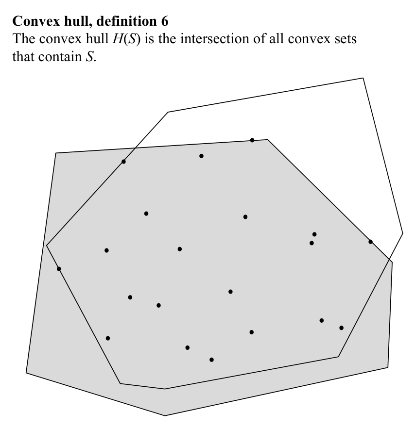

### Figure from slide p. 191
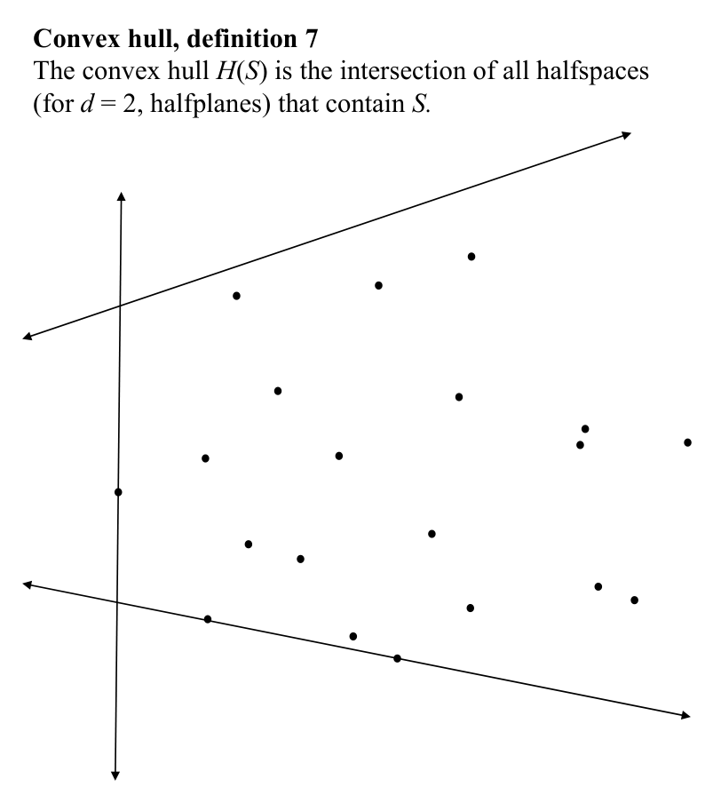

## Slide-by-slide digestion

### p. 190 - Preliminaries and definitions
- Convex hull, definition 6
- The convex hull H(S) is the intersection of all convex sets
- that contain S.

p. 191 - Preliminaries and definitions
- Convex hull, definition 7
- The convex hull H(S) is the intersection of all halfspaces
- (for d = 2, halfplanes) that contain S.

p. 192 - Preliminaries and definitions
- Convex hull, definition 8
- The convex hull H(S) of a set of points S in the plane
- is the smallest convex polygon P that encloses S,
- smallest in the sense that there is no other polygon P′
- such that P ⊃P′ ⊇S.
- P′

p. 193 - Preliminaries and definitions
- Convex hull, definition 9
- The convex hull H(S) of a set of points S in the plane
- is the enclosing convex polygon P with the smallest area.
- Convex hull, definition 10
- is the enclosing convex polygon P with the smallest perimeter.
- Extreme Points E
- A point p of a convex set is an extreme point if no two points
- a,b∈
- S exist such that p is between the line segment ab.
- Thus, in Definition 5 example, the points (1, 2, 3, 4, 5, 6, 7) are

p. 194 - Preliminaries and definitions
- Convex hull, definition 11
- The convex hull H(S) of a set of points S in the plane
- is the union of all the triangles defined by points in S.
- This is a restatement of definition 5.
- Many triangles are not shown in the figure.

p. 195 - Preliminaries and definitions
- Problem definitions
- CONVEX HULL
- INSTANCE. A set S = {p1, p2, …, pN} of d-dimensional points.
- QUESTION. Construct the convex hull H(S) for S.
- (The construction must give the vertices and their sequence,
- that is, obtain a description of the boundary which is a convex
- polygon.)
- EXTREME POINTS
- QUESTION. Identify the points of S that are vertices of
- the convex hull H(S). (Here, the ordering is not required.)

What you must be able to say or do in an exam
- Give the precise definitions.
- Distinguish similar notions cleanly.
- Use the right primitive test or formula on a concrete example.

Complexity and performance facts
Pre-algorithm theory.

## Common mistakes and danger points
- Equivalent formulations are not separate definitions of different objects; they describe the same hull.

Exam-style drills and answer skeletons
### Definition drill
**Question.** Give the precise definitions and the most important consequences from equivalent formulations and problem statement.

**How to answer.** A strong answer distinguishes similar objects and uses the course terminology exactly.

## Recap
### What you must know cold
- Hull as the intersection of all convex sets containing S.
- Hull as the intersection of all containing half-planes / half-spaces.
- Hull as smallest enclosing convex polygon.
- Formal problem statement: given S, construct H(S).
Core test / key idea
- These equivalences justify multiple algorithm paradigms: half-plane tests, supporting-line arguments, or combinatorial constructions.
Complexity
- Pre-algorithm theory.
Common mistakes / danger points
- Equivalent formulations are not separate definitions of different objects; they describe the same hull.
End-of-file summary
- Hull as the intersection of all convex sets containing S.
- Hull as the intersection of all containing half-planes / half-spaces.
- Hull as smallest enclosing convex polygon.
- Pre-algorithm theory.
- Equivalent formulations are not separate definitions of different objects; they describe the same hull.

Everything related to this topic
- **Previous file in reading order:** [Convex combinations and dimension-sensitive definitions](03_Convex_Hulls/32_convex-combinations-and-dimension.md)
- **Next file in reading order:** [Lower bound for convex hull via reduction from sorting](03_Convex_Hulls/34_convex-hull-lower-bound.md)
- **Source slide range:** pp. 190-195 of `comp_geometry_slides_new.pdf`
- **Related recordings:** CS 564 - 02.20 9.1.txt
- **Related homework-derived exam prompts included here:** none directly mapped; generic exam drills added instead


---

# Lower bound for convex hull via reduction from sorting

## Scope
- **Slides:** pp. 196-201
- **Major topic folder:** convex-hulls
- **Recording files touching this material:** CS 564 - 02.20 9.1.txt, CS 564 - 02.20 9.2.txt
- **Goal of this file:** You should be able to study this topic without reopening the slide deck.

Big picture
This is a favorite exam idea because it tests actual reduction logic rather than memory. The punchline is that convex hull construction cannot beat Ω(N log N) in the comparison model because sorting reduces to it.

## What you must know cold
- What a problem transformation/reduction is.
- How to map numbers x_i to points on a parabola so sorted order can be read from the hull.
- Why O(N) transformation cost plus a hypothetical faster hull algorithm would imply a faster sorting algorithm.

Core ideas and reasoning
- Transform the sorting instance x_1, ..., x_N into points (x_i, x_i^2).
- All points lie on a convex parabola, so their hull order reveals the sorted order by x.
- Therefore sorting reduces to convex hull, and convex hull has Ω(N log N) lower bound.

Figures to actually look at
These are cropped from the main slide PDF. Do not skip them.

### Figure from slide p. 199
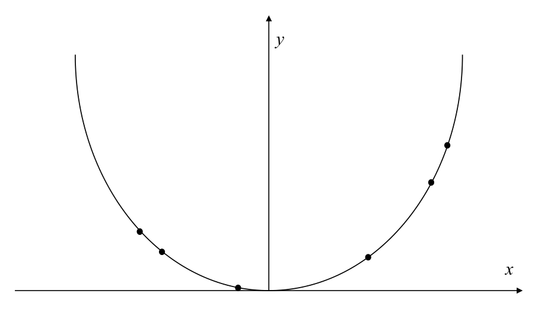

### Figure from slide p. 200
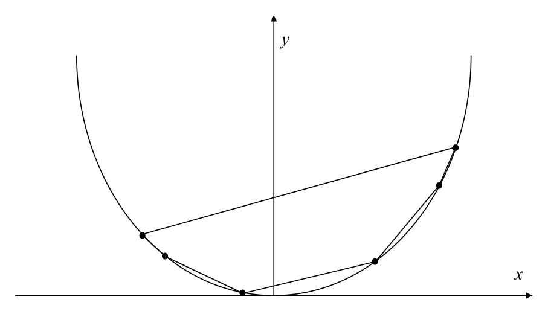

## Slide-by-slide digestion

### p. 196 - Preliminaries and definitions
- Transformation of problems
- We would like to establish lower bounds for performance
- measures (time and space) for problems (not algorithms!).
- One reason: to avoid a futile search for an algorithm faster than
- the theoretical lower bound for the problem.
- Generally, proving a lower (or upper) is difficult,
- because it is a proof about all algorithms to solve the problem.
- There is a technique to do so, useful in some cases:
- transformation of problems.
- Suppose there are two problems A and B, which are related

p. 197 - Preliminaries and definitions
- Lower and upper bounds via transformation
- Under the assumption that the transformation preserves the
- order of the instance size, the transformation has two properties:
- Property 1 (Lower bound via transformation). If problem A is
- known to require at least T(N) time and A is τ(N)-transformable to B,
- then B requires at least T(N) - O(τ(N)) time.
- Otherwise, you could use the transformation to solve A too fast.
- Property 2 (Upper bound via transformation). If problem B can be
- solved in T(N) time and A is τ(N)-transformable to B,
- then A requires at most T(N) + O(τ(N)) time.

p. 198 - Preliminaries and definitions
- A known problem
- Note that the technique assumes that there is a problem with a
- known lower bound (to use property 1).
- We have such a problem: SORTING requires Ω(N log N).
- Problem A
- Problem B
- τ(N)-transformable
- Upper bound O(f(N))
- Lower bound Ω(f(N))

p. 199 - Preliminaries and definitions
- Lower bound for CONVEX HULL
- Can we get a lower bound for time for CONVEX HULL?
- Recall that that the constructed hull H(S) must be given in order.
- This suggest a connection to SORTING.
- Theorem. SORTING is linear-time transformable to CONVEX
- HULL; SORTING αO(N) CONVEX HULL.
- Therefore, CONVEX HULL requires at least Ω(N log N) time.
- Proof. We show the transformation. Suppose the instance of
- SORTING is the set of N real numbers {x1, x2, …, xN}.
- Transform that set to an instance of CONVEX HULL

p. 200 - Preliminaries and definitions
- Lower bound for CONVEX HULL
- The convex hull of the converted instance will consist of a
- list of points, sorted by abscissa. At most one pass through the list
- will find the smallest and the answer to SORTING can be
- read off from there in one pass. O(N)

p. 201 - Preliminaries and definitions
- Lower bound for CONVEX HULL
- Note that the O(N) transformation is dominated by the O(N log N)
- complexity of the problem.
- As a consequence of this transformation,
- we know that CONVEX HULL requires at least Ω(N log N) time.
- SORTING
- CONVEX HULL
- O(N)-transformable
- Upper bound O(N log N)
- Lower bound Ω(N log N)

What you must be able to say or do in an exam
- State the claim precisely before giving the argument.
- Identify the known lower bound / recurrence / invariant you are using.
- Keep the direction of the argument correct.
- End with the exact asymptotic conclusion.

Complexity and performance facts
Lower bound Ω(N log N) for planar convex hull in the standard model.

## Common mistakes and danger points
- Direction matters: reduce from a problem with known lower bound to the problem whose lower bound you want.
- Do not propose an algorithm for sorting and call that a lower-bound proof. Professors develop headaches from this.

Professor emphasis from recordings
These points are distilled from the related recordings and focus on what the professor slowed down for, warned about, or connected to homework/exam reasoning.

- The professor emphasizes that lower bounds are proved by transforming a problem with a known lower bound into the target problem, not the other way around.
- The most common mistake here is reversing the roles of the source and target problems and accidentally 'proving' nonsense.
- He presents this reduction as a template you are supposed to reuse later, not as a one-off trick for convex hull only.

Exam-style drills and answer skeletons
Existing drill reminders from the earlier pack:
- Write the full input transformation, output extraction, and complexity argument for sorting ≤ convex hull.
- Explain why a reduction must not cost more than the lower bound you are trying to transfer.

Proof drill
**Question.** Explain the main argument in lower bound for convex hull via reduction from sorting in a logically correct order.

**How to answer.** Do not jump from intuition to conclusion. State the reduction/invariant/recurrence first, then derive the claimed bound.

## Recap
### What you must know cold
- What a problem transformation/reduction is.
- How to map numbers x_i to points on a parabola so sorted order can be read from the hull.
- Why O(N) transformation cost plus a hypothetical faster hull algorithm would imply a faster sorting algorithm.
Core test / key idea
- Transform the sorting instance x_1, ..., x_N into points (x_i, x_i^2).
- All points lie on a convex parabola, so their hull order reveals the sorted order by x.
- Therefore sorting reduces to convex hull, and convex hull has Ω(N log N) lower bound.
Complexity
- Lower bound Ω(N log N) for planar convex hull in the standard model.
Common mistakes / danger points
- Direction matters: reduce from a problem with known lower bound to the problem whose lower bound you want.
- Do not propose an algorithm for sorting and call that a lower-bound proof. Professors develop headaches from this.
Professor emphasis (from recordings)
- The professor emphasizes that lower bounds are proved by transforming a problem with a known lower bound into the target problem, not the other way around.
- The most common mistake here is reversing the roles of the source and target problems and accidentally 'proving' nonsense.
- He presents this reduction as a template you are supposed to reuse later, not as a one-off trick for convex hull only.
End-of-file summary
- What a problem transformation/reduction is.
- How to map numbers x_i to points on a parabola so sorted order can be read from the hull.
- Why O(N) transformation cost plus a hypothetical faster hull algorithm would imply a faster sorting algorithm.
- Lower bound Ω(N log N) for planar convex hull in the standard model.
- Direction matters: reduce from a problem with known lower bound to the problem whose lower bound you want.
- Do not propose an algorithm for sorting and call that a lower-bound proof. Professors develop headaches from this.

Everything related to this topic
- **Previous file in reading order:** [Equivalent formulations and problem statement](03_Convex_Hulls/33_convex-hull-equivalent-formulations.md)
- **Next file in reading order:** [Extreme points algorithm](03_Convex_Hulls/35_extreme-points-algorithm.md)
- **Source slide range:** pp. 196-201 of `comp_geometry_slides_new.pdf`
- **Related recordings:** CS 564 - 02.20 9.1.txt, CS 564 - 02.20 9.2.txt
- **Related homework-derived exam prompts included here:** none directly mapped; generic exam drills added instead


---

# Extreme points algorithm

## Scope
- **Slides:** pp. 202-205
- **Major topic folder:** convex-hulls
- **Recording files touching this material:** CS 564 - 02.20 9.2.txt, CS 564 - 02.25 10.1.txt
- **Goal of this file:** You should be able to study this topic without reopening the slide deck.

Big picture
This is the brute-force hull algorithm you study mostly to understand what efficient algorithms are trying to avoid.

## What you must know cold
- Extreme points are the minimal subset whose hull is the full hull.
- A point is non-extreme if it lies inside some triangle formed by other input points.
- Brute-force test by checking many triangles.

Core ideas and reasoning
- For each point p, ask whether p lies inside any triangle determined by other points.
- If yes, p cannot be a hull vertex.
- Collect all extreme points, then order them angularly to obtain the hull.

Figures to actually look at
These are cropped from the main slide PDF. Do not skip them.

### Figure from slide p. 202


### Figure from slide p. 205


## Slide-by-slide digestion

### p. 202 - Extreme points algorithm
- Extreme points
- A point p of a convex set S is an extreme point if no two points
- a, b ∈S exist such that p lies on the open segment ab.
- Extreme points and the convex hull
- The set E of extreme points of S (E ⊆S) is the smallest subset of S
- such that H(E) = H(S).
- E is the set of vertices of H(S).
- This suggests an algorithm for CONVEX HULL:
- 1. Find the extreme points E of S.
- 2. Order the points E so that they form a convex polygon.

p. 203 - Extreme points algorithm
- Determining if a point is an extreme point
- If we could determine whether a given point p ∈S was an
- extreme point in S, then we could find E by testing each point in S.
- Theorem. A point p fails to be an extreme point of a plane convex
- set S iff it lies in some triangle whose vertices are in S
- but is not itself one of the vertices of the triangle.
- p ∈E
- p ∉E

p. 204 - Extreme points algorithm
- Determining if a point is an extreme point
- There are O(N3) triangles determined by the N points of S.
- Point enclosure in a triangle can be performed in O(1) time.
- To determine if p is an extreme point,
- test it for inclusion in each of the O(N3) triangles.
- If all fail, p ∈E.
- Doing so for each point p ∈S requires O(N4) time.
- (Determining extreme edges has O(N3 ) algorithm…see
- O’Rourke p.67)
- p ∈E

p. 205 - Extreme points algorithm
- Ordering the vertices of the hull
- E has been found (in O(N4)) time.
- We already know that the vertices of a convex polygon
- occur in sorted order around any interior point.
- Find a point c interior to H(S) by computing the centroid of S. O(N)
- For each point p ∈E, compute the polar angle from c to p. O(N)
- Sort the points of E on polar angle. O(N log N)
- Overall time complexity for this algorithm: O(N4).

What you must be able to say or do in an exam
- State the input, output, preprocessing, and query/update model precisely.
- Explain the invariant or ordering that makes the method work.
- Trace the method by hand on a small example.
- Give the exact time and space bounds.
- Mention one edge case, degeneracy, or limitation.

Complexity and performance facts
Naive version is O(N^4) or similar brute-force order depending on the exact implementation and ordering step.

## Common mistakes and danger points
- Finding extreme points is not enough; you still need them in boundary order to output the hull.

Exam-style drills and answer skeletons
Existing drill reminders from the earlier pack:
- Given a simple polygon in boundary order, explain why a general point-set hull algorithm is wasteful and why a linear-time polygon-specific method can do better.
- Adapted from HW2-Q5: Given vertices of a non-convex simple polygon in clockwise order, find its convex hull in O(N).

Core exam drill
**Question.** State the problem solved by extreme points algorithm, describe preprocessing/query/update steps if any, and give the time and space bounds.

**How to answer.** An excellent answer names the input, the output, the invariant or ordering exploited by the method, and the exact asymptotic costs.

### Hand-trace drill
**Question.** Trace extreme points algorithm on a small example by hand and explain each comparison or structural change.

**How to answer.** On this course, being able to run the method on a picture matters more than writing vague slogans.

## Recap
### What you must know cold
- Extreme points are the minimal subset whose hull is the full hull.
- A point is non-extreme if it lies inside some triangle formed by other input points.
- Brute-force test by checking many triangles.
Core test / key idea
- For each point p, ask whether p lies inside any triangle determined by other points.
- If yes, p cannot be a hull vertex.
- Collect all extreme points, then order them angularly to obtain the hull.
Complexity
- Naive version is O(N^4) or similar brute-force order depending on the exact implementation and ordering step.
Common mistakes / danger points
- Finding extreme points is not enough; you still need them in boundary order to output the hull.
End-of-file summary
- Extreme points are the minimal subset whose hull is the full hull.
- A point is non-extreme if it lies inside some triangle formed by other input points.
- Brute-force test by checking many triangles.
- Naive version is O(N^4) or similar brute-force order depending on the exact implementation and ordering step.
- Finding extreme points is not enough; you still need them in boundary order to output the hull.

Everything related to this topic
- **Previous file in reading order:** [Lower bound for convex hull via reduction from sorting](03_Convex_Hulls/34_convex-hull-lower-bound.md)
- **Next file in reading order:** [Graham’s scan: concept and preparation](03_Convex_Hulls/36_graham-scan-algorithm.md)
- **Source slide range:** pp. 202-205 of `comp_geometry_slides_new.pdf`
- **Related recordings:** CS 564 - 02.20 9.2.txt, CS 564 - 02.25 10.1.txt
- **Related homework-derived exam prompts included here:** none directly mapped; generic exam drills added instead


---

# Graham’s scan: concept and preparation

## Scope
- **Slides:** pp. 206-214
- **Major topic folder:** convex-hulls
- **Recording files touching this material:** CS 564 - 02.25 10.1.txt
- **Goal of this file:** You should be able to study this topic without reopening the slide deck.

Big picture
This is the central convex-hull algorithm for the midterm. Learn the invariant, not just the pseudo-code. The invariant is what saves you when the exam wording mutates slightly, as it always does out of spite.

## What you must know cold
- Choose an anchor/internal point or sort points by polar angle around an anchor, depending on the slide variant.
- Process points in order while maintaining a stack/deque of candidate hull vertices.
- Whenever the last turn is not a left turn, pop until convexity is restored.

Core ideas and reasoning
- After angular sorting, the scan walks boundary candidates in order.
- The stack invariant is that the current stack is always the convex hull of the processed prefix.
- A right turn or collinear bad case means the middle point cannot remain a hull vertex, so it is removed.

Figures to actually look at
These are cropped from the main slide PDF. Do not skip them.

### Figure from slide p. 208


### Figure from slide p. 212


## Slide-by-slide digestion

### p. 206 - Graham’s scan
- Concept
- A point within a triangle of S cannot be a vertex of the convex hull.
- Previous algorithm determined if a point p was within a triangle of S
- by trying (as many as) all of the triangles for each point p.
- Can we find out if p is within a triangle of S more efficiently?
- Graham’s scan does so. This algorithm is from one of the first
- papers specifically concerned with finding an efficient geometric
- algorithm (1972).
- The essential idea: if a point p is not a vertex of the convex hull,
- then it is internal to some triangle Op1p2,

p. 207 - Graham’s scan
- Centroid
- The centroid of a finite set of points p1, p2, …, pN is their
- arithmetic mean (p1 + p2 + … + pN) / N.
- (Computed for each coordinate separately.)
- Lexicographic sort
- Sorting on multiple keys associated with objects to be sorted.
- Compare objects to be sorted on first key; and sort accordingly.
- If first keys are equal, sort on second key.
- If second keys are equal, …
- farther

p. 208 - Polar angles
- This slide is mainly visual: it fixes the meaning of polar angle as the counterclockwise angle from the x-axis.
- You must understand the ordering picture because the next slides show how to compare these angles without calling trigonometric functions.

p. 209 - Graham’s scan
- θ1
- θ2
- Comparing polar angles
- Given two points p1 and p2 in the plane, which has the greater
- polar angle? p2 forms a strictly small polar angle with the x axis
- than p1 iff triangle 0p2p1 has a positive signed area.
- Area(triangle 0p2p1) = (x0 y1 + x2 y0 + x1 y2 - x2 y1 - x0 y2 - x1 y0) / 2
- (See earlier slides on left-turn/right turn classification.)
- Equivalently, ... iff 0p2p1 is a left turn.
- Note that this means polar angles can be compared without

p. 210 - Graham’s scan
- Preparation
- The preparation for Graham’s scan is as follows:
- 1. Find a point O internal to H(S) (the centroid of S). O(N)
- 2. Transform the coordinates of the points in S so that
- O is the origin. O(N)
- 2. Sort the N points of S lexicographically on
- (1) polar angle and (2) distance from O. O(N log N)
- 3. Arrange the sorted points in a doubly-linked circular list. O(N)

p. 211 - Graham’s scan
- Basic idea of the scan
- Recall that if a point p is not a vertex of the convex hull,
- then it is internal to some triangle Op1p2.
- The scan examines the points in sorted order (polar angle,
- distance from O), eliminating those not in the convex hull.
- Point p2 ∉H(S) and is eliminated
- when angle p1p2p3 is found to be reflex.
- Equivalently, eliminate p2 from H(S) iff p1p2p3 is not a left turn.
- Point p2 is within triangle Op1p3 and is eliminated.

p. 212 - Graham’s scan
- Scan algorithm (informal)
- The scan begins at the rightmost smallest ordinate
- (minimum y coordinate) point; call it START.
- START is certainly a hull vertex (minimum y coordinate).
- Repeatedly examine consecutive triples of points p1p2p3.
- If p1p2p3 is a right turn, eliminate p2 from H(S) and
- backtrack to p0p1p3.
- If p1p2p3 is a left turn, advance to p2p3p4.
- What about p1p2p3 collinear? Eliminate, p2 ∉H(S).
- Scan ends when it advances to start (i.e., p4 = START).

p. 213 - Graham’s scan
- Advancing and backtracking
- Backtracking may occur more than once in succession,
- eliminating a sequence of points.
- Backtracking sure to stop at START.
- No point can be eliminated more than once.

p. 214 - Graham’s scan
- Algorithm
- (See Preparata, p. 108.)
- 1. Find an internal point O.
- 2. Using O as the coordinate origin, sort the N points of S
- lexicographically by polar angle and distance from O.
- Arrange the points into a doubly-linked circular list,
- with pointers NEXT and PRED for each entry,
- and with pointer START pointing to the starting point.
- 3. Scan:

```text
begin
```

## What you must be able to say or do in an exam
- State the input, output, preprocessing, and query/update model precisely.
- Explain the invariant or ordering that makes the method work.
- Trace the method by hand on a small example.
- Give the exact time and space bounds.
- Mention one edge case, degeneracy, or limitation.

Complexity and performance facts
Sorting O(N log N) dominates; the scan itself is linear because each point is pushed once and popped at most once.

## Common mistakes and danger points
- Be clear about what you do with collinear points. Different tie rules give different boundary outputs.
- The orientation test must use the points in the correct order.

Professor emphasis from recordings
These points are distilled from the related recordings and focus on what the professor slowed down for, warned about, or connected to homework/exam reasoning.

- The lecture motivation is that the old extreme-point thinking is too expensive, so Graham's scan exists to preserve the Ω(N log N) lower-bound target instead of wasting O(N^4) work.
- The elimination rule is the heart of the method: once the last triple is not a left turn, the middle point cannot stay on the hull.
- Collinear handling is not cosmetic. The tie-breaking rule changes which boundary points survive, so you must state the policy clearly.

Exam-style drills and answer skeletons
Existing drill reminders from the earlier pack:
- Trace Graham scan on a concrete point set and show each push/pop with the orientation values.
- State and prove the stack invariant used by Graham scan.
- Adapted from HW2-Q5: Given vertices of a non-convex simple polygon in clockwise order, find its convex hull in O(N).

HW2-Q5 drill
**Question.** Explain why Graham's scan normally needs sorting, and why a simple polygon given in boundary order is a special case that can be solved faster.

**How to answer.** Sorting is needed to order points radially, but an already-ordered boundary gives structure that can replace the sort.

### Core exam drill
**Question.** State the problem solved by graham’s scan: concept and preparation, describe preprocessing/query/update steps if any, and give the time and space bounds.

**How to answer.** An excellent answer names the input, the output, the invariant or ordering exploited by the method, and the exact asymptotic costs.

### Hand-trace drill
**Question.** Trace graham’s scan: concept and preparation on a small example by hand and explain each comparison or structural change.

**How to answer.** On this course, being able to run the method on a picture matters more than writing vague slogans.

## Recap
### What you must know cold
- Choose an anchor/internal point or sort points by polar angle around an anchor, depending on the slide variant.
- Process points in order while maintaining a stack/deque of candidate hull vertices.
- Whenever the last turn is not a left turn, pop until convexity is restored.
Core test / key idea
- After angular sorting, the scan walks boundary candidates in order.
- The stack invariant is that the current stack is always the convex hull of the processed prefix.
- A right turn or collinear bad case means the middle point cannot remain a hull vertex, so it is removed.
Complexity
- Sorting O(N log N) dominates; the scan itself is linear because each point is pushed once and popped at most once.
Common mistakes / danger points
- Be clear about what you do with collinear points. Different tie rules give different boundary outputs.
- The orientation test must use the points in the correct order.
Professor emphasis (from recordings)
- The lecture motivation is that the old extreme-point thinking is too expensive, so Graham's scan exists to preserve the Ω(N log N) lower-bound target instead of wasting O(N^4) work.
- The elimination rule is the heart of the method: once the last triple is not a left turn, the middle point cannot stay on the hull.
- Collinear handling is not cosmetic. The tie-breaking rule changes which boundary points survive, so you must state the policy clearly.
End-of-file summary
- Choose an anchor/internal point or sort points by polar angle around an anchor, depending on the slide variant.
- Process points in order while maintaining a stack/deque of candidate hull vertices.
- Whenever the last turn is not a left turn, pop until convexity is restored.
- Sorting O(N log N) dominates; the scan itself is linear because each point is pushed once and popped at most once.
- Be clear about what you do with collinear points. Different tie rules give different boundary outputs.
- The orientation test must use the points in the correct order.

Everything related to this topic
- **Previous file in reading order:** [Extreme points algorithm](03_Convex_Hulls/35_extreme-points-algorithm.md)
- **Next file in reading order:** [Graham’s scan: analysis, upper-lower hull view, and summary](03_Convex_Hulls/37_graham-scan-analysis.md)
- **Source slide range:** pp. 206-214 of `comp_geometry_slides_new.pdf`
- **Related recordings:** CS 564 - 02.25 10.1.txt
- **Related homework-derived exam prompts included here:** HW2-Q5 drill


---

# Graham’s scan: analysis, upper-lower hull view, and summary

## Scope
- **Slides:** pp. 215-219
- **Major topic folder:** convex-hulls
- **Recording files touching this material:** CS 564 - 02.25 10.1.txt
- **Goal of this file:** You should be able to study this topic without reopening the slide deck.

Big picture
This follow-up page is where you turn the stack behavior into a proof and connect Graham scan to upper/lower hull thinking.

## What you must know cold
- Why the scan phase is O(N) after sorting.
- Upper hull / lower hull decomposition viewpoint.
- Why the overall algorithm is optimal in 2D.

Core ideas and reasoning
- Every point enters the stack once and leaves at most once, so the scan is linear.
- Another view is to construct upper and lower hulls separately in x-order; this foreshadows monotone-chain variants.

Figures to actually look at
These are cropped from the main slide PDF. Do not skip them.

### Figure from slide p. 217


### Figure from slide p. 218


## Slide-by-slide digestion

### p. 215 - Graham’s scan
- Analysis
- Time: O(N log N); see comments.
- Storage: O(N) for circular linked list of points.
- Comments
- Preparation:
- Dominated by O(N log N) time required for sort.
- Scan:
- Left test requires O(1) time.
- After each test, either advance or backtrack.
- The scan will advance at most O(N) times,

p. 216 - Graham’s scan
- Lower and upper hulls
- We introduce the notions of upper and lower hulls,
- which will be useful later, here in the context of Graham’s scan.
- Rather than comparing polar angles, x-coordinate values will be
- compared.
- Given set S of N points in the plane, find the points with minimum
- and maximum x coordinates (abscissa).
- Call those points l and r, and construct the line L through l and r.
- L partitions the remaining points S into two subsets, upper and lower,
- each of which include l and r.

p. 217 - Graham’s scan
- Constructing the upper hull
- Sort the points of the upper subset of S on decreasing x coordinate.
- (Note error, text p. 109 says “increasing”.)
- Apply Graham’s scan from r to l.
- Specialization of the original method, where the reference point
- (called by O and q in the text) is at (0, -∞),
- so decreasing x coordinate is same as increasing polar angle.
- Upper subset

p. 218 - Graham’s scan
- Constructing the lower hull
- Sort the points of the lower subset of S on increasing x coordinate.
- Apply Graham’s scan from l to r.
- Lower subset

p. 219 - Graham’s scan
- Summary
- We have achieved best possible time for problem, O(N log N).
- But we will continue to examine additional algorithms. Why?
- 1. The algorithm is optimal in the worst case,
- but we have not analyzed its expected case performance.
- 2. It does not generalize to d > 2.
- (Note that our lower bound proof also only applies to d = 2.)
- 3. The algorithm is static, in that all points must be given
- before the hull is constructed.
- 4. For a parallel environment, a recursive algorithm

What you must be able to say or do in an exam
- State the claim precisely before giving the argument.
- Identify the known lower bound / recurrence / invariant you are using.
- Keep the direction of the argument correct.
- End with the exact asymptotic conclusion.

Complexity and performance facts
O(N log N) time, O(N) space; optimal because of the Ω(N log N) lower bound.

## Common mistakes and danger points
- Do not say “because there is a loop inside a loop it is quadratic.” The amortized push/pop argument is the proof.

Professor emphasis from recordings
These points are distilled from the related recordings and focus on what the professor slowed down for, warned about, or connected to homework/exam reasoning.

- He highlights the amortized logic behind the scan: backtracking can happen many times in a row, but each point is deleted at most once.
- That is the reason the scan phase stays linear after sorting.

Exam-style drills and answer skeletons
Existing drill reminders from the earlier pack:
- Adapted from HW2-Q5: Given vertices of a non-convex simple polygon in clockwise order, find its convex hull in O(N).

Proof drill
**Question.** Explain the main argument in graham’s scan: analysis, upper-lower hull view, and summary in a logically correct order.

**How to answer.** Do not jump from intuition to conclusion. State the reduction/invariant/recurrence first, then derive the claimed bound.

## Recap
### What you must know cold
- Why the scan phase is O(N) after sorting.
- Upper hull / lower hull decomposition viewpoint.
- Why the overall algorithm is optimal in 2D.
Core test / key idea
- Every point enters the stack once and leaves at most once, so the scan is linear.
- Another view is to construct upper and lower hulls separately in x-order; this foreshadows monotone-chain variants.
Complexity
- O(N log N) time, O(N) space; optimal because of the Ω(N log N) lower bound.
Common mistakes / danger points
- Do not say “because there is a loop inside a loop it is quadratic.” The amortized push/pop argument is the proof.
Professor emphasis (from recordings)
- He highlights the amortized logic behind the scan: backtracking can happen many times in a row, but each point is deleted at most once.
- That is the reason the scan phase stays linear after sorting.
End-of-file summary
- Why the scan phase is O(N) after sorting.
- Upper hull / lower hull decomposition viewpoint.
- Why the overall algorithm is optimal in 2D.
- O(N log N) time, O(N) space; optimal because of the Ω(N log N) lower bound.
- Do not say “because there is a loop inside a loop it is quadratic.” The amortized push/pop argument is the proof.
- He highlights the amortized logic behind the scan: backtracking can happen many times in a row, but each point is deleted at most once.

Everything related to this topic
- **Previous file in reading order:** [Graham’s scan: concept and preparation](03_Convex_Hulls/36_graham-scan-algorithm.md)
- **Next file in reading order:** [Jarvis march (gift wrapping) in 2D](03_Convex_Hulls/38_jarvis-march.md)
- **Source slide range:** pp. 215-219 of `comp_geometry_slides_new.pdf`
- **Related recordings:** CS 564 - 02.25 10.1.txt
- **Related homework-derived exam prompts included here:** none directly mapped; generic exam drills added instead


---

# Jarvis march (gift wrapping) in 2D

## Scope
- **Slides:** pp. 220-224
- **Major topic folder:** convex-hulls
- **Recording files touching this material:** CS 564 - 02.25 10.1.txt, CS 564 - 02.27 11.1.txt
- **Goal of this file:** You should be able to study this topic without reopening the slide deck.

Big picture
Jarvis march wraps the hull edge by edge instead of filtering vertices. It is conceptually simple and output-sensitive.

## What you must know cold
- Start from an extreme point.
- At each step, choose the point that makes all other points lie to one side of the candidate edge.
- Repeat until returning to the start.

Core ideas and reasoning
- Given current hull vertex p, search all points for the next point q such that every other point lies to the same side of pq.
- This is edge finding rather than vertex filtering.

Figures to actually look at
These are cropped from the main slide PDF. Do not skip them.

### Figure from slide p. 220


### Figure from slide p. 223


## Slide-by-slide digestion

### p. 220 - Jarvis’ march
- Concept
- Graham’s scan found the vertices of H(S).
- Given a point p ∈ S, the algorithm would determine
- whether p ∈ H(S), with some possible backtracking.
- Conceptually, Jarvis’ march instead finds the edges of H(S).
- Given two points p and q, it is possible to determine
- if segment pq is an edge of H(S).
- Theorem. The line segment l defined by two points is an edge
- of the convex hull iff all other points of the set lie on
- the line defined by l or to one side of it.

p. 221 - Jarvis’ march
- Naïve approach
- There are O(N2) lines determined by all pairs of points.
- For each of those lines, it is possible to test all the remaining
- N - 2 points (Point-line classification) and determine
- if the line meets the criteria of the theorem as an edge of H(S).
- This simple process requires O(N3) time to find the edges of H(S).
- The edges must then be arranged in order in O(N) time.
- Improving on the naïve approach
- To improve on this, observe that once it is established that
- some segment pq is a edge of H(S),

p. 222 - Jarvis’ march
- Marching (up)
- Assume that the rightmost smallest ordinate point p1 has been found.
- Point p1 is certainly ∈H(S).
- We wish to find the next vertex on H(S), call it p2.
- Point p2 is the point ∈S with the smallest polar angle ≤0 w.r.t. p1.
- Likewise, the next point p3 has the smallest polar angle ≤0 w.r.t. p2.
- Each successive vertex of H(S) can be found in linear time O(N)
- by checking each p ∈S to find the point with the least polar angle.
- In this manner, H(S) can be constructed from the lowest point
- to the highest point (p1 to p4 in the example).

p. 223 - Jarvis’ march
- Marching (down)
- When marching down, the least polar angle is found
- w.r.t. to the point as usual, but relative to the negative x axis,
- because relative to the x axis will give erroneous results.

p. 224 - Jarvis’ march
- Analysis
- Time: O(N2); O(N) points in hull, N comparisons at each
- to find least polar angle.
- Storage: O(N); for the points.
- However, only the vertices of the hull H(S) are actually processed
- (that is, if there are actually h points on the hull, hN left/right
- comparisons are necessary)
- to find the next vertex.
- Let h be |H(S)|; of course h ∈O(N), but often h << N.
- Expected time for Jarvis’ march algorithm is O(hN),

What you must be able to say or do in an exam
- State the input, output, preprocessing, and query/update model precisely.
- Explain the invariant or ordering that makes the method work.
- Trace the method by hand on a small example.
- Give the exact time and space bounds.
- Mention one edge case, degeneracy, or limitation.

Complexity and performance facts
O(Nh) where h is the number of hull vertices; good when h is small, worst case O(N^2).

## Common mistakes and danger points
- Do not accidentally test against the segment only; the one-side condition is relative to the full supporting line.

Exam-style drills and answer skeletons
Existing drill reminders from the earlier pack:
- Adapted from HW2-Q5: Given vertices of a non-convex simple polygon in clockwise order, find its convex hull in O(N).

Core exam drill
**Question.** State the problem solved by jarvis march (gift wrapping) in 2d, describe preprocessing/query/update steps if any, and give the time and space bounds.

**How to answer.** An excellent answer names the input, the output, the invariant or ordering exploited by the method, and the exact asymptotic costs.

### Hand-trace drill
**Question.** Trace jarvis march (gift wrapping) in 2d on a small example by hand and explain each comparison or structural change.

**How to answer.** On this course, being able to run the method on a picture matters more than writing vague slogans.

## Recap
### What you must know cold
- Start from an extreme point.
- At each step, choose the point that makes all other points lie to one side of the candidate edge.
- Repeat until returning to the start.
Core test / key idea
- Given current hull vertex p, search all points for the next point q such that every other point lies to the same side of pq.
- This is edge finding rather than vertex filtering.
Complexity
- O(Nh) where h is the number of hull vertices; good when h is small, worst case O(N^2).
Common mistakes / danger points
- Do not accidentally test against the segment only; the one-side condition is relative to the full supporting line.
End-of-file summary
- Start from an extreme point.
- At each step, choose the point that makes all other points lie to one side of the candidate edge.
- Repeat until returning to the start.
- O(Nh) where h is the number of hull vertices; good when h is small, worst case O(N^2).
- Do not accidentally test against the segment only; the one-side condition is relative to the full supporting line.

Everything related to this topic
- **Previous file in reading order:** [Graham’s scan: analysis, upper-lower hull view, and summary](03_Convex_Hulls/37_graham-scan-analysis.md)
- **Next file in reading order:** [Quickhull](03_Convex_Hulls/39_quickhull.md)
- **Source slide range:** pp. 220-224 of `comp_geometry_slides_new.pdf`
- **Related recordings:** CS 564 - 02.25 10.1.txt, CS 564 - 02.27 11.1.txt
- **Related homework-derived exam prompts included here:** none directly mapped; generic exam drills added instead


---

# Quickhull

## Scope
- **Slides:** pp. 225-234
- **Major topic folder:** convex-hulls
- **Recording files touching this material:** CS 564 - 02.25 10.1.txt, CS 564 - 02.27 11.1.txt
- **Goal of this file:** You should be able to study this topic without reopening the slide deck.

Big picture
Quickhull is the quicksort-flavored hull algorithm: choose extreme points, split the set by a line, recurse on the outside sets, and pray your partitions are kind. Mathematics remains unmoved by your optimism.

## What you must know cold
- Initial split using extreme x-points.
- Find the farthest point from a hull edge / supporting line.
- Partition remaining points into recursive subproblems.

Core ideas and reasoning
- The farthest point from segment ab becomes a hull vertex.
- Points inside the triangle formed by a, b, and the farthest point can be discarded from that recursive branch.
- Recurse on the two outer subsets.

Figures to actually look at
These are cropped from the main slide PDF. Do not skip them.

### Figure from slide p. 227
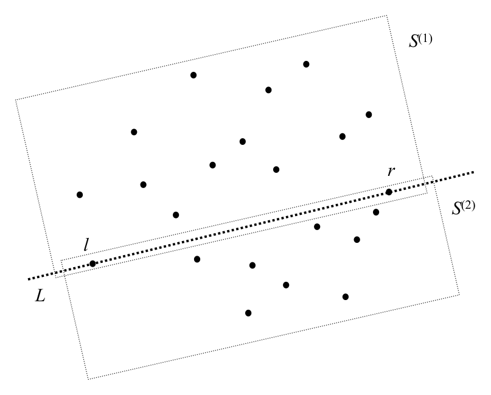

### Figure from slide p. 230


## Slide-by-slide digestion

### p. 225 - Quickhull
- Quicksort
- The Quickhull algorithm is based on the Quicksort algorithm.
- Recall how quicksort operates: at each level of recursion,
- an array of numbers to be sorted is partitioned into two subarrays,
- such that each term of the first (left) subarray is not larger
- than each term of the second (right) subarray.
- LEFT
- RIGHT
- Two pointers to the array cells (LEFT and RIGHT)
- initially point to the opposite extreme ends of the array. We

p. 226 - Quickhull
- Quickhull overview
- Quickhull operates in a similar manner.
- It recursively partitions the point set S,
- so as to find the convex hull for each subset.
- The hull at each level of the recursion is formed by
- concatenating the hulls found at the next level down.

p. 227 - Quickhull
- Initial partition
- The initial partition of S is determined by a line L
- through the points l, r ∈S with the smallest and largest abscissa.
- S(1) ⊆S is the subset of S on or above L.
- S(2) ⊆S is the subset of S on or below L.
- Note that {S(1), S(2)} is not a partition of S,
- as S(1) ∩S(2) ⊇{l,r}. This is not a difficulty.
- The idea now is to construct hulls H(S(1)) and H(S(2)),
- then concatenate them to get H(S).
- The process is the same for S(1) and S(2), we consider S(1).

p. 228 - Quickhull
- Finding the “apex”
- Find the point h ∈S(1) such that
- (1) triangle hlr has the maximum area of all triangles {plr : p ∈S(1)},
- and if there are > 1 triangles with maximum area,
- (2) the one where angle hlr is maximum.
- This condition ensures that h ∈H(S). Why?
- Construct a line parallel to line L through h, call it L′.
- There will be no points of S(1) (or S) above L′, by condition (1).
- There may be other points on L′, but h will be the leftmost,
- by condition (2),

p. 229 - Quickhull
- Partitioning the point set
- Construct two directed lines, L1 from l to h, and L2 from h to r.
- Each point of S(1) is classified relative to L1 and L2
- (e.g., point-line classification).
- No point can be to the left of both L1 and L2.
- Points to the right of both are not in H(S),
- as they are within triangle hlr,
- and are eliminated from further consideration.
- Points left of L1 are S(1,1).
- Points left of L2 are S(1,2).

p. 230 - Quickhull
- Recursion
- The process recurses on S(1,1) and are S(1,2).
- (set, left endpoint, right endpoint)
- (S(…),l,r)
- (S(…,1),l,h) (S(…,2),h,r)
- The recursion continues until S(…) has 0 points,
- i.e., all internal points have been eliminated,
- which implies that segment lr is an edge of H(S).
- S(1,2,2)

p. 231 - Quickhull
- Geometric primitives
- The geometric primitives used by this algorithm are:
- 1. Point-line classification
- 2. Area of a triangle
- Both of these require O(1) time.

p. 232 - Quickhull
- Initial partition, revisited
- The preceding explanation, while intuitive and thus useful,
- introduces an anomaly: l, r are in both S(1) and S(2).
- This is a problem because l, r will end up in both hulls.
- To the avoid this, base the initial partition on l0 = (x0, y0),
- the point of S with smallest abscissa,
- and r0 = (x0, y0 - ε), where ε is an arbitrarily small constant.

p. 233 - Quickhull
- General function
- S is assumed to have at least 2 elements
- (the recursion ends otherwise).
- FURTHEST(S, l, r) is a function, not given here,
- that finds the apex point h as previously defined.
- The operator || denotes list concatenation.
- Procedure QUICKHULL returns an ordered list of points.

```text
procedure QUICKHULL(S, l, r)
begin
S = {l, r} then
```

### p. 234 - Quickhull
- Analysis
- Worst case time: O(N2)
- Expected time: O(N log N)
- Storage: O(N2)
- At each level of the recursion, partitioning S into S(1) and S(2)
- requires O(N) time. If S(1) and S(2) were guaranteed to have
- a size equal to a fixed portion of S, and this held at each level,
- the worst case time would be O(N log N).
- However, those criteria do not apply;
- S(1) and S(2) may have size in O(N) (they are not balanced).

What you must be able to say or do in an exam
- State the input, output, preprocessing, and query/update model precisely.
- Explain the invariant or ordering that makes the method work.
- Trace the method by hand on a small example.
- Give the exact time and space bounds.
- Mention one edge case, degeneracy, or limitation.

Complexity and performance facts
Expected around O(N log N) with good splits; worst case O(N^2).

## Common mistakes and danger points
- Do not claim guaranteed balanced recursion. That is exactly the algorithm’s weakness.

Professor emphasis from recordings
These points are distilled from the related recordings and focus on what the professor slowed down for, warned about, or connected to homework/exam reasoning.

- Quickhull is repeatedly compared to Quicksort in the lecture, so the intended mental model is partition-recursion, not stack-based scanning.
- The exam risk here is forgetting that the appealing recursion picture does not automatically give the same worst-case guarantees as Graham's scan.

Exam-style drills and answer skeletons
Existing drill reminders from the earlier pack:
- Adapted from HW2-Q5: Given vertices of a non-convex simple polygon in clockwise order, find its convex hull in O(N).

Core exam drill
**Question.** State the problem solved by quickhull, describe preprocessing/query/update steps if any, and give the time and space bounds.

**How to answer.** An excellent answer names the input, the output, the invariant or ordering exploited by the method, and the exact asymptotic costs.

### Hand-trace drill
**Question.** Trace quickhull on a small example by hand and explain each comparison or structural change.

**How to answer.** On this course, being able to run the method on a picture matters more than writing vague slogans.

## Recap
### What you must know cold
- Initial split using extreme x-points.
- Find the farthest point from a hull edge / supporting line.
- Partition remaining points into recursive subproblems.
Core test / key idea
- The farthest point from segment ab becomes a hull vertex.
- Points inside the triangle formed by a, b, and the farthest point can be discarded from that recursive branch.
- Recurse on the two outer subsets.
Complexity
- Expected around O(N log N) with good splits; worst case O(N^2).
Common mistakes / danger points
- Do not claim guaranteed balanced recursion. That is exactly the algorithm’s weakness.
Professor emphasis (from recordings)
- Quickhull is repeatedly compared to Quicksort in the lecture, so the intended mental model is partition-recursion, not stack-based scanning.
- The exam risk here is forgetting that the appealing recursion picture does not automatically give the same worst-case guarantees as Graham's scan.
End-of-file summary
- Initial split using extreme x-points.
- Find the farthest point from a hull edge / supporting line.
- Partition remaining points into recursive subproblems.
- Expected around O(N log N) with good splits; worst case O(N^2).
- Do not claim guaranteed balanced recursion. That is exactly the algorithm’s weakness.
- Quickhull is repeatedly compared to Quicksort in the lecture, so the intended mental model is partition-recursion, not stack-based scanning.

Everything related to this topic
- **Previous file in reading order:** [Jarvis march (gift wrapping) in 2D](03_Convex_Hulls/38_jarvis-march.md)
- **Next file in reading order:** [Divide-and-conquer convex hulls and hull union](03_Convex_Hulls/40_divide-and-conquer-hull.md)
- **Source slide range:** pp. 225-234 of `comp_geometry_slides_new.pdf`
- **Related recordings:** CS 564 - 02.25 10.1.txt, CS 564 - 02.27 11.1.txt
- **Related homework-derived exam prompts included here:** none directly mapped; generic exam drills added instead


---

# Divide-and-conquer convex hulls and hull union

## Scope
- **Slides:** pp. 235-241
- **Major topic folder:** convex-hulls
- **Recording files touching this material:** CS 564 - 02.27 11.1.txt
- **Goal of this file:** You should be able to study this topic without reopening the slide deck.

Big picture
This is the clean divide-and-conquer hull algorithm the course wants you to contrast with Quickhull. The subproblems are balanced, and the merge is a hull-union computation.

## What you must know cold
- Split points into two roughly equal subsets, usually by x-order.
- Recursively compute each hull.
- Merge the two convex hulls by finding common tangents / supporting lines.

Core ideas and reasoning
- The identity is H(S1 ∪ S2) = H(H(S1) ∪ H(S2)).
- Once each subproblem returns a convex polygon, merging is a geometric tangent-finding problem rather than a point-set problem.

Figures to actually look at
These are cropped from the main slide PDF. Do not skip them.

### Figure from slide p. 237


### Figure from slide p. 241


## Slide-by-slide digestion

### p. 235 - Divide-and-conquer
- Divide-and-conquer design goal
- QUICKHULL recursively subdivides point set S,
- and assembles the convex hull H(S) by “merging”
- the subproblem results.
- Advantages:
- 1. Subdivision allows parallelization
- 2. Merge process is very simple (concatenation)
- Disadvantage:
- 1. Inability to control or guarantee subproblem size
- results in suboptimum worst case time performance.

p. 236 - Divide-and-conquer
- Union of convex hulls, 1
- Suppose we have S and want to compute H(S).
- Further suppose S has been partitioned into S1 and S2,
- each containing half the points of S.
- If H(S1) and H(S2) are found separately (recursively),
- how much additional work is required to compute H(S1 ∪S2),
- i.e., H(S)?
- In other words, is it easier to find H(S) = H(S1 ∪S2)
- given H(S1) and H(S2) than to find H(S) directly?
- To do so, we use the relation:

p. 237 - Divide-and-conquer
- Union of convex hulls, 2
- The relation is: H(S1 ∪S2) = H(H(S1) ∪H(S2))
- Computing the convex hull of the union of convex hulls is
- made simpler because H(S1) and H(S2) are convex polygons
- and thus have an ordering on their vertices.
- HULL OF UNION OF CONVEX POLYGONS
- INSTANCE: Convex polygons P1 and P2.
- QUESTION: Find the convex hull of their union.
- This problem is the merge step of a divide-and-conquer
- algorithm for convex hull construction.

p. 238 - Divide-and-conquer
- Overview of divide-and-conquer algorithm
- 1. If |S|  k0 (k0 is a small integer), construct the convex hull
- directly by some method and stop, else go to step 2.
- (For example, for k0 = 3 the hull is a triangle, O(1).)
- 2. Partition the set S arbitrarily into two subsets S1 and S2
- of approximately equal sizes.
- 3. Recursively find the convex hulls H(S1) and H(S2).
- 4. Merge the two hulls together to form H(S).
- Let U(N) denote the time needed to find the hull of the union of
- two convex polygons (convex hulls), each with N/2 vertices.

p. 239 - Divide-and-conquer
- Merge algorithm, 1

```text
This procedure finds the convex hull of the union
of two convex polygons P1 and P2.
1. Find a point p that is internal to P1 (e.g. centroid).
Note that this point p will be internal to H(P1  P2).
2. Determine whether or not p is internal to P2.
This can be done in O(N) time (convex polygon inclusion).
If p is not internal to P2, go to step 4.
3. Point p is internal to P2. The vertices of both P1 and P2
occur in sorted angular order about p.
```

### p. 240 - Divide-and-conquer
- Merge algorithm, 2
- 4. Point p is not internal to P2. Relative to p,
- polygon P2 lies in a wedge whose apex angle is ≤π.
- The wedge is delimited by two vertices of P2, call them u and v,
- which can be found in O(N) time by a single pass around P2.
- Vertices u and v partition P2 into two chains of vertices
- that are monotonic in polar angle w.r.t. p,
- with one chain increasing and the other decreasing.
- The chain convex towards p can be discarded,
- because its vertices will be internal to H(S1 ∪S2).

p. 241 - Divide-and-conquer
- Merge algorithm, 3
- 5. Use the Graham scan on the sorted list to construct the
- convex hull of the vertices on the list, which requires O(N) time.
- If polygon P1 has m vertices and polygon P2 has n vertices,
- this algorithm constructs H(P1 ∪P2) ∈O(m + n)∈O(N) time.
- As mentioned, an O(N) merge gives an O(N log N)
- divide-and-conquer algorithm for convex hull.

What you must be able to say or do in an exam
- State the input, output, preprocessing, and query/update model precisely.
- Explain the invariant or ordering that makes the method work.
- Trace the method by hand on a small example.
- Give the exact time and space bounds.
- Mention one edge case, degeneracy, or limitation.

Complexity and performance facts
Balanced divide and conquer gives O(N log N) overall when the merge is linear.

## Common mistakes and danger points
- Do not merge raw point sets; merge the two hulls.
- The merge step must preserve cyclic order around the output hull.

Exam-style drills and answer skeletons
Existing drill reminders from the earlier pack:
- Adapted from HW2-Q5: Given vertices of a non-convex simple polygon in clockwise order, find its convex hull in O(N).

Core exam drill
**Question.** State the problem solved by divide-and-conquer convex hulls and hull union, describe preprocessing/query/update steps if any, and give the time and space bounds.

**How to answer.** An excellent answer names the input, the output, the invariant or ordering exploited by the method, and the exact asymptotic costs.

### Hand-trace drill
**Question.** Trace divide-and-conquer convex hulls and hull union on a small example by hand and explain each comparison or structural change.

**How to answer.** On this course, being able to run the method on a picture matters more than writing vague slogans.

## Recap
### What you must know cold
- Split points into two roughly equal subsets, usually by x-order.
- Recursively compute each hull.
- Merge the two convex hulls by finding common tangents / supporting lines.
Core test / key idea
- The identity is H(S1 ∪ S2) = H(H(S1) ∪ H(S2)).
- Once each subproblem returns a convex polygon, merging is a geometric tangent-finding problem rather than a point-set problem.
Complexity
- Balanced divide and conquer gives O(N log N) overall when the merge is linear.
Common mistakes / danger points
- Do not merge raw point sets; merge the two hulls.
- The merge step must preserve cyclic order around the output hull.
End-of-file summary
- Split points into two roughly equal subsets, usually by x-order.
- Recursively compute each hull.
- Merge the two convex hulls by finding common tangents / supporting lines.
- Balanced divide and conquer gives O(N log N) overall when the merge is linear.
- Do not merge raw point sets; merge the two hulls.
- The merge step must preserve cyclic order around the output hull.

Everything related to this topic
- **Previous file in reading order:** [Quickhull](03_Convex_Hulls/39_quickhull.md)
- **Next file in reading order:** [Supporting lines from hull union](03_Convex_Hulls/41_supporting-lines.md)
- **Source slide range:** pp. 235-241 of `comp_geometry_slides_new.pdf`
- **Related recordings:** CS 564 - 02.27 11.1.txt
- **Related homework-derived exam prompts included here:** none directly mapped; generic exam drills added instead


---

# Supporting lines from hull union

## Scope
- **Slides:** pp. 242-244
- **Major topic folder:** convex-hulls
- **Recording files touching this material:** CS 564 - 02.27 11.1.txt, CS 564 - 02.27 11.2.txt
- **Goal of this file:** You should be able to study this topic without reopening the slide deck.

Big picture
Supporting lines are both a geometric concept and a merge primitive. They are the tangent lines that touch hulls without cutting through them.

## What you must know cold
- Definition of a supporting line for a convex polygon or two convex polygons.
- Upper and lower common tangents.
- Why the hull of a union reveals these lines.

Core ideas and reasoning
- A common supporting line touches both polygons and leaves each polygon entirely on the same side.
- Finding upper/lower tangents is the key to linear-time hull merge.

Figures to actually look at
These are cropped from the main slide PDF. Do not skip them.

### Figure from slide p. 242
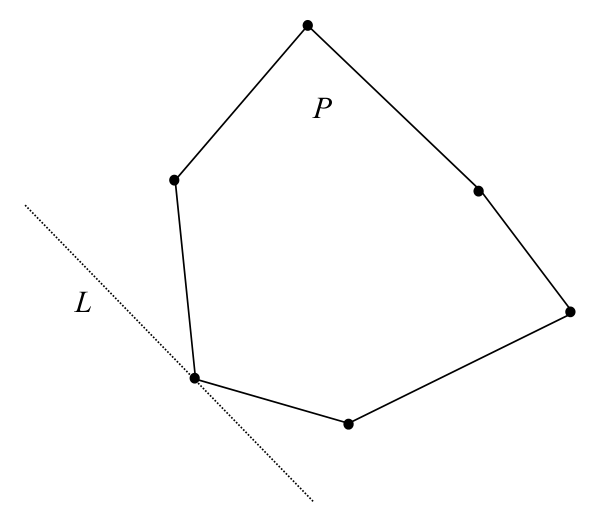

### Figure from slide p. 243
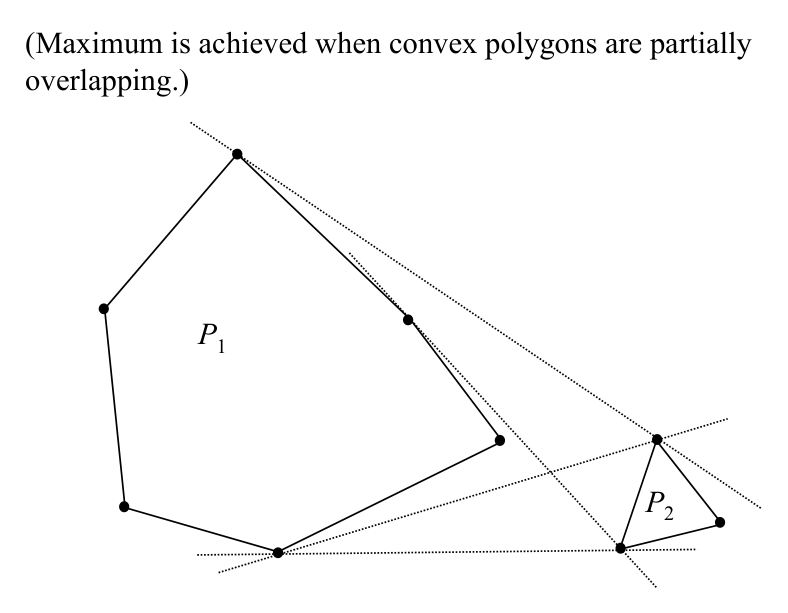

## Slide-by-slide digestion

### p. 242 - Divide-and-conquer
- Supporting lines, 1
- A by-product of the convex hull union algorithm is a method
- of determining supporting lines of two convex hulls.
- A supporting line of a convex polygon P is a straight line L
- passing through a vertex of P such that the interior of P
- lies entirely to one side of L.
- The idea is analogous to the notion of tangent for circles.

p. 243 - Divide-and-conquer
- Supporting lines, 2
- Two convex polygons P1 and P2, with n and m vertices,
- such that one is not entirely contained within the other,
- have common supporting lines.
- The number of common supporting lines is ≥2 and ≤2*min(n,m).
- (Maximum is achieved when convex polygons are partially
- overlapping.)

p. 244 - Divide-and-conquer
- Supporting lines, 3
- Once the convex hull of the union of P1 and P2 has been
- constructed, common supporting lines can be found.
- Scan the vertex list of H(P1 ∪P2);
- any pair of consecutive vertices where one originated in P1
- and the other in P2 defines a common supporting line.

What you must be able to say or do in an exam
- Give the precise definitions.
- Distinguish similar notions cleanly.
- Use the right primitive test or formula on a concrete example.

Complexity and performance facts
Used as a linear-time merge primitive once hulls are already in cyclic order.

## Common mistakes and danger points
- Do not confuse supporting lines with arbitrary lines through hull vertices.

Exam-style drills and answer skeletons
### Definition drill
**Question.** Give the precise definitions and the most important consequences from supporting lines from hull union.

**How to answer.** A strong answer distinguishes similar objects and uses the course terminology exactly.

## Recap
### What you must know cold
- Definition of a supporting line for a convex polygon or two convex polygons.
- Upper and lower common tangents.
- Why the hull of a union reveals these lines.
Core test / key idea
- A common supporting line touches both polygons and leaves each polygon entirely on the same side.
- Finding upper/lower tangents is the key to linear-time hull merge.
Complexity
- Used as a linear-time merge primitive once hulls are already in cyclic order.
Common mistakes / danger points
- Do not confuse supporting lines with arbitrary lines through hull vertices.
End-of-file summary
- Definition of a supporting line for a convex polygon or two convex polygons.
- Upper and lower common tangents.
- Why the hull of a union reveals these lines.
- Used as a linear-time merge primitive once hulls are already in cyclic order.
- Do not confuse supporting lines with arbitrary lines through hull vertices.

Everything related to this topic
- **Previous file in reading order:** [Divide-and-conquer convex hulls and hull union](03_Convex_Hulls/40_divide-and-conquer-hull.md)
- **Next file in reading order:** [Dynamic/on-line convex hull insertion: problem setting and core idea](03_Convex_Hulls/42_dynamic-hull-core-idea.md)
- **Source slide range:** pp. 242-244 of `comp_geometry_slides_new.pdf`
- **Related recordings:** CS 564 - 02.27 11.1.txt, CS 564 - 02.27 11.2.txt
- **Related homework-derived exam prompts included here:** none directly mapped; generic exam drills added instead


---

# Dynamic/on-line convex hull insertion: problem setting and core idea

## Scope
- **Slides:** pp. 245-253
- **Major topic folder:** convex-hulls
- **Recording files touching this material:** CS 564 - 02.27 11.2.txt, CS 564 - 03.04 12.1.txt
- **Goal of this file:** You should be able to study this topic without reopening the slide deck.

Big picture
Now the hull is no longer static. The question becomes: if a new point arrives, how much of the current hull survives? The answer is “all of it except the visible chain between two support vertices.”

## What you must know cold
- Static vs dynamic / online hull problem.
- Case distinction: inserted point inside current hull vs outside it.
- Support lines from the new point to the current hull.

Core ideas and reasoning
- If the new point lies inside the hull, nothing changes.
- If it lies outside, exactly the chain of hull vertices visible from the new point is replaced by the new point together with two support edges.

Figures to actually look at
These are cropped from the main slide PDF. Do not skip them.

### Figure from slide p. 246


### Figure from slide p. 251


## Slide-by-slide digestion

### p. 245 - Dynamic hull (insertion)
- Hull maintenance during insertion, 1
- Maintain H(S) as points are added to S.

p. 246 - Dynamic hull (insertion)
- Hull maintenance during insertion, 2
- Maintain H(S) as points are added to S.

p. 247 - Dynamic hull (insertion)
- Definitions
- Preparata
- static
- Set of object remains fixed between operations
- (e.g., between queries in repetitive mode).
- dynamic
- Set of objects can change between operations.
- Insertions and deletions allowed in general,
- but sometimes constrained.
- Implies S must be in some updatable data structure.

p. 248 - Dynamic hull (insertion)
- Problem definitions
- ON-LINE CONVEX HULL
- INSTANCE: Sequence of N points in the plane p1, p2, …, pN.
- QUESTION: Find their convex hull in such a way that after
- pi is processed we have H({p1, p2, …, pi}).
- REAL-TIME CONVEX HULL
- QUESTION: Find their convex hull on-line assuming constant
- interarrival delay.
- The algorithm must maintain some representation of the hull and
- update it as points are inserted. Can this be done and still achieve

p. 249 - Dynamic hull (insertion)
- Algorithms
- Shamos (1978), mentioned in text p. 119, not covered.
- Preparata (1979), presented in text pp. 119-124, covered.
- Latter is real-time (hence is on-line).
- Key idea, 1
- Assume the points are inserted in sequence p1, p2, …, pN.
- Let pi be the current point and Ci-1 = H({p1, p2, …, pi-1}).
- Finding Ci requires finding the supporting lines from pi to Ci-1,
- if they exist (i.e., pi is external to Ci-1).
- (If pi is internal to Ci-1, then Ci = Ci-1.)

p. 250 - Dynamic hull (insertion)
- Key idea, 2
- Finding Ci requires finding the supporting lines from pi to Ci-1,
- if they exist (i.e., pi is external to Ci-1).
- (If pi is internal to Ci-1, then Ci = Ci-1.)
- Another example:
- Ci-1
- Left supporting line
- Right supporting line
- Supporting vertices

p. 251 - Dynamic hull (insertion)
- Algorithm overview
- For each pi,
- If pi is internal to Ci-1, then Ci = Ci-1, and pi is eliminated.
- If pi is external to Ci-1, then we must
- 1. Find the supporting lines from pi to Ci-1.
- 2. Ci = pi || r … l

```text
/* vertices of Ci-1 from r to l */
The problem reduces to finding the supporting lines,
i.e., finding the supporting vertices l and r.
The data structure for the vertices of Ci-1 will be given soon,
```

### p. 252 - Dynamic hull (insertion)
- Classifying a vertex
- We need to classify any vertex v of Ci-1 w.r.t. pi
- (or w.r.t. the segment piv).
- v′
- v′′
- (b) Supporting;
- the two vertices adjacent to v
- lie on the same side of line pv
- (c) Reflex;
- segment pv does not intersect

p. 253 - Dynamic hull (insertion)
- Searching for a supporting vertex
- Suppose we have pi and v a vertex of Ci-1.
- Assume we seek l, the left supporting vertex.
- 1. Classify v w.r.t. to pi.
- 2. If v is supporting, l = v, return.
- 3. If v is concave, v = v′, repeat.
- 4. If v is reflex, v = v′′, repeat.
- This is advancing along Ci-1, searching for l.
- Eventually the supporting vertex l will be found.
- Finding r is analogous.

What you must be able to say or do in an exam
- State the input, output, preprocessing, and query/update model precisely.
- Explain the invariant or ordering that makes the method work.
- Trace the method by hand on a small example.
- Give the exact time and space bounds.
- Mention one edge case, degeneracy, or limitation.

Complexity and performance facts
Core geometric task is locating left/right support vertices quickly.

## Common mistakes and danger points
- Do not recompute the full hull from scratch unless the question explicitly allows the naive method.

Professor emphasis from recordings
These points are distilled from the related recordings and focus on what the professor slowed down for, warned about, or connected to homework/exam reasoning.

- For on-line hull insertion, the lecture separates the easy case from the real work: if the new point is inside the current hull, nothing changes.
- When the point is outside, the whole problem becomes finding the two supporting lines/tangents that bracket the visible chain.
- He also notes that a careful case analysis is required, because support/reflex combinations determine the update.

Exam-style drills and answer skeletons
Existing drill reminders from the earlier pack:
- Adapted from HW2-Q6: Design an O(n + X/d) algorithm for a d-approximate convex hull, where X is x-span of the point set.

Dynamic hull insertion drill
**Question.** A new point arrives. Explain how to decide whether it changes the hull and what supporting-line information must be found before updating the vertex sequence.

**How to answer.** If the point is inside the current hull, ignore it. Otherwise locate left and right tangents, delete the obscured chain, and splice the new point in.

### Core exam drill
**Question.** State the problem solved by dynamic/on-line convex hull insertion: problem setting and core idea, describe preprocessing/query/update steps if any, and give the time and space bounds.

**How to answer.** An excellent answer names the input, the output, the invariant or ordering exploited by the method, and the exact asymptotic costs.

### Hand-trace drill
**Question.** Trace dynamic/on-line convex hull insertion: problem setting and core idea on a small example by hand and explain each comparison or structural change.

**How to answer.** On this course, being able to run the method on a picture matters more than writing vague slogans.

## Recap
### What you must know cold
- Static vs dynamic / online hull problem.
- Case distinction: inserted point inside current hull vs outside it.
- Support lines from the new point to the current hull.
Core test / key idea
- If the new point lies inside the hull, nothing changes.
- If it lies outside, exactly the chain of hull vertices visible from the new point is replaced by the new point together with two support edges.
Complexity
- Core geometric task is locating left/right support vertices quickly.
Common mistakes / danger points
- Do not recompute the full hull from scratch unless the question explicitly allows the naive method.
Professor emphasis (from recordings)
- For on-line hull insertion, the lecture separates the easy case from the real work: if the new point is inside the current hull, nothing changes.
- When the point is outside, the whole problem becomes finding the two supporting lines/tangents that bracket the visible chain.
- He also notes that a careful case analysis is required, because support/reflex combinations determine the update.
End-of-file summary
- Static vs dynamic / online hull problem.
- Case distinction: inserted point inside current hull vs outside it.
- Support lines from the new point to the current hull.
- Core geometric task is locating left/right support vertices quickly.
- Do not recompute the full hull from scratch unless the question explicitly allows the naive method.
- For on-line hull insertion, the lecture separates the easy case from the real work: if the new point is inside the current hull, nothing changes.

Everything related to this topic
- **Previous file in reading order:** [Supporting lines from hull union](03_Convex_Hulls/41_supporting-lines.md)
- **Next file in reading order:** [Dynamic/on-line convex hull insertion: data structure, search, update, and analysis](03_Convex_Hulls/43_dynamic-hull-data-structure.md)
- **Source slide range:** pp. 245-253 of `comp_geometry_slides_new.pdf`
- **Related recordings:** CS 564 - 02.27 11.2.txt, CS 564 - 03.04 12.1.txt
- **Related homework-derived exam prompts included here:** Dynamic hull insertion drill


---

# Dynamic/on-line convex hull insertion: data structure, search, update, and analysis

## Scope
- **Slides:** pp. 254-263
- **Major topic folder:** convex-hulls
- **Recording files touching this material:** CS 564 - 02.27 11.2.txt, CS 564 - 03.04 12.1.txt
- **Goal of this file:** You should be able to study this topic without reopening the slide deck.

Big picture
This section is about making dynamic hull updates fast by storing the hull in a searchable, concatenable structure rather than a raw cyclic list.

## What you must know cold
- Operations needed: search, split, splice/concatenate.
- Balanced-tree or concatenable-queue representation of hull vertices.
- Locate support vertices, remove visible chain, insert new point, restore cyclic order.

Core ideas and reasoning
- The hull is maintained in cyclic order in a structure supporting logarithmic search and logarithmic local surgery.
- Update = find support vertices + split at supports + discard visible chain + insert the new point + concatenate the remaining pieces.

Figures to actually look at
These are cropped from the main slide PDF. Do not skip them.

### Figure from slide p. 257
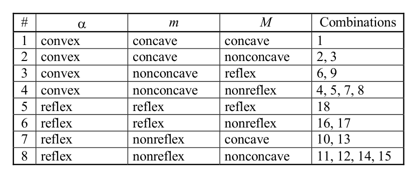

### Figure from slide p. 258
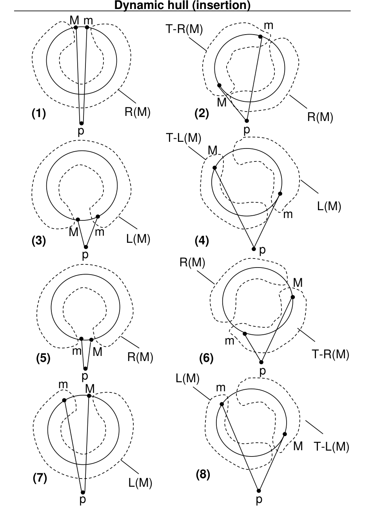

## Slide-by-slide digestion

### p. 254 - Dynamic hull (insertion)
- Data structure for Ci-1
- The data structure for Ci-1 must support certain operations:
- 1. SEARCH an ordered string of items (the vertices of the hull)
- to locate the supporting lines from pi.
- 2. SPLIT a string of items into two substrings.
- 3. CONCATENATE (or SPLICE) two strings of items.
- 4. INSERT one item (e.g., the current pi) in its ordered location.
- The concatenable queue data structure supports these operations,
- all in O(log N) time, where N is the number of items stored.
- (For more information, see [Aho,1974] or [Reingold,1977].)

p. 255 - Dynamic hull (insertion)
- Search tree for Ci-1
- A concatenable queue is a height balanced search tree, call it T.
- It stores the vertices of Ci-1 in (counterclockwise) order.
- In T, the cycle of vertices of Ci-1 appears as a chain, in order.
- The first and last items are considered to be adjacent.
- Vertex M is the vertex of the root of T.
- Vertex m is the vertex of the leftmost (first) node of T.
- Angle α is angle mpiM; α may be convex (≤π) or reflex (> π).
- Each node of T corresponds
- to a vertex of Ci-1.

p. 256 - Dynamic hull (insertion)
- Search combinations
- If we examine the classifications of m, M, and α,
- there are 18 possible combinations.
- Vertex m is concave, supporting, or reflex.
- Vertex M is concave, supporting, or reflex.
- Angle α is convex or reflex.
- convex
- concave
- supporting
- The action to take to find l and r depends on the combination.

p. 257 - Dynamic hull (insertion)
- Search cases
- The 18 possible combinations reduce to 8 cases
- where distinct actions are required.
- Combinations
- convex
- concave
- nonconcave
- nonreflex
- Figure 3.16, text p. 122, illustrates the cases.
- In Figure 3.16:

p. 258 - Dynamic hull (insertion)
- T-R(M)
- T-L(M)

p. 259 - Dynamic hull (insertion)
- Finding l and r, 1
- A distinct action is required to locate l and r in each of the 8 cases.
- Consider cases 2, 4, 6, and 8.
- Vertices l and r are known to exist, because pi cannot be internal.
- (Point pi can be internal only if m and M are both concave.)
- In these cases, l and r are in separate subtrees of the root of T
- (one of the subtrees is extended to include the root in each case).
- Thus l and r can be found by analogous searches of the two subtrees.
- For example, l is found by the following function:

```text
procedure LEFTSEARCH(T)
```

### p. 260 - Dynamic hull (insertion)
- Finding l and r, 2
- A distinct action is required to locate l and r in each of the 8 cases.
- Consider cases 1, 3, 5, and 7.
- Vertices l and r may not exist,
- because pi could be internal in cases 1 and 7.
- In these cases, if they exist l and r are in the same subtree
- of the root of T (the circled subtree in Figure 3.16).
- Case
- Subtree
- The search calls itself recursively on that subtree until one of cases

p. 261 - Dynamic hull (insertion)
- Finding l and r, 3
- In general, finding l and r for pi involves tracing a single path in T
- from the root to the node where l and r must be in separate subtrees,
- and then following two paths to find l and r from there.
- T contains O(N) nodes (actually it has < i when pi is added, i ≤N).
- Since T is balanced and therefore has O(log N) levels,
- and O(1) time is expended at each node on the two paths,
- the entire search requires O(log N) time.

p. 262 - Dynamic hull (insertion)
- Inserting pi into the hull
- If pi is external to Ci-1, it must be added,
- and possibly some other vertices removed, to produce Ci.
- Put another way, the (possibly empty) chain of vertices between
- l and r must be replaced with pi.
- Vertex l may either precede or follow vertex r in the vertex
- order of Ci-1. The “splicing in” step requires a different set of
- operations for each case.
- Vertex sequence
- Split

p. 263 - Dynamic hull (insertion)
- Analysis
- Each insertion requires O(log N) time:
- 1. O(log N) to find l and r
- 2. O(log N) to splice in pi
- For N insertions, the overall time is O(N log N).
- The storage required is O(N) for T.

What you must be able to say or do in an exam
- State the input, output, preprocessing, and query/update model precisely.
- Explain the invariant or ordering that makes the method work.
- Trace the method by hand on a small example.
- Give the exact time and space bounds.
- Mention one edge case, degeneracy, or limitation.

Complexity and performance facts
O(log N) per insertion in the course presentation; O(N log N) total for N insertions.

## Common mistakes and danger points
- The data structure is there to make the visible-chain replacement fast; explain that connection explicitly.

Professor emphasis from recordings
These points are distilled from the related recordings and focus on what the professor slowed down for, warned about, or connected to homework/exam reasoning.

- The recording explicitly mentions that the many local cases can be reduced to a smaller set once equivalent support/reflex situations are merged.
- This topic is procedural: if you cannot say how the search walks the structure and how the hull list is updated, you do not really know it.

Exam-style drills and answer skeletons
### Core exam drill
**Question.** State the problem solved by dynamic/on-line convex hull insertion: data structure, search, update, and analysis, describe preprocessing/query/update steps if any, and give the time and space bounds.

**How to answer.** An excellent answer names the input, the output, the invariant or ordering exploited by the method, and the exact asymptotic costs.

### Hand-trace drill
**Question.** Trace dynamic/on-line convex hull insertion: data structure, search, update, and analysis on a small example by hand and explain each comparison or structural change.

**How to answer.** On this course, being able to run the method on a picture matters more than writing vague slogans.

## Recap
### What you must know cold
- Operations needed: search, split, splice/concatenate.
- Balanced-tree or concatenable-queue representation of hull vertices.
- Locate support vertices, remove visible chain, insert new point, restore cyclic order.
Core test / key idea
- The hull is maintained in cyclic order in a structure supporting logarithmic search and logarithmic local surgery.
- Update = find support vertices + split at supports + discard visible chain + insert the new point + concatenate the remaining pieces.
Complexity
- O(log N) per insertion in the course presentation; O(N log N) total for N insertions.
Common mistakes / danger points
- The data structure is there to make the visible-chain replacement fast; explain that connection explicitly.
Professor emphasis (from recordings)
- The recording explicitly mentions that the many local cases can be reduced to a smaller set once equivalent support/reflex situations are merged.
- This topic is procedural: if you cannot say how the search walks the structure and how the hull list is updated, you do not really know it.
End-of-file summary
- Operations needed: search, split, splice/concatenate.
- Balanced-tree or concatenable-queue representation of hull vertices.
- Locate support vertices, remove visible chain, insert new point, restore cyclic order.
- O(log N) per insertion in the course presentation; O(N log N) total for N insertions.
- The data structure is there to make the visible-chain replacement fast; explain that connection explicitly.
- The recording explicitly mentions that the many local cases can be reduced to a smaller set once equivalent support/reflex situations are merged.

Everything related to this topic
- **Previous file in reading order:** [Dynamic/on-line convex hull insertion: problem setting and core idea](03_Convex_Hulls/42_dynamic-hull-core-idea.md)
- **Next file in reading order:** [Gift wrapping in higher dimensions: background and setup](03_Convex_Hulls/44_higher-dimensional-hull-background.md)
- **Source slide range:** pp. 254-263 of `comp_geometry_slides_new.pdf`
- **Related recordings:** CS 564 - 02.27 11.2.txt, CS 564 - 03.04 12.1.txt
- **Related homework-derived exam prompts included here:** none directly mapped; generic exam drills added instead


---

# Gift wrapping in higher dimensions: background and setup

## Scope
- **Slides:** pp. 264-271
- **Major topic folder:** convex-hulls
- **Recording files touching this material:** CS 564 - 03.04 12.1.txt, CS 564 - 03.06 13.1.txt
- **Goal of this file:** You should be able to study this topic without reopening the slide deck.

Big picture
The moment d becomes bigger than 2, hull representation changes completely. You no longer output a cyclic list of vertices; you output a polytope boundary made of facets.

## What you must know cold
- Point set in E^d, affine sets, faces, facets, simplices, simplicial polytopes.
- Representation of the hull in higher dimensions by facets/subfacets.
- Beneath relation for facets.

Core ideas and reasoning
- In 2D the hull is a cycle; in higher dimensions the boundary is a complex of facets.
- Gift wrapping in higher dimensions grows the hull facet by facet.

Figures to actually look at
These are cropped from the main slide PDF. Do not skip them.

### Figure from slide p. 269
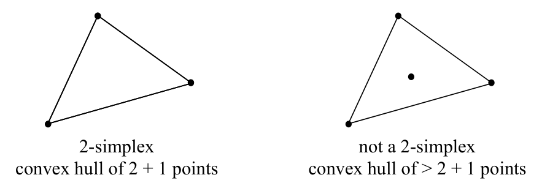

### Figure from slide p. 270
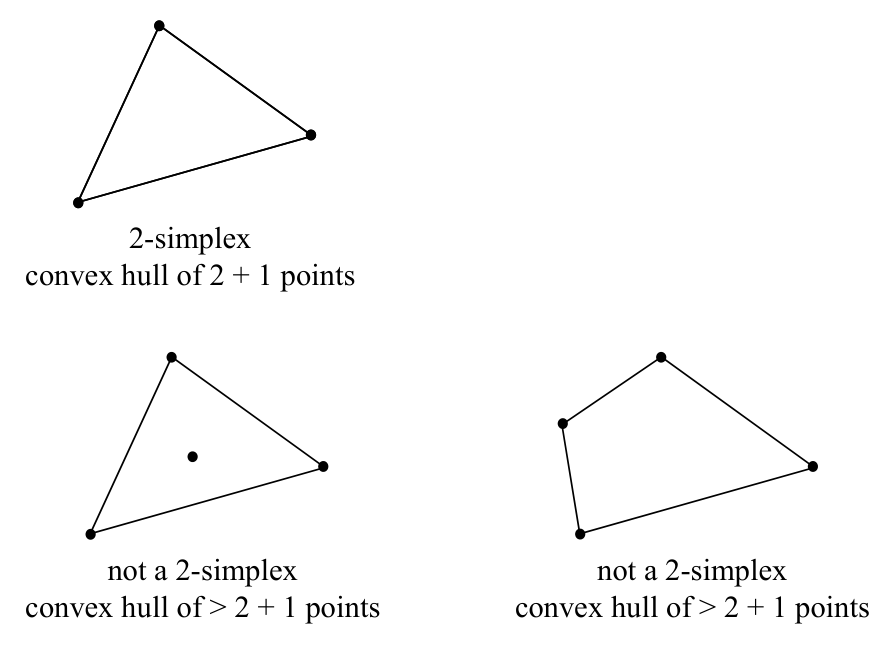

## Slide-by-slide digestion

### p. 264 - Gift wrapping, d > 2
- Problem definition
- CONVEX HULL, D > 2
- INSTANCE. Set S = { p1, p2, … pN} of points in d-space (Ed).
- QUESTION. Construct the convex hull H(S) of S.
- The coordinates of the points pi ∈S will be referred to as
- pi = (x1, x2, …, xd).
- For d = 2, the constructed hull was given (represented)
- as a sequence of hull vertices.
- How is the hull represented for d > 2?
- To answer that, and describe the algorithm,

p. 265 - Gift wrapping, d > 2
- Polyhedron
- In E3 a polyhedron is defined by a finite set of planar polygons
- such that every edge of a polygon is shared by exactly one
- other polygon and no subset of the polygons has the property.
- Polyhedra is plural for polyhedron.
- The polygons that share an edge are adjacent.
- The vertices and edges of the polygons
- are the vertices and edges of the polyhedron.
- The polygons are the facets of the polyhedron.
- A polyhedron is simple if there is no pair of nonadjacent

p. 266 - Gift wrapping, d > 2
- Polytope
- A half-space is the portion of Ed lying on one side of a hyperplane.
- A polyhedral set in Ed is the intersection of a finite set of
- closed half-spaces.
- Note that a polyhedral set is convex, since a half-space is convex,
- and the intersection of convex sets is convex.
- Plane polygons (d = 2) and space polyhedra (d = 3) are
- 2- and 3-dimensional instances of bounded polyhedral sets.
- A bounded d-dimensional polyhedral set is a polytope.
- Note that polytopes are convex by definition.

p. 267 - Gift wrapping, d > 2
- Affine set
- Given k distinct points p1, p2, …, pk in Ed, the set of points
- p = α1p1 + α2p2 + . . . + αkpk
- (αj ∈ℜ, α1 + α2 + . . . + αk = 1)
- is the affine set generated by p1, p2, …, pk,
- and p is an affine combination of p1, p2, …, pk.
- We have seen this before.
- If k = 2, this is the parametric equation of a line,
- i.e., a line is an affine set.
- For k = 3, the affine set is a plane.

p. 268 - Gift wrapping, d > 2
- Faces of a polytope
- A d-polytope is described by its boundary,
- which consists of faces. For a d-polytope,
- there are faces in all dimensions 1 … d.
- Some have special names.
- For a d-polytope:
- Dimension
- Face
- Name of face
- d-face

p. 269 - Gift wrapping, d > 2
- Simplex
- A d-polytope P is a d-simplex (or just simplex)
- iff it is the convex hull of (d + 1) affinely independent points.
- Any subset of the d vertices of the convex hull is itself a
- simplex and is a face (in some dimension) of P.
- d-simplex
- vertex
- edge
- triangle
- tetrahedron

p. 270 - Gift wrapping, d > 2
- Simplicial
- A d-polytope is simplicial if each of its facets is a (d-1)-simplex.
- For example, for d = 3:
- The convex hull of a set of points in 3-space (the convex hull
- is a 3-polytope) is simplicial iff every facet is a 2-simplex
- (a triangular convex hull of exactly 3 points).
- For example, the first case below.
- If any facet of the hull has > 3 co-planar points,
- the hull is not simplicial.
- For example, the second and third cases below.

p. 271 - Gift wrapping, d > 2
- Beneath
- A point p is beneath a facet F of a polytope P if the point p
- lies in the open half-space determined by hyperplane aff(F)
- and containing P.
- In other words, aff(F) is a supporting hyperplane of P,
- and p and P are in the same half-space bounded by aff(F).
- Point p is beyond facet F if p lies in the open half-space
- determined by aff(F) and not containing P.
- The figure shows these relationships for d = 2.
- Note error in text, 2nd paragraph of 3.4, “the P” should be “p”.

What you must be able to say or do in an exam
- Give the precise definitions.
- Distinguish similar notions cleanly.
- Use the right primitive test or formula on a concrete example.

Complexity and performance facts
Representation complexity now depends on the number of facets and on dimension d.

## Common mistakes and danger points
- Do not describe the d>2 hull as an ordered list of vertices. That loses the boundary structure.

Exam-style drills and answer skeletons
### Definition drill
**Question.** Give the precise definitions and the most important consequences from gift wrapping in higher dimensions: background and setup.

**How to answer.** A strong answer distinguishes similar objects and uses the course terminology exactly.

## Recap
### What you must know cold
- Point set in E^d, affine sets, faces, facets, simplices, simplicial polytopes.
- Representation of the hull in higher dimensions by facets/subfacets.
- Beneath relation for facets.
Core test / key idea
- In 2D the hull is a cycle; in higher dimensions the boundary is a complex of facets.
- Gift wrapping in higher dimensions grows the hull facet by facet.
Complexity
- Representation complexity now depends on the number of facets and on dimension d.
Common mistakes / danger points
- Do not describe the d>2 hull as an ordered list of vertices. That loses the boundary structure.
End-of-file summary
- Point set in E^d, affine sets, faces, facets, simplices, simplicial polytopes.
- Representation of the hull in higher dimensions by facets/subfacets.
- Beneath relation for facets.
- Representation complexity now depends on the number of facets and on dimension d.
- Do not describe the d>2 hull as an ordered list of vertices. That loses the boundary structure.

Everything related to this topic
- **Previous file in reading order:** [Dynamic/on-line convex hull insertion: data structure, search, update, and analysis](03_Convex_Hulls/43_dynamic-hull-data-structure.md)
- **Next file in reading order:** [Gift wrapping in higher dimensions: algorithm and adjacent facets](03_Convex_Hulls/45_higher-dimensional-hull-algorithm.md)
- **Source slide range:** pp. 264-271 of `comp_geometry_slides_new.pdf`
- **Related recordings:** CS 564 - 03.04 12.1.txt, CS 564 - 03.06 13.1.txt
- **Related homework-derived exam prompts included here:** none directly mapped; generic exam drills added instead


---

# Gift wrapping in higher dimensions: algorithm and adjacent facets

## Scope
- **Slides:** pp. 272-279
- **Major topic folder:** convex-hulls
- **Recording files touching this material:** CS 564 - 03.06 13.1.txt
- **Goal of this file:** You should be able to study this topic without reopening the slide deck.

Big picture
This is Jarvis/gift wrapping generalized to facets. Instead of walking from one hull edge to the next, you walk from one hull facet to adjacent facets across shared subfacets.

## What you must know cold
- Facet adjacency via shared (d-2)-dimensional subfacets.
- How to find the next facet adjacent to a known facet.
- Queue/frontier view of the search over unprocessed boundary pieces.

Core ideas and reasoning
- Starting from one known hull facet, examine its frontier subfacets.
- For each frontier subfacet, find the adjacent supporting facet that keeps all points on the correct side.
- Continue until all frontier subfacets are resolved.

Figures to actually look at
These are cropped from the main slide PDF. Do not skip them.

### Figure from slide p. 275
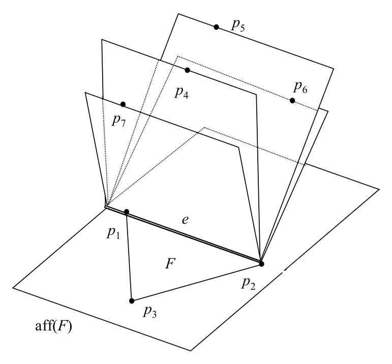

### Figure from slide p. 277


## Slide-by-slide digestion

### p. 272 - Gift wrapping, d > 2
- Gift wrapping
- Proposed by Chand and Kapur (1970).
- Analyzed by Bhattacharya (1982).
- Specialized for d = 2 by Jarvis (1973), Jarvis’ march.
- Key idea: Given one facet (a (d-1)-face) of the convex hull,
- find a neighboring facet of the hull by “wrapping”
- a (d-1)-dimensional affine set around the point set.
- Continue from each facet to its neighbors until all facets are found.
- For example, in d = 3, imagine wrapping a sheet of 2-dimensional
- wrapping paper around a 3-dimensional gift box.

p. 273 - Gift wrapping, d > 2
- Simplicial assumption
- As presented (here and in the text), the algorithm assumes that
- the resulting polytope (the convex hull) is simplicial.
- Recall that in a simplicial d-polytope, each facet is a (d-1)-simplex,
- and is determined by exactly d vertices.
- There will be no points in S coplanar with the d vertices that
- determine each facet of the convex hull.
- Theorem. In a simplicial d-polytope, a subfacet is shared by exactly
- two facets, and two facets F1 and F2 share a subfacet e
- iff e is determined by a common subset, with d - 1 vertices,

p. 274 - Gift wrapping, d > 2
- Finding an adjacent facet, in general
- Let S = { p1, p2, … pN} be a finite set of points in d-space (Ed).
- Assume a facet F1 of H(S) is known, with all its subfacets.
- The mechanism to advance from F to an adjacent facet F′,
- which shares subfacet e with F,
- is to select from among all the points of S not vertices of F
- the point p′ such that all other points of S
- are beneath the hyperplane aff(e ∪p′).
- In other words, from among all the hyperplanes determined by e
- and a point p′ ∈S but not in F,

p. 275 - Gift wrapping, d > 2
- Finding an adjacent facet, for d = 3
- Facet F is known. Consider the set of planes determined by edge e
- and the points of S and select the one which forms the largest
- angle < π (convex angle) with aff(F).
- Points p1, p2, p3 determine F, which determines aff(F).
- Compare the planes determined by e and p4, p5, p6, and p7.
- aff(F)

p. 276 - Gift wrapping, d > 2
- Finding the largest angle
- The angle comparison is carried out by comparing cotangents
- for each point pk ∈S not part of F.
- The details are in the next slide.
- The time required for one advance is O(d3 + Nd).
- O(d3) to compute a vector needed for the angle comparisons,
- done once per advance (gift wrapping step).
- O(Nd) computing and comparing cotangents for O(N) points.
- aff(F)

p. 277 - Gift wrapping, d > 2
- Finding the largest angle
- The angle comparison is carried out by comparing cotangents
- for each point pk ∈S not part of F.
- Let n be the unit normal to F (in the beneath half space of aff(F),
- and let a be a unit vector normal to both edge e and vector n
- (so that a is oriented like n x p2p1. Also let vk denote the vector p2pk.
- The cotangent of the angle formed by the half-plane containing F
- with the half-plane containing e and pk is given by the ratio
- -|Up2 | / |UV|, where |Up2 |= vk . aT and |UV| = vk . nT. Thus
- for each pk not in F, we compute the quantity

p. 278 - Gift wrapping, d > 2
- Overview of the algorithm
- The algorithm starts from an initial facet.
- For each subfacet of it, construct the adjacent facets.
- Move to one of the new facets and continue until all facets
- have been constructed.
- A pool of subfacets which are candidates for being used is kept.
- A subfacet e, shared by facets F and F′, is a candidate to be used
- iff F or F′ but not both have been constructed.

p. 279 - Gift wrapping, d > 2
- Algorithm
- Queue Q stores facets. File ℑstores the “pool” of subfacets.

```text
procedure GiftWrapping(S)
begin
Q = ∅
ℑ= ∅
F = find an initial convex hull facet
insert into ℑall subfacets of F
insert(F,Q) /* insert F into Q */
while (Q ≠∅) do
```

## What you must be able to say or do in an exam
- State the input, output, preprocessing, and query/update model precisely.
- Explain the invariant or ordering that makes the method work.
- Trace the method by hand on a small example.
- Give the exact time and space bounds.
- Mention one edge case, degeneracy, or limitation.

Complexity and performance facts
Depends on dimension and number of produced facets/subfacets.

## Common mistakes and danger points
- Facet adjacency is more subtle than edge adjacency in 2D; be clear what object is shared.

Exam-style drills and answer skeletons
### Core exam drill
**Question.** State the problem solved by gift wrapping in higher dimensions: algorithm and adjacent facets, describe preprocessing/query/update steps if any, and give the time and space bounds.

**How to answer.** An excellent answer names the input, the output, the invariant or ordering exploited by the method, and the exact asymptotic costs.

### Hand-trace drill
**Question.** Trace gift wrapping in higher dimensions: algorithm and adjacent facets on a small example by hand and explain each comparison or structural change.

**How to answer.** On this course, being able to run the method on a picture matters more than writing vague slogans.

## Recap
### What you must know cold
- Facet adjacency via shared (d-2)-dimensional subfacets.
- How to find the next facet adjacent to a known facet.
- Queue/frontier view of the search over unprocessed boundary pieces.
Core test / key idea
- Starting from one known hull facet, examine its frontier subfacets.
- For each frontier subfacet, find the adjacent supporting facet that keeps all points on the correct side.
- Continue until all frontier subfacets are resolved.
Complexity
- Depends on dimension and number of produced facets/subfacets.
Common mistakes / danger points
- Facet adjacency is more subtle than edge adjacency in 2D; be clear what object is shared.
End-of-file summary
- Facet adjacency via shared (d-2)-dimensional subfacets.
- How to find the next facet adjacent to a known facet.
- Queue/frontier view of the search over unprocessed boundary pieces.
- Depends on dimension and number of produced facets/subfacets.
- Facet adjacency is more subtle than edge adjacency in 2D; be clear what object is shared.

Everything related to this topic
- **Previous file in reading order:** [Gift wrapping in higher dimensions: background and setup](03_Convex_Hulls/44_higher-dimensional-hull-background.md)
- **Next file in reading order:** [Gift wrapping in higher dimensions: supporting hyperplanes, initialization, candidates, and analysis](03_Convex_Hulls/46_higher-dimensional-hull-init-analysis.md)
- **Source slide range:** pp. 272-279 of `comp_geometry_slides_new.pdf`
- **Related recordings:** CS 564 - 03.06 13.1.txt
- **Related homework-derived exam prompts included here:** none directly mapped; generic exam drills added instead


---

# Gift wrapping in higher dimensions: supporting hyperplanes, initialization, candidates, and analysis

## Scope
- **Slides:** pp. 280-289
- **Major topic folder:** convex-hulls
- **Recording files touching this material:** CS 564 - 03.06 13.2.txt
- **Goal of this file:** You should be able to study this topic without reopening the slide deck.

Big picture
This range covers the hard parts in d>2: getting the first facet, generating candidate subfacets, and accounting for the cost in terms of facets and dimension.

## What you must know cold
- Supporting hyperplanes as the higher-dimensional version of supporting lines.
- Initialization by successively finding supporting hyperplanes.
- Candidate subfacets and frontier maintenance.
- Final cost accounting.

Core ideas and reasoning
- Initialization is not trivial: you need one valid hull facet before adjacency expansion can begin.
- Each processed facet generates subfacet candidates; some are already internal, others remain frontier pieces.

Figures to actually look at
These are cropped from the main slide PDF. Do not skip them.

### Figure from slide p. 283
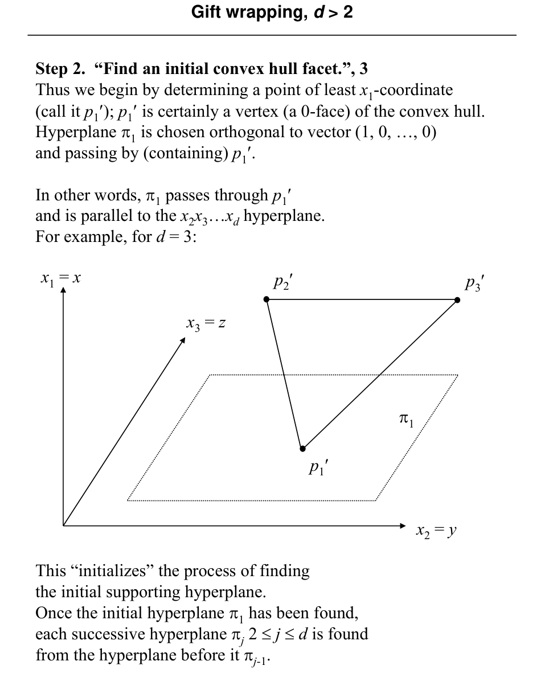

### Figure from slide p. 284
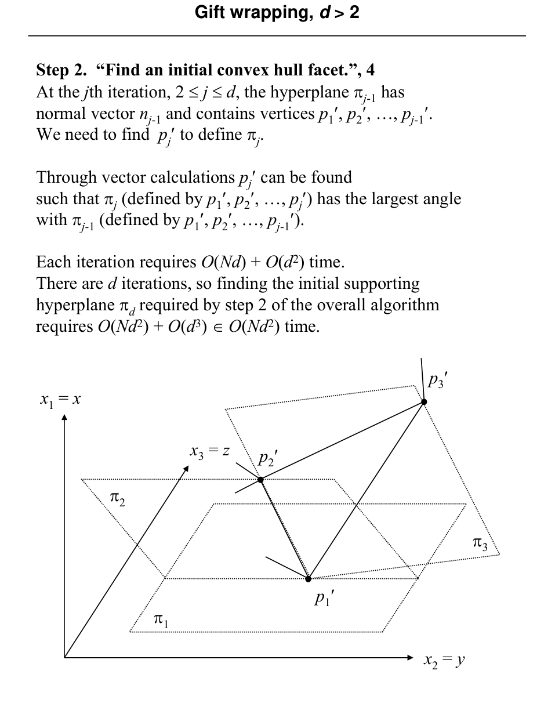

## Slide-by-slide digestion

### p. 280 - Gift wrapping, d > 2
- Supporting lines and planes
- Recall that a supporting line of a convex polygon intersects the
- polygon at a vertex such that the entire polygon is to one side of
- the line.
- A supporting plane (or hyperplane) has a similar relationship
- with a polytope.
- polygon, d = 2
- supporting line, d = 1
- intersection is vertex
- intersection is edge

p. 281 - Gift wrapping, d > 2
- Step 2. “Find an initial convex hull facet.”, 1
- The idea is to obtain a hyperplane containing a facet of the
- convex hull polytope H(S) by successive approximations.
- This is done by constructing a sequence of d (d is dimension Ed)
- supporting hyperplanes π1, π2, …, πd,
- such that πi shares one more vertex with the convex hull than πi-1
- for 1 ≤i ≤d (we define π0 as sharing 0 vertices with H(S)).
- In other words, πi for 1 ≤i ≤d shares i vertices with H(S).
- A supporting hyperplane intersects the polytope
- such that the entire polytope is to one side of the hyperplane.

p. 282 - Gift wrapping, d > 2
- Step 2. “Find an initial convex hull facet.”, 2
- For d = 3 (E3) the successive hyperplanes intersect
- the convex hull as follows:
- supporting
- # vertices
- intersection
- hyperplane
- of H(S) on πi
- object
- π0

p. 283 - Gift wrapping, d > 2
- Step 2. “Find an initial convex hull facet.”, 3
- Thus we begin by determining a point of least x1-coordinate
- (call it p1′); p1′ is certainly a vertex (a 0-face) of the convex hull.
- Hyperplane π1 is chosen orthogonal to vector (1, 0, …, 0)
- and passing by (containing) p1′.
- In other words, π1 passes through p1′
- and is parallel to the x2x3…xd hyperplane.
- For example, for d = 3:
- This “initializes” the process of finding
- the initial supporting hyperplane.

p. 284 - Gift wrapping, d > 2
- Step 2. “Find an initial convex hull facet.”, 4
- At the jth iteration, 2 ≤j ≤d, the hyperplane πj-1 has
- normal vector nj-1 and contains vertices p1′, p2′, …, pj-1′.
- We need to find pj′ to define πj.
- Through vector calculations pj′ can be found
- such that πj (defined by p1′, p2′, …, pj′) has the largest angle
- with πj-1 (defined by p1′, p2′, …, pj-1′).
- Each iteration requires O(Nd) + O(d2) time.
- There are d iterations, so finding the initial supporting
- hyperplane πd required by step 2 of the overall algorithm

p. 285 - Gift wrapping, d > 2
- Step 7. “Generate the subfacets of facet F.”
- Because we have assumed that the convex hull polytope H(S)
- is simplicial, each facet of H(S) is determined by exactly d vertices,
- and each subset of those vertices of size d-1 determines a subfacet.
- The subfacets of a facet can be generated in a straightforward
- fashion by considering each of the d vertices in turn and reading
- off the remaining d-1 vertices.
- This requires O(d2) time.
- Each facet will be described by a d-component vector
- of the indices of its vertices,

p. 286 - Gift wrapping, d > 2
- Step 8. “Check if a subfacet e is a candidate.”, 1
- A subfacet is a candidate iff it is contained in just one facet
- generated by the algorithm.
- Why just one?
- Recall that in a simplicial polytope, a subfacet is shared by exactly
- two facets. If a subfacet is generated twice,
- then both of its adjacent facets have been found,
- and the subfacet is of no further use.

p. 287 - Gift wrapping, d > 2
- Step 8. “Check if a subfacet e is a candidate.”, 2
- Recall that ℑis a file of subfacets.
- Given a newly generated subfacet e,
- searching ℑfor e will determine if e is a candidate.
- If e ∈ℑ, delete e.
- If e ∉ℑ, add it. (This is step 10 in the algorithm).
- A subfacet is represented by a (d-1)-component vector
- of vertex indices.
- Store ℑas a height-balanced binary tree,
- ordered lexicographically on the vertex indices.

p. 288 - Gift wrapping, d > 2
- Analysis, 1
- We analyze the algorithm in steps.
- Let ϕd-1 be the actual number of facets of the polytope H(S).
- Let ϕd-2 be the actual number of subfacets of the polytope H(S).
- Initialization (steps 1-4) requires O(Nd2) time.
- Steps 6, 11, 12 process each facet once each,
- adding it to the queue, removing it, and outputting it;
- they require O(d) × ϕd-1.
- number of facets
- components of the vector representing the facet

p. 289 - Gift wrapping, d > 2
- Analysis, 2
- It can be shown that both ϕd-1, ϕd-2 ∈O(N⎣d/2⎦).
- Using this the previous analysis simplifies to:
- Convex hull construction time in d dimensions on N points
- T(d,N) using the Gift wrapping algorithm,
- requires O(N⎣d/2⎦+1) + O(N⎣d/2⎦log N).
- Note that even though d is a constant,
- it remains in the final order expression where it is an exponent
- of the input size N.

What you must be able to say or do in an exam
- State the claim precisely before giving the argument.
- Identify the known lower bound / recurrence / invariant you are using.
- Keep the direction of the argument correct.
- End with the exact asymptotic conclusion.

Complexity and performance facts
State the course bound in terms of N, dimension d, number of facets, and number of subfacets.

## Common mistakes and danger points
- Do not quote a simple O(N log N) style bound from 2D. The higher-dimensional complexity depends heavily on output size.

Exam-style drills and answer skeletons
### Proof drill
**Question.** Explain the main argument in gift wrapping in higher dimensions: supporting hyperplanes, initialization, candidates, and analysis in a logically correct order.

**How to answer.** Do not jump from intuition to conclusion. State the reduction/invariant/recurrence first, then derive the claimed bound.

## Recap
### What you must know cold
- Supporting hyperplanes as the higher-dimensional version of supporting lines.
- Initialization by successively finding supporting hyperplanes.
- Candidate subfacets and frontier maintenance.
- Final cost accounting.
Core test / key idea
- Initialization is not trivial: you need one valid hull facet before adjacency expansion can begin.
- Each processed facet generates subfacet candidates; some are already internal, others remain frontier pieces.
Complexity
- State the course bound in terms of N, dimension d, number of facets, and number of subfacets.
Common mistakes / danger points
- Do not quote a simple O(N log N) style bound from 2D. The higher-dimensional complexity depends heavily on output size.
End-of-file summary
- Supporting hyperplanes as the higher-dimensional version of supporting lines.
- Initialization by successively finding supporting hyperplanes.
- Candidate subfacets and frontier maintenance.
- State the course bound in terms of N, dimension d, number of facets, and number of subfacets.
- Do not quote a simple O(N log N) style bound from 2D. The higher-dimensional complexity depends heavily on output size.

Everything related to this topic
- **Previous file in reading order:** [Gift wrapping in higher dimensions: algorithm and adjacent facets](03_Convex_Hulls/45_higher-dimensional-hull-algorithm.md)
- **Next file in reading order:** [Proximity problem family: survey and relations](04_Proximity/47_proximity-problem-survey.md)
- **Source slide range:** pp. 280-289 of `comp_geometry_slides_new.pdf`
- **Related recordings:** CS 564 - 03.06 13.2.txt
- **Related homework-derived exam prompts included here:** none directly mapped; generic exam drills added instead


---

# Proximity problem family: survey and relations

## Scope
- **Slides:** pp. 290-299
- **Major topic folder:** proximity
- **Recording files touching this material:** CS 564 - 03.06 13.2.txt, CS 564 - 03.11 14.1.txt, CS 564 - 03.13 15.1a.txt, CS 564 - 03.25 16.1.txt
- **Goal of this file:** You should be able to study this topic without reopening the slide deck.

Big picture
This file is the conceptual map for the last midterm block. Closest pair, nearest neighbors, EMST, triangulations, Voronoi, and search variants are introduced as one family of related proximity questions.

## What you must know cold
- Closest pair, all nearest neighbors, nearest-neighbor relation, EMST, triangulation, k-nearest neighbors.
- Difference between one-shot proximity problems and search/data-structure versions.
- How these problems reduce to one another conceptually.

Core ideas and reasoning
- The block’s main message is not just a list of problems; it is that many of them share lower bounds and structural reductions.
- Nearest-neighbor relation need not be symmetric.
- Voronoi and Delaunay later become universal structures for many proximity queries, although later pages are outside your midterm.

Figures to actually look at
These are cropped from the main slide PDF. Do not skip them.

### Figure from slide p. 294
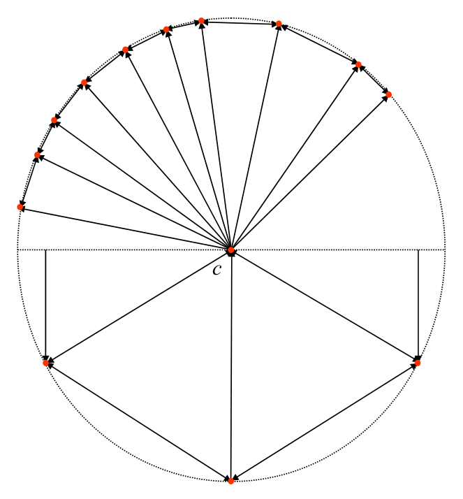

### Figure from slide p. 299
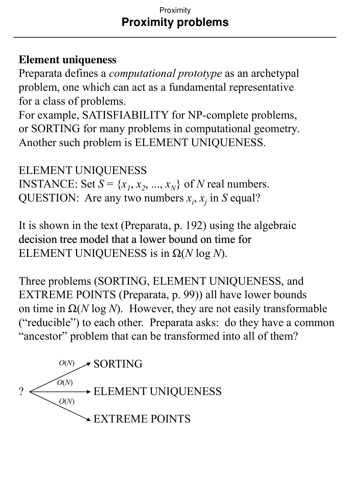

## Slide-by-slide digestion

### p. 290 - Comments
- We consider in this topic a large class of related problems
- that deal with proximity of points in the plane.
- We will:
- 1. Define some proximity problems and see how they are related
- 2. Study a classic algorithm for one of the problems
- 3. Introduce triangulations
- 4. Examine a data structure that seems to represent nearly
- everything we might like to know about proximity
- in a set of points in the plane.
- Overview of the topic

p. 291 - CLOSEST PAIR
- INSTANCE: Set S = {p1, p2, ..., pN} of N points in the plane.
- QUESTION: Determine the two points of S whose mutual
- distance is smallest.
- Distance is defined as the usual Euclidean distance:
- $d(p_i,p_j)=\sqrt{(x_i-x_j)^2+(y_i-y_j)^2}$.
- This problem is described as “one of the fundamental questions
- of computational geometry” in Preparata.
- Brute force
- A brute force solution is to compute the distance for every pair
- of points, saving the smallest; this requires O(d N^2) time.

p. 292 - All nearest neighbors
- ALL NEAREST NEIGHBORS
- INSTANCE: Set S = {p1, p2, ..., pN} of N points in the plane.
- QUESTION: Determine the “nearest neighbor” (point of
- minimum distance) for each point in S.
- Proximity
- Proximity problems

p. 293 - “Nearest neighbor” is a relation on a set S as follows:
- point b is a nearest neighbor of point a, denoted a →b, if
- distance(a,b) = min distance(a,c)
- c ∈S - a
- (a, b, c ∈S).
- The “nearest neighbor” relation is not symmetric,
- i.e., a →b does not imply b →a (though it could be true).
- Preparata, p. 186 says:
- “Note also that a point is not the nearest neighbor of a unique point
- (i.e., “→” is not a function).”
- Perhaps slightly clearer:

p. 294 - Footnote 2 on Preparata, p. 186:
- “Although a point can be the nearest neighbor of every other point,
- a point can have at most six nearest neighbors in two dimensions…”
- I think that is backwards, and should be:
- “Although a point can have every other point as a nearest neighbor,
- a point can be the nearest neighbor of at most six other points
- in two dimensions…”
- Proximity
- Proximity problems
- Point c has every other point
- as its nearest neighbor.

p. 295 - Euclidean minimum spanning tree
- EUCLIDEAN MINIMUM SPANNING TREE
- INSTANCE: Set S = {p1, p2, ..., pN} of N points in the plane.
- QUESTION: Construct a tree of minimum total length
- whose vertices are the points in S.
- A solution to this problem will be the N-1 pairs of points in S
- that comprise the edges of the tree.
- The (more general) Minimum Spanning Tree (MST) problem is
- usually formulated as a problem in graph theory:
- Given a graph G with N nodes and E weighted edges,
- find the subtree of G that includes every vertex

p. 296 - Triangulation
- TRIANGULATION
- INSTANCE: Set S = {p1, p2, ..., pN} of N points in the plane.
- QUESTION: Join the points in S with nonintersecting straight
- line segments so that every region internal to the convex hull
- of S is a triangle.
- Proximity
- Proximity problems
- A triangulation for a set S is not necessarily unique.
- As a planar graph, a triangulation on N vertices has ≤3N - 6 edges.

p. 297 - Single-shot vs. search
- The previous problems (CLOSEST PAIR, ALL NEAREST
- NEIGHBORS, EUCLIDEAN MINIMUM SPANNING TREE,
- and TRIANGULATION) have been single shot.
- We now define two search-type proximity problems.
- Because these are search problems, repetitive mode is assumed,
- and thus preprocessing is allowed.
- Nearest neighbor search
- NEAREST NEIGHBOR SEARCH
- INSTANCE: Set S = {p1, p2, ..., pN} of N points in the plane.
- QUESTION: Given a query point q, which point p ∈S is a

p. 298 - k nearest neighbors
- k-NEAREST NEIGHBORS
- INSTANCE: Set S = {p1, p2, ..., pN} of N points in the plane.
- QUESTION: Given a query point q, determine the k points of
- S nearest to q.
- This problem is equivalent to the previous one for k = 1.
- The figure gives the solution for k = 3.
- Proximity
- Proximity problems

p. 299 - Proximity
- Proximity problems
- Element uniqueness
- Preparata defines a computational prototype as an archetypal
- problem, one which can act as a fundamental representative
- for a class of problems.
- For example, SATISFIABILITY for NP-complete problems,
- or SORTING for many problems in computational geometry.
- Another such problem is ELEMENT UNIQUENESS.
- ELEMENT UNIQUENESS
- INSTANCE: Set S = {x1, x2, ..., xN} of N real numbers.

What you must be able to say or do in an exam
- Give the precise definitions.
- Distinguish similar notions cleanly.
- Use the right primitive test or formula on a concrete example.

Complexity and performance facts
This range mostly sets up relationships and why O(N log N) keeps reappearing.

## Common mistakes and danger points
- Do not assume “A is nearest to B” implies “B is nearest to A”.
- Separate static problem statements from query-data-structure versions.

Professor emphasis from recordings
These points are distilled from the related recordings and focus on what the professor slowed down for, warned about, or connected to homework/exam reasoning.

- The lecture treats the proximity chapter as a family of related problems rather than a single isolated algorithm, so you should know how closest pair, nearest neighbor, Voronoi, and MST-type questions sit in the same neighborhood.

Exam-style drills and answer skeletons
Existing drill reminders from the earlier pack:
- Adapted from HW2-Q2: For points on one axis stored in a range tree, find the closest neighbor in O(log N), then augment the structure to answer in O(1).

Definition drill
**Question.** Give the precise definitions and the most important consequences from proximity problem family: survey and relations.

**How to answer.** A strong answer distinguishes similar objects and uses the course terminology exactly.

## Recap
### What you must know cold
- Closest pair, all nearest neighbors, nearest-neighbor relation, EMST, triangulation, k-nearest neighbors.
- Difference between one-shot proximity problems and search/data-structure versions.
- How these problems reduce to one another conceptually.
Core test / key idea
- The block’s main message is not just a list of problems; it is that many of them share lower bounds and structural reductions.
- Nearest-neighbor relation need not be symmetric.
- Voronoi and Delaunay later become universal structures for many proximity queries, although later pages are outside your midterm.
Complexity
- This range mostly sets up relationships and why O(N log N) keeps reappearing.
Common mistakes / danger points
- Do not assume “A is nearest to B” implies “B is nearest to A”.
- Separate static problem statements from query-data-structure versions.
Professor emphasis (from recordings)
- The lecture treats the proximity chapter as a family of related problems rather than a single isolated algorithm, so you should know how closest pair, nearest neighbor, Voronoi, and MST-type questions sit in the same neighborhood.
End-of-file summary
- Closest pair, all nearest neighbors, nearest-neighbor relation, EMST, triangulation, k-nearest neighbors.
- Difference between one-shot proximity problems and search/data-structure versions.
- How these problems reduce to one another conceptually.
- This range mostly sets up relationships and why O(N log N) keeps reappearing.
- Do not assume “A is nearest to B” implies “B is nearest to A”.
- Separate static problem statements from query-data-structure versions.

Everything related to this topic
- **Previous file in reading order:** [Gift wrapping in higher dimensions: supporting hyperplanes, initialization, candidates, and analysis](03_Convex_Hulls/46_higher-dimensional-hull-init-analysis.md)
- **Next file in reading order:** [Proximity lower bounds and transformations](04_Proximity/48_proximity-lower-bounds.md)
- **Source slide range:** pp. 290-299 of `comp_geometry_slides_new.pdf`
- **Related recordings:** CS 564 - 03.06 13.2.txt, CS 564 - 03.11 14.1.txt, CS 564 - 03.13 15.1a.txt, CS 564 - 03.25 16.1.txt
- **Related homework-derived exam prompts included here:** none directly mapped; generic exam drills added instead


---

# Proximity lower bounds and transformations

## Scope
- **Slides:** pp. 300-307
- **Major topic folder:** proximity
- **Recording files touching this material:** CS 564 - 03.11 14.1.txt, CS 564 - 03.13 15.1a.txt, CS 564 - 03.13 15.1b.txt, CS 564 - 03.25 16.1.txt, Mar 13, 1.47 PM​.txt
- **Goal of this file:** You should be able to study this topic without reopening the slide deck.

Big picture
This section extends the reduction logic from convex hull to proximity problems. It is extremely exam-friendly because it tests understanding of transformations, not memorization of geometry.

## What you must know cold
- How reductions transfer lower bounds among element uniqueness, closest pair, all nearest neighbors, EMST, and triangulation.
- Input transformation vs output extraction.
- Why transformation direction matters.

Core ideas and reasoning
- For example, element uniqueness reduces to closest pair by mapping x_i to points (x_i,0). Duplicate numbers produce zero-distance pairs.
- Closest pair can reduce to all-nearest-neighbors by scanning the nearest-neighbor pairs for the minimum distance.
- The transformation cost must not dominate the lower bound you want to transfer.

Figures to actually look at
These are cropped from the main slide PDF. Do not skip them.

### Figure from slide p. 300


### Figure from slide p. 307
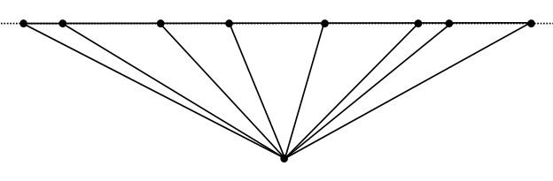

## Slide-by-slide digestion

### p. 300 - Lower bounds
- The proximity problems we have defined can be transformed
- into each other as follows:
- ELEMENT
- CLOSEST
- ALL NEAREST
- UNIQUENESS
- PAIR
- NEIGHBORS
- Ω(N log N)
- SORTING

p. 301 - Search problems
- BINARY SEARCH ∝O(1) NEAREST NEIGHBOR SEARCH
- BINARY SEARCH ∝O(1) k-NEAREST NEIGHBORS
- Preparata defines BINARY SEARCH in a slightly unusual way,
- apparently to simplify the lower bounds proof.
- BINARY SEARCH
- INSTANCE: Set S = {x1, x2, ..., xN} of N real numbers and
- query real number q.
- Assume that for 1≤i, j ≤N, i < j ⇔xi < xj (preprocessing).
- QUESTION (Usual): Find xi such that xi ≤q < xi+1.
- QUESTION (Preparata): Find xi closest to q.

p. 302 - BINARY SEARCH has lower bound in Ω(log N).
- Transform BINARY SEARCH
- to NEAREST NEIGHBOR SEARCH as follows:
- 1. Transform instance of BINARY SEARCH:
- S = {x1, x2, ..., xN} and q
- to an instance of NEAREST NEIGHBOR SEARCH:
- S′ = {(x1,0), (x2,0), ..., (xN,0)} and q′ = (q,0). O(N) time.
- 2. Solve NEAREST NEIGHBOR SEARCH for S′ and q′;
- let (xi,0) be the solution.
- 3. Transform solution point (xi,0) to real number xi,
- which is the solution to BINARY SEARCH. O(1) time.

p. 303 - But, there seems to be a problem with this proof,
- as given in Preparata, p. 193:
- The O(N) transformation dominates the Ω(log N) lower bound,
- voiding the result.
- We can get around that by considering the 1-dimensional version
- of NEAREST NEIGHBOR SEARCH, which has an instance
- identical to the instance of BINARY SEARCH.
- This resolution still has two difficulties:
- 1. It assumes that 2-dimensional NEAREST NEIGHBOR
- SEARCH has the same lower bound as the 1-dimensional
- version (this is probably easily proven).

p. 304 - ELEMENT UNIQUENESS has lower bound in Ω(N log N).
- Transform ELEMENT UNIQUENESS
- to CLOSEST PAIR as follows:
- 1. Transform instance of ELEMENT UNIQUENESS:
- S = {x1, x2, ..., xN}
- to an instance of CLOSEST PAIR:
- S′ = {(x1,0), (x2,0), ..., (xN,0)}. O(N) time.
- 2. Solve CLOSEST PAIR for S′;
- let (xi,0) and (xj,0) be the solution (the two closest points).
- 3. Transform this into a solution to ELEMENT UNIQUENESS:
- If xi = xj, return FALSE, else return TRUE.

p. 305 - All nearest neighbors
- CLOSEST PAIR has lower bound in Ω(N log N).
- Transform CLOSEST PAIR
- to ALL NEAREST NEIGHBORS as follows:
- 1. An instance of CLOSEST PAIR:
- S = {p1, p2, ..., pN}
- is an instance of ALL NEAREST NEIGHBORS:
- S = {p1, p2, ..., pN}. O(0) time.
- 2. Solve ALL NEAREST NEIGHBORS for S;
- let A = {(p1,q1), (p2,q2), …, (pN,qN)} be the solution
- (qi ∈S, a nearest neighbor for each point in S).

p. 306 - Euclidean minimum spanning tree
- SORTING has lower bound in Ω(N log N).
- Transform SORTING
- to EUCLIDEAN MINIMUM SPANNING TREE (EMST) as follows:
- 1. An instance of SORTING:
- S = {x1, x2, ..., xN}
- to an instance of EMST:
- S′ = {(x1,0), (x2,0), ..., (xN,0)}. O(N) time.
- 2. Solve EMST for S′.
- A set of points along the x axis has a unique EMST,
- where there is an edge ((xi,0),(xj,0))

p. 307 - Triangulation
- SORTING has lower bound in Ω(N log N).
- Transform SORTING to TRIANGULATION as follows:
- 1. An instance of SORTING:
- S = {x1, x2, ..., xN}
- to an instance of TRIANGULATION:
- S′ = {(x1,0), (x2,0), ..., (xN,0)} ∪{(0,-1)}. O(N) time.
- 2. Solve TRIANGULATION for S′.
- Set of points S′ has a unique triangulation,
- shown in the figure.
- Let T = {(xi1,xj1), (xi2,xj2), …, (xiN,xjN)} be the solution

What you must be able to say or do in an exam
- State the claim precisely before giving the argument.
- Identify the known lower bound / recurrence / invariant you are using.
- Keep the direction of the argument correct.
- End with the exact asymptotic conclusion.

Complexity and performance facts
Course claim: these proximity problems inherit Ω(N log N) lower bounds in the standard model.

## Common mistakes and danger points
- Students often reverse the reduction direction or produce an algorithm instead of a reduction proof.
- Output extraction must actually reconstruct the original problem answer.

Professor emphasis from recordings
These points are distilled from the related recordings and focus on what the professor slowed down for, warned about, or connected to homework/exam reasoning.

- Again the professor returns to transformation direction: to transfer a lower bound, you need a fast transformation from the known-hard problem to the target problem.
- A classic trap mentioned in lecture is proposing a transformation whose conversion step is already too expensive, which destroys the claimed lower bound.

Exam-style drills and answer skeletons
Existing drill reminders from the earlier pack:
- Show element uniqueness ≤ closest pair using an explicit input and output transformation.
- Show closest pair ≤ all nearest neighbors and conclude a lower bound.
- Explain why a failed reverse transformation does not disprove the correct reduction direction.

Lower-bound drill
**Question.** Use a problem transformation to transfer a known Ω(N log N) lower bound to another proximity problem.

**How to answer.** You must name the source problem, the target problem, the transformation cost, and the contradiction that would arise if the target were asymptotically faster.

### Proof drill
**Question.** Explain the main argument in proximity lower bounds and transformations in a logically correct order.

**How to answer.** Do not jump from intuition to conclusion. State the reduction/invariant/recurrence first, then derive the claimed bound.

## Recap
### What you must know cold
- How reductions transfer lower bounds among element uniqueness, closest pair, all nearest neighbors, EMST, and triangulation.
- Input transformation vs output extraction.
- Why transformation direction matters.
Core test / key idea
- For example, element uniqueness reduces to closest pair by mapping x_i to points (x_i,0). Duplicate numbers produce zero-distance pairs.
- Closest pair can reduce to all-nearest-neighbors by scanning the nearest-neighbor pairs for the minimum distance.
- The transformation cost must not dominate the lower bound you want to transfer.
Complexity
- Course claim: these proximity problems inherit Ω(N log N) lower bounds in the standard model.
Common mistakes / danger points
- Students often reverse the reduction direction or produce an algorithm instead of a reduction proof.
- Output extraction must actually reconstruct the original problem answer.
Professor emphasis (from recordings)
- Again the professor returns to transformation direction: to transfer a lower bound, you need a fast transformation from the known-hard problem to the target problem.
- A classic trap mentioned in lecture is proposing a transformation whose conversion step is already too expensive, which destroys the claimed lower bound.
End-of-file summary
- How reductions transfer lower bounds among element uniqueness, closest pair, all nearest neighbors, EMST, and triangulation.
- Input transformation vs output extraction.
- Why transformation direction matters.
- Course claim: these proximity problems inherit Ω(N log N) lower bounds in the standard model.
- Students often reverse the reduction direction or produce an algorithm instead of a reduction proof.
- Output extraction must actually reconstruct the original problem answer.

Everything related to this topic
- **Previous file in reading order:** [Proximity problem family: survey and relations](04_Proximity/47_proximity-problem-survey.md)
- **Next file in reading order:** [Closest pair: problem setup and 1D version](04_Proximity/49_closest-pair-setup-1d.md)
- **Source slide range:** pp. 300-307 of `comp_geometry_slides_new.pdf`
- **Related recordings:** CS 564 - 03.11 14.1.txt, CS 564 - 03.13 15.1a.txt, CS 564 - 03.13 15.1b.txt, CS 564 - 03.25 16.1.txt, Mar 13, 1.47 PM​.txt
- **Related homework-derived exam prompts included here:** Lower-bound drill


---

# Closest pair: problem setup and 1D version

## Scope
- **Slides:** pp. 308-313
- **Major topic folder:** proximity
- **Recording files touching this material:** CS 564 - 03.13 15.2.txt, CS 564 - 03.25 16.1.txt, Mar 13, 2.34 PM​.txt
- **Goal of this file:** You should be able to study this topic without reopening the slide deck.

Big picture
This file sets up the closest-pair algorithm by solving the easy 1D case first and then using divide and conquer as the template for 2D.

## What you must know cold
- Closest pair problem statement.
- 1D closest pair after sorting: adjacent points only need to be checked.
- How divide and conquer splits the 2D set by median x-coordinate.

Core ideas and reasoning
- In 1D, once points are sorted, the closest pair must be adjacent in sorted order.
- This suggests that order structure can drastically reduce comparisons.
- In 2D, divide into left and right halves, solve recursively, then handle cross-border pairs in the merge step.

Figures to actually look at
These are cropped from the main slide PDF. Do not skip them.

### Figure from slide p. 308


## Slide-by-slide digestion

### p. 308 - CLOSEST PAIR
- INSTANCE: Set S = {p1, p2, ..., pN} of N points in the plane.
- QUESTION: Determine the two points of S whose mutual
- distance is smallest.
- We’ve seen a proof that CLOSEST PAIR has a lower bound for
- time ∈Ω(N log N).
- We seek an algorithm with upper bound ∈O(N log N).
- If found, these together imply that CLOSEST PAIR ∈θ(N log N).
- Two algorithm paradigms come to mind for O(N log N):
- 1. Sorting
- 2. Divide-and-conquer

p. 309 - Using the divide-and-conquer paradigm,
- time in O(N log N) can be achieved by:
- 1. Dividing the problem into two equal-sized subproblems
- 2. Solving those subproblems recursively
- 3. Merging the subproblem solutions into an overall solution
- in linear O(N) time.
- Unfortunately, it is not immediately obvious how
- to perform the merge in linear time.
- Suppose the problem has been solved for subproblem sets S1 and S2,
- where S1 ∪S2 = S, S1 ∩S2 = ∅, |S1| ≈|S2| ≈N/2;
- giving a closest pair of points for S1 and another for S2.

p. 310 - We consider a divide-and-conquer algorithm for CLOSEST PAIR
- in 1 dimension (d = 1).
- Partition S, a set of points on a line, into two sets S1 and S2
- at some point m such that for every point p ∈S1 and q ∈S2, p < q.
- Solving CLOSEST PAIR recursively on S1 and S2
- separately produces {p1, p2}, the closest pair in S1,
- and {q1, q2}, the closest pair in S2.
- Let δ be the smallest distance found so far:
- δ = min(|p2 - p1|, |q2 - q1|)
- The closest pair in S is either {p1, p2} or {q1, q2}
- or some {p3, q3} with p3 ∈S1 and q3 ∈S2.

p. 311 - Divide-and-conquer for d = 1, 2
- To check for such a point {p3, q3}, is it necessary to test
- every possible pair of points in S1 and S2?
- Note that if {p3, q3} is to be closer than δ (i.e., |q3 - p3| < δ),
- then both p3 and q3 must be within δ of m.
- How many points of S1 can lie within δ of m,
- i.e., within the interval (m - δ, m]?
- Because δ is the distance between the closest pair in either S1 or S2,
- a semi-closed interval of length δ can contain at most 1 point.
- For the same reason, there can be at most 1 point of S2
- within δ of m, i.e., in the interval [m, m + δ).

p. 312 - procedure CPAIR1(S)
- Input: X[1:N], N points of S in one dimension.
- Output: δ, the distance between the two closest points.

```text
begin
(|S| = 2) then
δ = |X[2] - X[1]|
else if (|S| = 1) then
δ = ∞
Construct(S1, S2) /* S1 = {p: p ≤m}, S2 = {p: p > m} */
δ1 = CPAIR1(S1)
δ2 = CPAIR1(S2)
```

### p. 313 - Generalizing to d = 2
- Partition two dimensional set S into subsets S1 and S2
- such that every point of S1 lies to the left of every point of S2.
- To do so, cut S by vertical line l at the median x coordinate of S.
- Solve the problem recursively on S1 and S2.
- Let {p1, p2} be the closest pair in S1 and {q1, q2} in S2.
- δ1 = distance(p1,p2) and δ2 = distance(q1,q2)
- are the minimum separations in S1 and S2 respectively.
- δ = min(δ1, δ2)
- Proximity
- Closest pair, divide-and-conquer

What you must be able to say or do in an exam
- State the input, output, preprocessing, and query/update model precisely.
- Explain the invariant or ordering that makes the method work.
- Trace the method by hand on a small example.
- Give the exact time and space bounds.
- Mention one edge case, degeneracy, or limitation.

Complexity and performance facts
1D: O(N log N) by sorting then linear scan, or O(N) after presorted input.

## Common mistakes and danger points
- Do not assume sorting by one coordinate alone solves the 2D problem. The merge step is the real content.

Professor emphasis from recordings
These points are distilled from the related recordings and focus on what the professor slowed down for, warned about, or connected to homework/exam reasoning.

- The 1D closest-pair version is used in lecture as the warm-up that makes the divide-and-conquer recurrence feel obvious before the 2D merge complication appears.

Exam-style drills and answer skeletons
Existing drill reminders from the earlier pack:
- For points on a line, prove why only predecessor and successor can be closest candidates.
- Describe how an ordered structure can answer nearest-neighbor-on-a-line queries.
- Adapted from HW2-Q2: For points on one axis stored in a range tree, find the closest neighbor in O(log N), then augment the structure to answer in O(1).

Closest-pair setup drill
**Question.** State the divide-and-conquer recurrence for closest pair and explain the easy 1D version completely.

**How to answer.** In 1D the closest pair is adjacent after sorting; in higher dimensions the merge is the hard part.

### Core exam drill
**Question.** State the problem solved by closest pair: problem setup and 1d version, describe preprocessing/query/update steps if any, and give the time and space bounds.

**How to answer.** An excellent answer names the input, the output, the invariant or ordering exploited by the method, and the exact asymptotic costs.

### Hand-trace drill
**Question.** Trace closest pair: problem setup and 1d version on a small example by hand and explain each comparison or structural change.

**How to answer.** On this course, being able to run the method on a picture matters more than writing vague slogans.

## Recap
### What you must know cold
- Closest pair problem statement.
- 1D closest pair after sorting: adjacent points only need to be checked.
- How divide and conquer splits the 2D set by median x-coordinate.
Core test / key idea
- In 1D, once points are sorted, the closest pair must be adjacent in sorted order.
- This suggests that order structure can drastically reduce comparisons.
- In 2D, divide into left and right halves, solve recursively, then handle cross-border pairs in the merge step.
Complexity
- 1D: O(N log N) by sorting then linear scan, or O(N) after presorted input.
Common mistakes / danger points
- Do not assume sorting by one coordinate alone solves the 2D problem. The merge step is the real content.
Professor emphasis (from recordings)
- The 1D closest-pair version is used in lecture as the warm-up that makes the divide-and-conquer recurrence feel obvious before the 2D merge complication appears.
End-of-file summary
- Closest pair problem statement.
- 1D closest pair after sorting: adjacent points only need to be checked.
- How divide and conquer splits the 2D set by median x-coordinate.
- 1D: O(N log N) by sorting then linear scan, or O(N) after presorted input.
- Do not assume sorting by one coordinate alone solves the 2D problem. The merge step is the real content.
- The 1D closest-pair version is used in lecture as the warm-up that makes the divide-and-conquer recurrence feel obvious before the 2D merge complication appears.

Everything related to this topic
- **Previous file in reading order:** [Proximity lower bounds and transformations](04_Proximity/48_proximity-lower-bounds.md)
- **Next file in reading order:** [Closest pair: 2D merge step](04_Proximity/50_closest-pair-2d-merge.md)
- **Source slide range:** pp. 308-313 of `comp_geometry_slides_new.pdf`
- **Related recordings:** CS 564 - 03.13 15.2.txt, CS 564 - 03.25 16.1.txt, Mar 13, 2.34 PM​.txt
- **Related homework-derived exam prompts included here:** Closest-pair setup drill


---

# Closest pair: 2D merge step

## Scope
- **Slides:** pp. 314-319
- **Major topic folder:** proximity
- **Recording files touching this material:** CS 564 - 03.13 15.2.txt, CS 564 - 03.25 16.1.txt, Mar 13, 2.34 PM​.txt
- **Goal of this file:** You should be able to study this topic without reopening the slide deck.

Big picture
This is the heart of the closest-pair algorithm. The recursive halves are easy. The strip argument is where the theorem lives.

## What you must know cold
- After recursive calls return δ, only points within distance δ of the dividing line can form a cross pair.
- Sort or maintain strip points by y-coordinate.
- Each strip point needs to be compared with only a constant number of following points.

Core ideas and reasoning
- Let δ = min(δ_L, δ_R). Any cross pair closer than δ must lie in the vertical strip of width 2δ around the divide.
- Within that strip, geometric packing shows each point needs comparison with only a bounded number of later points in y-order.
- That bounded-neighbor fact turns the merge from quadratic into linear.

Figures to actually look at
These are cropped from the main slide PDF. Do not skip them.

### Figure from slide p. 315


### Figure from slide p. 317


## Slide-by-slide digestion

### p. 314 - Where is the closest pair?
- To perform the merge, it must be determined if there is a pair
- of points {p, q} such that p ∈ S1 and q ∈ S2 and distance(p, q) < δ.
- If such a pair exists, then p and q must both be within δ of l.
- Let P1 and P2 be vertical strips (regions) of the plane of width δ
- on either side of l.
- If {p, q} exists, p must be within P1 and q within P2.
- For d = 1, there was at most one candidate point for p and one for q.
- For d = 2, every point in S1 and S2 may be a candidate,
- as long as each is within δ of l.
- This seems to imply that O(N/2) ⋅ O(N/2) ∈ O(N2)

p. 315 - Closing in on the closest pair
- But is it really necessary for some p ∈S1 and within P1,
- to determine the distance to every point q ∈S2 and within P2?
- No. We really only need to do so for those points
- that are within δ of p.
- Thus we can bound the portion of P2 to consider by that distance.
- The points to consider for a point p must lie within
- the δ × 2δ rectangle R.
- Proximity
- Closest pair, divide-and-conquer

p. 316 - Distance computations required
- How many points can there be in rectangle R?
- Recall that no two points in P2 are closer than δ.
- Because rectangle R has size δ × 2δ,
- there can be at most 6 points within it;
- any more and they would be closer than δ, a contradiction.
- This means that for each of the O(N/2) points p ∈S1 within P1,
- only 6 points must be checked, not O(N/2) for each,
- so 6 ⋅O(N/2) = O(3N) ∈O(N) distance comparisons are needed
- in the merge step, not O(N2).
- ⇒An O(N log N) algorithm for CLOSEST PAIR is possible.

p. 317 - Proximity
- Closest pair, divide-and-conquer
- Which points much be checked?
- Though an O(N log N) algorithm is possible, we do not have it yet.
- Though we know that for a point p, only 6 points within P2
- must be checked, we do not yet know which six.
- Project p and all the points of S2 within P2 onto l.
- Only the points within δ of p in that projection (y coordinate)
- need be considered; as seen, there will be ≤ 6.
- By sorting the points of S in order on y coordinate,
- the nearest neighbor candidates for a point p can be found

p. 318 - Algorithm from Preparata, p. 198:
- 1. Partition S into two subsets, S1 and S2,
- about the vertical median line l.
- 2. Find the closest pair separations δ1 and δ2 recursively.
- 3. δ = min(δ1, δ2)
- 4. Let P1 be the set of points of S1 that are within δ of the
- dividing line l and let P2 be the corresponding subset of S2.
- Project P1 and P2 onto l and sort by y coordinate.
- Let P1
- * and P2
- * be the two sorted sequences, respectively.

p. 319 - Merge process algorithm
- Preparata p. 199 says: “… when executing Step 4, extract the
- points from the list in sorted order in only O(N) time.”
- One way to assemble P1
- *, for example, follows.
- Let Y be the presorted points of S, i.e., an array of size N
- storing the points of S in order by ascending y coordinate;
- each entry has three fields: x, y, and active.
- Let P1
- * be an array of size N with two fields: index and y.

```text
1 for i = 1 to N /* Initialize P1
```

## What you must be able to say or do in an exam
- State the input, output, preprocessing, and query/update model precisely.
- Explain the invariant or ordering that makes the method work.
- Trace the method by hand on a small example.
- Give the exact time and space bounds.
- Mention one edge case, degeneracy, or limitation.

Complexity and performance facts
Merge O(N) after maintaining the needed coordinate order; full recurrence gives O(N log N).

## Common mistakes and danger points
- Do not compare every strip point with every other strip point.
- The constant-neighbor argument depends on the recursive δ guarantee inside each half.

Professor emphasis from recordings
These points are distilled from the related recordings and focus on what the professor slowed down for, warned about, or connected to homework/exam reasoning.

- The whole lecture pressure point is the merge step: without a linear merge, divide-and-conquer gives you an ugly algorithm instead of an optimal one.
- He emphasizes the packing argument in the strip. You are not allowed to just say 'check a few points'; you need the geometric reason that only a constant number matter.
- The sorted-by-y view is not an implementation detail. It is what lets the merge remain linear.
- Closest-pair merge pitfall: when extracting the 'active' points for the merge, mark only points in the strip (within the `delta` neighborhood of the dividing line), not every point from one recursive half.

Exam-style drills and answer skeletons
Existing drill reminders from the earlier pack:
- State and justify the strip lemma used in the closest-pair merge step.
- Trace the merge step on a small point set and show which comparisons are actually made.
- Adapted from HW2-Q2: For points on one axis stored in a range tree, find the closest neighbor in O(log N), then augment the structure to answer in O(1).

Closest-pair merge drill
**Question.** In the 2D closest-pair algorithm, explain why only a constant number of candidates per point need to be checked in the strip.

**How to answer.** Use the δ-by-2δ strip geometry and the packing argument. The proof is not optional on an exam.

### Core exam drill
**Question.** State the problem solved by closest pair: 2d merge step, describe preprocessing/query/update steps if any, and give the time and space bounds.

**How to answer.** An excellent answer names the input, the output, the invariant or ordering exploited by the method, and the exact asymptotic costs.

### Hand-trace drill
**Question.** Trace closest pair: 2d merge step on a small example by hand and explain each comparison or structural change.

**How to answer.** On this course, being able to run the method on a picture matters more than writing vague slogans.

## Recap
### What you must know cold
- After recursive calls return δ, only points within distance δ of the dividing line can form a cross pair.
- Sort or maintain strip points by y-coordinate.
- Each strip point needs to be compared with only a constant number of following points.
Core test / key idea
- Let δ = min(δ_L, δ_R). Any cross pair closer than δ must lie in the vertical strip of width 2δ around the divide.
- Within that strip, geometric packing shows each point needs comparison with only a bounded number of later points in y-order.
- That bounded-neighbor fact turns the merge from quadratic into linear.
Complexity
- Merge O(N) after maintaining the needed coordinate order; full recurrence gives O(N log N).
Common mistakes / danger points
- Do not compare every strip point with every other strip point.
- The constant-neighbor argument depends on the recursive δ guarantee inside each half.
Professor emphasis (from recordings)
- The whole lecture pressure point is the merge step: without a linear merge, divide-and-conquer gives you an ugly algorithm instead of an optimal one.
- He emphasizes the packing argument in the strip. You are not allowed to just say 'check a few points'; you need the geometric reason that only a constant number matter.
- The sorted-by-y view is not an implementation detail. It is what lets the merge remain linear.
- Closest-pair merge pitfall: when extracting the 'active' points for the merge, mark only points in the strip (within the `delta` neighborhood of the dividing line), not every point from one recursive half.
End-of-file summary
- After recursive calls return δ, only points within distance δ of the dividing line can form a cross pair.
- Sort or maintain strip points by y-coordinate.
- Each strip point needs to be compared with only a constant number of following points.
- Merge O(N) after maintaining the needed coordinate order; full recurrence gives O(N log N).
- Do not compare every strip point with every other strip point.
- The constant-neighbor argument depends on the recursive δ guarantee inside each half.

Everything related to this topic
- **Previous file in reading order:** [Closest pair: problem setup and 1D version](04_Proximity/49_closest-pair-setup-1d.md)
- **Next file in reading order:** [Closest pair: analysis and higher dimensions](04_Proximity/51_closest-pair-analysis.md)
- **Source slide range:** pp. 314-319 of `comp_geometry_slides_new.pdf`
- **Related recordings:** CS 564 - 03.13 15.2.txt, CS 564 - 03.25 16.1.txt, Mar 13, 2.34 PM​.txt
- **Related homework-derived exam prompts included here:** Closest-pair merge drill


---

# Closest pair: analysis and higher dimensions

## Scope
- **Slides:** pp. 320-321
- **Major topic folder:** proximity
- **Recording files touching this material:** CS 564 - 03.13 15.2.txt, CS 564 - 03.25 16.1.txt, Mar 13, 2.34 PM​.txt
- **Goal of this file:** You should be able to study this topic without reopening the slide deck.

Big picture
This final in-scope page closes the recurrence and points forward to higher dimensions. The key fact is that the algorithm matches the lower bound.

## What you must know cold
- Recurrence T(N) = 2T(N/2) + O(N) after presorting / stable maintenance.
- Solution T(N) = O(N log N).
- Idea of higher-dimensional extension via sparsity/packing.

Core ideas and reasoning
- Since the merge is linear and the recursion is balanced, the Master-Theorem style solution is O(N log N).
- Combined with the Ω(N log N) lower bound, closest pair is θ(N log N) in 2D.

Slide-by-slide digestion

### p. 320 - Analysis
- Let T(N) be the running time of the algorithm on N points.
- The steps of CPAIR2 require:
- 1. O(N)
- 2. 2T(N/2)
- 3. O(1)
- 4. O(N)
- 5. O(N)
- 6. O(1)
- Thus, T(N) = 2T(N/2) + O(N) ∈O(N log N).
- The presort of S on y coordinate also requires O(N log N) time.

p. 321 - Preparata p. 199-204 discusses solving CLOSEST PAIR using a
- divide-and-conquer algorithm for d > 3.
- The approach depends on the notion of sparsity,
- a measure of how many points can be in a d-dimensional
- hypercube with sides that measure 2.
- We made use of sparsity in the d = 1 and d = 2 case.
- The result is that the closest pair of points in a set of N points
- in Ed can be found in θ(N log N) time.
- Proximity
- Closest pair, divide-and-conquer

What you must be able to say or do in an exam
- State the claim precisely before giving the argument.
- Identify the known lower bound / recurrence / invariant you are using.
- Keep the direction of the argument correct.
- End with the exact asymptotic conclusion.

Complexity and performance facts
2D closest pair is optimal at θ(N log N).

## Common mistakes and danger points
- Do not forget that maintaining y-order efficiently is part of the full argument.
- Higher-dimensional extensions keep the same divide-and-conquer spirit but the packing constant changes.

Professor emphasis from recordings
These points are distilled from the related recordings and focus on what the professor slowed down for, warned about, or connected to homework/exam reasoning.

- The concluding point is that the recurrence solves to O(N log N) because the merge is linear; if you lose that fact, the whole optimality story collapses.
- You should also be ready to state how the dimension changes the constant/packing argument instead of pretending 2D and higher dimensions are identical.

Exam-style drills and answer skeletons
### Proof drill
**Question.** Explain the main argument in closest pair: analysis and higher dimensions in a logically correct order.

**How to answer.** Do not jump from intuition to conclusion. State the reduction/invariant/recurrence first, then derive the claimed bound.

## Recap
### What you must know cold
- Recurrence T(N) = 2T(N/2) + O(N) after presorting / stable maintenance.
- Solution T(N) = O(N log N).
- Idea of higher-dimensional extension via sparsity/packing.
Core test / key idea
- Since the merge is linear and the recursion is balanced, the Master-Theorem style solution is O(N log N).
- Combined with the Ω(N log N) lower bound, closest pair is θ(N log N) in 2D.
Complexity
- 2D closest pair is optimal at θ(N log N).
Common mistakes / danger points
- Do not forget that maintaining y-order efficiently is part of the full argument.
- Higher-dimensional extensions keep the same divide-and-conquer spirit but the packing constant changes.
Professor emphasis (from recordings)
- The concluding point is that the recurrence solves to O(N log N) because the merge is linear; if you lose that fact, the whole optimality story collapses.
- You should also be ready to state how the dimension changes the constant/packing argument instead of pretending 2D and higher dimensions are identical.
End-of-file summary
- Recurrence T(N) = 2T(N/2) + O(N) after presorting / stable maintenance.
- Solution T(N) = O(N log N).
- Idea of higher-dimensional extension via sparsity/packing.
- 2D closest pair is optimal at θ(N log N).
- Do not forget that maintaining y-order efficiently is part of the full argument.
- Higher-dimensional extensions keep the same divide-and-conquer spirit but the packing constant changes.

Everything related to this topic
- **Previous file in reading order:** [Closest pair: 2D merge step](04_Proximity/50_closest-pair-2d-merge.md)
- **Source slide range:** pp. 320-321 of `comp_geometry_slides_new.pdf`
- **Related recordings:** CS 564 - 03.13 15.2.txt, CS 564 - 03.25 16.1.txt, Mar 13, 2.34 PM​.txt
- **Related homework-derived exam prompts included here:** none directly mapped; generic exam drills added instead


---

