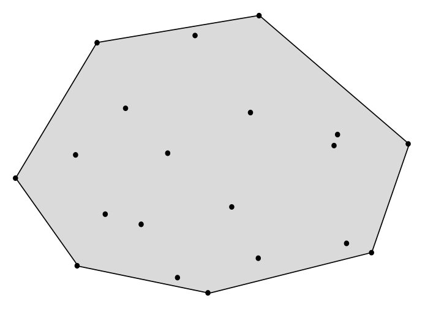
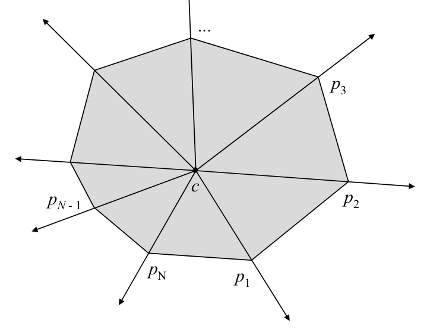

# Extreme points algorithm

## Scope
- **Slides:** pp. 202-205
- **Major topic folder:** convex-hulls
- **Recording files touching this material:** CS 564 - 02.20 9.2.txt, CS 564 - 02.25 10.1.txt
- **Goal of this file:** You should be able to study this topic without reopening the slide deck.

## Big picture
This is the brute-force hull algorithm you study mostly to understand what efficient algorithms are trying to avoid.

## What you must know cold
- Extreme points are the minimal subset whose hull is the full hull.
- A point is non-extreme if it lies inside some triangle formed by other input points.
- Brute-force test by checking many triangles.

## Core ideas and reasoning
- For each point p, ask whether p lies inside any triangle determined by other points.
- If yes, p cannot be a hull vertex.
- Collect all extreme points, then order them angularly to obtain the hull.

## Figures to actually look at
These are cropped from the main slide PDF. Do not skip them.

### Figure from slide p. 202

### Figure from slide p. 205

## Slide-by-slide digestion

### p. 202 - Extreme points algorithm
- Extreme points
- A point p of a convex set S is an extreme point if no two points
- a, b ∈S exist such that p lies on the open segment ab.
- Extreme points and the convex hull
- The set E of extreme points of S (E ⊆S) is the smallest subset of S
- such that H(E) = H(S).
- E is the set of vertices of H(S).
- This suggests an algorithm for CONVEX HULL:
- 1. Find the extreme points E of S.
- 2. Order the points E so that they form a convex polygon.

### p. 203 - Extreme points algorithm
- Determining if a point is an extreme point
- If we could determine whether a given point p ∈S was an
- extreme point in S, then we could find E by testing each point in S.
- Theorem. A point p fails to be an extreme point of a plane convex
- set S iff it lies in some triangle whose vertices are in S
- but is not itself one of the vertices of the triangle.
- p ∈E
- p ∉E

### p. 204 - Extreme points algorithm
- Determining if a point is an extreme point
- There are O(N3) triangles determined by the N points of S.
- Point enclosure in a triangle can be performed in O(1) time.
- To determine if p is an extreme point,
- test it for inclusion in each of the O(N3) triangles.
- If all fail, p ∈E.
- Doing so for each point p ∈S requires O(N4) time.
- (Determining extreme edges has O(N3 ) algorithm…see
- O’Rourke p.67)
- p ∈E

### p. 205 - Extreme points algorithm
- Ordering the vertices of the hull
- E has been found (in O(N4)) time.
- We already know that the vertices of a convex polygon
- occur in sorted order around any interior point.
- Find a point c interior to H(S) by computing the centroid of S. O(N)
- For each point p ∈E, compute the polar angle from c to p. O(N)
- Sort the points of E on polar angle. O(N log N)
- Overall time complexity for this algorithm: O(N4).

## What you must be able to say or do in an exam
- State the input, output, preprocessing, and query/update model precisely.
- Explain the invariant or ordering that makes the method work.
- Trace the method by hand on a small example.
- Give the exact time and space bounds.
- Mention one edge case, degeneracy, or limitation.

## Complexity and performance facts
Naive version is O(N^4) or similar brute-force order depending on the exact implementation and ordering step.

## Common mistakes and danger points
- Finding extreme points is not enough; you still need them in boundary order to output the hull.

## Exam-style drills and answer skeletons
Existing drill reminders from the earlier pack:
- Given a simple polygon in boundary order, explain why a general point-set hull algorithm is wasteful and why a linear-time polygon-specific method can do better.
- Adapted from HW2-Q5: Given vertices of a non-convex simple polygon in clockwise order, find its convex hull in O(N).

### Core exam drill
**Question.** State the problem solved by extreme points algorithm, describe preprocessing/query/update steps if any, and give the time and space bounds.

**How to answer.** An excellent answer names the input, the output, the invariant or ordering exploited by the method, and the exact asymptotic costs.

### Hand-trace drill
**Question.** Trace extreme points algorithm on a small example by hand and explain each comparison or structural change.

**How to answer.** On this course, being able to run the method on a picture matters more than writing vague slogans.

## Recap
### What you must know cold
- Extreme points are the minimal subset whose hull is the full hull.
- A point is non-extreme if it lies inside some triangle formed by other input points.
- Brute-force test by checking many triangles.
### Core test / key idea
- For each point p, ask whether p lies inside any triangle determined by other points.
- If yes, p cannot be a hull vertex.
- Collect all extreme points, then order them angularly to obtain the hull.
### Complexity
- Naive version is O(N^4) or similar brute-force order depending on the exact implementation and ordering step.
### Common mistakes / danger points
- Finding extreme points is not enough; you still need them in boundary order to output the hull.
## End-of-file summary
- Extreme points are the minimal subset whose hull is the full hull.
- A point is non-extreme if it lies inside some triangle formed by other input points.
- Brute-force test by checking many triangles.
- Naive version is O(N^4) or similar brute-force order depending on the exact implementation and ordering step.
- Finding extreme points is not enough; you still need them in boundary order to output the hull.

## Everything related to this topic
- **Previous file in reading order:** [Lower bound for convex hull via reduction from sorting](../convex-hulls/34_convex-hull-lower-bound.md)
- **Next file in reading order:** [Graham’s scan: concept and preparation](../convex-hulls/36_graham-scan-algorithm.md)
- **Source slide range:** pp. 202-205 of `comp_geometry_slides_new.pdf`
- **Related recordings:** CS 564 - 02.20 9.2.txt, CS 564 - 02.25 10.1.txt
- **Related homework-derived exam prompts included here:** none directly mapped; generic exam drills added instead